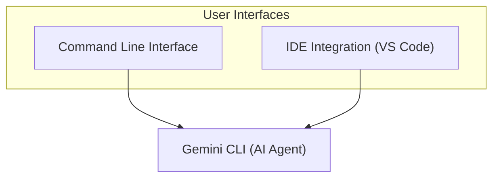

# AI Workflows vs. AI Agents: The Critical Decision Every Engineer Faces

Every AI engineer eventually faces a critical architectural decision: do you build a predictable, multi-step LLM workflow or a more autonomous, powerful AI agent? This choice is a fundamental trade-off between control and autonomy. Get it right, and you can ship a reliable product. Get it wrong, and you will be stuck in the Proof of Concept (PoC) purgatory, battling a system that is either too rigid to be useful or too unpredictable to be trusted.

## Understanding the Spectrum: From Workflows to Agents

The distinction between an AI workflow and an AI agent is best understood as a spectrum of autonomy. On one end, you have rule-based workflows, which are deterministic and fully controlled by the engineer. On the other end, you have autonomous agents that can reason, plan, and act on their own.

## Conclusion

The choice between an AI workflow and an AI agent is one of the most important architectural decisions you will make. It is a direct trade-off between the predictability of a controlled process and the power of an autonomous one. Workflows excel at well-defined, repeatable tasks where reliability is key. Agents are built for complex, dynamic problems that require reasoning and adaptation.
