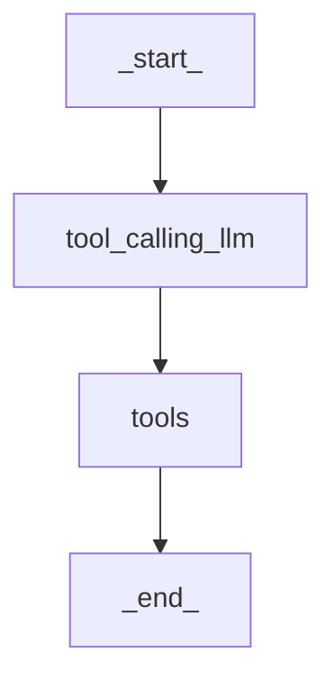
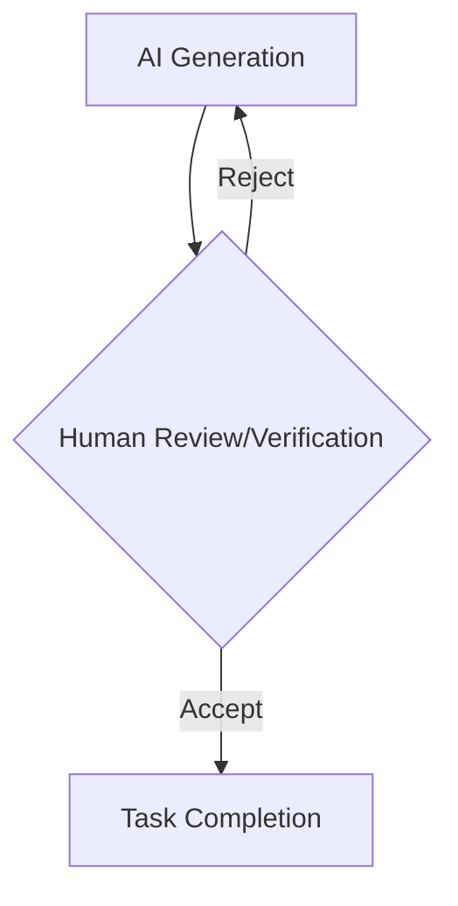
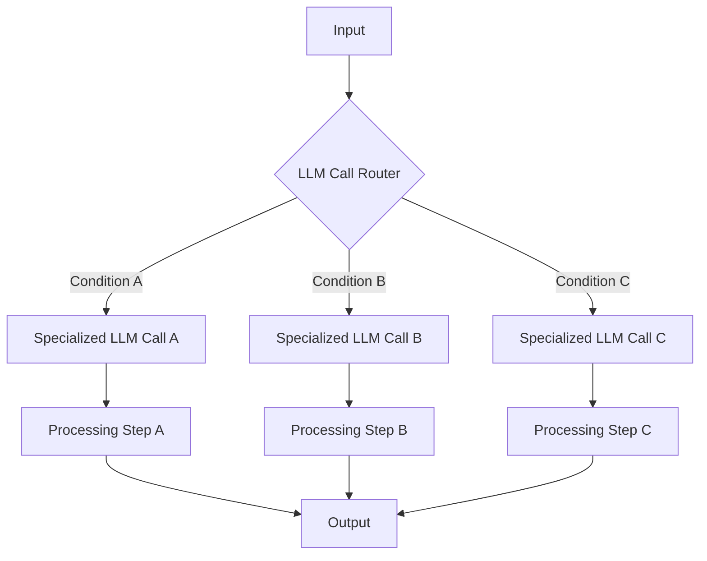
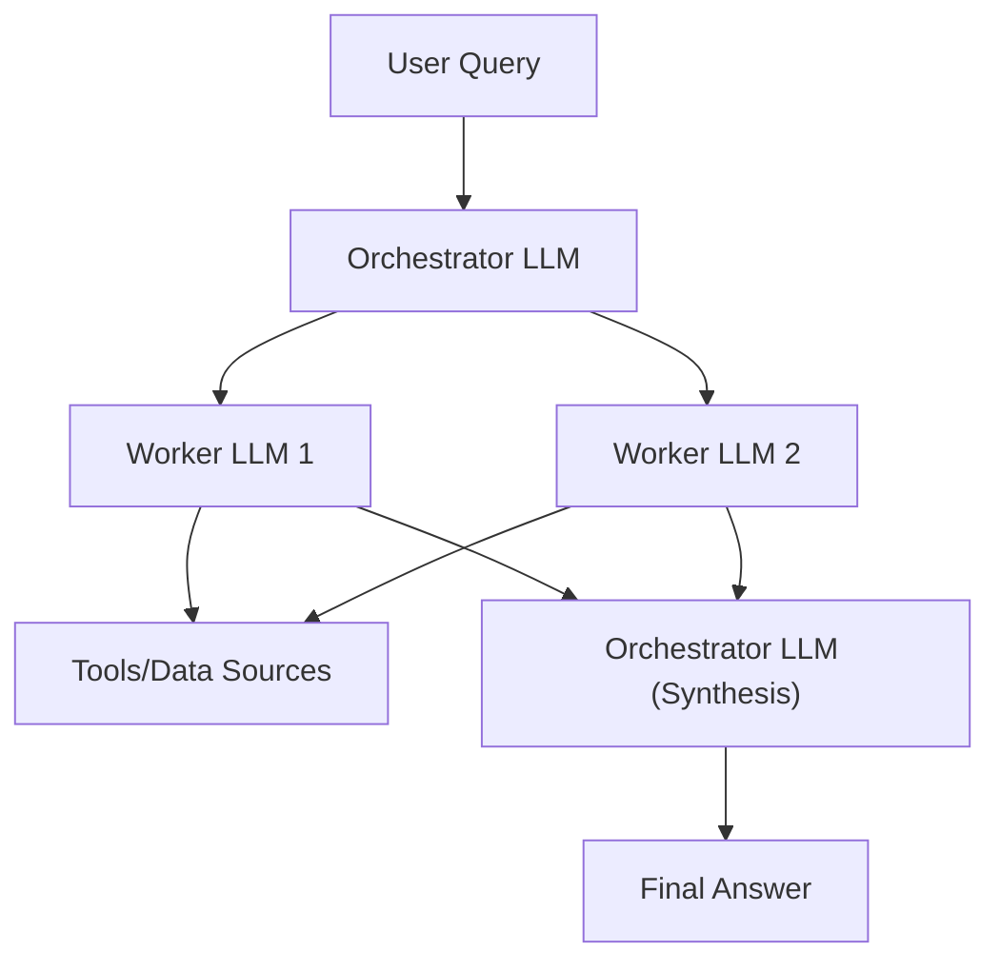
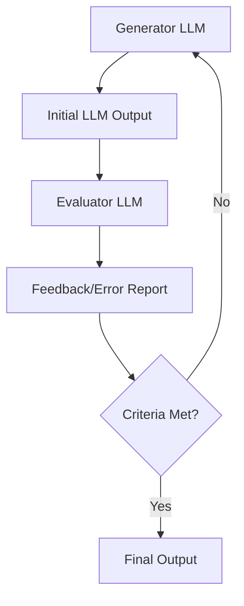
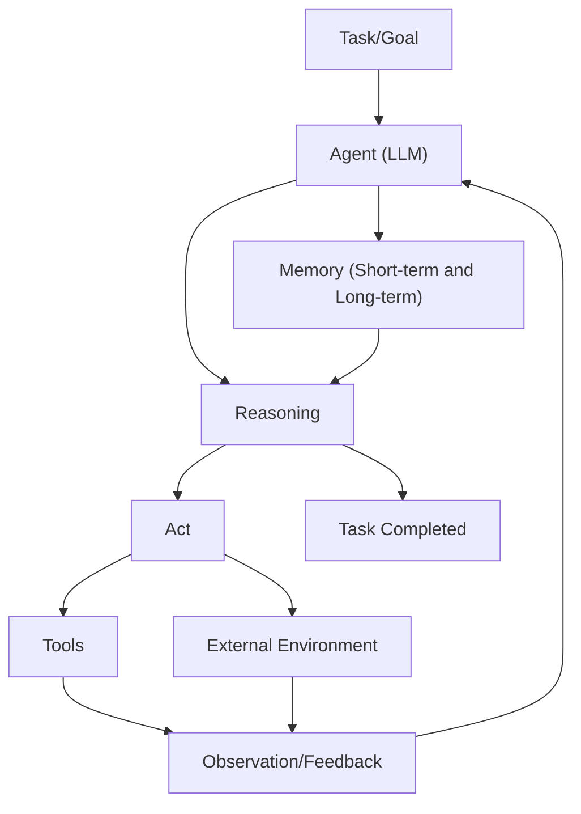
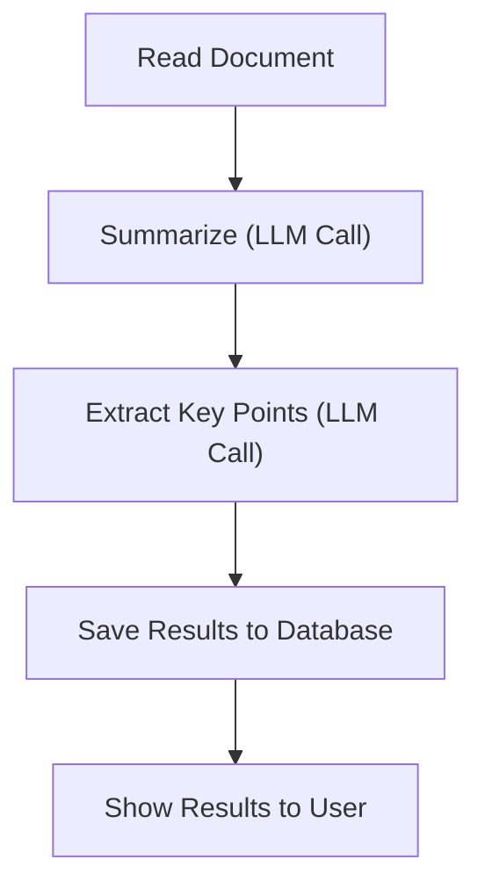
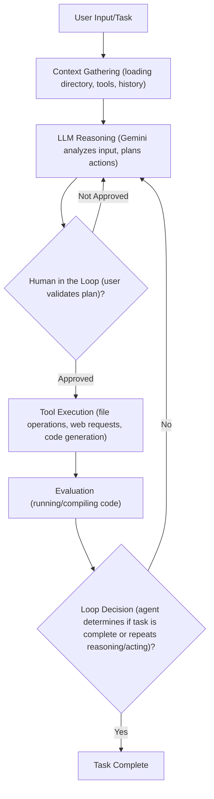
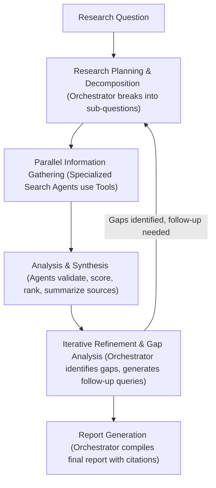

# The Decision Every AI Engineer Faces
### navigating the AI architecture spectrum: workflows vs. agents

Every AI engineer building applications faces a key architectural decision early in their development process. Should you create a predictable, step-by-step workflow where you control every action, or should you build an autonomous agent that can think and decide for itself? This choice impacts everything from development time and costs to reliability and user experience.

Choosing the wrong approach can lead to major problems. You might end up with an overly rigid system that breaks when users deviate from expected patterns or when developers try to add new features. Alternatively, you could build an unpredictable agent that works brilliantly most of the time but fails badly when it matters most. Both scenarios result in wasted development time, frustrated users, and executives worried about high operational costs relative to profits.

In 2024 and 2025, AI startups are succeeding or failing based on this architectural decision. Successful companies, teams, and AI engineers know when to use workflows versus agents, and more importantly, how to combine both approaches effectively. This lesson will help you understand these distinctions. You will be equipped to make informed architectural choices for your AI applications. We will explore the core differences between workflows and agents, when to use each, and how hybrid systems offer the best of both worlds.

## Understanding the Spectrum: From Workflows to Agents

To choose between workflows and agents, you need a clear understanding of what they are. We will explore their properties and typical uses without diving into deep technical specifics for now.

**LLM Workflows** are sequences of tasks that involve LLM calls or other operations, such as reading or writing data to a database or file system. Developer-written code largely orchestrates these workflows. Their steps are defined in advance. This results in deterministic or rule-based paths with predictable execution and explicit control flow.

Think of an LLM workflow as a factory assembly line, where each step is precisely engineered and follows a predefined order. In future lessons, we will explore concepts such as chaining, routing, and orchestrator-worker patterns.

Here is a simple LLM workflow.

Image 1: A flowchart illustrating a simple LLM workflow.

**AI Agents**, on the other hand, are systems where an LLM (or multiple LLMs) dynamically decides the sequence of steps, reasons, and takes actions to achieve a goal. The steps are not defined in advance but are dynamically planned based on the task and the current state of the environment. Agents are adaptive and capable of handling novelty, driven by LLM autonomy in decision-making and execution.

An AI agent is like a skilled human expert tackling an unfamiliar problem, adapting on the moment after each "Eureka" moment. In future lessons, we will explore agentic concepts such as tools, memory, and ReAct agents.

<https://substackcdn.com/image/fetch/f_auto,q_auto:good,fl_progressive:steep/https%3A%2F%2Fsubstack-post-media.s3.amazonaws.com%2Fpublic%2Fimages%2F67ffe267-55f2-4af7-9910-7410c7605550_1220x754.png>
Image 2: The components of an LLM-powered agent (Source [build-production-agentic-rag-with-llmops-at-its-core [6]](https://substackcdn.com/image/fetch/$s_!gLNT!,f_auto,q_auto:good,fl_progressive:steep/https%3A%2F%2Fsubstack-post-media.s3.amazonaws.com%2Fpublic%2Fimages%2F67ffe267-55f2-4af7-9910-7410c7605550_1220x754.png))

Both workflows and agents require an orchestration layer, but their nature differs. In workflows, the orchestration layer executes a defined plan. In agents, it facilitates the LLM's dynamic planning and execution. This distinction is important for understanding how each system operates and how they can be effectively managed.

## Choosing Your Path

We have defined LLM workflows and AI agents independently. Now, let's explore their core differences: developer-defined logic versus LLM-driven autonomy in reasoning and action selection.

<https://contributor.insightmediagroup.io/wp-content/uploads/2025/06/image-115.png>
Image 3: The spectrum of control from workflows to agents (Image by author from [A Developer’s Guide to Building Scalable AI: Workflows vs Agents [4]](https://towardsdatascience.com/a-developers-guide-to-building-scalable-ai-workflows-vs-agents/))

### When to Use LLM Workflows

LLM workflows excel when the problem structure is well-defined. This includes pipelines for data extraction and transformation from sources like the web, messaging tools such as Slack, video calls from Zoom, project management tools like Notion, and cloud storage tools like Google Drive. They are also ideal for automated report or email generation from multiple data sources.

Workflows can also help in understanding project requirements, creating or updating tasks in Notion, document summarization followed by translation, repetitive daily tasks like sending emails or social media updates, and content generation or repurposing.

The strengths of workflows include predictability, reliability for well-defined tasks, and easier debugging due to fixed paths. They can also result in lower operational costs because they can leverage simpler and smaller models specialized in given sub-tasks. This makes costs and latency more predictable. Ultimately, the infrastructure overhead is smaller.

Their weaknesses include potentially more development time due to manual engineering of each step. The user experience can be rigid, as workflows struggle to handle unexpected scenarios. Adding new features can also become complex as the application grows, similar to developing standard software tools.

Workflows are usually preferred in enterprises or regulated fields that require predictable programs. For example, in finance, a financial report requested by an advisor must contain accurate information all the time, as it directly impacts people's money and lives. Similarly, in healthcare, AI tools used in production require high accuracy to ensure they positively impact people's lives. Workflows are also ideal for Minimum Viable Products (MVPs) that require rapid deployment by hardcoding features. They are best for scenarios where the cost per request matters more than sophisticated reasoning, handling thousands of requests per minute.

### When to Use AI Agents

AI agents are suitable for open-ended research and synthesis, such as researching historical events like World War II. They also excel at dynamic problem-solving, like debugging code or handling complex customer support issues. Agents are also effective for interactive task completion in unfamiliar environments, such as booking a flight without specifying the exact websites to use.

Their main strength is adaptability to new situations and the flexibility to handle ambiguity and complexity, as the steps are dynamically decided. However, the system is more prone to errors. Because agents are non-deterministic, their performance, latency, and costs can vary with each call, making them often unreliable. Agents require LLMs that can generalize better, which are typically larger and more costly. This means adopting an agentic solution usually ends up being more expensive. AI agents often require more LLM calls to understand user intent and take various actions, further increasing costs per call. If not designed well, there can be major security concerns, especially with write operations, which could lead to deleting data or sending inappropriate emails. A substantial disadvantage of AI agents is their difficulty in debugging and evaluating. There are many funny stories of people having their code deleted by tools like Replit Agent or Claude Code, making jokes about it as "Anyway, I wanted to start a new project." [[2]](https://www.youtube.com/watch?v=kQxr-uOxw2o&t=1s)

### Hybrid Approaches and the Autonomy Slider

Most real-world systems blend elements of both approaches. In reality, we have a spectrum, a gradient between LLM workflows and AI agents, where a system adopts what is best from both worlds depending on its use cases. When building an application, you usually have an "autonomy slider" where you decide how much control to give to the LLM versus the user. As you make the system more manual, you typically use an LLM workflow together with a human who verifies intermediate steps. As you automate more, you give more control to the agent with fewer human-in-the-loop steps. Andrej Karpathy highlights this with examples like Cursor, where users can choose between `CMD+K` (change selected code), `CMD+L` (change entire file), or `CMD+I` (full autonomy for the entire repo), and Perplexity, which offers "search," "research," and "deep research" modes [[2]](https://www.youtube.com/watch?v=kQxr-uOxw2o&t=1s).

The ultimate goal is to speed up the AI generation and human verification loop, which is often achieved through good workflow or agentic architecture and well-designed UI/UX platforms, like Cursor for coding.

Image 4: A flowchart illustrating the AI generation and human verification loop.

## Exploring Common Patterns

To introduce you to the AI engineering world, we will present the most common patterns used to build AI agents and LLM workflows. We will explain them as if this is the first time you are hearing about them.

### LLM Workflows

**Chaining and routing** automate multiple LLM calls. As a first automation step, this pattern helps glue together multiple LLM calls and decide between appropriate options. For example, a router can direct different types of customer service queries to specialized downstream processes. This allows for separation of concerns, improving performance by optimizing for specific input categories [[1]](https://www.anthropic.com/engineering/building-effective-agents).

Image 5: A flowchart illustrating an LLM workflow with chaining and routing.

The **orchestrator-worker** pattern helps understand user intent, dynamically plan and call multiple actions, and synthesize them into a final answer. This allows the AI program to dynamically decide what actions to take based on the given task, making a smooth transition between the workflow and agentic world. For example, a central LLM can break down a complex coding task and delegate changes to multiple files to specialized worker LLMs [[1]](https://www.anthropic.com/engineering/building-effective-agents). This pattern is well-suited for tasks where the subtasks are not predictable upfront.

Image 6: A flowchart illustrating the Orchestrator-Worker LLM pattern.

The **evaluator-optimizer loop** auto-corrects the results from an LLM based on automated feedback. LLM outputs can be drastically improved by providing feedback on what they did wrong. This pattern automates that by having an "LLM reviewer" that analyzes the output from the LLM who generated the answer, creates an error report (also known as a reflection), and passes it back to the generator to auto-correct itself. This is analogous to a human writer refining a document based on feedback. This loop is effective when clear evaluation criteria exist and iterative refinement adds measurable value [[1]](https://www.anthropic.com/engineering/building-effective-agents).

Image 7: A flowchart illustrating the Evaluator-Optimizer loop pattern.

### Core Components of a ReAct AI Agent

The ReAct pattern is used to automatically decide what action to take, interpret the output of the action, and repeat until the given task is completed. This is the core of a ReAct agent. The agent uses an LLM to take actions and interpret outputs from tools. Tools are used to take actions within the external environment. Short-term memory is the working memory of the agent, comparable to how RAM works for computers. Long-term memory is used to access factual data about the external world, such as public websites from the internet or private data from a company's databases, and to remember user preferences.

This is how the ReAct pattern works, which we will explain in detail in Lessons 7 and 8. Almost all modern agents in the industry use the ReAct pattern as it has shown the most potential.

Image 8: Flowchart illustrating the high-level dynamics of a ReAct AI agent.

The goal of this section is not for you to fully understand how these patterns work. It is to build an intuition on various LLM workflow and AI agent patterns that you will learn during the course. In future lessons, you will dig into all the necessary details of each pattern.

## Zooming In on Our Favorite Examples

To better anchor you in the world of LLM workflows and AI agents, we will introduce some concrete examples: a simple workflow, a single agent system, and a more advanced hybrid solution. We will keep this section high-level, without any fancy acronyms, explaining everything as if speaking to a 7-year-old.

### Document Summarization and Analysis Workflow by Gemini in Google Workspace

When working in teams and looking for the right document, it can be a time-consuming process. Many documents are large, making it hard to understand which one contains the right information. A quick, embedded summarization can guide us and our search strategies.

Such a workflow is a pure and simple chain with multiple LLM calls:
*   Read document.
*   Summarize using an LLM call.
*   Extract key points using another LLM call.
*   Save results to a database.
*   Show results to the user.

Image 9: A flowchart illustrating a document summarization and analysis workflow.

### Gemini CLI Coding Assistant

Writing code is a time-consuming task. You have to read documentation or outdated blogs. Understanding new codebases is slow. When working with a new programming language, you need a bootcamp before writing industry-level code. A coding assistant can help speed up writing code on existing and new codebases.

To build intuition on agents, we present at a very high and intuitive level how the Gemini CLI tool leverages the ReAct agent architecture to implement a single-agent system for coding. Gemini CLI is open-sourced on GitHub, allowing us to be accurate and specific about its implementation [[5]](https://github.com/google-gemini/gemini-cli/blob/main/README.md).

Use cases for Gemini CLI include writing code from scratch, assisting an engineer to write specific functions or classes, supporting documentation, and quickly understanding new codebases. It is implemented in TypeScript. Similar tools include Cursor, Windsurf, Claude Code, and Warp. For simplicity, we can think of tools as actions and context as state or working memory.

Here is how Gemini CLI works:
1.  **Context Gathering**: The system loads the directory structure, available tools, and the conversation history (context) into its state.
2.  **LLM Reasoning**: The Gemini model analyzes the user input against the current context to understand what actions it requires to take to adapt the code as requested by the user.
3.  **Human in the Loop**: Before taking any actions, it validates the execution plan with the user.
4.  **Tool Execution**: The selected actions (tools) are executed. Tools can include file operations to read the current state of the code, web requests for documentation, and ultimately generating code. The agent then processes the tool outputs and adds the results into the conversation context for future iterations.
5.  **Evaluation**: The agent dynamically evaluates whether the generated code is correct by running or compiling it.
6.  **Loop Decision**: The agent determines if the task is completed or if it should repeat steps 2 to 5 by planning and executing more tools.

Image 10: Flowchart illustrating the operational loop of the Gemini CLI coding assistant based on the ReAct pattern (Source [Gemini CLI README.md [5]](https://github.com/google-gemini/gemini-cli/blob/main/README.md)).

More tool examples include file system access (e.g., `grep` functions to read specific functions or classes, listing directory structure), coding (code interpreting, generating code diffs, executing generated code for dynamic validation), web search (documentation, blogs, solutions), and version control (e.g., Git to automatically commit code).

### Perplexity Deep Research (for scientific, financial, social research)

Researching a brand-new topic can be a challenging task. Most of the time, we do not know where to start. What is the right blog, paper, YouTube video, or course to begin reading? For more simple questions, we often lack the time to dig into too many resources. A research assistant that quickly scans the internet and compiles a report can improve your learning process on scientific, financial, and social topics.

To build intuition on hybrid LLM workflow and AI agent systems, we will present how Perplexity's Deep Research agent works at an intuitive and very high level. Perplexity's Deep Research agent is a hybrid system that combines ReAct reasoning with LLM workflow patterns to perform autonomous research at an expert level. Unlike single-agent approaches like the Gemini CLI, this system uses multiple specialized agents orchestrated in parallel by workflows, performing dozens of searches across hundreds of sources to synthesize comprehensive research reports within 2-4 minutes. This solution is closed-source, so everything we write here is an assumption based on open internet information or speculation [[2]](https://www.youtube.com/watch?v=kQxr-uOxw2o&t=1s). Still, it is an impressive use case to understand how hybrid systems work.

Here is an oversimplified version of how Perplexity's Deep Research agent could work:
1.  **Research Planning & Decomposition**: The orchestrator analyzes the research question and decomposes it into a set of targeted sub-questions. The orchestrator leverages the orchestrator-worker pattern to deploy multiple research agents, each with different sub-questions.
2.  **Parallel Information Gathering**: For each sub-question, to optimize and move faster in the search space, specialized search agents run in parallel. These agents use tools such as web searches and document retrieval to gather as much information as possible for their specific question. As the research agents are isolated, the input tokens are smaller, helping the LLM stay focused.
3.  **Analysis & Synthesis**: After gathering sources, each agent validates and scores each source using strategies such as domain credibility or relevance scoring relative to the query. Then, each source is ranked based on its importance. Ultimately, the top K sources are summarized into a final report.
4.  **Iterative Refinement & Gap Analysis**: The orchestrator gathers information from all the agents that ran in parallel and identifies knowledge gaps relative to the research requested by the user. Based on any potential knowledge gaps, it generates follow-up queries by repeating steps 1 to 3 until all knowledge gaps are filled or a maximum number of steps is reached to avoid infinite loops.
5.  **Report Generation**: The orchestrator takes the results from all the AI agents and generates a final report with inline citations.

Image 11: Flowchart illustrating the iterative multi-step process of Perplexity's Deep Research agent (Source [Real Agents vs. Workflows: The Truth Behind AI 'Agents' [2]](https://www.youtube.com/watch?v=kQxr-uOxw2o&t=1s)).

The deep research agent operates as a hybrid between workflows and agents, combining structured planning with dynamic adaptation. The workflow uses the orchestrator-worker pattern to dynamically reason, supervise, and call in parallel multiple agents specialized in researching only a targeted sub-query until all the user-requested research topics are fulfilled.

## Conclusion: The Challenges of Every AI Engineer

Now that you understand the spectrum from LLM workflows to AI agents, it is important to recognize that every AI engineer—whether working at a startup or a Fortune 500 company—faces these same key challenges when designing a new AI application. These are main decisions that determine whether your AI application succeeds in production or fails to meet expectations.

Every AI engineer faces daily challenges, including reliability issues, where agents work perfectly in demos but become unpredictable with real users. LLM reasoning failures can escalate through multi-step processes, leading to unexpected and costly outcomes. Context limits are another challenge, as systems struggle to maintain coherence across long conversations, gradually losing track of their purpose. Ensuring consistent output quality across different agent specializations presents an ongoing challenge. Data integration is also difficult, requiring building pipelines to pull information from Slack, web APIs, SQL databases, and data lakes while ensuring only high-quality data is passed to your AI system, following the garbage-in, garbage-out principle. Furthermore, the cost-performance dilemma means sophisticated agents deliver impressive results but cost a fortune per user interaction, making them economically impractical for many applications. Finally, security concerns arise because autonomous agents with major write permissions could send wrong emails, delete critical files, or expose sensitive data.

The good news is these challenges are solvable. In upcoming lessons, we will cover patterns for building reliable products through specialized evaluation and monitoring pipelines, strategies for building hybrid systems, and ways to keep costs and latency under control. By the end of this course, you will have the knowledge to architect AI systems that are not only powerful but also robust, efficient, and safe. You will know when to use workflows versus agents and how to build effective hybrid systems that function reliably in real-world scenarios. In our next lesson, we will explore context engineering, which is the discipline of orchestrating an entire information ecosystem to ensure the LLM gets exactly what it needs, when it needs it. This skill is becoming a main foundation for AI engineering.

## References

1. Building effective agents. (n.d.). Anthropic. <https://www.anthropic.com/engineering/building-effective-agents>
2. Real Agents vs. Workflows: The Truth Behind AI 'Agents'. (n.d.). YouTube. <https://www.youtube.com/watch?v=kQxr-uOxw2o&t=1s>
3. Exploring the difference between agents and workflows. (n.d.). Decoding AI Magazine. <https://decodingml.substack.com/p/llmops-for-production-agentic-rag>
4. A Developer’s Guide to Building Scalable AI: Workflows vs Agents. (n.d.). Towards Data Science. <https://towardsdatascience.com/a-developers-guide-to-building-scalable-ai-workflows-vs-agents/>
5. Gemini CLI README.md. (n.d.). GitHub. <https://github.com/google-gemini/gemini-cli/blob/main/README.md>
6. build-production-agentic-rag-with-llmops-at-its-core. (n.d.). Substack. <https://substackcdn.com/image/fetch/$s_!gLNT!,f_auto,q_auto:good,fl_progressive:steep/https%3A%2F%2Fsubstack-post-media.s3.amazonaws.com%2Fpublic%2Fimages%2F67ffe267-55f2-4af7-9910-7410c7605550_1220x754.png>