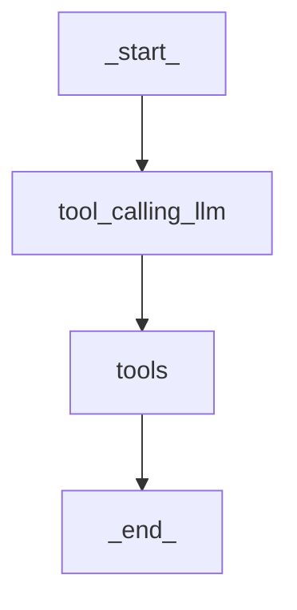
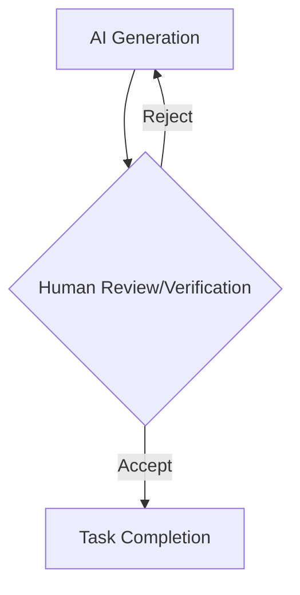
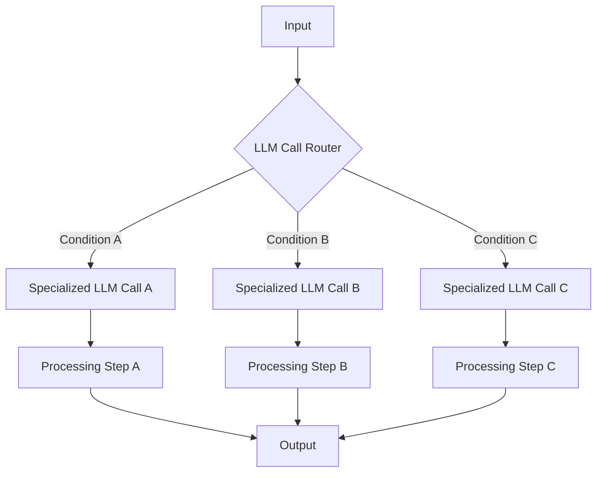
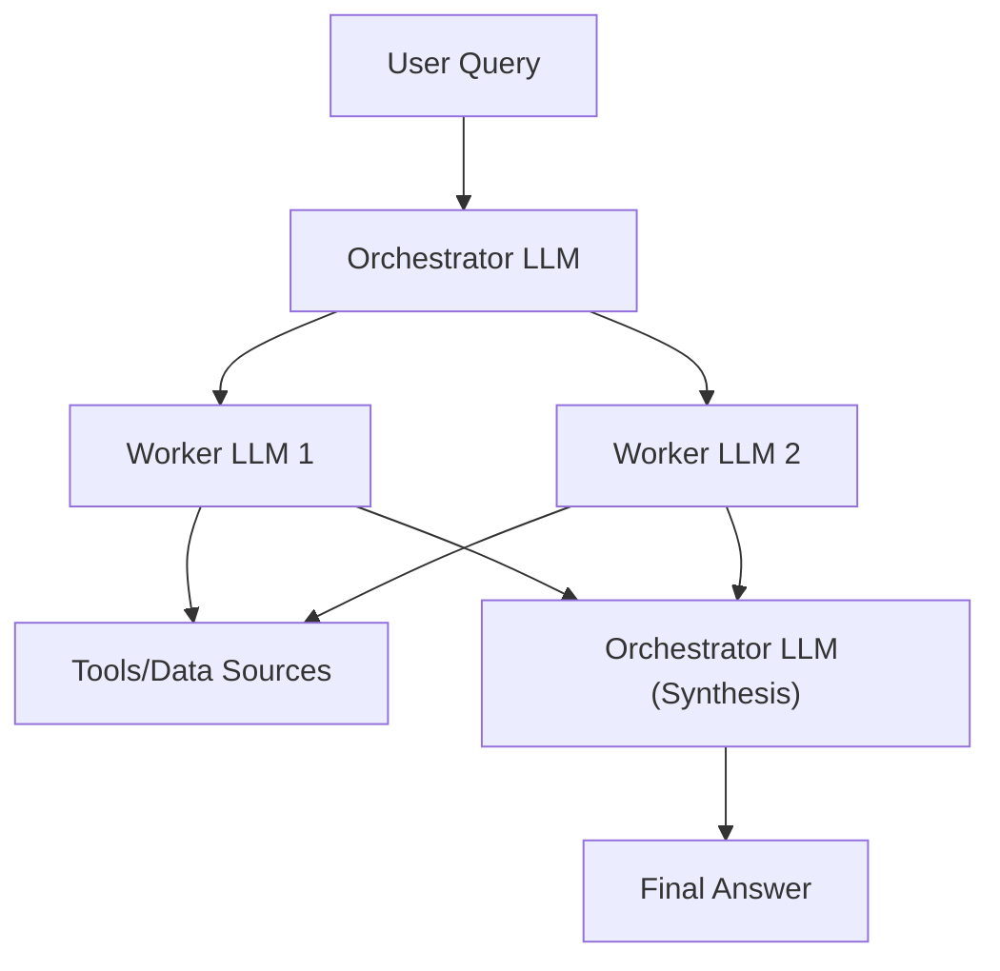
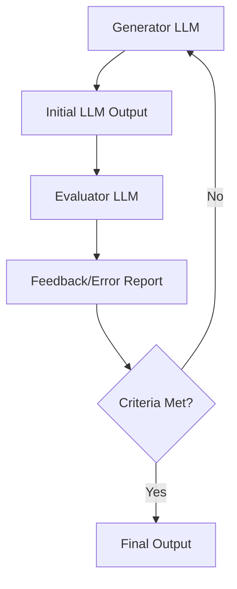
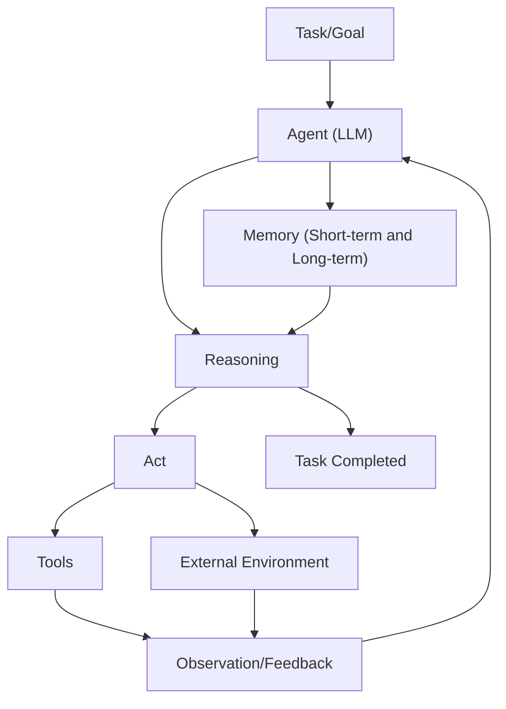
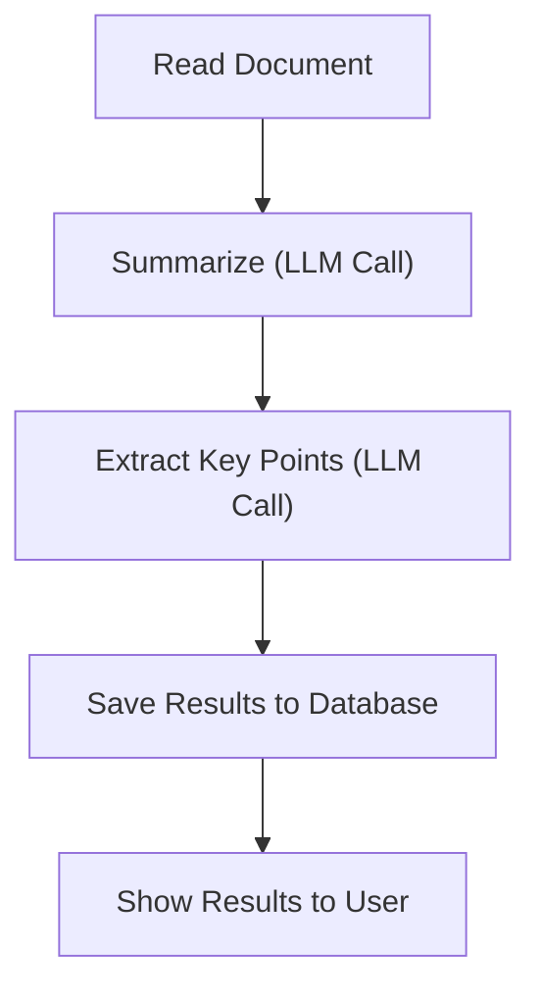
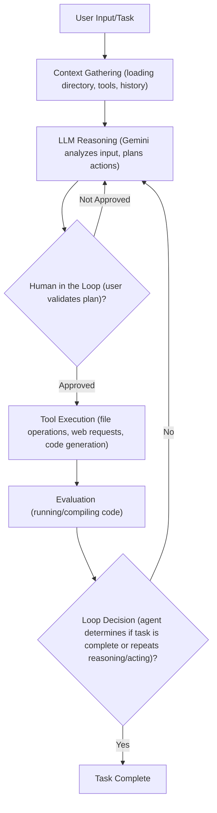
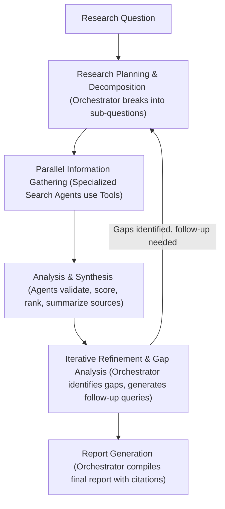

# The Decision Every AI Engineer Faces
### navigating the AI architecture spectrum: workflows vs. agents

Every AI engineer building applications faces a key architectural decision early in their development process. Should you create a predictable, step-by-step workflow where you control every action, or build an autonomous agent that can think and decide for itself? This choice impacts development time, costs, reliability, and user experience.

Choosing the wrong approach leads to major problems. You might end up with an overly rigid system that breaks when users deviate from expected patterns or when developers add new features. Alternatively, an unpredictable agent might work brilliantly most of the time but fail badly when it matters most. Both scenarios result in wasted development time, frustrated users, and executives worried about high operational costs.

In 2024 and 2025, AI startups succeed or fail based on this architectural decision. Successful companies and AI engineers know when to use workflows versus agents, and how to combine both effectively. This understanding translates directly into market success and product longevity.

This lesson helps you understand these distinctions. You will be equipped to make informed architectural choices for your AI applications. We will explore:
*   Fundamental differences between LLM workflows and AI agents.
*   When to choose a workflow or an agent.
*   How hybrid systems combine strengths.
*   Common architectural patterns.
*   Real-world examples.
*   Key challenges in production.

## Understanding the Spectrum: From Workflows to Agents

To choose between workflows and agents, you need a clear understanding of what they are. We will explore their properties and typical uses without diving into deep technical specifics for now.

**LLM Workflows** are sequences of tasks involving LLM calls or other operations. Developer-written code largely orchestrates these. Their steps are defined in advance, resulting in deterministic paths with predictable execution and explicit control flow.

An LLM workflow is like a factory assembly line, where each step is precisely engineered and follows a predefined order. This predictability makes them reliable for repeatable operational tasks. In future lessons, we will explore chaining, routing, and orchestrator-worker patterns.

Image 1: A flowchart illustrating a simple LLM workflow. (Image by author)

**AI Agents**, on the other hand, are systems where an LLM dynamically decides the sequence of steps, reasons, and takes actions to achieve a goal. Steps are not defined in advance but dynamically planned based on the task and environment. Agents are adaptive and capable of handling novelty, driven by LLM autonomy in decision-making and execution.

An AI agent is like a skilled human expert adapting to an unfamiliar problem. This dynamic decision-making allows agents to handle complex, unstructured problems that rigid workflows cannot. In future lessons, we will explore agentic concepts such as tools, memory, and ReAct agents.

<https://substackcdn.com/image/fetch/f_auto,q_auto:good,fl_progressive:steep/https%3A%2F%2Fsubstack-post-media.s3.amazonaws.com%2Fpublic%2Fimages%2F67ffe267-55f2-4af7-9910-7410c7605550_1220x754.png>
Image 2: The components of an LLM-powered agent (Source [build-production-agentic-rag-with-llmops-at-its-core [6]](https://substackcdn.com/image/fetch/f_auto,q_auto:good,fl_progressive:steep/https%3A%2F%2Fsubstack-post-media.s3.amazonaws.com%2Fpublic%2Fimages%2F67ffe267-55f2-4af7-9910-7410c7605550_1220x754.png))

Both workflows and agents require an orchestration layer, but their nature differs. In workflows, it executes a defined plan. In agents, it facilitates the LLM's dynamic planning and execution. This distinction is important for understanding how each system operates.

## Choosing Your Path

We have defined LLM workflows and AI agents independently. Now, let's explore their core differences: developer-defined logic versus LLM-driven autonomy in reasoning and action selection.

<https://contributor.insightmediagroup.io/wp-content/uploads/2025/06/image-115.png>
Image 3: The spectrum of control from workflows to agents (Image by author from [A Developer’s Guide to Building Scalable AI: Workflows vs Agents [4]](https://towardsdatascience.com/a-developers-guide-to-building-scalable-ai-workflows-vs-agents/))

### When to Use LLM Workflows

LLM workflows excel when the problem structure is well-defined. They are ideal for data extraction, report generation, task management, document summarization, and repetitive daily tasks.

Strengths include predictability, reliability, and easier debugging. They also result in lower operational costs due to simpler, smaller models, making costs and latency predictable.

Workflows are preferred in enterprises or regulated fields requiring predictable programs, such as finance and healthcare. They are also ideal for MVPs and high-frequency scenarios where cost per request is critical.

### When to Use AI Agents

AI agents are suitable for open-ended research and synthesis, such as researching historical events. They also excel at dynamic problem-solving (e.g., debugging code, complex customer support), and interactive task completion in new environments.

Their main strength is adaptability to new situations and flexibility to handle ambiguity. However, the system is more prone to errors. Agents are non-deterministic, so performance, latency, and costs vary, making them often unreliable.

Agents require larger, more costly LLMs and more LLM calls, increasing expenses. Poor design can lead to security concerns, like deleting data or sending inappropriate emails. Debugging and evaluating agents is difficult. Many funny stories exist of code being deleted by tools like Replit Agent or Claude Code [[2]](https://www.youtube.com/watch?v=kQxr-uOxw2o&t=1s).

### Hybrid Approaches and the Autonomy Slider

Most real-world systems blend elements of both approaches. A system adopts what is best from both worlds. You have an "autonomy slider" to decide how much control to give the LLM versus the user.

More manual systems use LLM workflows with human verification. More automated systems give agents more control with fewer human-in-the-loop steps. Andrej Karpathy highlights this with Cursor's `CMD+K`, `CMD+L`, `CMD+I` options, and Perplexity's "search," "research," and "deep research" modes [[2]](https://www.youtube.com/watch?v=kQxr-uOxw2o&t=1s).

The ultimate goal is to speed up the AI generation and human verification loop. This is often achieved through good architecture and well-designed UI/UX platforms.

Image 4: A flowchart illustrating the AI generation and human verification loop. (Image by author)

## Exploring Common Patterns

To introduce you to the AI engineering world, we will present the most common patterns used to build AI agents and LLM workflows. We will explain them as if this is the first time you are hearing about them.

### LLM Workflows

**Chaining and routing** automate multiple LLM calls. This pattern helps glue together multiple LLM calls and decide between appropriate options. For example, a router can direct different customer service queries to specialized downstream processes. This allows for separation of concerns, improving performance by optimizing for specific input categories [[1]](https://www.anthropic.com/engineering/building-effective-agents).

Image 5: A flowchart illustrating an LLM workflow with chaining and routing. (Image by author)

The **orchestrator-worker** pattern helps understand user intent, dynamically plan and call multiple actions, and synthesize them into a final answer. This allows the AI program to dynamically decide what actions to take based on the given task, making a smooth transition between the workflow and agentic world. For example, a central LLM can break down a complex coding task and delegate changes to multiple files to specialized worker LLMs [[1]](https://www.anthropic.com/engineering/building-effective-agents). This pattern is well-suited for tasks where the subtasks are not predictable upfront.

Image 6: A flowchart illustrating the Orchestrator-Worker LLM pattern. (Image by author)

The **evaluator-optimizer loop** auto-corrects the results from an LLM based on automated feedback. LLM outputs can be drastically improved by providing feedback on what they did wrong. This pattern automates that by having an "LLM reviewer" that analyzes the output from the LLM who generated the answer, creates an error report (also known as a reflection), and passes it back to the generator to auto-correct itself. This is analogous to a human writer refining a document based on feedback. This loop is effective when clear evaluation criteria exist and iterative refinement adds measurable value [[1]](https://www.anthropic.com/engineering/building-effective-agents).

Image 7: A flowchart illustrating the Evaluator-Optimizer loop pattern. (Image by author)

### Core Components of a ReAct AI Agent

The ReAct pattern automatically decides what action to take, interprets the action's output, and repeats until the task is completed. This is the core of a ReAct agent. The agent uses an LLM to take actions and interpret outputs from tools. Tools are used to take actions within the external environment.

Short-term memory is the agent's working memory, comparable to Random Access Memory (RAM) for computers. Long-term memory accesses factual data about the external world and remembers user preferences.

This is how the ReAct pattern works, which we will explain in detail in Lessons 7 and 8. Almost all modern agents in the industry use the ReAct pattern as it has shown the most potential.

Image 8: Flowchart illustrating the high-level dynamics of a ReAct AI agent. (Image by author)

The goal of this section is not for you to fully understand how these patterns work. It is to build an intuition on various LLM workflow and AI agent patterns that you will learn during the course. In future lessons, you will dig into all the necessary details of each pattern.

## Zooming In on Our Favorite Examples

To better anchor you in the world of LLM workflows and AI agents, we will introduce some concrete examples: a simple workflow, a single agent system, and a more advanced hybrid solution. We will keep this section high-level, without any fancy acronyms, explaining everything as if speaking to a 7-year-old.

### Document Summarization and Analysis Workflow by Gemini in Google Workspace

When working in teams, finding the right document can be time-consuming. Many documents are large, making it hard to understand which one contains the right information. A quick, embedded summarization can guide us and our search strategies.

This workflow is a simple chain with multiple LLM calls: read document, summarize, extract key points, save results to a database, and show results to the user.

Image 9: A flowchart illustrating a document summarization and analysis workflow. (Image by author)

### Gemini CLI Coding Assistant

Writing code is a time-consuming task. Understanding new codebases is slow. A coding assistant can help speed up writing code.

The Gemini CLI tool uses the ReAct agent architecture for a single-agent coding system. It is open-sourced on GitHub [[5]](https://github.com/google-gemini/gemini-cli/blob/main/README.md). Use cases include writing code from scratch, assisting engineers, supporting documentation, and understanding new codebases. It is implemented in TypeScript. Similar tools include Cursor, Windsurf, Claude Code, and Warp. Tools are actions, and context is working memory.

Gemini CLI works by gathering context (directory, tools, history), then Gemini reasons about user input to plan actions. A human validates the plan. Tools (file operations, web requests, code generation) are executed, and outputs are added to context. The agent evaluates generated code by running or compiling it. Finally, it decides if the task is complete or if it should repeat the reasoning and execution steps.

Image 10: Flowchart illustrating the operational loop of the Gemini CLI coding assistant based on the ReAct pattern (Source [Gemini CLI README.md [5]](https://github.com/google-gemini/gemini-cli/blob/main/README.md)).

Tool examples include file system access, coding, web search, and version control.

### Perplexity Deep Research (for scientific, financial, social research)

Researching new topics is challenging. A research assistant that quickly scans the internet and compiles a report can improve your learning process.

Perplexity's Deep Research agent is a hybrid system combining ReAct reasoning with LLM workflow patterns for autonomous expert-level research. It uses multiple specialized agents orchestrated in parallel by workflows, performing searches across hundreds of sources to synthesize comprehensive reports. This solution is closed-source, so our description is based on speculation [[2]](https://www.youtube.com/watch?v=kQxr-uOxw2o&t=1s).

Perplexity's Deep Research agent works through several steps. First, the orchestrator analyzes the question and decomposes it into sub-questions, using the orchestrator-worker pattern to deploy research agents. Next, specialized search agents run in parallel, using tools like web searches. Isolated agents mean smaller input tokens, keeping LLMs focused. After gathering sources, agents validate, score, rank them, then summarize the top K into a report. The orchestrator then identifies knowledge gaps and generates follow-up queries, repeating steps until gaps are filled or max steps reached. Finally, the orchestrator compiles a final report with inline citations.

Image 11: Flowchart illustrating the iterative multi-step process of Perplexity's Deep Research agent (Source [Real Agents vs. Workflows: The Truth Behind AI 'Agents' [2]](https://www.youtube.com/watch?v=kQxr-uOxw2o&t=1s)).

The deep research agent combines structured planning with dynamic adaptation. The workflow uses the orchestrator-worker pattern to dynamically reason, supervise, and call parallel agents until research topics are fulfilled.

## Conclusion: The Challenges of Every AI Engineer

Now that you understand the spectrum from LLM workflows to AI agents, every AI engineer faces key challenges designing new AI applications. These decisions determine whether your AI application succeeds or fails in production.

Daily challenges include reliability issues, context limits, data integration difficulties, the cost-performance dilemma, and security concerns.

These challenges are solvable. Upcoming lessons will cover patterns for building reliable products through evaluation and monitoring, strategies for hybrid systems, and ways to control costs and latency.

By the end of this course, you will gain the knowledge to architect robust, efficient, and safe AI systems. You will know when to use workflows versus agents and how to build effective hybrid systems. Our next lesson explores context engineering, a main foundation for AI engineering.

## References

1. Anthropic. (n.d.). Building effective agents. Anthropic. <https://www.anthropic.com/engineering/building-effective-agents>
2. Decoding AI Magazine. (n.d.). Real Agents vs. Workflows: The Truth Behind AI 'Agents'. YouTube. <https://www.youtube.com/watch?v=kQxr-uOxw2o&t=1s>
3. Decoding AI Magazine. (n.d.). Exploring the difference between agents and workflows. Decoding AI Magazine. <https://decodingml.substack.com/p/llmops-for-production-agentic-rag>
4. (n.d.). A Developer’s Guide to Building Scalable AI: Workflows vs Agents. Towards Data Science. <https://towardsdatascience.com/a-developers-guide-to-building-scalable-ai-workflows-vs-agents/>
5. Google. (n.d.). Gemini CLI README.md. GitHub. <https://github.com/google-gemini/gemini-cli/blob/main/README.md>
6. (n.d.). build-production-agentic-rag-with-llmops-at-its-core. Substack. <https://substackcdn.com/image/fetch/f_auto,q_auto:good,fl_progressive:steep/https%3A%2F%2Fsubstack-post-media.s3.amazonaws.com%2Fpublic%2Fimages%2F67ffe267-55f2-4af7-9910-7410c7605550_1220x754.png>