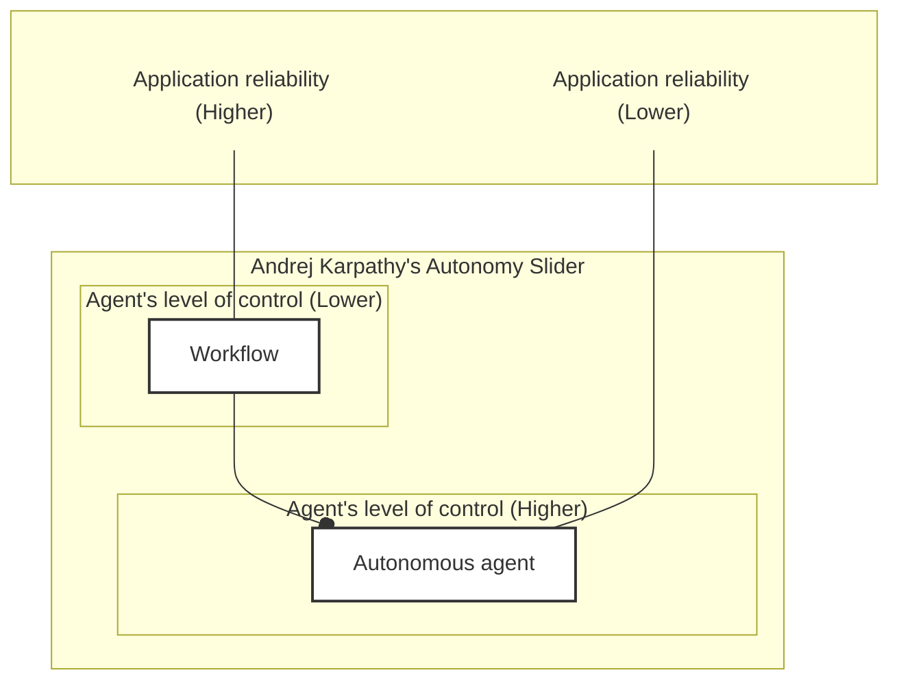
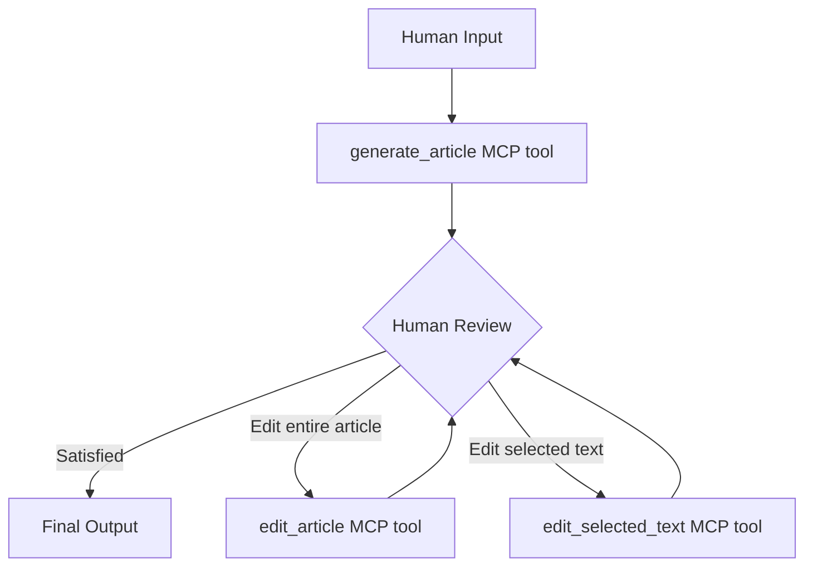

# Lesson 24: Human-in-the-Loop for Brown Writing Workflow

### Expanding Brown the writing agent with multiple editing workflow that let's you edit the whole article or just a piece of selected text. Everything is exposed as tools through MCP servers to facilitate human in the loop cycles.

In previous lessons, specifically Lesson 20 through 23, we focused on building the core of Brown, our writing assistant. We designed the architecture, implemented the orchestrator-worker pattern to generate content, and applied the evaluator-optimizer pattern to automatically review and refine articles against a set of guidelines.

However, even with automated reviews, an AI-generated article is rarely perfect on the first try. Writing is subjective. As the domain expert, you often have specific preferences—a certain tone, a specific argument to emphasize, or a section that needs to be shorter. To bridge the gap between a "good draft" and a "final polished piece," we need to bring the human back into the loop.

In this lesson, we will learn how to:

-   Understand the AI generation / human validation loop and why it matters for building practical AI applications.
-   Learn how to introduce human feedback into the article reviewer node.
-   Implement two new editing workflows: **edit article** and **edit selected text**.
-   Serve Brown as an MCP server with tools, prompts, and resources.
-   Integrate Brown with MCP clients like Cursor for a coding-like writing experience.

## Understanding the AI Generation Human Validation Loop

Before writing code, we need to understand the design philosophy behind human-in-the-loop (HITL) systems.

The core problem is that AI systems are imperfect. LLMs can hallucinate, display "jagged intelligence," and make mistakes that no human would make. Therefore, we cannot simply fire and forget. We must create a balance where the human does the planning and thinking, while the AI handles the heavy lifting of execution.

This balance is achieved through the **AI Generation / Human Validation Loop**:

1.  **Generation:** The AI generates a draft or performs an action.
2.  **Validation:** The human reviews the output and provides feedback.
3.  **Iteration:** The loop repeats until the human is satisfied.

According to Andrej Karpathy, to make this loop effective, we need to focus on two strategies [[1]](https://www.youtube.com/watch?v=LCEmiRjPEtQ):

**1. Speeding Up Verification**

Reading raw text or JSON output is slow and cognitively demanding. To speed up the loop, we need application-specific interfaces that leverage our visual processing. In coding, seeing a red/green "diff" allows us to verify changes instantly. We want to bring this same "diff" experience to writing. Instead of typing out instructions like "Apply these changes," we want to simply click "Accept" or "Reject."

**2. Keeping the AI on a Leash**

We must avoid AI "overreaction." If you ask an agent to fix a typo and it rewrites the entire repository (or article), verification becomes impossible because you have to re-read everything. To keep the AI on a leash, we must:

-   Work in small, incremental chunks.
-   Use concrete prompts to increase the probability of success.
-   Constrain the AI to edit only what is necessary.

This concept connects directly to the "autonomy slider" we introduced in Lesson 2. As you increase the agent's autonomy, reliability often drops. By building products that act more like "Iron Man suits" (augmentation) rather than "Iron Man robots" (full autonomy), we keep the human in control while maximizing efficiency [[1]](https://www.youtube.com/watch?v=LCEmiRjPEtQ).


Image 1: A diagram illustrating Andrej Karpathy's "autonomy slider" concept, showing the inverse relationship between an AI agent's level of control and application reliability. The diagram depicts "Workflow" having higher application reliability and lower agent control, while "Autonomous agent" has lower application reliability and higher agent control. The x-axis is "Agent's level of control (Lower to Higher)" and the y-axis is "Application reliability (Lower to Higher)". A curved line connects "Workflow" (top-left) to "Autonomous agent" (bottom-right).

## Adding Human-In-The-Loop In Our Writing Workflow

We have the generation step from Lessons 22 and 23, but how do we introduce the human loop to adhere to the principles discussed above? We need a way to allow the human to review the article, validate it, and provide instructions on how to improve it *after* the initial draft is generated.

As engineers, we noticed that writing an article is incredibly similar to writing code. We iterate, review diffs, and refactor sections. Therefore, we decided to introduce HITL similar to how AI IDEs like Cursor or Claude Code do it: you specify what you want, the AI generates changes, and you review the diff.

To achieve this, we implemented two new editing workflows that apply the evaluator-optimizer pattern with human feedback:

1.  **Edit Article Workflow:** Reviews and edits the entire article based on human feedback.
2.  **Edit Selected Text Workflow:** Reviews and edits only a specific portion of the article.

We instructed the evaluator-optimizer loop to always prioritize human feedback over the automated profile checks.

To enable this flexible approach, we decoupled the article generation workflow from the editing workflows using the Model Context Protocol (MCP). Instead of one monolithic process, we expose three independent tools:

-   `generate_article`: Creates the initial draft.
-   `edit_article`: Refines the full document.
-   `edit_selected_text`: Refines specific sections (keeping the AI on a leash).

This architecture allows you to generate an article, review it, and then selectively apply editing workflows until you are satisfied.


Image 2: A flowchart illustrating the Brown writing workflow with human-in-the-loop, showing three independent MCP tools and the human feedback loop.

Editing the whole article for every small change is an "overreaction." It risks changing sections you were already happy with. That is why we implemented the `edit_selected_text` workflow. It applies the same rigorous review logic but restricts the blast radius to a single section.

Now that we understand the overall design, let's see how we introduced human feedback into the article reviewer.

## Introducing Human Feedback Into the Article Reviewer

To support this workflow, we first need to update our domain layer to handle human input. We introduced a `HumanFeedback` entity and integrated it into the existing `ArticleReviewer` node.

1. First, we define the `HumanFeedback` entity in `brown.entities.reviews`. It is a simple Pydantic model that implements our `ContextMixin`, allowing it to render itself as XML for the prompt.
    ```python
    class HumanFeedback(BaseModel, ContextMixin):
        content: str
    
        def to_context(self) -> str:
            return f"""
    <{self.xml_tag}>
        {self.content}
    </{self.xml_tag}>
    """
    ```

2. Next, we update the `ArticleReviewer` node to accept this feedback. In `brown.nodes.article_reviewer`, we modify the initialization to accept an optional `human_feedback` parameter.
    ```python
    def __init__(
        self,
        to_review: Article | SelectedText,
        article_guideline: ArticleGuideline,
        model: Runnable,
        article_profiles: ArticleProfiles,
        human_feedback: HumanFeedback | None = None,
    ) -> None:
        self.to_review = to_review
        self.article_guideline = article_guideline
        self.article_profiles = article_profiles
        self.human_feedback = human_feedback
    
        super().__init__(model, toolkit=Toolkit(tools=[]))
    ```

3. We also need to update the system prompt to instruct the LLM on how to use this feedback. We add a section that tells the model to prioritize human instructions and convert them into actionable review points.
    ```python
    system_prompt_template = """
    You are Brown, an expert article writer, editor and reviewer specialized in reviewing technical, educative and informational articles.
    
    ...
    
    ## Human Feedback
    
    Along with the expected requirements, a human already reviewed the article and provided the following feedback:
    
    {human_feedback}
    
    If empty, completely ignore it, otherwise the feedback will ALWAYS be used in two ways:
    1. First you will use the <human_feedback> to guide your reviewing process against the requirements. This will help you understand 
    on what rules to focus on as this directly highlights what the user wants to improve.
    2. Secondly you will extract one or more action points based on the <human_feedback>. Depending on how many ideas, topics or suggestions 
    the <human_feedback> contains you will generate from 1 to N action points. Each <human_feedback> review will contain a single action point. 
    3. As long the <human_feedback> is not empty, you will always return at least 1 action point, but you will return more action points 
    if the feedback touches multiple ideas. 
    
    Here is an example of a reviewed based on the human feedback:
    <example_of_human_feedback_action_point>
    Review(
        profile="human_feedback",
        location="Article level",
        comment="Add all the points from the article guideline to the article."
    )
    </example_of_human_feedback_action_point>
    
    ...
    """
    ```

4. Finally, we inject the feedback into the prompt during execution.
    ```python
    async def ainvoke(self) -> ArticleReviews | SelectedTextReviews:
        system_prompt = self.system_prompt_template.format(
            human_feedback=self.human_feedback.to_context() if self.human_feedback else "",
            article=self.article.to_context(),
            # ... other context
        )
        # ...
    ```

5. Let's see this in action. We load our sample article and profiles, create a `HumanFeedback` object, and run the reviewer.
    ```python
    human_feedback = HumanFeedback(
        content="""Make the introduction more engaging and catchy. 
    Also, expand on the definition of both workflows and agents from the first section"""
    )
    
    # Create the article reviewer
    model = get_model(SupportedModels.GOOGLE_GEMINI_25_FLASH)
    article_reviewer = ArticleReviewer(
        to_review=article,
        article_guideline=article_guideline,
        model=model,
        article_profiles=profiles,
        human_feedback=human_feedback,
    )
    
    print("Running article review with human feedback...")
    reviews = await article_reviewer.ainvoke()
    ```
    It outputs:
    ```text
    Generated 19 reviews
    ```

6. When we examine the reviews, we see that the model generated specific action points based on our input, tagged with `profile="human_feedback"`.
    ```python
    human_feedback_reviews = [r for r in reviews.reviews if r.profile == "human_feedback"]
    # ... printing logic ...
    ```
    It outputs:
    ```text
    1. Human Feedback Review
    {
        "profile": "human_feedback",
        "location": "Article level",
        "comment": "Make the introduction more engaging and catchy."
    }
    2. Human Feedback Review
    {
        "profile": "human_feedback",
        "location": "Understanding the Spectrum: From Workflows to Agents - First section",
        "comment": "Expand on the definition of both workflows and agents from the first section."
    }
    ```

By integrating feedback directly into the review process, we ensure that the writer node (which consumes these reviews) treats human instructions with the same importance as the predefined style profiles.

Now that we understand how human feedback integrates with the article reviewer, let's explore the `edit_article` workflow.

## Implementing the Article Editing Workflow

The `edit_article` workflow is designed to review and edit an existing article based on human feedback and expected requirements. It effectively runs one iteration of the review-edit loop we used in the generation workflow, but this time guided by the user.

This workflow follows our clean architecture pattern. It sits in the app layer and orchestrates the existing nodes and entities. Because our nodes are decoupled, we can reuse the exact same `ArticleReviewer` and `ArticleWriter` logic without modification.

1. We build the workflow using LangGraph's Functional API. The `build_edit_article_workflow` function acts as a factory, wrapping the logic with a checkpointer for state persistence.
    ```python
    def build_edit_article_workflow(checkpointer: BaseCheckpointSaver):
        """Create an edit article workflow with checkpointer."""
        return entrypoint(checkpointer=checkpointer)(_edit_article_workflow)
    ```
    The workflow accepts an `EditArticleInput` typed dictionary containing the directory path and the human feedback string.

2. The main workflow function orchestrates the process. It loads the context, generates reviews, and then edits the article.
    ```python
    async def _edit_article_workflow(inputs: EditArticleInput, config: RunnableConfig) -> str:
        writer = get_stream_writer()
    
        # 1. Loading context
        writer(WorkflowProgress(progress=0, message="Loading context").model_dump(mode="json"))
        # ... logic to load article, guideline, profiles ...
        human_feedback = HumanFeedback(content=inputs["human_feedback"])
    
        # 2. Reviewing
        writer(WorkflowProgress(progress=20, message="Reviewing article").model_dump(mode="json"))
        reviews = await generate_reviews(context["article"], human_feedback, context["article_guideline"], context["profiles"])
    
        # 3. Editing
        writer(WorkflowProgress(progress=60, message="Editing article").model_dump(mode="json"))
        article = await edit_based_on_reviews(
            context["article_guideline"], context["research"], context["profiles"], context["examples"], reviews
        )
    
        # 4. Completion
        writer(WorkflowProgress(progress=100, message="Article editing completed").model_dump(mode="json"))
    
        return f"""
    Here is the edited article:
    {article.to_context()}
    
    Here is what you have to do with the edited article:
    - print the edited article to the console for the user to see
    - give a quick summary of the changes you made
    - always apply the changes to the source file without waiting for the user to explicitly ask you to do so
    - in case you haven't changed anything, just say that you haven't changed anything
    """
    ```
    Notice the return string. It provides specific instructions to the MCP client (like Cursor) on how to handle the output, ensuring a smooth user experience.

3. The `generate_reviews` task wraps the `ArticleReviewer` node. We use the `@task` decorator to make it a distinct step in the graph with its own retry policy.
    ```python
    @task(retry_policy=retry_policy)
    async def generate_reviews(
        article: Article,
        human_feedback: HumanFeedback,
        article_guideline: ArticleGuideline,
        article_profiles: ArticleProfiles,
    ) -> ArticleReviews:
        model, _ = build_model(app_config, node="review_article")
        article_reviewer = ArticleReviewer(
            to_review=article,
            article_guideline=article_guideline,
            article_profiles=article_profiles,
            human_feedback=human_feedback,
            model=model,
        )
        reviews = await article_reviewer.ainvoke()
    
        return cast(ArticleReviews, reviews)
    ```

4. Similarly, the `edit_based_on_reviews` task wraps the `ArticleWriter` node.
    ```python
    @task(retry_policy=retry_policy)
    async def edit_based_on_reviews(
        article_guideline: ArticleGuideline,
        research: Research,
        article_profiles: ArticleProfiles,
        article_examples: ArticleExamples,
        reviews: ArticleReviews,
    ) -> Article:
        model, _ = build_model(app_config, node="edit_article")
        article_writer = ArticleWriter(
            # ... passes context ...
            reviews=reviews,
            model=model,
        )
        article = await article_writer.ainvoke()
    
        return cast(Article, article)
    ```
    When `ArticleWriter` receives `reviews`, it operates in "editing mode," applying the changes suggested by the reviewer rather than writing from scratch.

5. To run the workflow, we initialize it with a checkpointer and stream the events.
    ```python
    async with build_in_memory_checkpointer() as checkpointer:
        workflow = build_edit_article_workflow(checkpointer=checkpointer)
        # ... configuration ...
        async for event in workflow.astream(
            {
                "dir_path": SAMPLE_DIR,
                "human_feedback": "Make the introduction more engaging...",
            },
            config=config,
            stream_mode=["custom", "values"],
        ):
            # ... handle events ...
    ```
    It outputs progress events like "Reviewing article," "Generated reviews," and finally the edited article content.

The power of this workflow is that it allows us to start with a "good enough" draft generated with fewer iterations (saving cost and time) and then refine it dynamically. We don't have to guess the perfect number of review loops upfront; we let the human decide when the article is finished.

While the edit article workflow handles entire article edits, you'll often want to refine just a specific section. Let's explore the `edit_selected_text` workflow.

## Implementing the Selected Text Editing Workflow

The `edit_selected_text` workflow enables precise, focused edits. It follows the same architectural pattern as `edit_article`, but operates on a `SelectedText` entity instead of the full `Article`. This reduces "overreaction"—we don't want the AI to rewrite the conclusion when we only asked for a change in the introduction. This makes the process faster, cheaper, and safer.

1. We build the workflow using the same factory pattern. The input schema `EditSelectedTextInput` requires line numbers to locate the text within the larger document.
    ```python
    def build_edit_selected_text_workflow(checkpointer: BaseCheckpointSaver):
        return entrypoint(checkpointer=checkpointer)(_edit_selected_text_workflow)
    
    class EditSelectedTextInput(TypedDict):
        dir_path: Path
        human_feedback: str
        selected_text: str
        number_line_before_selected_text: int
        number_line_after_selected_text: int
    ```

2. The main workflow function logic mirrors the article editing workflow but constructs a `SelectedText` entity.
    ```python
    async def _edit_selected_text_workflow(inputs: EditSelectedTextInput, config: RunnableConfig) -> str:
        # ... loading context ...
        selected_text = SelectedText(
            article=context["article"],
            content=inputs["selected_text"],
            first_line_number=inputs["number_line_before_selected_text"],
            last_line_number=inputs["number_line_after_selected_text"],
        )
        # ... generate reviews -> edit -> return ...
    ```

3. The `generate_reviews` task is slightly different: it takes `SelectedText` and returns `SelectedTextReviews`.
    ```python
    @task(retry_policy=retry_policy)
    async def generate_reviews(
        selected_text: SelectedText,
        # ...
    ) -> SelectedTextReviews:
        # ...
        selected_text_reviewer = ArticleReviewer(
            to_review=selected_text,
            # ...
        )
        reviews = await selected_text_reviewer.ainvoke()
        return cast(SelectedTextReviews, reviews)
    ```
    Our `ArticleReviewer` is smart enough to handle both entity types. When given `SelectedText`, it focuses its critique only on that section while keeping the rest of the article as context.

4. The `edit_based_on_reviews` task also adapts to return `SelectedText`.
    ```python
    @task(retry_policy=retry_policy)
    async def edit_based_on_reviews(
        # ...
        reviews: SelectedTextReviews,
    ) -> SelectedText:
        # ...
        edited_selected_text = cast(SelectedText, await article_writer.ainvoke())
        return edited_selected_text
    ```

5. Why is this important? In a real writing workflow, you rarely rewrite the whole document at once. You iterate on paragraphs. This workflow supports that natural behavior.

6. Running it requires explicit line numbers.
    ```python
    # ... extract selected text ...
    async for event in workflow.astream(
        {
            "dir_path": SAMPLE_DIR,
            "human_feedback": "Expand on the definition...",
            "selected_text": selected_text,
            "number_line_before_selected_text": start_line,
            "number_line_after_selected_text": end_line,
        },
        # ...
    ):
    ```
    The output is just the edited section, which the client can then stitch back into the document.

Now that we have both editing workflows implemented, let's see how to serve them as an MCP server for integration with tools like Cursor.

## Serving Brown as an MCP Server

We implemented the serving layer in the `brown.mcp` module. This keeps our serving logic completely separate from our domain and app layers. We use FastMCP to expose our workflows as tools.

1. We initialize the MCP server and define our three main tools.
    ```python
    mcp = FastMCP("Brown Writing Assistant")
    
    @mcp.tool()
    async def generate_article(dir_path: str, ctx: Context) -> str:
        # ... builds workflow, runs generation ...
    
    @mcp.tool()
    async def edit_article(article_path: str, human_feedback: str, ctx: Context) -> str:
        # ... builds workflow, runs edit_article ...
    
    @mcp.tool()
    async def edit_selected_text(
        article_path: str, 
        human_feedback: str, 
        selected_text: str, 
        first_line_number: int, 
        last_line_number: int, 
        ctx: Context
    ) -> str:
        # ... builds workflow, runs edit_selected_text ...
    ```
    Each tool builds the appropriate workflow with an in-memory checkpointer and a unique thread ID. Crucially, they use the `ctx` (context) parameter to stream progress updates back to the client.

2. To handle progress reporting, we use a helper function `parse_message`. This function translates our internal `WorkflowProgress` events into MCP logs and progress notifications.
    ```python
    def parse_message(message: str | dict, ctx: Context) -> None:
        # ... parses message ...
        ctx.info(f"[Progress {progress}%]: {msg}")
        ctx.report_progress(progress, total=100)
    ```

3. When we run the tool (e.g., via an in-memory client for testing), we see the workflow execution reported in real-time.
    ```python
    mcp_client = Client(mcp)
    result = await mcp_client.call_tool("edit_selected_text", {...})
    ```
    The result includes the edited text and the instructions we defined earlier. In a tool like Cursor, these instructions trigger a "diff" view, allowing you to manually accept the changes. This is the ultimate human-in-the-loop experience.

4. We also expose **MCP Prompts**. These help users trigger tools without needing to know the exact parameter names.
    ```python
    @mcp.prompt()
    def edit_article_prompt(human_feedback: str = "") -> Message:
        return UserMessage(f"Please edit the article based on this feedback: {human_feedback}")
    ```
    When plugged into Cursor, the chatbot sees these prompts and knows exactly how to invoke the tools.

5. Finally, we expose **MCP Resources** to provide read-only access to configuration and state, such as the app config or character profile.
    ```python
    @mcp.resource("resource://config/app")
    def get_app_config() -> str:
        return app_config.model_dump_json(indent=2)
    ```

This clean separation means we can swap out the serving layer (e.g., replace MCP with a FastAPI REST API) without touching our core logic. It also makes testing easier.

Now let's see how to connect to the MCP server from MCP clients.

## Hooking to the MCP Server

There are two primary ways to connect to Brown's MCP server: using our CLI script or integrating directly with Cursor.

**Option 1: Brown CLI Script**

We included a command-line interface at `lessons/writing_workflow/scripts/brown_mcp_cli.py`. This is useful for testing or running workflows without a GUI. It uses an in-memory MCP client to call the tools we defined.

You can run commands like:

```bash
# Generate an article
python scripts/brown_mcp_cli.py generate-article --dir-path /path/to/article

# Edit an entire article
python scripts/brown_mcp_cli.py edit-article \
    --dir-path /path/to/article \
    --human-feedback "Make the introduction more engaging"

# Edit selected text
python scripts/brown_mcp_cli.py edit-selected-text \
    --dir-path /path/to/article \
    --human-feedback "Make this shorter." \
    --first-line 10 \
    --last-line 20
```

**Option 2: Cursor Integration**

The most powerful way to use Brown is within Cursor. To do this, you configure the `.cursor/mcp.json` file.

```json
{
  "mcpServers": {
    "brown": {
      "command": "uv",
      "args": [
        "run",
        "lessons/writing_workflow/mcp_server.py"
      ],
      "env": {
        "GOOGLE_API_KEY": "..."
      }
    }
  }
}
```

This configuration tells Cursor to launch the Brown MCP server using `uv`. Once configured, you verify it in Cursor's "Tools & MCP" settings.

**The Brown + Human-in-the-Loop Writing Experience**

Once connected, the workflow feels like magic:

1.  **Generate:** You ask Cursor to "Generate an article about X." It calls the `generate_article` tool.
2.  **Review:** You read the markdown file directly in the editor.
3.  **Feedback:** You highlight a paragraph that feels clunky and type in the chat: "Reword this to be punchier."
4.  **AI Edits:** Cursor calls `edit_selected_text`.
5.  **Diff:** You see a red/green diff of the changes. You click "Accept."

This collaborative loop allows the AI to handle the heavy lifting while you guide the direction with your expertise.

## Running Brown Through the MCP Server (Video)

To demonstrate this in action, we recorded a video showing the full workflow within Cursor.

*(Video placeholder: Demonstration of configuring the MCP server, generating an article, reviewing it, providing feedback, and accepting diffs in Cursor.)*

In this video, we show how we generated this very lesson using the exact methods described. We generated a draft, reviewed it, used the "edit selected text" tool to refine sections, and accepted the changes. It serves as a real-world proof of work for the system.

## Conclusion

Understanding how to properly add humans in the loop is critical for building practical AI applications. AI systems are imperfect; they hallucinate and make reasoning mistakes. The balance we've built allows the AI to handle the monotonous work of drafting and formatting, while keeping the human in control of the high-level planning and final quality.

In this lesson, we learned:

1.  **The AI Generation / Human Validation Loop:** How to design workflows where AI generates and humans validate, using visuals to speed up verification.
2.  **Human Feedback Integration:** How to inject specific user instructions into the `ArticleReviewer` to guide the editing process.
3.  **Edit Article Workflow:** A workflow for broad, document-level refinements.
4.  **Edit Selected Text Workflow:** A focused workflow for precision editing, minimizing AI "overreaction."
5.  **MCP Server Integration:** How to serve our application logic as standardized tools that can be consumed by any MCP client.
6.  **Cursor Integration:** How to create a seamless, coding-like experience for writing prose.

You can extend this further by hooking Brown to Claude Desktop, using Resource Templates to parameterize profiles, or replacing the MCP server with a FastAPI backend for a web UI.

This wraps up our deep dive into the Brown writing workflow. We've gone from basic context engineering (Lesson 22) to self-correcting loops (Lesson 23) and finally to human-collaborative workflows (Lesson 24). In Part 2D, we will take the next step: orchestrating **Nova** (Deep Research) and **Brown** (Writing) together into a single, unified system.

## References

1. Andrej Karpathy. (2025, February 18). Software Is Changing (Again). YouTube. https://www.youtube.com/watch?v=LCEmiRjPEtQ 

2. Anthropic. (2024, December 19). Building effective agents. Anthropic Research. https://www.anthropic.com/engineering/building-effective-agents