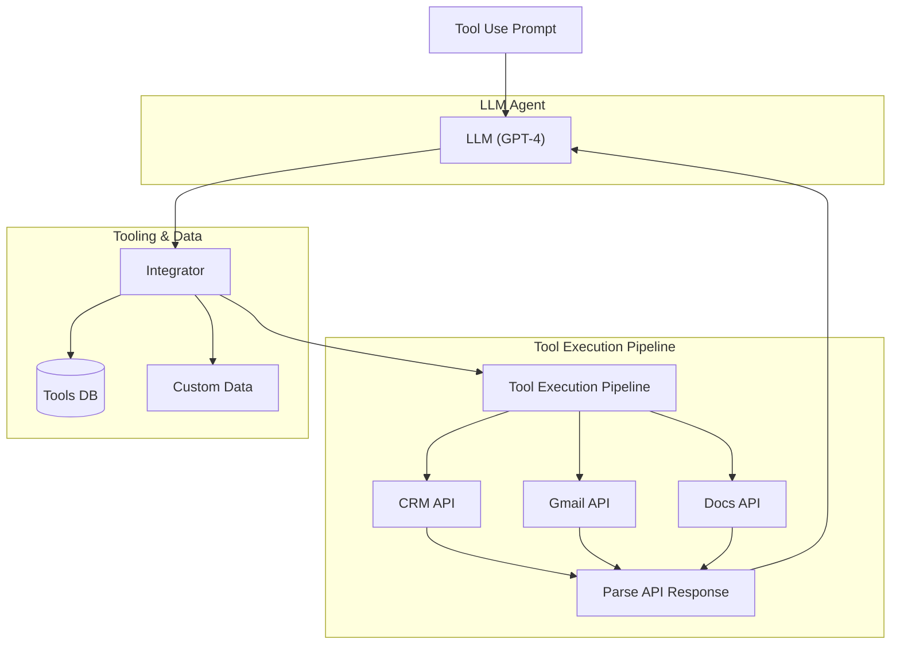
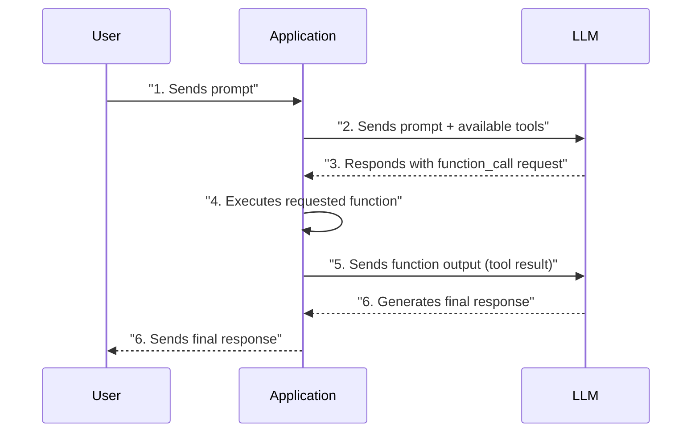
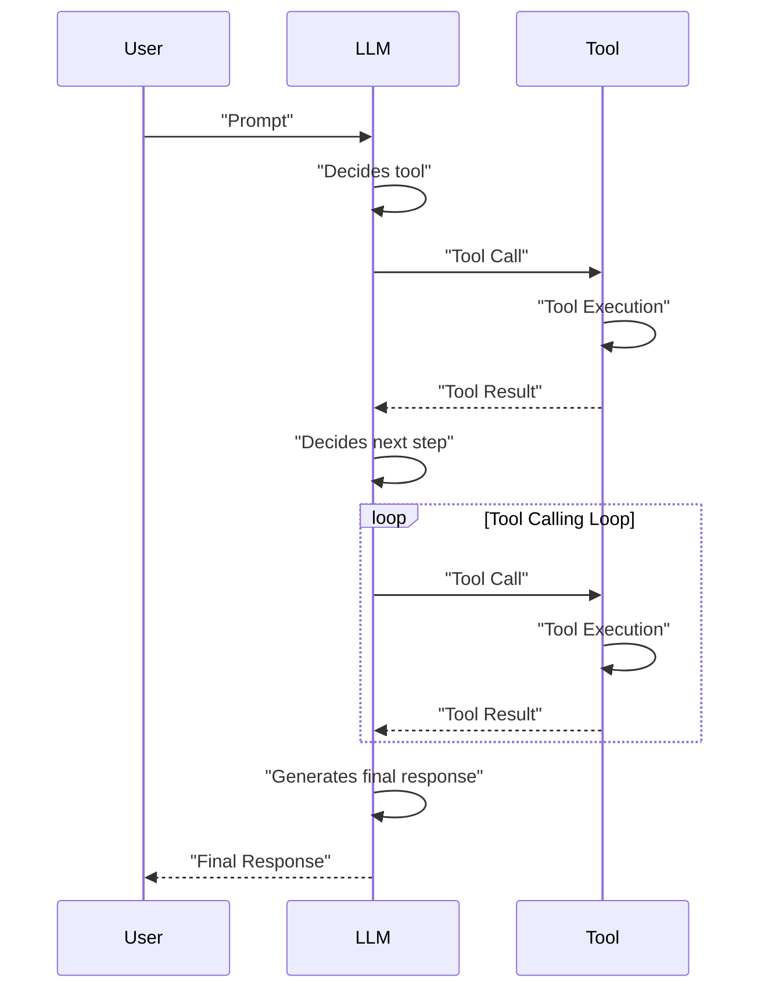

# Lesson 6: Agent Tools & Function Calling
### Giving Your LLM the Ability to Take Action

In our previous lessons, we explored context engineering, structured outputs, and the basic ingredients of LLM workflows. We learned how to feed the right information *into* an LLM and get predictable data *out* of it. Now, we will give our LLM the ability to take action.

This lesson is about tools, one of the most critical building blocks of any AI Agent. Tools are what transform an LLM from a passive text generator into an active participant that can interact with the world. For an AI engineer, understanding how to equip an agent with tools is fundamental. It is the key to building, improving, debugging, and monitoring applications that do more than just talk; they *do*.

## Understanding Why Agents Need Tools

LLMs have a fundamental limitation: they are sophisticated pattern matchers and text generators, but they cannot perform actions or access information outside their training data on their own. Their knowledge is static, and they have no direct connection to the external world. To address this, we use tools.

Think of the LLM as the brain of an agent. It can reason, understand language, and make decisions. Tools, then, are the agent's "hands and senses." They are the bridge between the LLM's internal reasoning and the outside world, allowing it to perceive and act in ways that go beyond simple text generation. With tools, an LLM becomes an AI agent capable of executing specific instructions and interacting with its environment [[45]](https://www.projectpro.io/article/llm-limitations/1045), [[87]](https://www.projectpro.io/article/llm-limitations/1045).


Image 1: High-level architecture of an LLM acting as an agent with tool use. (Source [diagram](https://i.imgur.com/gI9w11P.png))

Some of the most popular tools that power modern AI agents include the ability to:
- Access real-time information through APIs (e.g., today's weather, latest news) [[19]](https://aman.ai/primers/ai/agents/).
- Interact with external databases or other storage solutions (PostgreSQL, Snowflake, S3) [[18]](https://www.mercity.ai/blog-post/guide-to-integrating-tools-and-apis-with-language-models).
- Access the agent's long-term memory to remember information beyond its context window.
- Execute code (Python, JavaScript) in a secure environment for calculations or data manipulation [[21]](https://arxiv.org/html/2506.18096v1).
- Perform precise calculations beyond their training data (e.g., using WolframAlpha).

## Implementing Tool Calls From Scratch

The best way to understand how tools work is to implement them from scratch. We will learn how a tool is defined, how its schema is used to inform the LLM, how the model decides which tool to call, and how we execute that call and interpret the output.

Our goal is to provide the LLM with a list of available tools and let it decide which one to use, generating the correct arguments needed to call the function. The high-level process, often called function calling, involves five main steps [[49]](https://python.langchain.com/docs/how_to/function_calling/), [[69]](https://blog.christoolivier.com/p/llms-and-functiontool-calling):
1.  **You:** Send the LLM a prompt and a list of available tools with their definitions.
2.  **LLM:** Responds with a `function_call` request, specifying the tool's name and arguments.
3.  **You:** Execute the requested function in your application code.
4.  **You:** Send the function's output (the tool result) back to the LLM.
5.  **LLM:** Uses the tool's output to generate a final, user-facing response.

This request-execute-respond flow is the foundation of how agents take action.


Image 2: A sequence diagram illustrating the 5 steps of a tool calling process.

Let's build a simple example where we mock searching for a document on Google Drive and sending its summary to a Discord channel.

<aside>
💡

You can find the code for this lesson in the accompanying [GitHub repository notebook](https://github.com/towardsai/course-ai-agents/blob/dev/lessons/06_tools/notebook.ipynb).

</aside>

1. First, we set up our environment by initializing the Gemini client and defining our model and a mock document. We will use `gemini-2.5-flash`, which is fast and cost-effective for these examples.
    ```python
    import json
    from google import genai
    
    # Code to load API key from .env file
    # ...
    
    client = genai.Client()
    MODEL_ID = "gemini-2.5-flash"
    
    DOCUMENT = """
    # Q3 2023 Financial Performance Analysis
    The Q3 earnings report shows a 20% increase in revenue and a 15% growth in user engagement...
    """
    ```

2. Next, we define our tools as simple Python functions. To keep the focus on the tool-calling mechanism, these functions will be mocked.
    ```python
    def search_google_drive(query: str) -> dict:
        """
        Searches for a file on Google Drive and returns its content or a summary.
    
        Args:
            query (str): The search query to find the file, e.g., 'Q3 earnings report'.
    
        Returns:
            dict: A dictionary representing the search results...
        """
        return {
            "files": [
                {
                    "name": "Q3_Earnings_Report_2024.pdf",
                    "id": "file12345",
                    "content": DOCUMENT,
                }
            ]
        }
    
    def send_discord_message(channel_id: str, message: str) -> dict:
        """
        Sends a message to a specific Discord channel.
    
        Args:
            channel_id (str): The ID of the channel..., e.g., '#finance'.
            message (str): The content of the message to send.
    
        Returns:
            dict: A dictionary confirming the action, e.g., {"status": "success"}.
        """
        return {
            "status": "success",
            "status_code": 200,
            "channel": channel_id,
            "message_preview": f"{message[:50]}...",
        }
    
    def summarize_financial_report(text: str) -> str:
        """
        Summarizes a financial report.
    
        Args:
            text (str): The text to summarize.
    
        Returns:
            str: The summary of the text.
        """
        return "The Q3 2023 earnings report shows strong performance..."
    ```

3. For the LLM to use these functions, we must provide a schema for each one. The schema, often described in JSON, tells the model what the tool does (`description`), what its parameters are, their types, and which are required. This is an industry standard used by APIs from Google, OpenAI, and others [[71]](https://platform.openai.com/docs/guides/function-calling), [[84]](https://ai.google.dev/gemini-api/docs/function-calling).
    ```python
    search_google_drive_schema = {
        "name": "search_google_drive",
        "description": "Searches for a file on Google Drive and returns its content or a summary.",
        "parameters": {
            "type": "object",
            "properties": {
                "query": {
                    "type": "string",
                    "description": "The search query to find the file, e.g., 'Q3 earnings report'.",
                }
            },
            "required": ["query"],
        },
    }
    
    send_discord_message_schema = { ... }
    summarize_financial_report_schema = { ... }
    ```

4. We then create a tool registry to map tool names to their function handlers and schemas.
    ```python
    TOOLS = {
        "search_google_drive": {
            "handler": search_google_drive,
            "declaration": search_google_drive_schema,
        },
        # ... other tools
    }
    TOOLS_BY_NAME = {tool_name: tool["handler"] for tool_name, tool in TOOLS.items()}
    TOOLS_SCHEMA = [tool["declaration"] for tool in TOOLS.values()]
    ```
    The `TOOLS_BY_NAME` mapping gives us easy access to the functions, and `TOOLS_SCHEMA` contains the definitions we will pass to the LLM.

5. Now, we create a system prompt that instructs the LLM on how to use these tools. This prompt includes guidelines, the expected output format, and the list of available tools enclosed in XML tags.
    ```python
    TOOL_CALLING_SYSTEM_PROMPT = """
    You are a helpful AI assistant with access to tools...
    
    ## Tool Call Format
    When you need to use a tool, output ONLY the tool call in this exact format:
    
    <tool_call>
    {{"name": "tool_name", "args": {{"param1": "value1", "param2": "value2"}}}}
    </tool_call>
    
    ## Available Tools
    <tool_definitions>
    {tools}
    </tool_definitions>
    ...
    """
    ```

6. In practice, the LLM uses the `description` field from the tool schema to *decide* if a tool is appropriate for the user's query. This is why clear and distinct tool descriptions are critical. If two tools have similar descriptions like "Tool used to search documents" and "Tool used to search files," the LLM will get confused. Explicit descriptions like "Tool used to search documents on Google Drive" and "Tool used to search files on the local disk" prevent this ambiguity. Once a tool is selected, the model uses the `parameters` schema to *generate* the function name and arguments as a structured output.

7. Let's test it with two different prompts. First, a simple query.
    ```python
    USER_PROMPT_1 = "Can you help me find the latest quarterly report and share key insights with the team?"
    
    messages = [TOOL_CALLING_SYSTEM_PROMPT.format(tools=str(TOOLS_SCHEMA)), USER_PROMPT_1]
    
    response = client.models.generate_content(
        model=MODEL_ID,
        contents=messages,
    )
    ```
    The LLM correctly identifies the `search_google_drive` tool:
    ```text
    <tool_call>
    {"name": "search_google_drive", "args": {"query": "latest quarterly report"}}
    </tool_call>
    ```
    Now for a multi-step request:
    ```python
    USER_PROMPT_2 = """
    Please find the Q3 earnings report on Google Drive and send a summary of it to 
    the #finance channel on Discord.
    """
    messages = [TOOL_CALLING_SYSTEM_PROMPT.format(tools=str(TOOLS_SCHEMA)), USER_PROMPT_2]
    response = client.models.generate_content(model=MODEL_ID, contents=messages)
    ```
    Again, the model correctly identifies the first step:
    ```text
    <tool_call>
    {"name": "search_google_drive", "args": {"query": "Q3 earnings report"}}
    </tool_call>
    ```

8. Now we need to parse this response and execute the function. We can create a helper function to extract the JSON string from the XML tags.
    ```python
    def extract_tool_call(response_text: str) -> str:
        # Simplified for brevity
        return response_text.split("<tool_call>")[1].split("</tool_call>")[0].strip()
    
    tool_call_str = extract_tool_call(response.text)
    tool_call = json.loads(tool_call_str)
    # Output: {'name': 'search_google_drive', 'args': {'query': 'Q3 earnings report'}}
    ```

9. Next, we retrieve the function handler and execute it with the arguments provided by the LLM.
    ```python
    tool_handler = TOOLS_BY_NAME[tool_call["name"]]
    tool_result = tool_handler(**tool_call["args"])
    ```
    It outputs the content of our mock document.

10. We can wrap these steps in a helper function for convenience.
    ```python
    def call_tool(response_text: str, tools_by_name: dict) -> any:
        tool_call_str = extract_tool_call(response_text)
        tool_call = json.loads(tool_call_str)
        tool = tools_by_name[tool_call["name"]]
        return tool(**tool_call["args"])
    ```

11. The final step in the cycle is to send the tool's result back to the LLM. This allows the model to either formulate a final response for the user or decide on the next action to take.
    ```python
    response = client.models.generate_content(
        model=MODEL_ID,
        contents=f"Interpret the tool result: {json.dumps(tool_result, indent=2)}",
    )
    ```
    The LLM provides a human-readable summary of the tool's output. This covers the basic concepts of tool calling. We have successfully implemented a simple agent that can decide on, call, and interpret the results of an external tool.

## Implementing a Tool Calling Framework From Scratch

Manually defining JSON schemas for every tool is tedious and violates the Don't Repeat Yourself (DRY) principle. Production frameworks like LangGraph, which we will explore in Part 2 of the course, solve this by using a `@tool` decorator that automatically generates schemas from Python functions [[1]](https://python.langchain.com/docs/concepts/tools/).

Let's build our own simple framework with a `@tool` decorator. In Python, a decorator is a function that takes another function as input and extends its behavior without explicitly modifying it. It is a clean way to add functionality, like schema generation, to our tool functions.

1. We start by defining a `ToolFunction` class to wrap our decorated functions and their schemas.
    ```python
    from inspect import Parameter, signature
    from typing import Any, Callable, Dict, Optional
    
    class ToolFunction:
        def __init__(self, func: Callable, schema: Dict[str, Any]) -> None:
            self.func = func
            self.schema = schema
            # ...
    ```

2. Next, we implement the `@tool` decorator. This function inspects the decorated function's signature to build the properties and required parameters for the JSON schema.
    ```python
    def tool(description: Optional[str] = None) -> Callable[[Callable], ToolFunction]:
        """A decorator that creates a tool schema from a function."""
        def decorator(func: Callable) -> ToolFunction:
            sig = signature(func)
            properties = {}
            required = []
    
            for param_name, param in sig.parameters.items():
                # ... logic to build schema from signature ...
    
            schema = {
                "name": func.__name__,
                "description": description or func.__doc__ or f"Executes the {func.__name__} function.",
                "parameters": { "type": "object", "properties": properties, "required": required },
            }
            return ToolFunction(func, schema)
        return decorator
    ```

3. Now, we can redefine our tools using this decorator. The schema is generated automatically from the function's docstring and signature.
    ```python
    @tool()
    def search_google_drive_example(query: str) -> dict:
        """Search for files in Google Drive."""
        return {"files": ["Q3 earnings report"]}
    
    @tool()
    def send_discord_message_example(channel_id: str, message: str) -> dict:
        """Send a message to a Discord channel."""
        return {"message": "Message sent successfully"}
    
    @tool()
    def summarize_financial_report_example(text: str) -> str:
        """Summarize the contents of a financial report."""
        return "Financial report summarized successfully"
    ```

4. The decorated functions are now `ToolFunction` objects stored in our `tools` list.
    ```python
    tools = [
        search_google_drive_example,
        send_discord_message_example,
        summarize_financial_report_example,
    ]
    ```
    It outputs:
    ```text
    [<__main__.ToolFunction object at 0x...>, <__main__.ToolFunction object at 0x...>, <__main__.ToolFunction object at 0x...>]
    ```
    Each object contains both the auto-generated schema and the original function handler.

5. We create our tool mappings and call the LLM as before, but this time with the automatically generated schemas.
    ```python
    tools_by_name = {tool.schema["name"]: tool.func for tool in tools}
    tools_schema = [tool.schema for tool in tools]
    
    # ... call LLM with tools_schema ...
    
    response = client.models.generate_content(model=MODEL_ID, contents=messages)
    ```
    The model responds with a tool call, just as it did with the manually created schema. Voilà! We have built a small, functional tool-calling framework. This implementation is similar to what LangGraph and MCP (which we will cover in Part 2) do to simplify tool creation.

## Implementing Production-Level Tool Calls with Gemini

While building from scratch is a great learning exercise, in production you will almost always use the native tool-calling capabilities of modern LLM APIs like Google Gemini or OpenAI. These APIs handle the complex prompt engineering internally, ensuring the model is instructed in the most optimal way. This approach is simpler, more robust, and often more cost-effective [[82]](https://codelabs.developers.google.com/codelabs/gemini-function-calling), [[71]](https://platform.openai.com/docs/guides/function-calling).

Let's see how to refactor our example using Gemini's native API.

1. We use Gemini's `GenerateContentConfig` to define our available tools. Instead of crafting a large system prompt, we simply provide the schemas.
    ```python
    from google.genai import types
    
    tools = [
        types.Tool(
            function_declarations=[
                types.FunctionDeclaration(**search_google_drive_schema),
                types.FunctionDeclaration(**send_discord_message_schema),
            ]
        )
    ]
    config = types.GenerateContentConfig(
        tools=tools,
        tool_config=types.ToolConfig(function_calling_config=types.FunctionCallingConfig(mode="ANY")),
    )
    ```

2. With the configuration handled by the API, our prompt becomes much simpler.
    ```python
    USER_PROMPT = """
    Please find the Q3 earnings report on Google Drive and send a summary of it to 
    the #finance channel on Discord.
    """
    
    response = client.models.generate_content(
        model=MODEL_ID,
        contents=USER_PROMPT,
        config=config,
    )
    ```

3. The Gemini SDK simplifies this even further by allowing you to pass Python functions directly. The SDK automatically generates the schema from the function's signature, type hints, and docstring.
    ```python
    config = types.GenerateContentConfig(
        tools=[search_google_drive, send_discord_message]
    )
    
    response = client.models.generate_content(
        model=MODEL_ID,
        contents=USER_PROMPT,
        config=config,
    )
    ```

4. The response contains a `function_call` object with the tool name and arguments.
    ```python
    response_message_part = response.candidates[0].content.parts[0]
    function_call = response_message_part.function_call
    
    # function_call.name -> 'search_google_drive'
    # function_call.args -> {'query': 'Q3 earnings report'}
    ```

5. We can then execute the function using our `TOOLS_BY_NAME` registry as before.
    ```python
    def call_tool(function_call) -> Any:
        tool_name = function_call.name
        tool_args = function_call.args
        tool_handler = TOOLS_BY_NAME[tool_name]
        return tool_handler(**tool_args)
    
    tool_result = call_tool(response_message_part.function_call)
    ```
    By using Gemini's native SDK, we reduced dozens of lines of manual schema definition and prompt engineering to a simple configuration object. This is the recommended approach for production systems.

## Using Pydantic Models as Tools for On-Demand Structured Outputs

Connecting this lesson with what we learned about structured outputs in Lesson 4, we can use a Pydantic model as a tool. This is an effective approach in agentic workflows where an agent might perform several intermediate steps before deciding to generate a final, structured response. Treating the Pydantic model as a callable tool gives the agent the flexibility to produce structured data on-demand.

For example, an agent could first search for a document, then summarize it, and finally, call a Pydantic "tool" to extract specific metadata into a clean, validated object that can be passed to downstream systems [[9]](https://neo4j.com/blog/developer/agentic-graphrag-for-commercial-contracts/), [[42]](https://xebia.com/blog/enforce-and-validate-llm-output-with-pydantic/).

```mermaid
graph TD
    User_Input["User Input"] --> AI_Agent["AI Agent (LLM)"]

    AI_Agent --> Decide_Tool{"Decide Tool?"}

    Decide_Tool -->|Yes| Call_Tool["Call Tool"]
    Call_Tool --> Get_Result["Get Tool Result"]
    Get_Result --> Feed_Result["Feed Result back to AI Agent"]
    Feed_Result --> AI_Agent  %% Loop back to AI Agent

    Decide_Tool -->|No, no more tools| Structured_Output_Needed{"If structured output needed?"}

    Structured_Output_Needed -->|Yes| Call_Pydantic["Call Pydantic Tool (e.g., extract_metadata)"]
    Call_Pydantic --> Get_Structured_Output["Get Structured Output (Pydantic Model)"]
    Get_Structured_Output --> Final_Response["Final Structured Response"]

    Structured_Output_Needed -->|No| Final_Response
```
Image 3: A flowchart illustrating an AI agent's workflow with a tool-calling loop and conditional Pydantic tool for structured output.

Let's see how to implement this.

1. First, we define our `DocumentMetadata` Pydantic model, just as we did in Lesson 4.
    ```python
    from pydantic import BaseModel, Field
    
    class DocumentMetadata(BaseModel):
        """A class to hold structured metadata for a document."""
        summary: str = Field(description="A concise, 1-2 sentence summary of the document.")
        tags: list[str] = Field(description="A list of 3-5 high-level tags...")
        # ... other fields
    ```

2. We then define this Pydantic model as a tool. We create a `FunctionDeclaration` named `extract_metadata` and pass the model's JSON schema as its `parameters`.
    ```python
    extraction_tool = types.Tool(
        function_declarations=[
            types.FunctionDeclaration(
                name="extract_metadata",
                description="Extracts structured metadata from a financial document.",
                parameters=DocumentMetadata.model_json_schema(),
            )
        ]
    )
    config = types.GenerateContentConfig(
        tools=[extraction_tool],
        tool_config=types.ToolConfig(function_calling_config=types.FunctionCallingConfig(mode="ANY")),
    )
    ```

3. We prompt the model to analyze a document and extract its metadata.
    ```python
    prompt = f"""
    Please analyze the following document and extract its metadata.
    
    Document:
    --- 
    {DOCUMENT}
    --- 
    """
    
    response = client.models.generate_content(model=MODEL_ID, contents=prompt, config=config)
    ```

4. The LLM responds by "calling" our `extract_metadata` tool, with the extracted data in its arguments. The final step is to validate this data by instantiating our Pydantic model with the arguments from the function call.
    ```python
    function_call = response.candidates[0].content.parts[0].function_call
    try:
        document_metadata = DocumentMetadata(**function_call.args)
        print("Validation successful!")
    except Exception as e:
        print(f"Validation failed: {e}")
    ```
This pattern provides a robust and flexible way to ensure your agent's final outputs are structured and validated.

## The Downsides of Running Tools in a Loop

So far, we have focused on single-turn interactions. However, real-world tasks often require multiple steps. A natural progression is to run tools in a loop, allowing the LLM to chain multiple actions together and decide the next step based on the output of the previous one. This is the final piece of the puzzle needed to build a true AI agent.


Image 4: A sequence diagram illustrating a tool calling loop.

This approach offers flexibility and adaptability, enabling agents to handle complex, multi-step tasks. Let's implement a loop for our previous example.

1. We define a `config` object with all three of our tools available and set up the initial user prompt.
    ```python
    tools = [
        types.Tool(
            function_declarations=[
                types.FunctionDeclaration(**search_google_drive_schema),
                types.FunctionDeclaration(**send_discord_message_schema),
                types.FunctionDeclaration(**summarize_financial_report_schema),
            ]
        )
    ]
    config = types.GenerateContentConfig(tools=tools, ...)
    
    USER_PROMPT = """
    Please find the Q3 earnings report on Google Drive and send a summary of it to 
    the #finance channel on Discord.
    """
    messages = [USER_PROMPT]
    ```

2. We initiate a loop that continues as long as the model requests tool calls. In each iteration, we execute the tool and append the result to the message history before calling the model again.
    ```python
    response = client.models.generate_content(model=MODEL_ID, contents=messages, config=config)
    response_message_part = response.candidates[0].content.parts[0]
    messages.append(response.candidates[0].content)
    
    max_iterations = 3
    while hasattr(response_message_part, "function_call") and max_iterations > 0:
        tool_result = call_tool(response_message_part.function_call)
    
        function_response_part = types.Part.from_function_response(
            name=response_message_part.function_call.name,
            response={"result": tool_result},
        )
        messages.append(function_response_part)
    
        response = client.models.generate_content(model=MODEL_ID, contents=messages, config=config)
        response_message_part = response.candidates[0].content.parts[0]
        messages.append(response.candidates[0].content)
        max_iterations -= 1
    ```
    The agent successfully chains the tools: first `search_google_drive`, then `summarize_financial_report`, and finally `send_discord_message`.

However, this simple loop has significant limitations. It does not allow the LLM to pause and interpret the output of a tool before deciding on the next action. The agent immediately moves to the next function call without reasoning about what it has learned or whether it should change its strategy. This can lead to inefficient tool use or getting stuck in repetitive loops [[15]](https://arxiv.org/pdf/2503.13657), [[59]](https://www.promptingguide.ai/techniques/react). For instance, studies have shown that agents in naive loops can get stuck repeating the same action or fail to verify if a tool call was successful before proceeding [[15]](https://arxiv.org/pdf/2503.13657).

<aside>
💡
To optimize tool calling, we can run independent tools in parallel. For example, if a user asks for both the weather and the latest stock price, an agent can call the weather API and the financial data API simultaneously, reducing overall latency. Modern APIs like Gemini support this parallel function calling [[83]](https://cloud.google.com/vertex-ai/generative-ai/docs/multimodal/function-calling).
</aside>

These limitations motivated the development of more sophisticated patterns like **ReAct (Reason + Act)**. ReAct interleaves explicit reasoning steps with tool actions, allowing the agent to think more deliberately. We will dive deep into ReAct in Lessons 7 and 8.

## Popular Tools Used Within the Industry

To ground these concepts in the real world, let's review some of the most common categories of tools integrated into production LLM agents [[77]](https://arxiv.org/html/2507.08034v1), [[64]](https://www.mercity.ai/blog-post/guide-to-integrating-tools-and-apis-with-language-models).

1.  **Knowledge & Memory Access:** These tools are fundamental for providing agents with external context.
    -   **Retrieval-Augmented Generation (RAG):** Tools that query vector databases, document stores, or graph databases to retrieve relevant information. This allows agents to answer questions using private or up-to-date knowledge [[27]](https://www.weka.io/learn/guide/ai-ml/retrieval-augmented-generation/), [[30]](https://learn.microsoft.com/en-us/azure/search/retrieval-augmented-generation-overview). We will cover memory and RAG in detail in Lessons 9 and 10.
    -   **Database Querying:** Tools that can construct and execute SQL or NoSQL queries to interact with traditional databases, a pattern often called text-to-SQL.

2.  **Web Search & Browsing:** These tools connect agents to the live internet.
    -   **Search APIs:** Tools that interface with search engines like Google, Bing, or Perplexity to get real-time answers [[36]](https://www.business-standard.com/technology/tech-news/microsoft-brings-copilot-ai-powered-web-search-mode-on-bing-how-it-works-125022500477_1.html), [[37]](https://gaper.io/perplexity-ai-vs-google-gemini-vs-chatgpt/).
    -   **Web Scraping:** Tools that fetch and parse content directly from web pages.

3.  **Code Execution:** This gives agents powerful computational capabilities.
    -   **Python Interpreter:** A common tool that allows an agent to write and execute Python code within a secure, sandboxed environment. This is invaluable for data analysis, calculations, and visualizations [[19]](https://aman.ai/primers/ai/agents/). However, giving an LLM code execution access comes with significant security risks, like prompt injection or unauthorized system access, which must be mitigated with robust sandboxing and isolation strategies [[23]](https://dida.do/blog/setting-up-a-secure-python-sandbox-for-llm-agents), [[74]](https://owasp.org/www-project-top-10-for-large-language-model-applications/).

4.  **Other Popular Tools:**
    -   **External APIs:** Tools for interacting with calendars, email clients, project management software, and other enterprise systems are common in productivity and business AI applications.
    -   **File System Operations:** Tools that can read, write, and list files on a local system, enabling agents to manage user files directly.

## Conclusion

Tool calling is at the heart of modern AI agents. It is the mechanism that elevates an LLM from a simple chatbot to a system that can take meaningful action in the digital world. A deep understanding of how to define, implement, and orchestrate tools is one of the most important skills for an AI engineer.

In our next lesson, we will build on this foundation by exploring the theory behind planning and reasoning with ReAct agents. This will address the limitations of simple tool loops and unlock more sophisticated, autonomous behaviors. We will then continue our journey into memory, RAG, and multimodal processing.

## References

1. LangChain. (n.d.). *Tools*. LangChain Python Documentation. [https://python.langchain.com/docs/concepts/tools/](https://python.langchain.com/docs/concepts/tools/)
2. LangChain. (n.d.). *Custom Tools*. LangChain OpenTutorial. [https://langchain-opentutorial.gitbook.io/langchain-opentutorial/15-agent/01-tools](https://langchain-opentutorial.gitbook.io/langchain-opentutorial/15-agent/01-tools)
3. Sharma, A. (2024, February 21). *Crafting LangChain Tools: A Complete Guide to Custom Tool Development*. Towards AI. [https://pub.towardsai.net/crafting-langchain-tools-a-complete-guide-to-custom-tool-development-f21fd2f16622](https://pub.towardsai.net/crafting-langchain-tools-a-complete-guide-to-custom-tool-development-f21fd2f16622)
4. Xebia. (n.d.). *Enforce and validate LLM output with Pydantic*. [https://xebia.com/blog/enforce-and-validate-llm-output-with-pydantic/](https://xebia.com/blog/enforce-and-validate-llm-output-with-pydantic/)
5. LeewayHertz. (n.d.). *Structured Outputs in LLMs*. [https://www.leewayhertz.com/structured-outputs-in-llms/](https://www.leewayhertz.com/structured-outputs-in-llms/)
6. Pydantic. (n.d.). *Pydantic Models*. Pydantic Docs. [https://docs.pydantic.dev/latest/concepts/models/](https://docs.pydantic.dev/latest/concepts/models/)
7. Hancox, T. (2024, May 15). *Agentic GraphRAG for Commercial Contracts*. Neo4j Developer Blog. [https://neo4j.com/blog/developer/agentic-graphrag-for-commercial-contracts/](https://neo4j.com/blog/developer/agentic-graphrag-for-commercial-contracts/)
8. Pydantic. (n.d.). *Steering Large Language Models with Pydantic*. [https://pydantic.dev/articles/llm-intro](https://pydantic.dev/articles/llm-intro)
9. dida.do. (n.d.). *Setting up a secure Python sandbox for LLM agents*. [https://dida.do/blog/setting-up-a-secure-python-sandbox-for-llm-agents](https://dida.do/blog/setting-up-a-secure-python-sandbox-for-llm-agents)
10. OWASP. (n.d.). *OWASP Top 10 for Large Language Model Applications*. [https://owasp.org/www-project-top-10-for-large-language-model-applications/](https://owasp.org/www-project-top-10-for-large-language-model-applications/)
11. Cemri, F., Aydin, G., & Yuret, D. (2025). *A Taxonomy of Failure Modes in Multi-Agent LLM Systems*. arXiv. [https://arxiv.org/pdf/2503.13657](https://arxiv.org/pdf/2503.13657)
12. Chen, B., Shu, C., Shareghi, E., Collier, N., Narasimhan, K., & Yao, S. (2024). *Enhancing the Function-Calling Capabilities of Large Language Models*. arXiv. [https://arxiv.org/html/2412.01130v2](https://arxiv.org/html/2412.01130v2)
13. Mercity.ai. (n.d.). *Comprehensive Guide to Integrating Tools and APIs with Language Models*. [https://www.mercity.ai/blog-post/guide-to-integrating-tools-and-apis-with-language-models](https://www.mercity.ai/blog-post/guide-to-integrating-tools-and-apis-with-language-models)
14. aman.ai. (n.d.). *AI Agents Primer*. [https://aman.ai/primers/ai/agents/](https://aman.ai/primers/ai/agents/)
15. Mirascope. (n.d.). *LLM Integration*. [https://mirascope.com/blog/llm-integration](https://mirascope.com/blog/llm-integration)
16. (2025). *Deep Research Agents: The Future of AI-Powered Literature Reviews*. arXiv. [https://arxiv.org/html/2506.18096v1](https://arxiv.org/html/2506.18096v1)
17. Jovanovic, M., & Ferreira, R. (2025). *Secure by Design: A Principled Approach to Developing Secure LLM Agents*. arXiv. [https://arxiv.org/html/2506.08837v1](https://arxiv.org/html/2506.08837v1)
18. Smol Agents. (n.d.). *Secure Code Execution*. Hugging Face. [https://huggingface.co/docs/smolagents/en/tutorials/secure_code_execution](https://huggingface.co/docs/smolagents/en/tutorials/secure_code_execution)
19. Malik, A. (2025, March 7). *Code Sandboxes for LLM AI Agents*. amirmalik.net. [https://amirmalik.net/2025/03/07/code-sandboxes-for-llm-ai-agents](https://amirmalik.net/2025/03/07/code-sandboxes-for-llm-ai-agents)
20. Weka. (2024, October 24). *Retrieval Augmented Generation: Everything You Need to Know About RAG in AI*. [https://www.weka.io/learn/guide/ai-ml/retrieval-augmented-generation/](https://www.weka.io/learn/guide/ai-ml/retrieval-augmented-generation/)
21. HKEX News. (2025). [https://www1.hkexnews.hk/app/sehk/2025/107494/documents/sehk25062703133.pdf](https://www1.hkexnews.hk/app/sehk/2025/107494/documents/sehk25062703133.pdf)
22. Pure Storage. (n.d.). *What is Retrieval-Augmented Generation (RAG)?* [https://www.purestorage.com/knowledge/what-is-retrieval-augmented-generation.html](https://www.purestorage.com/knowledge/what-is-retrieval-augmented-generation.html)
23. Microsoft. (n.d.). *Retrieval Augmented Generation (RAG) in Azure AI Search*. Microsoft Learn. [https://learn.microsoft.com/en-us/azure/search/retrieval-augmented-generation-overview](https://learn.microsoft.com/en-us/azure/search/retrieval-augmented-generation-overview)
24. K2View. (n.d.). *What Is Retrieval Augmented Generation (RAG)?* [https://www.k2view.com/what-is-retrieval-augmented-generation](https://www.k2view.com/what-is-retrieval-augmented-generation)
25. Iusztin, P. (2024, July 3). *The MCP Revolution: Transforming Agents with MCP*. ITNEXT. [https://itnext.io/the-mcp-revolution-transforming-agents-with-mcp-2f053da01e8c](https://itnext.io/the-mcp-revolution-transforming-agents-with-mcp-2f053da01e8c)
26. LangChain. (n.d.). *How to create custom tools*. LangChain Python Documentation. [https://python.langchain.com/docs/how_to/custom_tools/](https://python.langchain.com/docs/how_to/custom_tools/)
27. LangGraph. (n.d.). *Tool Calling*. LangGraph Documentation. [https://langchain-ai.github.io/langgraph/how-tos/tool-calling/](https://langchain-ai.github.io/langgraph/how-tos/tool-calling/)
28. Business Standard. (2025, February 25). *Microsoft brings Copilot AI-powered web search mode on Bing: How it works*. [https://www.business-standard.com/technology/tech-news/microsoft-brings-copilot-ai-powered-web-search-mode-on-bing-how-it-works-125022500477_1.html](https://www.business-standard.com/technology/tech-news/microsoft-brings-copilot-ai-powered-web-search-mode-on-bing-how-it-works-125022500477_1.html)
29. Gaper. (n.d.). *Perplexity AI vs Google Gemini vs ChatGPT*. [https://gaper.io/perplexity-ai-vs-google-gemini-vs-chatgpt/](https://gaper.io/perplexity-ai-vs-google-gemini-vs-chatgpt/)
30. Microsoft. (n.d.). *Copilot in Bing: Our approach to responsible AI*. Microsoft Support. [https://support.microsoft.com/en-us/topic/copilot-in-bing-our-approach-to-responsible-ai-45b5eae8-7466-43e1-ae98-b48f8ff8fd44](https://support.microsoft.com/en-us/topic/copilot-in-bing-our-approach-to-responsible-ai-45b5eae8-7466-43e1-ae98-b48f8ff8fd44)
31. BytePlus. (n.d.). *Perplexity AI vs. ChatGPT vs. Google Gemini*. [https://www.byteplus.com/en/topic/560528](https://www.byteplus.com/en/topic/560528)
32. Pydantic. (n.d.). *Using Pydantic with LLMs - Validation*. [https://pydantic.dev/articles/llm-validation](https://pydantic.dev/articles/llm-validation)
33. (2025). *Agentic Workflows in Materials Science*. arXiv. [https://arxiv.org/html/2505.03049v2](https://arxiv.org/html/2505.03049v2)
34. Castillo, D. (n.d.). *Agentic Workflows with LangGraph*. [https://dylancastillo.co/posts/agentic-workflows-langgraph.html](https://dylancastillo.co/posts/agentic-workflows-langgraph.html)
35. ProjectPro. (n.d.). *LLM Limitations*. [https://www.projectpro.io/article/llm-limitations/1045](https://www.projectpro.io/article/llm-limitations/1045)
36. (2025). *LLMOrch: A Framework for Orchestrating LLM-driven Agents*. arXiv. [https://arxiv.org/html/2504.14872v1](https://arxiv.org/html/2504.14872v1)
37. Memgraph. (n.d.). *LLM Limitations and How to Overcome Them When Querying Enterprise Data*. [https://memgraph.com/blog/llm-limitations-query-enterprise-data](https://memgraph.com/blog/llm-limitations-query-enterprise-data)
38. EDPB. (2025). *AI Privacy Risks and Mitigations in LLMs*. [https://www.edpb.europa.eu/system/files/2025-04/ai-privacy-risks-and-mitigations-in-llms.pdf](https://www.edpb.europa.eu/system/files/2025-04/ai-privacy-risks-and-mitigations-in-llms.pdf)
39. LangChain. (n.d.). *How to use function calling*. LangChain Python Documentation. [https://python.langchain.com/docs/how_to/function_calling/](https://python.langchain.com/docs/how_to/function_calling/)
40. Raschka, S. (n.d.). *LLMs-from-scratch*. GitHub. [https://github.com/rasbt/LLMs-from-scratch](https://github.com/rasbt/LLMs-from-scratch)
41. Prompting Guide. (n.d.). *ReAct*. [https://www.promptingguide.ai/techniques/react](https://www.promptingguide.ai/techniques/react)
42. Prompting Guide. (n.d.). *Reflexion*. [https://www.promptingguide.ai/techniques/reflexion](https://www.promptingguide.ai/techniques/reflexion)
43. Groq. (n.d.). *Function Calling*. GroqCloud Documentation. [https://docs.x.ai/docs/guides/function-calling](https://docs.x.ai/docs/guides/function-calling)
44. Olivier, C. (n.d.). *LLMs and Function/Tool Calling*. [https://blog.christoolivier.com/p/llms-and-functiontool-calling](https://blog.christoolivier.com/p/llms-and-functiontool-calling)
45. Prompting Guide. (n.d.). *Function Calling*. [https://www.promptingguide.ai/applications/function_calling](https://www.promptingguide.ai/applications/function_calling)
46. OpenAI. (n.d.). *Function calling*. OpenAI Platform. [https://platform.openai.com/docs/guides/function-calling](https://platform.openai.com/docs/guides/function-calling)
47. Legit Security. (n.d.). *LLM Security Risks*. [https://www.legitsecurity.com/aspm-knowledge-base/llm-security-risks](https://www.legitsecurity.com/aspm-knowledge-base/llm-security-risks)
48. Cobalt. (n.d.). *LLM Failures: Large Language Model Security Risks*. [https://www.cobalt.io/blog/llm-failures-large-language-model-security-risks](https://www.cobalt.io/blog/llm-failures-large-language-model-security-risks)
49. Exabeam. (n.d.). *LLM Security: Top 10 Risks and 7 Security Best Practices*. [https://www.exabeam.com/explainers/ai-cyber-security/llm-security-top-10-risks-and-7-security-best-practices/](https://www.exabeam.com/explainers/ai-cyber-security/llm-security-top-10-risks-and-7-security-best-practices/)
50. University of Pennsylvania. (n.d.). *LLM Security Guide*. [https://isc.upenn.edu/security/LLM-guide](https://isc.upenn.edu/security/LLM-guide)
51. (2025). *A Framework for Integrating External Services with LLMs*. arXiv. [https://arxiv.org/html/2507.08034v1](https://arxiv.org/html/2507.08034v1)
52. (2025). *Athena: A Framework for Tool-Augmented Language Models*. arXiv. [https://arxiv.org/pdf/2507.08034](https://arxiv.org/pdf/2507.08034)
53. getdynamiq.ai. (n.d.). *LLM Agents Explained: Complete Guide in 2025*. [https://www.getdynamiq.ai/post/llm-agents-explained-complete-guide-in-2025](https://www.getdynamiq.ai/post/llm-agents-explained-complete-guide-in-2025)
54. Google for Developers. (n.d.). *Gemini Function Calling Codelab*. [https://codelabs.developers.google.com/codelabs/gemini-function-calling](https://codelabs.developers.google.com/codelabs/gemini-function-calling)
55. Google Cloud. (n.d.). *Function calling*. Vertex AI Documentation. [https://cloud.google.com/vertex-ai/generative-ai/docs/multimodal/function-calling](https://cloud.google.com/vertex-ai/generative-ai/docs/multimodal/function-calling)
56. Google AI for Developers. (n.d.). *Function calling with the Gemini API*. [https://ai.google.dev/gemini-api/docs/function-calling](https://ai.google.dev/gemini-api/docs/function-calling)
57. Firebase. (n.d.). *Function calling with Firebase AI Logic*. [https://firebase.google.com/docs/ai-logic/function-calling](https://firebase.google.com/docs/ai-logic/function-calling)
58. Schmid, P. (n.d.). *Gemini Function Calling*. [https://www.philschmid.de/gemini-function-calling](https://www.philschmid.de/gemini-function-calling)
59. The GDELT Project. (n.d.). *Large Language Models (LLMs) & Planetary-Scale Realtime Data: Current Limitations*. [https://blog.gdeltproject.org/large-language-models-llms-planetary-scale-realtime-data-current-limitations/](https://blog.gdeltproject.org/large-language-models-llms-planetary-scale-realtime-data-current-limitations/)
60. MIT Press. (n.d.). *The Limitations of Large Language Models for Spoken Conversational AI*. [https://direct.mit.edu/opmi/article/doi/10.1162/opmi_a_00160/124234/The-Limitations-of-Large-Language-Models-for](https://direct.mit.edu/opmi/article/doi/10.1162/opmi_a_00160/124234/The-Limitations-of-Large-Language-Models-for)
61. (2024). *A Survey on Large Language Models*. arXiv. [https://arxiv.org/html/2412.04503v1](https://arxiv.org/html/2412.04503v1)
62. Stanford University IT. (n.d.). *AI Demystified: Large Language Models (LLMs)*. [https://uit.stanford.edu/service/techtraining/ai-demystified/llm](https://uit.stanford.edu/service/techtraining/ai-demystified/llm)
63. Decodable. (n.d.). *LLMs Need Real-Time Data to Deliver Contextual Results*. [https://www.decodable.co/blog/llms-need-real-time-data-to-deliver-contextual-results](https://www.decodable.co/blog/llms-need-real-time-data-to-deliver-contextual-results)
64. Learn Prompting. (n.d.). *Pitfalls of LLMs*. [https://learnprompting.org/docs/basics/pitfalls](https://learnprompting.org/docs/basics/pitfalls)
65. FriendliAI. (n.d.). *LLM Function Calling*. [https://friendli.ai/blog/llm-function-calling](https://friendli.ai/blog/llm-function-calling)
66. OpenAI Community. (n.d.). *How does function calling actually work for the Assistants API?* [https://community.openai.com/t/how-does-function-calling-actually-work-for-the-assistants-api/641440](https://community.openai.com/t/how-does-function-calling-actually-work-for-the-assistants-api/641440)
67. Atamel, M. (2024, August 6). *Deep-dive into function calling in Gemini*. [https://atamel.dev/posts/2024/08-06_deepdive_function_calling_gemini/](https://atamel.dev/posts/2024/08-06_deepdive_function_calling_gemini/)
68. Google AI Community. (n.d.). *Function calling: multiple function results*. [https://discuss.ai.google.dev/t/function-calling-multiple-function-results/60678](https://discuss.ai.google.dev/t/function-calling-multiple-function-results/60678)
69. Intuitive Data Analytics. (n.d.). *The Limitations and Challenges of Large Language Models (LLMs)*. [https://www.intuitivedataanalytics.com/gne-blogs/the-limitations-and-challenges-of-large-language-models-llms/](https://www.intuitivedataanalytics.com/gne-blogs/the-limitations-and-challenges-of-large-language-models-llms/)
70. Apideck. (n.d.). *LLM Tool Use and Function Calling*. [https://www.apideck.com/blog/llm-tool-use-and-function-calling](https://www.apideck.com/blog/llm-tool-use-and-function-calling)
71. Google for Developers. (2024, May 16). *Gemini API: Function Calling* [Video]. YouTube. [https://www.youtube.com/watch?v=mVXrdvXplj0](https://www.youtube.com/watch?v=mVXrdvXplj0)
72. (2024). *On the Security of LLM-Generated Code*. arXiv. [https://arxiv.org/html/2412.15004v1](https://arxiv.org/html/2412.15004v1)
73. Kusho Blog. (n.d.). *From Chaos to Order: Structured JSON with Pydantic and Instructor in LLMs (Part II)*. [https://blog.kusho.ai/from-chaos-to-order-structured-json-with-pydantic-and-instructor-in-llms-part-ii/](https://blog.kusho.ai/from-chaos-to-order-structured-json-with-pydantic-and-instructor-in-llms-part-ii/)
74. DeepLearning.AI. (n.d.). *Pydantic for LLM Workflows*. [https://www.deeplearning.ai/short-courses/pydantic-for-llm-workflows/](https://www.deeplearning.ai/short-courses/pydantic-for-llm-workflows/)
75. DEV Community. (n.d.). *A Practical Guide on Structuring LLM Outputs with Pydantic*. [https://dev.to/devasservice/a-practical-guide-on-structuring-llm-outputs-with-pydantic-50b4](https://dev.to/devasservice/a-practical-guide-on-structuring-llm-outputs-with-pydantic-50b4)
76. Autonoly. (n.d.). *Chain-of-Thought, ReAct, and Reflection: The Complete Guide to AI Agent Reasoning Patterns*. [https://www.autonoly.com/blog/685e784a08412e725c1d0f4c/chain-of-thought-react-and-reflection-the-complete-guide-to-ai-agent-reasoning-patterns](https://www.autonoly.com/blog/685e784a08412e725c1d0f4c/chain-of-thought-react-and-reflection-the-complete-guide-to-ai-agent-reasoning-patterns)
77. (2025). *The Rise of Agentic AI*. arXiv. [https://arxiv.org/html/2507.02097v1](https://arxiv.org/html/2507.02097v1)
78. LeewayHertz. (n.d.). *Advanced RAG*. [https://www.leewayhertz.com/advanced-rag/](https://www.leewayhertz.com/advanced-rag/)
</article>