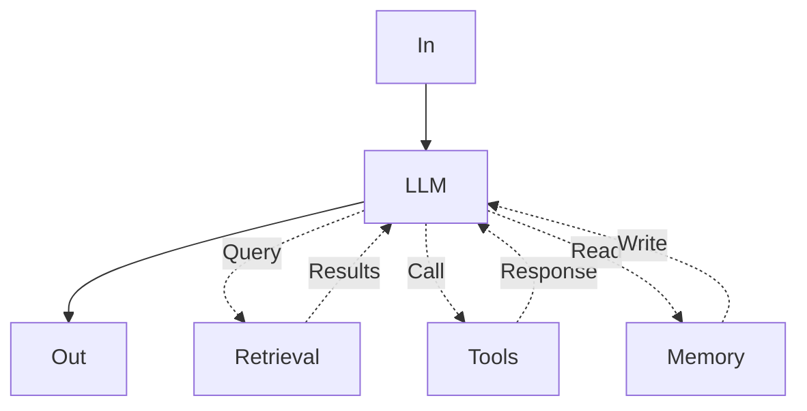
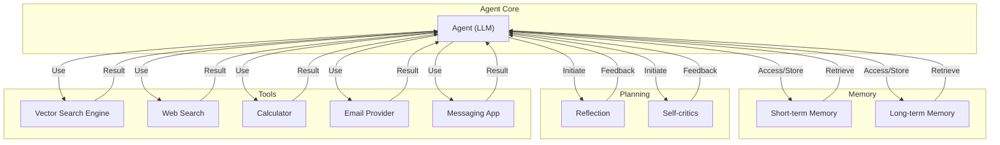
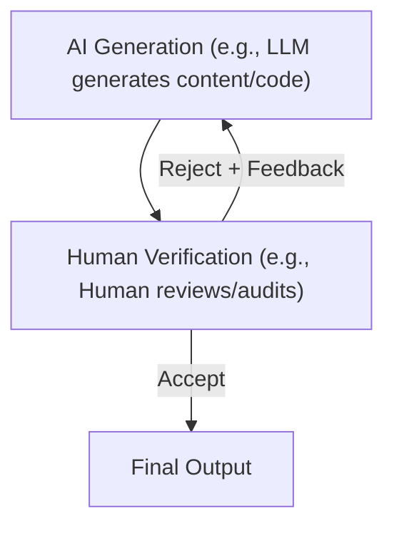
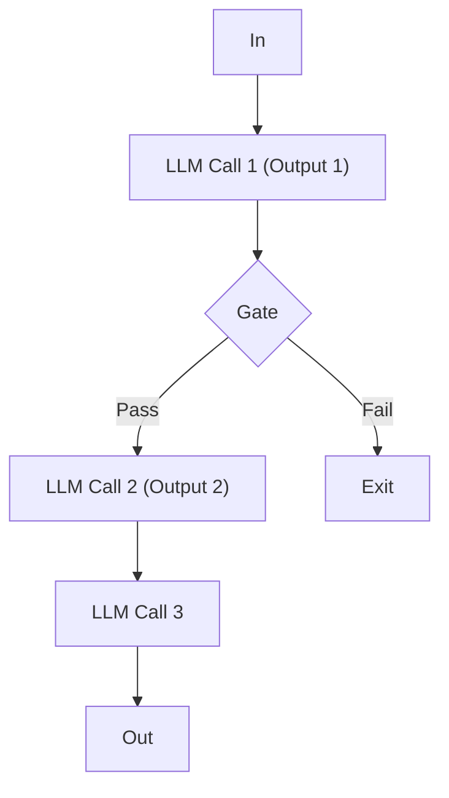
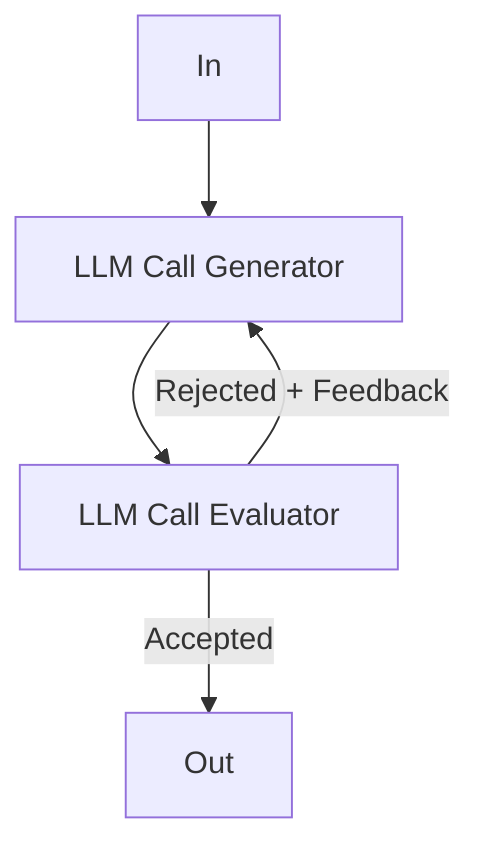
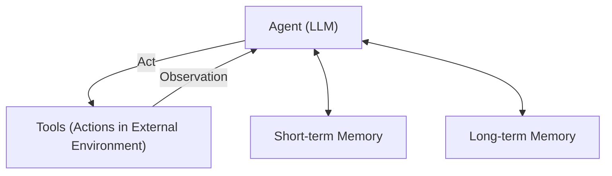
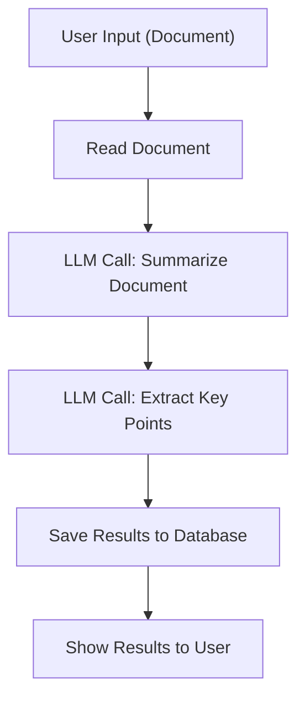
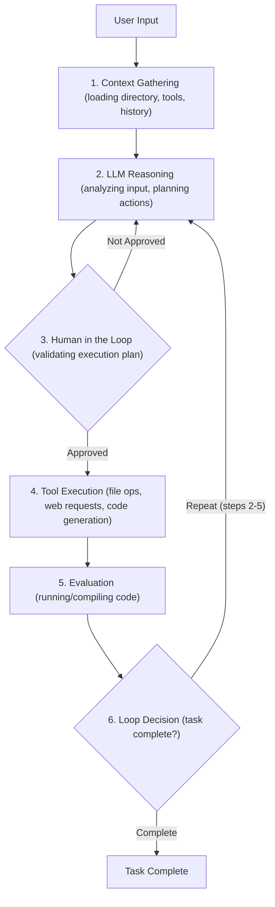
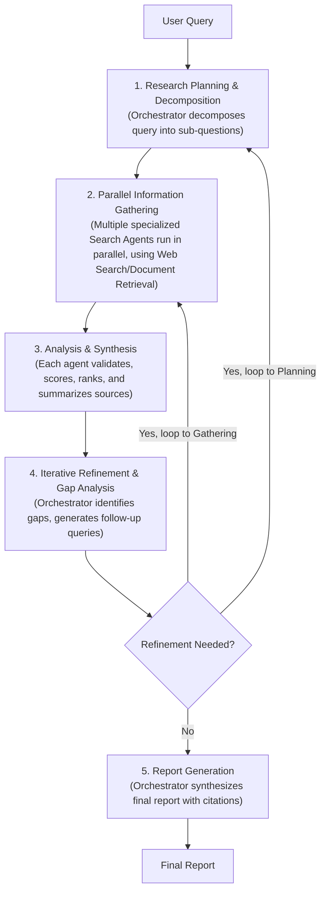

# Workflows vs. Agents: The Critical Decision Every AI Engineer Faces
### Architecting AI Systems for Success

As an AI engineer preparing to build your first real AI application, after narrowing down the problem you want to solve, one key decision is how to design your AI solution. Should it follow a predictable, step-by-step workflow, or does it demand a more autonomous approach, where the LLM makes self-directed decisions along the way? Thus one of the fundamental questions that will determine the success or failure of your project is: How should you architect your AI system?

When building AI applications, engineers face a critical architectural decision early in their development process. They must decide whether to create a predictable, step-by-step workflow where they control every action, or to build an autonomous agent that can think and decide for itself. This is one of the key decisions that will impact everything from development time and costs to reliability and user experience.

Choosing the wrong approach can lead to several problems. You might end up with an overly rigid system that breaks when users deviate from expected patterns or developers try to add new features. Alternatively, you could create an unpredictable agent that works brilliantly 80% of the time but fails catastrophically when it matters most. This can result in months of development time wasted rebuilding the entire architecture, frustrated users who cannot rely on the AI application, and executives facing high operational costs relative to profits.

In 2024-2025, billion-dollar AI startups succeeded or failed primarily based on this architectural decision [[34]](https://techcrunch.com/2025/06/18/here-are-the-24-us-ai-startups-that-have-raised-100m-or-more-in-2025/). The successful companies, teams, and AI engineers know when to use workflows versus agents, and more importantly, how to combine both approaches effectively. By the end of this lesson, you will gain a framework to make critical decisions between LLM workflows and AI agents with confidence. You will understand the fundamental trade-offs, see real-world examples from leading AI companies, and learn how to design systems that use the best of both approaches.

## Understanding the Spectrum: From Workflows to Agents

To choose between workflows and agents, you need a clear understanding of what they are. We will briefly look at LLM workflows and AI agents, focusing on their properties and common uses rather than technical specifics.

LLM workflows involve a sequence of tasks that include LLM calls or other operations, such as reading or writing data to a database or file system. This process is largely predefined and orchestrated by developer-written code. The steps are defined in advance, resulting in deterministic or rule-based paths with predictable execution and explicit control flow [[18]](https://blog.gopenai.com/agentic-workflows-vs-autonomous-ai-agents-do-you-know-the-difference-c21c9bfb20ac). Think of it like a factory assembly line, where each step is planned and executed in order. In future lessons, we will explore specific workflow patterns like chaining, routing (guiding the workflow between multiple decisions), and orchestrator-worker patterns.


Image 1: A simple LLM workflow diagram illustrating a sequence of predefined tasks with interactions with Retrieval, Tools, and Memory components.

AI agents are systems where an LLM (or multiple LLMs) plays a central role in dynamically deciding the sequence of steps, reasoning, and actions to achieve a goal. The steps are not defined in advance. Instead, they are dynamically planned based on the task and the current state of the environment [[18]](https://blog.gopenai.com/agentic-workflows-vs-autonomous-ai-agents-do-you-know-the-difference-c21c9bfb20ac). These systems are adaptive and capable of handling novelty, with LLM-driven autonomy in decision-making and execution paths [[21]](https://www.louisbouchard.ai/agents-vs-workflows/). Consider an AI agent as a skilled human expert tackling an unfamiliar problem, adapting on the moment after each "Eureka!" moment. In upcoming lessons, we will explore core components such as actions (instead of tools), memory, and ReAct agents.


Image 2: A simple agentic system diagram illustrating an 'Agent' (represented by an LLM) at its core, interacting with Memory, Planning, and Tools.

Both workflows and agents require an orchestration layer, but their nature differs. In workflows, the orchestration layer executes a defined plan. In agents, it facilitates the LLM's dynamic planning and execution [[18]](https://blog.gopenai.com/agentic-workflows-vs-autonomous-ai-agents-do-you-know-the-difference-c21c9bfb20ac).

## Choosing Your Path

In the previous section, we defined LLM workflows and AI agents independently. Now, we will explore their core differences: developer-defined logic versus LLM-driven autonomy in reasoning and action selection.

```mermaid
graph TD
    subgraph "LLM Workflows"
        W_Input["User Input"] --> W_Process["Defined Steps (LLM, Tools)"] --> W_Output["Predictable Output"]
    end

    W_Output --> Spectrum_Start["Spectrum Start: LLM Workflows"]

    note left of Spectrum_Start
        Application Reliability: HIGH
        Agent's Level of Control: LOW
    end

    Spectrum_Start --> Transition_Zone["Transition Zone"]

    note right of Transition_Zone
        Application Reliability decreases
        Agent's Level of Control increases
    end

    Transition_Zone --> Spectrum_End["Spectrum End: Autonomous Agents"]

    note left of Spectrum_End
        Application Reliability: LOW
        Agent's Level of Control: HIGH
    end

    Spectrum_End --> subgraph "Autonomous Agents"
        A_Goal["Goal/Task"] --> A_Perceive["Perceive Environment"]
        A_Perceive --> A_Reason["Reason & Plan (LLM)"]
        A_Reason --> A_Act["Execute Action"]
        A_Act --> A_Perceive
    end
```
Image 3: A diagram illustrating the spectrum between LLM workflows and autonomous agents, showing the inverse relationship between application reliability and agent's level of control.

You should use LLM workflows when the structure of the task is well-defined. Examples include pipelines for data extraction and transformation from sources like the web, messaging tools (Slack), video calls (Zoom), project management tools (Notion), and cloud storage (Google Drive). They are also useful for automated report or email generation from multiple data sources, understanding project requirements and creating or updating tasks in Notion, document summarization followed by translation, repetitive daily tasks like sending emails or posting social media updates, and content generation or repurposing, such as transforming articles into social media posts [[22]](https://www.cnet.com/tech/services-and-software/how-to-summarize-text-using-googles-gemini-ai/), [[23]](https://belitsoft.com/llm-summarization/), [[24]](https://workspaceupdates.googleblog.com/2025/06/summarize-responses-with-gemini-google-forms.html), [[25]](https://workspace.google.com/blog/product-announcements/may-workspace-feature-drop-new-ai-features/).

The strengths of LLM workflows include predictability and reliability for well-defined tasks, easier debugging of fixed paths, and potentially lower operational costs because you can use simpler and smaller models specialized in given sub-tasks. Since workflows are predictable, the costs and latency are also more predictable. Furthermore, using smaller models reduces infrastructure overhead [[19]](https://www.lyzr.ai/blog/agentic-ai-vs-llm/). Their weaknesses include potentially more development time for manually engineered steps. The user experience can be rigid, as it cannot handle unexpected scenarios. Adding new features can also become complex as the application grows, similar to developing standard software tools. Workflows are usually preferred in enterprises or regulated fields that require predictable programs that work all the time. For example, in finance, a financial advisor's report should consistently contain the correct information, as it directly impacts people's money and lives. In the health space, AI tools must work with high accuracy all the time, as they have a direct impact on people's lives [[13]](https://www.deloitte.com/us/en/insights/industry/technology/technology-media-and-telecom-predictions/2025/autonomous-generative-ai-agents-still-under-development.html). Workflows are ideal for Minimum Viable Products (MVPs) that require rapid deployment by hardcoding features, and they excel in scenarios where cost per request matters more than sophisticated reasoning, handling thousands of requests per minute.

You should use AI agents for open-ended research and synthesis, such as researching World War II. They are also ideal for dynamic problem-solving, like debugging code or handling complex customer support issues. Interactive task completion in unfamiliar environments, such as booking a flight without specifying the exact sites to use, is another suitable use case [[5]](https://arxiv.org/html/2506.18096v1). The strengths of AI agents include adaptability to new situations and the flexibility to handle ambiguity and complexity, as the steps are dynamically decided [[21]](https://www.louisbouchard.ai/agents-vs-workflows/).

However, AI agents also have weaknesses. The system is more prone to errors, and because the agent is non-deterministic, performance, latency, and costs can vary with each call, making agents often unreliable [[19]](https://www.lyzr.ai/blog/agentic-ai-vs-llm/). Agents require LLMs that can generalize better, which are bigger and more costly. Adopting an agentic solution usually ends up being more expensive. AI agents often require more LLM calls to understand user intent and take various actions, which can result in bigger costs per call [[18]](https://blog.gopenai.com/agentic-workflows-vs-autonomous-ai-agents-do-you-know-the-difference-c21c9bfb20ac/). If not designed well, there can be significant security concerns, especially with write operations, which could delete all your data or send inappropriate emails [[9]](https://ardor.cloud/blog/common-ai-agent-deployment-issues-and-solutions/), [[11]](https://www.strata.io/blog/agentic-identity/hidden-identity-challenges-ai-agents-hybrid-environment-1a/). A major disadvantage of AI agents is that they are hard to debug and evaluate [[19]](https://www.lyzr.ai/blog/agentic-ai-vs-llm/). We have even heard funny stories about people having their code deleted by agents like Replit Agent or Claude Code, leading to jokes like "Anyway, I wanted to start a new project."

Most real-world systems blend elements of both approaches. In reality, we have a spectrum, a gradient between LLM workflows and AI agents, where a system adopts what is best from both worlds depending on its use cases. When building an application, you usually have an "autonomy slider" where you decide how much control to give to the LLM versus the user. As you go more manually, you typically use an LLM workflow together with a human who verifies intermediate steps. As you automate more, you give more control to the agent with fewer human-in-the-loop steps. Andrej Karpathy highlights this with examples like Cursor, where you can use `CMD+K` for small changes, `CMD+L` for file-wide changes, or `CMD+I` for full autonomy across a repository. Similarly, Perplexity offers options from quick search to deep research, representing varying levels of autonomy.

The ultimate goal is to speed up the AI generation and human verification loop. This is often achieved through good workflow or agentic architecture and well-designed user interface/user experience platforms.


Image 4: A flowchart illustrating the AI generation and human verification loop.

## Exploring Common Patterns

To introduce you to the AI engineering world, we will present the most common patterns used to build AI agents and LLM workflows. We will explain them as if this is the first time you are hearing about them. Our goal for this section is not for you to fully understand how these patterns work, but just to build an intuition on various LLM workflows and AI agent patterns that you will learn during the course. We will specify that in future lessons, you will dig into all the necessary details of each pattern.

LLM workflows often use chaining and routing to automate multiple LLM calls. As a first automation step, this helps glue together multiple LLM calls and decide between multiple appropriate options [[26]](https://www.revanthquicklearn.com/post/understanding-workflow-design-patterns-in-ai-systems/). For example, one LLM call might generate an outline, and another might write the document based on that outline. Routing, or guiding the workflow between multiple decisions, classifies an input and directs it to a specialized follow-up task [[29]](https://docs.aws.amazon.com/prescriptive-guidance/latest/agentic-ai-patterns/workflow-for-routing.html). This is useful for handling different types of customer service queries, where each type needs a different process.


Image 5: A flowchart illustrating the chaining and routing LLM workflow pattern.

The orchestrator-worker pattern helps understand user intent, dynamically plan and call multiple actions, and synthesize them into a final answer [[16]](https://www.anthropic.com/research/building-effective-agents/). This pattern allows the AI program to dynamically decide what actions to take based on the given task, making a smooth transition between the workflow and agentic world. For instance, a central LLM (orchestrator) might classify a task and delegate it to specialized worker LLMs, which then perform specific subtasks and return results for the orchestrator to synthesize. We will cover this pattern in more detail in Lesson 5.

```mermaid
graph TD
    In["In"] --> Orchestrator["Orchestrator LLM"]

    subgraph "Worker LLMs (Parallel Execution)"
        Worker1["Worker LLM 1"]
        Worker2["Worker LLM 2"]
        Worker3["Worker LLM 3"]
    end

    Orchestrator -->| "Dynamically plans & delegates" | Worker1
    Orchestrator -->| "Dynamically plans & delegates" | Worker2
    Orchestrator -->| "Dynamically plans & delegates" | Worker3

    Worker1 -->| "Subtask Results" | Orchestrator
    Worker2 -->| "Subtask Results" | Orchestrator
    Worker3 -->| "Subtask Results" | Orchestrator

    Orchestrator -->| "Synthesized Final Output" | Out["Out"]
```
Image 6: A flowchart illustrating the Orchestrator-Worker LLM workflow pattern, emphasizing dynamic delegation and synthesis.

The evaluator-optimizer loop is used to auto-correct the results from an LLM based on automated feedback [[14]](https://javaaidev.com/docs/agentic-patterns/patterns/evaluator-optimizer/). LLM outputs can drastically improve when provided feedback on what they did wrong. This pattern automates that by having an "LLM reviewer" that analyzes the output from the LLM who generated the answer, creates an error report (also known as a reflection), and passes it back to the generator to auto-correct itself. An example is a human writer refining a document based on feedback.


Image 7: A flowchart illustrating the Evaluator-Optimizer LLM workflow pattern.

The core components of a ReAct AI agent involve an LLM that takes actions and interprets outputs from actions, along with short-term memory and long-term memory. This pattern is used to automatically decide what action to take, interpret the output of the action, and repeat until the given task is completed. This is the core of a ReAct agent [[3]](https://cloud.google.com/gemini/docs/codeassist/gemini-cli). The LLM is the "brain" that orchestrates the process. Actions (instead of tools), which will be covered in more detail in Lesson 6, allow the agent to interact with its external environment. Short-term memory is the working memory of the agent, comparable to how RAM works for computers. Long-term memory, which we will discuss in Lesson 9, is used to access factual data about the external world, such as public websites from the internet or private data from a company's databases, and to remember user preferences. Almost all modern agents from the industry use the ReAct pattern as it has shown the most potential. We will explain the ReAct pattern in a lot of detail in Lessons 7 and 8.


Image 8: A flowchart illustrating the core components and dynamics of an AI agent using the ReAct (Reason and Act) pattern.

## Zooming In on Our Favorite Examples

To better anchor you in the world of LLM workflows and AI agents, we will introduce some concrete examples, from a simple workflow to a single agent system and a more advanced hybrid solution. We will keep this section high-level and intuitive, as if speaking to a 7-year-old, since you are not yet aware of any complex topics beyond what was explained previously in this lesson about LLM workflows or AI agents.

**Document summarization and analysis workflow by Gemini in Google Workspace**

When working in teams and looking for the right document, it can become a time-consuming process. Many documents are large, making it hard to understand which one contains the right information. A quick, embedded summarization can guide you and your search strategies.


Image 9: A flowchart illustrating a simple LLM workflow for document summarization and analysis in Google Workspace.

This workflow reads a document, summarizes it using an LLM call, extracts key points with another LLM call, saves the results to a database, and then shows the results to the user [[22]](https://www.cnet.com/tech/services-and-software/how-to-summarize-text-using-googles-gemini-ai/). This is a pure and simple workflow as a chain with multiple LLM calls.

**Gemini CLI coding assistant**

Writing code is a time-consuming process. You often read documentation or outdated blogs. When working on new codebases, understanding them is a slow process. To write high-quality code in a new programming language, you typically need a bootcamp before writing any industry-level code. A coding assistant can help you speed up writing code on existing and new codebases.

To build an intuition on agents, we present at a very high and intuitive level how the Gemini CLI tool leverages the ReAct (Reason and Act) agent architecture to implement a single-agent system for coding [[3]](https://cloud.google.com/gemini/docs/codeassist/gemini-cli), [[4]](https://blog.google/technology/developers/introducing-gemini-cli-open-source-ai-agent/). The `gemini-cli` is open-sourced on GitHub, allowing us to be more accurate and specific about its implementation.

Gemini CLI offers various use cases. It can write code from scratch, even without requiring any coding experience, a process known as "vibe coding." It assists engineers in writing code faster by generating specific functions or classes. It also supports writing documentation and helps you quickly understand new codebases. Other similar tools include Cursor, Windsurf, Claude Code, and Warp. To keep the explanations light and intuitive, we use parallels such as "actions" instead of "tools" and "state" or "working memory" instead of "context."

Here is how Gemini CLI works based on our latest research from August 2025:
1.  **Context Gathering**: The system loads the directory structure, available actions, and the conversation history, known as context, into the state [[3]](https://cloud.google.com/gemini/docs/codeassist/gemini-cli).
2.  **LLM Reasoning**: The Gemini model analyzes the user input against the current context to understand what actions it requires to take to adapt the code as requested by the user.
3.  **Human in the Loop**: Before taking any actions, it validates the execution plan with the user [[32]](https://www.tomsguide.com/ai/openais-new-chatgpt-agent-is-here-5-features-that-change-everything).
4.  **Action Execution**: The selected actions, known as tools, are executed. These actions can include file operations to read the current state of the code, web requests for documentation, and ultimately generating the code. The agent then processes the tool outputs, adds the results into the conversation context to reference it in future iterations [[3]](https://cloud.google.com/gemini/docs/codeassist/gemini-cli).
5.  **Evaluation**: The agent dynamically evaluates whether the generated code is correct by running or compiling the code.
6.  **Loop Decision**: The agent determines if the task is completed or if it should repeat steps 2 to 5 by planning and executing more actions.


Image 10: Flowchart illustrating the operational loop of the Gemini CLI coding assistant based on the ReAct pattern.

More action examples include file system access, such as using `grep` functions to read specific functions or classes from the codebase, or listing the directory structure of the codebase or module [[3]](https://cloud.google.com/gemini/docs/codeassist/gemini-cli). For coding, actions include code interpreting, generating code diffs, and executing the generated code for dynamic validation. Web search actions can retrieve documentation, blogs, and solutions. Version control actions, such as `git`, can automatically commit your code to GitHub or GitLab.

**Perplexity deep research (e.g., for scientific, financial, social research)**

Researching a brand new topic can be challenging. Most of the time, you might not know where to start: What is the right blog, paper, YouTube video, or course to begin with? For more trivial questions, you often lack the time to dig into many resources. A research assistant that quickly scans the internet and compiles a report can significantly boost your learning process on scientific, financial, and social topics.

To build an intuition for LLM workflow and AI agent hybrid systems, we will present how Perplexity's Deep Research agent works at an intuitive and very high level. Perplexity's Deep Research agent is a hybrid system that combines ReAct reasoning with LLM workflow patterns to conduct autonomous research at an expert level [[5]](https://arxiv.org/html/2506.18096v1), [[39]](https://www.perplexity.ai/hub/blog/introducing-perplexity-deep-research). Unlike single-agent approaches, such as the Gemini CLI, this system uses multiple specialized agents orchestrated in parallel by workflows. It performs dozens of searches across hundreds of sources to synthesize comprehensive research reports within 2-4 minutes [[38]](https://www.usaii.org/ai-insights/what-is-perplexity-deep-research-a-detailed-overview/).

This is how Perplexity Deep Research agent works based on our latest research from August 2025. This solution is closed-source, so everything we write here is an assumption based on what we could find on the open internet or other people's speculations. Still, it is an excellent use case to understand how hybrid systems work.

Here is an oversimplified version of how Perplexity's Deep Research agent could work:
1.  **Research Planning & Decomposition**: The orchestrator analyzes the research question and decomposes it into a set of targeted sub-questions. The orchestrator leverages the orchestrator-worker pattern to deploy multiple research agents with different sub-questions [[40]](https://www.langchain.com/breakoutagents/perplexity).
2.  **Parallel Information Gathering**: For each sub-question, to optimize and move faster in the search space, specialized search agents run in parallel. These agents use actions such as web searches and document retrieval to gather as much information as possible for that specific question. Since the research agents are isolated from each other, the input tokens are smaller, helping the LLM to stay focused.
3.  **Analysis & Synthesis**: After gathering bulks of sources, each agent validates and scores each source using strategies like domain credibility or relevance scoring relative to the query. Each source is then ranked based on its importance. Ultimately, the top K sources are summarized into a final report [[39]](https://www.perplexity.ai/hub/blog/introducing-perplexity-deep-research).
4.  **Iterative Refinement & Gap Analysis**: The orchestrator gathers information from all the agents that ran in parallel and identifies knowledge gaps relative to the research requested by the user. Based on any potential knowledge gaps, it generates follow-up queries by repeating steps 1 and 3 until all knowledge gaps are filled, or a maximum number of steps is reached to avoid infinite loops [[38]](https://www.usaii.org/ai-insights/what-is-perplexity-deep-research-a-detailed-overview/).
5.  **Report Generation**: The orchestrator takes the results from all the AI agents and generates a final report with inline citations [[39]](https://www.perplexity.ai/hub/blog/introducing-perplexity-deep-research/).


Image 11: Flowchart illustrating Perplexity's Deep Research agent process.

The Deep Research agent operates as a hybrid between workflows and agents, combining structured planning with dynamic adaptation. The workflow uses the orchestrator-worker pattern to dynamically reason, supervise, and call in parallel multiple agents specialized in researching only a targeted sub-query until all the user-requested research topics are fulfilled.

## Conclusion: The Challenges of Every AI Engineer

Now that you understand the spectrum from LLM workflows to AI agents, it is important to recognize that every AI engineer, whether working at a startup or a Fortune 500 company, faces these same fundamental challenges whenever designing a new AI application. These are one of the core decisions that determine whether your AI application succeeds in production or fails spectacularly.

Here are some daily challenges every AI engineer battles:
*   **Reliability Issues:** Your agent works perfectly in demos but becomes unpredictable with real users. LLM reasoning failures can compound through multi-step processes, leading to unexpected and costly outcomes [[13]](https://www.deloitte.com/us/en/insights/industry/technology/technology-media-and-telecom-predictions/2025/autonomous-generative-ai-agents-still-under-development.html).
*   **Context Limits:** Systems struggle to maintain coherence across long conversations, gradually losing track of their purpose. Ensuring consistent output quality across different agent specializations presents a continuous challenge.
*   **Data Integration:** Building pipelines to pull information from Slack, web APIs, SQL databases, and data lakes while ensuring only high-quality data is passed to your AI system, following the garbage-in, garbage-out principle [[9]](https://ardor.cloud/blog/common-ai-agent-deployment-issues-and-solutions/).
*   **Cost-Performance Trap:** Sophisticated agents deliver impressive results but cost a fortune per user interaction, making them economically unfeasible for many applications [[19]](https://www.lyzr.ai/blog/agentic-ai-vs-llm/).
*   **Security Concerns:** Autonomous agents with powerful write permissions could send wrong emails, delete critical files, or expose sensitive data [[11]](https://www.strata.io/blog/agentic-identity/hidden-identity-challenges-ai-agents-hybrid-environment-1a/).

The good news is that these challenges are solvable. In upcoming lessons, we will cover patterns for building reliable products through specialized evaluation and monitoring pipelines, strategies for building hybrid systems, and ways to keep costs and latency under control.

Your path forward is to architect AI systems that are not only powerful but also robust, efficient, and safe. You will learn when to use workflows versus agents and how to build effective hybrid systems that work in the real world. In the next lesson, we will explore structured outputs in detail. We will also introduce concepts like chaining, routing, orchestrator-worker patterns, actions (instead of tools), short-term memory, long-term memory, Retrieval-Augmented Generation (RAG), and evaluations throughout this course.

## References

1. Anthropic. (n.d.). Building effective agents. https://www.anthropic.com/engineering/building-effective-agents
2. Google Cloud. (n.d.). What is an AI agent? https://cloud.google.com/discover/what-are-ai-agents
3. Google. (n.d.). Gemini CLI. https://cloud.google.com/gemini/docs/codeassist/gemini-cli
4. Google. (n.d.). Introducing Gemini CLI: your open-source AI agent. https://blog.google/technology/developers/introducing-gemini-cli-open-source-ai-agent/
5. Liu, J., Li, Y., Wang, Y., Zhang, W., Chen, J., & Li, H. (2025, June 18). Deep Research Agents: A Comprehensive Survey. arXiv. https://arxiv.org/html/2506.18096v1
6. Liu, J. (n.d.). Stop Building AI Agents: Here’s what you should build instead. Decoding AI Magazine. https://decodingml.substack.com/p/stop-building-ai-agents
7. Liu, J. (n.d.). Exploring the difference between agents and workflows. Decoding AI Magazine. https://decodingml.substack.com/p/llmops-for-production-agentic-rag
8. Karpathy, A. (n.d.). Andrej Karpathy: Software Is Changing (Again). YouTube. https://www.youtube.com/watch?v=LCEmiRjPEtQ
9. Ardor Cloud. (n.d.). Common AI Agent Deployment Issues and Solutions. https://ardor.cloud/blog/common-ai-agent-deployment-issues-and-solutions
10. Bouchard, L. F. (n.d.). Real Agents vs. Workflows: The Truth Behind AI 'Agents'. YouTube. https://www.youtube.com/watch?v=kQxr-uOxw2o&t=1s
11. Strata. (n.d.). Agentic Identity: Hidden Identity Challenges for AI Agents in a Hybrid Environment. https://www.strata.io/blog/agentic-identity/hidden-identity-challenges-ai-agents-hybrid-environment-1a/
12. Towards Data Science. (n.d.). A Developer’s Guide to Building Scalable AI: Workflows vs Agents. https://towardsdatascience.com/a-developers-s-guide-to-building-scalable-ai-workflows-vs-agents/
13. Deloitte. (n.d.). Autonomous generative AI agents: Still under development. https://www.deloitte.com/us/en/insights/industry/technology/technology-media-and-telecom-predictions/2025/autonomous-generative-ai-agents-still-under-development.html
14. javaaidev. (n.d.). Evaluator-Optimizer. https://javaaidev.com/docs/agentic-patterns/patterns/evaluator-optimizer/
15. Liu, J. (n.d.). Building Production-Ready RAG Applications: Jerry Liu. YouTube. https://www.youtube.com/watch?v=TRjq7t2Ms5I
16. Anthropic. (n.d.). Building effective agents. https://www.anthropic.com/research/building-effective-agents
17. OpenAI. (n.d.). Introducing ChatGPT agent: bridging research and action. https://openai.com/index/introducing-chatgpt-agent/
18. GoPenAI. (n.d.). Agentic Workflows vs. Autonomous AI Agents: Do you know the difference? https://blog.gopenai.com/agentic-workflows-vs-autonomous-ai-agents-do-you-know-the-difference-c21c9bfb20ac
19. Lyzr. (n.d.). Agentic AI vs. LLM. https://www.lyzr.ai/blog/agentic-ai-vs-llm/
20. Bouchard, L. F. (n.d.). Agents vs. Workflows. https://www.louisbouchard.ai/agents-vs-workflows/
21. CNET. (n.d.). How to summarize text using Google’s Gemini AI. https://www.cnet.com/tech/services-and-software/how-to-summarize-text-using-googles-gemini-ai/
22. Belitsoft. (n.d.). LLM summarization. https://belitsoft.com/llm-summarization
23. Google Workspace Updates. (n.d.). Summarize responses with Gemini in Google Forms. https://workspaceupdates.googleblog.com/2025/06/summarize-responses-with-gemini-google-forms.html
24. Google Workspace. (n.d.). May Workspace Feature Drop: New AI Features. https://workspace.google.com/blog/product-announcements/may-workspace-feature-drop-new-ai-features
25. Revanth Quicklearn. (n.d.). Understanding Workflow Design Patterns in AI Systems. https://www.revanthquicklearn.com/post/understanding-workflow-design-patterns-in-ai-systems
26. Philschmid. (n.d.). Agentic Pattern. https://www.philschmid.de/agentic-pattern
27. AWS. (n.d.). Workflow for Routing. https://docs.aws.amazon.com/prescriptive-guidance/latest/agentic-ai-patterns/workflow-for-routing.html
28. TechTarget. (n.d.). ChatGPT agents explained. https://www.techtarget.com/whatis/feature/ChatGPT-agents-explained
29. Tomsguide. (n.d.). OpenAI’s new ChatGPT agent is here: 5 features that change everything. https://www.tomsguide.com/ai/openais-new-chatgpt-agent-is-here-5-features-that-change-everything
30. TechCrunch. (n.d.). Here are the 24 US AI startups that have raised $100M or more in 2025. https://techcrunch.com/2025/06/18/here-are-the-24-us-ai-startups-that-have-raised-100m-or-more-in-2025/
31. USAII. (n.d.). What is Perplexity Deep Research: A Detailed Overview. https://www.usaii.org/ai-insights/what-is-perplexity-deep-research-a-detailed-overview
32. Perplexity. (n.d.). Introducing Perplexity Deep Research. https://www.perplexity.ai/hub/blog/introducing-perplexity-deep-research
33. LangChain. (n.d.). Perplexity. https://www.langchain.com/breakoutagents/perplexity