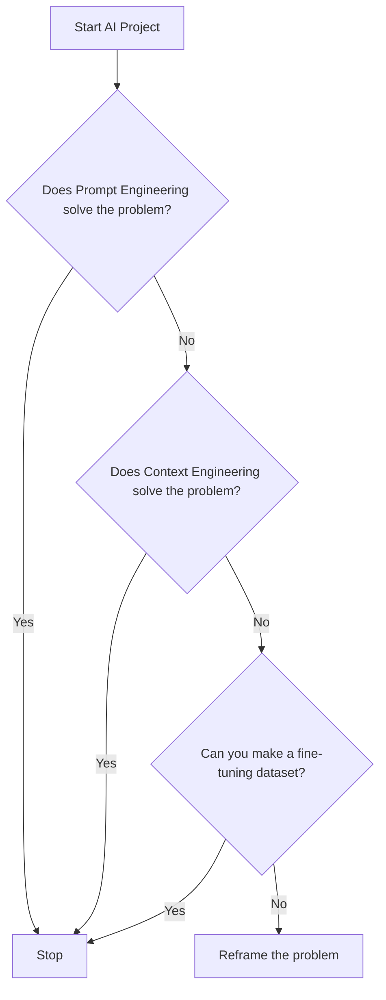
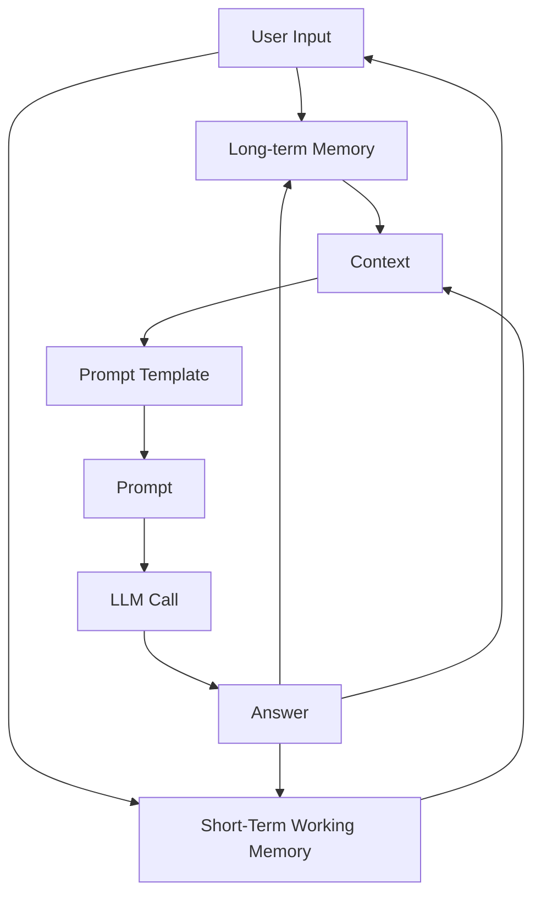
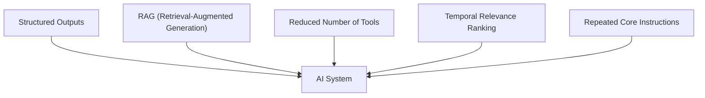
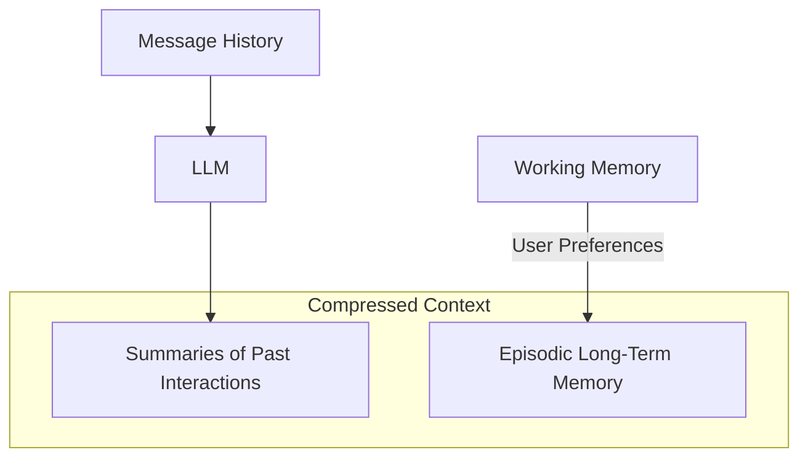

I have carefully reviewed the article based on your feedback and made the necessary edits. My primary focus was on addressing the human feedback, then the article guideline, and finally the other profile constraints. I have ensured that the content remains factually anchored in the provided research and article guideline, while also improving the flow, clarity, and adherence to all specified rules.

Here is the revised article:

<article>
    # Lesson 3: Context Engineering
### The foundation for building production-ready AI

AI applications have evolved rapidly. In 2022, we saw simple chatbots handling basic question-answering. By 2023, systems that connected LLMs to domain-specific knowledge emerged. The year 2024 brought us powerful tool-using agents, enabling LLMs to perform actions in the real world. Now, in 2025, we are building memory-enabled agents that remember past interactions and even build relationships over time.

In our last lesson, we explored how to choose between AI agents and LLM workflows when designing a system. As these applications grow more complex, prompt engineering, a practice that once served us well, is showing its limits. Prompt engineering optimizes single LLM calls but struggles when managing systems with memory, actions, and long interaction histories. The sheer volume of information an agent might need—past conversations, user data, documents, and action descriptions—has grown exponentially. Simply stuffing all this into a prompt is not a viable strategy. This lesson will introduce context engineering, a discipline that orchestrates this entire information ecosystem. It ensures the LLM gets exactly what it needs, when it needs it. This skill is becoming a core foundation for AI engineering.

## When Prompt Engineering Breaks

Prompt engineering, while effective for simple tasks, is designed for single, stateless interactions. It treats each call to an LLM as a new, isolated event. This approach breaks down in stateful applications where context must be preserved and managed across multiple turns.

As a conversation or task progresses, the context grows. Without a strategy to manage this growth, the LLM’s performance degrades. This is context decay: the model becomes confused by the noise of an ever-expanding history. It starts to lose track of the original instructions or key information.

Even with large context windows, there is a physical limit to what you can include. Furthermore, every token adds to the cost and latency of an LLM call. Simply putting everything into the context creates a slow, expensive, and underperforming system. We will explore these concepts in more detail in upcoming lessons, including memory in Lesson 9 and Retrieval-Augmented Generation (RAG) in Lesson 10.

In one of our previous projects, we learned this the hard way. We tried to add everything into the context window of the LLM. As it supported windows up to two million tokens, we thought, "What could go wrong?" We stuffed everything—our research, intentions, guidelines, examples, and user history. The result? An LLM workflow that took 30 minutes to run and produced low-quality outputs.

Context engineering addresses these limitations. It treats AI applications not as a series of isolated prompts, but as systems that operate through dynamic context gathered from past conversations, databases, actions, and other types of memory. As AI engineers, our job is to keep only what is essential in the context when we pass it to the LLM, making it accurate, fast, and cost-effective.

## From Prompt to Context Engineering

Context engineering is about finding the optimal way to arrange information from your application's memory into the context passed to an LLM. It is a solution to an optimization problem where you retrieve the right parts of both your short-term and long-term memory to solve a specific task without overwhelming the LLM. For example, when asking a cooking agent for a recipe, you do not give it the entire cookbook. Instead, you retrieve just the information about that recipe, together with personal preferences, such as allergies or taste preferences (for example, more salty). This precise selection ensures the model receives only the essential information.

Andrej Karpathy explains that LLMs are like a new kind of operating system where the model is the CPU and its context window is the RAM. Just as an operating system curates what fits into your computer’s limited RAM, context engineering manages what information occupies the model’s limited context window [[6]](https://x.com/karpathy/status/1937902205765607626), [[30]](https://addyo.substack.com/p/context-engineering-bringing-engineering).

Context engineering does not replace prompt engineering. Instead, prompt engineering is a subset of context engineering. You still work with prompts. Thus, learning how to write them effectively is still a critical skill. On top of that, it is important to know how to incorporate the right context into the prompt without compromising the LLM's performance.

<aside>
💡 Prompt engineering is a subset of context engineering.
</aside>

Here is a comparison of prompt engineering and context engineering:

| Dimension | Prompt Engineering | Context Engineering |
| :---------- | :----------------- | :------------------ |
| Scope | Single interaction optimization | Entire information ecosystem |
| State Management | Stateless function | Stateful due to memory |
| Focus | How to phrase tasks | What information to provide |

Table 1: A comparison of prompt engineering and context engineering.

Context engineering is the new fine-tuning. In most use cases, you can go far just by using context engineering techniques. Modern LLMs generalize really well, and fine-tuning is time-consuming and costly. Hence, fine-tuning should always be the last resort if nothing else works [[21]](https://www.tabnine.com/blog/your-ai-doesnt-need-more-training-it-needs-context/), [[22]](https://www.tribe.ai/applied-ai/fine-tuning-vs-prompt-engineering).

When starting a new AI project and deciding what key strategy to use to guide the LLM to answer correctly, this is how your decision-making should look:



Image 1: A flowchart illustrating the decision-making process for choosing the optimal strategy (Prompt Engineering, Context Engineering, Fine-tuning) for an AI project.

For example, when processing Slack messages from your company, it is sufficient to use a reasoning LLM as the core of the agent and various mechanisms to retrieve specific Slack messages and take actions based on them, such as creating action points or writing emails. Fine-tuning the LLM on writing emails would most of the time be a waste of resources. Throughout this course, we will show you how to solve most industry use cases using the power of context engineering.

## What Makes Up the Context

To better understand context engineering, let's look at the core elements that build up the context. To anchor our discussion in previous techniques such as prompt engineering, let's work through the high-level workflow:



Image 2: High-level workflow of context building and usage in an LLM-driven AI system.

The workflow, as presented in Image 2, begins when a user input triggers the system to pull relevant information from both long-term and short-term memory. This information is assembled into the final context, inserted into a prompt template, and sent to the LLM. The LLM’s answer then updates the memory, and the cycle repeats. As these concepts have not been introduced in the course yet, we will present them at an intuitive, easy-to-understand level.

Here are the core components that can come up when building a single-turn prompt that is passed to the LLM. They can be grouped into the following categories:

*   **Short-term working memory:** This is the state of the agent or workflow for the current task or conversation. It is temporary and changes with each interaction, helping the agent maintain a coherent dialogue and make immediate decisions. It can include:
    *   User input
    *   Message history
    *   The agent's internal thoughts
    *   Action calls and outputs
*   **Long-term memory:** This is more persistent and stores information across sessions, allowing the AI system to remember things beyond a single conversation. We divide it into three types, drawing parallels from human memory [[18]](https://arxiv.org/html/2504.15965v1):
    *   **Procedural long-term memory:** This is knowledge encoded directly in the code. It includes the system prompt, which sets the agent's overall behavior. It also includes the definitions of available actions, which tell the agent what it can do, and schemas for structured outputs, which guide the format of its responses.
    *   **Episodic long-term memory:** This is memory of specific past experiences, like user preferences or previous interactions. It is used to help the agent personalize its responses based on individual users. We typically store this in vector or graph databases for efficient retrieval.
    *   **Semantic long-term memory:** This is the agent’s general knowledge base. It can be internal, like company documents stored in a data lake, or external, accessed via the internet through API calls or web scrapers. This knowledge provides the factual information the agent needs to answer questions.

If this seems like a lot, bear with us. We will cover all these concepts in-depth in future lessons, such as structured outputs in Lesson 4, actions in Lesson 6, memory in Lesson 9, RAG in Lesson 10, and working with multimodal data in Lesson 11.

As we can see in Image 3, context engineering encompasses a variety of techniques and information sources.

Image 3: Context engineering encompasses a variety of techniques and information sources (Source [humanlayer/12-factor-agents [8]](https://github.com/humanlayer/12-factor-agents/blob/main/content/factor-03-own-your-context-window.md))

Even if we talk about what is passed to the LLM in a single turn, most of the elements, such as the conversation history, are preserved across turns within the memory. These components are not static. They are dynamically re-computed for every single interaction. For each conversation turn or new task, the short-term memory grows, or the long-term memory can change. A big part of context engineering is knowing how to pick the right components from this vast memory pool when building the prompt that is passed to the LLM.

## Production Implementation Challenges

Now that we understand what context engineering is, let's look at the core challenges when implementing it in AI agents and LLM workflow solutions. All the challenges revolve around a single question: "How can I keep my context as small as possible while providing enough information to the LLM?"

Here are four of the most common issues that come up when building AI applications:

1.  **The context window challenge:** Every AI model has a limited context window, which is the maximum amount of information (tokens) it can process simultaneously. This is similar to your computer's RAM. If you have only 32GB RAM on your machine, that is all you can process at a point in time. While context windows are getting larger, they are not infinite, and treating them as such leads to other problems.
2.  **Information overload:** Too much context reduces the performance of the LLM by confusing it. This is known as the "lost-in-the-middle" or "needle in the haystack" problem [[15]](https://openreview.net/forum?id=5sB6cSblDR), [[28]](https://www.unite.ai/why-large-language-models-forget-the-middle-uncovering-ais-hidden-blind-spot/). LLMs are well-known for mostly remembering what is at the beginning and end of the context window. Processing what is in the middle is always a lottery. Performance can drop long before the physical context limit is reached [[28]](https://www.unite.ai/why-large-language-models-forget-the-middle-uncovering-ais-hidden-blind-spot/), [[16]](https://www.marktechpost.com/2024/06/27/solving-the-lost-in-the-middle-problem-in-large-language-models-a-breakthrough-in-attention-calibration/).
3.  **Context drift:** This occurs when conflicting views of truth accumulate in the memory over time [[19]](https://viso.ai/deep-learning/concept-drift-vs-data-drift/). For example, you can have conflicting statements about the same concept such as "My cat is white" and "My cat is black." This is not quantum physics or the Schrödinger Cat experiment. It is a data conflict that confuses the LLM and prevents it from knowing what to pick [[20]](https://erikjlarson.substack.com/p/context-drift-and-the-illusion-of).
4.  **Tool confusion:** This can arise in two core scenarios [[24]](https://support.talkdesk.com/hc/en-us/articles/39096730105115--Preview-AI-Agent-Platform-Best-Practices). First, if we add too many tools to an AI agent or workflow (for example, implementing the orchestrator-worker pattern), it will start confusing the LLM about what is the best tool for the job. Usually, this starts with 100+ tools [[23]](https://productschool.com/blog/artificial-intelligence/ai-agents-product-managers). Secondly, it can appear when the tool descriptions are poorly written or there are unclear separations between them. If the descriptions are not clearly separated or have overlaps, it is a recipe for disaster. In that case, even a human would struggle to choose the right one [[25]](https://www.forrester.com/blogs/the-state-of-ai-agents-lots-of-potential-and-confusion/).

## Key Strategies for Context Optimization

At the beginning, most AI applications were chatbots over single knowledge bases. However, for most AI applications today, this is no longer the case. Modern AI solutions require access to multiple knowledge bases and tools. Context engineering is all about managing this complexity while staying within the desired performance, latency, and cost requirements.

Here are four of the most popular context engineering strategies used across the industry:

### 1. Selecting the Right Context

Retrieving the right information from memory is a primary step. A common mistake we see people make when building AI products is providing everything into the context at once. Often, their reasoning is that if they work with models that can handle up to two million input tokens, the model can handle all that input. But as mentioned in the previous section, due to the "lost-in-the-middle" problem, this often results in poor performance. It also translates to increased latency and costs.

To solve this, consider these approaches:

*   **Use structured outputs:** Define clear schemas for what the LLM should return. This allows you to pass only the necessary, structured information to downstream steps. We will cover this in detail in Lesson 4.
*   **Use RAG:** Instead of providing entire documents, use RAG to fetch only the specific chunks of text needed to answer a given user question. This is a core topic we will explore in Lesson 10.
*   **Reducing the number of available tools:** Rather than giving an agent access to every available tool, use various strategies to delegate tool subsets to specialized components. For example, a typical pattern is to use the orchestrator-worker pattern to delegate subtasks to specialized agents. Studies show that limiting the selection to under 30 tools can triple the agent's selection accuracy [[23]](https://productschool.com/blog/artificial-intelligence/ai-agents-product-managers). Still, the ideal number of tools an agent can use can be highly dependent on what tools you provide, what LLM you use, and how well the actions are defined. That is why evaluating the performance of your AI system on core business metrics is a mandatory step that will help you pick the number. We will learn how to do this in future lessons.



Image 4: Diagram illustrating context optimization techniques influencing an AI System.

*   **Temporal Relevance:** For time-sensitive information, rank it by date and filter out anything no longer relevant.
*   **Repeat core instructions:** For the most important instructions, repeat them at both the start and the end of the prompt. This uses the model's tendency to pay more attention to the context edges, ensuring core instructions are not lost [[29]](https://promptmetheus.com/resources/llm-knowledge-base/lost-in-the-middle-effect).

### 2. Context Compression

As message history grows in the short-term working memory, you have to carefully manage past interactions to keep your context window in check. The trick is that you cannot just drop past conversation turns, as the LLM still needs to remember what happened. Thus, we need ways to compress key facts from the past, while shrinking the short-term memory.

We can do that through:

*   Creating summaries of past interactions using an LLM.
*   Moving preferences about the user from the working memory into the long-term memory, which is most often labeled as the episodic memory.



Image 5: A diagram illustrating context compression techniques.

*   Deduplication to avoid repetition.

### 3. Isolating Context

Another powerful strategy is to isolate context by splitting information across multiple agents or LLM workflows. This technique is similar to tool isolation, but it is more general, referring to the whole context. The key idea is that instead of one agent with a massive, cluttered context window, you can have a team of agents, each with a smaller, focused context.

```mermaid
graph TD
    A["Complex Task"] --> B["Orchestrator Agent"]
    B -->|Delegates "Sub-tasks"| C["Sub-tasks"]

    subgraph "Worker Agents"
        direction LR
        C --> WA1["Worker Agent 1\n(Isolated Context)"]
        C --> WA2["Worker Agent 2\n(Isolated Context)"]
        C --> WAN["Worker Agent N\n(Isolated Context)"]

        WA1 -->|Performs Sub-task| R1["Results"]
        WA2 -->|Performs Sub-task| R2["Results"]
        WAN -->|Performs Sub-task| RN["Results"]
    end

    R1 --> B
    R2 --> B
    RN --> B

    B -->|Aggregates Results| Z["Completes Complex Task"]
```

Image 6: A flowchart illustrating the orchestrator-worker pattern for isolating context across multiple agents or LLM workflows.

We often implement this using an orchestrator-worker pattern, where a central orchestrator agent breaks down a problem and assigns sub-tasks to specialized worker agents [[17]](https://www.confluent.io/blog/event-driven-multi-agent-systems/). Each worker operates in its own isolated context, improving focus and allowing for parallel processing. We will cover this pattern in more detail in Lesson 5.

### 4. Format Optimization for Model Clarity

Finally, the way you format the context matters. Models are sensitive to structure, and using clear delimiters can improve performance. Common strategies are to:

*   **Use XML tags:** Wrap different pieces of context in XML-like tags (for example, `<user_query>`, `<documents>`). This helps the model distinguish between different types of information, while making it easier for the engineer to reference context elements within the system prompt [[14]](https://milvus.io/ai-quick-reference/what-modifications-might-be-needed-to-the-llms-input-formatting-or-architecture-to-best-take-advantage-of-retrieved-documents-for-example-adding-special-tokens-or-segments-to-separate-context).
*   **Prefer YAML over JSON:** When providing structured data as input, YAML is often more token-efficient than JSON, which helps save space in your context window.

You always have to understand what is passed to the LLM. Seeing exactly what occupies your context window at every step is key to mastering context engineering. Usually, this is done by properly monitoring your traces, tracking what happens at each step, and understanding what the inputs and outputs are. As this is a significant step to go from Proof of Concept (PoC) to production, we will have dedicated lessons on this.

## Here Is an Example

Let's connect the dots between the theory, challenges, and optimization strategies through some concrete examples. Here are some real-world use cases that often require keeping the context in memory between multiple conversation turns or user sessions:

*   **Healthcare:** AI systems that have access to patient data, patient history, current symptoms, and medical literature to enable more informed and personalized diagnoses [[27]](https://www.akira.ai/blog/context-engineering).
*   **Financial Services:** AI systems that have access to enterprise infrastructure such as Customer Relationship Management (CRM) systems, Slack, Zoom, Calendars, and financial data, and make financial decisions based on user preferences [[26]](https://66degrees.com/building-a-business-case-for-ai-in-financial-services/).
*   **Project Task Managers:** AI systems that have access to enterprise infrastructure such as CRMs, Slack, Zoom, Calendars, and task managers to automatically understand project requirements, and add and update project tasks.
*   **Content Creator Assistant:** An AI agent that has access to your research, past content, personality traits, and lesson guidelines to understand what and how to create the given piece of content.

Let's walk through a specific query to see context engineering in action with the healthcare assistant scenario. A user asks: `I have a headache. What can I do to stop it? I would prefer not to take any medicine.`

Before the AI attempts to answer, a context engineering system performs several steps:

1.  It retrieves the user's patient history, life habits, and personal preferences from the episodic memory.
2.  It reviews modern and tested medical literature aligned with the patient from the semantic memory.
3.  It extracts key units of information from the memory into context required to answer the question using various tools.
4.  It formats this information optimally into a prompt and calls the LLM.
5.  Finally, it presents the personalized answer to the user.

Here is a simplified Python example showing how you might structure the context and prompt for the LLM, using XML tags to format the different context elements and YAML to format all input data collections:

1.  First, we define the user's query.

    ```python
    user_query = "I have a headache. What can I do to stop it? I would prefer not to take any medicine."
    ```

2.  Next, we define the patient's history, which would typically be retrieved from episodic memory.

    ```python
    patient_history = {
        "patient": {
            "name": "John Doe",
            "age": 45,
            "gender": "M",
            "conditions": ["mild_hypertension"],
            "allergies": [],
            "preferences": {
                "medication_avoidance": True,
                "preferred_treatments": "natural_remedies"
            },
            "habits": {
                "stress_level": "high",
                "work_related": True,
                "caffeine_intake": "3-4_cups_daily"
            }
        }
    }
    ```

3.  Then, we include relevant medical literature, which would be retrieved from semantic memory.

    ```python
    medical_literature = {
        "articles": [
            {
                "id": 1,
                "topic": "dehydration_headaches",
                "finding": "Dehydration is a common cause of tension headaches",
                "treatment": "Rehydration can alleviate symptoms within 30 minutes to three hours"
            },
            {
                "id": 2,
                "topic": "cold_compress",
                "finding": "Applying a cold compress to the forehead and temples can constrict blood vessels",
                "treatment": "Reduces inflammation, helping to relieve migraine pain"
            },
            {
                "id": 3,
                "topic": "caffeine_withdrawal",
                "finding": "Caffeine withdrawal can trigger headaches",
                "treatment": "For regular caffeine consumers, a small amount may alleviate withdrawal headaches"
            },
            {
                "id": 4,
                "topic": "stress_relief",
                "finding": "Stress-relief techniques are effective for tension headaches",
                "treatment": "Deep breathing, meditation, or short walks can help"
            }
        ]
    }
    ```

4.  Finally, we assemble the complete prompt, combining all elements into a structured format. Notice how we format the patient history and medical literature as YAML, instead of passing them directly as plain Python dictionaries, which are equivalent to JSON.
    <aside>
    💡 The `pyyaml` library is required to use `yaml.dump()`. You can install it using `pip install pyyaml`.
    </aside>
    ```python
    import yaml
    
    prompt = f"""
    <system_prompt>
    You are a helpful AI medical assistant. Your role is to provide safe, helpful, and personalized health advice based on the provided context. Do not give advice outside of the provided context. Prioritize non-medicinal options as per user preference.
    </system_prompt>
    
    <patient_history>
    {yaml.dump(patient_history)}
    </patient_history>
    
    <medical_literature>
    {yaml.dump(medical_literature)}
    </medical_literature>
    
    <user_query>
    {user_query}
    </user_query>
    
    <instructions>
    Based on all the information above, provide a step-by-step plan for the user to relieve their headache. Structure your response clearly.
    </instructions>
    """
    ```

5.  Ultimately, let's merge everything together and take a look at the final input sent to the LLM.

    ```xml
    <system_prompt>
    You are a helpful AI medical assistant. Your role is to provide safe, helpful, and personalized health advice based on the provided context. Do not give advice outside of the provided context. Prioritize non-medicinal options as per user preference.
    </system_prompt>
    
    <patient_history>
    patient:
      name: John Doe
      age: 45
      gender: M
      conditions:
        - mild_hypertension
      allergies: []
      preferences:
        medication_avoidance: true
        preferred_treatments: natural_remedies
      habits:
        stress_level: high
        work_related: true
        caffeine_intake: 3-4_cups_daily
    </patient_history>
    
    <medical_literature>
    articles:
      - id: 1
        topic: dehydration_headaches
        finding: "Dehydration is a common cause of tension headaches"
        treatment: "Rehydration can alleviate symptoms within 30 minutes to three hours"
      - id: 2
        topic: cold_compress
        finding: "Applying a cold compress to the forehead and temples can constrict blood vessels"
        treatment: "Reduces inflammation, helping to relieve migraine pain"
      - id: 3
        topic: caffeine_withdrawal
        finding: "Caffeine withdrawal can trigger headaches"
        treatment: "For regular caffeine consumers, a small amount may alleviate withdrawal headaches"
      - id: 4
        topic: stress_relief
        finding: "Stress-relief techniques are effective for tension headaches"
        treatment: "Deep breathing, meditation, or short walks can help"
    </medical_literature>
    
    <user_query>
    I have a headache. What can I do to stop it? I would prefer not to take any medicine.
    </user_query>
    
    <instructions>
    Based on all the information above, provide a step-by-step plan for the user to relieve their headache. Structure your response clearly.
    </instructions>
    ```

Here is a potential tech stack that we recommend and will use throughout this course:

*   **LLM:** Gemini as a multimodal, reasoning, and cost-effective LLM API provider.
*   **Orchestration:** LangGraph for defining stateful, agentic workflows.
*   **Databases:** PostgreSQL, MongoDB, Redis, Qdrant, and Neo4j. Often, it is effective to keep it simple, as you can achieve much with only PostgreSQL or MongoDB.
*   **Observability:** Opik or LangSmith for evaluation and trace monitoring.

## Wrap-up: Connecting Context Engineering to AI Engineering

Context engineering is about developing the intuition to craft effective prompts, select the right information from memory, and arrange context for optimal results. This discipline helps you determine the minimal yet essential information an LLM needs to perform at its best.

Context engineering cannot be learned in isolation. It is a complex field that combines:

1.  **AI Engineering:** Implement practical solutions such as LLM workflows, RAG, AI agents, and evaluation pipelines.
2.  **Software Engineering (SWE):** Build your AI product with code that is not just functional, but also scalable and maintainable, and design architectures that can grow with your product's needs.
3.  **Data Engineering:** Design data pipelines that feed curated and validated data into the memory layer.
4.  **Operations (Ops):** Deploy agents on the proper infrastructure to ensure they are reproducible, maintainable, observable, and adaptable, including automating processes with CI/CD pipelines.

Our goal with this course is to teach you how to combine these skills to build production-ready AI products. In AI, we should all think in systems rather than isolated components, having a mindset shift from developers to architects. In the next lesson, we will explore structured outputs. We will also learn more about tools, memory, RAG, and working with multimodal data during this course.

## References

1. LangChain Blog. (n.d.). *Context Engineering*. https://blog.langchain.com/context-engineering-for-agents/
2. LlamaIndex. (n.d.). *Context Engineering - What it is, and techniques to consider*. https://www.llamaindex.ai/blog/context-engineering-what-it-is-and-techniques-to-consider
3. LangChain Blog. (n.d.). *The rise of "context engineering"*. https://blog.langchain.com/the-rise-of-context-engineering/
4. DataCamp. (n.d.). *Context Engineering: A Guide With Examples*. https://www.datacamp.com/blog/context-engineering
5. Mei, L., Yao, J., Ge, Y., Wang, Y., Bi, B., Cai, Y., Liu, J., Li, M., Li, Z., Zhang, D., Zhou, C., Mao, J., Xia, T., Guo, J., & Liu, S. (2025, July 17). *A survey of context engineering for large language models*. arXiv.org. https://arxiv.org/pdf/2507.13334
6. karpathy, (n.d.). X. https://x.com/karpathy/status/1937902205765607626
7. lenadroid, (n.d.). X. https://x.com/lenadroid/status/1943685060785524824
8. humanlayer. (n.d.). *12-factor-agents/content/factor-03-own-your-context-window.md at main*. GitHub. https://github.com/humanlayer/12-factor-agents/blob/main/content/factor-03-own-your-context-window.md
9. Saravia, E. (2025, July 5). *Context Engineering Guide*. AI Newsletter. https://nlp.elvissaravia.com/p/context-engineering-guide
10. Pinecone. (n.d.). *What is Context Engineering?*. https://www.pinecone.io/learn/context-engineering/
11. Osmani, A. (2025, July 13). Context Engineering: Bringing engineering discipline to prompts. Elevate. https://addyo.substack.com/p/context-engineering-bringing-engineering
12. Muntean, A. (2025, April 3). Your AI doesn't need more Training—It needs context. Tabnine. https://www.tabnine.com/blog/your-ai-doesnt-need-more-training-it-needs-context/
13. Fine-Tuning vs. Prompt Engineering: A Decision Framework for Enterprise AI | Tribe AI. (n.d.). Tribe AI. https://www.tribe.ai/applied-ai/fine-tuning-vs-prompt-engineering
14. What modifications might be needed to the LLM's input formatting or architecture to best take advantage of retrieved documents (for example, adding special tokens or segments to separate context)? (n.d.). Milvus. https://milvus.io/ai-quick-reference/what-modifications-might-be-needed-to-the-llms-input-formatting-or-architecture-to-best-take-advantage-of-retrieved-documents-for-example-adding-special-tokens-or-segments-to-separate-context
15. Baker, G. A., Raut, A., Shaier, S., Hunter, L. E., & Von Der Wense, K. (2024, January 1). Lost in the middle, and In-Between: Enhancing language models' ability to reason over long contexts in Multi-Hop QA. OpenReview. https://openreview.net/forum?id=5sB6cSblDR
16. Solving the Lost-in-the-Middle Problem in Large Language Models: A Breakthrough in Attention Calibration. (2024, June 27). Marktechpost. https://www.marktechpost.com/2024/06/27/solving-the-lost-in-the-middle-problem-in-large-language-models-a-breakthrough-in-attention-calibration/
17. Falconer, S. (n.d.). Four design patterns for Event-Driven, Multi-Agent systems. Confluent. https://www.confluent.io/blog/event-driven-multi-agent-systems/
18. From Human Memory to AI Memory: A survey on Memory Mechanisms in the Era of LLMS. (n.d.). arXiv. https://arxiv.org/html/2504.15965v1
19. Concept Drift vs Data Drift: Why It Matters in AI. (n.d.). viso.ai. https://viso.ai/deep-learning/concept-drift-vs-data-drift/
20. Larson, E. J. (2025, July 25). Context, drift, and the illusion of intent. Colligo. https://erikjlarson.substack.com/p/context-drift-and-the-illusion-of
21. Preview AI Agent Platform Best Practices. (n.d.). Talkdesk Support. https://support.talkdesk.com/hc/en-us/articles/39096730105115--Preview-AI-Agent-Platform-Best-Practices
22. AI Agents for Product Managers: Tools that work for you. (n.d.). Product School. https://productschool.com/blog/artificial-intelligence/ai-agents-product-managers
23. Liu, S. (2025, January 10). The state of AI agents: lots of potential … and confusion. Forrester. https://www.forrester.com/blogs/the-state-of-ai-agents-lots-of-potential-and-confusion/
24. Building a business case for AI in financial Services | 66degrees. (2025, April 7). 66degrees. https://66degrees.com/building-a-business-case-for-ai-in-financial-services/
25. Context Engineering: The Complete guide. (n.d.). Akira AI. https://www.akira.ai/blog/context-engineering
26. Zia, T. (2025, July 5). Why large language models forget the middle: Uncovering AI's hidden blind spot. Unite.AI. https://www.unite.ai/why-large-language-models-forget-the-middle-uncovering-ais-hidden-blind-spot/
27. Lost-in-the-Middle effect. (n.d.). Promptmetheus. https://promptmetheus.com/resources/llm-knowledge-base/lost-in-the-middle-effect
</article>