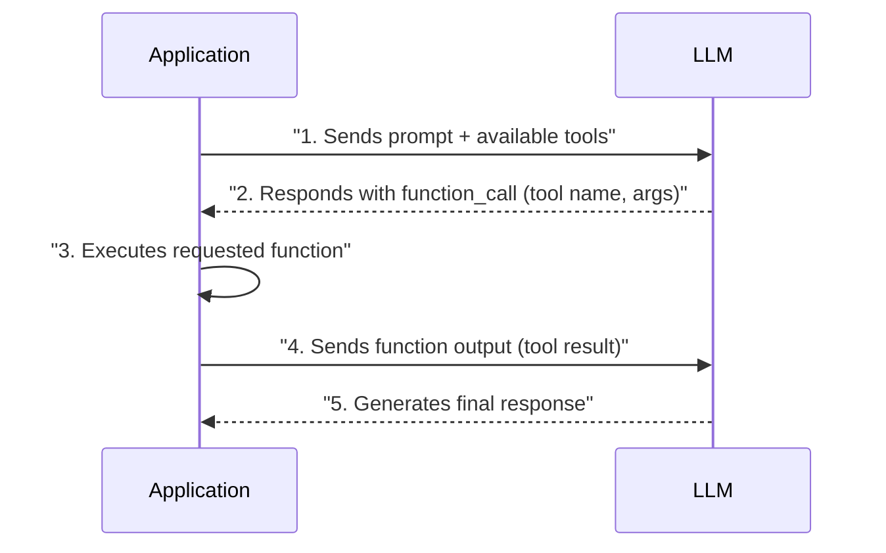
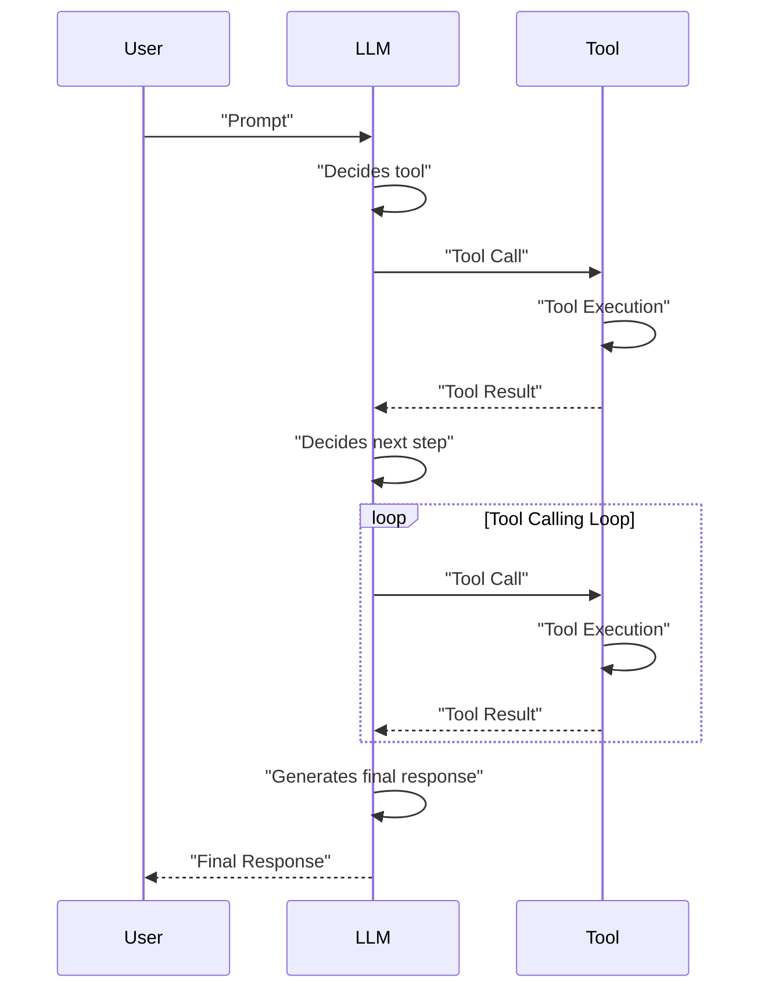

# Lesson 6: Agent Tools & Function Calling
### Giving your LLM the ability to take action

I remember a project where our LLM-powered chatbot was brilliant at generating text, but it couldn't do anything practical. It could tell users about the weather, but it couldn't actually *fetch* the current temperature. It could explain how to send an email, but it couldn't *send* one. It was like having a genius who couldn't use their hands. This limitation meant our AI was stuck in a "read-only" mode, unable to interact with the real world.

In our journey through AI engineering, we have covered fundamental concepts. We started with the AI agent landscape, understanding its role and stack in Lesson 1. Next, we grasped the difference between predefined LLM workflows and autonomous AI agents in Lesson 2. Then, we explored context engineering, the art of managing information flow to LLMs in Lesson 3. We also learned how to ensure reliable data extraction from LLM responses using structured outputs in Lesson 4. Finally, in Lesson 5, we implemented basic workflow ingredients like chaining, routing, parallel processing, and the orchestrator-worker patterns.

Now, we are ready to tackle one of the most transformative aspects of AI agents: **tool usage**. Tools are what empower an LLM to go beyond generating text and interact with the external world. They are a foundational block of any AI agent, enabling it to perform actions and access real-time information. Understanding how an LLM decides which tool to call, generates the correct parameters, and executes functions is important for building, debugging, and monitoring robust AI applications. In this lesson, we will implement tool calling from scratch, use modern APIs like Gemini, explore using Pydantic models as tools, and discuss the limitations that lead to more sophisticated patterns like ReAct. We will also examine the most essential tool categories, from memory access to web search and code execution.

## Understanding Why Agents Need Tools

LLMs, at their core, are powerful pattern matchers and text generators. They predict the next most probable token based on their training data. This means they cannot, by themselves, perform actions in the real world or access information beyond their static knowledge cutoff. They live in a textual bubble, unable to interact with external systems or retrieve real-time data on their own. This is a fundamental limitation.

Tools are what transform an LLM from a simple text generator into an agent that can take actions into the external world. Think of the LLM as the brain, and tools as its "hands and senses." Tools are the bridge between the LLM's internal reasoning and the dynamic external world. With tools, an LLM becomes an AI agent that can perceive its environment, execute specific instructions, and perform actions.


Image 1: High-level architecture of an LLM acting as an agent with tool use. (Source [Mercity.ai [9]](https://www.mercity.ai/blog-post/guide-to-integrating-tools-and-apis-with-language-models))

As seen in Image 1, the LLM processes user requests and, if an external action is needed, decides which tool to use. This decision is then passed to an integrator, which executes the tool via a tool execution pipeline. The result is parsed and fed back to the LLM, allowing it to formulate a coherent response or take further steps [[16]](https://www.mercity.ai/blog-post/guide-to-integrating-tools-and-apis-with-language-models).

Modern AI agents use various tools to extend their capabilities. Some popular examples include:
*   **Accessing real-time information:** Tools that query APIs for current weather, news, or stock prices [[17]](https://aman.ai/primers/ai/agents/).
*   **Interacting with databases:** Tools that query structured databases (PostgreSQL) or data lakes (S3) to retrieve or analyze information [[18]](https://mirascope.com/blog/llm-integration).
*   **Accessing long-term memory:** Tools that retrieve information from an agent's memory beyond its current context window, a concept we will explore in Lesson 9 on Agent Memory & Knowledge [[20]](https://www.weka.io/learn/guide/ai-ml/retrieval-augmented-generation/).
*   **Executing code:** A Python interpreter tool allows the agent to write and run code in a sandboxed environment for calculations, data manipulation, or visualizations [[19]](https://arxiv.org/html/2506.18096v1).
*   **Performing precise calculations:** Tools that handle mathematical operations, sorting, filtering, or grouping data, going beyond the LLM's inherent computational limitations [[36]](https://www.projectpro.io/article/llm-limitations/1045).

These tools enable LLMs to overcome their static nature and perform dynamic, real-world tasks, transforming them into powerful AI agents [[38]](https://www.edpb.europa.eu/system/files/2025-04/ai-privacy-risks-and-mitigations-in-llms.pdf).

## Implementing Tool Calls From Scratch

The best way to understand how tools work and how LLMs use them is by implementing them from scratch. This hands-on approach will help you build intuition about the underlying mechanisms. In this section, we will learn how a tool is defined, how its schema looks, how the LLM discovers available tools, how to call them through function schemas, and how to interpret their output.

Our end goal is to provide the LLM with a list of available tools and let it decide which one to use, along with generating the correct arguments necessary to call that tool. At a high level, the process of calling a tool looks like this:
1.  **Application:** Within the system prompt, provide a list of available tools.
2.  **LLM:** Responds with a `function_call` request, specifying the tool and arguments.
3.  **Application:** Execute the requested function in your code.
4.  **Application:** Send the function's output back to the LLM.
5.  **LLM:** Generate a user-facing response.

This request-execute-respond flow is central to tool calling, as illustrated in Image 2.


Image 2: A sequence diagram illustrating the 5 steps of a tool calling process. (Source [IBM Technology [6]](https://www.youtube.com/watch?v=h8gMhXYAv1k))

Now, let's dig into the code. To make it interesting, we will implement a simple example where we mock searching documents on Google Drive and sending their summaries to Discord.

1.  We define the imports, Gemini `client`, `MODEL_ID`, and `DOCUMENT` constants. `DOCUMENT` is used to mock PDF documents.
    ```python
    import json
    from typing import Any
    
    from google import genai
    from google.genai import types
    from pydantic import BaseModel, Field
    
    from lessons.utils import pretty_print
    from lessons.utils import env
    
    env.load(required_env_vars=["GOOGLE_API_KEY"])
    
    client = genai.Client()
    
    MODEL_ID = "gemini-2.5-flash"
    
    DOCUMENT = """
    # Q3 2023 Financial Performance Analysis
    
    The Q3 earnings report shows a 20% increase in revenue and a 15% growth in user engagement, 
    beating market expectations. These impressive results reflect our successful product strategy 
    and strong market positioning.
    
    Our core business segments demonstrated remarkable resilience, with digital services leading 
    the growth at 25% year-over-year. The expansion into new markets has proven particularly 
    successful, contributing to 30% of the total revenue increase.
    
    Customer acquisition costs decreased by 10% while retention rates improved to 92%, 
    marking our best performance to date. These metrics, combined with our healthy cash flow 
    position, provide a strong foundation for continued growth into Q4 and beyond.
    """
    ```

2.  We define three mock tools: `search_google_drive`, `send_discord_message`, and `summarize_financial_report`. All tools are mocked to keep the code simple and focus on the tools implementation.
    ```python
    def search_google_drive(query: str) -> dict:
        """
        Searches for a file on Google Drive and returns its content or a summary.
    
        Args:
            query (str): The search query to find the file, e.g., 'Q3 earnings report'.
    
        Returns:
            dict: A dictionary representing the search results, including file names and summaries.
        """
    
        return {
            "files": [
                {
                    "name": "Q3_Earnings_Report_2024.pdf",
                    "id": "file12345",
                    "content": DOCUMENT,
                }
            ]
        }
    
    
    def send_discord_message(channel_id: str, message: str) -> dict:
        """
        Sends a message to a specific Discord channel.
    
        Args:
            channel_id (str): The ID of the channel to send the message to, e.g., '#finance'.
            message (str): The content of the message to send.
    
        Returns:
            dict: A dictionary confirming the action, e.g., {"status": "success"}.
        """
    
        return {
            "status": "success",
            "status_code": 200,
            "channel": channel_id,
            "message_preview": f"{message[:50]}...",
        }
    
    
    def summarize_financial_report(text: str) -> str:
        """
        Summarizes a financial report.
    
        Args:
            text (str): The text to summarize.
    
        Returns:
            str: The summary of the text.
        """
    
        return "The Q3 2023 earnings report shows strong performance across all metrics \
    with 20% revenue growth, 15% user engagement increase, 25% digital services growth, and \
    improved retention rates of 92%."
    ```

3.  We define the JSON schemas for the three tools. This schema is used as input to the LLM to understand what tool to use (based on the description) and how to call it (based on the parameters, which include variable names, types, descriptions, and whether they are required or optional). This schema is the industry standard when working with modern LLM providers such as OpenAI or Gemini.
    ```python
    search_google_drive_schema = {
        "name": "search_google_drive",
        "description": "Searches for a file on Google Drive and returns its content or a summary.",
        "parameters": {
            "type": "object",
            "properties": {
                "query": {
                    "type": "string",
                    "description": "The search query to find the file, e.g., 'Q3 earnings report'.",
                }
            },
            "required": ["query"],
        },
    }
    
    send_discord_message_schema = {
        "name": "send_discord_message",
        "description": "Sends a message to a specific Discord channel.",
        "parameters": {
            "type": "object",
            "properties": {
                "channel_id": {
                    "type": "string",
                    "description": "The ID of the channel to send the message to, e.g., '#finance'.",
                },
                "message": {
                    "type": "string",
                    "description": "The content of the message to send.",
                },
            },
            "required": ["channel_id", "message"],
        },
    }
    
    summarize_financial_report_schema = {
        "name": "summarize_financial_report",
        "description": "Summarizes a financial report.",
        "parameters": {
            "type": "object",
            "properties": {
                "text": {
                    "type": "string",
                    "description": "The text to summarize.",
                },
            },
            "required": ["text"],
        },
    }
    ```

4.  We define the `TOOLS` registry, along with their `TOOLS_BY_NAME` and `TOOLS_SCHEMA` mappings.
    ```python
    TOOLS = {
        "search_google_drive": {
            "handler": search_google_drive,
            "declaration": search_google_drive_schema,
        },
        "send_discord_message": {
            "handler": send_discord_message,
            "declaration": send_discord_message_schema,
        },
        "summarize_financial_report": {
            "handler": summarize_financial_report,
            "declaration": summarize_financial_report_schema,
        },
    }
    TOOLS_BY_NAME = {tool_name: tool["handler"] for tool_name, tool in TOOLS.items()}
    TOOLS_SCHEMA = [tool["declaration"] for tool in TOOLS.values()]
    ```

5.  The `TOOLS_BY_NAME` mapping provides a dictionary that links tool names to their corresponding Python functions:
    ```text
    Tool name: search_google_drive
    Tool handler: <function search_google_drive at 0x104c7df80>
    ---------------------------------------------------------------------------
    Tool name: send_discord_message
    Tool handler: <function send_discord_message at 0x104c7de40>
    ---------------------------------------------------------------------------
    Tool name: summarize_financial_report
    Tool handler: <function summarize_financial_report at 0x1274f5c60>
    ---------------------------------------------------------------------------
    ```

6.  Here is how the first element from the `TOOLS_SCHEMA` looks. It provides a structured definition for the `search_google_drive` tool:
    ```json
    {
      "name": "search_google_drive",
      "description": "Searches for a file on Google Drive and returns its content or a summary.",
      "parameters": {
        "type": "object",
        "properties": {
          "query": {
            "type": "string",
            "description": "The search query to find the file, e.g., 'Q3 earnings report'."
          }
        },
        "required": [
          "query"
        ]
      }
    }
    ```

7.  We define and explain the `TOOL_CALLING_SYSTEM_PROMPT`. This prompt guides the LLM on how and when to use the tools. It includes tool usage guidelines, the expected tool call format, response behavior, and a list of available tools enclosed by XML tags.
    ```python
    TOOL_CALLING_SYSTEM_PROMPT = """
    You are a helpful AI assistant with access to tools that enable you to take actions and retrieve information to better 
    assist users.
    
    ## Tool Usage Guidelines
    
    **When to use tools:**
    - When you need information that is not in your training data
    - When you need to perform actions in external systems and environments
    - When you need real-time, dynamic, or user-specific data
    - When computational operations are required
    
    **Tool selection:**
    - Choose the most appropriate tool based on the user's specific request
    - If multiple tools could work, select the one that most directly addresses the need
    - Consider the order of operations for multi-step tasks
    
    **Parameter requirements:**
    - Provide all required parameters with accurate values
    - Use the parameter descriptions to understand expected formats and constraints
    - Ensure data types match the tool's requirements (strings, numbers, booleans, arrays)
    
    ## Tool Call Format
    
    When you need to use a tool, output ONLY the tool call in this exact format:
    
    <tool_call>
    {{"name": "tool_name", "args": {{"param1": "value1", "param2": "value2"}}}}
    </tool_call>
    
    **Critical formatting rules:**
    - Use double quotes for all JSON strings
    - Ensure the JSON is valid and properly escaped
    - Include ALL required parameters
    - Use correct data types as specified in the tool definition
    - Do not include any additional text or explanation in the tool call
    
    ## Response Behavior
    
    - If no tools are needed, respond directly to the user with helpful information
    - If tools are needed, make the tool call first, then provide context about what you're doing
    - After receiving tool results, provide a clear, user-friendly explanation of the outcome
    - If a tool call fails, explain the issue and suggest alternatives when possible
    
    ## Available Tools
    
    <tool_definitions>
    {tools}
    </tool_definitions>
    
    Remember: Your goal is to be maximally helpful to the user. Use tools when they add value, but don't use them unnecessarily. Always prioritize accuracy and user experience.
    """
    ```
    Based on the `description` field from the tool schema, the LLM *decides* if a tool call is appropriate to fulfill the user query. That's why writing clear and articulate tool descriptions is very important for building successful AI agents. When passing multiple tools, it is important for the descriptions to distinguish between each other to avoid any future confusion. For example, two tools with descriptions "Tool used to search documents" and "Tool used to search files" would confuse the LLM. You have to be as explicit as possible and define them as "Tool used to search documents on Google Drive" and "Tool used to search files on the disk."
    
    Another disambiguation method when working with AI agents is to be as clear as possible in the system prompts, verbosely stating what you need. For example, instead of saying "search documents," be explicit and say where to search them from, such as "search documents on Google Drive." By defining clear tool descriptions and system prompts, you ensure the AI agent will be able to make the necessary matches and call the right tools. This becomes important when scaling up to 50-100 tools per AI Agent. We will dig more into scaling methods in Part 2 and 3 of the course.
    
    Based on the selected tool, it then *generates* the function name and arguments as structured outputs such as JSON or Pydantic. The LLM is specially tuned through instruction fine-tuning to interpret tool schema inputs and output tool calls.

8.  We demonstrate how the `TOOL_CALLING_SYSTEM_PROMPT` works by calling the model with the first `USER_PROMPT`.
    ```python
    USER_PROMPT = """
    Can you help me find the latest quarterly report and share key insights with the team?
    """
    
    messages = [TOOL_CALLING_SYSTEM_PROMPT.format(tools=str(TOOLS_SCHEMA)), USER_PROMPT]
    
    response = client.models.generate_content(
        model=MODEL_ID,
        contents=messages,
    )
    ```

9.  The LLM outputs the function's name and arguments, providing everything necessary to call the tool:
    ```text
    -------------------------------------- LLM Tool Call Response -------------------------------------- 
    <tool_call>
    {"name": "search_google_drive", "args": {"query": "latest quarterly report"}}
    </tool_call>
    ---------------------------------------------------------------------------------------------------- 
    ```

10. We show how the `TOOL_CALLING_SYSTEM_PROMPT` works with another example by calling the model with a second `USER_PROMPT`.
    ```python
    USER_PROMPT = """
    Please find the Q3 earnings report on Google Drive and send a summary of it to 
    the #finance channel on Discord.
    """
    
    messages = [TOOL_CALLING_SYSTEM_PROMPT.format(tools=str(TOOLS_SCHEMA)), USER_PROMPT]
    
    response = client.models.generate_content(
        model=MODEL_ID,
        contents=messages,
    )
    ```

11. The LLM's response again details the function call:
    ```text
    -------------------------------------- LLM Tool Call Response -------------------------------------- 
    <tool_call>
    {"name": "search_google_drive", "args": {"query": "Q3 earnings report"}}
    </tool_call>
    ---------------------------------------------------------------------------------------------------- 
    ```

12. Now, let's see how to interpret the output from the LLM. We start by extracting the tool call JSON string from the LLM response using the `extract_tool_call` function.
    ```python
    def extract_tool_call(response_text: str) -> str:
        """
        Extracts JSON from a response string that is wrapped in <tool_call> tags.
        """
        return response_text.split("<tool_call>")[1].split("</tool_call>")[0].strip()
    
    
    tool_call_str = extract_tool_call(response.text)
    tool_call_str
    ```

13. We transform the JSON string into a Python dictionary:
    ```text
    '{"name": "search_google_drive", "args": {"query": "Q3 earnings report"}}'
    ```

14. We get the right tool handler from the `TOOLS_BY_NAME` dictionary to execute the actual function.
    ```python
    tool_call = json.loads(tool_call_str)
    tool_call
    ```

15. The tool handler is a reference to our `search_google_drive` function:
    ```text
    {'name': 'search_google_drive', 'args': {'query': 'Q3 earnings report'}}
    ```

16. We call the tool with the extracted arguments.
    ```python
    tool_handler = TOOLS_BY_NAME[tool_call["name"]]
    tool_handler
    ```

17. The output from the tool provides the mocked content of the financial report:
    ```text
    <function __main__.search_google_drive(query: str) -> dict>
    ```

18. We define the `call_tool` function that aggregates all the steps from above: extract Python dictionary, get tool handler, and call the tools. Using it, we can directly pass the LLM response and get the tool output.
    ```python
    tool_result = tool_handler(**tool_call["args"])
    pretty_print.wrapped(tool_result, indent=2, title="LLM Tool Call Response")
    ```

19. Calling the `call_tool` function shows the same output as before:
    ```python
    def call_tool(response_text: str, tools_by_name: dict) -> Any:
        """
        Call a tool based on the response from the LLM.
        """
    
        tool_call_str = extract_tool_call(response_text)
        tool_call = json.loads(tool_call_str)
        tool_name = tool_call["name"]
        tool_args = tool_call["args"]
        tool = tools_by_name[tool_name]
    
        return tool(**tool_args)
    
    pretty_print.wrapped(
        json.dumps(call_tool(response.text, tools_by_name=TOOLS_BY_NAME), indent=2), title="LLM Tool Call Response"
    )
    ```

20. Usually, we use an LLM to interpret the tool output. To do so, the tool result is sent back to the LLM to formulate a final response to the user or decide on the next step.
    ```text
    -------------------------------------- LLM Tool Call Response -------------------------------------- 
      {
      "files": [
        {
          "name": "Q3_Earnings_Report_2024.pdf",
          "id": "file12345",
          "content": "\n# Q3 2023 Financial Performance Analysis\n\nThe Q3 earnings report shows a 20% increase in revenue and a 15% growth in user engagement, \nbeating market expectations. These impressive results reflect our successful product strategy \nand strong market positioning.\n\nOur core business segments demonstrated remarkable resilience, with digital services leading \nthe growth at 25% year-over-year. The expansion into new markets has proven particularly \nsuccessful, contributing to 30% of the total revenue increase.\n\nCustomer acquisition costs decreased by 10% while retention rates improved to 92%, \nmarking our best performance to date. These metrics, combined with our healthy cash flow \nposition, provide a strong foundation for continued growth into Q4 and beyond.\n"
        }
      ]
    }
    ---------------------------------------------------------------------------------------------------- 
    ```

21. The LLM response after it interprets the tool output summarizes the financial report:
    ```python
    response = client.models.generate_content(
        model=MODEL_ID,
        contents=f"Interpret the tool result: {json.dumps(tool_result, indent=2)}",
    )
    pretty_print.wrapped(response.text, title="LLM Tool Call Response")
    ```
    ```text
    -------------------------------------- LLM Tool Call Response -------------------------------------- 
    The tool result provides the content of a file named `Q3_Earnings_Report_2024.pdf`.
    
    This document is a **Q3 2023 Financial Performance Analysis** and details exceptionally strong results, significantly beating market expectations.
    
    **Key highlights from the report include:**
    
    *   **Revenue Growth:** A 20% increase in revenue.
    *   **User Engagement:** 15% growth in user engagement.
    *   **Core Business Performance:** Digital services led growth at 25% year-over-year.
    *   **Market Expansion Success:** New markets contributed 30% of the total revenue increase.
    *   **Efficiency & Retention:**
        *   Customer acquisition costs decreased by 10%.
        *   Retention rates improved to 92%, marking the best performance to date.
    *   **Financial Health:** The company maintains a healthy cash flow position.
    
    The report attributes these impressive results to a successful product strategy and strong market positioning, indicating a robust foundation for continued growth into Q4 and beyond.
    ---------------------------------------------------------------------------------------------------- 
    ```
This is the basic concept behind tool calling.

## Implementing a Small Tool Calling Framework From Scratch

Manually defining schemas for every tool we want to use can quickly become cumbersome and hard to scale. That's why all modern AI agent frameworks (e.g., LangGraph) or protocols implement a `@tool` decorator (or something similar) that automatically computes and tracks the schemas of decorated functions. LangGraph is a framework for building stateful, multi-actor applications with LLMs, which we will explore in future lessons.

Thus, in our writing from scratch exercise, as a natural progression to defining the tool schemas manually, we will implement a small tool framework by building a `@tool` decorator. This decorator allows us to automatically compute the schema of each function that we want to use as a tool. The end goal is to decorate a function with the `@tool` decorator, and based on the function's docstring and signature (input, output parameters, and their types), automatically create a tools registry similar to the `TOOLS` registry from the previous section. This method also follows good software engineering principles, as we respect the Don't Repeat Yourself (DRY) software principle by having a modular, central place to compute the tool schema. In other words, we have a single place that standardizes how we gather tool schemas.

Now, let's dig into the code and rewrite the implementation from the previous section using `@tool` decorators.

1.  We define the `ToolFunction` class. This class will aggregate the function schema and provide a callable wrapper for the original function.
    ```python
    from inspect import Parameter, signature
    from typing import Any, Callable, Dict, Optional
    
    
    class ToolFunction:
        def __init__(self, func: Callable, schema: Dict[str, Any]) -> None:
            self.func = func
            self.schema = schema
            self.__name__ = func.__name__
            self.__doc__ = func.__doc__
    
        def __call__(self, *args: Any, **kwargs: Any) -> Any:
            return self.func(*args, **kwargs)
    ```

2.  We define the `tool` function, which will be used to decorate future functions using the `@tool` syntax. Python decorators are functions that take another function as an argument and extend or modify the behavior of the latter without explicitly modifying it.
    ```python
    def tool(description: Optional[str] = None) -> Callable[[Callable], ToolFunction]:
        """
        A decorator that creates a tool schema from a function.
    
        Args:
            description: Optional override for the function's docstring
    
        Returns:
            A decorator function that wraps the original function and adds a schema
        """
    
        def decorator(func: Callable) -> ToolFunction:
            # Get function signature
            sig = signature(func)
    
            # Create parameters schema
            properties = {}
            required = []
    
            for param_name, param in sig.parameters.items():
                # Skip self for methods
                if param_name == "self":
                    continue
    
                param_schema = {
                    "type": "string",  # Default to string, can be enhanced with type hints
                    "description": f"The {param_name} parameter",  # Default description
                }
    
                # Add to required if parameter has no default value
                if param.default == Parameter.empty:
                    required.append(param_name)
    
                properties[param_name] = param_schema
    
            # Create the tool schema
            schema = {
                "name": func.__name__,
                "description": description or func.__doc__ or f"Executes the {func.__name__} function.",
                "parameters": {
                    "type": "object",
                    "properties": properties,
                    "required": required,
                },
            }
    
            return ToolFunction(func, schema)
    
        return decorator
    ```

3.  We redefine the three tools (`search_google_drive_example`, `send_discord_message_example`, `summarize_financial_report_example`) using the `@tool` Python decorator.
    ```python
    @tool()
    def search_google_drive_example(query: str) -> dict:
        """Search for files in Google Drive."""
        return {"files": ["Q3 earnings report"]}
    
    
    @tool()
    def send_discord_message_example(channel_id: str, message: str) -> dict:
        """Send a message to a Discord channel."""
        return {"message": "Message sent successfully"}
    
    
    @tool()
    def summarize_financial_report_example(text: str) -> str:
        """Summarize the contents of a financial report."""
        return "Financial report summarized successfully"
    ```

4.  The `tools` registry now contains our decorated tools.
    ```python
    tools = [
        search_google_drive_example,
        send_discord_message_example,
        summarize_financial_report_example,
    ]
    tools_by_name = {tool.schema["name"]: tool.func for tool in tools}
    tools_schema = [tool.schema for tool in tools]
    ```

5.  The `search_google_drive_example` tool is now of type `__main__.ToolFunction`:
    ```text
    __main__.ToolFunction
    ```

6.  Inspecting the `search_google_drive_example` tool from the registry shows its name, type, schema, and functional handler. The schema is identical to the one we manually defined earlier:
    ```text
    ----------------------------------- Search Google Drive Example ----------------------------------- 
      {
      "name": "search_google_drive_example",
      "description": "Search for files in Google Drive.",
      "parameters": {
        "type": "object",
        "properties": {
          "query": {
            "type": "string",
            "description": "The query parameter"
          }
        },
        "required": [
          "query"
        ]
      }
    }
    ---------------------------------------------------------------------------------------------------- 
    ```

7.  The functional handler is a reference to our original Python function:
    ```text
    <function __main__.search_google_drive_example(query: str) -> dict>
    ```

8.  We call the LLM with the new `tools_schema` variable using the `USER_PROMPT` input.
    ```python
    USER_PROMPT = """
    Please find the Q3 earnings report on Google Drive and send a summary of it to 
    the #finance channel on Discord.
    """
    
    messages = [TOOL_CALLING_SYSTEM_PROMPT.format(tools=str(tools_schema)), USER_PROMPT]
    
    response = client.models.generate_content(
        model=MODEL_ID,
        contents=messages,
    )
    ```

9.  The LLM outputs the function call, as expected:
    ```text
    -------------------------------------- LLM Tool Call Response -------------------------------------- 
    <tool_call>
    {"name": "search_google_drive_example", "args": {"query": "Q3 earnings report"}}
    </tool_call>
    ---------------------------------------------------------------------------------------------------- 
    ```

10. We call the tool from the LLM response using the `call_tool` function (defined in Section 3) and output its result.
    ```python
    pretty_print.wrapped(
        json.dumps(call_tool(response.text, tools_by_name=tools_by_name), indent=2), title="LLM Tool Call Response"
    )
    ```

11. The output shows the mocked search result:
    ```text
    -------------------------------------- LLM Tool Call Response -------------------------------------- 
      {
      "files": [
        "Q3 earnings report"
      ]
    }
    ---------------------------------------------------------------------------------------------------- 
    ```
Voilà! We have our little tool calling framework. This implementation is similar to what LangGraph does, by using the `@tool` decorator [[25]](https://python.langchain.com/docs/concepts/tools/).

## Implementing Production-Level Tool Calls with Gemini

Similar to what we did in Lesson 4 on structured outputs, after writing the tool calling implementation from scratch, we want to show you how you can use modern APIs such as Gemini's to make your life easier and your code more robust. Rather than prompt engineering the LLM on what tools to pick and how to output tool calls in the right format, we will use Gemini's `GenerateContentConfig` to define all the available tools.

Now, let's dig into the code and see how we can use Gemini's `GenerateContentConfig` config to use multiple tools.

1.  We define the `tools` input and `config` object for Gemini. At this point, we still use the schemas defined above, but we will soon show how to skip this step.
    ```python
    tools = [
        types.Tool(
            function_declarations=[
                types.FunctionDeclaration(**search_google_drive_schema),
                types.FunctionDeclaration(**send_discord_message_schema),
            ]
        )
    ]
    config = types.GenerateContentConfig(
        tools=tools,
        # Force the model to call 'any' function, instead of chatting.
        tool_config=types.ToolConfig(function_calling_config=types.FunctionCallingConfig(mode="ANY")),
    )
    ```

2.  We call the LLM with the defined `config`. We can completely skip defining the huge `TOOL_CALLING_SYSTEM_PROMPT` system prompt that guides the LLM on how to use the tools and directly input the `USER_PROMPT`. This is more robust, as we are certain that the LLM is instructed the right way how to use the tools [[48]](https://codelabs.developers.google.com/codelabs/gemini-function-calling).
    ```python
    pretty_print.wrapped(USER_PROMPT, title="User Prompt")
    response = client.models.generate_content(
        model=MODEL_ID,
        contents=USER_PROMPT,
        config=config,
    )
    ```
    ```text
    ------------------------------------------- User Prompt ------------------------------------------- 
    
    Please find the Q3 earnings report on Google Drive and send a summary of it to 
    the #finance channel on Discord.
    
    ---------------------------------------------------------------------------------------------------- 
    ```

3.  The LLM's response returns a function call:
    ```python
    response_message_part = response.candidates[0].content.parts[0]
    function_call = response_message_part.function_call
    function_call
    ```

4.  The `function_call` object returned by Gemini is a structured object:
    ```text
    FunctionCall(id=None, args={'query': 'Q3 earnings report'}, name='search_google_drive')
    ```

5.  To simplify the implementation even more, and avoid computing the tool schemas manually or through a `@tool` decorator, we show how Google's `genai` Python SDK supports taking functions directly as input. We create a new `config` object by passing directly the `search_google_drive` and `send_discord_message` functions. The SDK automatically creates the schema based on the signature, type hints, and pydocs of each function, as we did so far with our from-scratch implementations [[51]](https://firebase.google.com/docs/ai-logic/function-calling).
    ```python
    config = types.GenerateContentConfig(
        tools=[search_google_drive, send_discord_message],
        tool_config=types.ToolConfig(function_calling_config=types.FunctionCallingConfig(mode="ANY")),
    )
    
    response = client.models.generate_content(
        model=MODEL_ID,
        contents=USER_PROMPT,
        config=config,
    )
    response_message_part = response.candidates[0].content.parts[0]
    function_call = response_message_part.function_call
    ```

6.  The LLM response shows the function call:
    ```text
    FunctionCall(id=None, args={'query': 'Q3 earnings report'}, name='search_google_drive')
    ```

7.  The `function_call.args` returned by Gemini contains the arguments as a dictionary:
    ```python
    tool_handler = TOOLS_BY_NAME[function_call.name]
    tool_handler
    ```

8.  We access the `tool_handler` based on the function's name from the `TOOLS_BY_NAME` registry, as before:
    ```text
    <function __main__.search_google_drive(query: str) -> dict>
    ```

9.  We call the `tool_handler` manually.
    ```python
    tool_handler(**function_call.args)
    ```

10. The output is the mocked content of the financial report:
    ```text
    {'files': [{'name': 'Q3_Earnings_Report_2024.pdf',
       'id': 'file12345',
       'content': '\n# Q3 2023 Financial Performance Analysis\n\nThe Q3 earnings report shows a 20% increase in revenue and a 15% growth in user engagement, \nbeating market expectations. These impressive results reflect our successful product strategy \nand strong market positioning.\n\nOur core business segments demonstrated remarkable resilience, with digital services leading \nthe growth at 25% year-over-year. The expansion into new markets has proven particularly \nsuccessful, contributing to 30% of the total revenue increase.\n\nCustomer acquisition costs decreased by 10% while retention rates improved to 92%, \nmarking our best performance to date. These metrics, combined with our healthy cash flow \nposition, provide a strong foundation for continued growth into Q4 and beyond.\n'}]}
    ```

11. We call the `call_tool` function (defined in Section 3) to call the `function_call` from the LLM response in one go.
    ```python
    tool_result = call_tool(response_message_part.function_call)
    pretty_print.wrapped(tool_result, indent=2, title="Tool Result")
    ```

12. The output shows the mocked search result:
    ```text
    ------------------------------------------- Tool Result ------------------------------------------- 
      {
      "files": [
        {
          "name": "Q3_Earnings_Report_2024.pdf",
          "id": "file12345",
          "content": "\n# Q3 2023 Financial Performance Analysis\n\nThe Q3 earnings report shows a 20% increase in revenue and a 15% growth in user engagement, \nbeating market expectations. These impressive results reflect our successful product strategy \nand strong market positioning.\n\nOur core business segments demonstrated remarkable resilience, with digital services leading \nthe growth at 25% year-over-year. The expansion into new markets has proven particularly \nsuccessful, contributing to 30% of the total revenue increase.\n\nCustomer acquisition costs decreased by 10% while retention rates improved to 92%, \nmarking our best performance to date. These metrics, combined with our healthy cash flow \nposition, provide a strong foundation for continued growth into Q4 and beyond.\n"
        }
      ]
    }
    ---------------------------------------------------------------------------------------------------- 
    ```
By using Gemini's native SDK, we managed to reduce the tool implementation from dozens of lines of code to a few. All popular APIs, along with Google's, such as OpenAI or Anthropic, use the same logic to instruct the LLM on how to use different tools, but with minimal interface differences [[2]](https://platform.openai.com/docs/guides/function-calling). Thus, what we learned in this lesson can easily be extrapolated to your API of choice.

## Using Pydantic Models as Tools for On-Demand Structured Outputs

To further understand how we can use Google's `genai` Python SDK for function calling, we connect this lesson with Lesson 4 on structured outputs. We will provide a concrete, yet very popular example of how we can use a Pydantic model as a tool to generate structured outputs dynamically.

Adding the Pydantic model as a tool is an elegant way to get structured outputs in agentic scenarios. In these scenarios, you often take multiple intermediate steps using unstructured outputs (which are easily interpreted by an LLM). Then, you dynamically decide when to output the final answer in a structured form as a Pydantic model (which is easily interpreted in Python downstream steps and ensures the final output has the expected schema) [[33]](https://arxiv.org/html/2505.03049v2).

Image 3 illustrates an AI agent's workflow with a tool-calling loop and a conditional Pydantic tool for structured output.

```mermaid
graph TD
    User_Input["User Input"] --> AI_Agent["AI Agent (LLM)"]

    AI_Agent --> Decide_Tool{"Decide Tool?"}

    Decide_Tool -->|Yes| Call_Tool["Call Tool"]
    Call_Tool --> Get_Result["Get Tool Result"]
    Get_Result --> Feed_Result["Feed Result back to AI Agent"]
    Feed_Result --> AI_Agent  %% Loop back to AI Agent

    Decide_Tool -->|No, no more tools| Structured_Output_Needed{"If structured output needed?"}

    Structured_Output_Needed -->|Yes| Call_Pydantic["Call Pydantic Tool (e.g., extract_metadata)"]
    Call_Pydantic --> Get_Structured_Output["Get Structured Output (Pydantic Model)"]
    Get_Structured_Output --> Final_Response["Final Structured Response"]

    Structured_Output_Needed -->|No| Final_Response
```
Image 3: A flowchart illustrating an AI agent's workflow with a tool-calling loop and conditional Pydantic tool for structured output. (Source [Dylan Castillo [34]](https://dylancastillo.co/posts/agentic-workflows-langgraph.html))

Now, let's dig into the code and see how we can define Pydantic structured outputs as tools.

1.  We define the `DocumentMetadata` Pydantic class, similar to what we did in Lesson 4.
    ```python
    class DocumentMetadata(BaseModel):
        """A class to hold structured metadata for a document."""
    
        summary: str = Field(description="A concise, 1-2 sentence summary of the document.")
        tags: list[str] = Field(description="A list of 3-5 high-level tags relevant to the document.")
        keywords: list[str] = Field(description="A list of specific keywords or concepts mentioned.")
        quarter: str = Field(description="The quarter of the financial year described in the document (e.g., Q3 2023).")
        growth_rate: str = Field(description="The growth rate of the company described in the document (e.g., 10%).")
    ```

2.  We define the `extraction_tool` object. We manually define the function schema, using `DocumentMetadata.model_json_schema()` as parameters, similar to how we instructed the LLM to generate structured outputs in Lesson 4 [[35]](https://pydantic.dev/articles/llm-intro).
    ```python
    # The Pydantic class 'DocumentMetadata' is now our 'tool'
    extraction_tool = types.Tool(
        function_declarations=[
            types.FunctionDeclaration(
                name="extract_metadata",
                description="Extracts structured metadata from a financial document.",
                parameters=DocumentMetadata.model_json_schema(),
            )
        ]
    )
    ```

3.  We define the `config` object, including our `extraction_tool`.
    ```python
    config = types.GenerateContentConfig(
        tools=[extraction_tool],
        tool_config=types.ToolConfig(function_calling_config=types.FunctionCallingConfig(mode="ANY")),
    )
    ```

4.  We define the `prompt` and call the LLM.
    ```python
    prompt = f"""
    Please analyze the following document and extract its metadata.
    
    Document:
    --- 
    {DOCUMENT}
    --- 
    """
    
    response = client.models.generate_content(model=MODEL_ID, contents=prompt, config=config)
    response_message_part = response.candidates[0].content.parts[0]
    ```

5.  The function name and arguments are output as the response from the LLM:
    ```text
    ------------------------------------------ Function Call ------------------------------------------ 
     Function Name: `extract_metadata
     Function Arguments: `{
    "growth_rate": "20%",
    "summary": "The Q3 2023 earnings report shows a 20% increase in revenue and 15% growth in user engagement, driven by successful product strategy and market expansion. This performance provides a strong foundation for continued growth.",
    "quarter": "Q3 2023",
    "keywords": [
      "Revenue",
      "User Engagement",
      "Market Expansion",
      "Customer Acquisition",
      "Retention Rates",
      "Digital Services",
      "Cash Flow"
    ],
    "tags": [
      "Financials",
      "Earnings",
      "Growth",
      "Business Strategy",
      "Market Analysis"
    ]
    }`
    ---------------------------------------------------------------------------------------------------- 
    ```

6.  We create the `document_metadata` Pydantic object, which outputs `Validation successful!` if the output arguments have the right signature:
    ```python
    if hasattr(response_message_part, "function_call"):
        function_call = response_message_part.function_call
        pretty_print.function_call(function_call, title="Function Call")
    
        try:
            document_metadata = DocumentMetadata(**function_call.args)
            pretty_print.wrapped(document_metadata.model_dump_json(indent=2), title="Pydantic Validated Object")
        except Exception as e:
            pretty_print.wrapped(f"Validation failed: {e}", title="Validation Error")
    else:
        pretty_print.wrapped("The model did not call the extraction tool.", title="No Function Call")
    ```
    ```text
    ------------------------------------ Pydantic Validated Object ------------------------------------ 
      {
      "summary": "The Q3 2023 earnings report shows a 20% increase in revenue and 15% growth in user engagement, driven by successful product strategy and market expansion. This performance provides a strong foundation for continued growth.",
      "tags": [
        "Financials",
        "Earnings",
        "Growth",
        "Business Strategy",
        "Market Analysis"
      ],
      "keywords": [
        "Revenue",
        "User Engagement",
        "Market Expansion",
        "Customer Acquisition",
        "Retention Rates",
        "Digital Services",
        "Cash Flow"
      ],
      "quarter": "Q3 2023",
      "growth_rate": "20%"
    }
    ---------------------------------------------------------------------------------------------------- 
    ```
This pattern is often used in AI agents that require structured outputs.

## The Downsides of Running Tools in a Loop

Until now, we focused only on making a single turn, calling a single tool. Still, as a natural progression, we want not only to call a single tool but to build more sophisticated versions where we allow an LLM to run them in a loop. This involves chaining multiple tools and letting the LLM decide which tool to choose at each step based on the output of previous tools. This is how we build a real AI agent!

Image 4 illustrates a tool calling loop.

Image 4: A sequence diagram illustrating a tool calling loop. (Source [Towards AI [61]](https://pub.towardsai.net/crafting-langchain-tools-a-complete-guide-to-custom-tool-development-f21fd2f16622))

The benefits of running tools in a loop are clear: flexibility, adaptability, and the ability to handle complex multi-step tasks. Now, let's dig into the code and see how we can implement tool calling in a loop.

1.  We define a new `config` object that includes all three mock tools.
    ```python
    tools = [
        types.Tool(
            function_declarations=[
                types.FunctionDeclaration(**search_google_drive_schema),
                types.FunctionDeclaration(**send_discord_message_schema),
                types.FunctionDeclaration(**summarize_financial_report_schema),
            ]
        )
    ]
    config = types.GenerateContentConfig(
        tools=tools,
        tool_config=types.ToolConfig(function_calling_config=types.FunctionCallingConfig(mode="ANY")),
    )
    ```

2.  We define the user intent through the `USER_PROMPT`.
    ```python
    USER_PROMPT = """
    Please find the Q3 earnings report on Google Drive and send a summary of it to 
    the #finance channel on Discord.
    """
    
    messages = [USER_PROMPT]
    ```

3.  We implement the first LLM call.
    ```python
    pretty_print.wrapped(USER_PROMPT, title="User Prompt")
    response = client.models.generate_content(
        model=MODEL_ID,
        contents=messages,
        config=config,
    )
    response_message_part = response.candidates[0].content.parts[0]
    pretty_print.function_call(response_message_part.function_call, title="Function Call")
    
    messages.append(response.candidates[0].content)
    ```
    ```text
    ------------------------------------------- User Prompt ------------------------------------------- 
    
    Please find the Q3 earnings report on Google Drive and send a summary of it to 
    the #finance channel on Discord.
    
    ---------------------------------------------------------------------------------------------------- 
    ------------------------------------------ Function Call ------------------------------------------ 
     Function Name: `search_google_drive
     Function Arguments: `{
    "query": "Q3 earnings report"
    }`
    ---------------------------------------------------------------------------------------------------- 
    ```

4.  We implement the sequential tool calling loop.
    ```python
    # Loop until the model stops requesting function calls or we reach the max number of iterations
    max_iterations = 3
    while hasattr(response_message_part, "function_call") and max_iterations > 0:
        tool_result = call_tool(response_message_part.function_call)
        pretty_print.wrapped(tool_result, title="Tool Result", indent=2)
    
        # Add the tool result to the messages creating the following structure:
        # - user prompt
        # - tool call
        # - tool result
        # - tool call
        # - tool result
        # ...
        function_response_part = types.Part.from_function_response(
            name=response_message_part.function_call.name,
            response={"result": tool_result},
        )
        messages.append(function_response_part)
    
        # Ask the LLM to continue with the next step (which may involve calling another tool)
        response = client.models.generate_content(
            model=MODEL_ID,
            contents=messages,
            config=config,
        )
    
        response_message_part = response.candidates[0].content.parts[0]
        pretty_print.function_call(response_message_part.function_call, only_name=True, title="Function Call")
    
        messages.append(response.candidates[0].content)
    
        max_iterations -= 1
    
    pretty_print.wrapped(response.candidates[0].content, title="Final Agent Response")
    ```

5.  The outputs of the tool calling loop show the sequence of actions taken by the LLM:
    ```text
    ------------------------------------------- Tool Result ------------------------------------------- 
      {
      "files": [
        {
          "name": "Q3_Earnings_Report_2024.pdf",
          "id": "file12345",
          "content": "\n# Q3 2023 Financial Performance Analysis\n\nThe Q3 earnings report shows a 20% increase in revenue and a 15% growth in user engagement, \nbeating market expectations. These impressive results reflect our successful product strategy \nand strong market positioning.\n\nOur core business segments demonstrated remarkable resilience, with digital services leading \nthe growth at 25% year-over-year. The expansion into new markets has proven particularly \nsuccessful, contributing to 30% of the total revenue increase.\n\nCustomer acquisition costs decreased by 10% while retention rates improved to 92%, \nmarking our best performance to date. These metrics, combined with our healthy cash flow \nposition, provide a strong foundation for continued growth into Q4 and beyond.\n"
        }
      ]
    }
    ---------------------------------------------------------------------------------------------------- 
    ------------------------------------------ Function Call ------------------------------------------ 
     Function Name: `summarize_financial_report
    ---------------------------------------------------------------------------------------------------- 
    ------------------------------------------- Tool Result ------------------------------------------- 
     The Q3 2023 earnings report shows strong performance across all metrics with 20% revenue growth, 15% user engagement increase, 25% digital services growth, and improved retention rates of 92%.
    ---------------------------------------------------------------------------------------------------- 
    ------------------------------------------ Function Call ------------------------------------------ 
     Function Name: `send_discord_message
    ---------------------------------------------------------------------------------------------------- 
    ------------------------------------------- Tool Result ------------------------------------------- 
      {
      "status": "success",
      "status_code": 200,
      "channel": "#finance",
      "message_preview": "The Q3 2023 earnings report shows strong performan..."
    }
    ---------------------------------------------------------------------------------------------------- 
    ------------------------------------------ Function Call ------------------------------------------ 
     Function Name: `send_discord_message
    ---------------------------------------------------------------------------------------------------- 
    --------------------------------------- Final Agent Response --------------------------------------- 
     ('parts', [Part(video_metadata=None, thought=None, inline_data=None, file_data=None, thought_signature=b'\n\xec\x02\x01T\xa8\\\xee?[\xd4\x1f\xc1\x14\x08\xc9\x87\xd6ij-{\xea\xd3\xa9E\xa3\x9eiG\x16\xb41\xad\x90\x92\x01\x17C=\xbc^\x90\x84T\xb3Z\x86\x1d%T\xb4\x10\xe1\x02\xf9\xa3\xcfJ\xc4+\xa1\x0b\xe4\r\xee\xc3e\xc5j\x82W\x8bP\xe55B\bf\xe5@%\x1c_\xda1hE\x00\xeec\xb2\xc2\x9fGI\xaf\xbe\x06\xf8M\x1fm\xe1\xfd7!]\xe12\x93\x94\xdd\x19B\xba\\\xd1\x0caI\xfbR5\xd4\xa9\xa9\x06x\x86\xd0\x06\x94gq\xf9\xda\x80D\xba\x95\xd0[u\xa9V\x8fb\xf7%\xb0\xc3J\x8d\x1e\x9e\xca\xa6fP\x12\xd2\xe5G\xc7\x08\xd5R\xcdn\xf2YeFQ\x80\xcec\xd7h\x1e\xcb\x1c\bbW\fe\xd7\xe8\xe2\xcc\xdc\x06\x8e^\xa5m\xd5\x10Y[\x8b\xa2\x89+\x12\xb54k\x073\xfc\x0f\x9c!\x8f\x83t\fe\xcb\xb01v\x8f\xa0\xb23c\xa7\x0b\xb7y\xd1?\xb4\xc5\xa0\ef\x01\xdc\xa0\xb7\xd1\r\x87\x9445\eb\x08\x86\xd66m\xe4\xab)6vN\x99!\x87\x01Q-\x9cL*\x0b\x97\x1a\x0f\xb0v\x16\xb3\xfc2\xe1\x88c\xadj<\bb^\x1b\'\bb}\xa8l\x0c%\x83??,|\xc2mB\xb7\x95\xe2GF\ee\xf6\xf2\x95\x03\bb\xf9\xba\fe\x0c1J\xf2\x93\x83O\x95."Pl\x87\xa6[\x8c,b\x17,c\xa3\xd0\x19\x893P\xd9\xe8C\x93.o&8\x0f\x0c\x0c\x90e\xdb\xae\x97\ed\x12\x00\xd5\bcV\xf0\xcf\ea', code_execution_result=None, executable_code=None, function_call=FunctionCall(id=None, args={'channel_id': '#finance', 'message': 'The Q3 2023 earnings report shows strong performance across all metrics with 20% revenue growth, 15% user engagement increase, 25% digital services growth, and improved retention rates of 92%.'}, name='send_discord_message'), function_response=None, text=None)])
    ('role', 'model')
    ---------------------------------------------------------------------------------------------------- 
    ```
This approach, while powerful for multi-step tasks, has limitations [[14]](https://arxiv.org/pdf/2503.13657). It doesn't allow the LLM to interpret each tool output before deciding on the next steps. The agent immediately moves to the next function call without pausing to think about what it learned or whether it should change strategy. This can lead to inefficient tool usage or getting stuck in loops [[15]](https://arxiv.org/html/2412.01130v2).

<aside>
💡 Tip: To further optimize tool calling, when tools are independent of each other, we can run them in parallel. For example, fetching financial news and stock prices can happen simultaneously if they don't depend on each other's results. The core benefit of this is reduced latency, as multiple operations complete at once [[59]](https://atamel.dev/posts/2024/08-06_deepdive_function_calling_gemini/).
</aside>

These limitations pushed the industry to develop more sophisticated patterns like **ReAct** (Reasoning and Acting), which we will explore in lessons 7 and 8. ReAct explicitly interleaves reasoning steps with tool calls, allowing the agent to think through problems more deliberately and avoid simplistic, repetitive tool use [[42]](https://www.promptingguide.ai/techniques/react).

## Popular Tools Used Within the Industry

We want to wrap up this lesson by listing some popular tools used across the industry. This will ground you in the real world and provide a better understanding of what is possible to build using tools:

1.  **Knowledge & Memory Access:**
    *   Tools that query vector databases, document stores, graph databases, or other knowledge bases to retrieve relevant context for the LLM. This is the core of Retrieval-Augmented Generation (RAG), a concept we will discuss in more detail in Lesson 10.
    *   We can take the idea even further and provide the LLM text-to-SQL tools that can construct SQL/NoSQL queries and interact with classic databases. This pattern is known as text-to-SQL.
    *   All these tools are closely related to memory, RAG, and agentic RAG, which we will discuss in more detail in Lessons 9 (memory) and 10 (RAG).
2.  **Web Search & Browsing:**
    *   Tools that interface with search engine APIs (e.g., Google Search, Bing Search, Brave Search).
    *   Web scraping tools that can fetch and parse content from web pages.
    *   These types of tools are usually omnipresent in chatbots and research agents, allowing them to access up-to-date information [[30]](https://support.microsoft.com/en-us/topic/copilot-in-bing-our-approach-to-responsible-ai-45b5eae8-7466-43e1-ae98-b48f8ff8fd44).
3.  **Code Execution:**
    *   A Python interpreter tool allows the agent to write and execute Python code in a sandboxed environment. This is invaluable for calculations, data manipulation, statistics, and data visualizations [[12]](https://dida.do/blog/setting-up-a-secure-python-sandbox-for-llm-agents).
    *   Even if Python is the most popular language used for code execution through tools, the pattern is often adapted to other popular languages such as JavaScript.
    *   Using code execution tools introduces security risks like arbitrary code execution and resource exhaustion, necessitating sandboxing and isolation strategies [[43]](https://www.cobalt.io/blog/llm-failures-large-language-model-security-risks).
4.  **Other Popular Tools:**
    *   Interacting with external APIs (e.g., calendar, email, project management, calls) are omnipresent in enterprise AI applications.
    *   File system operations (read/write files, list directories) are omnipresent in productivity AI applications that have to interact with our operating system.

These diverse tool categories highlight the expansive capabilities that tools bring to LLM agents, transforming them into versatile problem-solvers across various domains [[46]](https://arxiv.org/html/2507.08034v1).

## Conclusion

Tool calling sits at the core of AI agents and is a very important skill you need to deeply understand how to build, monitor, and debug AI applications. By enabling LLMs to interact with external systems, tools transform them from mere text generators into powerful, action-oriented agents. We have explored this transformation from scratch, implemented frameworks, used native API capabilities, and even used Pydantic models to ensure structured outputs.

As we move forward, we will build upon this foundation. In Lesson 7, we will learn about the theory behind planning and ReAct agents, addressing the limitations of simple tool-calling loops. You will learn about advanced retrieval techniques for knowledge-augmented agents in Lesson 10 on RAG Deep Dive, and how to work with documents, images, and complex data in Lesson 11 on Multimodal Processing. Part 2 of the course will then guide you through building a complete research and writing agent system, while Part 3 focuses on production-grade engineering practices. Our goal is to equip you with the knowledge to architect AI systems that are not only powerful but also robust, efficient, and safe.

## References

1.  Google AI for Developers. (n.d.). *Function calling with the Gemini API*. Retrieved from https://ai.google.dev/gemini-api/docs/function-calling
2.  OpenAI Platform. (n.d.). *Function calling with OpenAI's API*. Retrieved from https://platform.openai.com/docs/guides/function-calling
3.  YouTube. (n.d.). *Tool Calling Agent From Scratch*. Retrieved from https://www.youtube.com/watch?v=ApoDzZP8_ck
4.  arXiv. (n.d.). *Efficient Tool Use with Chain-of-Abstraction Reasoning*. Retrieved from https://arxiv.org/pdf/2401.17464v3
5.  Swirl AI. (n.d.). *Building AI Agents from scratch - Part 1: Tool use*. Retrieved from https://www.newsletter.swirlai.com/p/building-ai-agents-from-scratch-part
6.  IBM Technology. (n.d.). *What is Tool Calling? Connecting LLMs to Your Data*. Retrieved from https://www.youtube.com/watch?v=h8gMhXYAv1k
7.  DEV Community. (n.d.). *ReAct vs Plan-and-Execute: A Practical Comparison of LLM Agent Patterns*. Retrieved from https://dev.to/jamesli/react-vs-plan-and-execute-a-practical-comparison-of-llm-agent-patterns-4gh9
8.  DeepLearning.AI. (n.d.). *Agentic Design Patterns Part 3, Tool Use*. Retrieved from https://www.deeplearning.ai/the-batch/agentic-design-patterns-part-3-tool-use/
9.  Mercity.ai. (n.d.). *Comprehensive Guide to Integrating Tools and APIs with Language Models*. Retrieved from https://www.mercity.ai/blog-post/guide-to-integrating-tools-and-apis-with-language-models
10. Xebia. (n.d.). *Enforce and Validate LLM Output with Pydantic*. Retrieved from https://xebia.com/blog/enforce-and-validate-llm-output-with-pydantic/
11. LeewayHertz. (n.d.). *Structured Outputs in LLMs*. Retrieved from https://www.leewayhertz.com/structured-outputs-in-llms/
12. Dida.do. (n.d.). *Setting up a Secure Python Sandbox for LLM Agents*. Retrieved from https://dida.do/blog/setting-up-a-secure-python-sandbox-for-llm-agents
13. OWASP. (n.d.). *OWASP Top 10 for Large Language Model Applications*. Retrieved from https://owasp.org/www-project-top-10-for-large-language-model-applications/
14. arXiv. (n.d.). *Failure Modes in Multi-Agent LLM Systems*. Retrieved from https://arxiv.org/pdf/2503.13657
15. arXiv. (n.d.). *Function-Calling Capabilities of LLMs*. Retrieved from https://arxiv.org/html/2412.01130v2
16. Mercity.ai. (n.d.). *Guide to Integrating Tools and APIs with Language Models*. Retrieved from https://www.mercity.ai/blog-post/guide-to-integrating-tools-and-apis-with-language-models
17. Aman.ai. (n.d.). *AI Agents Primer*. Retrieved from https://aman.ai/primers/ai/agents/
18. Mirascope. (n.d.). *LLM Integration*. Retrieved from https://mirascope.com/blog/llm-integration
19. arXiv. (n.d.). *Deep Research Agents*. Retrieved from https://arxiv.org/html/2506.18096v1
20. Weka.io. (n.d.). *Retrieval Augmented Generation Guide*. Retrieved from https://www.weka.io/learn/guide/ai-ml/retrieval-augmented-generation/
21. HKEX News. (n.d.). *Retrieval Augmented Generation*. Retrieved from https://www1.hkexnews.hk/app/sehk/2025/107494/documents/sehk25062703133.pdf
22. Pure Storage. (n.d.). *What is Retrieval Augmented Generation*. Retrieved from https://www.purestorage.com/knowledge/what-is-retrieval-augmented-generation.html
23. Microsoft Learn. (n.d.). *Retrieval Augmented Generation Overview*. Retrieved from https://learn.microsoft.com/en-us/azure/search/retrieval-augmented-generation-overview
24. K2View. (n.d.). *What is Retrieval Augmented Generation*. Retrieved from https://www.k2view.com/what-is-retrieval-augmented-generation
25. LangChain. (n.d.). *Tools*. Retrieved from https://python.langchain.com/docs/concepts/tools/
26. ITNext. (n.d.). *The MCP Revolution*. Retrieved from https://itnext.io/the-mcp-revolution-transforming-agents-with-mcp-2f053da01e8c
27. LangChain. (n.d.). *Custom Tools*. Retrieved from https://python.langchain.com/docs/how_to/custom_tools/
28. LangGraph. (n.d.). *Tool Calling*. Retrieved from https://langchain-ai.github.io/langgraph/how-tos/tool-calling/
29. Business Standard. (n.d.). *Microsoft Copilot AI-powered web search*. Retrieved from https://www.business-standard.com/technology/tech-news/microsoft-brings-copilot-ai-powered-web-search-mode-on-bing-how-it-works-125022500477_1.html
30. Microsoft Support. (n.d.). *Copilot in Bing Responsible AI*. Retrieved from https://support.microsoft.com/en-us/topic/copilot-in-bing-our-approach-to-responsible-ai-45b5eae8-7466-43e1-ae98-b48f8ff8fd44
31. BytePlus. (n.d.). *Perplexity AI and Google Gemini*. Retrieved from https://www.byteplus.com/en/topic/560528
32. Pydantic. (n.d.). *LLM Validation*. Retrieved from https://pydantic.dev/articles/llm-validation
33. arXiv. (n.d.). *Structured Atomic Information Exchange*. Retrieved from https://arxiv.org/html/2505.03049v2
34. Castillo, D. (n.d.). *Agentic Workflows LangGraph*. Retrieved from https://dylancastillo.co/posts/agentic-workflows-langgraph.html
35. Pydantic. (n.d.). *LLM Intro*. Retrieved from https://pydantic.dev/articles/llm-intro
36. ProjectPro. (n.d.). *LLM Limitations*. Retrieved from https://www.projectpro.io/article/llm-limitations/1045
37. arXiv. (n.d.). *LLM-driven agents rely on external user functions*. Retrieved from https://arxiv.org/html/2504.14872v1
38. EDPB. (n.d.). *AI Privacy Risks and Mitigations in LLMs*. Retrieved from https://www.edpb.europa.eu/system/files/2025-04/ai-privacy-risks-and-mitigations-in-llms.pdf
39. Dida.do. (n.d.). *Setting up a Secure Python Sandbox for LLM Agents*. Retrieved from https://dida.do/blog/setting-up-a-secure-python-sandbox-for-llm-agents
40. Hugging Face. (n.d.). *Secure Code Execution*. Retrieved from https://huggingface.co/docs/smolagents/en/tutorials/secure_code_execution
41. Malik, A. (n.d.). *Code Sandboxes for LLM AI Agents*. Retrieved from https://amirmalik.net/2025/03/07/code-sandboxes-for-llm-ai-agents
42. PromptingGuide.ai. (n.d.). *ReAct*. Retrieved from https://www.promptingguide.ai/techniques/react
43. Cobalt.io. (n.d.). *LLM Failures Security Risks*. Retrieved from https://www.cobalt.io/blog/llm-failures-large-language-model-security-risks
44. Exabeam. (n.d.). *LLM Security Top 10 Risks*. Retrieved from https://www.exabeam.com/explainers/ai-cyber-security/llm-security-top-10-risks-and-7-security-best-practices/
45. ISC.upenn.edu. (n.d.). *LLM Guide*. Retrieved from https://isc.upenn.edu/security/LLM-guide
46. arXiv. (n.d.). *Deep Research (DR) agents*. Retrieved from https://arxiv.org/html/2507.08034v1
47. GetDynamiq.ai. (n.d.). *LLM Agents Explained Complete Guide in 2025*. Retrieved from https://www.getdynamiq.ai/post/llm-agents-explained-complete-guide-in-2025
48. Google Codelabs. (n.d.). *Gemini Function Calling*. Retrieved from https://codelabs.developers.google.com/codelabs/gemini-function-calling
49. Google Cloud. (n.d.). *Function Calling*. Retrieved from https://cloud.google.com/vertex-ai/generative-ai/docs/multimodal/function-calling
50. Google AI for Developers. (n.d.). *Function Calling*. Retrieved from https://ai.google.dev/gemini-api/docs/function-calling
51. Firebase. (n.d.). *AI Logic Function Calling*. Retrieved from https://firebase.google.com/docs/ai-logic/function-calling
52. Philschmid.de. (n.d.). *Gemini Function Calling*. Retrieved from https://www.philschmid.de/gemini-function-calling
53. ProjectPro. (n.d.). *LLM Limitations (Real-time info)*. Retrieved from https://www.projectpro.io/article/llm-limitations/1045
54. GDELT Project. (n.d.). *LLMs and Real-time Data*. Retrieved from https://blog.gdeltproject.org/large-language-models-llms-planetary-scale-realtime-data-current-limitations/
55. MIT Press. (n.d.). *The Limitations of Large Language Models for Conversational Agents*. Retrieved from https://direct.mit.edu/opmi/article/doi/10.1162/opmi_a_00160/124234/The-Limitations-of-Large-Language-Models-for
56. arXiv. (n.d.). *LLMs are pre-trained on large, static datasets*. Retrieved from https://arxiv.org/html/2412.04503v1
57. Stanford University. (n.d.). *AI Demystified LLM*. Retrieved from https://uit.stanford.edu/service/techtraining/ai-demystified/llm
58. PromptingGuide.ai. (n.d.). *ReAct*. Retrieved from https://www.promptingguide.ai/techniques/react
59. Atamel.dev. (n.d.). *Deep Dive Function Calling Gemini*. Retrieved from https://atamel.dev/posts/2024/08-06_deepdive_function_calling_gemini/
60. Towards AI. (n.d.). *Crafting LangChain Tools A Complete Guide to Custom Tool Development*. Retrieved from https://pub.towardsai.net/crafting-langchain-tools-a-complete-guide-to-custom-tool-development-f21fd2f16622