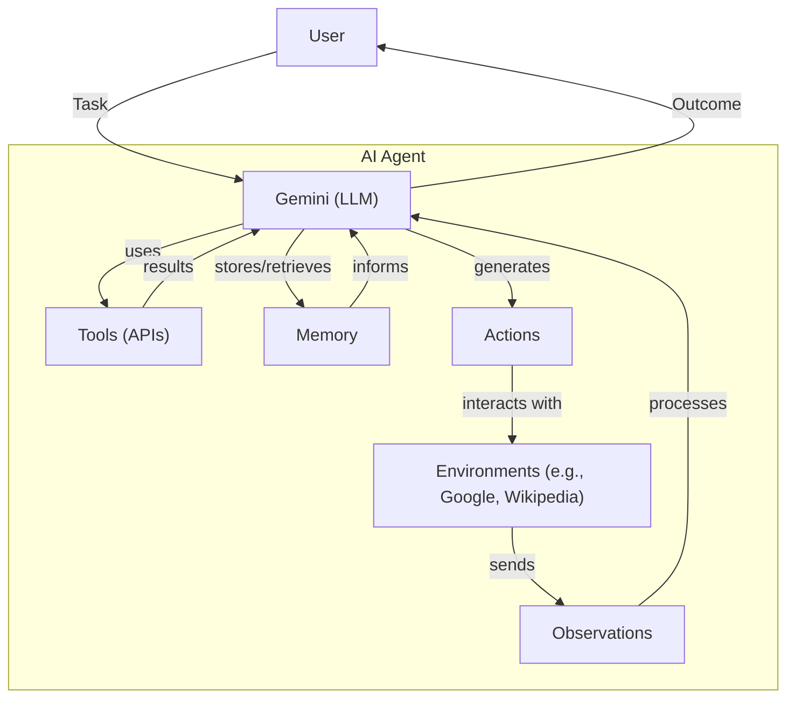
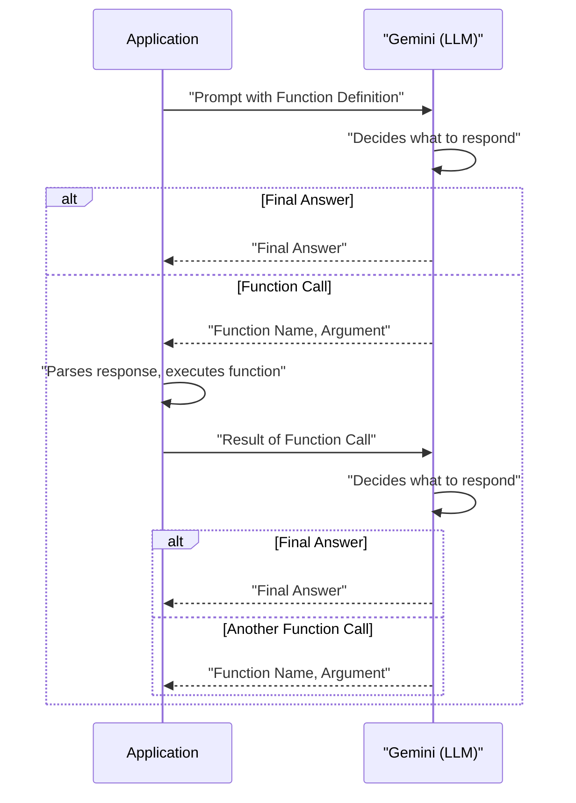
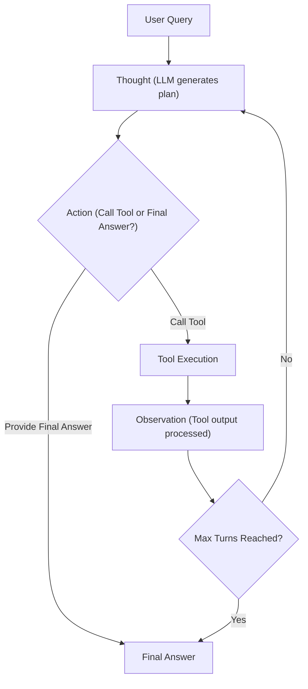

<article>
    # Lesson 8: Building a ReAct Agent From Scratch with Gemini
### A hands-on guide to orchestrating thought, action, and observation

When we first started building AI agents, we often found ourselves wrestling with complex frameworks that, while powerful, sometimes obscured the core mechanics of how an agent truly "thinks" and "acts." This made debugging and customizing agent behavior feel like navigating a black box. To gain a strong grasp of agentic systems, we realized we needed a practical understanding, built from the ground up.

This lesson is a 100% hands-on process. We will build a minimal, yet complete, ReAct agent using only Python and the Gemini API. You will implement the entire Thought → Action → Observation cycle yourself. By the end, you will see exactly how an LLM reasons, how its intent to use a tool is captured via function calling, and how the results are fed back into its context to inform the next step. This practical construction of the ReAct cycle provides a strong base, giving you the ability to extend, debug, and customize agents for more complex scenarios.

In this lesson, we will cover:

*   **Setup and Environment:** Prepare your Python environment and configure the Gemini API.
*   **Tool Layer:** Implement a simple mock search tool.
*   **Thought Phase:** Construct prompts to guide the agent's reasoning.
*   **Action Phase:** Use Gemini's function calling for tool selection.
*   **Control Loop:** Orchestrate the entire Thought → Action → Observation cycle.
*   **Tests and Traces:** Validate the agent with practical examples, demonstrating success and controlled error handling.

## Setup and Environment

Before we start building our agent, we need to set up our Python environment. This step helps confirm the code runs smoothly and that the outputs match what we expect. This is Lesson 8 in our course, so we assume you have already configured your Python virtual environment and set up your Gemini API key from the initial "Course Admin" lesson. If not, please revisit those steps to ensure everything is ready.

The architecture of the AI agent we are building can be seen in Image 1. This diagram illustrates how the LLM acts as the central brain, interacting with tools, memory, and external environments to process tasks and generate outcomes.



Image 1: High-level flowchart illustrating the architecture of an AI Agent.

1.  We start by loading our environment variables, which include your `GOOGLE_API_KEY`. This is a standard practice to keep sensitive information out of your source code.
    ```python
    from lessons.utils import env
    
    env.load(required_env_vars=["GOOGLE_API_KEY"])
    ```
    It outputs:
    ```text
    Trying to load environment variables from `/Users/fabio/Desktop/course-ai-agents/.env`:
    Environment variables loaded successfully.
    ```

2.  Next, we import the necessary libraries. These include `enum` and `pydantic` for creating structured data classes, `google.genai` for interacting with the Gemini model, and `lessons.utils.pretty_print` for clear output formatting in our notebook.
    ```python
    from enum import Enum
    from pydantic import BaseModel, Field
    from typing import List
    
    from google import genai
    from google.genai import types
    
    from lessons.utils import pretty_print
    ```

3.  With the API key loaded, we initialize the Gemini client. This client object will be our primary interface for sending prompts and receiving responses from the Gemini model.
    ```python
    client = genai.Client()
    ```
    It outputs:
    ```text
    Both GOOGLE_API_KEY and GEMINI_API_KEY are set. Using GOOGLE_API_KEY:
    ```

4.  Finally, we define the model ID. For this practical example, we use `gemini-2.5-flash`. This model is known for its speed and cost-effectiveness, making it a good choice for iterative development and demonstrations.
    ```python
    MODEL_ID = "gemini-2.5-flash"
    ```

With our environment configured and the Gemini client ready, we can define an external capability the agent can use. This tool will allow our agent to perform actions beyond its internal knowledge.

## Tool Layer: Mock Search Implementation

To demonstrate the "Action" part of the ReAct cycle, our agent needs a tool. For this lesson, we create a simple mock `search` tool instead of integrating with a real search API. This approach offers several advantages for learning. It simplifies our focus to the agent's core reasoning mechanics, eliminating the complexities of external API integrations. It also removes the need for additional API keys and dependencies, and delivers consistent, predictable responses, which is important for testing and understanding the agent's behavior.

1.  Here is the implementation of our mock `search` function. This Python function simulates looking up information. It is designed to recognize a few specific queries and return a predefined answer. If it receives an unrecognized query, it returns a "not found" message.
    ```python
    def search(query: str) -> str:
        """Search for information about a specific topic or query.
    
        Args:
            query (str): The search query or topic to look up.
        """
        query_lower = query.lower()
    
        # Predefined responses for demonstration
        if all(word in query_lower for word in ["capital", "france"]):
            return "Paris is the capital of France and is known for the Eiffel Tower."
        elif "react" in query_lower:
            return "The ReAct (Reasoning and Acting) framework enables LLMs to solve complex tasks by interleaving thought generation, action execution, and observation processing."
    
        # Generic response for unhandled queries
        return f"Information about '{query}' was not found."
    ```
    The docstring in the `search` function is important. As we will see in the Action Phase, Gemini's function calling feature uses this docstring to understand what the tool does and how to use it [[8]](https://ai.google.dev/gemini-api/docs/function-calling). This allows the LLM to interpret the tool's purpose and parameters without us explicitly writing them in the prompt.

2.  We maintain a `TOOL_REGISTRY`, which is a dictionary mapping tool names to their corresponding Python functions. This registry allows the model to plan using symbolic tool names, while our code safely resolves those names to actual executable functions. This separation of concerns is a common pattern in agent design.
    ```python
    TOOL_REGISTRY = {
        search.__name__: search,
    }
    ```

In a real-world application, you could easily replace this mock function with a call to an actual search API like Google Search, a database query, or any other external data source. The agent's core logic would remain the same; only the tool's implementation would change. This modularity is a main advantage of designing tools this way, as it allows for rapid prototyping and easy integration of new capabilities.

## Thought Phase: Prompt Construction and Generation

The first step in the ReAct cycle is "Thought." Here, the agent analyzes the user's request and its available tools, then formulates a plan. This plan is a short, internal monologue that guides its next action. We generate this thought by prompting the LLM with the conversation history and a description of the available tools. This phase is where the agent's reasoning abilities come into play, allowing it to break down complex queries into manageable steps [[45]](https://shafiqulai.github.io/blogs/blog_3.html), [[48]](https://www.wordware.ai/blog/why-the-react-agent-matters-how-ai-can-now-reason-and-act).

1.  First, we prepare the prompt for the thinking part. We implement a function that converts the `TOOL_REGISTRY` to an XML string representation, which we then insert into the prompt. This way, the LLM knows which tools are available and can reason around them. The XML format helps the model clearly distinguish the tools and their functionalities [[37]](https://mercity.ai/blog-post/react-prompting-and-react-based-agentic-systems).
    ```python
    def build_tools_xml_description(tools: dict[str, callable]) -> str:
        """Build a minimal XML description of tools using only their docstrings."""
        lines = []
        for tool_name, fn in tools.items():
            doc = (fn.__doc__ or "").strip()
            lines.append(f"\t<tool name=\"{tool_name}\">")
            if doc:
                lines.append(f"\t\t<description>")
                for line in doc.split("\n"):
                    lines.append(f"\t\t\t{line}")
                lines.append(f"\t\t</description>")
            lines.append("\t</tool>")
        return "\n".join(lines)
    
    tools_xml = build_tools_xml_description(TOOL_REGISTRY)
    
    PROMPT_TEMPLATE_THOUGHT = f"""
    You are deciding the next best step for reaching the user goal. You have some tools available to you.
    
    Available tools:
    <tools>
    {tools_xml}
    </tools>
    
    Conversation so far:
    <conversation>
    {{conversation}}
    </conversation>
    
    State your next thought about what to do next as one short paragraph focused on the next action you intend to take and why.
    Avoid repeating the same strategies that didn't work previously. Prefer different approaches.
    """.strip()
    ```

2.  We print the full prompt with the tool definitions inside. This output shows an XML block with one `<tool name="search">` containing the docstring, plus the `<conversation>` placeholder. This verifies that the tool description and conversation placeholder are included exactly as expected, providing a clear structure for the LLM's reasoning [[43]](https://promptingguide.ai/techniques/react).
    ```python
    print(PROMPT_TEMPLATE_THOUGHT)
    ```
    It outputs:
    ```text
    You are deciding the next best step for reaching the user goal. You have some tools available to you.
    
    Available tools:
    <tools>
    	<tool name="search">
    		<description>
    			Search for information about a specific topic or query.
    			
    			Args:
    			    query (str): The search query or topic to look up.
    		</description>
    	</tool>
    </tools>
    
    Conversation so far:
    <conversation>
    {conversation}
    </conversation>
    
    State your next thought about what to do next as one short paragraph focused on the next action you intend to take and why.
    Avoid repeating the same strategies that didn't work previously. Prefer different approaches.:
    ```

3.  Next, we implement the `generate_thought` function. This function takes the current conversation history and the tool registry. It formats the prompt, sends it to the Gemini model, and returns the model's response as the agent's thought. This thought is a plain text output, representing the agent's internal monologue before taking an action [[53]](https://xaibo.ai/how-to/orchestrator/customize-react-prompts/).
    ```python
    def generate_thought(conversation: str, tool_registry: dict[str, callable]) -> str:
        """Generate a thought as plain text (no structured output)."""
        tools_xml = build_tools_xml_description(tool_registry)
        prompt = PROMPT_TEMPLATE_THOUGHT.format(conversation=conversation, tools_xml=tools_xml)
    
        response = client.models.generate_content(
            model=MODEL_ID,
            contents=prompt
        )
        return response.text.strip()
    ```

With a coherent thought generated, such as "I need to use the search tool to find the capital of France," the agent must translate this intention into a concrete action.

## Action Phase: Function Calling and Parsing

The "Action" phase is where the agent decides its next move. This could be calling a tool or, if the task is complete, providing the final answer to the user. We use Gemini's native function calling capability to handle this decision-making process. Function calling allows the model to indicate when it wants to execute one of the tools we have provided. Instead of just returning text, the model can return a structured `FunctionCall` object specifying the name of the tool to use and the arguments to pass to it [[8]](https://ai.google.dev/gemini-api/docs/function-calling). This simplifies the "Action" phase compared to traditional text-parsing approaches, which often require complex parsing logic [[8]](https://ai.google.dev/gemini-api/docs/function-calling), [[19]](https://cloud.google.com/vertex-ai/generative-ai/docs/multimodal/function-calling), [[34]](https://leewayhertz.com/react-agents-vs-function-calling-agents/).

The interaction between our application and Gemini for function calling is illustrated in Image 2. This sequence diagram shows how the application sends a prompt with function definitions to Gemini, which then decides whether to return a final answer or a structured function call. If a function call is made, the application executes it and sends the result back to Gemini for further processing.



Image 2: Sequence diagram illustrating the interaction between an Application and Gemini (LLM) for function calling in the Action Phase of a ReAct agent.

1.  Our action-generation prompt is simpler than the thought prompt. It does not need detailed tool descriptions because we pass the tool functions directly to the Gemini API. The API automatically extracts the necessary information (name, description, parameters) from the Python function's signature and docstring. This keeps our prompt clean and focused on the high-level task, separating strategic guidance from technical tool details [[10]](https://ai.gopubby.com/react-ai-agent-from-scratch-using-deepseek-handling-memory-tools-without-frameworks-cabda9094273), [[5]](https://ai.google.dev/gemini-api/docs/langgraph-example), [[23]](https://developers.googleblog.com/en/building-agents-google-gemini-open-source-frameworks/).
    ```python
    PROMPT_TEMPLATE_ACTION = """
    You are selecting the best next action to reach the user goal.
    
    Conversation so far:
    <conversation>
    {conversation}
    </conversation>
    
    Respond either with a tool call (with arguments) or a final answer if you can confidently conclude.
    """.strip()
    
    # Dedicated prompt used when we must force a final answer
    PROMPT_TEMPLATE_ACTION_FORCED = """
    You must now provide a final answer to the user.
    
    Conversation so far:
    <conversation>
    {conversation}
    </conversation>
    
    Provide a concise final answer that best addresses the user's goal.
    """.strip()
    ```
    The `PROMPT_TEMPLATE_ACTION` guides the LLM to decide between using a tool or providing a final answer based on the conversation history. The `PROMPT_TEMPLATE_ACTION_FORCED` is a special prompt used when we need to ensure the agent concludes its operation, even if it has not found a perfect answer.

2.  We define two Pydantic models, `ToolCallRequest` and `FinalAnswer`, to represent the agent's decision. This gives us structured, validated output, which is far more reliable than parsing free-form text, as we discussed in Lesson 4. These models ensure that the agent's output is always in a predictable and machine-readable format.
    ```python
    class ToolCallRequest(BaseModel):
        """A request to call a tool with its name and arguments."""
        tool_name: str = Field(description="The name of the tool to call.")
        arguments: dict = Field(description="The arguments to pass to the tool.")
    
    
    class FinalAnswer(BaseModel):
        """A final answer to present to the user when no further action is needed."""
        text: str = Field(description="The final answer text to present to the user.")
    ```
    Using Pydantic models for structured outputs helps prevent errors and makes the agent's responses easier to integrate into downstream systems.

3.  The core of this phase is the `generate_action` function. It takes the conversation history and the tool registry. It configures the Gemini client with the system prompt and the list of available tools. When we call `generate_content`, the model will either return a text response (interpreted as a final answer) or a `FunctionCall` object (indicating a tool should be used). We provide an option to force a final answer to terminate cleanly after a budget of turns, preventing infinite loops or excessive tool calls [[40]](https://neradot.com/post/building-a-python-react-agent-class-a-step-by-step-guide).
    ```python
    def generate_action(conversation: str, tool_registry: dict[str, callable] | None = None, force_final: bool = False) -> (ToolCallRequest | FinalAnswer):
        """Generate an action by passing tools to the LLM and parsing function calls or final text.
    
        When force_final is True or no tools are provided, the model is instructed to produce a final answer and tool calls are disabled.
        """
        # Use a dedicated prompt when forcing a final answer or no tools are provided
        if force_final or not tool_registry:
            prompt = PROMPT_TEMPLATE_ACTION_FORCED.format(conversation=conversation)
            response = client.models.generate_content(
                model=MODEL_ID,
                contents=prompt
            )
            return FinalAnswer(text=response.text.strip())
    
        # Default action prompt
        prompt = PROMPT_TEMPLATE_ACTION.format(conversation=conversation)
    
        # Provide the available tools to the model; disable auto-calling so we can parse and run ourselves
        tools = list(tool_registry.values())
        config = types.GenerateContentConfig(
            tools=tools,
            automatic_function_calling={"disable": True}
        )
        response = client.models.generate_content(
            model=MODEL_ID,
            contents=prompt,
            config=config
        )
    
        # Extract the function call from the response (if present)
        candidate = response.candidates[0]
        parts = candidate.content.parts
        if parts and getattr(parts[0], "function_call", None):
            name = parts[0].function_call.name
            args = dict(parts[0].function_call.args) if parts[0].function_call.args is not None else {}
            return ToolCallRequest(tool_name=name, arguments=args)
        
        # Otherwise, it's a final answer
        final_answer = "".join(part.text for part in candidate.content.parts)
        return FinalAnswer(text=final_answer.strip())
    ```
    In the Action phase, we do not inline tool descriptions into the prompt (unlike the Thought phase). Instead, we pass the available Python tool functions through the `tools` parameter to `generate_content`. The client automatically parses these tools and incorporates their definitions and arguments into the model's prompt context, enabling function calling without duplicating tool specifications in our prompt text [[8]](https://ai.google.dev/gemini-api/docs/function-calling). This approach makes tool integration cleaner and more efficient.

4.  When handling unknown actions or malformed responses, our `generate_action` function is designed to return a `FinalAnswer` object if no tool call is detected. This provides a graceful fallback, preventing the agent from getting stuck. If the agent attempts to call a tool that does not exist, the `react_agent_loop` (which we will cover next) includes error handling to catch this and record an informative observation. This ensures the agent can recover from unexpected outputs or tool failures.

Now that we have all the individual components—a tool, a way to generate thoughts, and a way to decide on actions—it is time to assemble them into a cohesive control loop that orchestrates the entire ReAct process.

## Control Loop: Messages, Scratchpad, Orchestration

The control loop is the heart of our agent. It manages the flow of the ReAct cycle: Thought → Action → Observation. It maintains the state of the conversation in a "scratchpad" and iterates through the cycle until the user's question is answered or a set limit is reached. The execution flow of a ReAct agent is built around a cycle of thinking, acting, and evaluating results [[24]](https://docs.getdynamiq.ai/low-code-builder/llm-agents/guide-to-implementing-llm-agents-react-and-simple-agents). This iterative process allows the agent to adjust its reasoning and actions in real-time based on feedback from the environment [[20]](https://dailydoseofds.com/ai-agents-crash-course-part-10-with-implementation/), [[16]](https://arxiv.org/html/2404.11584v1), [[18]](https://aws.plainenglish.io/what-is-react-reasoning-pattern-how-it-makes-amazon-bedrock-agents-a-powerful-service-to-build-ai-c29e2d883d05).

The ReAct control loop is illustrated in Image 3. This flowchart shows the continuous cycle of reasoning, acting, and observing, which enables the agent to dynamically adapt its approach to problem-solving.



Image 3: Flowchart illustrating the ReAct (Reasoning and Acting) control loop.

1.  We start by defining a simple data structure to keep our conversation history organized. We use an `Enum` for message roles and a `Pydantic` model for the messages themselves. This structured message format enables clear tracking of the ReAct cycle, making the agent's internal state transparent and auditable [[28]](https://geekyants.com/blog/implementing-ai-agents-from-scratch-using-langchain-and-openai).
    ```python
    class MessageRole(str, Enum):
        """Enumeration for the different roles a message can have."""
        USER = "user"
        THOUGHT = "thought"
        TOOL_REQUEST = "tool request"
        OBSERVATION = "observation"
        FINAL_ANSWER = "final answer"
    
    
    class Message(BaseModel):
        """A message with a role and content, used for all message types."""
        role: MessageRole = Field(description="The role of the message in the ReAct loop.")
        content: str = Field(description="The textual content of the message.")
    
        def __str__(self) -> str:
            """Provides a user-friendly string representation of the message."""
            return f"{self.role.value.capitalize()}: {self.content}"
    ```

2.  We add a small printer that uses our `pretty_print` module to render each message nicely in the notebook. This helps us follow how the agent alternates between Thought, Action (tool call), and Observation across turns, which is useful for debugging and understanding the agent's behavior.
    ```python
    def pretty_print_message(message: Message, turn: int, max_turns: int, header_color: str = pretty_print.Color.YELLOW, is_forced_final_answer: bool = False) -> None:
        if not is_forced_final_answer:
            title = f"{message.role.value.capitalize()} (Turn {turn}/{max_turns}):"
        else:
            title = f"{message.role.value.capitalize()} (Forced):"
    
        pretty_print.wrapped(
            text=message.content,
            title=title,
            header_color=header_color,
        )
    ```

3.  We now use a `Scratchpad` class that wraps a list of `Message` objects. It provides an `append` method to both store and (optionally) pretty-print messages with role-based colors. The scratchpad is serialized each turn so the model can plan the next step, ensuring that all steps have access to the latest context [[26]](https://dylancastillo.co/posts/react-agent-langgraph.html).
    ```python
    class Scratchpad:
        """Container for ReAct messages with optional pretty-print on append."""
    
        def __init__(self, max_turns: int) -> None:
            self.messages: List[Message] = []
            self.max_turns: int = max_turns
            self.current_turn: int = 1
    
        def set_turn(self, turn: int) -> None:
            self.current_turn = turn
    
        def append(self, message: Message, verbose: bool = False, is_forced_final_answer: bool = False) -> None:
            self.messages.append(message)
            if verbose:
                role_to_color = {
                    MessageRole.USER: pretty_print.Color.RESET,
                    MessageRole.THOUGHT: pretty_print.Color.ORANGE,
                    MessageRole.TOOL_REQUEST: pretty_print.Color.GREEN,
                    MessageRole.OBSERVATION: pretty_print.Color.YELLOW,
                    MessageRole.FINAL_ANSWER: pretty_print.Color.CYAN,
                }
                header_color = role_to_color.get(message.role, pretty_print.Color.YELLOW)
                pretty_print_message(
                    message=message,
                    turn=self.current_turn,
                    max_turns=self.max_turns,
                    header_color=header_color,
                    is_forced_final_answer=is_forced_final_answer,
                )
    
        def to_string(self) -> str:
            return "\n".join(str(m) for m in self.messages)
    ```
    The scratchpad acts as the agent's memory for the current task, maintaining a running log of all thoughts, actions, and observations [[9]](https://airbyte.com/data-engineering-resources/using-langchain-react-agents).

4.  We implement the control loop. On the first turn, we add the user question. Then, at each turn, we get a Thought from the model, followed by an Action. If the action is a `FinalAnswer`, we stop. If it is a `ToolCallRequest`, we execute the tool and append the resulting `Observation`, then continue. If we reach the maximum number of turns, we run the action selector one last time with a flag that forces a final answer, ensuring a clean termination and a usable output [[40]](https://neradot.com/post/building-a-python-react-agent-class-a-step-by-step-guide). This iterative process allows for flexible adjustment and error handling [[20]](https://dailydoseofds.com/ai-agents-crash-course-part-10-with-implementation/), [[16]](https://arxiv.org/html/2404.11584v1), [[18]](https://aws.plainenglish.io/what-is-react-reasoning-pattern-how-it-makes-amazon-bedrock-agents-a-powerful-service-to-build-ai-c29e2d883d05).
    ```python
    def react_agent_loop(initial_question: str, tool_registry: dict[str, callable], max_turns: int = 5, verbose: bool = False) -> str:
        """
        Implements the main ReAct (Thought -> Action -> Observation) control loop.
        Uses a unified message class for the scratchpad.
        """
        scratchpad = Scratchpad(max_turns=max_turns)
    
        # Add the user's question to the scratchpad
        user_message = Message(role=MessageRole.USER, content=initial_question)
        scratchpad.append(user_message, verbose=verbose)
    
        for turn in range(1, max_turns + 1):
            scratchpad.set_turn(turn)
    
            # Generate a thought based on the current scratchpad
            thought_content = generate_thought(
                scratchpad.to_string(),
                tool_registry,
            )
            thought_message = Message(role=MessageRole.THOUGHT, content=thought_content)
            scratchpad.append(thought_message, verbose=verbose)
    
            # Generate an action based on the current scratchpad
            action_result = generate_action(
                scratchpad.to_string(),
                tool_registry=tool_registry,
            )
    
            # If the model produced a final answer, return it
            if isinstance(action_result, FinalAnswer):
                final_answer = action_result.text
                final_message = Message(role=MessageRole.FINAL_ANSWER, content=final_answer)
                scratchpad.append(final_message, verbose=verbose)
                return final_answer
    
            # Otherwise, it is a tool request
            if isinstance(action_result, ToolCallRequest):
                action_name = action_result.tool_name
                action_params = action_result.arguments
    
                # Add the action to the scratchpad
                params_str = ", ".join([f"{k}='{v}'" for k, v in action_params.items()])
                action_content = f"{action_name}({params_str})"
                action_message = Message(role=MessageRole.TOOL_REQUEST, content=action_content)
                scratchpad.append(action_message, verbose=verbose)
    
                # Run the action and get the observation
                observation_content = ""
                tool_function = tool_registry[action_name]
                try:
                    observation_content = tool_function(**action_params)
                except Exception as e:
                    observation_content = f"Error executing tool '{action_name}': {e}"
    
                # Add the observation to the scratchpad
                observation_message = Message(role=MessageRole.OBSERVATION, content=observation_content)
                scratchpad.append(observation_message, verbose=verbose)
    
            # Check if the maximum number of turns has been reached. If so, force the action selector to produce a final answer
            if turn == max_turns:
                forced_action = generate_action(
                    scratchpad.to_string(),
                    force_final=True,
                )
                if isinstance(forced_action, FinalAnswer):
                    final_answer = forced_action.text
                else:
                    final_answer = "Unable to produce a final answer within the allotted turns."
                final_message = Message(role=MessageRole.FINAL_ANSWER, content=final_answer)
                scratchpad.append(final_message, verbose=verbose, is_forced_final_answer=True)
                return final_answer
    ```
    The `Observation` step is important for integrating external feedback from tools back into the agent's reasoning loop. This processed information directly influences subsequent 'Thought' and 'Action' steps, allowing the agent to adapt flexibly and iteratively improve its approach [[20]](https://dailydoseofds.com/ai-agents-crash-course-part-10-with-implementation/), [[26]](https://dylancastillo.co/posts/react-agent-langgraph.html), [[31]](https://langchain-ai.github.io/langgraph/concepts/agentic_concepts/). This ensures the agent does not act blindly but continuously refines its plan based on real-world feedback.

This implementation of the control loop provides a strong base. We manage the flow of the ReAct cycle, maintain the conversation state, and handle tool interactions and errors. With the full loop implemented, it is time to test our agent and observe its operation.

## Tests and Traces: Success and Controlled Fallback

The final step is to validate our ReAct agent with a couple of test cases. We will run the loop with `verbose=True` to see the full trace of its thought process. This will confirm that each part of the system—thought, action, observation, and control loop—is working as expected. This also helps us understand common failure modes and implement effective debugging strategies, as discussed in Lesson 7 [[13]](https://amplework.com/blog/debugging-agentic-ai-tools-techniques), [[25]](https://docs.nvidia.com/aiqtoolkit/latest/workflows/about/react-agent.html).

1.  Let's start with a straightforward factual question that our mock `search` tool knows how to answer. We set `max_turns=2` to observe a complete ReAct cycle.
    ```python
    question = "What is the capital of France?"
    final_answer = react_agent_loop(question, TOOL_REGISTRY, max_turns=2, verbose=True)
    ```
    It outputs:
    ```text
    ----------------------------------------- User (Turn 1/2): ----------------------------------------- 
    What is the capital of France?
    ---------------------------------------------------------------------------------------------------- 
    --------------------------------------- Thought (Turn 1/2): --------------------------------------- 
    I need to find the capital of France to answer the user's question. The `search` tool can be used to retrieve this factual information.
    ---------------------------------------------------------------------------------------------------- 
    ------------------------------------- Tool request (Turn 1/2): ------------------------------------- 
    search(query='capital of France'):
    ---------------------------------------------------------------------------------------------------- 
    ------------------------------------- Observation (Turn 1/2): ------------------------------------- 
    Paris is the capital of France and is known for the Eiffel Tower.:
    ---------------------------------------------------------------------------------------------------- 
    --------------------------------------- Thought (Turn 2/2): --------------------------------------- 
    I have successfully found the capital of France using the search tool. The next step is to communicate this answer to the user.
    ---------------------------------------------------------------------------------------------------- 
    ------------------------------------- Final answer (Turn 2/2): ------------------------------------- 
    Paris is the capital of France.:
    ---------------------------------------------------------------------------------------------------- 
    ```
    The trace shows the ReAct cycle in action:
    *   **Turn 1:** The agent correctly identifies the need to use the `search` tool for "capital of France." The tool returns "Paris is the capital of France..."
    *   **Turn 2:** With this observation, the agent recognizes it has enough information and provides the final answer.
    This successful run validates that the entire end-to-end loop works. The agent can reason about a user's query, use a tool to find information, process the result, and formulate a final answer.

2.  Next, let's test the agent's ability to handle a query our mock tool does not know about. This tests the agent's reasoning when a tool fails to provide useful information and demonstrates the forced termination logic.
    ```python
    question = "What is the capital of Italy?"
    final_answer = react_agent_loop(question, TOOL_REGISTRY, max_turns=2, verbose=True)
    ```
    It outputs:
    ```text
    ----------------------------------------- User (Turn 1/2): ----------------------------------------- 
    What is the capital of Italy?
    ---------------------------------------------------------------------------------------------------- 
    --------------------------------------- Thought (Turn 1/2): --------------------------------------- 
    I need to find the capital of Italy to answer the user's question. The `search` tool can provide this information efficiently.I will use the `search` tool to find the capital of Italy.
    ---------------------------------------------------------------------------------------------------- 
    ------------------------------------- Tool request (Turn 1/2): ------------------------------------- 
    search(query='capital of Italy'):
    ---------------------------------------------------------------------------------------------------- 
    ------------------------------------- Observation (Turn 1/2): ------------------------------------- 
    Information about 'capital of Italy' was not found.:
    ---------------------------------------------------------------------------------------------------- 
    --------------------------------------- Thought (Turn 2/2): --------------------------------------- 
    The previous search query "capital of Italy" did not return information, which is unexpected for a common fact. I will try a broader search query like "Italy" to see if more general information or a list of facts about Italy can provide the capital, as the tool might respond better to less specific phrasing or have had a temporary issue with the exact previous query.I will try a broader search query like "Italy" to see if more general information or a list of facts about Italy can provide the capital, as the tool might respond better to less specific phrasing or have had a temporary issue with the exact previous query.
    ---------------------------------------------------------------------------------------------------- 
    ------------------------------------- Tool request (Turn 2/2): ------------------------------------- 
    search(query='Italy'):
    ---------------------------------------------------------------------------------------------------- 
    ------------------------------------- Observation (Turn 2/2): ------------------------------------- 
    Information about 'Italy' was not found.:
    ---------------------------------------------------------------------------------------------------- 
    -------------------------------------- Final answer (Forced): -------------------------------------- 
    I'm sorry, but I couldn't find information about the capital of Italy.:
    ---------------------------------------------------------------------------------------------------- 
    ```
    This trace demonstrates the agent's ability to adapt and handle failure:
    *   **Turn 1:** The agent attempts to search for "capital of Italy," but the mock tool returns "not found."
    *   **Turn 2:** The agent observes the failure and adjusts its strategy, trying a broader search for "Italy." This also fails.
    *   **Forced Final Answer:** Having reached `max_turns` without a definitive answer, the control loop forces a conclusion. The agent synthesizes the information it has (its failure to find an answer) and provides a polite, honest response.
    This test confirms that our agent does not get stuck in a loop when its tools fail. It can recognize failure, attempt alternative strategies, and provide a sensible final response when it exhausts its options. This resilience is an important aspect of a well-designed agent.

These tests confirm the end-to-end loop and provide a baseline for extending the agent with richer tools and behaviors in later lessons.

## Conclusion

In this lesson, you began a practical process to build a ReAct agent from scratch using Python and the Gemini API. You implemented the core Thought → Action → Observation cycle, defining a mock tool, generating thoughts, selecting actions with function calling, executing tools, processing observations, and orchestrating a turn-based control loop. This practical experience provides a clear understanding of how reasoning agents operate, giving you the ability to debug, customize, and modify them.

This understanding is important for any aspiring AI engineer. As you progress through the course, we will build upon this ReAct agent, integrating more advanced concepts such as agent memory (Lesson 9), RAG (Lesson 10), and multimodal processing (Lesson 11). This iterative learning approach will help you understand the challenges of building production-ready AI systems.

## References

1.  Yao, S., Piao, J., Shafran, I., Westera, M., Hosseini, S. A., & Yuan, K. (2022). *ReAct: Synergizing Reasoning and Acting in Language Models*. arXiv.org. https://arxiv.org/pdf/2210.03629
2.  IBM. (n.d.). *What is a ReAct agent?*. IBM. https://www.ibm.com/think/topics/react-agent
3.  IBM. (n.d.). *AI Agent Planning*. IBM. https://www.ibm.com/think/topics/ai-agent-planning
4.  Anthropic. (n.d.). *Building Effective Agents*. Anthropic. https://www.anthropic.com/engineering/building-effective-agents
5.  Google AI for Developers. (n.d.). *LangGraph example with Gemini 2.5*. Google AI for Developers. https://ai.google.dev/gemini-api/docs/langgraph-example
6.  Medium. (n.d.). *Building ReAct Agents from Scratch using Gemini*. Medium. https://medium.com/google-cloud/building-react-agents-from-scratch-a-hands-on-guide-using-gemini-ffe4621d90ae
7.  IBM. (n.d.). *AI Agent Orchestration*. IBM. https://www.ibm.com/think/topics/ai-agent-orchestration
8.  Google AI for Developers. (n.d.). *Function calling with the Gemini API*. Google AI for Developers. https://ai.google.dev/gemini-api/docs/function-calling
9.  Airbyte. (n.d.). *Using LangChain ReAct Agents*. Airbyte. https://airbyte.com/data-engineering-resources/using-langchain-react-agents
10. Gopubby. (n.d.). *ReAct AI Agent from Scratch Using Deepseek: Handling Memory & Tools Without Frameworks*. Gopubby. https://ai.gopubby.com/react-ai-agent-from-scratch-using-deepseek-handling-memory-tools-without-frameworks-cabda9094273
11. Amplework. (n.d.). *Debugging Agentic AI Tools: Techniques*. Amplework. https://amplework.com/blog/debugging-agentic-ai-tools-techniques/
12. Arize AI. (n.d.). *ReAct Agent LLM*. Arize AI. https://arize.com/blog-course/react-agent-llm/
13. Arize AI. (n.d.). *ReAct Prompting*. Arize AI. https://arize.com/docs/phoenix/cookbook/prompt-engineering/react-prompting
14. arXiv. (n.d.). *From LLM Reasoning to Autonomous AI Agents*. arXiv. https://arxiv.org/html/2404.11584v1
15. AWS. (n.d.). *What is ReAct Reasoning Pattern? How it Makes Amazon Bedrock Agents a Powerful Service to Build AI*. AWS. https://aws.plainenglish.io/what-is-react-reasoning-pattern-how-it-makes-amazon-bedrock-agents-a-powerful-service-to-build-ai-c29e2d883d05
16. Cloud, G. (n.d.). *Function calling on Vertex AI*. Google Cloud. https://cloud.google.com/vertex-ai/generative-ai/docs/multimodal/function-calling
17. Daily Dose of Data Science. (n.d.). *AI Agents Crash Course Part 10: With Implementation*. Daily Dose of Data Science. https://www.dailydoseofds.com/ai-agents-crash-course-part-10-with-implementation/
18. Daily Dose of Data Science. (n.d.). *Intro to ReAct: Reasoning and Action Agents*. Daily Dose of Data Science. https://www.dailydoseofds.com/p/intro-to-react-reasoning-and-action-agents/
19. Dev.to. (n.d.). *ReAct (Reason + Act): A Smarter Way for Language Models to Think and Do*. Dev.to. https://dev.to/rijultp/react-reason-act-a-smarter-way-for-language-models-to-think-and-do-344o
20. Dynamiq. (n.d.). *Guide to Implementing LLM Agents: ReAct and Simple Agents*. Dynamiq. https://docs.getdynamiq.ai/low-code-builder/llm-agents/guide-to-implementing-llm-agents-react-and-simple-agents
21. Castillo, D. (n.d.). *ReAct Agent with LangGraph: Building from Scratch*. Dylan Castillo. https://dylancastillo.co/posts/react-agent-langgraph.html
22. Firebase. (n.d.). *Function calling with Firebase AI Logic*. Firebase. https://firebase.google.com/docs/ai-logic/function-calling
23. GeekyAnts. (n.d.). *Implementing AI Agents from Scratch Using LangChain and OpenAI*. GeekyAnts. https://geekyants.com/blog/implementing-ai-agents-from-scratch-using-langchain-and-openai
24. LangChain. (n.d.). *Agentic Concepts*. LangGraph. https://langchain-ai.github.io/langgraph/concepts/agentic_concepts/
25. LangChain. (n.d.). *How-to: ReAct Agent from Scratch*. LangGraph. https://langchain-ai.github.io/langgraph/how-tos/react-agent-from-scratch/
26. Learn Prompting. (n.d.). *Agents - ReAct*. Learn Prompting. https://learnprompting.org/docs/agents/react
27. LeewayHertz. (n.d.). *ReAct Agents vs. Function Calling Agents*. LeewayHertz. https://www.leewayhertz.com/react-agents-vs-function-calling-agents/
28. LessWrong. (n.d.). *Detecting AI Agent Failure Modes in Simulations*. LessWrong. https://www.lesswrong.com/posts/sekmz9EiBD6ByZpyp/detecting-ai-agent-failure-modes-in-simulations
29. Maven. (n.d.). *AI Agent Engineering: ReAct, RAG, Multi-Agent*. Maven. https://maven.com/rakeshgohel/ai-agent-engineering-react-rag-multi-agent
30. Mercity.ai. (n.d.). *ReAct Prompting and ReAct-Based Agentic Systems*. Mercity.ai. https://www.mercity.ai/blog-post/react-prompting-and-react-based-agentic-systems
31. Motley Crew AI. (n.d.). *Reliable AI at Your Fingertips: How We Built Universal ReAct Agents That Just Work*. Motley Crew AI. https://blog.motleycrew.ai/blog/reliable-ai-at-your-fingertips-how-we-built-universal-react-agents-that-just-work
32. Neon. (n.d.). *The 3 Levels of Debugging with AI*. Neon. https://neon.com/blog/the-3-levels-of-debugging-with-ai
33. Neradot. (n.d.). *Building a Python ReAct Agent Class: A Step-by-Step Guide*. Neradot. https://www.neradot.com/post/building-a-python-react-agent-class-a-step-by-step-guide
34. Nutrient.io. (n.d.). *ReWOO vs. ReAct: Choosing the Right Agent Architecture*. Nutrient.io. https://www.nutrient.io/blog/rewoo-vs-react-choosing-right-agent-architecture/
35. NVIDIA. (n.d.). *ReAct Agent*. NVIDIA. https://docs.nvidia.com/aiqtoolkit/latest/workflows/about/react-agent.html
36. Phil Schmid. (n.d.). *LangGraph with Gemini 2.5 ReAct Agent*. Phil Schmid. https://www.philschmid.de/langgraph-gemini-2-5-react-agent
37. Prompting Guide. (n.d.). *ReAct*. Prompting Guide. https://www.promptingguide.ai/techniques/react
38. ReAct-LM.github.io. (n.d.). *ReAct: Synergizing Reasoning and Acting in Language Models*. ReAct-LM.github.io. https://react-lm.github.io
39. Shafiqul AI. (n.d.). *ReAct Agents: Reasoning and Acting with LLMs*. Shafiqul AI. https://shafiqulai.github.io/blogs/blog_3.html
40. Technofile. (n.d.). *How to Build a ReAct AI Agent with LangChain*. Technofile. https://technofile.substack.com/p/how-to-build-a-react-ai-agent-with
41. Tsmatz. (n.d.). *ReAct with OpenAI GPT and LangChain*. Tsmatz. https://tsmatz.wordpress.com/2023/03/07/react-with-openai-gpt-and-langchain/
42. Wordware. (n.d.). *Why the ReAct Agent Matters: How AI Can Now Reason and Act*. Wordware. https://www.wordware.ai/blog/why-the-react-agent-matters-how-ai-can-now-reason-and-act
43. Xaibo. (n.d.). *Customize ReAct Prompts*. Xaibo. https://xaibo.ai/how-to/orchestrator/customize-react-prompts/
44. YouTube. (n.d.). *Gemini Function Calling Tutorial*. YouTube. https://www.youtube.com/watch?v=SC-Y_o_fkbY
45. YouTube. (n.d.). *LangChain: Custom Tools for Agents*. YouTube. https://www.youtube.com/watch?v=Lvrv9I276ps
46. YouTube. (n.d.). *Gemini Function Calling: A Deep Dive*. YouTube. https://www.youtube.com/watch?v=mVXrdvXplj0
47. Width.AI. (n.d.). *ReAct Prompting*. Width.AI. https://www.width.ai/post/react-prompting
48. AIS. (n.d.). *Control Loop Termination Problem in ReAct Agents*. AIS. https://inspect.aisi.org.uk/react-agent.html
49. Huyen, C. (2025, January 7). *Agents*. Huyenchip.com. https://huyenchip.com/2025/01/07/agents.html
50. arXiv. (n.d.). *MAST: A Taxonomy of Failure Modes in Multi-Agent Systems*. arXiv. https://arxiv.org/pdf/2503.13657
</article>