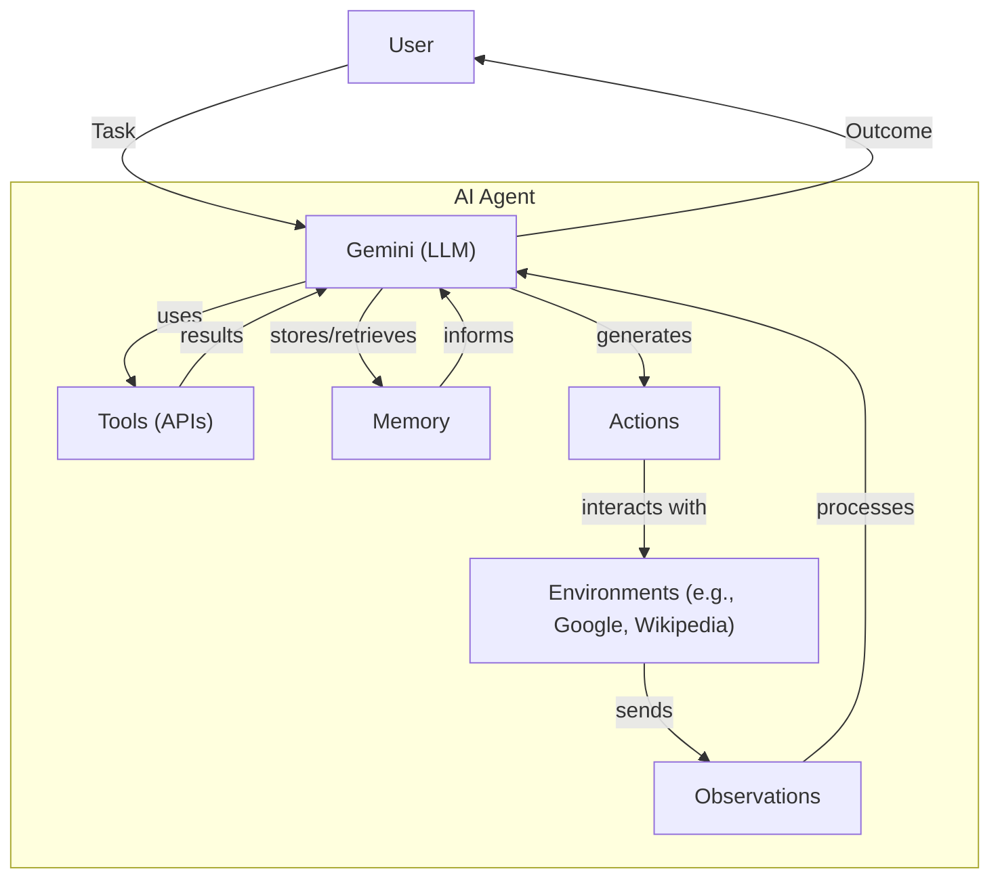
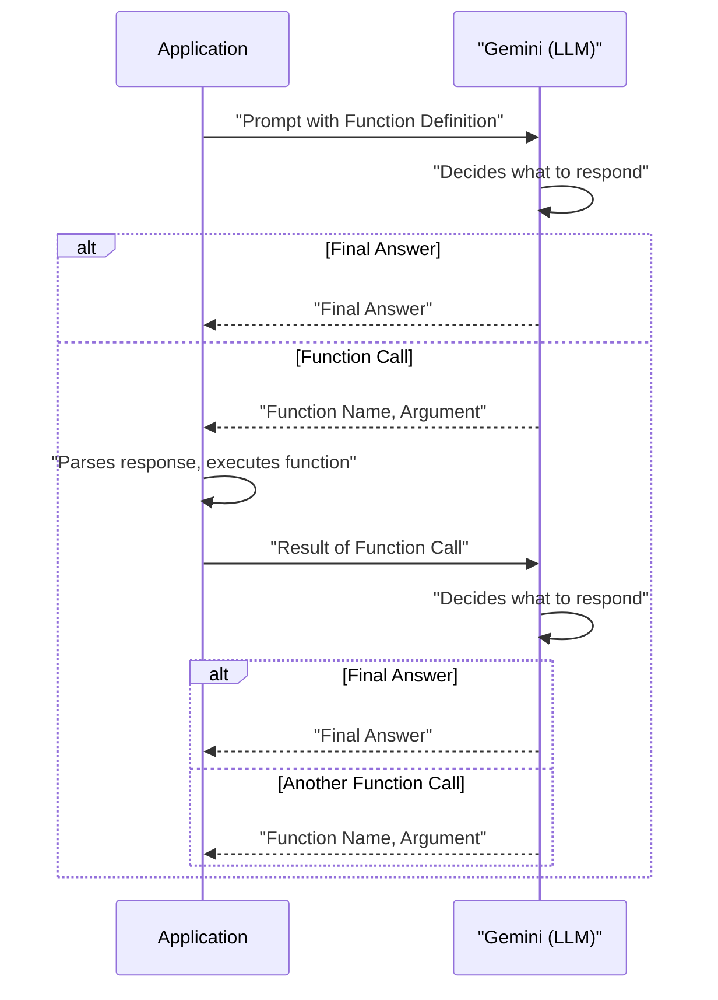
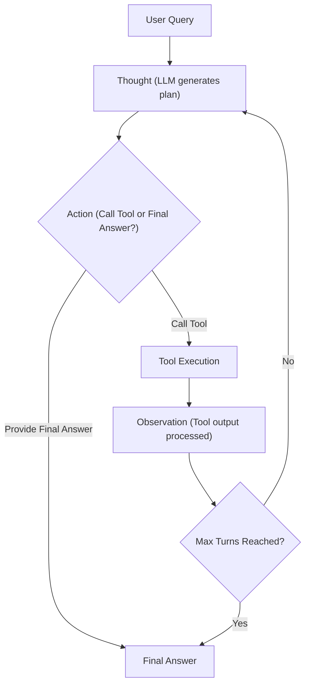

# Lesson 8: Building a ReAct Agent From Scratch with Gemini
### A Hands-On Guide to Orchestrating Thought, Action, and Observation

As you delve deeper into the world of AI agents, you might notice that while high-level frameworks offer powerful abstractions, they sometimes obscure the core mechanics of how an agent truly "thinks" and "acts." This can make debugging and customizing agent behavior feel like navigating a black box. What you need is a concrete mental model, built from the ground up, to truly master agentic systems.

This lesson is a 100% practical journey. We will build a minimal, yet complete, ReAct agent using only Python and the Gemini API. You will implement the entire Thought → Action → Observation loop yourself. By the end, you will see exactly how an LLM reasons, how its intent to use a tool is captured via function calling, and how the results are fed back into its context to inform the next step. This hands-on construction of the ReAct loop provides a solid foundation, giving you the confidence to extend, debug, and customize agents for more complex scenarios.

Here is what we will cover:

*   **Setup and Environment:** Prepare your Python environment and configure the Gemini API.
*   **Tool Layer:** Implement a simple mock search tool.
*   **Thought Phase:** Construct prompts to guide the agent's reasoning.
*   **Action Phase:** Leverage Gemini's function calling for tool selection.
*   **Control Loop:** Orchestrate the entire Thought → Action → Observation cycle.
*   **Tests and Traces:** Validate the agent with practical examples, demonstrating success and graceful error handling.

## Setup and Environment

Before we dive into building our agent, we need to set up our Python environment. This ensures the code runs smoothly and that the outputs match what we expect. This is Lesson 8 in our course, so we assume you have already configured your Python virtual environment and set up your Gemini API key from the initial "Course Admin" lesson. If not, please revisit those steps to ensure everything is ready.

The architecture of the AI agent we are building can be seen in Image 1.



Image 1: High-level flowchart illustrating the architecture of an AI Agent.

1.  We start by loading our environment variables, which include your `GOOGLE_API_KEY`.
    ```python
    from lessons.utils import env
    
    env.load(required_env_vars=["GOOGLE_API_KEY"])
    ```
    It outputs:
    ```text
    Trying to load environment variables from `/Users/fabio/Desktop/course-ai-agents/.env`
    Environment variables loaded successfully.
    ```

2.  Next, we import the necessary libraries. These include `enum` and `pydantic` for structured data, `google.genai` for interacting with the Gemini model, and `lessons.utils.pretty_print` for clear output formatting.
    ```python
    from enum import Enum
    from pydantic import BaseModel, Field
    from typing import List
    
    from google import genai
    from google.genai import types
    
    from lessons.utils import pretty_print
    ```

3.  With the API key loaded, we initialize the Gemini client.
    ```python
    client = genai.Client()
    ```
    It outputs:
    ```text
    Both GOOGLE_API_KEY and GEMINI_API_KEY are set. Using GOOGLE_API_KEY.
    ```

4.  Finally, we define the model ID. We use `gemini-2.5-flash` for its speed and cost-effectiveness, which is ideal for this hands-on exercise.
    ```python
    MODEL_ID = "gemini-2.5-flash"
    ```

With our environment configured and the Gemini client ready, we can move on to giving our agent its first capability: a tool it can use to interact with the world.

## Tool Layer: Mock Search Implementation

To demonstrate the "Action" part of the ReAct cycle, our agent needs a tool. For learning purposes, we use a simple mock `search` tool instead of a real search API. This approach simplifies our focus to the agent's core reasoning loop without the complexities of external API integrations. It also removes the need for additional API keys and provides consistent, predictable responses, which is essential for testing and understanding the agent's behavior.

1.  Here is the implementation of our mock `search` function. It simulates looking up information and recognizes a few specific queries, returning a predefined answer. If it receives an unrecognized query, it returns a "not found" message.
    ```python
    def search(query: str) -> str:
        """Search for information about a specific topic or query.
    
        Args:
            query (str): The search query or topic to look up.
        """
        query_lower = query.lower()
    
        # Predefined responses for demonstration
        if all(word in query_lower for word in ["capital", "france"]):
            return "Paris is the capital of France and is known for the Eiffel Tower."
        elif "react" in query_lower:
            return "The ReAct (Reasoning and Acting) framework enables LLMs to solve complex tasks by interleaving thought generation, action execution, and observation processing."
    
        # Generic response for unhandled queries
        return f"Information about '{query}' was not found."
    ```
    Notice the docstring in the `search` function. Gemini's function calling feature uses this docstring to understand what the tool does and how to use it, as we will see in the Action Phase [[5]](https://ai.google.dev/gemini-api/docs/function-calling).

2.  We maintain a `TOOL_REGISTRY` which maps tool names to their corresponding Python functions. This allows the model to plan using symbolic tool names, while our code safely resolves these names to actual executable functions.
    ```python
    TOOL_REGISTRY = {
        search.__name__: search,
    }
    ```

In a real-world application, you could easily replace this mock function with a call to an actual search API like Google Search, a database query, or any other external data source. The agent's core logic would remain the same; only the tool's implementation would change. This modularity is a key benefit of designing tools this way.

## Thought Phase: Prompt Construction and Generation

The first step in the ReAct loop is "Thought," where the agent analyzes the user's request and its available tools to formulate a plan. This plan is a short, internal monologue that guides its next action. We generate this thought by prompting the LLM with the conversation history and a description of the available tools.

1.  First, we prepare the prompt for the thinking part. We implement a function that converts the `TOOL_REGISTRY` to an XML string representation, which we then insert into the prompt. This helps the LLM understand the available tools and reason around them.
    ```python
    def build_tools_xml_description(tools: dict[str, callable]) -> str:
        """Build a minimal XML description of tools using only their docstrings."""
        lines = []
        for tool_name, fn in tools.items():
            doc = (fn.__doc__ or "").strip()
            lines.append(f"\t<tool name=\"{tool_name}\">")
            if doc:
                lines.append(f"\t\t<description>")
                for line in doc.split("\n"):
                    lines.append(f"\t\t\t{line}")
                lines.append(f"\t\t</description>")
            lines.append("\t</tool>")
        return "\n".join(lines)
    
    tools_xml = build_tools_xml_description(TOOL_REGISTRY)
    
    PROMPT_TEMPLATE_THOUGHT = f"""
    You are deciding the next best step for reaching the user goal. You have some tools available to you.
    
    Available tools:
    <tools>
    {tools_xml}
    </tools>
    
    Conversation so far:
    <conversation>
    {{conversation}}
    </conversation>
    
    State your next thought about what to do next as one short paragraph focused on the next action you intend to take and why.
    Avoid repeating the same strategies that didn't work previously. Prefer different approaches.
    """.strip()
    ```

2.  We print the full prompt with the tool definitions inside. This output shows an XML block with one `<tool name="search">` containing the docstring, plus the `<conversation>` placeholder. This verifies that the tool description and conversation placeholder are included exactly as expected.
    ```python
    print(PROMPT_TEMPLATE_THOUGHT)
    ```
    It outputs:
    ```text
    You are deciding the next best step for reaching the user goal. You have some tools available to you.
    
    Available tools:
    <tools>
    	<tool name="search">
    		<description>
    			Search for information about a specific topic or query.
    			
    			Args:
    			    query (str): The search query or topic to look up.
    		</description>
    	</tool>
    </tools>
    
    Conversation so far:
    <conversation>
    {conversation}
    </conversation>
    
    State your next thought about what to do next as one short paragraph focused on the next action you intend to take and why.
    Avoid repeating the same strategies that didn't work previously. Prefer different approaches.
    ```

3.  Next, we implement the `generate_thought` function. This function takes the current conversation history and the tool registry, formats the prompt, sends it to the Gemini model, and returns the model's response as the agent's thought.
    ```python
    def generate_thought(conversation: str, tool_registry: dict[str, callable]) -> str:
        """Generate a thought as plain text (no structured output)."""
        tools_xml = build_tools_xml_description(tool_registry)
        prompt = PROMPT_TEMPLATE_THOUGHT.format(conversation=conversation, tools_xml=tools_xml)
    
        response = client.models.generate_content(
            model=MODEL_ID,
            contents=prompt
        )
        return response.text.strip()
    ```

With a coherent thought generated, such as "I need to use the search tool to find the capital of France," the agent must translate this intention into a concrete action.

## Action Phase: Function Calling and Parsing

The "Action" phase is where the agent decides its next move. This could be calling a tool or, if the task is complete, providing the final answer to the user. We will leverage Gemini's native function calling capability to handle this decision-making process. Function calling allows the model to indicate when it wants to execute one of the tools we have provided. Instead of just returning text, the model can return a structured `FunctionCall` object specifying the name of the tool to use and the arguments to pass to it [[5]](https://ai.google.dev/gemini-api/docs/function-calling). This significantly simplifies the "Action" phase compared to traditional text-parsing approaches [[30]](https://ai.google.dev/gemini-api/docs/function-calling), [[31]](https://cloud.google.com/vertex-ai/generative-ai/docs/multimodal/function-calling), [[33]](https://www.leewayhertz.com/react-agents-vs-function-calling-agents).

The interaction between our application and Gemini for function calling is illustrated in Image 2.



Image 2: Sequence diagram illustrating the interaction between an Application and Gemini (LLM) for function calling in the Action Phase of a ReAct agent.

1.  Our action-generation prompt is simpler than the thought prompt. It does not need detailed tool descriptions because we pass the tool functions directly to the Gemini API. The API automatically extracts the necessary information (name, description, parameters) from the Python function's signature and docstring. This keeps our prompt clean and focused on the high-level task, separating strategic guidance from technical tool details [[63]](https://ai.gopubby.com/react-ai-agent-from-scratch-using-deepseek-handling-memory-tools-without-frameworks-cabda9094273), [[64]](https://ai.google.dev/gemini-api/docs/langgraph-example), [[65]](https://developers.googleblog.com/en/building-agents-google-gemini-open-source-frameworks/).
    ```python
    PROMPT_TEMPLATE_ACTION = """
    You are selecting the best next action to reach the user goal.
    
    Conversation so far:
    <conversation>
    {conversation}
    </conversation>
    
    Respond either with a tool call (with arguments) or a final answer if you can confidently conclude.
    """.strip()
    
    # Dedicated prompt used when we must force a final answer
    PROMPT_TEMPLATE_ACTION_FORCED = """
    You must now provide a final answer to the user.
    
    Conversation so far:
    <conversation>
    {conversation}
    </conversation>
    
    Provide a concise final answer that best addresses the user's goal.
    """.strip()
    ```

2.  We define two Pydantic models, `ToolCallRequest` and `FinalAnswer`, to represent the agent's decision. This gives us structured, validated output, which is far more reliable than parsing free-form text, as we discussed in Lesson 4.
    ```python
    class ToolCallRequest(BaseModel):
        """A request to call a tool with its name and arguments."""
        tool_name: str = Field(description="The name of the tool to call.")
        arguments: dict = Field(description="The arguments to pass to the tool.")
    
    
    class FinalAnswer(BaseModel):
        """A final answer to present to the user when no further action is needed."""
        text: str = Field(description="The final answer text to present to the user.")
    ```

3.  The core of this phase is the `generate_action` function. It takes the conversation history and the tool registry. When we call `generate_content`, the model will either return a text response (interpreted as a final answer) or a `FunctionCall` object (indicating a tool should be used). We provide an option to force a final answer to terminate cleanly after a budget of turns, preventing infinite loops or excessive tool calls.
    ```python
    def generate_action(conversation: str, tool_registry: dict[str, callable] | None = None, force_final: bool = False) -> (ToolCallRequest | FinalAnswer):
        """Generate an action by passing tools to the LLM and parsing function calls or final text.
    
        When force_final is True or no tools are provided, the model is instructed to produce a final answer and tool calls are disabled.
        """
        # Use a dedicated prompt when forcing a final answer or no tools are provided
        if force_final or not tool_registry:
            prompt = PROMPT_TEMPLATE_ACTION_FORCED.format(conversation=conversation)
            response = client.models.generate_content(
                model=MODEL_ID,
                contents=prompt
            )
            return FinalAnswer(text=response.text.strip())
    
        # Default action prompt
        prompt = PROMPT_TEMPLATE_ACTION.format(conversation=conversation)
    
        # Provide the available tools to the model; disable auto-calling so we can parse and run ourselves
        tools = list(tool_registry.values())
        config = types.GenerateContentConfig(
            tools=tools,
            automatic_function_calling={"disable": True}
        )
        response = client.models.generate_content(
            model=MODEL_ID,
            contents=prompt,
            config=config
        )
    
        # Extract the function call from the response (if present)
        candidate = response.candidates[0]
        parts = candidate.content.parts
        if parts and getattr(parts[0], "function_call", None):
            name = parts[0].function_call.name
            args = dict(parts[0].function_call.args) if parts[0].function_call.args is not None else {}
            return ToolCallRequest(tool_name=name, arguments=args)
        
        # Otherwise, it's a final answer
        final_answer = "".join(part.text for part in candidate.content.parts)
        return FinalAnswer(text=final_answer.strip())
    ```
    In the Action phase, we do not inline tool descriptions into the prompt (unlike the Thought phase). Instead, we pass the available Python tool functions through the `tools` parameter to `generate_content`. The client automatically parses these tools and incorporates their definitions and arguments into the model's prompt context, enabling function calling without duplicating tool specifications in our prompt text [[5]](https://ai.google.dev/gemini-api/docs/function-calling).

Now that we have all the individual components—a tool, a way to generate thoughts, and a way to decide on actions—it is time to assemble them into a cohesive control loop that orchestrates the entire ReAct process.

## Control Loop: Messages, Scratchpad, Orchestration

The control loop is the heart of our agent. It manages the flow of the ReAct cycle: Thought → Action → Observation. It maintains the state of the conversation in a "scratchpad" and iterates through the cycle until the user's question is answered or a set limit is reached. The execution flow of a ReAct agent is built around a cycle of thinking, acting, and evaluating results [[6]](https://docs.getdynamiq.ai/low-code-builder/llm-agents/guide-to-implementing-llm-agents-react-and-simple-agents).

The ReAct control loop is illustrated in Image 3.



Image 3: Flowchart illustrating the ReAct (Reasoning and Acting) control loop.

1.  We start by defining a simple data structure to keep our conversation history organized. We use an `Enum` for message roles and a `Pydantic` model for the messages themselves. This ensures every entry in our scratchpad is structured and easy to read.
    ```python
    class MessageRole(str, Enum):
        """Enumeration for the different roles a message can have."""
        USER = "user"
        THOUGHT = "thought"
        TOOL_REQUEST = "tool request"
        OBSERVATION = "observation"
        FINAL_ANSWER = "final answer"
    
    
    class Message(BaseModel):
        """A message with a role and content, used for all message types."""
        role: MessageRole = Field(description="The role of the message in the ReAct loop.")
        content: str = Field(description="The textual content of the message.")
    
        def __str__(self) -> str:
            """Provides a user-friendly string representation of the message."""
            return f"{self.role.value.capitalize()}: {self.content}"
    ```

2.  We add a small printer that uses our `pretty_print` module to render each message nicely in the notebook. This makes it easy to follow how the agent alternates between Thought, Action (tool call), and Observation across turns.
    ```python
    def pretty_print_message(message: Message, turn: int, max_turns: int, header_color: str = pretty_print.Color.YELLOW, is_forced_final_answer: bool = False) -> None:
        if not is_forced_final_answer:
            title = f"{message.role.value.capitalize()} (Turn {turn}/{max_turns}):"
        else:
            title = f"{message.role.value.capitalize()} (Forced):"
    
        pretty_print.wrapped(
            text=message.content,
            title=title,
            header_color=header_color,
        )
    ```

3.  We now use a `Scratchpad` class that wraps a list of `Message` objects. It provides an `append` method to both store and (optionally) pretty-print messages with role-based colors. The scratchpad is serialized each turn so the model can plan the next step.
    ```python
    class Scratchpad:
        """Container for ReAct messages with optional pretty-print on append."""
    
        def __init__(self, max_turns: int) -> None:
            self.messages: List[Message] = []
            self.max_turns: int = max_turns
            self.current_turn: int = 1
    
        def set_turn(self, turn: int) -> None:
            self.current_turn = turn
    
        def append(self, message: Message, verbose: bool = False, is_forced_final_answer: bool = False) -> None:
            self.messages.append(message)
            if verbose:
                role_to_color = {
                    MessageRole.USER: pretty_print.Color.RESET,
                    MessageRole.THOUGHT: pretty_print.Color.ORANGE,
                    MessageRole.TOOL_REQUEST: pretty_print.Color.GREEN,
                    MessageRole.OBSERVATION: pretty_print.Color.YELLOW,
                    MessageRole.FINAL_ANSWER: pretty_print.Color.CYAN,
                }
                header_color = role_to_color.get(message.role, pretty_print.Color.YELLOW)
                pretty_print_message(
                    message=message,
                    turn=self.current_turn,
                    max_turns=self.max_turns,
                    header_color=header_color,
                    is_forced_final_answer=is_forced_final_answer,
                )
    
        def to_string(self) -> str:
            return "\n".join(str(m) for m in self.messages)
    ```

4.  We implement the control loop. On the first turn, we add the user question. Then, at each turn, we get a Thought from the model, followed by an Action. If the action is a `FinalAnswer`, we stop. If it is a `ToolCallRequest`, we execute the tool and append the resulting `Observation`, then continue. If we reach the maximum number of turns, we run the action selector one last time with a flag that forces a final answer, ensuring a graceful shutdown and a usable output [[35]](https://www.neradot.com/post/building-a-python-react-agent-class-a-step-by-step-guide). The iterative nature of ReAct allows for dynamic adaptation and error handling [[53]](https://www.dailydoseofds.com/ai-agents-crash-course-part-10-with-implementation/), [[54]](https://arxiv.org/html/2404.11584v1), [[55]](https://aws.plainenglish.io/what-is-react-reasoning-pattern-how-it-makes-amazon-bedrock-agents-a-powerful-service-to-build-ai-c29e2d883d05).
    ```python
    def react_agent_loop(initial_question: str, tool_registry: dict[str, callable], max_turns: int = 5, verbose: bool = False) -> str:
        """
        Implements the main ReAct (Thought -> Action -> Observation) control loop.
        Uses a unified message class for the scratchpad.
        """
        scratchpad = Scratchpad(max_turns=max_turns)
    
        # Add the user's question to the scratchpad
        user_message = Message(role=MessageRole.USER, content=initial_question)
        scratchpad.append(user_message, verbose=verbose)
    
        for turn in range(1, max_turns + 1):
            scratchpad.set_turn(turn)
    
            # Generate a thought based on the current scratchpad
            thought_content = generate_thought(
                scratchpad.to_string(),
                tool_registry,
            )
            thought_message = Message(role=MessageRole.THOUGHT, content=thought_content)
            scratchpad.append(thought_message, verbose=verbose)
    
            # Generate an action based on the current scratchpad
            action_result = generate_action(
                scratchpad.to_string(),
                tool_registry=tool_registry,
            )
    
            # If the model produced a final answer, return it
            if isinstance(action_result, FinalAnswer):
                final_answer = action_result.text
                final_message = Message(role=MessageRole.FINAL_ANSWER, content=final_answer)
                scratchpad.append(final_message, verbose=verbose)
                return final_answer
    
            # Otherwise, it is a tool request
            if isinstance(action_result, ToolCallRequest):
                action_name = action_result.tool_name
                action_params = action_result.arguments
    
                # Add the action to the scratchpad
                params_str = ", ".join([f"{k}='{v}'" for k, v in action_params.items()])
                action_content = f"{action_name}({params_str})"
                action_message = Message(role=MessageRole.TOOL_REQUEST, content=action_content)
                scratchpad.append(action_message, verbose=verbose)
    
                # Run the action and get the observation
                observation_content = ""
                tool_function = tool_registry[action_name]
                try:
                    observation_content = tool_function(**action_params)
                except Exception as e:
                    observation_content = f"Error executing tool '{action_name}': {e}"
    
                # Add the observation to the scratchpad
                observation_message = Message(role=MessageRole.OBSERVATION, content=observation_content)
                scratchpad.append(observation_message, verbose=verbose)
    
            # Check if the maximum number of turns has been reached. If so, force the action selector to produce a final answer
            if turn == max_turns:
                forced_action = generate_action(
                    scratchpad.to_string(),
                    force_final=True,
                )
                if isinstance(forced_action, FinalAnswer):
                    final_answer = forced_action.text
                else:
                    final_answer = "Unable to produce a final answer within the allotted turns."
                final_message = Message(role=MessageRole.FINAL_ANSWER, content=final_answer)
                scratchpad.append(final_message, verbose=verbose, is_forced_final_answer=True)
                return final_answer
    ```
    The `Observation` step is critical for integrating external feedback from tools back into the agent's reasoning loop. This processed information directly influences subsequent 'Thought' and 'Action' steps, allowing the agent to adapt dynamically and iteratively improve its approach [[58]](https://www.dailydoseofds.com/ai-agents-crash-course-part-10-with-implementation/), [[59]](https://dylancastillo.co/posts/react-agent-langgraph.html), [[62]](https://langchain-ai.github.io/langgraph/concepts/agentic_concepts/).

This implementation of the control loop provides a robust foundation. We manage the flow of the ReAct cycle, maintain the conversation state, and handle tool interactions and errors. With the full loop implemented, it is time to test our agent and see it in action.

## Tests and Traces: Success and Graceful Fallback

The final step is to validate our ReAct agent with a couple of test cases. We will run the loop with `verbose=True` to see the full trace of its thought process. This will confirm that each part of the system—thought, action, observation, and control loop—is working as expected. This also helps us understand common failure modes and implement effective debugging strategies, as discussed in Lesson 7 [[11]](https://www.amplework.com/blog/debugging-agentic-ai-tools-techniques), [[39]](https://docs.nvidia.com/aiqtoolkit/latest/workflows/about/react-agent).

1.  Let's start with a straightforward factual question that our mock `search` tool knows how to answer. We set `max_turns=2` to observe a complete ReAct cycle.
    ```python
    question = "What is the capital of France?"
    final_answer = react_agent_loop(question, TOOL_REGISTRY, max_turns=2, verbose=True)
    ```
    It outputs:
    ```text
    ----------------------------------------- User (Turn 1/2): ----------------------------------------- 
    What is the capital of France?
    ---------------------------------------------------------------------------------------------------- 
    --------------------------------------- Thought (Turn 1/2): --------------------------------------- 
    I need to find the capital of France to answer the user's question. The `search` tool can be used to retrieve this factual information.
    ---------------------------------------------------------------------------------------------------- 
    ------------------------------------- Tool request (Turn 1/2): ------------------------------------- 
    search(query='capital of France')
    ---------------------------------------------------------------------------------------------------- 
    ------------------------------------- Observation (Turn 1/2): ------------------------------------- 
    Paris is the capital of France and is known for the Eiffel Tower.
    ---------------------------------------------------------------------------------------------------- 
    --------------------------------------- Thought (Turn 2/2): --------------------------------------- 
    I have successfully found the capital of France using the search tool. The next step is to communicate this answer to the user.
    ---------------------------------------------------------------------------------------------------- 
    ------------------------------------- Final answer (Turn 2/2): ------------------------------------- 
    Paris is the capital of France.
    ---------------------------------------------------------------------------------------------------- 
    ```
    The trace clearly shows the ReAct cycle in action:
    *   **Turn 1:** The agent correctly identifies the need to use the `search` tool for "capital of France." The tool returns "Paris is the capital of France..."
    *   **Turn 2:** With this observation, the agent recognizes it has enough information and provides the final answer.
    This successful run validates that the entire end-to-end loop works. The agent can reason about a user's query, use a tool to find information, process the result, and formulate a final answer.

2.  Next, let's test the agent's ability to handle a query our mock tool does not know about. This tests the agent's reasoning when a tool fails to provide useful information and demonstrates the forced termination logic.
    ```python
    question = "What is the capital of Italy?"
    final_answer = react_agent_loop(question, TOOL_REGISTRY, max_turns=2, verbose=True)
    ```
    It outputs:
    ```text
    ----------------------------------------- User (Turn 1/2): ----------------------------------------- 
    What is the capital of Italy?
    ---------------------------------------------------------------------------------------------------- 
    --------------------------------------- Thought (Turn 1/2): --------------------------------------- 
    I need to find the capital of Italy to answer the user's question. The `search` tool can provide this information efficiently.I will use the `search` tool to find the capital of Italy.
    ---------------------------------------------------------------------------------------------------- 
    ------------------------------------- Tool request (Turn 1/2): ------------------------------------- 
    search(query='capital of Italy')
    ---------------------------------------------------------------------------------------------------- 
    ------------------------------------- Observation (Turn 1/2): ------------------------------------- 
    Information about 'capital of Italy' was not found.
    ---------------------------------------------------------------------------------------------------- 
    --------------------------------------- Thought (Turn 2/2): --------------------------------------- 
    The previous search query "capital of Italy" did not return information, which is unexpected for a common fact. I will try a broader search query like "Italy" to see if more general information or a list of facts about Italy can provide the capital, as the tool might respond better to less specific phrasing or have had a temporary issue with the exact previous query.I will try a broader search query like "Italy" to see if more general information or a list of facts about Italy can provide the capital, as the tool might respond better to less specific phrasing or have had a temporary issue with the exact previous query.
    ---------------------------------------------------------------------------------------------------- 
    ------------------------------------- Tool request (Turn 2/2): ------------------------------------- 
    search(query='Italy')
    ---------------------------------------------------------------------------------------------------- 
    ------------------------------------- Observation (Turn 2/2): ------------------------------------- 
    Information about 'Italy' was not found.
    ---------------------------------------------------------------------------------------------------- 
    -------------------------------------- Final answer (Forced): -------------------------------------- 
    I'm sorry, but I couldn't find information about the capital of Italy.
    ---------------------------------------------------------------------------------------------------- 
    ```
    This trace demonstrates the agent's ability to adapt and handle failure gracefully:
    *   **Turn 1:** The agent attempts to search for "capital of Italy," but the mock tool returns "not found."
    *   **Turn 2:** The agent observes the failure and adjusts its strategy, trying a broader search for "Italy." This also fails.
    *   **Forced Final Answer:** Having reached `max_turns` without a definitive answer, the control loop forces a conclusion. The agent synthesizes the information it has (its failure to find an answer) and provides a polite, honest response.
    This test confirms that our agent does not get stuck in a loop when its tools fail. It can recognize failure, attempt alternative strategies, and provide a sensible final response when it exhausts its options. This resilience is a key feature of a well-designed agent.

These tests confirm the end-to-end loop and provide a baseline for extending the agent with richer tools and behaviors in later lessons.

## Conclusion

In this lesson, you embarked on a hands-on journey to build a ReAct agent from scratch using Python and the Gemini API. You implemented the core Thought → Action → Observation loop, defining a mock tool, generating thoughts, selecting actions with function calling, executing tools, processing observations, and orchestrating a turn-based control loop. This practical experience provides a concrete mental model for how reasoning agents operate, equipping you with the confidence to debug, customize, and extend them.

This foundational understanding is crucial for any aspiring AI engineer. As you progress through the course, we will build upon this ReAct agent, integrating more advanced concepts such as agent memory (Lesson 9), RAG (Lesson 10), and multimodal processing (Lesson 11). This iterative learning approach will help you master the complexities of building production-ready AI systems.

## References

1. Towards AI. (n.d.). *Lesson 8: ReAct Practice*. GitHub. https://github.com/towardsai/course-ai-agents/blob/dev/lessons/08_react_practice/notebook.ipynb
2. Yao, S., Piao, J., Shafran, I., Westera, M., Hosseini, S. A., & Yuan, K. (2022). *ReAct: Synergizing Reasoning and Acting in Language Models*. arXiv.org. https://arxiv.org/pdf/2210.03629
3. IBM. (n.d.). *What is a ReAct agent?*. IBM. https://www.ibm.com/think/topics/react-agent
4. IBM. (n.d.). *AI Agent Planning*. IBM. https://www.ibm.com/think/topics/ai-agent-planning
5. Google AI for Developers. (n.d.). *Function calling with the Gemini API*. Google AI for Developers. https://ai.google.dev/gemini-api/docs/function-calling
6. Dynamiq. (n.d.). *Guide to Implementing LLM Agents: ReAct and Simple Agents*. Dynamiq. https://docs.getdynamiq.ai/low-code-builder/llm-agents/guide-to-implementing-llm-agents-react-and-simple-agents
7. Castillo, D. (n.d.). *ReAct Agent with LangGraph: Building from Scratch*. Dylan Castillo. https://dylancastillo.co/posts/react-agent-langgraph.html
8. Daily Dose of Data Science. (n.d.). *AI Agents Crash Course Part 10: With Implementation*. Daily Dose of Data Science. https://www.dailydoseofds.com/ai-agents-crash-course-part-10-with-implementation/
9. LangChain. (n.d.). *Agentic Concepts*. LangGraph. https://langchain-ai.github.io/langgraph/concepts/agentic_concepts/
10. Amplework. (n.d.). *Debugging Agentic AI Tools: Techniques*. Amplework. https://www.amplework.com/blog/debugging-agentic-ai-tools-techniques/
11. Neon. (n.d.). *The 3 Levels of Debugging with AI*. Neon. https://neon.com/blog/the-3-levels-of-debugging-with-ai
12. Motley Crew AI. (n.d.). *Reliable AI at Your Fingertips: How We Built Universal ReAct Agents That Just Work*. Motley Crew AI. https://blog.motleycrew.ai/blog/reliable-ai-at-your-fingertips-how-we-built-universal-react-agents-that-just-work
13. Prompting Guide. (n.d.). *ReAct*. Prompting Guide. https://www.promptingguide.ai/techniques/react
14. Technofile. (n.d.). *How to Build a ReAct AI Agent with LangChain*. Technofile. https://technofile.substack.com/p/how-to-build-a-react-ai-agent-with
15. Rakesh Gohel. (n.d.). *AI Agent Engineering: ReAct, RAG, Multi-Agent*. Maven. https://maven.com/rakeshgohel/ai-agent-engineering-react-rag-multi-agent
16. Shafiqul AI. (n.d.). *ReAct Agents: Reasoning and Acting with LLMs*. Shafiqul AI. https://shafiqulai.github.io/blogs/blog_3.html
17. Wordware. (n.d.). *Why the ReAct Agent Matters: How AI Can Now Reason and Act*. Wordware. https://www.wordware.ai/blog/why-the-react-agent-matters-how-ai-can-now-reason-and-act
18. Xaibo. (n.d.). *Customize ReAct Prompts*. Xaibo. https://xaibo.ai/how-to/orchestrator/customize-react-prompts/
19. Arize AI. (n.d.). *ReAct Prompting*. Arize AI. https://arize.com/docs/phoenix/cookbook/prompt-engineering/react-prompting
20. GeekyAnts. (n.d.). *Implementing AI Agents from Scratch Using LangChain and OpenAI*. GeekyAnts. https://geekyants.com/blog/implementing-ai-agents-from-scratch-using-langchain-and-openai
21. Airbyte. (n.d.). *Using LangChain ReAct Agents*. Airbyte. https://airbyte.com/data-engineering-resources/using-langchain-react-agents
22. Arize AI. (n.d.). *ReAct Agent LLM*. Arize AI. https://arize.com/blog-course/react-agent-llm/
23. Phil Schmid. (n.d.). *LangGraph with Gemini 2.5 ReAct Agent*. Phil Schmid. https://www.philschmid.de/langgraph-gemini-2-5-react-agent
24. LeewayHertz. (n.d.). *ReAct Agents vs. Function Calling Agents*. LeewayHertz. https://www.leewayhertz.com/react-agents-vs-function-calling-agents/
25. Neradot. (n.d.). *Building a Python ReAct Agent Class: A Step-by-Step Guide*. Neradot. https://www.neradot.com/post/building-a-python-react-agent-class-a-step-by-step-guide
26. NVIDIA. (n.d.). *ReAct Agent*. NVIDIA. https://docs.nvidia.com/aiqtoolkit/latest/workflows/about/react-agent.html
27. Width.AI. (n.d.). *ReAct Prompting*. Width.AI. https://www.width.ai/post/react-prompting
28. Anthropic. (n.d.). *Building Effective Agents*. Anthropic. https://www.anthropic.com/research/building-effective-agents
29. Dev.to. (n.d.). *ReAct (Reason + Act): A Smarter Way for Language Models to Think and Do*. Dev.to. https://dev.to/rijultp/react-reason-act-a-smarter-way-for-language-models-to-think-and-do-344o
30. Learn Prompting. (n.d.). *Agents - ReAct*. Learn Prompting. https://learnprompting.org/docs/agents/react
31. Tsmatz. (n.d.). *ReAct with OpenAI GPT and LangChain*. Tsmatz. https://tsmatz.wordpress.com/2023/03/07/react-with-openai-gpt-and-langchain/
32. ReAct-LM.github.io. (n.d.). *ReAct: Synergizing Reasoning and Acting in Language Models*. ReAct-LM.github.io. https://react-lm.github.io
33. arXiv. (n.d.). *From LLM Reasoning to Autonomous AI Agents*. arXiv. https://arxiv.org/html/2404.11584v1
34. Nutrient.io. (n.d.). *ReWOO vs. ReAct: Choosing the Right Agent Architecture*. Nutrient.io. https://www.nutrient.io/blog/rewoo-vs-react-choosing-right-agent-architecture/
35. LessWrong. (n.d.). *Detecting AI Agent Failure Modes in Simulations*. LessWrong. https://www.lesswrong.com/posts/sekmz9EiBD6ByZpyp/detecting-ai-agent-failure-modes-in-simulations
36. Google Cloud. (n.d.). *Function calling on Vertex AI*. Google Cloud. https://cloud.google.com/vertex-ai/generative-ai/docs/multimodal/function-calling
37. Firebase. (n.d.). *Function calling with Firebase AI Logic*. Firebase. https://firebase.google.com/docs/ai-logic/function-calling
38. AI.Google.Dev. (n.d.). *LangGraph example with Gemini 2.5*. AI.Google.Dev. https://ai.google.dev/gemini-api/docs/langgraph-example
39. Google Developers Blog. (n.d.). *Building Agents with Google Gemini and Open Source Frameworks*. Google Developers Blog. https://developers.googleblog.com/en/building-agents-google-gemini-open-source-frameworks/