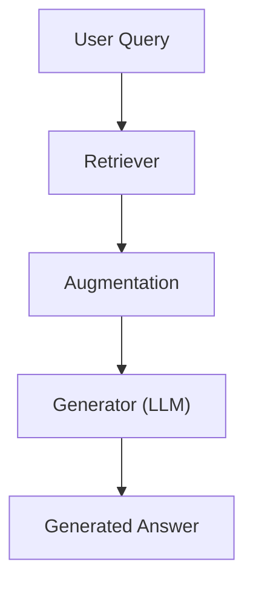
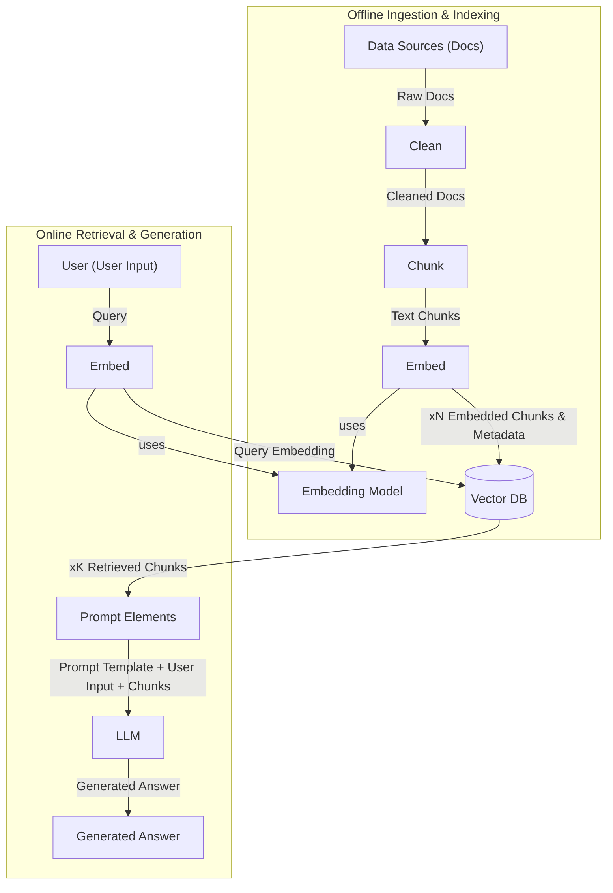
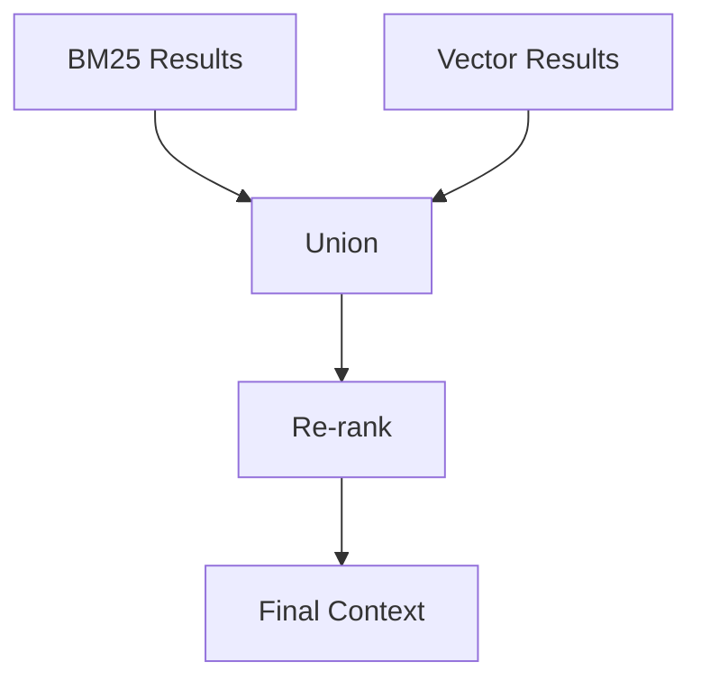
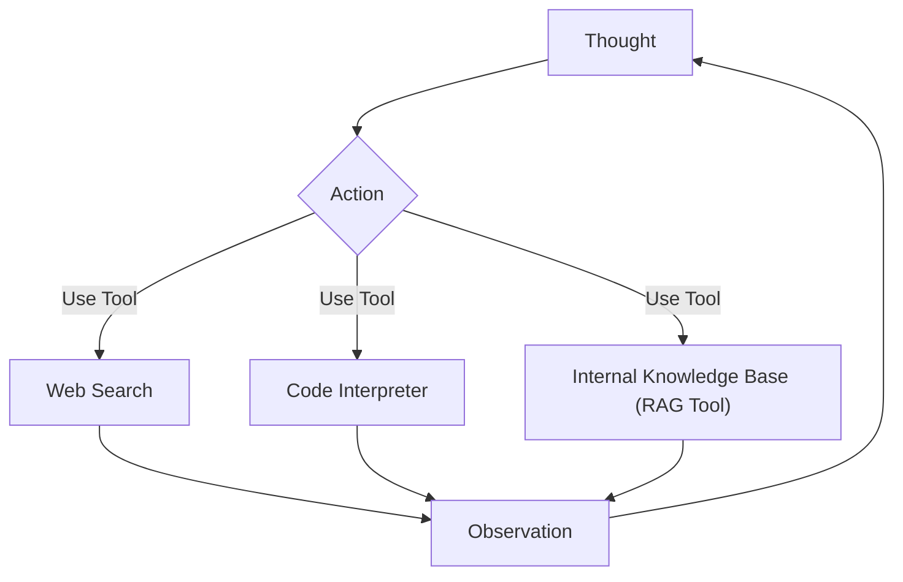

# Lesson 9: Retrieval-Augmented Generation (RAG)

### Giving LLMs an Open-Book Exam

In previous lessons, we explored the AI agent landscape, distinguished between workflows and autonomous agents, and dived into context engineering. We learned that curating the information an LLM receives is crucial for building effective AI applications. Now, we will focus on one of the most powerful techniques in context engineering: Retrieval-Augmented Generation (RAG).

LLMs are trained on fixed datasets, making their knowledge static and prone to hallucinations. During training, they are essentially taking a "closed-book exam" on the world's information. Unlike humans, models cannot yet continuously learn new information over time after their initial training. We can fine-tune them, but this is not as efficient as human learning from experience.

RAG offers a reliable solution to this problem. It allows us to insert new knowledge into the context window of the LLM. With RAG, we give the LLM an "open-book exam" by connecting it to external, real-time knowledge sources. Just like humans use manuals or cheat sheets without memorizing everything, LLMs can use RAG to access specific information when needed. This method is fundamental for building AI agents that are grounded, trustworthy, and knowledgeable. It directly addresses LLM limitations like knowledge cut-offs and hallucinations. For an AI engineer, mastering RAG is not optional. It is a core skill for creating agents that leverage proprietary data, access real-time information, and provide accurate, source-backed answers.

We will contrast retrieval with agent memory in Lesson 10, where we discuss short- and long-term memory stores that complement RAG. This lesson will guide you through the "what" and "how" of basic RAG, then move to advanced and agentic patterns.

With the problem and motivation clear, we will first decompose RAG into its core components so you can see where each responsibility lives.

## The RAG System: Core Components

Understanding the core components of a RAG system is the first step in the context engineering process for designing effective RAG applications. A RAG system fundamentally relies on three conceptual pillars: retrieval, augmentation, and generation [[3]](https://decodingml.substack.com/p/rag-fundamentals-first?utm_source=publication-search), [[11]](https://highlearningrate.substack.com/p/the-rise-of-rag).

The **retrieval** component is the engine for finding relevant information. When a user asks a question, this system searches for data that is most pertinent to the query. This often involves using semantic similarity or keyword-based search methods. At the heart of this process are vector embeddings. These are numerical representations of text, images, or other data, created by an embedding model. These embeddings are then stored in a vector database, allowing for efficient similarity searches. When a query is made, it is also converted into an embedding, and the database finds the closest matching vectors.

The **augmentation** step takes the information found by the retrieval component and prepares it. This process formats the retrieved data to be inserted into the context window of a prompt for the LLM. It ensures that the LLM receives well-organized and relevant context.

Finally, the **generation** component is where the LLM takes over. It uses the augmented input, which now includes the original query and the retrieved context, to produce an answer. This answer is grounded in the provided external data, making it more accurate and reliable than responses based solely on the LLM's internal knowledge.

Image 1: A flowchart illustrating the core components of a RAG system.

This is illustrated in Image 1. The user's query first goes to the retriever. The retriever fetches relevant information, which then moves to the augmentation step. This augmented context is sent to the generator, which is an LLM, to produce the final answer.

Now that you can name each moving part, let’s see how they line up across the two phases of a real system.

## The RAG Pipeline: Ingestion and Retrieval

A RAG workflow is divided into two distinct phases: offline ingestion and indexing, and online retrieval and generation [[2]](https://towardsai.net/p/l/a-complete-guide-to-rag), [[10]](https://learn.microsoft.com/en-us/azure/developer/ai/advanced-retrieval-augmented-generation).

### Phase 1: Offline Ingestion & Indexing

This phase prepares your data for efficient retrieval.

1.  **Load:** Documents are read from various sources, such as PDFs, websites, or APIs [[10]](https://learn.microsoft.com/en-us/azure/developer/ai/advanced-retrieval-augmented-generation). Tools like LangChain document loaders or LlamaIndex readers can handle diverse formats.
2.  **Split:** Large documents are broken down into smaller, meaningful pieces, also known as chunks [[3](https://decodingml.substack.com/p/rag-fundamentals-first?utm_source=publication-search), [26](https://developer.nvidia.com/blog/finding-the-best-chunking-strategy-for-accurate-ai-responses/)]. This is crucial to ensure that chunks do not cut mid-idea and fit within the LLM's context window. Examples include LangChain's `RecursiveCharacterTextSplitter` or LlamaIndex's `SemanticSplitter`.
3.  **Embed:** An embedding model converts each text chunk into a dense vector embedding. These vectors capture the semantic meaning of the chunks. Popular models include OpenAI's `text-embedding-3-large/small`, Google's `gemini-text-embedding-004`, Cohere Embed, or Voyage.
4.  **Store:** The generated embeddings and their corresponding original text chunks are loaded into a vector database or a search index [[3]](https://decodingml.substack.com/p/rag-fundamentals-first?utm_source=publication-search). This allows for fast similarity lookups during the retrieval phase. Examples of stores include FAISS (for local deployments), Milvus, Qdrant, Pinecone, Elasticsearch/OpenSearch (with kNN), or Azure AI Search.

### Phase 2: Online Retrieval & Generation

This phase happens when a user interacts with the system.

1.  **Query:** A user asks a question or provides input. This query can optionally be normalized or expanded to improve retrieval. Tools like a LangChain `Runnable` chain or LlamaIndex `QueryEngine` manage this.
2.  **Embed:** The user's query is transformed into a vector using the *same embedding model* that was used during the ingestion phase. This ensures that the query and document chunks exist in the same vector space.
3.  **Search:** The query vector is used to find the top-k most similar document chunks in the vector database [[3]](https://decodingml.substack.com/p/rag-fundamentals-first?utm_source=publication-search). This is often done using vector similarity search in databases like Elasticsearch/OpenSearch, Pinecone (with metadata filters), or FAISS (using cosine similarity).
4.  **Generate:** A prompt is constructed that includes the user's query, specific instructions for the LLM, and the retrieved document chunks. This augmented prompt is then sent to an LLM to produce a grounded answer [[3]](https://decodingml.substack.com/p/rag-fundamentals-first?utm_source=publication-search). We can use structured outputs, as discussed in Lesson 4, to format the answer and include citations.

Image 2: A detailed flowchart of the end-to-end RAG workflow, split into two main phases: Offline Ingestion & Indexing and Online Retrieval & Generation.

Image 2 provides a detailed overview of this entire process, showing how documents flow from data sources through cleaning, chunking, and embedding to a vector database during offline ingestion. Then, during online retrieval, a user query is embedded, searches the vector database, and the retrieved chunks augment a prompt for the LLM to generate an answer.

With the end-to-end path in place, the next question is quality: what are the advanced techniques to make the retrieval more accurate and useful across messy, real-world data?

## Advanced RAG Techniques

To make RAG systems production-ready, we need to go beyond the basic pipeline and implement advanced techniques that significantly improve retrieval performance [[4]](https://decodingml.substack.com/p/your-rag-is-wrong-heres-how-to-fix?utm_source=publication-search), [[10]](https://learn.microsoft.com/en-us/azure/developer/ai/advanced-retrieval-augmented-generation).

**Hybrid Search** combines keyword-based search with vector search to get the best of both worlds [[31]](https://blog.vectorchord.ai/hybrid-search-with-postgres-native-bm25-and-vectorchord), [[32]](https://www.elastic.co/what-is/hybrid-search). Keyword-based methods, like BM25, are excellent for precision, identifying documents that contain exact terms. Vector search, on the other hand, excels at capturing semantic meaning and understanding paraphrases. For example, if a customer asks, "my bill keeps rolling over," a keyword search finds articles with "rollover." Simultaneously, a meaning-based search surfaces guides on "carryover balance," covering different wordings for the same issue.

**Re-ranking** uses a second model, such as a cross-encoder, to re-order the initial set of retrieved documents [[36]](https://adasci.org/a-hands-on-guide-to-enhance-rag-with-re-ranking/), [[38]](https://sbert.net/examples/sentence_transformer/applications/retrieve_rerank/README.html). This re-ranker takes the user's query and each candidate document, then outputs a relevance score, pushing the most relevant documents to the top. For instance, if a user asks "how to connect my account," the initial retrieval might bring up a press release, a community thread, and a step-by-step setup guide. A re-ranker pushes the step-by-step guide to the top, ensuring the LLM gets the most useful context. While re-rankers improve accuracy, they add computational cost and latency [[39]](https://zilliz.com/learn/optimize-rag-with-rerankers-the-role-and-tradeoffs).

**Query Transformations** help refine the user's initial query for better retrieval.
*   **Decomposition** breaks a complex query into simpler sub-questions. For example, the question "What’s our travel policy for conferences in Europe this year?" can be decomposed into sub-questions like "Where is the policy?", "What counts as a conference?", "What are the Europe rules?", and "What changed this year?". Each sub-question is then used for retrieval, and the results are combined [[19]](https://wandb.ai/site/articles/rag-techniques/).
*   **HyDE (Hypothetical Document Embeddings)** involves generating a short, ideal answer draft using an LLM, embedding this draft, and then using its embedding to search for relevant documents [[16]](https://www.pondhouse-data.com/blog/advanced-rag-hypothetical-document-embeddings), [[17]](https://www.chitika.com/hyde-query-expansion-rag/). For example, before searching, the system might draft an answer like "Employees attending approved conferences in Europe can book economy flights and up to three hotel nights with daily meal limits." It then looks for documents that semantically align with this hypothetical answer.

**Advanced Chunking Strategies** move beyond fixed-size chunks to preserve more context [[26]](https://developer.nvidia.com/blog/finding-the-best-chunking-strategy-for-accurate-ai-responses/), [[28]](https://www.snowflake.com/en/engineering-blog/impact-retrieval-chunking-finance-rag/).
*   **Semantic chunking** splits text at points where meaning changes, ensuring each chunk is thematically unified. For example, splitting a handbook every 500 words might cut a "Reimbursements" section in half, but semantic chunking keeps the entire section together, ensuring all details, like cap amounts, are retrieved together.
*   **Layout-aware chunking** is particularly useful for complex documents like tables and forms. For a pricing table, keeping each row (product, price, discount) as a single chunk is more effective than splitting by character count, which could separate numbers from their labels.
*   **Context-enriched chunking** (also known as contextual retrieval) adds explanatory context to each chunk during ingestion, improving relevance, especially for vague or ambiguous chunks [[6]](https://www.anthropic.com/news/contextual-retrieval).

**GraphRAG** introduces retrieval from knowledge graphs [[5]](https://arxiv.org/html/2404.16130), [[11]](https://www.chitika.com/graph-rag-vs-vector-rag/). This technique excels at answering questions about complex relationships and interconnected entities, which are often lost in standard document chunks [[41]](https://www.zyphra.com/post/understanding-graph-based-rag-and-multi-hop-question-answering), [[44]](https://neo4j.com/blog/genai/knowledge-graph-llm-multi-hop-reasoning/). GraphRAG solves problems where understanding the "how" and "why" between data points is as important as the data itself. For example, a retail query like "Which shoes get the most size-related returns and were featured in last month’s ads?" can be answered by connecting returns to reasons, specific SKUs, and marketing campaigns. Similarly, an IT operations query like "Which incidents were caused by weekend deploys that also touched the login service?" links change records to deploy times, affected services, and incident tickets.

Image 3: A flowchart illustrating the hybrid retrieval flow with parallel BM25 and Vector results converging into a union, re-ranking, and final context.

Image 3 illustrates a hybrid retrieval flow. BM25 results and vector results are processed in parallel, then combined in a union. These combined results are then sent to a re-ranker, which refines the order to produce the final context for the LLM.

These techniques increase retrieval quality. Next, we’ll see how retrieval becomes one tool that an agent can choose to use as it reasons.

## Agentic RAG

In Lessons 7 and 8, we introduced ReAct-style agents and how to build them. Agentic RAG is essentially a ReAct-style agent equipped with a retrieval tool [[7]](https://weaviate.io/blog/what-is-agentic-rag), [[9]](https://www.ibm.com/think/topics/agentic-rag). The agent reasons (Thought), decides on an Action (e.g., retrieve), observes the results, and iterates.

It is important to clarify that agents typically use many tools, such as web search, code execution, or databases. Labeling a whole system "agentic RAG" can be too narrow. The retrieval tool is just one of several capabilities an agent might possess.

The core distinction between standard RAG and agentic RAG is in their workflow [[46]](https://weaviate.io/blog/what-is-agentic-rag), [[49]](https://www.digitalocean.com/community/conceptual-articles/rag-ai-agents-agentic-rag-comparative-analysis). Standard RAG follows a linear, pre-determined workflow: Retrieve -> Augment -> Generate. It is powerful but rigid, with every query following the same path. Agentic RAG, by contrast, is adaptive and iterative [[48]](https://www.eyelevel.ai/post/agentic-rag), [[50]](https://www.k2view.com/blog/react-agent-llm/). The agent decides when to retrieve, how to reformulate the query, which source to search, and whether to chain multiple retrieval and reasoning steps.

An agentic approach offers several capabilities:
*   The agent can **iteratively** use the RAG tool, refining its query based on initial results [[21]](https://arize.com/blog/understanding-agentic-rag). For example, if a first pass yields a vague policy, the agent might narrow the scope ("EU customers, 2024 updates"), retrieve again, and reconcile differences.
*   It can **choose** which part of its knowledge base to search. For an outage inquiry, an agent selects `search_incident_runbooks` over `search_marketing_pages`.
*   It can **fuse** information from the RAG tool with data from other tools, like a web search, to form a comprehensive answer [[22]](https://workativ.com/ai-agent/blog/agentic-rag). For instance, an agent retrieves internal policy, then calls `web_search` to check current regulatory thresholds, then synthesizes the information.
*   It can even decide to **update** the RAG system's knowledge base with new information it learns. An agent may propose writes to a long-term store, a concept we’ll cover in Lesson 10 on Memory for Agents.

This process shifts from viewing RAG as an isolated process to a core tool in an agent's toolkit. In the "thought" step of a ReAct agent, it reasons about when it has a knowledge gap and decides to call its RAG tool [[23]](https://airbyte.com/data-engineering-resources/using-langchain-react-agents).

Image 4: A conceptual flowchart showing an agent's main loop in an Agentic RAG system, highlighting its iterative decision-making process.

Image 4 illustrates an agent's main loop. The agent starts with a "Thought," which leads to an "Action." This action can involve using a tool like "Web Search," a "Code Interpreter," or an "Internal Knowledge Base (RAG Tool)." The outcome of the action is an "Observation," which then feeds back into the agent's "Thought" process, continuing the cycle until the task is complete.

Consider this mini thought process:
*   **Thought:** "User asks about ‘2024 EU data retention rules’—our internal policy cites 2023. This is likely outdated."
*   **Action:** `retrieve(internal_policy, query=“EU data retention 2024”)`
*   **Observation:** "Mentions amendments but missing citations."
*   **Thought:** "Need external verification."
*   **Action:** `web_search(“EU data retention 2024 official”)`
*   **Observation:** "Finds directive update."
*   **Thought:** "Synthesize and cite both; highlight changes from 2023."

This frames agentic RAG as the difference between a simple database lookup and a conversation with a knowledgeable research assistant.

You now understand both a linear RAG pipeline and how an agent can control retrieval when needed. Let’s wrap up by situating RAG in the wider AI Engineering toolkit and previewing what comes next.

## Conclusion

RAG is the most used solution to the LLM knowledge problem. Advanced techniques are important for production-grade quality, and the future of knowledge retrieval is agentic. RAG reduces hallucinations, enables customization with proprietary data, and builds user trust through verifiable, source-based answers.

RAG is not a niche skill but a foundational competency for the modern AI engineer, as a subset of context engineering. In Lesson 10, we will learn about Memory for Agents, focusing on how short- and long-term memory complements retrieval. Later in the course, we will also dive into evaluations for retrieval quality and monitoring in production.

## References

1. NVIDIA. (n.d.). What Is Retrieval-Augmented Generation, aka RAG? [https://blogs.nvidia.com/blog/what-is-retrieval-augmented-generation/](https://blogs.nvidia.com/blog/what-is-retrieval-augmented-generation/)
2. Towards AI. (n.d.). A Complete Guide to RAG. [https://towardsai.net/p/l/a-complete-guide-to-rag](https://towardsai.net/p/l/a-complete-guide-to-rag)
3. Iusztin, P. (n.d.). Retrieval-Augmented Generation (RAG) Fundamentals First. Decoding AI Magazine. [https://decodingml.substack.com/p/rag-fundamentals-first?utm_source=publication-search](https://decodingml.substack.com/p/rag-fundamentals-first?utm_source=publication-search)
4. Iusztin, P. (n.d.). Your RAG is wrong: Here's how to fix it. Decoding AI Magazine. [https://decodingml.substack.com/p/your-rag-is-wrong-heres-how-to-fix?utm_source=publication-search](https://decodingml.substack.com/p/your-rag-is-wrong-heres-how-to-fix?utm_source=publication-search)
5. From Local to Global: A GraphRAG Approach to Query-Focused Summarization. (n.d.). arXiv. [https://arxiv.org/html/2404.16130](https://arxiv.org/html/2404.16130)
6. Anthropic. (n.d.). Introducing Contextual Retrieval. [https://www.anthropic.com/news/contextual-retrieval](https://www.anthropic.com/news/contextual-retrieval)
7. Weaviate. (n.d.). What is Agentic RAG. [https://weaviate.io/blog/what-is-agentic-rag](https://weaviate.io/blog/what-is-agentic-rag)
8. LlamaIndex. (n.d.). RAG is dead, long live agentic retrieval. [https://www.llamaindex.ai/blog/rag-is-dead-long-live-agentic-retrieval](https://www.llamaindex.ai/blog/rag-is-dead-long-live-agentic-retrieval)
9. IBM. (n.d.). What is agentic RAG? [https://www.ibm.com/think/topics/agentic-rag](https://www.ibm.com/think/topics/agentic-rag)
10. Microsoft. (n.d.). Build advanced retrieval-augmented generation systems. [https://learn.microsoft.com/en-us/azure/developer/ai/advanced-retrieval-augmented-generation](https://learn.microsoft.com/en-us/azure/developer/ai/advanced-retrieval-augmented-generation)
11. High Learning Rate. (n.d.). The Rise of RAG. [https://highlearningrate.substack.com/p/the-rise-of-rag](https://highlearningrate.substack.com/p/the-rise-of-rag)
12. Galileo AI. (n.d.). Agentic RAG Integration AI Architecture. [https://galileo.ai/blog/agentic-rag-integration-ai-architecture](https://galileo.ai/blog/agentic-rag-integration-ai-architecture)
13. Arize. (n.d.). Understanding Agentic RAG. [https://arize.com/blog/understanding-agentic-rag/](https://arize.com/blog/understanding-agentic-rag/)
14. Moveworks. (n.d.). What is Agentic RAG. [https://www.moveworks.com/us/en/resources/blog/what-is-agentic-rag](https://www.moveworks.com/us/en/resources/blog/what-is-agentic-rag)
15. RAGIE. (n.d.). The Architect’s Guide to Production RAG. [https://www.ragie.ai/blog/the-architects-guide-to-production-rag-navigating-challenges-and-building-scalable-ai](https://www.ragie.ai/blog/the-architects-guide-to-production-rag-navigating-challenges-and-building-scalable-ai)
16. Pondhouse Data. (n.d.). Advanced RAG: Hypothetical Document Embeddings. [https://www.pondhouse-data.com/blog/advanced-rag-hypothetical-document-embeddings](https://www.pondhouse-data.com/blog/advanced-rag-hypothetical-document-embeddings)
17. Chitika. (n.d.). HyDE Query Expansion RAG. [https://www.chitika.com/hyde-query-expansion-rag/](https://www.chitika.com/hyde-query-expansion-rag/)
18. GOAI. (n.d.). Part 5: Advanced RAG Techniques: LLM-based Query Rewriting and HyDE. [https://blog.gopenai.com/part-5-advanced-rag-techniques-llm-based-query-rewriting-and-hyde-dbcadb2f20d1](https://blog.gopenai.com/part-5-advanced-rag-techniques-llm-based-query-rewriting-and-hyde-dbcadb2f20d1)
19. Weights & Biases. (n.d.). RAG Techniques. [https://wandb.ai/site/articles/rag-techniques/](https://wandb.ai/site/articles/rag-techniques/)
20. LlamaIndex. (n.d.). HyDE Query Transform Demo. [https://docs.llamaindex.ai/en/stable/examples/query_transformations/HyDEQueryTransformDemo/](https://docs.llamaindex.ai/en/stable/examples/query_transformations/HyDEQueryTransformDemo/)
21. Arize. (n.d.). Understanding Agentic RAG. [https://arize.com/blog/understanding-agentic-rag/](https://arize.com/blog/understanding-agentic-rag/)
22. Workativ. (n.d.). Agentic RAG. [https://workativ.com/ai-agent/blog/agentic-rag](https://workativ.com/ai-agent/blog/agentic-rag)
23. Airbyte. (n.d.). Using LangChain ReAct Agents. [https://airbyte.com/data-engineering-resources/using-langchain-react-agents](https://airbyte.com/data-engineering-resources/using-langchain-react-agents)
24. LlamaIndex. (n.d.). ReAct Agent with Query Engine. [https://docs.llamaindex.ai/en/stable/examples/agent/react_agent_with_query_engine/](https://docs.llamaindex.ai/en/stable/examples/agent/react_agent_with_query_engine/)
25. LangSmith. (n.d.). RAG Evaluation Tutorial. [https://docs.smith.langchain.com/evaluation/tutorials/rag](https://docs.smith.langchain.com/evaluation/tutorials/rag)
26. NVIDIA. (n.d.). Finding the Best Chunking Strategy for Accurate AI Responses. [https://developer.nvidia.com/blog/finding-the-best-chunking-strategy-for-accurate-ai-responses/](https://developer.nvidia.com/blog/finding-the-best-chunking-strategy-for-accurate-ai-responses/)
27. Dell Technologies. (n.d.). Chunk Twice, Retrieve Once: RAG Chunking Strategies Optimized for Different Content Types. [https://infohub.delltechnologies.com/es-es/p/chunk-twice-retrieve-once-rag-chunking-strategies-optimized-for-different-content-types/](https://infohub.delltechnologies.com/es-es/p/chunk-twice-retrieve-once-rag-chunking-strategies-optimized-for-different-content-types/)
28. Snowflake. (n.d.). The Impact of Retrieval and Chunking on Finance RAG. [https://www.snowflake.com/en/engineering-blog/impact-retrieval-chunking-finance-rag/](https://www.snowflake.com/en/engineering-blog/impact-retrieval-chunking-finance-rag/)
29. Superteams. (n.d.). A Deep Dive into Chunking Strategy, Chunking Methods, and Precision in RAG Applications. [https://www.superteams.ai/blog/a-deep-dive-into-chunking-strategy-chunking-methods-and-precision-in-rag-applications](https://www.superteams.ai/blog/a-deep-dive-into-chunking-strategy-chunking-methods-and-precision-in-rag-applications)
30. TigerData. (n.d.). Which RAG Chunking and Formatting Strategy is Best? [https://www.tigerdata.com/blog/which-rag-chunking-and-formatting-strategy-is-best](https://www.tigerdata.com/blog/which-rag-chunking-and-formatting-strategy-is-best)
31. VectorChord. (n.d.). Hybrid Search with Postgres Native BM25 and VectorChord. [https://blog.vectorchord.ai/hybrid-search-with-postgres-native-bm25-and-vectorchord](https://blog.vectorchord.ai/hybrid-search-with-postgres-native-bm25-and-vectorchord)
32. Elastic. (n.d.). What is Hybrid Search. [https://www.elastic.co/what-is/hybrid-search](https://www.elastic.co/what-is/hybrid-search)
33. Superlinked. (n.d.). Optimizing RAG with Hybrid Search and Reranking. [https://superlinked.com/vectorhub/articles/optimizing-rag-with-hybrid-search-reranking](https://superlinked.com/vectorhub/articles/optimizing-rag-with-hybrid-search-reranking)
34. Google Cloud. (n.d.). About Hybrid Search. [https://cloud.google.com/vertex-ai/docs/vector-search/about-hybrid-search](https://cloud.google.com/vertex-ai/docs/vector-search/about-hybrid-search)
35. Fuzzy Labs. (n.d.). Improving RAG Performance with Hybrid Search. [https://www.fuzzylabs.ai/blog-post/improving-rag-performance-hybrid-search](https://www.fuzzylabs.ai/blog-post/improving-rag-performance-hybrid-search)
36. Adasci. (n.d.). A Hands-On Guide to Enhance RAG with Re-ranking. [https://adasci.org/a-hands-on-guide-to-enhance-rag-with-re-ranking/](https://adasci.org/a-hands-on-guide-to-enhance-rag-with-re-ranking/)
37. NVIDIA. (n.d.). Enhancing RAG Pipelines with Re-ranking. [https://developer.nvidia.com/blog/enhancing-rag-pipelines-with-re-ranking/](https://developer.nvidia.com/blog/enhancing-rag-pipelines-with-re-ranking/)
38. SBERT.net. (n.d.). Retrieve & Re-rank. [https://sbert.net/examples/sentence_transformer/applications/retrieve_rerank/README.html](https://sbert.net/examples/sentence_transformer/applications/retrieve_rerank/README.html)
39. Zilliz. (n.d.). Optimize RAG with Rerankers: The Role and Tradeoffs. [https://zilliz.com/learn/optimize-rag-with-rerankers-the-role-and-tradeoffs](https://zilliz.com/learn/optimize-rag-with-rerankers-the-role-and-tradeoffs)
40. Pinecone. (n.d.). Rerankers. [https://www.pinecone.io/learn/series/rag/rerankers/](https://www.pinecone.io/learn/series/rag/rerankers/)
41. Zyphra. (n.d.). Understanding Graph-Based RAG and Multi-Hop Question Answering. [https://www.zyphra.com/post/understanding-graph-based-rag-and-multi-hop-question-answering](https://www.zyphra.com/post/understanding-graph-based-rag-and-multi-hop-question-answering)
42. Inference Scaled GraphRAG. (n.d.). arXiv. [https://arxiv.org/html/2506.19967v1](https://arxiv.org/html/2506.19967v1)
43. SG-RAG: Zero-Shot Graph RAG for Multi-Hop Question Answering. (n.d.). ACL Anthology. [https://aclanthology.org/2024.icnlsp-1.45.pdf](https://aclanthology.org/2024.icnlsp-1.45.pdf)
44. Neo4j. (n.d.). Knowledge Graph LLM Multi-Hop Reasoning. [https://neo4j.com/blog/genai/knowledge-graph-llm-multi-hop-reasoning/](https://neo4j.com/blog/genai/knowledge-graph-llm-multi-hop-reasoning/)
45. Inference Scaled GraphRAG. (n.d.). arXiv. [https://arxiv.org/abs/2506.19967](https://arxiv.org/abs/2506.19967)
46. Weaviate. (n.d.). What is Agentic RAG. [https://weaviate.io/blog/what-is-agentic-rag](https://weaviate.io/blog/what-is-agentic-rag)
47. Empathy First Media. (n.d.). Building Multi-Agent RAG Systems: Step-by-Step Implementation Guide. [https://empathyfirstmedia.com/building-multi-agent-rag-systems-step-by-step-implementation-guide/](https://empathyfirstmedia.com/building-multi-agent-rag-systems-step-by-step-implementation-guide/)
48. Eyelevel.ai. (n.d.). Agentic RAG. [https://www.eyelevel.ai/post/agentic-rag](https://www.eyelevel.ai/post/agentic-rag)
49. DigitalOcean. (n.d.). RAG AI Agents: Agentic RAG Comparative Analysis. [https://www.digitalocean.com/community/conceptual-articles/rag-ai-agents-agentic-rag-comparative-analysis](https://www.digitalocean.com/community/conceptual-articles/rag-ai-agents-agentic-rag-comparative-analysis)
50. K2view. (n.d.). ReAct Agent LLM. [https://www.k2view.com/blog/react-agent-llm/](https://www.k2view.com/blog/react-agent-llm/)