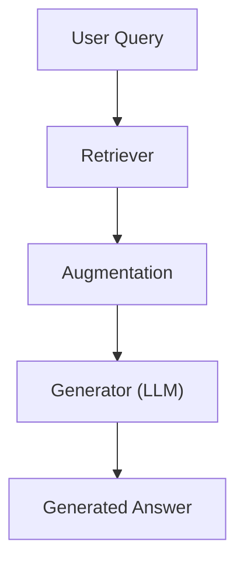
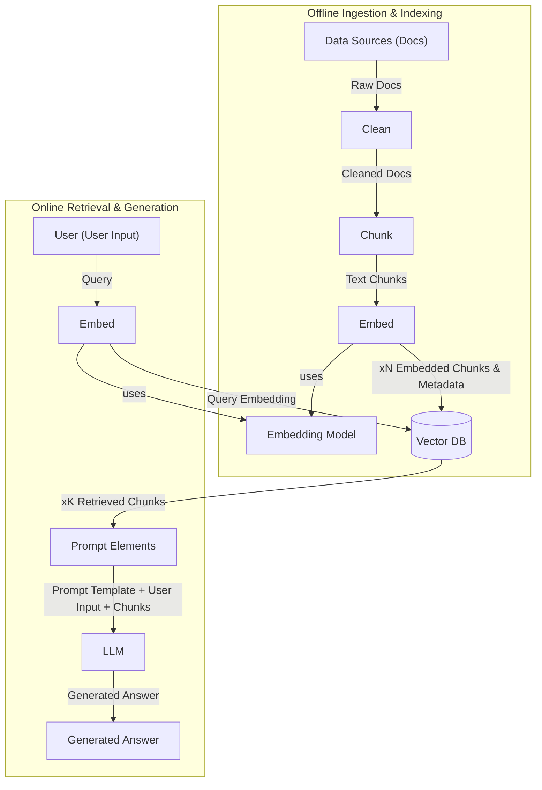
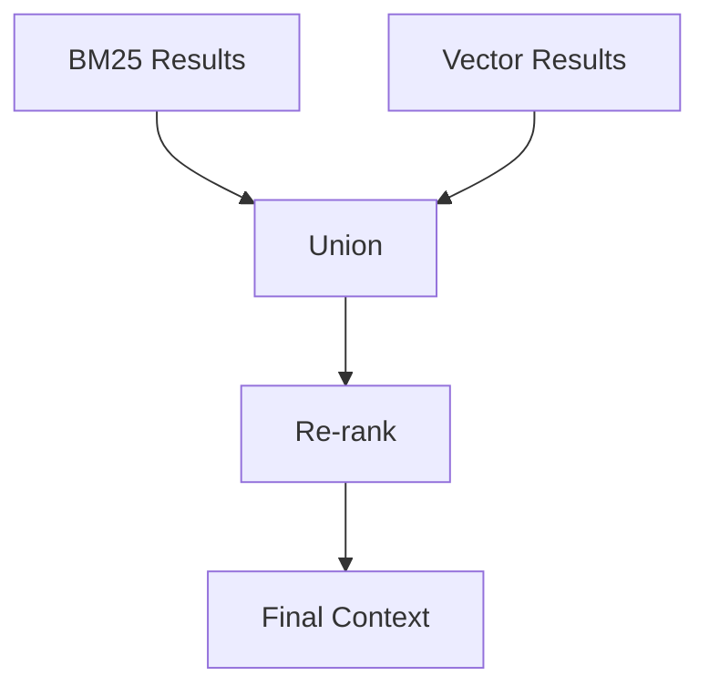
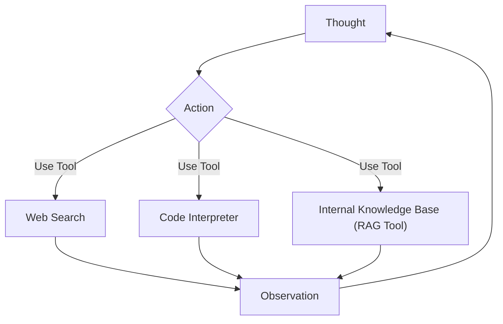

# Lesson 9: Retrieval-Augmented Generation (RAG)

### Giving LLMs an open-book exam

In previous lessons, we explored the AI agent landscape, distinguished between workflows and autonomous agents, and dived into context engineering. We learned that curating the information an LLM receives is important for building effective AI applications. Now, we will focus on one of the most powerful techniques in context engineering: Retrieval-Augmented Generation (RAG).

We once worked on a project where an LLM-powered chatbot kept confidently generating incorrect answers about our internal company policies. The model was trained on public data. This made its knowledge static and prone to hallucinations. Unlike humans, models cannot yet continuously learn new information over time after their initial training. We can fine-tune them, but this is not as efficient as human learning from experience.

RAG offers a reliable solution to this problem. It allows us to insert new knowledge into the context window of the LLM. With RAG, we give the LLM an "open-book exam" by connecting it to external, real-time knowledge sources. Just like humans use manuals or cheat sheets without memorizing everything, LLMs can use RAG to access specific information when needed. This method is fundamental for building AI agents that are grounded, trustworthy, and knowledgeable. It directly addresses LLM limitations like knowledge cut-offs and hallucinations. For an AI engineer, building RAG systems is a core skill for creating agents that use proprietary data, access real-time information, and provide accurate, source-backed answers.

We will contrast retrieval with agent memory in Lesson 10, where we discuss short- and long-term memory stores that complement RAG. This lesson will guide you through:
*   The "what" and "how" of basic RAG.
*   Advanced RAG techniques.
*   Agentic RAG patterns.

With the problem and motivation clear, we will first decompose RAG into its core components so you can see where each responsibility lives.

## The RAG System: Core Components

Understanding the core components of a RAG system is the first step in the context engineering process for designing effective RAG applications. A RAG system fundamentally relies on three conceptual pillars: retrieval, augmentation, and generation [[3]](https://decodingml.substack.com/p/rag-fundamentals-first?utm_source=publication-search), [[10]](https://highlearningrate.substack.com/p/the-rise-of-rag).

The **retrieval** component is the engine for finding relevant information. When a user asks a question, this system searches for data that is most pertinent to the query. This often involves using semantic similarity or keyword-based search methods. At the heart of this process are vector embeddings. These are numerical representations of text, images, or other data. An embedding model creates these representations. These embeddings capture the semantic meaning of the content.

The embeddings are then stored in a vector database. This allows for efficient similarity searches. When a query is made, it is also converted into an embedding. The database then finds the closest matching vectors to the query's embedding.

The **augmentation** step takes the information found by the retrieval component and prepares it. This process formats the retrieved data. It is inserted into the context window of a prompt for the LLM. This ensures that the LLM receives well-organized and relevant context.

Finally, the **generation** component is where the LLM takes over. It uses the augmented input, which now includes the original query and the retrieved context, to produce an answer. This answer is grounded in the provided external data. This makes it more accurate and reliable than responses based solely on the LLM's internal knowledge.

Image 1: A flowchart illustrating the core components of a RAG system.

This is illustrated in Image 1. The user's query first goes to the retriever. The retriever fetches relevant information, which then moves to the augmentation step. This augmented context is sent to the generator, which is an LLM, to produce the final answer.

Now that you can name each moving part, let’s see how they line up across the two phases of a real system.

## The RAG Pipeline: Ingestion and Retrieval

A RAG workflow is divided into its two distinct phases: offline ingestion and indexing, and online retrieval and generation [[2]](https://towardsai.net/p/l/a-complete-guide-to-rag), [[9]](https://learn.microsoft.com/en-us/azure/developer/ai/advanced-retrieval-augmented-generation).

### Phase 1: Offline Ingestion & Indexing

This phase prepares your data for efficient retrieval.

1.  **Load:** Documents are read from various sources, such as PDFs, websites, or APIs. Tools like Unstructured, LangChain document loaders, or LlamaIndex readers can handle diverse formats [[9]](https://learn.microsoft.com/en-us/azure/developer/ai/advanced-retrieval-augmented-generation). This step ensures that all necessary raw data is gathered.
2.  **Split:** Large documents are broken down into smaller, meaningful pieces, also known as chunks. This is important to ensure that chunks do not cut mid-idea. They must also fit within the LLM's context window [[3]](https://decodingml.substack.com/p/rag-fundamentals-first?utm_source=publication-search), [[14]](https://developer.nvidia.com/blog/finding-the-best-chunking-strategy-for-accurate-ai-responses/). Chunking helps in retrieving only the most relevant parts of a document.
3.  **Embed:** An embedding model converts each text chunk into a dense vector embedding. These vectors capture the semantic meaning of the chunks. Popular models include OpenAI's `text-embedding-3-large/small`, Google's `gemini-text-embedding-004`, Cohere Embed, or Voyage. This step transforms raw text into a machine-readable format.
4.  **Store:** The generated embeddings and their corresponding original text chunks are loaded into a vector database or a search index for fast similarity lookups during the retrieval phase [[3]](https://decodingml.substack.com/p/rag-fundamentals-first?utm_source=publication-search). Examples of stores include FAISS (for local deployments), Milvus, Qdrant, Pinecone, Elasticsearch/OpenSearch (with kNN), or Azure AI Search. Metadata, such as the source URL or publication date, is also stored alongside the embeddings.

### Phase 2: Online Retrieval & Generation

This phase happens when a user interacts with the system.

1.  **Query:** A user asks a question or provides input. This query can optionally be normalized or expanded to improve retrieval. Tools like a LangChain `Runnable` chain or LlamaIndex `QueryEngine` manage this. This initial processing helps clarify user intent.
2.  **Embed:** The user's query is transformed into a vector using the *same embedding model* that was used during the ingestion phase. This ensures that the query and document chunks exist in the same vector space. This consistency is vital for accurate similarity comparisons.
3.  **Search:** The query vector is used to find the top-k most similar document chunks in the vector database [[3]](https://decodingml.substack.com/p/rag-fundamentals-first?utm_source=publication-search). This is often done using vector similarity search in databases like Elasticsearch/OpenSearch, Pinecone (with metadata filters), or FAISS (using cosine similarity). The system retrieves the most relevant chunks based on this similarity.
4.  **Generate:** A prompt is constructed that includes the user's query, specific instructions for the LLM, and the retrieved document chunks. This augmented prompt is then sent to an LLM to produce a grounded answer [[3]](https://decodingml.substack.com/p/rag-fundamentals-first?utm_source=publication-search). We can use structured outputs, as discussed in Lesson 4, to format the answer and include citations. This final step synthesizes the information into a coherent response.

Image 2: A detailed flowchart of the end-to-end RAG workflow, split into two main phases: Offline Ingestion & Indexing and Online Retrieval & Generation.

Image 2 provides a detailed overview of this entire process. It shows how documents flow from data sources through cleaning, chunking, and embedding to a vector database during offline ingestion. Then, during online retrieval, a user query is embedded, searches the vector database, and the retrieved chunks augment a prompt for the LLM to generate an answer.

With the end-to-end path in place, the next question is quality: what are the advanced techniques to make the retrieval more accurate and useful across messy, real-world data?

## Advanced RAG Techniques

To make RAG systems production-ready, we need to go beyond the basic pipeline and implement advanced techniques that greatly improve retrieval performance [[4]](https://decodingml.substack.com/p/your-rag-is-wrong-heres-how-to-fix?utm_source=publication-search), [[9]](https://learn.microsoft.com/en-us/azure/developer/ai/advanced-retrieval-augmented-generation).

**Hybrid Search** combines keyword-based search with vector search to get the best of both worlds [[16]](https://blog.vectorchord.ai/hybrid-search-with-postgres-native-bm25-and-vectorchord), [[17]](https://www.elastic.co/what-is/hybrid-search). Keyword-based methods, like BM25, are excellent for precision. They identify documents that contain exact terms. Vector search, on the other hand, excels at capturing semantic meaning and understanding paraphrases. For example, if a customer asks, "my bill keeps rolling over," a keyword search finds articles with "rollover." Simultaneously, a meaning-based search surfaces guides on "carryover balance," covering different wordings for the same issue. This dual approach ensures comprehensive coverage.

**Re-ranking** uses a second model, such as a cross-encoder, to re-order the initial set of retrieved documents [[18]](https://adasci.org/a-hands-on-guide-to-enhance-rag-with-re-ranking/), [[19]](https://sbert.net/examples/sentence_transformer/applications/retrieve_rerank/README.html). This re-ranker takes the user's query and each candidate document. It then outputs a relevance score, pushing the most relevant documents to the top. For instance, if a user asks "how to connect my account," the initial retrieval might bring up a press release, a community thread, and a step-by-step setup guide. A re-ranker pushes the step-by-step guide to the top, ensuring the LLM gets the most useful context. While re-rankers improve accuracy, they add computational cost and latency [[20]](https://zilliz.com/learn/optimize-rag-with-rerankers-the-role-and-tradeoffs).

**Query Transformations** help refine the user's initial query for better retrieval.
*   **Decomposition** breaks a complex query into simpler sub-questions. For example, the question "What’s our travel policy for conferences in Europe this year?" can be decomposed into sub-questions like "Where is the policy?". Other sub-questions include "What counts as a conference?", "What are the Europe rules?", and "What changed this year?". Each sub-question is then used for retrieval. The results are combined [[11]](https://wandb.ai/site/articles/rag-techniques/). This approach ensures that all facets of a complex query are addressed.
*   **HyDE (Hypothetical Document Embeddings)** involves generating a short, ideal answer draft using an LLM. It then embeds this draft. The system then uses its embedding to search for relevant documents [[12]](https://www.pondhouse-data.com/blog/advanced-rag-hypothetical-document-embeddings), [[13]](https://www.chitika.com/hyde-query-expansion-rag/). For example, before searching, the system might draft an answer like "Employees attending approved conferences in Europe can book economy flights and up to three hotel nights with daily meal limits." It then looks for documents that semantically align with this hypothetical answer. This helps bridge the gap between the query and the document content.

**Advanced Chunking Strategies** move beyond fixed-size chunks to preserve more context [[14]](https://developer.nvidia.com/blog/finding-the-best-chunking-strategy-for-accurate-ai-responses/), [[15]](https://www.snowflake.com/en/engineering-blog/impact-retrieval-chunking-finance-rag/).
*   **Semantic chunking** splits text at points where meaning changes. This ensures each chunk is thematically unified. For example, splitting a handbook every 500 words might cut a "Reimbursements" section in half. Semantic chunking keeps the entire section together. This ensures all details, like cap amounts, are retrieved together.
*   **Layout-aware chunking** is particularly useful for complex documents like tables and forms. For a pricing table, keeping each row (product, price, discount) as a single chunk is more effective than splitting by character count. Splitting by character count could separate numbers from their labels.
*   **Context-enriched chunking** (also known as contextual retrieval) adds explanatory context to each chunk during ingestion. This improves relevance, especially for vague or ambiguous chunks [[6]](https://www.anthropic.com/news/contextual-retrieval). This technique helps the embedding model better understand the chunk's content within its broader document.

**GraphRAG** introduces retrieval from knowledge graphs [[5]](https://arxiv.org/html/2404.16130), [[11]](https://highlearningrate.substack.com/p/the-rise-of-rag). This technique excels at answering questions about complex relationships and interconnected entities. These are often lost in standard document chunks [[21]](https://www.zyphra.com/post/understanding-graph-based-rag-and-multi-hop-question-answering), [[22]](https://neo4j.com/blog/genai/knowledge-graph-llm-multi-hop-reasoning/). GraphRAG solves problems where understanding the "how" and "why" between data points is as important as the data itself. For example, a retail query like "Which shoes get the most size-related returns and were featured in last month’s ads?" can be answered by connecting returns to reasons, specific SKUs, and marketing campaigns. Similarly, an IT operations query like "Which incidents were caused by weekend deploys that also touched the login service?" links change records to deploy times, affected services, and incident tickets. This allows for multi-hop reasoning that vector search alone cannot achieve.

Image 3: A flowchart illustrating the hybrid retrieval flow with parallel BM25 and Vector results converging into a union, re-ranking, and final context.

Image 3 illustrates a hybrid retrieval flow. BM25 results and vector results are processed in parallel. They are then combined in a union. These combined results are then sent to a re-ranker, which refines the order to produce the final context for the LLM.

These techniques increase retrieval quality. Next, we’ll see how retrieval becomes one tool that an agent can choose to use as it reasons.

## Agentic RAG

In Lessons 7 and 8, we introduced ReAct-style agents and how to build them. Agentic RAG is essentially a ReAct-style agent equipped with a retrieval tool [[7]](https://weaviate.io/blog/what-is-agentic-rag), [[8]](https://www.ibm.com/think/topics/agentic-rag). The agent reasons (Thought). It then decides on an Action (e.g., retrieve). It observes the results. Finally, it iterates.

It is important to clarify that agents typically use many tools, such as web search, code execution, or databases. Labeling a whole system "agentic RAG" can be too narrow. The retrieval tool is just one of several capabilities an agent might possess.

The core distinction between standard RAG and agentic RAG is in their workflow [[26]](https://www.digitalocean.com/community/conceptual-articles/rag-ai-agents-agentic-rag-comparative-analysis), [[7]](https://weaviate.io/blog/what-is-agentic-rag). Standard RAG follows a linear, pre-determined workflow: Retrieve -> Augment -> Generate. It is powerful but rigid. Every query follows the same path. Agentic RAG, by contrast, is adaptive and iterative [[27]](https://www.eyelevel.ai/post/agentic-rag), [[28]](https://www.k2view.com/blog/react-agent-llm/). The agent decides when to retrieve. It also decides how to reformulate the query, which source to search, and whether to chain multiple retrieval and reasoning steps. This dynamic decision-making allows for greater flexibility.

An agentic approach offers several capabilities:
*   The agent can **iteratively** use the RAG tool, refining its query based on initial results [[23]](https://arize.com/blog/understanding-agentic-rag/). For example, if a first pass yields a vague policy, the agent might narrow the scope ("EU customers, 2024 updates"). It then retrieves again. Finally, it reconciles differences. This iterative refinement leads to more precise answers.
*   It can **choose** which part of its knowledge base to search. For an outage inquiry, an agent selects `search_incident_runbooks` over `search_marketing_pages`. This targeted search improves efficiency.
*   It can **fuse** information from the RAG tool with data from other tools, like a web search, to form a comprehensive answer [[24]](https://workativ.com/ai-agent/blog/agentic-rag). For instance, an agent retrieves internal policy. It then calls `web_search` to check current regulatory thresholds. Finally, it synthesizes the information. This allows for richer, more complete responses.
*   It can even decide to **update** the RAG system's knowledge base with new information it learns. An agent may propose writes to a long-term store. We’ll cover this concept in Lesson 10 on Memory for Agents. This capability enables continuous learning and adaptation.

This process shifts from viewing RAG as an isolated process to a core tool in an agent's toolkit. In the "thought" step of a ReAct agent, it reasons about when it has a knowledge gap. It then decides to call its RAG tool [[25]](https://airbyte.com/data-engineering-resources/using-langchain-react-agents).

Image 4: A conceptual flowchart showing an agent's main loop in an Agentic RAG system, highlighting its iterative decision-making process.

Image 4 illustrates an agent's main loop. The agent starts with a "Thought," which leads to an "Action." This action can involve using a tool like "Web Search," a "Code Interpreter," or an "Internal Knowledge Base (RAG Tool)." The outcome of the action is an "Observation," which then feeds back into the agent's "Thought" process, continuing the cycle until the task is complete.

Consider this mini thought process:
*   **Thought:** "User asks about ‘2024 EU data retention rules’—our internal policy cites 2023. This is likely outdated."
*   **Action:** `retrieve(internal_policy, query=“EU data retention 2024”)`
*   **Observation:** "Mentions amendments but missing citations."
*   **Thought:** "Need external verification."
*   **Action:** `web_search(“EU data retention 2024 official”)`
*   **Observation:** "Finds directive update."
*   **Thought:** "Synthesize and cite both; highlight changes from 2023."

This frames agentic RAG as the difference between a simple database lookup and a conversation with a knowledgeable research assistant.

You now understand both a linear RAG pipeline and how an agent can control retrieval when needed. Let’s wrap up by situating RAG in the wider AI Engineering toolkit and previewing what comes next.

## Conclusion

RAG is the most used solution to the LLM knowledge problem. Advanced techniques are important for production-grade quality. The future of knowledge retrieval is agentic. RAG reduces hallucinations. It enables customization with proprietary data. It also builds user trust through verifiable, source-backed answers.

RAG is not a niche skill but a foundational competency for the modern AI engineer, as a subset of context engineering. In Lesson 10, we will learn about Memory for Agents. We will focus on how short- and long-term memory complements retrieval. Later in the course, we will also dive into evaluations for retrieval quality and monitoring in production.

## References

1. NVIDIA. (n.d.). What Is Retrieval-Augmented Generation, aka RAG? NVIDIA Blog. https://blogs.nvidia.com/blog/what-is-retrieval-augmented-generation/
2. Towards AI. (n.d.). A Complete Guide to RAG. Towards AI. https://towardsai.net/p/l/a-complete-guide-to-rag
3. Iusztin, P. (n.d.). Retrieval-Augmented Generation (RAG) Fundamentals First. Decoding AI Magazine. https://decodingml.substack.com/p/rag-fundamentals-first?utm_source=publication-search
4. Iusztin, P. (n.d.). Your RAG is wrong: Here's how to fix it. Decoding AI Magazine. https://decodingml.substack.com/p/your-rag-is-wrong-heres-how-to-fix?utm_source=publication-search
5. (n.d.). From Local to Global: A GraphRAG Approach to Query-Focused Summarization. arXiv. https://arxiv.org/html/2404.16130
6. Anthropic. (n.d.). Introducing Contextual Retrieval. Anthropic. https://www.anthropic.com/news/contextual-retrieval
7. Weaviate. (n.d.). What is Agentic RAG. Weaviate Blog. https://weaviate.io/blog/what-is-agentic-rag
8. IBM. (n.d.). What is agentic RAG? IBM. https://www.ibm.com/think/topics/agentic-rag
9. Microsoft. (n.d.). Build advanced retrieval-augmented generation systems. Microsoft Learn. https://learn.microsoft.com/en-us/azure/developer/ai/advanced-retrieval-augmented-generation
10. High Learning Rate. (n.d.). The Rise of RAG. High Learning Rate. https://highlearningrate.substack.com/p/the-rise-of-rag
11. Weights & Biases. (n.d.). RAG Techniques. Weights & Biases Blog. https://wandb.ai/site/articles/rag-techniques/
12. Pondhouse Data. (n.d.). Advanced RAG: Hypothetical Document Embeddings. Pondhouse Data Blog. https://www.pondhouse-data.com/blog/advanced-rag-hypothetical-document-embeddings
13. Chitika. (n.d.). HyDE Query Expansion RAG. Chitika Blog. https://www.chitika.com/hyde-query-expansion-rag/
14. NVIDIA Developer Blog. (n.d.). Finding the Best Chunking Strategy for Accurate AI Responses. NVIDIA Developer Blog. https://developer.nvidia.com/blog/finding-the-best-chunking-strategy-for-accurate-ai-responses/
15. Snowflake Engineering Blog. (n.d.). The Impact of Retrieval and Chunking on Finance RAG. Snowflake Engineering Blog. https://www.snowflake.com/en/engineering-blog/impact-retrieval-chunking-finance-rag/
16. VectorChord. (n.d.). Hybrid Search with Postgres Native BM25 and VectorChord. VectorChord Blog. https://blog.vectorchord.ai/hybrid-search-with-postgres-native-bm25-and-vectorchord
17. Elastic. (n.d.). What is Hybrid Search. Elastic Blog. https://www.elastic.co/what-is/hybrid-search
18. Adasci. (n.d.). A Hands-On Guide to Enhance RAG with Re-ranking. Adasci Blog. https://adasci.org/a-hands-on-guide-to-enhance-rag-with-re-ranking/
19. SBERT.net. (n.d.). Retrieve & Re-rank. SBERT.net. https://sbert.net/examples/sentence_transformer/applications/retrieve_rerank/README.html
20. Zilliz. (n.d.). Optimize RAG with Rerankers: The Role and Tradeoffs. Zilliz Blog. https://zilliz.com/learn/optimize-rag-with-rerankers-the-role-and-tradeoffs
21. Zyphra. (n.d.). Understanding Graph-Based RAG and Multi-Hop Question Answering. Zyphra Blog. https://www.zyphra.com/post/understanding-graph-based-rag-and-multi-hop-question-answering
22. Neo4j. (n.d.). Knowledge Graph LLM Multi-Hop Reasoning. Neo4j Blog. https://neo4j.com/blog/genai/knowledge-graph-llm-multi-hop-reasoning/
23. Arize Blog. (n.d.). Understanding Agentic RAG. Arize Blog. https://arize.com/blog/understanding-agentic-rag/
24. Workativ Blog. (n.d.). Agentic RAG. Workativ Blog. https://workativ.com/ai-agent/blog/agentic-rag
25. Airbyte Blog. (n.d.). Using LangChain ReAct Agents. Airbyte Blog. https://airbyte.com/data-engineering-resources/using-langchain-react-agents
26. DigitalOcean Community. (n.d.). RAG AI Agents: Agentic RAG Comparative Analysis. DigitalOcean Community. https://www.digitalocean.com/community/conceptual-articles/rag-ai-agents-agentic-rag-comparative-analysis
27. Eyelevel.ai Blog. (n.d.). Agentic RAG. Eyelevel.ai Blog. https://www.eyelevel.ai/post/agentic-rag
28. K2view Blog. (n.d.). ReAct Agent LLM. K2view Blog. https://www.k2view.com/blog/react-agent-llm/
</article>