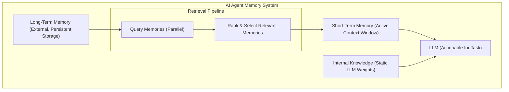
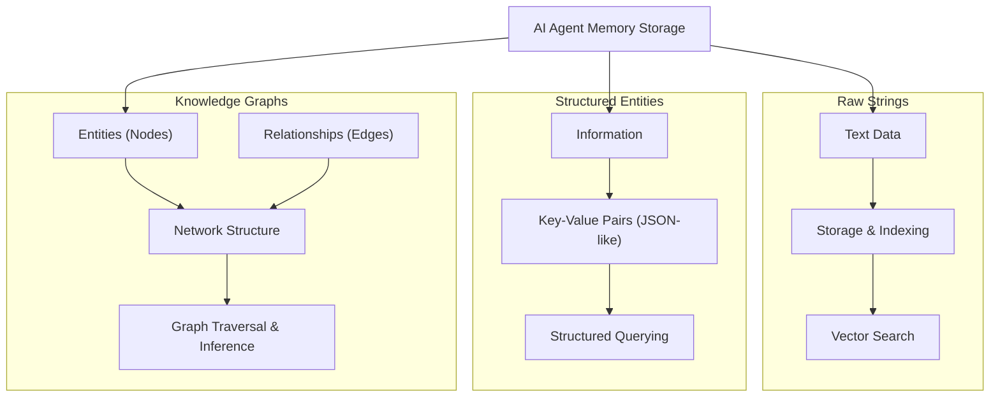

# Lesson 9: Memory for Agents
### How AI agents remember, learn, and adapt from past interactions

In our journey through AI engineering, we have explored fundamental concepts like Context Engineering in Lesson 3, how to get Structured Outputs from LLMs in Lesson 4, and how to give agents the ability to take actions with Tools in Lesson 6. We even built a reasoning agent from scratch in Lesson 8. However, a crucial piece has been missing from our agents: the ability to remember.

LLMs, in their current design, have a fundamental limitation. Their vast knowledge is frozen in time; they cannot learn by updating their weights after deployment. This is a problem known as "continual learning." We can insert new knowledge using the context window, but this is a limited solution. The context window has a finite size, leading to rising costs for more tokens and introducing too much noise if overloaded. There is also the "lost-in-the-middle problem," where models struggle to use relevant information if it sits in the middle of the context window [[73]](https://www.meibel.ai/post/understanding-the-impact-of-increasing-llm-context-windows), [[10]](https://www.factory.ai/news/compressing-context). An LLM without memory is like an intern with amnesia, unable to recall previous conversations or learn new things. It is essentially unable to learn from experience.

Fortunately, context window sizes are increasing over time. This shows we need to continuously adapt how we engineer agentic stateful systems. In a future with bigger context windows, or actual learning, fewer compression or retrieval components will be needed, as they introduce overhead and loss of nuance [[30]](https://www.dhiwise.com/post/the-gemini-context-window-and-its-role-in-ai-precision), [[31]](https://codingscape.com/blog/llms-with-largest-context-windows). Memory tools are a temporary solution that provides agents with continuity, adaptability, and the ability to "learn" today [[mem0-building-production-ready-ai-agents-with-scalable-long-](https://arxiv.org/html/2504.19413)]. Many early agent-building efforts for personal AI companions quickly hit the limits of what was possible with the context window alone. This forced builders to engineer complex memory systems that included many compression and retrieval components [[YouTube Video Transcripts]](https://www.youtube.com/watch?v=7AmhgMAJIT4&list=PLDV8PPvY5K8VlygSJcp3__mhToZMBoiwX&index=112). Working with 8K or 16K token context windows posed a different challenge than now with models that have 1M+ tokens [[34]](https://storage.googleapis.com/deepmind-media/gemini/gemini_v2_5_report.pdf).

Memory is one of the components that transforms a simple stateless chat application into a truly adaptive and personalized agent. For an AI engineer, understanding how to design and build robust memory systems is important. Memory enables the creation of agents that maintain conversational continuity, learn from past interactions, access external and proprietary knowledge, and provide more personalized, capable, and reliable assistance. In this lesson, we will explore the concept of agent memory. We will differentiate between the model's static internal knowledge, short-term (context window) memory, and persistent long-term memory. We will focus on the three types of long-term memory—semantic (facts), episodic (experiences), and procedural (skills)—and their practical implementation. We will detail how agents create and manage memories, particularly episodic ones, and touch upon retrieval mechanisms like RAG. Finally, we will ground these concepts in reality by discussing the challenges, best practices, and the evolution of memory systems with concrete examples.

## The Layers of Memory: Internal, Short-Term, and Long-Term

To understand how agents remember, learn, and adapt, we can borrow terminology from biology and cognitive science. Human memory systems provide a powerful framework for modeling how AI agents process and retain information [[55]](https://connectai.blog/agents-memory), [[56]](https://decodingml.substack.com/p/memory-the-secret-sauce-of-ai-agents). This biological inspiration helps us design more robust and human-like AI systems [[59]](https://arya.ai/blog/why-memory-matters-for-ai-agents-insights-from-nikolay-penkov).

We can categorize an agent's memory into three fundamental layers:

*   **Internal Knowledge:** This is the static, pre-trained knowledge baked into the LLM's weights [[57]](https://langchain-ai.github.io/langgraph/concepts/memory/). It is the vast amount of information the model learned during its training, allowing it to know about entire books without any additional context. Wouldn't it be great if the model could learn from experience and update its weights over time? Unfortunately, this is not yet the case.
*   **Short-Term Memory:** This is the active context window of the LLM [[what-is-ai-agent-memory-ibm](https://www.ibm.com/think/topics/ai-agent-memory)]. It is volatile, fast, but limited in capacity, much like your computer's RAM. It is also the only way we can simulate "learning" over time for current LLMs. This memory holds recent inputs for immediate decision-making, helping the agent maintain coherent dialogue within a single session [[ai-agent-memory-short-long-term-rag-agentic-rag](https://decodingml.substack.com/p/ai-agent-memory-short-long-term-rag-agentic-rag)].
*   **Long-Term Memory:** This is an external, persistent storage system where an agent can save and retrieve information across different sessions [[ai-agent-memory-short-long-term-rag-agentic-rag](https://decodingml.substack.com/p/ai-agent-memory-short-long-term-rag-agentic-rag)]. It provides the continuity and personalization that internal knowledge lacks and short-term memory cannot retain [[36]](https://www.youtube.com/watch?v=W2HVdB4Jbjs).

The dynamic between these layers is crucial. Long-term memories are retrieved and brought into the short-term memory (the context window) to become actionable or provide important information for the LLM during a task [[memory-in-agent-systems-by-aurimas-grici-nas](https://www.newsletter.swirlai.com/p/memory-in-agent-systems)]. This process can be conceptualized as a "retrieval pipeline" where different types of memories are queried in parallel and ranked before being presented to the model.



Image 1: Hierarchy and flow of an AI agent's memory system.

This categorization is useful because no single layer can perform all three functions effectively. Internal knowledge provides general intelligence and basic performance. Short-term memory handles the immediate task. Long-term memory provides the context and personalization that internal knowledge lacks and short-term memory cannot retain.

To better think about long-term memory, we can further borrow from biology and cognitive science to understand how memory works in humans and apply it to agents.

## Long-Term Memory: Semantic, Episodic, and Procedural

This section provides a detailed breakdown of the three key types of long-term memory with their practical roles [[3]](https://www.youtube.com/watch?v=W2HVdB4Jbjs), [[ai-agent-memory-short-long-term-rag-agentic-rag](https://decodingml.substack.com/p/ai-agent-memory-short-long-term-rag-agentic-rag)].

### Semantic Memory (Facts & Knowledge): The Agent's Encyclopedia

Semantic memory is the agent's repository of individual pieces of knowledge. These "facts" can be individual independent strings, such as "The user is a vegetarian," or they can be attached to an "entity," which can be a person, a place, or an object, such as `{"food restrictions": "User is a vegetarian"}`. Semantic memory is where the agent stores extracted concepts and relationships about specific domains, people, places, and things [[11]](https://www.geeksforgeeks.org/artificial-intelligence/ai-agent-memory/), [[55]](https://connectai.blog/agents-memory). What you decide to store and how you decide to structure the memory is highly dependent on the agent's use case. It could even be structured as a graph database. We will come back to the pros and cons of each approach at the end of this section.

The primary role of semantic memory is to provide the agent with a reliable source of truth [[58]](https://www.marktechpost.com/2025/03/30/understanding-ai-agent-memory-building-blocks-for-intelligent-systems/). For an enterprise agent, this might involve storing internal company documents, technical manuals, or an entire product catalog, allowing it to answer questions on proprietary topics. For agents as personal assistants, semantic memory can build a persistent profile of each user. It can recall specific, important information like preferences `{"music": "User likes rock music"}`, relationships `{"dog": "User has a dog named George"}`, or hard constraints `{"food restrictions": "User is allergic to gluten"}`. When using the agent, it can retrieve relevant and potentially important information rather than depending on a noisy and very long conversation history.

### Episodic Memory (Experiences & History): The Agent's Personal Diary

Episodic memory is the agent's personal diary, a record of its past interactions with the user [[65]](https://www.geeksforgeeks.org/artificial-intelligence/episodic-memory-in-ai-agents/). Think of this memory as facts but with a timestamp attached to it, an additional element of time. It is a log of specific events and the context in which they occurred [[66]](https://www.digitalocean.com/community/tutorials/episodic-memory-in-ai). Unlike the timeless facts in semantic memory, episodic memories are about "what happened and when" [[59]](https://arya.ai/blog/why-memory-matters-for-ai-agents-insights-from-nikolay-penkov).

This memory type is useful for maintaining conversational context and potentially understanding something complex like the dynamics of a relationship. For instance, a simple system of facts might extract "User's brother is named Mark" and "User is frustrated with his brother" and save it to semantic memory. A system that captures the element of time might save: "On Tuesday, the user expressed frustration that their brother, Mark, always forgets their birthday. I then provided an empathetic response. [created_at=2025-08-25T17:20:04.648191-07:00]". This "episode" provides deeper, nuanced context, allowing the agent to interact with more empathy and intelligence in the future if the topic of his brother comes up again. For example, "As you expressed last week, I know the topic of your brother's birthday can be sensitive...". With the time element, the agent can also answer questions such as "What happened on June 8th?" Depending on the use case, these episodic memories can group important events, facts, or insights that happened during a whole day, a single conversation, or over the span of a week. There is no one-size-fits-all solution for this; a different time scale might be needed depending on the product.

### Procedural Memory (Skills & How-To): The Agent's Muscle Memory

Procedural memory is the agent's collection of skills and learned workflows [[16]](https://research.aimultiple.com/ai-agent-memory/). It is the "how-to" knowledge that dictates its ability to perform multi-step tasks [[42]](https://decodingml.substack.com/p/memory-the-secret-sauce-of-ai-agents). Think of it as the agent's muscle memory or a set of predefined playbooks for common requests [[57]](https://langchain-ai.github.io/langgraph/concepts/memory/).

This memory is often baked directly into the agent's system prompt as a reusable tool, function, or a defined sequence of actions [[19]](https://decodingml.substack.com/p/memory-the-secret-sauce-of-ai-agents), [[20]](http://www.gocharlie.ai/blog/memory/). For example, an agent might have a stored procedure called `MonthlyReportIntent`. When a user asks for a monthly update, the agent does not need to reason from scratch about how to create a report. Instead, by retrieving from its procedural memory, the procedure can define a clear series of steps: 1) Query the sales database for the last 30 days, 2) Summarize the key findings, and 3) Ask the user if they want the summary emailed or displayed directly. This makes the agent's behavior on common tasks highly reliable, fast, and predictable [[44]](https://arya.ai/blog/why-memory-matters-for-ai-agents-insights-from-nikolay-penkov). By encoding successful (and even unsuccessful) workflows, procedural memory allows an agent to improve its task completion efficiency over time, reducing errors and ensuring that complex jobs are executed consistently every time.

Now that we have an idea of what to save and the benefits of specific types of memories, how should they be saved or stored? What are the three approaches we can experiment with?

## Storing Memories: Pros and Cons of Different Approaches

How an agent's memories are stored is an important architectural decision that directly impacts its performance, complexity, and ability to scale the product. While the goal is always to provide the right context at the right time, the method of storage involves trade-offs. There is no one-size-fits-all solution; the ideal approach depends entirely on the product's use case. Let us explore the pros and cons of the three primary methods we are experimenting with as AI engineers: storing memories as raw strings, as structured entities (like JSON), and within a knowledge graph.



Image 2: A diagram visualizing the three primary methods for storing AI agent memories: raw strings, structured entities, and knowledge graphs.

1.  **Storing memories as raw strings:** This is the simplest method, where conversational turns or documents are stored as plain text and typically indexed for vector search [[11]](https://www.geeksforgeeks.org/artificial-intelligence/ai-agent-memory/).
    *   **Pros:** This method is the easiest to set up. It involves logging text and creating embeddings, requiring minimal engineering overhead to get started. By storing the raw text, the full context, including emotional tone and subtle linguistic cues, is preserved. Nothing is lost in translation to a structured format [[14]](https://diamantai.substack.com/p/memory-optimization-strategies-in).
    *   **Cons:** Relying solely on semantic similarity is often not enough. A query can retrieve text that is semantically related but contextually wrong [[25]](https://writer.com/engineering/vector-database-vs-graph-database/). For example, asking "What is my brother's job?" might retrieve every past conversation where "brother" and "job" were mentioned, without being able to pinpoint the single correct fact. If a user corrects a piece of information ("My brother is no longer a lawyer, he's a doctor now"), you cannot simply update the old fact. The new information is just another string in a growing log, creating potential contradictions. This approach struggles with temporal reasoning and state changes. It cannot easily distinguish between "Barry *was* the CEO" and "Claude *is* the CEO" because the relationship is not explicitly defined; the memory lacks the element of time [[13]](https://www.arxiv.org/pdf/2506.06326).

2.  **Storing Memories as Entities (JSON-like Structures):** In this approach, we go from unstructured, messy interactions to structured memories, using an LLM to do so and storing them in a format like JSON [[12]](https://dev.to/foxgem/ai-agent-memory-a-comparative-analysis-of-langgraph-crewai-and-autogen-31dp).
    *   **Pros:** Information is organized into key-value pairs (`"user": {"brother": {"job": "Software Engineer"}}`), which allows for precise, field-level filtering. This structure makes it easy to retrieve specific facts without ambiguity. By filtering for "brother," the agent can retrieve everything related to the brother, including his job, name, age, etc. If a user's preference changes, only the relevant field in the JSON object needs to be updated, ensuring the memory remains up to date [[4]](https://techcommunity.microsoft.com/blog/azure-ai-foundry-blog/memory-management-for-ai-agents/4406359). This method is perfectly suited for semantic memory, where user profiles, preferences, and key relationships are stored as facts, characteristics, or preferences.
    *   **Cons:** This approach requires designing a schema or data model. Deciding what information to extract and how to structure it adds an initial layer of engineering complexity. A predefined schema can be inflexible. If the agent encounters information that does not fit the existing structure, that data may be lost unless the schema is updated, which can be a complicated process [[28]](https://www.useparagon.com/blog/vector-database-vs-knowledge-graphs-for-rag). We can let an LLM dynamically add new entities, new fields, or change the structure of the schema, but then updating the memories is more complex, with an increased risk of saving duplicated information. The extraction process, by its nature, strips away the rich subtext of the original conversation. The factual memory `"user_likes": ["cats"]` is far less representative than the original message, "Petting my cat is the best part of my day."

3.  **Storing Memories in a Graph Database:** This is the most advanced approach, where memories are stored as a network of nodes (entities) and edges (relationships), forming a knowledge graph [[22]](https://arxiv.org/pdf/2504.19413), [[29]](https://www.elastic.co/blog/vector-database-vs-graph-database).
    *   **Pros:** This is the core strength of a graph. It excels at explicitly defining how different pieces of information are connected. For instance, it can map `(User) -> [HAS_BROTHER] -> (Mark) -> [WORKS_AS] -> (Software Engineer)`. This enables sophisticated queries that trace these connections [[25]](https://writer.com/engineering/vector-database-vs-graph-database). Knowledge graphs can model context and time as explicit properties of a relationship (e.g., `User -[RECOMMENDED_ON_DATE: "2025-10-25"]-> Restaurant`). This is a more accurate and grounded retrieval than vector search alone [[26]](https://neo4j.com/blog/genai/knowledge-graph-vs-vectordb-for-retrieval-augmented-generation/). Retrieval is transparent. You can trace the exact path of nodes and edges that led to an answer, making it easier to debug the agent's reasoning and build trust in its outputs [[memex-2-0-memory-the-missing-piece-for-real-intelligence](https://danielp1.substack.com/p/memex-20-memory-the-missing-piece)].
    *   **Cons:** This method requires a higher upfront investment in schema design, data modeling, and ongoing maintenance. The process of converting unstructured interactions into structured graph triples is a more complex task than just storing strings [[27]](https://www.falkordb.com/blog/knowledge-graph-vs-vector-database/). While powerful, graph traversals for complex queries can be slower than a simple vector lookup, which might impact real-time performance if not carefully optimized. For many applications, the complexity of implementing and maintaining a graph database is overkill. A simpler entity-based or even string-based approach may be more than sufficient [[28]](https://www.useparagon.com/blog/vector-database-vs-knowledge-graphs-for-rag).

The choice of memory storage should be guided by your product's core needs. Start with the simplest architecture that delivers value and evolve it as the demands on your agent grow more complex.

Now that we know what to save and how to store the memories, let's provide some code examples, using available "memory" tools, like `mem0`.

## Memory implementations with code examples

This section goes into more detail, with code, using the `mem0` library, on how to implement the different types of memories. While Retrieval-Augmented Generation (RAG) is the mechanism for retrieving information, the creation of high-quality memories is an equally important, preceding step. RAG is a method that will be covered in Lesson 10. Before the retrieval phase, an agent must first form the memory. This process of creation and retrieval is distinct for each memory type, and, of course, use case. To focus on the benefits of each "category" of memory, and not on the type of storage architecture, we will use the simplistic "storing memories as raw strings" approach.

### What is `mem0`?

`mem0` is an open-source memory framework designed for production-ready AI agents with scalable long-term memory [[22]](https://arxiv.org/pdf/2504.19413). It dynamically extracts, consolidates, and retrieves information from conversations, enabling efficient and context-aware agent behavior. We will use `mem0` to implement the different types of memories discussed.

<aside>
💡 You can find the code of this lesson in the notebook of Lesson 9, in the GitHub repository of the course.
</aside>

1.  We begin by configuring `mem0` to use Google's Gemini models for both LLM calls and embeddings. We also set up ChromaDB as an in-memory vector store for local execution.
    ```python
    import os
    import re
    from typing import Optional

    from google import genai
    from mem0 import Memory
    from lessons.utils import env

    env.load(required_env_vars=["GOOGLE_API_KEY"])

    client = genai.Client()
    MODEL_ID = "gemini-2.5-flash"

    MEM0_CONFIG = {
        "embedder": {
            "provider": "gemini",
            "config": {
                "model": "text-embedding-004",
                "embedding_dims": 768,
                "api_key": os.getenv("GOOGLE_API_KEY"),
            },
        },
        "vector_store": {
            "provider": "chroma",
            "config": {
                "collection_name": "lesson9_memories",
            },
        },
        "llm": {
            "provider": "gemini",
            "config": {
                "model": MODEL_ID,
                "api_key": os.getenv("GOOGLE_API_KEY"),
            },
        },
    }

    memory = Memory.from_config(MEM0_CONFIG)
    MEM_USER_ID = "lesson9_notebook_student"
    memory.delete_all(user_id=MEM_USER_ID)
    print("✅ Mem0 ready (Gemini embeddings + in-memory Chroma).")
    ```
    It outputs:
    ```text
    ✅ Mem0 ready (Gemini embeddings + in-memory Chroma).
    ```

2.  Next, we define helper functions to add and search for memories. `mem_add_text` stores raw strings, while `mem_add_conversation` uses the LLM to summarize a conversation into an episode. `mem_search` allows us to query memories, optionally filtering by category.
    ```python
    def mem_add_text(text: str, category: str = "semantic", **meta) -> str:
        """Add a single text memory. No LLM is used for extraction or summarization."""
        metadata = {"category": category}
        for k, v in meta.items():
            if isinstance(v, (str, int, float, bool)) or v is None:
                metadata[k] = v
            else:
                metadata[k] = str(v)
        memory.add(text, user_id=MEM_USER_ID, metadata=metadata, infer=False)
        return f"Saved {category} memory."


    def mem_add_conversation(messages: list[dict], category: str = "episodic", **meta) -> str:
        """Add a conversation (list of {role, content}) as one episode."""
        metadata = {"category": category}
        for k, v in meta.items():
            metadata[k] = v if isinstance(v, (str, int, float, bool)) or v is None else str(v)
        memory.add(messages, user_id=MEM_USER_ID, metadata=metadata, infer=True)
        return f"Saved {category} episode."


    def mem_search(query: str, limit: int = 5, category: Optional[str] = None) -> list[dict]:
        """
        Category-aware search wrapper.
        Returns the full result dicts so we can inspect metadata.
        """
        res = memory.search(query, user_id=MEM_USER_ID, limit=limit) or {}
        items = res.get("results", [])
        if category is not None:
            items = [r for r in items if (r.get("metadata") or {}).get("category") == category]
        return items
    ```

### Semantic Memory: Extracting Facts

Semantic memory is created through a deliberate **extraction pipeline**. After a conversation (or after a single turn), the unstructured text is either saved as a raw string or passed to an LLM with a specific prompt designed to extract flat strings of factual data. This process turns messy conversation threads into a queryable knowledge base. The prompt used for creation instructs the model to act as a knowledge extractor, identifying facts, user preferences, user attributes, or user relationships—anything important for the agent's use case. If it is a personal assistant, we might not want to extract the same things as a tutoring agent.

*   **Example Extraction Prompt (For a general personal assistant):**
    ```
    Extract persistent facts and strong preferences as short bullet points.
    - Keep each fact atomic and context-independent. While reading the messages, make sure to notice the nuance or subtle details that might be important when saving these facts.
    - 3–6 bullets max.

    Text:
    {My brother Mark is a software engineer, but his real passion is painting; he gifted me a painting a few years ago. It's really beautiful.}
    ```
*   **Memory Created:** The system would store: `Mark is the user's brother. Mark is a software engineer. Mark's real passion is painting. The user has a painting from Mark and finds it beautiful.`

Retrieval of semantic memory is where **hybrid search** is useful. Hybrid search combines the best of keyword search and semantic relevance. First, the system filters the memory store based on exact matches for known entities or tags. If the query is "What's my brother's job?", it first narrows the search to all memories that contain "brother." Within that pre-filtered set, a vector search is performed to find the most contextually relevant fact. The query "job" will have high semantic similarity to the stored memory `is a software engineer`, ensuring a relevant answer is retrieved.

1.  Let's add some semantic memories about user preferences and relationships.
    ```python
    facts: list[str] = [
        "User prefers vegetarian meals.",
        "User has a dog named George.",
        "User is allergic to gluten.",
        "User's brother is named Mark and is a software engineer.",
    ]
    for f in facts:
        print(mem_add_text(f, category="semantic"))
    ```
    It outputs:
    ```text
    Saved semantic memory.
    Saved semantic memory.
    Saved semantic memory.
    Saved semantic memory.
    ```

2.  Then, we search for a specific fact about the user's brother's job.
    ```python
    print("\nSearch --> 'brother job':")
    print("\n".join(f"- {m['memory']}" for m in mem_search("brother job", limit=3, category="semantic")))
    ```
    It outputs:
    ```text
    Search --> 'brother job':
    - User's brother is named Mark and is a software engineer.
    - User has a dog named George.
    - User prefers vegetarian meals.
    ```
    The search correctly identifies the relevant fact about the user's brother being a software engineer, along with other semantically similar memories.

### Episodic Memory: The Log of Events

Episodic memory functions as a chronological log of extracted events. These can be created by having an LLM read conversation messages for a whole day, and then extract or summarize the insights, facts, or events that happened. The memories will have a timestamp. These memories can be stored "raw" or summarized. If stored "raw," no extraction prompt is needed; the creation process is simply logging the raw conversation text. The memory is the event itself. But if we want, these memories can be extracted with an LLM. The prompt might be: "You are a personal coding tutor for a user. You will extract events, likes, dislikes, or any other insights from the conversation text that will serve to better teach the user and help them improve their skills in coding. Make sure to capture the nuance and details of the conversation, and not just the facts."

*   **Example Input:** `User: "I'm feeling stressed about my project deadline on Friday.", Assistant: "I'm sorry to hear that. I'm here to help you with that."`
*   **Memory Created (raw):** `October 26th, 2025. 2:30PM EST: User: "I'm feeling stressed about my project deadline on Friday." Assistant: "I'm sorry to hear that. I'm here to help you with that."`
*   **Memory Created (summarized):** `October 26th, 2025. 2:30PM EST User: "The user is stressed about their project deadline on Friday and the assistant offers to help."`

Retrieval from episodic memory is often a blend of temporal and semantic queries. The simplest retrieval is filtering by a date range (e.g., "What did we talk about yesterday?"). A more robust approach uses semantic search to find conversations that are contextually similar to the current query, and then re-ranks the results based on recency. For example, if a user asks, "What was that thing I was worried about earlier?", the system would search for past messages with a "worried" or "stressed" sentiment and prioritize the most recent ones.

1.  We create a short dialogue between a user and an assistant.
    ```python
    dialogue = [
        {"role": "user", "content": "I'm stressed about my project deadline on Friday."},
        {"role": "assistant", "content": "I’m here to help—what’s the blocker?"},
        {"role": "user", "content": "Mainly testing. I also prefer working at night."},
        {"role": "assistant", "content": "Okay, we can split testing into two sessions."},
    ]
    ```

2.  We then use the LLM to summarize this dialogue into a concise episodic memory.
    ```python
    episodic_prompt = f"""Summarize the following 3–4 turns as one concise 'episode' (1–2 sentences).
    Keep salient details and tone.

    {dialogue}
    """
    summary_resp = client.models.generate_content(model=MODEL_ID, contents=episodic_prompt)
    episode = summary_resp.text.strip()

    print(
        mem_add_text(
            episode,
            category="episodic",
            summarized=True,
            turns=4,
        )
    )
    ```
    It outputs:
    ```text
    Saved episodic memory.
    ```

3.  Finally, we search for memories related to "deadline stress" and print the results with their creation timestamps.
    ```python
    print("\nSearch --> 'deadline stress'")
    hits = mem_search("deadline stress", limit=3, category="episodic")
    for h in hits:
        print(f"- [created_at={h.get('created_at')}] {h['memory']}")
    ```
    It outputs:
    ```text
    Search --> 'deadline stress'
    - [created_at=2025-08-25T17:26:28.260452-07:00] Stressed about a looming Friday project deadline, the user identified testing as their main blocker and noted a preference for working at night. The assistant offered support by proposing they split the testing into two sessions.
    ```
    This demonstrates how `mem0` compresses a conversation into a durable "episode" that can be retrieved later, complete with its historical context.

### Procedural Memory: Defining and Learning Skills

Procedural memory is unique in that it can be created in two distinct ways:

1.  **Developer-Defined:** A developer explicitly codes a tool or function (e.g., `book_flight()`) that can get triggered during a conversation. If the user is trying to book a flight, the agent can use the `book_flight` procedure to do so.
2.  **User-Taught / Learned:** More advanced agents can learn new procedures dynamically from user interactions [[40]](https://langchain-ai.github.io/langgraph/concepts/memory/)[[41]](https://www.youtube.com/watch?v=WW-v5mO2P7w). When a user provides explicit steps for a task, the agent can "save" this sequence as a new, callable procedure in the future.

*   **Example Prompt:**
    ```
    You are an agent that can learn new skills. When a user provides a numbered list of steps to accomplish a goal, your task is to run the "learn_procedure" tool, and convert these numbered list of steps into a reusable procedure. Identify the core actions and any variable parameters (e.g., dates, locations, names).

    Examples:
    User Input: "I want you to book a cabin for this summer. To do that, please remember to: 1. Search for cabins on CabinRentals.com my favorite website. 2. Filter for locations in the mountains, the closer to them, the better. 3. Make sure it's available around July. 4 to 8th. 5. Send me the top 3 options."

    learn_procedure(name="find_summer_cabin", steps=first search for cabins on CabinRentals.com, then filter for locations in the mountains, check for distance to the mountains, then check availability around what the user wants, if the user hasn't specified a date, ask the user for a date, once you have a list of options, send the top 3 options)
    ```
*   **Memory Created:** The LLM would generate a new structured procedure and save it to its tool/procedures library: `procedure_name: find_summer_cabin`, `steps=first search for cabins on CabinRentals.com, then filter for locations in the mountains, check for distance to the mountains, then check availability around what the user wants, if the user hasn't specified a date, ask the user for a date, once you have a list of options, send the top 3 options`.

Retrieval is an **intent-matching and function-calling** process. The agent is given access to its entire library of procedures—both built-in and user-taught. The LLM receives the descriptions of all available tools in its context. It compares the user's current request against the descriptions of all procedures. If the user later says, "Let's find a summer cabin again," the agent will recognize the semantic similarity to its newly learned `find_summer_cabin` procedure and execute it, demonstrating a form of learning and adaptation.

1.  We define helper functions to `learn_procedure`, `find_procedure`, and `run_procedure`. `learn_procedure` stores the steps as a text block, `find_procedure` retrieves it, and `run_procedure` simulates execution by parsing the steps.
    ```python
    def learn_procedure(name: str, steps: list[str]) -> str:
        body = "Procedure: " + name + "\nSteps:\n" + "\n".join(f"{i + 1}. {s}" for i, s in enumerate(steps))
        return mem_add_text(body, category="procedure", procedure_name=name)


    def find_procedure(name: str) -> dict | None:
        # search broadly but only keep category=procedure
        hits = mem_search(name, limit=10, category="procedure")
        # Prefer an exact name match if available
        for h in hits:
            if (h.get("metadata") or {}).get("procedure_name") == name:
                return h
        return hits[0] if hits else None


    def run_procedure(name: str) -> str:
        p = find_procedure(name)
        if not p:
            return f"Procedure '{name}' not found."
        text = p.get("memory", "")
        steps = [m.group(1).strip() for m in re.finditer(r"^\s*\d+\.\s+(.*)$", text, flags=re.MULTILINE)]
        if not steps:
            return f"Procedure '{name}' has no parseable steps.\n\n{text}"
        lines = [f"→ {s}" for s in steps]
        return f"Running procedure '{name}':\n" + "\n".join(lines)
    ```

2.  We teach the agent a small, recurrent skill: generating a monthly report.
    ```python
    print(
        learn_procedure(
            "monthly_report",
            [
                "Query sales DB for the last 30 days.",
                "Summarize top 5 insights.",
                "Ask user whether to email or display.",
            ],
        )
    )
    ```
    It outputs:
    ```text
    Saved procedure memory.
    ```

3.  We retrieve and "run" the `monthly_report` procedure.
    ```python
    print("\nRetrieve and 'run' it:")
    proc = find_procedure("monthly_report")
    print(proc or "Not found.")
    ```
    It outputs:
    ```text
    Retrieve and 'run' it:
    {'id': 'ab0940fe-c9a4-446f-b3ff-cbaea099faee', 'memory': 'Procedure: monthly_report\nSteps:\n1. Query sales DB for the last 30 days.\n2. Summarize top 5 insights.\n3. Ask user whether to email or display.', 'hash': 'e66b82a0dcc57034cfa0a54084a643b5', 'metadata': {'procedure_name': 'monthly_report', 'category': 'procedure'}, 'score': 0.9708564281463623, 'created_at': '2025-08-25T17:26:28.965650-07:00', 'updated_at': None, 'user_id': 'lesson9_notebook_student', 'role': 'user'}
    ```
    This demonstrates how agents can learn reusable playbooks and trigger them later by name.

We have seen how to implement the different types of memories with `mem0`. Now let us talk about some additional considerations when building a memory system.

## Real-World Lessons: Challenges and Best Practices

The architectural patterns described in the previous section provide a useful toolkit for building agents with memory. However, moving from theory to a reliable, production-ready system requires navigating a series of complex trade-offs that are constantly evolving with the underlying technology improving so fast.

Here are some of the most important lessons learned from building and scaling agent memory systems in the real world.

1.  **Re-evaluating compression:** One of the biggest changes while designing memory has been the trade-off between compressing information and preserving its raw detail.
    *   **The Old Challenge:** Just two years ago, LLMs operated with small and expensive context windows (e.g., 8,000 or 16,000 tokens). This constraint forced us, AI engineers, to be ruthless with compression. The primary goal was to distill every interaction into its most compact form—summaries, facts, or entities—to fit the relevant information into the context window [[71]](https://blog.capitaltg.com/overcoming-memory-limitations-in-generative-ai-managing-context-windows-effectively/). While necessary, this process is inherently lossy. By summarizing, you keep the general idea but lose fine details and nuance, which might be important for a personalized agent [[8]](https://supermemory.ai/blog/extending-context-windows-in-llms/).
    *   **The New Reality:** Today, with models like the ones from the Gemini 2.5 family offering million-token context windows at a fraction of the cost, the considerations have changed [[32]](https://ai.google.dev/gemini-api/docs/long-context). The best practice is now to lean towards less compression [[30]](https://www.dhiwise.com/post/the-gemini-context-window-and-its-role-in-ai-precision). The raw, unstructured conversational history is the ultimate source of truth. It contains the emotional subtext, subtle hesitations, and relational dynamics that are often dismissed during extraction. While a fact might state, "User has a dog named George, user likes to walk their dog," the episodic log reveals, "User mentioned that walking their dog named George is the best part of their day," a far more valuable piece of information for a personalized agent.
    *   **Best Practice:** Design your system to work with the most complete version of history that is economically and technically feasible. Use summarization and fact extraction as tools for creating queryable indexes, but always treat the raw log as the ground truth [[70]](https://nebius.com/blog/posts/context-window-in-ai). As LLMs get larger context windows, your retrieval pipeline may need to do less *retrieving* and more intelligent *filtering* of a larger, in-context history [[72]](https://www.emerge.haus/blog/long-context-windows-in-generative-ai).

2.  **Designing for the Product:** There is no such thing as a "perfect" memory architecture. The concepts of semantic, episodic, and procedural memory are a powerful mental model, but they are a toolkit, not a mandatory blueprint. The most common failure mode is over-engineering a complex, multi-part memory system for a product that does not need it [[37]](https://www.lindy.ai/blog/ai-agent-architecture).
    *   **The Challenge:** It can be tempting to build a system that handles these memory types from day one. However, this often leads to unnecessary complexity, higher maintenance costs, and slower performance.
    *   **The Best Practice:** Start from first principles by defining the core function of your agent. The product's goal should dictate the memory architecture, not the other way around [[35]](https://www.speakeasy.com/mcp/ai-agents/architecture-patterns).
        *   For a Q&A bot over internal documents, a simple RAG pipeline is the best starting point. Your focus should be on building a robust, factually accurate knowledge base. We will cover RAG in Lesson 10.
        *   For a long-term personal AI companion, rich memories that include an element of time can be beneficial [[36]](https://www.youtube.com/watch?v=W2HVdB4Jbjs). The agent's value comes from its ability to remember the narrative of your relationship. Simple semantic facts are useful, but in this use case, they cannot fully represent the dynamic elements of a person's life and thus reduce the agent's ability to provide good help.
        *   For a task-automation agent, something like procedural memories is likely useful [[39]](https://langchain-ai.github.io/langgraph/concepts/agentic_concepts/). The agent can recall and execute multi-step workflows.

3.  **The Human Factor: Avoiding user cognitive overhead:** Memory exists to make the agent smarter, not to give the user a new job. A common pitfall is exposing all the internal workings of the memory system to the user, thinking it will improve transparency and accuracy. In practice, it often does the opposite [[2]](https://www.letta.com/blog/agent-memory).
    *   **The Challenge:** Most memory implementations are designed where users can view, edit, or delete the facts the agent had stored about them. While well-intentioned, this can create significant cognitive overhead [[4]](https://techcommunity.microsoft.com/blog/azure-ai-foundry-blog/memory-management-for-ai-agents/4406359).
    *   **The Best Practice:** Users should not be asked to "garden their agent's memories." This breaks the illusion of a capable assistant and turns the interaction into a tedious data-entry task [[49]](https://dev.to/bredmond1019/building-intelligent-ai-agents-with-memory-a-complete-guide-5gnk). A user's mental model is that they are talking to a single entity; they do not want to switch to being a database administrator. Memory management should be an autonomous function of the agent [[45]](https://arxiv.org/html/2506.06326). It should learn from corrections within the natural flow of conversation (e.g., "Actually, my brother's name is Mark, not Mike"). Design internal processes for the agent to periodically review, consolidate, and resolve conflicting information in its memory stores [[54]](https://www.vincirufus.com/posts/memory-based-agent-learning/). The agent, not the user, is responsible for maintaining the integrity of its own knowledge.

## Conclusion

Memory sits at the core of AI agents, making them personalized and enabling them to "learn" over time. While memory tools provide a temporary solution for true "continual learning," they are effective for current AI systems. Understanding these memory types and their implementation is crucial for building capable and reliable agents.

In Lesson 10, we will dive deep into Retrieval-Augmented Generation (RAG), a key mechanism for retrieving information from these memory systems. In future lessons, we will explore multimodal processing for documents, images, and complex data. We will also delve into advanced concepts like Multi-Agent Collaboration Protocol (MCP) and apply these learnings to develop research and writing agents, ultimately making them production-ready with robust monitoring and evaluation strategies.

## References

1. Whitmore, S. (n.d.). What is the perfect memory architecture?. YouTube. https://www.youtube.com/watch?v=7AmhgMAJIT4&list=PLDV8PPvY5K8VlygSJcp3__mhToZMBoiwX&index=112
2. Iusztin, P. (n.d.). Memory: The secret sauce of AI agents. Decoding AI Magazine. https://decodingml.substack.com/p/memory-the-secret-sauce-of-ai-agents
3. Gricius, A. (n.d.). Memory in Agent Systems. Swirl AI. https://www.newsletter.swirlai.com/p/memory-in-agent-systems
4. (n.d.). Mem0: Building Production-Ready AI Agents with Scalable Long-Term Memory. arXiv. https://arxiv.org/html/2504.19413
5. Daniel, P. (n.d.). Memex 2.0: Memory The Missing Piece for Real Intelligence. https://danielp1.substack.com/p/memex-20-memory-the-missing-piece
6. (n.d.). What is AI agent memory?. IBM. https://www.ibm.com/think/topics/ai-agent-memory
7. (n.d.). Cognitive Architectures for Language Agents. arXiv. https://arxiv.org/html/2309.02427
8. (n.d.). Agent Memory. Letta. https://docs.letta.com/guides/agents/memory
9. (n.d.). Memory. LangChain. https://langchain-ai.github.io/langgraph/concepts/memory/
10. Gunde, R. (n.d.). Giving Your AI a Mind: Exploring Memory Frameworks for Agentic Language Models. Medium. https://medium.com/@honeyricky1m3/giving-your-ai-a-mind-exploring-memory-frameworks-for-agentic-language-models-c92af355df06
11. (n.d.). AI Agent Memory. GeeksforGeeks. https://www.geeksforgeeks.org/artificial-intelligence/ai-agent-memory/
12. (n.d.). AI Agent Memory. Decoding AI Magazine. https://decodingml.substack.com/p/ai-agent-memory-short-long-term-rag-agentic-rag
13. (n.d.). Cognitive Limitations of LLMs in Autonomous Decision-Making. arXiv. https://arxiv.org/html/2505.03434v1
14. (n.d.). Memory Optimization Strategies in AI Agents. Diamant AI. https://diamantai.substack.com/p/memory-optimization-strategies-in
15. (n.d.). Benchmarking AI Agent Memory. Letta. https://www.letta.com/blog/benchmarking-ai-agent-memory
16. (n.d.). AI Agent Memory. AI Multiple. https://research.aimultiple.com/ai-agent-memory/
17. (n.d.). Long-Term Memory of AI Agents: A Survey. arXiv. https://arxiv.org/html/2411.00489v1
18. (n.d.). Procedural Memory. arXiv. https://arxiv.org/html/2505.03434v1
19. (n.d.). Memory: The secret sauce of AI agents. Decoding ML. https://decodingml.substack.com/p/memory-the-secret-sauce-of-ai-agents
20. (n.d.). Memory in LLM-Based Agents. Charlie. http://www.gocharlie.ai/blog/memory/
21. (n.d.). AI-Driven Memory Architecture Transforms Scientific Computing at PNNL. Complete AI Training. https://completeaitraining.com/news/ai-driven-memory-architecture-transforms-scientific/
22. (n.d.). Mem0: Building Production-Ready AI Agents with Scalable Long-Term Memory. arXiv. https://arxiv.org/pdf/2504.19413
23. (n.d.). AI and machine learning architectures. Microsoft Learn. https://learn.microsoft.com/en-us/azure/architecture/ai-ml/
24. (n.d.). How a New AI Architecture Unifies 1,000 Sources and 100 Million Rows in 5 Minutes. Salesforce Engineering. https://engineering.salesforce.com/how-a-new-ai-architecture-unifies-1000-sources-and-100-million-rows-in-5-minutes/
25. (n.d.). Vector Database vs. Graph Database. Writer. https://writer.com/engineering/vector-database-vs-graph-database/
26. (n.d.). Knowledge Graph vs. VectorDB for Retrieval-Augmented Generation. Neo4j. https://neo4j.com/blog/genai/knowledge-graph-vs-vectordb-for-retrieval-augmented-generation/
27. (n.d.). Knowledge Graph vs Vector Database. FalkorDB. https://www.falkordb.com/blog/knowledge-graph-vs-vector-database/
28. (n.d.). Vector Database vs Knowledge Graphs for RAG. Paragon. https://www.useparagon.com/blog/vector-database-vs-knowledge-graphs-for-rag
29. (n.d.). Vector Database vs. Graph Database. Elastic. https://www.elastic.co/blog/vector-database-vs-graph-database
30. (n.d.). The Gemini Context Window and its Role in AI Precision. DhiWise. https://www.dhiwise.com/post/the-gemini-context-window-and-its-role-in-ai-precision
31. (n.d.). LLMs with Largest Context Windows. CodingScape. https://codingscape.com/blog/llms-with-largest-context-windows
32. (n.d.). Long context. Google AI for Developers. https://ai.google.dev/gemini-api/docs/long-context
33. (n.d.). Gemini 2.5 Pro. Google Cloud. https://cloud.google.com/vertex-ai/generative-ai/docs/models/gemini/2-5-pro
34. (n.d.). Gemini 2.5 Technical Report. Google DeepMind. https://storage.googleapis.com/deepmind-media/gemini/gemini_v2_5_report.pdf
35. (n.d.). AI Agents Architecture Patterns. Speakeasy. https://www.speakeasy.com/mcp/ai-agents/architecture-patterns
36. (n.d.). Architecting Agent Memory. YouTube. https://www.youtube.com/watch?v=W2HVdB4Jbjs
37. (n.d.). AI Agent Architecture. Lindy AI. https://www.lindy.ai/blog/ai-agent-architecture
38. (n.d.). It’s Not Magic, It’s Memory: How to Architect Short-Term Memory for Agentic AI. Jit. https://www.jit.io/resources/devsecops/its-not-magic-its-memory-how-to-architect-short-term-memory-for-agentic-ai
39. (n.d.). Agentic Concepts: Memory. LangGraph. https://langchain-ai.github.io/langgraph/concepts/agentic_concepts/
40. (n.d.). Memory for Agents. LangGraph. https://langchain-ai.github.io/langgraph/concepts/memory/
41. (n.d.). Dynamic Instruction Learning in LLM Agents. YouTube. https://www.youtube.com/watch?v=WW-v5mO2P7w
42. (n.d.). Memory: The secret sauce of AI agents. Decoding ML. https://decodingml.substack.com/p/memory-the-secret-sauce-of-ai-agents
43. (n.d.). Memory for Agents. LangChain Blog. https://blog.langchain.com/memory-for-agents/
44. (n.d.). Why Memory Matters for AI Agents: Insights from Nikolay Penkov. Arya AI. https://arya.ai/blog/why-memory-matters-for-ai-agents-insights-from-nikolay-penkov
45. (n.d.). MemoryOS. arXiv. https://arxiv.org/html/2506.06326
46. (n.d.). Intelligent Memory Management for AI Agents. Savantly. https://blog.savantly.net/intelligent-memory-management-for-ai-agents/
47. (n.d.). The Role of Memory in AI Agents. Anthropic. https://www.anthropic.com/news/the-role-of-memory-in-ai-agents
48. (n.d.). Don’t Just Build Agents, Build Memory-Augmented AI Agents. MongoDB. https://www.mongodb.com/company/blog/technical/dont-just-build-agents-build-memory-augmented-ai-agents
49. (n.d.). Building Intelligent AI Agents with Memory: A Complete Guide. Dev.to. https://dev.to/bredmond1019/building-intelligent-ai-agents-with-memory-a-complete-guide-5gnk
50. (n.d.). MemoryOS. arXiv. https://arxiv.org/html/2506.06326
51. (n.d.). Intelligent Memory Management for AI Agents. Savantly. https://blog.savantly.net/intelligent-memory-management-for-ai-agents/
52. (n.d.). Memory for AI Agents. Cognition. https://www.cognition.com/blog/memory-for-ai-agents
53. (n.d.). Building Intelligent AI Agents with Memory: A Complete Guide. Dev.to. https://dev.to/bredmond1019/building-intelligent-ai-agents-with-memory-a-complete-guide-5gnk
54. (n.d.). Memory-Based Agent Learning. Vinci Rufus. https://www.vincirufus.com/posts/memory-based-agent-learning/
55. (n.d.). Agents Memory. ConnectAI. https://connectai.blog/agents-memory
56. (n.d.). Memory: The secret sauce of AI agents. Decoding ML. https://decodingml.substack.com/p/memory-the-secret-sauce-of-ai-agents
57. (n.d.). Memory. LangGraph. https://langchain-ai.github.io/langgraph/concepts/memory/
58. (n.d.). Understanding AI Agent Memory: Building Blocks for Intelligent Systems. Marktechpost. https://www.marktechpost.com/2025/03/30/understanding-ai-agent-memory-building-blocks-for-intelligent-systems/
59. (n.d.). Why Memory Matters for AI Agents: Insights from Nikolay Penkov. Arya AI. https://arya.ai/blog/why-memory-matters-for-ai-agents-insights-from-nikolay-penkov
60. (n.d.). Episodic Memory in AI Agents. GeeksforGeeks. https://www.geeksforgeeks.org/artificial-intelligence/episodic-memory-in-ai-agents/
61. (n.d.). Episodic Memory in AI. DigitalOcean. https://www.digitalocean.com/community/tutorials/episodic-memory-in-ai
62. (n.d.). The Benefits and Risks of Episodic Memory in AI Agents. arXiv. https://arxiv.org/html/2501.11739v1
63. (n.d.). Safe AI Workshop 2023. Columbia University. https://www.cs.columbia.edu/~dechant/safeaiworkshop2023.pdf
64. (n.d.). Implementing Episodic Memory for Intelligent Agents. University of Michigan. https://deepblue.lib.umich.edu/bitstream/handle/2027.42/57720/anuxoll_1.pdf
65. (n.d.). Episodic Memory in AI Agents. GeeksforGeeks. https://www.geeksforgeeks.org/artificial-intelligence/episodic-memory-in-ai-agents/
66. (n.d.). Episodic Memory in AI. DigitalOcean. https://www.digitalocean.com/community/tutorials/episodic-memory-in-ai
67. (n.d.). The Benefits and Risks of Episodic Memory in AI Agents. arXiv. https://arxiv.org/html/2501.11739v1
68. (n.d.). Safe AI Workshop 2023. Columbia University. https://www.cs.columbia.edu/~dechant/safeaiworkshop2023.pdf
69. (n.d.). Implementing Episodic Memory for Intelligent Agents. University of Michigan. https://deepblue.lib.umich.edu/bitstream/handle/2027.42/57720/anuxoll_1.pdf
70. (n.d.). Context Window in AI. Nebius. https://nebius.com/blog/posts/context-window-in-ai
71. (n.d.). Overcoming Memory Limitations in Generative AI. Capital Technology Group. https://blog.capitaltg.com/overcoming-memory-limitations-in-generative-ai-managing-context-windows-effectively/
72. (n.d.). Long Context Windows in Generative AI. Emerge. https://www.emerge.haus/blog/long-context-windows-in-generative-ai
73. (n.d.). Understanding the Impact of Increasing LLM Context Windows. Meibel AI. https://www.meibel.ai/post/understanding-the-impact-of-increasing-llm-context-windows
74. (n.d.). Context Window. IBM. https://www.ibm.com/think/topics/context-window