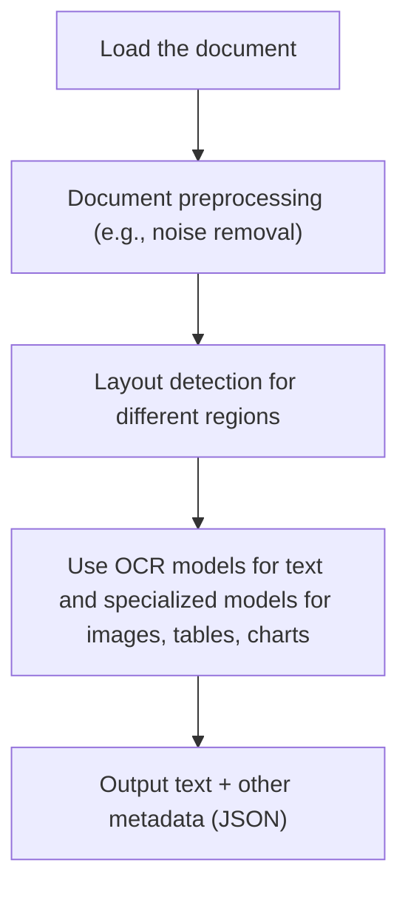
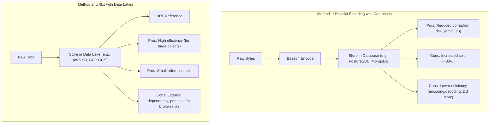
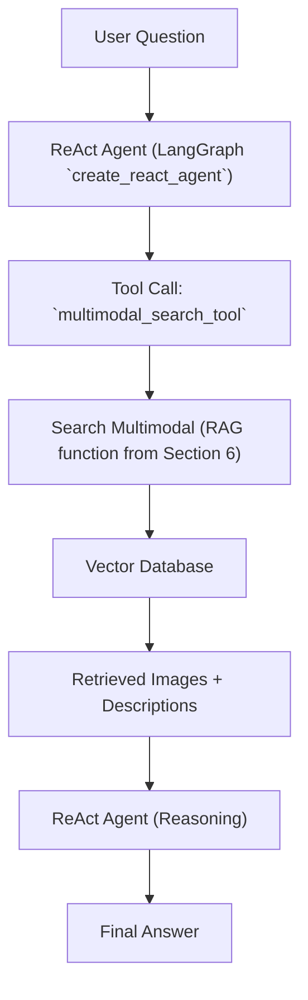

## Lesson 11: Multimodal

### Unlocking enterprise AI with native image and document understanding

In previous lessons, we explored the fundamentals of AI Engineering. We covered the AI agent landscape, understood the difference between LLM workflows and autonomous AI agents, and mastered context engineering—the art of feeding relevant information to an LLM. We also learned about structured outputs for reliable data extraction, basic workflow ingredients like chaining and routing, how to give LLMs the ability to take actions, and the importance of agent memory and knowledge through RAG.

However, AI applications rarely work with text data alone. As humans, we interact daily with diverse data types: text, images, documents, and audio. Integrating these into our AI systems is essential. This need quickly becomes a business problem, as enterprise-grade AI applications require multimodal data when manipulating private information from databases, warehouses, and data lakes. This lesson provides the knowledge to build enterprise AI agents or LLM workflows that process your personal or organizational data. We will also touch on how these techniques can extend to video or audio in future lessons.

## The Need for Multimodal AI

AI applications often tried to normalize everything to text. We used Optical Character Recognition (OCR) to parse documents and map them to text or tabular data. However, this approach has many flaws, as translating images or complex documents to text loses a significant amount of information.

For example, consider object detection and classification in images or image captioning. Text-only methods struggle with financial reports that contain complex charts, research assistants processing diagrams, medical documents with intricate diagnostics, technical documents with detailed schematics, or building sketches. It is impossible to fully reproduce the nuances of colors and geometrical relationships in text. Directly processing the image, as a human would, is often simpler, faster, cheaper, more intuitive, and usually more performant. Thus, AI applications need native support for images and documents to process complex data formats and relationships that are natural for humans to use in their daily workflows.

## Limitations of Traditional Document Processing

To fully understand the problem, we need to consider the limitations of traditional document processing, such as handling invoices, documentation, or reports with AI systems. The core issue is that previous approaches tried to normalize all data to text before passing it to an AI model. This process has many flaws because much information is lost during translation. For instance, when a document contains diagrams, charts, or sketches, it is impossible to fully reproduce their details in text.

Traditional document processing often follows a multi-step workflow. First, the document is loaded and undergoes preprocessing, such as noise removal. Next, layout detection identifies different regions within the document. OCR models then process text regions, while other specialized models handle structures like images, tables, or charts. Finally, the system outputs text and other metadata in a structured format like JSON. This process is illustrated in Image 1.



Image 1: A flowchart illustrating the traditional document processing workflow using OCR. (Source [Notebook 1 [66]](https://github.com/towardsai/course-ai-agents/blob/dev/lessons/11_multimodal/notebook.ipynb))

This multi-step approach introduces too many moving pieces, including layout detection, OCR models, and different models for each data structure. This makes the system rigid to new data structures. For example, if a document contains charts and we do not have a specific model for it, the system will fail. It also becomes slow and costly due to multiple model calls, and fragile because we must manage all these models.

Furthermore, the multi-step nature of traditional document processing creates a cascade effect where errors compound at each stage. Advanced OCR engines struggle with handwritten text, poor scans, stylized fonts, and complex layouts such as nested tables, multi-column designs, building sketches, X-rays, or noisy handwritten documents [[15], [16], [17], [18], [19], [11], [13]]. For example, traditional OCR often fails to detect elements like balconies in building sketches, as shown in Image 2 [[11]].

https://github.com/user-attachments/assets/87413620-8025-4299-8086-444453086749
Image 2: An example of an undetected element in a building sketch by traditional OCR systems (Image by author from [Complex Document Recognition: OCR Doesn’t Work and Here’s How You Fix It [11]](https://hackernoon.com/complex-document-recognition-ocr-doesnt-work-and-heres-how-you-fix-it))

While this might work for highly specialized applications, it is clear that this approach has many problems and does not scale for a world of AI agents that need to be flexible and fast.

Modern AI solutions use multimodal LLMs, such as Gemini, that can directly interpret text, images, or even PDFs as native input, completely bypassing the OCR workflow from Image 1. Let's understand how multimodal LLMs work.

## Foundations of Multimodal LLMs

Before we dive into the code examples of using LLMs with images and documents, it helps to understand how multimodal LLMs work. We will not cover every detail, as that is the job of an AI researcher. As an AI Engineer, you need an intuition for how they work to use, deploy, optimize, and monitor them.

Multimodal LLMs are built using two common approaches. The first is the **Unified Embedding Decoder Architecture**, and the second is the **Cross-modality Attention Architecture** [[2]]. Image 3 illustrates these two approaches.

https://substackcdn.com/image/fetch/$s_!8miE!,f_auto,q_auto:good,fl_progressive:steep/https%3A%2F%2Fsubstack-post-media.s3.amazonaws.com%2Fpublic%2Fimages%2F53956ae8-9cd8-474e-8c10-ef6bddb88164_1600x938.png
Image 3: The two main approaches to developing multimodal LLM architectures (Image by Sebastian Raschka, PhD from [Understanding Multimodal LLMs [2]](https://magazine.sebastianraschka.com/p/understanding-multimodal-llms))

In the **Unified Embedding Decoder Architecture**, image information is converted into input tokens that have the same embedding size as text tokens. These image tokens are then concatenated with text tokens and passed to the LLM for unified processing [[2], [50]]. This approach is similar to how an unmodified LLM like GPT-2 or Llama 3.2 processes a single sequence of tokens. Image 4 illustrates this method.

https://substackcdn.com/image/fetch/$s_!Ws6n!,f_auto,q_auto:good,fl_progressive:steep/https%3A%2F%2Fsubstack-post-media.s3.amazonaws.com%2Fpublic%2Fimages%2F91955021-7da5-4bc4-840e-87d080152b18_1166x1400.png
Image 4: Illustration of the unified embedding decoder architecture (Image by Sebastian Raschka, PhD from [Understanding Multimodal LLMs [2]](https://magazine.sebastianraschka.com/p/understanding-multimodal-llms))

The **Cross-modality Attention Architecture** integrates image and text embeddings directly within the attention layer using a cross-attention mechanism [[2], [50]]. This means the image information is injected into the LLM's decoder through its attention mechanism, allowing for more dynamic interaction between modalities without concatenating all tokens at the input stage. Image 5 illustrates this approach.

https://substackcdn.com/image/fetch/$s_!7Xvv!,f_auto,q_auto:good,fl_progressive:steep/https%3A%2F%2Fsubstack-post-media.s3.amazonaws.com%2Fpublic%2Fimages%2Fd9c06055-b959-45d1-87b2-1f4e90ceaf2d_1296x1338.png
Image 5: Illustration of the cross-modality attention architecture (Image by Sebastian Raschka, PhD from [Understanding Multimodal LLMs [2]](https://magazine.sebastianraschka.com/p/understanding-multimodal-llms))

Image encoders are crucial components in these architectures. They function similarly to how text tokenization works. Just as Byte-Pair Encoding breaks text into subwords, image encoders divide images into smaller patches [[2], [52]]. These patches are then encoded by a pretrained Vision Transformer (ViT), which extracts detailed visual features. This process is analogous to text tokenization and embedding, as shown in Image 6.

https://substackcdn.com/image/fetch/$s_!zjmg!,f_auto,q_auto:good,fl_progressive:steep/https%3A%2F%2Fsubstack-post-media.s3.amazonaws.com%2Fpublic%2Fimages%2F0d56ea06-d202-4eb7-9e01-9aac492ee309_1522x1206.png
Image 6: Image tokenization and embedding (left) and text tokenization and embedding (right) side by side (Image by Sebastian Raschka, PhD from [Understanding Multimodal LLMs [2]](https://magazine.sebastianraschka.com/p/understanding-multimodal-llms))

Image 7 shows a classic ViT setup, where image patches are processed to create embeddings. The output embeddings from image encoders have the same structure and dimensions as text embeddings, which allows us to input them alongside text embeddings without issues [[2], [53]].

https://substackcdn.com/image/fetch/$s_!_DNf!,f_auto,q_auto:good,fl_progressive:steep/https%3A%2F%2Fsubstack-post-media.s3.amazonaws.com%2Fpublic%2Fimages%2Ffef5f8cb-c76c-4c97-9771-7fdb87d7d8cd_1600x1135.png
Image 7: Illustration of a classic Vision Transformer (ViT) setup (Image by Sebastian Raschka, PhD from [Understanding Multimodal LLMs [2]](https://magazine.sebastianraschka.com/p/understanding-multimodal-llms))

Even if the image and text embeddings have the same dimensions, they need to be aligned in the vector space. This is achieved through a linear projection module, which ensures that semantically similar text and images are located close together [[2], [54]]. Examples of image encoder models that use this core architecture include CLIP, OpenCLIP, and SigLIP [[5], [60], [61], [62], [63], [64]]. These models also serve as embedding models for multimodal RAG, enabling semantic similarity searches between text, images, and other data types. Image 8 illustrates how text and image embeddings can exist in the same vector space, allowing for direct comparison and retrieval based on semantic similarity [[3], [5]].

https://substackcdn.com/image/fetch/$s_!15d3HBNjNIXLy0oMIvJjxWw.png
Image 8: Multimodal embedding space where text and image embeddings are aligned (Image by Shawhin Talebi from [Multimodal Embeddings: An Introduction [3]](https://towardsdatascience.com/multimodal-embeddings-an-introduction-5dc36975966f/))

There are trade-offs between the two main architectures. The Unified Embedding Decoder Architecture is simpler to implement because it does not require modifications to the LLM architecture. It also often achieves higher accuracy in OCR-related tasks, which is relevant to our discussion in Section 2 [[2]]. The Cross-modality Attention Architecture, while requiring more complex training procedures, offers superior computational efficiency for high-resolution images because it injects image information directly into the attention mechanism, rather than passing all image tokens as input [[2]]. Hybrid approaches combine the benefits of both methods.

In 2025, most LLMs are multimodal. Popular open-source models include Llama 4, Gemma 2, Qwen3, and DeepSeek R1/V3, while closed-source models include GPT-5, Gemini 2.5, and Claude. These models can also be expanded to other modalities, such as PDFs, audio, or video, by integrating different encoders for each modality [[50], [51], [52], [53], [54]].

It is important to distinguish multimodal LLMs from generative diffusion models like Midjourney or Stable Diffusion. Diffusion models are a different family of models primarily used to generate images or videos [[14]]. They focus on synthesizing new media from text prompts, rather than understanding and reasoning across multiple modalities [[25], [26], [27], [28], [29]]. For example, Midjourney excels at creating artistic images from prompts, and GPT-4o supports generating images [[14]]. Although we will not cover diffusion models in detail in this course, they can be integrated as tools within LLM workflows and agents.

Innovations in multimodal LLM architectures are frequent and evolving rapidly. This section aimed to provide an intuition for how multimodal LLMs work and why they are superior to older, multi-step OCR approaches. Now that we understand how LLMs can directly process images or documents, let's see how this works in practice.

## Applying Multimodal LLMs to Images and PDFs

To better understand how multimodal LLMs work, we will explore some best practices for working with images and PDFs in Gemini. We can process multimodal data with LLMs in three core ways: as raw bytes, Base64 encoded strings, or URLs.

**Raw bytes** are the easiest way to send data to LLMs for one-off API calls. However, storing raw bytes directly in a database can lead to corruption because most databases interpret input as text or strings, not raw binary data.

**Base64 encoding** converts raw bytes into a string format. This method is often used to embed images directly into websites. In our use case, a major advantage is that it allows us to store images or documents in a database, such as PostgreSQL or MongoDB, without corruption, as databases handle strings reliably. The main downside is that Base64 encoded data is typically 33% larger than raw bytes [[55], [57]].

**URLs** are useful in two scenarios: for public data from the internet or for private data stored in a company's data lake, such as AWS S3 or GCP GCS. When working with public data, we can often pass the direct link to a website, PDF, or image to the LLM. In enterprise scenarios, which prioritize privacy and scale, data is stored in data lakes. Instead of downloading data from a database and transmitting it to the LLM API, the LLM can directly download the media from the bucket. This makes URLs the most efficient option, as I/O is often the primary bottleneck for AI applications [[55], [56], [57], [58], [59], [20], [21], [22], [23], [24]]. Image 9 compares Base64 encoding with databases and URL references with data lakes for multimodal data storage.



Image 9: Flowchart comparing Base64 encoding with databases and URL references with data lakes for multimodal data storage, highlighting pros and cons. (Source [Notebook 1 [66]](https://github.com/towardsai/course-ai-agents/blob/dev/lessons/11_multimodal/notebook.ipynb))

To summarize the advantages: raw bytes are suitable for one-off LLM calls without storage needs. Base64 is useful for storing data directly in a database to avoid corruption. URLs are ideal for storing data in data lakes, preventing corruption and facilitating easy distribution of images or documents across the organization.

Now, let's explore practical code examples to understand how to work with LLMs with images and PDFs in various formats, such as bytes, Base64, and URLs. We will showcase these scenarios by extracting image captions, PDF descriptions, and performing more complex tasks like object detection using Gemini.

First, we will look at a sample image.

https://github.com/user-attachments/assets/b83a0026-6412-4217-a068-07e05fc86c8f
Image 10: A robot with a kitten (Source [Notebook 1 [66]](https://github.com/towardsai/course-ai-agents/blob/dev/lessons/11_multimodal/notebook.ipynb))

Next, we process this image as raw bytes.

1.  We define the `load_image_as_bytes` function to load an image from a file path and convert it to bytes with optional resizing.
    ```python
    def load_image_as_bytes(
        image_path: Path, format: Literal["WEBP", "JPEG", "PNG"] = "WEBP", max_width: int = 600, return_size: bool = False
    ) -> bytes | tuple[bytes, tuple[int, int]]:
        """
        Load an image from file path and convert it to bytes with optional resizing.
        """
    
        image = PILImage.open(image_path)
        if image.width > max_width:
            ratio = max_width / image.width
            new_size = (max_width, int(image.height * ratio))
            image = image.resize(new_size)
    
        byte_stream = io.BytesIO()
        image.save(byte_stream, format=format)
    
        if return_size:
            return byte_stream.getvalue(), image.size
    
        return byte_stream.getvalue()
    ```
2.  We load the sample image as raw bytes. We use the `WEBP` format because it is efficient for web-based image delivery, offering good compression while maintaining quality.
    ```python
    image_bytes = load_image_as_bytes(image_path=Path("images") / "image_1.jpeg", format="WEBP")
    pretty_print.wrapped([f"Bytes `{image_bytes[:30]}...`", f"Size: {len(image_bytes)} bytes"], title="Image as Bytes")
    ```
    It outputs:
    ```text
    ------------------------------------------ Image as Bytes ------------------------------------------ 
    Bytes `b'RIFF`\xad\x00\x00WEBPVP8 T\xad\x00\x00P\xec\x02\x9d\x01*X\x02X\x02'...`
    ---------------------------------------------------------------------------------------------------- 
    Size: 44392 bytes
    ---------------------------------------------------------------------------------------------------- 
    ```
3.  We call the LLM to generate a caption for the image.
    ```python
    response = client.models.generate_content(
        model=MODEL_ID,
        contents=[
            types.Part.from_bytes(
                data=image_bytes,
                mime_type="image/webp",
            ),
            "Tell me what is in this image in one paragraph.",
        ],
    )
    pretty_print.wrapped(response.text, title="Image 1 Caption")
    ```
    It outputs:
    ```text
    ----------------------------------------- Image 1 Caption ----------------------------------------- 
    This striking image features a massive, dark metallic robot, its powerful form detailed with intricate circuit patterns on its head and piercing red glowing eyes. Perched playfully on its right arm is a small, fluffy grey tabby kitten, its front paw raised as if exploring or batting at the robot's armored limb, while its gaze is directed slightly off-frame. The robot's large, segmented hand is visible beneath the kitten. The background suggests an industrial or workshop environment, with hints of metal structures and natural light filtering in from an unseen window, creating a dramatic contrast between the soft, vulnerable kitten and the formidable, mechanical sentinel.
    ---------------------------------------------------------------------------------------------------- 
    ```
4.  We scale the method by calling the LLM with multiple images, asking for the differences between them. We compare the previous image with Image 11.
    https://github.com/user-attachments/assets/81d44160-c447-4978-831d-d40502a20b78
    Image 11: A robot with a dog (Source [Notebook 1 [66]](https://github.com/towardsai/course-ai-agents/blob/dev/lessons/11_multimodal/notebook.ipynb))
    ```python
    response = client.models.generate_content(
        model=MODEL_ID,
        contents=[
            types.Part.from_bytes(
                data=load_image_as_bytes(image_path=Path("images") / "image_1.jpeg", format="WEBP"),
                mime_type="image/webp",
            ),
            types.Part.from_bytes(
                data=load_image_as_bytes(image_path=Path("images") / "image_2.jpeg", format="WEBP"),
                mime_type="image/webp",
            ),
            "What's the difference between these two images? Describe it in one paragraph.",
        ],
    )
    pretty_print.wrapped(response.text, title="Differences between images")
    ```
    It outputs:
    ```text
    ------------------------------------ Differences between images ------------------------------------ 
    The primary difference between the two images lies in the nature of the interaction depicted and their respective settings. In the first image, a small, grey kitten is shown curiously interacting with a large, metallic robot, gently perched on its arm within what appears to be a clean, well-lit workshop or industrial space. Conversely, the second image portrays a tense and aggressive confrontation between a fluffy white dog and a sleek black robot, both in combative stances, amidst a cluttered and grimy urban alleyway filled with trash and graffiti.
    ---------------------------------------------------------------------------------------------------- 
    ```

Next, we process the image as Base64 encoded strings.

1.  We define the `load_image_as_base64` function.
    ```python
    def load_image_as_base64(
        image_path: Path, format: Literal["WEBP", "JPEG", "PNG"] = "WEBP", max_width: int = 600, return_size: bool = False
    ) -> str:
        """
        Load an image and convert it to base64 encoded string.
        """
    
        image_bytes = load_image_as_bytes(image_path=image_path, format=format, max_width=max_width, return_size=False)
    
        return base64.b64encode(cast(bytes, image_bytes)).decode("utf-8")
    ```
2.  We load the image as Base64.
    ```python
    image_base64 = load_image_as_base64(image_path=Path("images") / "image_1.jpeg", format="WEBP")
    pretty_print.wrapped(
        [f"Base64: {image_base64[:100]}...`", f"Size: {len(image_base64)} characters"], title="Image as Base64"
    )
    ```
    It outputs:
    ```text
    ----------------------------------------- Image as Base64 ----------------------------------------- 
    Base64: UklGRmCtAABXRUJQVlA4IFStAABQ7AKdASpYAlgCPm0ylEekIqInJnQ7gOANiWdtk7FnEo2gDknjPixW9SNSb5P7IbBNhLn87Vtp...`
    ---------------------------------------------------------------------------------------------------- 
    Size: 59192 characters
    ---------------------------------------------------------------------------------------------------- 
    ```
3.  Base64 images are approximately 33% larger than raw bytes. This increase in size impacts latency and cost, especially for large files [[55], [57]].
    ```python
    print(f"Image as Base64 is {(len(image_base64) - len(image_bytes)) / len(image_bytes) * 100:.2f}% larger than as bytes")
    ```
    It outputs:
    ```text
    Image as Base64 is 33.34% larger than as bytes
    ```
4.  We call the LLM to recompute the image caption using this method.
    ```python
    response = client.models.generate_content(
        model=MODEL_ID,
        contents=[
            types.Part.from_bytes(data=image_base64, mime_type="image/webp"),
            "Tell me what is in this image in one paragraph.",
        ],
    )
    response.text
    ```
    It outputs:
    ```text
    "The image features a striking contrast between a large, formidable robot and a small, adorable kitten. The robot, crafted from dark, sleek metallic armor with intricate circuitry patterns on its head, possesses piercing red glowing eyes that appear to be focused on its tiny companion. A fluffy, gray tabby kitten is playfully perched on the robot's massive metallic arm and shoulder, its small paws resting gently on the armored surface as it looks up with curiosity. The scene is set in what looks like an industrial or workshop environment, with warm light filtering in from the background, highlighting this unexpected and endearing interaction between advanced technology and natural innocence."
    ```

Next, we process PDFs as public URLs.

1.  We configure Gemini using the `url_context` tool to query public PDFs directly by passing their URL [[7]]. This allows the LLM to visit and parse webpages, PDFs, and images from the open internet automatically.
    ```python
    response = client.models.generate_content(
        model=MODEL_ID,
        contents="Based on the provided paper as a PDF, tell me how ReAct works: https://arxiv.org/pdf/2210.03629",
        config=types.GenerateContentConfig(tools=[{"url_context": {}}]),
    )
    pretty_print.wrapped(response.text, title="How ReAct works")
    ```
    It outputs:
    ```text
    ----------------------------------------- How ReAct works ----------------------------------------- 
    ReAct is a novel paradigm for large language models (LLMs) that combines reasoning (Thought) and acting (Action) in an interleaved manner to solve diverse language and decision-making tasks. This approach allows the model to:
    *   **Reason to Act:** Generate verbal reasoning traces to induce, track, and update action plans, and handle exceptions.
    *   **Act to Reason:** Interface with and gather additional information from external sources (like knowledge bases or environments) to incorporate into its reasoning.
    **How it works:**
    Instead of just generating a direct answer (Standard prompting) or a chain of thought without external interaction (CoT), or only actions (Act-only), ReAct augments the LLM's action space to include a "language space" for generating "thoughts" or reasoning traces.
    1.  **Thought:** The model explicitly generates a thought, which is a verbal reasoning trace. This thought helps the model to:
        *   Decompose task goals and create action plans.
        *   Inject commonsense knowledge.
        *   Extract important information from observations.
        *   Track progress and adjust action plans.
        *   Handle exceptions.
    2.  **Action:** Based on the current thought and context, the model performs a task-specific action. This could involve:
        *   Searching external databases (e.g., Wikipedia API using `search[entity]` or `lookup[string]`).
        *   Interacting with an environment (e.g., `go to cabinet 1`, `take pepper shaker 1`).
        *   Finishing the task with an answer (`finish[answer]`).
    3.  **Observation:** The environment provides an observation feedback based on the executed action.
    This cycle of Thought, Action, and Observation continues until the task is completed.
    **Benefits of ReAct:**
    *   **Improved Performance:** ReAct consistently outperforms baselines that only perform reasoning or acting in isolation on tasks like question answering (HotpotQA), fact verification (FEVER), text-based games (ALFWorld), and webpage navigation (WebShop).
    *   **Reduced Hallucination and Error Propagation:** By interacting with external sources, ReAct can overcome issues of hallucination and error propagation common in chain-of-thought reasoning that relies solely on internal knowledge.
    *   **Human Interpretability and Trustworthiness:** The interleaved reasoning traces make the model's decision-making process more interpretable and trustworthy, as humans can inspect the thoughts and actions.
    *   **Flexibility and Generalizability:** ReAct is flexible enough to be applied to diverse tasks with different action spaces and reasoning needs, and it shows strong generalization with only a few in-context examples.
    *   **Human Alignment and Controllability:** Humans can control or correct the agent's behavior by editing its thoughts, enabling new forms of human-machine collaboration.
    For example, in a question-answering task, ReAct might first *think* about what to search, then *act* by searching Wikipedia, *observe* the results, *think* about what the results mean and what to search next, and so on, until it can *think* of the final answer and *act* to finish the task.
    ---------------------------------------------------------------------------------------------------- 
    ```

Next, we process images as URLs from private data lakes. At the time of writing this lesson, Gemini works well only with GCP Cloud Storage links, not public URLs from other providers. Thus, for simplicity, we will provide only pseudocode. The code would look like this, where you must change the `uri` and ensure the LLM has the right permissions to your GCS bucket:
```python
response = client.models.generate_content(
    model=MODEL_ID,
    contents=[
        types.Part.from_uri(uri="gs://gemini-images/image_1.jpeg", mime_type="image/webp"),
        "Tell me what is in this image in one paragraph.",
    ],
)
```

Now, let's look at a more complex use case: object detection with LLMs.

1.  We define the output Pydantic models for bounding boxes and detections.
    ```python
    from pydantic import BaseModel, Field
    
    
    class BoundingBox(BaseModel):
        ymin: float
        xmin: float
        ymax: float
        xmax: float
        label: str = Field(
            default="The category of the object found within the bounding box. For example: cat, dog, diagram, robot."
        )
    
    
    class Detections(BaseModel):
        bounding_boxes: list[BoundingBox]
    ```
2.  We define the prompt and input image as bytes.
    ```python
    prompt = """
    Detect all of the prominent items in the image. 
    The box_2d should be [ymin, xmin, ymax, xmax] normalized to 0-1000.
    Also, output the label of the object found within the bounding box.
    """
    
    image_bytes, image_size = load_image_as_bytes(
        image_path=Path("images") / "image_1.jpeg", format="WEBP", return_size=True
    )
    ```
3.  We call the LLM to detect objects.
    ```python
    config = types.GenerateContentConfig(
        response_mime_type="application/json",
        response_schema=Detections,
    )
    
    response = client.models.generate_content(
        model=MODEL_ID,
        contents=[
            types.Part.from_bytes(
                data=image_bytes,
                mime_type="image/webp",
            ),
            prompt,
        ],
        config=config,
    )
    
    detections = cast(Detections, response.parsed)
    pretty_print.wrapped([f"Image size: {image_size}", *detections.bounding_boxes], title="Detections")
    ```
    It outputs:
    ```text
    -------------------------------------------- Detections -------------------------------------------- 
    Image size: (600, 600)
    ---------------------------------------------------------------------------------------------------- 
    ymin=1.0 xmin=450.0 ymax=997.0 xmax=1000.0 label='robot'
    ---------------------------------------------------------------------------------------------------- 
    ymin=269.0 xmin=39.0 ymax=782.0 xmax=530.0 label='kitten'
    ---------------------------------------------------------------------------------------------------- 
    ```
4.  We visualize the bounding boxes on the rendered image to see the detected objects.
    https://github.com/user-attachments/assets/9599d146-5b4d-48d0-8f92-563b71565576
    Image 12: Object detection results for the robot and kitten image (Source [Notebook 1 [66]](https://github.com/towardsai/course-ai-agents/blob/dev/lessons/11_multimodal/notebook.ipynb))

Next, we process PDFs as raw bytes. Because we use the same Gemini model and interface, the process is almost identical to what we did for images. Let's look at the first page of the `Attention Is All You Need` paper PDF.

https://github.com/user-attachments/assets/74169542-a631-411a-821e-c286663f730c
Image 13: First page of the `Attention Is All You Need` paper (Source [Notebook 1 [66]](https://github.com/towardsai/course-ai-agents/blob/dev/lessons/11_multimodal/notebook.ipynb))

1.  We load the `attention_is_all_you_need_paper.pdf` as bytes.
    ```python
    pdf_bytes = (Path("pdfs") / "attention_is_all_you_need_paper.pdf").read_bytes()
    pretty_print.wrapped(f"Bytes: {pdf_bytes[:40]}...", title="PDF bytes")
    ```
    It outputs:
    ```text
    -------------------------------------------- PDF bytes -------------------------------------------- 
    Bytes: b'%PDF-1.7\n%\xe2\xe3\xcf\xd3\n24 0 obj\n<<\n/Filter /Flat'...
    ---------------------------------------------------------------------------------------------------- 
    ```
2.  We call the LLM to summarize the document.
    ```python
    response = client.models.generate_content(
        model=MODEL_ID,
        contents=[
            types.Part.from_bytes(data=pdf_bytes, mime_type="application/pdf"),
            "What is this document about? Provide a brief summary of the main topics.",
        ],
    )
    pretty_print.wrapped(response.text, title="PDF Summary (as bytes)")
    ```
    It outputs:
    ```text
    -------------------------------------- PDF Summary (as bytes) -------------------------------------- 
    This document introduces the **Transformer**, a novel neural network architecture designed for **sequence transduction tasks** (like machine translation).
    Its main topics include:
    1.  **Dispensing with Recurrence and Convolutions**: Unlike previous dominant models (RNNs and CNNs), the Transformer relies *solely* on **attention mechanisms**, eliminating the need for sequential computation.
    2.  **Attention Mechanisms**: It details the **Scaled Dot-Product Attention** and **Multi-Head Attention** as its core building blocks, explaining how they allow the model to weigh different parts of the input sequence.
    3.  **Parallelization and Efficiency**: The paper highlights that the Transformer's architecture allows for significantly more parallelization during training, leading to **faster training times** compared to prior models.
    4.  **Superior Performance**: It demonstrates that the Transformer achieves **state-of-the-art results** on machine translation tasks (English-to-German and English-to-French) and generalizes well to other tasks like English constituency parsing.
    5.  **Positional Encoding**: Since the model lacks recurrence or convolution, it introduces positional encodings to inject information about the relative or absolute position of tokens in the sequence.
    In essence, the document proposes and validates that **attention alone is sufficient** for building high-quality, efficient, and parallelizable sequence transduction models.
    ---------------------------------------------------------------------------------------------------- 
    ```

Next, we process PDFs as Base64 encoded strings.

1.  We define the `load_pdf_as_base64` function.
    ```python
    def load_pdf_as_base64(pdf_path: Path) -> str:
        """
        Load a PDF file and convert it to base64 encoded string.
        """
    
        with open(pdf_path, "rb") as f:
            return base64.b64encode(f.read()).decode("utf-8")
    ```
2.  We load the PDF as Base64.
    ```python
    pdf_base64 = load_pdf_as_base64(pdf_path=Path("pdfs") / "attention_is_all_you_need_paper.pdf")
    pretty_print.wrapped(f"Base64: {pdf_base64[:40]}...", title="PDF as Base64")
    ```
    It outputs:
    ```text
    ------------------------------------------ PDF as Base64 ------------------------------------------ 
    Base64: JVBERi0xLjcKJeLjz9MKMjQgMCBvYmoKPDwKL0Zp...
    ---------------------------------------------------------------------------------------------------- 
    ```
3.  We call the LLM to summarize the document.
    ```python
    response = client.models.generate_content(
        model=MODEL_ID,
        contents=[
            "What is this document about? Provide a brief summary of the main topics.",
            types.Part.from_bytes(data=pdf_base64, mime_type="application/pdf"),
        ],
    )
    
    pretty_print.wrapped(response.text, title="PDF Summary (as base64)")
    ```
    It outputs:
    ```text
    ------------------------------------- PDF Summary (as base64) ------------------------------------- 
    This document introduces the **Transformer**, a novel neural network architecture for **sequence transduction models**, primarily applied to **machine translation**.
    Here's a brief summary of the main topics:
    *   **Core Innovation:** The Transformer proposes to completely abandon recurrent neural networks (RNNs) and convolutional neural networks (CNNs), relying *solely on attention mechanisms* (specifically "multi-head self-attention") for learning dependencies between input and output sequences.
    *   **Problem Addressed:** Traditional RNNs/CNNs suffer from inherent sequential computation, which limits parallelization and makes it difficult to efficiently learn long-range dependencies. The Transformer addresses this by allowing constant-time operations for relating any two positions in a sequence.
    *   **Architecture:** It maintains an encoder-decoder structure, where both the encoder and decoder are composed of stacks of self-attention and point-wise fully connected layers. Positional encodings are added to input embeddings to inject information about the order of the sequence.
    *   **Key Advantages:** The Transformer is significantly more parallelizable and requires substantially less training time compared to previous state-of-the-art models.
    *   **Performance:** It achieves new state-of-the-art results on major machine translation benchmarks (WMT 2014 English-to-German and English-to-French) and demonstrates strong generalization to other tasks, such as English constituency parsing.
    ---------------------------------------------------------------------------------------------------- 
    ```

Finally, we perform object detection on PDF pages as images. To further emphasize how you can input PDFs to LLMs as images, especially those with complex layouts, we will do object detection on the `Attention Is All You Need` paper. Along with the trade-offs similar to processing images as bytes versus Base64, this is an architectural decision mostly related to how we store PDFs in our database and how they fit into our AI architecture.

Let's look at the `attention_is_all_you_need_1.jpeg` PDF page, which is used as an example for detecting the diagram.

https://github.com/user-attachments/assets/65e921d7-27b9-4786-8f2e-5038b368739f
Image 14: PDF page from the `Attention Is All You Need` paper with a diagram (Source [Notebook 1 [66]](https://github.com/towardsai/course-ai-agents/blob/dev/lessons/11_multimodal/notebook.ipynb))

1.  We define the prompt and load the image as bytes.
    ```python
    prompt = """
    Detect all the diagrams from the provided image as 2d bounding boxes. 
    The box_2d should be [ymin, xmin, ymax, xmax] normalized to 0-1000.
    Also, output the label of the object found within the bounding box.
    """
    
    image_bytes, image_size = load_image_as_bytes(
        image_path=Path("images") / "attention_is_all_you_need_1.jpeg", format="WEBP", return_size=True
    )
    ```
2.  We call the LLM to detect the diagram from the PDF page.
    ```python
    config = types.GenerateContentConfig(
        response_mime_type="application/json",
        response_schema=Detections,
    )
    response = client.models.generate_content(
        model=MODEL_ID,
        contents=[
            types.Part.from_bytes(
                data=image_bytes,
                mime_type="image/webp",
            ),
            prompt,
        ],
        config=config,
    )
    detections = cast(Detections, response.parsed)
    pretty_print.wrapped([f"Image size: {image_size}", *detections.bounding_boxes], title="Detections")
    ```
    It outputs:
    ```text
    -------------------------------------------- Detections -------------------------------------------- 
    Image size: (600, 776)
    ---------------------------------------------------------------------------------------------------- 
    ymin=88.0 xmin=309.0 ymax=515.0 xmax=681.0 label='diagram'
    ---------------------------------------------------------------------------------------------------- 
    ```
3.  We visualize the image with the detection.
    https://github.com/user-attachments/assets/65e921d7-27b9-4786-8f2e-5038b368739f
    Image 15: Diagram detection on the `Attention Is All You Need` PDF page (Source [Notebook 1 [66]](https://github.com/towardsai/course-ai-agents/blob/dev/lessons/11_multimodal/notebook.ipynb))

LLMs now understand images well, which makes translating them to text unnecessary.

## Foundations of Multimodal RAG

One of the most common use cases when working with multimodal data is Retrieval-Augmented Generation (RAG), a concept we explored in Lesson 10. When building custom AI applications, you will always need to retrieve private company data to feed into your LLM. For larger data formats, such as images or PDFs, RAG becomes even more important. Imagine stuffing over 1000 PDF pages into your LLM to get a simple answer on your company's last quarter revenue. Even with huge context windows, that quickly becomes unfeasible due to the direct correlation between context window size and increased latency, costs, and decreased performance.

Let's explore how a generic multimodal RAG architecture works using images and text as an example.

The **ingestion pipeline** involves embedding images using a text-image embedding model and then loading these embeddings into a vector database.

The **retrieval pipeline** starts by embedding the user's text query using the same text-image embedding model used during ingestion. This query embedding is then used to query the vector database, which contains a vector index for the images. The system retrieves the top-k most similar images based on the similarity distance, such as cosine distance, between the query embedding and the image embeddings. Since text-image embeddings reside in the same vector space, this approach works for any combination, such as indexing text and querying with images, or vice versa [[3], [5]]. You can take this further by indexing images along with their captions and adding filters on their metadata for hybrid search. This technique is heavily used in image search engines, like Google or Apple Photos, such as when you query "pictures of dogs" and the system returns only images of dogs. Image 16 illustrates the ingestion and retrieval pipelines of a generic multimodal RAG system.

```mermaid
graph TD
    subgraph "Ingestion Pipeline"
        A["Images"] --> B["Text-Image Embedding Model (Ingestion)"]
        B --> C[(Vector Database (Image Embeddings))]
    end

    subgraph "Retrieval Pipeline"
        D["User Text Query"] --> E["Text-Image Embedding Model (Retrieval)"]
        E --> F["Query Vector"]
        F --> G[(Vector Database (Similarity Search))]
        G --> H["Retrieve Top-K Similar Images"]
    end
```

Image 16: A flowchart illustrating the ingestion and retrieval pipelines of a generic multimodal RAG system using images and text. (Source [Notebook 1 [66]](https://github.com/towardsai/course-ai-agents/blob/dev/lessons/11_multimodal/notebook.ipynb))

For our enterprise use case, where we want to perform RAG on documents, not just images, the most popular architecture as of 2025 is called ColPali [[1], [42]]. ColPali is a modern architecture for multimodal RAG when working with PDF documents.

ColPali's innovation lies in bypassing the entire OCR pipeline, which typically involves text extraction, layout detection, chunking, and embedding [[1], [38], [42]]. Instead, ColPali processes document images directly using vision-language models to understand both textual and visual content simultaneously. This approach is particularly effective for documents with tables, figures, and other complex visual layouts, as it preserves the crucial layout information for document comprehension.

The core patterns of the ColPali architecture include:
1.  **Offline indexing (ingestion pipeline)**: This is where PDFs are converted into high-quality images and processed by the ColPali model to generate multi-vector embeddings. These embeddings are stored in a vector database along with metadata [[42], [41]].
2.  **Online query logic**: ColPali uses a late interaction mechanism, specifically the MaxSim operator, to compute similarities between query tokens and document patches [[1], [35], [38], [39]]. Each query token finds its maximum similarity with document patches, and these scores are summed to determine relevance.
3.  **Used models**: ColPali is based on PaliGemma (3B parameters) with a SigLIP vision encoder [[1], [38]].
4.  **Chunking text vs. Patching images**: Unlike traditional methods that chunk text, ColPali patches images, capturing spatial relationships and formatting context [[36]].
5.  **Outputting "bag-of-embeddings" (multi-vector embeddings)**: Instead of a single embedding vector per document (e.g., a 768-dimensional vector), ColPali generates multiple embedding vectors per document image (e.g., 128 patches × 128 dimensions each), forming a "bag of 128 embeddings" [[1], [35], [37], [39]].

Image 17 shows the architecture of ColPali.

https://substackcdn.com/image/fetch/$s_!LyEV!,f_auto,q_auto:good,fl_progressive:steep/https%3A%2F%2Fsubstack-post-media.s3.amazonaws.com%2Fpublic%2Fimages%2F45e112b5-db9c-420c-9947-05e5593b1621_2044x1236.png
Image 17: ColPali simplifies document retrieval compared to standard retrieval methods (Image by Illuin Technology from [The King of Multi-Modal RAG: ColPali [1]](https://decodingml.substack.com/p/the-king-of-multi-modal-rag-colpali))

ColPali represents a paradigm shift compared to standard retrieval methods that rely on OCR, layout detection, chunking, and indexing with a text embedding model. By patching and indexing documents as images using a multimodal multi-vector embedding model, where each image outputs a "bag-of-embeddings" representation, ColPali offers several advantages [[1], [44], [63], [64]]. It provides 2-10x faster query latency and fewer failure points compared to traditional OCR pipelines [[1]]. It also outperforms all baseline systems on the ViDoRe benchmark, achieving an 81.3% average nDCG@5 score [[1]]. Furthermore, ColPali can be used as a reranking system, enhancing the scalability of retrieval.

Real-world scenarios, mostly related to RAG, benefit from ColPali's ability to interpret and retrieve complex PDF documents. These include financial document analysis with charts, tables, and spatial relationships, and technical documentation with diagrams, flowcharts, and sketches [[36], [39]]. The official `colpali` implementation is available on GitHub at `illuin-tech/colpali`, and the model can be loaded from Hugging Face [[1]].

Now, let's move to a concrete example where we will implement a multimodal RAG system from scratch.

## Implementing Multimodal RAG for Images, PDFs, and Text

Let's connect all the dots with a more complex coding example. We combine what we learned in this lesson and Lesson 10 on RAG into a multimodal RAG exercise.

We will create a simple multimodal RAG example where we populate an in-memory vector database with multiple images from the `images` folder and further query it with text questions. To replicate the ColPali design as much as possible, we will load some pages of the `Attention Is All You Need` paper PDF as images and shuffle them together with standard images. At this point, our main goal is to build an intuition behind multimodal RAG. Thus, we will keep it simple and will not patch the images or use the ColBERT reranker. Image 18 illustrates our multimodal RAG example implementation.

```mermaid
graph TD
    A["Images (from `images` folder and PDF pages as images)"] --> B["Generate Image Description (using Gemini)"]
    B --> C["Embed Text (using Gemini Embedding Model)"]
    C --> D[(In-memory Vector Database (list of dicts))]

    E["User Query"] --> F["Embed Text (using Gemini Embedding Model)"]
    F --> G["Search In-memory Vector Database (Cosine Similarity)"]
    G --> D
    G --> H["Retrieve Top-K Results (Image + Description)"]
```

Image 18: A flowchart illustrating the multimodal RAG example implementation, showing data ingestion and retrieval processes. (Source [Notebook 1 [66]](https://github.com/towardsai/course-ai-agents/blob/dev/lessons/11_multimodal/notebook.ipynb))

Now, let's look at the code. We will use the code examples from the provided Notebook [[66]] to build a multimodal RAG system.

First, let's display the images that we will embed and load into our mocked vector index.

https://github.com/user-attachments/assets/9546fb44-245c-4395-97e3-05c2105156f4
Image 19: Grid of images to be used in the multimodal RAG example (Source [Notebook 1 [66]](https://github.com/towardsai/course-ai-agents/blob/dev/lessons/11_multimodal/notebook.ipynb))

Next, we define and explain the `create_vector_index` function.

1.  We define the `create_vector_index` function to create embeddings for images by generating descriptions and embedding them. This function processes a list of image paths by loading each image as bytes, generating a text description using Gemini Vision, and creating an embedding of that description using Gemini Embeddings.
    ```python
    def create_vector_index(image_paths: list[Path]) -> list[dict]:
        """
        Create embeddings for images by generating descriptions and embedding them.
        """
    
        vector_index = []
        for image_path in image_paths:
            image_bytes = cast(bytes, load_image_as_bytes(image_path, format="WEBP", return_size=False))
    
            image_description = generate_image_description(image_bytes)
            pretty_print.wrapped(f"`{image_description[:500]}...`", title="Generated image description:")
    
            # IMPORTANT NOTE: When working with multimodal embedding models, we can directly embed the
            # `image_bytes` instead of generating and embedding the description. Otherwise, everything
            # else remains the same within the whole RAG system.
            image_embedding = embed_text_with_gemini(image_description)
    
            vector_index.append(
                {
                    "content": image_bytes,
                    "type": "image",
                    "filename": image_path,
                    "description": image_description,
                    "embedding": image_embedding,
                }
            )
    
        return vector_index
    ```
    Since we have only a few images, we mock the vector index as a list. In the real world, you would use a vector database that has dedicated vector indexes that scale using algorithms such as HNSW. We used the `generate_image_description` function to create a description of each image using Gemini and then embedded that description using the text embedding model. We kept highlighting throughout the lesson that this is generally not recommended as it translates images to text. However, we did this here because the Gemini Dev API does not support image embeddings directly. The good news is that once you have a multimodal embedding model available, you can skip creating the image description and embed the image directly. Everything else from the RAG system conceptually remains the same, as image and text embeddings are within the same vector space, meaning you can run similarity metrics between the two. Here is how this would look like with mocked Python code:
    ```python
    image_bytes = b"..."
    # SKIPPED !
    # image_description = generate_image_description(image_bytes)
    image_embeddings = embed_with_multimodal(image_bytes)
    ```
    Popular multimodal embedding models you can easily integrate include Voyage, Cohere, Google Embeddings on Vertex AI (not Gemini Dev), and OpenAI CLIP (available on Hugging Face).

Next, we define and explain the `generate_image_description` function.

1.  We define the `generate_image_description` function to generate a detailed description of an image using the Gemini Vision model.
    ```python
    def generate_image_description(image_bytes: bytes) -> str:
        """
        Generate a detailed description of an image using Gemini Vision model.
        """
    
        try:
            img = PILImage.open(BytesIO(image_bytes))
    
            prompt = """
            Describe this image in detail for semantic search purposes. 
            Include objects, scenery, colors, composition, text, and any other visual elements that would help someone find 
            this image through text queries.
            """
    
            response = client.models.generate_content(
                model=MODEL_ID,
                contents=[prompt, img],
            )
    
            if response and response.text:
                description = response.text.strip()
    
                return description
            else:
                print("❌ No description generated from vision model")
    
                return ""
    
        except Exception as e:
            print(f"❌ Failed to generate image description: {e}")
    
            return ""
    ```

Next, we define and explain the `embed_text_with_gemini` function.

1.  We define the `embed_text_with_gemini` function to embed text content using Gemini's text embedding model.
    ```python
    def embed_text_with_gemini(content: str) -> np.ndarray | None:
        """
        Embed text content using Gemini's text embedding model.
        """
    
        try:
            result = client.models.embed_content(
                model="gemini-embedding-001",  # Gemini's text embedding model
                contents=[content],
            )
            if not result or not result.embeddings:
                print("❌ No embedding data found in response")
                return None
    
            return np.array(result.embeddings[0].values)
    
        except Exception as e:
            print(f"❌ Failed to embed text: {e}")
            return None
    ```

Next, we call the `create_vector_index` function to create the `vector_index` list.

1.  We create the vector index from all JPEG images in the `images` directory.
    ```python
    image_paths = list(Path("images").glob("*.jpeg"))
    vector_index = create_vector_index(image_paths)
    ```
    It outputs:
    ```text
    ----------------------------------- Generated image description: ----------------------------------- 
    `This image is a page from a technical or scientific document, likely a research paper, textbook, or dissertation related to machine learning, deep learning, or artificial intelligence.
    **Overall Composition & Scenery:**
    The image is a vertically oriented page (A4 or similar size) with a clean, academic layout. The dominant colors are black text on a white background. The page is filled with text and features two prominent block diagrams at the top, along with a mathematical equation in the lowe...`
    ---------------------------------------------------------------------------------------------------- 
    ----------------------------------- Generated image description: ----------------------------------- 
    `This image is a detailed, photorealistic digital rendering or illustration depicting an unlikely interaction between a large, imposing robot and a small, delicate kitten in an industrial setting.
    **Objects:**
    *   **Robot:** The dominant figure is a large, humanoid robot, occupying the right side of the frame. Its body is constructed from dark, metallic armored plates in shades of charcoal, gunmetal, and dark grey, with visible bolts, rivets, and segmented joints suggesting a heavy, industrial d...`
    ---------------------------------------------------------------------------------------------------- 
    ----------------------------------- Generated image description: ----------------------------------- 
    `This image depicts a dramatic and tense confrontation between a large, fluffy white dog and a sleek, dark humanoid robot in a desolate urban alleyway.
    **Objects and Characters:**
    *   **White Dog:** Positioned on the left, a large, fluffy white dog, strongly resembling a Samoyed or other Spitz breed (like a white husky or malamute), is captured mid-lunge. Its mouth is wide open, baring sharp teeth, indicative of barking, snarling, or attacking. Its ears are forward, and its tail is high and cur...`
    ---------------------------------------------------------------------------------------------------- 
    ----------------------------------- Generated image description: ----------------------------------- 
    `This image is a detailed, close-up shot of an African American man intently working on the internal components of an open desktop computer tower.
    **Objects:**
    *   **Person:** An adult African American male with a neatly trimmed beard (streaked with some grey) and black-rimmed glasses is positioned on the left side, looking down with a focused expression into the computer case. His dark-skinned hands are prominent, one holding a screwdriver and the other steadying a component or pointing. He wea...`
    ---------------------------------------------------------------------------------------------------- 
    ----------------------------------- Generated image description: ----------------------------------- 
    `This image is a detailed technical document, likely from a research paper or academic publication, featuring a prominent diagram of the Transformer model architecture alongside explanatory text.
    **Overall Composition & Scenery:**
    The image is set against a clean white background. The top half is dominated by a multi-colored block diagram, while the bottom half contains black text organized into sections and paragraphs. A page number "3" is centered at the very bottom.
    **Objects & Diagram Eleme...`
    ---------------------------------------------------------------------------------------------------- 
    ----------------------------------- Generated image description: ----------------------------------- 
    `This image depicts a dynamic, high-energy futuristic battle scene between two humanoid robots or mechs.
    **Objects:**
    *   **Two Robots/Mechs:**
        *   **Left Robot:** Appears sleek and agile, made of highly reflective, polished silver or chrome metal. Its head, chest, and arms feature prominent electric blue glowing lines and accents, including a bright blue visor or eye piece. It is in the process of delivering a powerful punch with its right fist into the other robot. Its posture suggests for...`
    ---------------------------------------------------------------------------------------------------- 
    ----------------------------------- Generated image description: ----------------------------------- 
    `This image is a digital scan or representation of the first page of a widely recognized academic research paper. The dominant visual element is text, set against a plain white background, simulating a printed document.
    **Overall Composition & Layout:**
    The page is organized in a standard academic paper format with a title, author list, abstract, and footnotes. Text is primarily black, with a small section of red text at the very top. A vertical, faint grey text string (likely a watermark or ide...`
    ---------------------------------------------------------------------------------------------------- 
    ------------------------------------------------ ✅ ------------------------------------------------ 
    Successfully created 7 embeddings under the `vector_index` variable
    ---------------------------------------------------------------------------------------------------- 
    ```

Next, we show how the keys of the `vector_index` look like and then how the embedding and description look like for the first element.

1.  We check the keys of the first element in `vector_index`.
    ```python
    vector_index[0].keys()
    ```
    It outputs:
    ```text
    dict_keys(['content', 'type', 'filename', 'description', 'embedding'])
    ```
2.  We check the shape of the embedding for the first element.
    ```python
    vector_index[0]["embedding"].shape
    ```
    It outputs:
    ```text
    (3072,)
    ```
3.  We print the first 150 characters of the description for the first element.
    ```python
    print(f"{vector_index[0]['description'][:150]}...")
    ```
    It outputs:
    ```text
    This image is a page from a technical or scientific document, likely a research paper, textbook, or dissertation related to machine learning, deep lea...
    ```

Now, let's define the `search_multimodal` function.

1.  We define the `search_multimodal` function to find top `k` most similar items from the `vector_index` based on a user query.
    ```python
    def search_multimodal(query_text: str, vector_index: list[dict], top_k: int = 3) -> list[Any]:
        """
        Search for most similar documents to query using direct Gemini client.
        """
    
        print(f"\n🔍 Embedding query: '{query_text}'")
    
        query_embedding = embed_text_with_gemini(query_text)
    
        if query_embedding is None:
            print("❌ Failed to embed query")
            return []
        else:
            print("✅ Query embedded successfully")
    
        embeddings = [doc["embedding"] for doc in vector_index]
        similarities = cosine_similarity([query_embedding], embeddings).flatten()
    
        top_indices = np.argsort(similarities)[::-1][:top_k]  # type: ignore
    
        results = []
        for idx in top_indices.tolist():
            results.append({**vector_index[idx], "similarity": similarities[idx]})
    
        return results
    ```

Next, we call the `search_multimodal` function using the `"what is the architecture of the transformer neural network?"` query.

1.  We perform a multimodal search for the Transformer architecture.
    ```python
    query = "what is the architecture of the transformer neural network?"
    results = search_multimodal(query, vector_index, top_k=1)
    
    if not results:
        pretty_print.wrapped("❌ No results found", title="❌")
    else:
        result = results[0]
    
        pretty_print.wrapped(
            [
                f"Similarity {result['similarity']:.3f}",
                f"Filename {result['filename']}",
                f"Description `{result['description'][:1000]}...`",
            ],
            title=f"Results for query = {query}",
        )
        display_image(Path(result["filename"]))
    ```
    It outputs:
    ```text
    🔍 Embedding query: 'what is the architecture of the transformer neural network?'
    ✅ Query embedded successfully
    ------------------------- Results for query = what is the architecture of the transformer neural network? ------------------------- 
    Similarity 0.744
    ---------------------------------------------------------------------------------------------------- 
    Filename images/attention_is_all_you_need_1.jpeg
    ---------------------------------------------------------------------------------------------------- 
    Description `This image is a detailed technical document, likely from a research paper or academic publication, featuring a prominent diagram of the Transformer model architecture alongside explanatory text.
    **Overall Composition & Scenery:**
    The image is set against a clean white background. The top half is dominated by a multi-colored block diagram, while the bottom half contains black text organized into sections and paragraphs. A page number "3" is centered at the very bottom.
    **Objects & Diagram Elements:**
    *   **Main Diagram:** Titled "Figure 1: The Transformer - model architecture," it is a flowchart or block diagram illustrating a neural network architecture. It's broadly divided into two main vertical stacks: an **Encoder** on the left and a **Decoder** on the right.
    *   **Encoder (Left Stack):**
        *   Starts with "Inputs" at the bottom, receiving combined data from a pink "Input Embedding" rectangular block and a circular "Positional Encoding" icon.
        *   Above the input, a vertica...`
    ---------------------------------------------------------------------------------------------------- 
    ```
    https://github.com/user-attachments/assets/65e921d7-27b9-4786-8f2e-5038b368739f
    Image 20: The Transformer model architecture (Source [Notebook 1 [66]](https://github.com/towardsai/course-ai-agents/blob/dev/lessons/11_multimodal/notebook.ipynb))

Finally, another example with the `query = "a kitten with a robot"`.

1.  We perform a multimodal search for "a kitten with a robot".
    ```python
    query = "a kitten with a robot"
    results = search_multimodal(query, vector_index, top_k=1)
    
    if not results:
        pretty_print.wrapped("❌ No results found", title="❌")
    else:
        result = results[0]
    
        pretty_print.wrapped(
            [
                f"Similarity {result['similarity']:.3f}",
                f"Filename {result['filename']}",
                f"Description `{result['description'][:1000]}...`",
            ],
            title=f"Results for query = {query}",
        )
        display_image(Path(result["filename"]))
    ```
    It outputs:
    ```text
    🔍 Embedding query: 'a kitten with a robot'
    ✅ Query embedded successfully
    ---------------------------- Results for query = a kitten with a robot ---------------------------- 
    Similarity 0.811
    ---------------------------------------------------------------------------------------------------- 
    Filename images/image_1.jpeg
    ---------------------------------------------------------------------------------------------------- 
    Description `This image is a detailed, photorealistic digital rendering or illustration depicting an unlikely interaction between a large, imposing robot and a small, delicate kitten in an industrial setting.
    **Objects:**
    *   **Robot:** The dominant figure is a large, humanoid robot, occupying the right side of the frame. Its body is constructed from dark, metallic armored plates in shades of charcoal, gunmetal, and dark grey, with visible bolts, rivets, and segmented joints suggesting a heavy, industrial design.
        *   **Head/Face:** The robot's head is highly detailed, featuring intricate circuit board patterns or etched lines across its dark surface, implying advanced technology or artificial intelligence. Its most striking feature is its eyes, which are large, glowing red lights, casting a subtle red ambient glow. The face design is angular and segmented, reminiscent of a protective helmet or mask, with no visible mouth.
        *   **Body:** Parts of its robust shoulder, upper arm, and a large, ...`
    ---------------------------------------------------------------------------------------------------- 
    ```
    https://github.com/user-attachments/assets/b83a0026-6412-4217-a068-07e05fc86c8f
    Image 21: A robot with a kitten (Source [Notebook 1 [66]](https://github.com/towardsai/course-ai-agents/blob/dev/lessons/11_multimodal/notebook.ipynb))

We used the same image vector index to search for both images and PDF pages, as we normalized everything to images. We could take this even further and sample video footage or translate audio data to spectrograms.

## Building Multimodal AI Agents

Now, we will take the example from Section 6 even further and integrate the `search_multimodal` RAG functionality into a ReAct agent as a tool. This consolidates most of the skills you learned in Part 1.

Multimodal techniques can be added to AI agents by:
1.  Adding multimodal inputs or outputs to the reasoning LLM behind the agent.
2.  Using multimodal retrieval tools, such as in our RAG example, which can be adapted to other modalities.
3.  Using other multimodal tools, such as deep research or MCP servers, that return or act on external resources like private company PDF files, screenshots from your computer, audio files from Spotify, or videos from Zoom.

In this example, we showcase how to implement techniques 1 and 2. Technique 3 will be covered in Parts 2 and 3 when we build the larger project. We create a ReAct Agent using LangGraph's `create_react_agent()` and connect the RAG retrieval function `search_multimodal` from the previous section as a tool. This tool returns the top-k images based on semantic similarity between the images and a text query generated by the agent. As an example, we will ask the agent about the color of our kitten. Image 22 illustrates our multimodal ReAct + RAG agent.



Image 22: A flowchart illustrating the multimodal ReAct agent with RAG functionality. (Source [Notebook 1 [66]](https://github.com/towardsai/course-ai-agents/blob/dev/lessons/11_multimodal/notebook.ipynb))

Now, let's look at the code examples from the provided Notebook [[66]] to implement multimodal AI agents, specifically multimodal RAG AI agents that can query images from a vector database and process them.

1.  We define the `multimodal_search_tool` multimodal RAG tool. This tool searches through a collection of images and their text descriptions to find relevant content.
    ```python
    @tool
    def multimodal_search_tool(query: str) -> dict[str, Any]:
        """
        Search through a collection of images and their text descriptions to find relevant content.
        """
    
        pretty_print.wrapped(query, title="🔍 Tool executing search for:")
    
        results = search_multimodal(query, vector_index, top_k=1)
    
        if not results:
            return {"role": "tool_result", "content": "No relevant content found for your query."}
        else:
            pretty_print.wrapped(str(results[0]["filename"]), title="🔍 Found results:")
        result = results[0]
    
        content = [
            {
                "type": "text",
                "text": f"Image description: {result['description']}",
            },
            types.Part.from_bytes(
                data=result["content"],
                mime_type="image/jpeg",
            ),
        ]
    
        return {
            "role": "tool_result",
            "content": content,
        }
    ```
2.  We define the `build_react_agent` function that creates ReAct agents using LangGraph. LangGraph provides a graph structure to build more controlled and complex multi-agent applications, and we will explore it further in Part 2 of the course. For now, we use it as a drop-in replacement for the ReAct agent. We emphasize the `system_prompt` to guide the agent's behavior.
    ```python
    def build_react_agent() -> Any:
        """
        Build a ReAct agent with multimodal search capabilities.
        """
    
        tools = [multimodal_search_tool]
    
        system_prompt = """You are a helpful AI assistant that can search through images and text to answer questions.
        
        When asked about visual content like animals, objects, or scenes:
        1. Use the multimodal_search_tool to find relevant images and descriptions
        2. Carefully analyze the image or image descriptions from the search results
        3. Look for specific details like colors, features, objects, or characteristics
        4. Provide a clear, direct answer based on the search results
        5. If you can't find the specific information requested, be honest about
    
        [... Content truncated due to length ...]
    ```
3.  We build the `react_agent` using the `build_react_agent` function.
    ```python
    react_agent = build_react_agent()
    ```
    Image 23 illustrates the architecture of our agent.
    https://github.com/user-attachments/assets/1f94532a-5799-4089-a21b-b725c4852e69
    Image 23: The multimodal ReAct agent (Source [Notebook 1 [66]](https://github.com/towardsai/course-ai-agents/blob/dev/lessons/11_multimodal/notebook.ipynb))
4.  We call the ReAct agent using the `"what color is my kitten?"` `test_question`.
    ```python
    test_question = "what color is my kitten?"
    
    events = react_agent.stream({"messages": [("user", test_question)]})
    ```
5.  We show all the intermediate steps of the ReAct agent.
    ```text
    ('user', 'what color is my kitten?')
    ('tool_code', 'print(multimodal_search_tool(query="kitten"))')
    🔍 Tool executing search for:
    kitten
    ✅ Query embedded successfully
    🔍 Found results:
    images/image_1.jpeg
    ('tool_result', {'role': 'tool_result', 'content': [{'type': 'text', 'text': "Image description: This image is a detailed, photorealistic digital rendering or illustration depicting an unlikely interaction between a large, imposing robot and a small, delicate kitten in an industrial setting.\n\n**Objects:**\n\n*   **Robot:** The dominant figure is a large, humanoid robot, occupying the right side of the frame. Its body is constructed from dark, metallic armored plates in shades of charcoal, gunmetal, and dark grey, with visible bolts, rivets, and segmented joints suggesting a heavy, industrial design.\n\n    *   **Head/Face:** The robot's head is highly detailed, featuring intricate circuit board patterns or etched lines across its dark surface, implying advanced technology or artificial intelligence. Its most striking feature is its eyes, which are large, glowing red lights, casting a subtle red ambient glow. The face design is angular and segmented, reminiscent of a protective helmet or mask, with no visible mouth.\n\n    *   **Body:** Parts of its robust shoulder, upper arm, and a large, ..."}, {'type': 'image', 'mime_type': 'image/jpeg', 'data': 'data:image/jpeg;base64,/9j/4AAQSkZJRgABAQAAAQABAAD/2wBDAAgGBgcGBQgHBwcJCQgKDBQNDAsLDBkSEw8UHRofHh0aHBwgJC4nICIsIxwcKDcpLDAxNDQ0Hyc5PTgyPC4zNDL/2wBDAQkJCQwLDBgNDRgyIRwhMjIyMjIyMjIyMjIyMjIyMjIyMjIyMjIyMjIyMjIyMjIyMjIyMjIyMjIyMjIyMjIyMjL/wAARCAJgAlgDASIAAhEBAxEB/8QAHwAAAQUBAQEBAQEAAAAAAAAAAAECAwQFBgcICQoL/8QAtRAAAgEDAwIEAwUFBAQAAAF9AQIDAAQRBRIhMUExUTYSQnGBkTJCobHwUIFAYvHR4fEhJTLGGCQzAxRUZ/f/QAHwEAAwEBAQEBAQEBAQAAAAAAAAECAwQFBgcICQoL/8QAtREAAgECBAQDBAcFBAQAAQJ3AAECAxEEBSExBhJBUQdhcRMiMoEIFEKRobHBCSMzUvAVYnLRChYkNOEl8RcYGRomJygpKjU2Nzg5OkEQoKFjsyNTg5OkEQoKFjsyNTg5OkEQoKFjsyNTg5OkEQoKFjsyNTg5OkEQoKFjsyNTg5OkEQoKFjsyNTg5OkEQoKFjsyNTg5OkEQoKFjsyNTg5OkEQoKFjsyNTg5OkEQoKFjsyNTg5OkEQoKFjsyNTg5OkEQoKFjsyNTg5OkEQoKFjsyNTg5OkEQoKFjsyNTg5OkEQoKFjsyNTg5OkEQoKFjsyNTg5OkEQoKFjsyNTg5OkEQoKFjsyNTg5OkEQoKFjsyNTg5OkEQoKFjsyNTg5OkEQoKFjsyNTg5OkEQoKFjsyNTg5OkEQoKFjsyNTg5OkEQoKFjsyNTg5OkEQoKFjsyNTg5OkEQoKFjsyNTg5OkEQoKFjsyNTg5OkEQoKFjsyNTg5OkEQoKFjsyNTg5OkEQoKFjsyNTg5OkEQoKFjsyNTg5OkEQoKFjsyNTg5OkEQoKFjsyNTg5OkEQoKFjsyNTg5OkEQoKFjsyNTg5OkEQoKFjsyNTg5OkEQoKFjsyNTg5OkEQoKFjsyNTg5OkEQoKFjsyNTg5OkEQoKFjsyNTg5OkEQoKFjsyNTg5OkEQoKFjsyNTg5OkEQoKFjsyNTg5OkEQoKFjsyNTg5OkEQoKFjsyNTg5OkEQoKFjsyNTg5OkEQoKFjsyNTg5OkEQoKFjsyNTg5OkEQoKFjsyNTg5OkEQoKFjsyNTg5OkEQoKFjsyNTg5OkEQoKFjsyNTg5OkEQoKFjsyNTg5OkEQoKFjsyNTg5OkEQoKFjsyNTg5OkEQoKFjsyNTg5OkEQoKFjsyNTg5OkEQoKFjsyNTg5OkEQoKFjsyNTg5OkEQoKFjsyNTg5OkEQoKFjsyNTg5OkEQoKFjsyNTg5OkEQoKFjsyNTg5OkEQoKFjsyNTg5OkEQoKFjsyNTg5OkEQoKFjsyNTg5OkEQoKFjsyNTg5OkEQoKFjsyNTg5OkEQoKFjsyNTg5OkEQoKFjsyNTg5OkEQoKFjsyNTg5OkEQoKFjsyNTg5OkEQoKFjsyNTg5OkEQoKFjsyNTg5OkEQoKFjsyNTg5OkEQoKFjsyNTg5OkEQoKFjsyNTg5OkEQoKFjsyNTg5OkEQoKFjsyNTg5OkEQoKFjsyNTg5OkEQoKFjsyNTg5OkEQoKFjsyNTg5OkEQoKFjsyNTg5OkEQoKFjsyNTg5OkEQoKFjsyNTg5OkEQoKFjsyNTg5OkEQoKFjsyNTg5OkEQoKFjsyNTg5OkEQoKFjsyNTg5OkEQoKFjsyNTg5OkEQoKFjsyNTg5OkEQoKFjsyNTg5OkEQoKFjsyNTg5OkEQoKFjsyNTg5OkEQoKFjsyNTg5OkEQoKFjsyNTg5OkEQoKFjsyNTg5OkEQoKFjsyNTg5OkEQoKFjsyNTg5OkEQoKFjsyNTg5OkEQoKFjsyNTg5OkEQoKFjsyNTg5OkEQoKFjsyNTg5OkEQoKFjsyNTg5OkEQoKFjsyNTg5OkEQoKFjsyNTg5OkEQoKFjsyNTg5OkEQoKFjsyNTg5OkEQoKFjsyNTg5OkEQoKFjsyNTg5OkEQoKFjsyNTg5OkEQoKFjsyNTg5OkEQoKFjsyNTg5OkEQoKFjsyNTg5OkEQoKFjsyNTg5OkEQoKFjsyNTg5OkEQoKFjsyNTg5OkEQoKFjsyNTg5OkEQoKFjsyNTg5OkEQoKFjsyNTg5OkEQoKFjsyNTg5OkEQoKFjsyNTg5OkEQoKFjsyNTg5OkEQoKFjsyNTg5OkEQoKFjsyNTg5OkEQoKFjsyNTg5OkEQoKFjsyNTg5OkEQoKFjsyNTg5OkEQoKFjsyNTg5OkEQoKFjsyNTg5OkEQoKFjsyNTg5OkEQoKFjsyNTg5OkEQoKFjsyNTg5OkEQoKFjsyNTg5OkEQoKFjsyNTg5OkEQoKFjsyNTg5OkEQoKFjsyNTg5OkEQoKFjsyNTg5OkEQoKFjsyNTg5OkEQoKFjsyNTg5OkEQoKFjsyNTg5OkEQoKFjsyNTg5OkEQoKFjsyNTg5OkEQoKFjsyNTg5OkEQoKFjsyNTg5OkEQoKFjsyNTg5OkEQoKFjsyNTg5OkEQoKFjsyNTg5OkEQoKFjsyNTg5OkEQoKFjsyNTg5OkEQoKFjsyNTg5OkEQoKFjsyNTg5OkEQoKFjsyNTg5OkEQoKFjsyNTg5OkEQoKFjsyNTg5OkEQoKFjsyNTg5OkEQoKFjsyNTg5OkEQoKFjsyNTg5OkEQoKFjsyNTg5OkEQoKFjsyNTg5OkEQoKFjsyNTg5OkEQoKFjsyNTg5OkEQoKFjsyNTg5OkEQoKFjsyNTg5OkEQoKFjsyNTg5OkEQoKFjsyNTg5OkEQoKFjsyNTg5OkEQoKFjsyNTg5OkEQoKFjsyNTg5OkEQoKFjsyNTg5OkEQoKFjsyNTg5OkEQoKFjsyNTg5OkEQoKFjsyNTg5OkEQoKFjsyNTg5OkEQoKFjsyNTg5OkEQoKFjsyNTg5OkEQoKFjsyNTg5OkEQoKFjsyNTg5OkEQoKFjsyNTg5OkEQoKFjsyNTg5OkEQoKFjsyNTg5OkEQoKFjsyNTg5OkEQoKFjsyNTg5OkEQoKFjsyNTg5OkEQoKFjsyNTg5OkEQoKFjsyNTg5OkEQoKFjsyNTg5OkEQoKFjsyNTg5OkEQoKFjsyNTg5OkEQoKFjsyNTg5OkEQoKFjsyNTg5OkEQoKFjsyNTg5OkEQoKFjsyNTg5OkEQoKFjsyNTg5OkEQoKFjsyNTg5OkEQoKFjsyNTg5OkEQoKFjsyNTg5OkEQoKFjsyNTg5OkEQoKFjsyNTg5OkEQoKFjsyNTg5OkEQoKFjsyNTg5OkEQoKFjsyNTg5OkEQoKFjsyNTg5OkEQoKFjsyNTg5OkEQoKFjsyNTg5OkEQoKFjsyNTg5OkEQoKFjsyNTg5OkEQoKFjsyNTg5OkEQoKFjsyNTg5OkEQoKFjsyNTg5OkEQoKFjsyNTg5OkEQoKFjsyNTg5OkEQoKFjsyNTg5OkEQoKFjsyNTg5OkEQoKFjsyNTg5OkEQoKFjsyNTg5OkEQoKFjsyNTg5OkEQoKFjsyNTg5OkEQoKFjsyNTg5OkEQoKFjsyNTg5OkEQoKFjsyNTg5OkEQoKFjsyNTg5OkEQoKFjsyNTg5OkEQoKFjsyNTg5OkEQoKFjsyNTg5OkEQoKFjsyNTg5OkEQoKFjsyNTg5OkEQoKFjsyNTg5OkEQoKFjsyNTg5OkEQoKFjsyNTg5OkEQoKFjsyNTg5OkEQoKFjsyNTg5OkEQoKFjsyNTg5OkEQoKFjsyNTg5OkEQoKFjsyNTg5OkEQoKFjsyNTg5OkEQoKFjsyNTg5OkEQoKFjsyNTg5OkEQoKFjsyNTg5OkEQoKFjsyNTg5OkEQoKFjsyNTg5OkEQoKFjsyNTg5OkEQoKFjsyNTg5OkEQoKFjsyNTg5OkEQoKFjsyNTg5OkEQoKFjsyNTg5OkEQoKFjsyNTg5OkEQoKFjsyNTg5OkEQoKFjsyNTg5OkEQoKFjsyNTg5OkEQoKFjsyNTg5OkEQoKFjsyNTg5OkEQoKFjsyNTg5OkEQoKFjsyNTg5OkEQoKFjsyNTg5OkEQoKFjsyNTg5OkEQoKFjsyNTg5OkEQoKFjsyNTg5OkEQoKFjsyNTg5OkEQoKFjsyNTg5OkEQoKFjsyNTg5OkEQoKFjsyNTg5OkEQoKFjsyNTg5OkEQoKFjsyNTg5OkEQoKFjsyNTg5OkEQoKFjsyNTg5OkEQoKFjsyNTg5OkEQoKFjsyNTg5OkEQoKFjsyNTg5OkEQoKFjsyNTg5OkEQoKFjsyNTg5OkEQoKFjsyNTg5OkEQoKFjsyNTg5OkEQoKFjsyNTg5OkEQoKFjsyNTg5OkEQoKFjsyNTg5OkEQoKFjsyNTg5OkEQoKFjsyNTg5OkEQoKFjsyNTg5OkEQoKFjsyNTg5OkEQoKFjsyNTg5OkEQoKFjsyNTg5OkEQoKFjsyNTg5OkEQoKFjsyNTg5OkEQoKFjsyNTg5OkEQoKFjsyNTg5OkEQoKFjsyNTg5OkEQoKFjsyNTg5OkEQoKFjsyNTg5OkEQoKFjsyNTg5OkEQoKFjsyNTg5OkEQoKFjsyNTg5OkEQoKFjsyNTg5OkEQoKFjsyNTg5OkEQoKFjsyNTg5OkEQoKFjsyNTg5OkEQoKFjsyNTg5OkEQoKFjsyNTg5OkEQoKFjsyNTg5OkEQoKFjsyNTg5OkEQoKFjsyNTg5OkEQoKFjsyNTg5OkEQoKFjsyNTg5OkEQoKFjsyNTg5OkEQoKFjsyNTg5OkEQoKFjsyNTg5OkEQoKFjsyNTg5OkEQoKFjsyNTg5OkEQoKFjsyNTg5OkEQoKFjsyNTg5OkEQoKFjsyNTg5OkEQoKFjsyNTg5OkEQoKFjsyNTg5OkEQoKFjsyNTg5OkEQoKFjsyNTg5OkEQoKFjsyNTg5OkEQoKFjsyNTg5OkEQoKFjsyNTg5OkEQoKFjsyNTg5OkEQoKFjsyNTg5OkEQoKFjsyNTg5OkEQoKFjsyNTg5OkEQoKFjsyNTg5OkEQoKFjsyNTg5OkEQoKFjsyNTg5OkEQoKFjsyNTg5OkEQoKFjsyNTg5OkEQoKFjsyNTg5OkEQoKFjsyNTg5OkEQoKFjsyNTg5OkEQoKFjsyNTg5OkEQoKFjsyNTg5OkEQoKFjsyNTg5OkEQoKFjsyNTg5OkEQoKFjsyNTg5OkEQoKFjsyNTg5OkEQoKFjsyNTg5OkEQoKFjsyNTg5OkEQoKFjsyNTg5OkEQoKFjsyNTg5OkEQoKFjsyNTg5OkEQoKFjsyNTg5OkEQoKFjsyNTg5OkEQoKFjsyNTg5OkEQoKFjsyNTg5OkEQoKFjsyNTg5OkEQoKFjsyNTg5OkEQoKFjsyNTg5OkEQoKFjsyNTg5OkEQoKFjsyNTg5OkEQoKFjsyNTg5OkEQoKFjsyNTg5OkEQoKFjsyNTg5OkEQoKFjsyNTg5OkEQoKFjsyNTg5OkEQoKFjsyNTg5OkEQoKFjsyNTg5OkEQoKFjsyNTg5OkEQoKFjsyNTg5OkEQoKFjsyNTg5OkEQoKFjsyNTg5OkEQoKFjsyNTg5OkEQoKFjsyNTg5OkEQoKFjsyNTg5OkEQoKFjsyNTg5OkEQoKFjsyNTg5OkEQoKFjsyNTg5OkEQoKFjsyNTg5OkEQoKFjsyNTg5OkEQoKFjsyNTg5OkEQoKFjsyNTg5OkEQoKFjsyNTg5OkEQoKFjsyNTg5OkEQoKFjsyNTg5OkEQoKFjsyNTg5OkEQoKFjsyNTg5OkEQoKFjsyNTg5OkEQoKFjsyNTg5OkEQoKFjsyNTg5OkEQoKFjsyNTg5OkEQoKFjsyNTg5OkEQoKFjsyNTg5OkEQoKFjsyNTg5OkEQoKFjsyNTg5OkEQoKFjsyNTg5OkEQoKFjsyNTg5OkEQoKFjsyNTg5OkEQoKFjsyNTg5OkEQoKFjsyNTg5OkEQoKFjsyNTg5OkEQoKFjsyNTg5OkEQoKFjsyNTg5OkEQoKFjsyNTg5OkEQoKFjsyNTg5OkEQoKFjsyNTg5OkEQoKFjsyNTg5OkEQoKFjsyNTg5OkEQoKFjsyNTg5OkEQoKFjsyNTg5OkEQoKFjsyNTg5OkEQoKFjsyNTg5OkEQoKFjsyNTg5OkEQoKFjsyNTg5OkEQoKFjsyNTg5OkEQoKFjsyNTg5OkEQoKFjsyNTg5OkEQoKFjsyNTg5OkEQoKFjsyNTg5OkEQoKFjsyNTg5OkEQoKFjsyNTg5OkEQoKFjsyNTg5OkEQoKFjsyNTg5OkEQoKFjsyNTg5OkEQoKFjsyNTg5OkEQoKFjsyNTg5OkEQoKFjsyNTg5OkEQoKFjsyNTg5OkEQoKFjsyNTg5OkEQoKFjsyNTg5OkEQoKFjsyNTg5OkEQoKFjsyNTg5OkEQoKFjsyNTg5OkEQoKFjsyNTg5OkEQoKFjsyNTg5OkEQoKFjsyNTg5OkEQoKFjsyNTg5OkEQoKFjsyNTg5OkEQoKFjsyNTg5OkEQoKFjsyNTg5OkEQoKFjsyNTg5OkEQoKFjsyNTg5OkEQoKFjsyNTg5OkEQoKFjsyNTg5OkEQoKFjsyNTg5OkEQoKFjsyNTg5OkEQoKFjsyNTg5OkEQoKFjsyNTg5OkEQoKFjsyNTg5OkEQoKFjsyNTg5OkEQoKFjsyNTg5OkEQoKFjsyNTg5OkEQoKFjsyNTg5OkEQoKFjsyNTg5OkEQoKFjsyNTg5OkEQoKFjsyNTg5OkEQoKFjsyNTg5OkEQoKFjsyNTg5OkEQoKFjsyNTg5OkEQoKFjsyNTg5OkEQoKFjsyNTg5OkEQoKFjsyNTg5OkEQoKFjsyNTg5OkEQoKFjsyNTg5OkEQoKFjsyNTg5OkEQoKFjsyNTg5OkEQoKFjsyNTg5OkEQoKFjsyNTg5OkEQoKFjsyNTg5OkEQoKFjsyNTg5OkEQoKFjsyNTg5OkEQoKFjsyNTg5OkEQoKFjsyNTg5OkEQoKFjsyNTg5OkEQoKFjsyNTg5OkEQoKFjsyNTg5OkEQoKFjsyNTg5OkEQoKFjsyNTg5OkEQoKFjsyNTg5OkEQoKFjsyNTg5OkEQoKFjsyNTg5OkEQoKFjsyNTg5OkEQoKFjsyNTg5OkEQoKFjsyNTg5OkEQoKFjsyNTg5OkEQoKFjsyNTg5OkEQoKFjsyNTg5OkEQoKFjsyNTg5OkEQoKFjsyNTg5OkEQoKFjsyNTg5OkEQoKFjsyNTg5OkEQoKFjsyNTg5OkEQoKFjsyNTg5OkEQoKFjsyNTg5OkEQoKFjsyNTg5OkEQoKFjsyNTg5OkEQoKFjsyNTg5OkEQoKFjsyNTg5OkEQoKFjsyNTg5OkEQoKFjsyNTg5OkEQoKFjsyNTg5OkEQoKFjsyNTg5OkEQoKFjsyNTg5OkEQoKFjsyNTg5OkEQoKFjsyNTg5OkEQoKFjsyNTg5OkEQoKFjsyNTg5OkEQoKFjsyNTg5OkEQoKFjsyNTg5OkEQoKFjsyNTg5OkEQoKFjsyNTg5OkEQoKFjsyNTg5OkEQoKFjsyNTg5OkEQoKFjsyNTg5OkEQoKFjsyNTg5OkEQoKFjsyNTg5OkEQoKFjsyNTg5OkEQoKFjsyNTg5OkEQoKFjsyNTg5OkEQoKFjsyNTg5OkEQoKFjsyNTg5OkEQoKFjsyNTg5OkEQoKFjsyNTg5OkEQoKFjsyNTg5OkEQoKFjsyNTg5OkEQoKFjsyNTg5OkEQoKFjsyNTg5OkEQoKFjsyNTg5OkEQoKFjsyNTg5OkEQoKFjsyNTg5OkEQoKFjsyNTg5OkEQoKFjsyNTg5OkEQoKFjsyNTg5OkEQoKFjsyNTg5OkEQoKFjsyNTg5OkEQoKFjsyNTg5OkEQoKFjsyNTg5OkEQoKFjsyNTg5OkEQoKFjsyNTg5OkEQoKFjsyNTg5OkEQoKFjsyNTg5OkEQoKFjsyNTg5OkEQoKFjsyNTg5OkEQoKFjsyNTg5OkEQoKFjsyNTg5OkEQoKFjsyNTg5OkEQoKFjsyNTg5OkEQoKFjsyNTg5OkEQoKFjsyNTg5OkEQoKFjsyNTg5OkEQoKFjsyNTg5OkEQoKFjsyNTg5OkEQoKFjsyNTg5OkEQoKFjsyNTg5OkEQoKFjsyNTg5OkEQoKFjsyNTg5OkEQoKFjsyNTg5OkEQoKFjsyNTg5OkEQoKFjsyNTg5OkEQoKFjsyNTg5OkEQoKFjsyNTg5OkEQoKFjsyNTg5OkEQoKFjsyNTg5OkEQoKFjsyNTg5OkEQoKFjsyNTg5OkEQoKFjsyNTg5OkEQoKFjsyNTg5OkEQoKFjsyNTg5OkEQoKFjsyNTg5OkEQoKFjsyNTg5OkEQoKFjsyNTg5OkEQoKFjsyNTg5OkEQoKFjsyNTg5OkEQoKFjsyNTg5OkEQoKFjsyNTg5OkEQoKFjsyNTg5OkEQoKFjsyNTg5OkEQoKFjsyNTg5OkEQoKFjsyNTg5OkEQoKFjsyNTg5OkEQoKFjsyNTg5OkEQoKFjsyNTg5OkEQoKFjsyNTg5OkEQoKFjsyNTg5OkEQoKFjsyNTg5OkEQoKFjsyNTg5OkEQoKFjsyNTg5OkEQoKFjsyNTg5OkEQoKFjsyNTg5OkEQoKFjsyNTg5OkEQoKFjsyNTg5OkEQoKFjsyNTg5OkEQoKFjsyNTg5OkEQoKFjsyNTg5OkEQoKFjsyNTg5OkEQoKFjsyNTg5OkEQoKFjsyNTg5OkEQoKFjsyNTg5OkEQoKFjsyNTg5OkEQoKFjsyNTg5OkEQoKFjsyNTg5OkEQoKFjsyNTg5OkEQoKFjsyNTg5OkEQoKFjsyNTg5OkEQoKFjsyNTg5OkEQoKFjsyNTg5OkEQoKFjsyNTg5OkEQoKFjsyNTg5OkEQoKFjsyNTg5OkEQoKFjsyNTg5OkEQoKFjsyNTg5OkEQoKFjsyNTg5OkEQoKFjsyNTg5OkEQoKFjsyNTg5OkEQoKFjsyNTg5OkEQoKFjsyNTg5OkEQoKFjsyNTg5OkEQoKFjsyNTg5OkEQoKFjsyNTg5OkEQoKFjsyNTg5OkEQoKFjsyNTg5OkEQoKFjsyNTg5OkEQoKFjsyNTg5OkEQoKFjsyNTg5OkEQoKFjsyNTg5OkEQoKFjsyNTg5OkEQoKFjsyNTg5OkEQoKFjsyNTg5OkEQoKFjsyNTg5OkEQoKFjsyNTg5OkEQoKFjsyNTg5OkEQoKFjsyNTg5OkEQoKFjsyNTg5OkEQoKFjsyNTg5OkEQoKFjsyNTg5OkEQoKFjsyNTg5OkEQoKFjsyNTg5OkEQoKFjsyNTg5OkEQoKFjsyNTg5OkEQoKFjsyNTg5OkEQoKFjsyNTg5OkEQoKFjsyNTg5OkEQoKFjsyNTg5OkEQoKFjsyNTg5OkEQoKFjsyNTg5OkEQoKFjsyNTg5OkEQoKFjsyNTg5OkEQoKFjsyNTg5OkEQoKFjsyNTg5OkEQoKFjsyNTg5OkEQoKFjsyNTg5OkEQoKFjsyNTg5OkEQoKFjsyNTg5OkEQoKFjsyNTg5OkEQoKFjsyNTg5OkEQoKFjsyNTg5OkEQoKFjsyNTg5OkEQoKFjsyNTg5OkEQoKFjsyNTg5OkEQoKFjsyNTg5OkEQoKFjsyNTg5OkEQoKFjsyNTg5OkEQoKFjsyNTg5OkEQoKFjsyNTg5OkEQoKFjsyNTg5OkEQoKFjsyNTg5OkEQoKFjsyNTg5OkEQoKFjsyNTg5OkEQoKFjsyNTg5OkEQoKFjsyNTg5OkEQoKFjsyNTg5OkEQoKFjsyNTg5OkEQoKFjsyNTg5OkEQoKFjsyNTg5OkEQoKFjsyNTg5OkEQoKFjsyNTg5OkEQoKFjsyNTg5OkEQoKFjsyNTg5OkEQoKFjsyNTg5OkEQoKFjsyNTg5OkEQoKFjsyNTg5OkEQoKFjsyNTg5OkEQoKFjsyNTg5OkEQoKFjsyNTg5OkEQoKFjsyNTg5OkEQoKFjsyNTg5OkEQoKFjsyNTg5OkEQoKFjsyNTg5OkEQoKFjsyNTg5OkEQoKFjsyNTg5OkEQoKFjsyNTg5OkEQoKFjsyNTg5OkEQoKFjsyNTg5OkEQoKFjsyNTg5OkEQoKFjsyNTg5OkEQoKFjsyNTg5OkEQoKFjsyNTg5OkEQoKFjsyNTg5OkEQoKFjsyNTg5OkEQoKFjsyNTg5OkEQoKFjsyNTg5OkEQoKFjsyNTg5OkEQoKFjsyNTg5OkEQoKFjsyNTg5OkEQoKFjsyNTg5OkEQoKFjsyNTg5OkEQoKFjsyNTg5OkEQoKFjsyNTg5OkEQoKFjsyNTg5OkEQoKFjsyNTg5OkEQoKFjsyNTg5OkEQoKFjsyNTg5OkEQoKFjsyNTg5OkEQoKFjsyNTg5OkEQoKFjsyNTg5OkEQoKFjsyNTg5OkEQoKFjsyNTg5OkEQoKFjsyNTg5OkEQoKFjsyNTg5OkEQoKFjsyNTg5OkEQoKFjsyNTg5OkEQoKFjsyNTg5OkEQoKFjsyNTg5OkEQoKFjsyNTg5OkEQoKFjsyNTg5OkEQoKFjsyNTg5OkEQoKFjsyNTg5OkEQoKFjsyNTg5OkEQoKFjsyNTg5OkEQoKFjsyNTg5OkEQoKFjsyNTg5OkEQoKFjsyNTg5OkEQoKFjsyNTg5OkEQoKFjsyNTg5OkEQoKFjsyNTg5OkEQoKFjsyNTg5OkEQoKFjsyNTg5OkEQoKFjsyNTg5OkEQoKFjsyNTg5OkEQoKFjsyNTg5OkEQoKFjsyNTg5OkEQoKFjsyNTg5OkEQoKFjsyNTg5OkEQoKFjsyNTg5OkEQoKFjsyNTg5OkEQoKFjsyNTg5OkEQoKFjsyNTg5OkEQoKFjsyNTg5OkEQoKFjsyNTg5OkEQoKFjsyNTg5OkEQoKFjsyNTg5OkEQoKFjsyNTg5OkEQoKFjsyNTg5OkEQoKFjsyNTg5OkEQoKFjsyNTg5OkEQoKFjsyNTg5OkEQoKFjsyNTg5OkEQoKFjsyNTg5OkEQoKFjsyNTg5OkEQoKFjsyNTg5OkEQoKFjsyNTg5OkEQoKFjsyNTg5OkEQoKFjsyNTg5OkEQoKFjsyNTg5OkEQoKFjsyNTg5OkEQoKFjsyNTg5OkEQoKFjsyNTg5OkEQoKFjsyNTg5OkEQoKFjsyNTg5OkEQoKFjsyNTg5OkEQoKFjsyNTg5OkEQoKFjsyNTg5OkEQoKFjsyNTg5OkEQoKFjsyNTg5OkEQoKFjsyNTg5OkEQoKFjsyNTg5OkEQoKFjsyNTg5OkEQoKFjsyNTg5OkEQoKFjsyNTg5OkEQoKFjsyNTg5OkEQoKFjsyNTg5OkEQoKFjsyNTg5OkEQoKFjsyNTg5OkEQoKFjsyNTg5OkEQoKFjsyNTg5OkEQoKFjsyNTg5OkEQoKFjsyNTg5OkEQoKFjsyNTg5OkEQoKFjsyNTg5OkEQoKFjsyNTg5OkEQoKFjsyNTg5OkEQoKFjsyNTg5OkEQoKFjsyNTg5OkEQoKFjsyNTg5OkEQoKFjsyNTg5OkEQoKFjsyNTg5OkEQoKFjsyNTg5OkEQoKFjsyNTg5OkEQoKFjsyNTg5OkEQoKFjsyNTg5OkEQoKFjsyNTg5OkEQoKFjsyNTg5OkEQoKFjsyNTg5OkEQoKFjsyNTg5OkEQoKFjsyNTg5OkEQoKFjsyNTg5OkEQoKFjsyNTg5OkEQoKFjsyNTg5OkEQoKFjsyNTg5OkEQoKFjsyNTg5OkEQoKFjsyNTg5OkEQoKFjsyNTg5OkEQoKFjsyNTg5OkEQoKFjsyNTg5OkEQoKFjsyNTg5OkEQoKFjsyNTg5OkEQoKFjsyNTg5OkEQoKFjsyNTg5OkEQoKFjsyNTg5OkEQoKFjsyNTg5OkEQoKFjsyNTg5OkEQoKFjsyNTg5OkEQoKFjsyNTg5OkEQoKFjsyNTg5OkEQoKFjsyNTg5OkEQoKFjsyNTg5OkEQoKFjsyNTg5OkEQoKFjsyNTg5OkEQoKFjsyNTg5OkEQoKFjsyNTg5OkEQoKFjsyNTg5OkEQoKFjsyNTg5OkEQoKFjsyNTg5OkEQoKFjsyNTg5OkEQoKFjsyNTg5OkEQoKFjsyNTg5OkEQoKFjsyNTg5OkEQoKFjsyNTg5OkEQoKFjsyNTg5OkEQoKFjsyNTg5OkEQoKFjsyNTg5OkEQoKFjsyNTg5OkEQoKFjsyNTg5OkEQoKFjsyNTg5OkEQoKFjsyNTg5OkEQoKFjsyNTg5OkEQoKFjsyNTg5OkEQoKFjsyNTg5OkEQoKFjsyNTg5OkEQoKFjsyNTg5OkEQoKFjsyNTg5OkEQoKFjsyNTg5OkEQoKFjsyNTg5OkEQoKFjsyNTg5OkEQoKFjsyNTg5OkEQoKFjsyNTg5OkEQoKFjsyNTg5OkEQoKFjsyNTg5OkEQoKFjsyNTg5OkEQoKFjsyNTg5OkEQoKFjsyNTg5OkEQoKFjsyNTg5OkEQoKFjsyNTg5OkEQoKFjsyNTg5OkEQoKFjsyNTg5OkEQoKFjsyNTg5OkEQoKFjsyNTg5OkEQoKFjsyNTg5OkEQoKFjsyNTg5OkEQoKFjsyNTg5OkEQoKFjsyNTg5OkEQoKFjsyNTg5OkEQoKFjsyNTg5OkEQoKFjsyNTg5OkEQoKFjsyNTg5OkEQoKFjsyNTg5OkEQoKFjsyNTg5OkEQoKFjsyNTg5OkEQoKFjsyNTg5OkEQoKFjsyNTg5OkEQoKFjsyNTg5OkEQoKFjsyNTg5OkEQoKFjsyNTg5OkEQoKFjsyNTg5OkEQoKFjsyNTg5OkEQoKFjsyNTg5OkEQoKFjsyNTg5OkEQoKFjsyNTg5OkEQoKFjsyNTg5OkEQoKFjsyNTg5OkEQoKFjsyNTg5OkEQoKFjsyNTg5OkEQoKFjsyNTg5OkEQoKFjsyNTg5OkEQoKFjsyNTg5OkEQoKFjsyNTg5OkEQoKFjsyNTg5OkEQoKFjsyNTg5OkEQoKFjsyNTg5OkEQoKFjsyNTg5OkEQoKFjsyNTg5OkEQoKFjsyNTg5OkEQoKFjsyNTg5OkEQoKFjsyNTg5OkEQoKFjsyNTg5OkEQoKFjsyNTg5OkEQoKFjsyNTg5OkEQoKFjsyNTg5OkEQoKFjsyNTg5OkEQoKFjsyNTg5OkEQoKFjsyNTg5OkEQoKFjsyNTg5OkEQoKFjsyNTg5OkEQoKFjsyNTg5OkEQoKFjsyNTg5OkEQoKFjsyNTg5OkEQoKFjsyNTg5OkEQoKFjsyNTg5OkEQoKFjsyNTg5OkEQoKFjsyNTg5OkEQoKFjsyNTg5OkEQoKFjsyNTg5OkEQoKFjsyNTg5OkEQoKFjsyNTg5OkEQoKFjsyNTg5OkEQoKFjsyNTg5OkEQoKFjsyNTg5OkEQoKFjsyNTg5OkEQoKFjsyNTg5OkEQoKFjsyNTg5OkEQoKFjsyNTg5OkEQoKFjsyNTg5OkEQoKFjsyNTg5OkEQoKFjsyNTg5OkEQoKFjsyNTg5OkEQoKFjsyNTg5OkEQoKFjsyNTg5OkEQoKFjsyNTg5OkEQoKFjsyNTg5OkEQoKFjsyNTg5OkEQoKFjsyNTg5OkEQoKFjsyNTg5OkEQoKFjsyNTg5OkEQoKFjsyNTg5OkEQoKFjsyNTg5OkEQoKFjsyNTg5OkEQoKFjsyNTg5OkEQoKFjsyNTg5OkEQoKFjsyNTg5OkEQoKFjsyNTg5OkEQoKFjsyNTg5OkEQoKFjsyNTg5OkEQoKFjsyNTg5OkEQoKFjsyNTg5OkEQoKFjsyNTg5OkEQoKFjsyNTg5OkEQoKFjsyNTg5OkEQoKFjsyNTg5OkEQoKFjsyNTg5OkEQoKFjsyNTg5OkEQoKFjsyNTg5OkEQoKFjsyNTg5OkEQoKFjsyNTg5OkEQoKFjsyNTg5OkEQoKFjsyNTg5OkEQoKFjsyNTg5OkEQoKFjsyNTg5OkEQoKFjsyNTg5OkEQoKFjsyNTg5OkEQoKFjsyNTg5OkEQoKFjsyNTg5OkEQoKFjsyNTg5OkEQoKFjsyNTg5OkEQoKFjsyNTg5OkEQoKFjsyNTg5OkEQoKFjsyNTg5OkEQoKFjsyNTg5OkEQoKFjsyNTg5OkEQoKFjsyNTg5OkEQoKFjsyNTg5OkEQoKFjsyNTg5OkEQoKFjsyNTg5OkEQoKFjsyNTg5OkEQoKFjsyNTg5OkEQoKFjsyNTg5OkEQoKFjsyNTg5OkEQoKFjsyNTg5OkEQoKFjsyNTg5OkEQoKFjsyNTg5OkEQoKFjsyNTg5OkEQoKFjsyNTg5OkEQoKFjsyNTg5OkEQoKFjsyNTg5OkEQoKFjsyNTg5OkEQoKFjsyNTg5OkEQoKFjsyNTg5OkEQoKFjsyNTg5OkEQoKFjsyNTg5OkEQoKFjsyNTg5OkEQoKFjsyNTg5OkEQoKFjsyNTg5OkEQoKFjsyNTg5OkEQoKFjsyNTg5OkEQoKFjsyNTg5OkEQoKFjsyNTg5OkEQoKFjsyNTg5OkEQoKFjsyNTg5OkEQoKFjsyNTg5OkEQoKFjsyNTg5OkEQoKFjsyNTg5OkEQoKFjsyNTg5OkEQoKFjsyNTg5OkEQoKFjsyNTg5OkEQoKFjsyNTg5OkEQoKFjsyNTg5OkEQoKFjsyNTg5OkEQoKFjsyNTg5OkEQoKFjsyNTg5OkEQoKFjsyNTg5OkEQoKFjsyNTg5OkEQoKFjsyNTg5OkEQoKFjsyNTg5OkEQoKFjsyNTg5OkEQoKFjsyNTg5OkEQoKFjsyNTg5OkEQoKFjsyNTg5OkEQoKFjsyNTg5OkEQoKFjsyNTg5OkEQoKFjsyNTg5OkEQoKFjsyNTg5OkEQoKFjsyNTg5OkEQoKFjsyNTg5OkEQoKFjsyNTg5OkEQoKFjsyNTg5OkEQoKFjsyNTg5OkEQoKFjsyNTg5OkEQoKFjsyNTg5OkEQoKFjsyNTg5OkEQoKFjsyNTg5OkEQoKFjsyNTg5OkEQoKFjsyNTg5OkEQoKFjsyNTg5OkEQoKFjsyNTg5OkEQoKFjsyNTg5OkEQoKFjsyNTg5OkEQoKFjsyNTg5OkEQoKFjsyNTg5OkEQoKFjsyNTg5OkEQoKFjsyNTg5OkEQoKFjsyNTg5OkEQoKFjsyNTg5OkEQoKFjsyNTg5OkEQoKFjsyNTg5OkEQoKFjsyNTg5OkEQoKFjsyNTg5OkEQoKFjsyNTg5OkEQoKFjsyNTg5OkEQoKFjsyNTg5OkEQoKFjsyNTg5OkEQoKFjsyNTg5OkEQoKFjsyNTg5OkEQoKFjsyNTg5OkEQoKFjsyNTg5OkEQoKFjsyNTg5OkEQoKFjsyNTg5OkEQoKFjsyNTg5OkEQoKFjsyNTg5OkEQoKFjsyNTg5OkEQoKFjsyNTg5OkEQoKFjsyNTg5OkEQoKFjsyNTg5OkEQoKFjsyNTg5OkEQoKFjsyNTg5OkEQoKFjsyNTg5OkEQoKFjsyNTg5OkEQoKFjsyNTg5OkEQoKFjsyNTg5OkEQoKFjsyNTg5OkEQoKFjsyNTg5OkEQoKFjsyNTg5OkEQoKFjsyNTg5OkEQoKFjsyNTg5OkEQoKFjsyNTg5OkEQoKFjsyNTg5OkEQoKFjsyNTg5OkEQoKFjsyNTg5OkEQoKFjsyNTg5OkEQoKFjsyNTg5OkEQoKFjsyNTg5OkEQoKFjsyNTg5OkEQoKFjsyNTg5OkEQoKFjsyNTg5OkEQoKFjsyNTg5OkEQoKFjsyNTg5OkEQoKFjsyNTg5OkEQoKFjsyNTg5OkEQoKFjsyNTg5OkEQoKFjsyNTg5OkEQoKFjsyNTg5OkEQoKFjsyNTg5OkEQoKFjsyNTg5OkEQoKFjsyNTg5OkEQoKFjsyNTg5OkEQoKFjsyNTg5OkEQoKFjsyNTg5OkEQoKFjsyNTg5OkEQoKFjsyNTg5OkEQoKFjsyNTg5OkEQoKFjsyNTg5OkEQoKFjsyNTg5OkEQoKFjsyNTg5OkEQoKFjsyNTg5OkEQoKFjsyNTg5OkEQoKFjsyNTg5OkEQoKFjsyNTg5OkEQoKFjsyNTg5OkEQoKFjsyNTg5OkEQoKFjsyNTg5OkEQoKFjsyNTg5OkEQoKFjsyNTg5OkEQoKFjsyNTg5OkEQoKFjsyNTg5OkEQoKFjsyNTg5OkEQoKFjsyNTg5OkEQoKFjsyNTg5OkEQoKFjsyNTg5OkEQoKFjsyNTg5OkEQoKFjsyNTg5OkEQoKFjsyNTg5OkEQoKFjsyNTg5OkEQoKFjsyNTg5OkEQoKFjsyNTg5OkEQoKFjsyNTg5OkEQoKFjsyNTg5OkEQoKFjsyNTg5OkEQoKFjsyNTg5OkEQoKFjsyNTg5OkEQoKFjsyNTg5OkEQoKFjsyNTg5OkEQoKFjsyNTg5OkEQoKFjsyNTg5OkEQoKFjsyNTg5OkEQoKFjsyNTg5OkEQoKFjsyNTg5OkEQoKFjsyNTg5OkEQoKFjsyNTg5OkEQoKFjsyNTg5OkEQoKFjsyNTg5OkEQoKFjsyNTg5OkEQoKFjsyNTg5OkEQoKFjsyNTg5OkEQoKFjsyNTg5OkEQoKFjsyNTg5OkEQoKFjsyNTg5OkEQoKFjsyNTg5OkEQoKFjsyNTg5OkEQoKFjsyNTg5OkEQoKFjsyNTg5OkEQoKFjsyNTg5OkEQoKFjsyNTg5OkEQoKFjsyNTg5OkEQoKFjsyNTg5OkEQoKFjsyNTg5OkEQoKFjsyNTg5OkEQoKFjsyNTg5OkEQoKFjsyNTg5OkEQoKFjsyNTg5OkEQoKFjsyNTg5OkEQoKFjsyNTg5OkEQoKFjsyNTg5OkEQoKFjsyNTg5OkEQoKFjsyNTg5OkEQoKFjsyNTg5OkEQoKFjsyNTg5OkEQoKFjsyNTg5OkEQoKFjsyNTg5OkEQoKFjsyNTg5OkEQoKFjsyNTg5OkEQoKFjsyNTg5OkEQoKFjsyNTg5OkEQoKFjsyNTg5OkEQoKFjsyNTg5OkEQoKFjsyNTg5OkEQoKFjsyNTg5OkEQoKFjsyNTg5OkEQoKFjsyNTg5OkEQoKFjsyNTg5OkEQoKFjsyNTg5OkEQoKFjsyNTg5OkEQoKFjsyNTg5OkEQoKFjsyNTg5OkEQoKFjsyNTg5OkEQoKFjsyNTg5OkEQoKFjsyNTg5OkEQoKFjsyNTg5OkEQoKFjsyNTg5OkEQoKFjsyNTg5OkEQoKFjsyNTg5OkEQoKFjsyNTg5OkEQoKFjsyNTg5OkEQoKFjsyNTg5OkEQoKFjsyNTg5OkEQoKFjsyNTg5OkEQoKFjsyNTg5OkEQoKFjsyNTg5OkEQoKFjsyNTg5OkEQoKFjsyNTg5OkEQoKFjsyNTg5OkEQoKFjsyNTg5OkEQoKFjsyNTg5OkEQoKFjsyNTg5OkEQoKFjsyNTg5OkEQoKFjsyNTg5OkEQoKFjsyNTg5OkEQoKFjsyNTg5OkEQoKFjsyNTg5OkEQoKFjsyNTg5OkEQoKFjsyNTg5OkEQoKFjsyNTg5OkEQoKFjsyNTg5OkEQoKFjsyNTg5OkEQoKFjsyNTg5OkEQoKFjsyNTg5OkEQoKFjsyNTg5OkEQoKFjsyNTg5OkEQoKFjsyNTg5OkEQoKFjsyNTg5OkEQoKFjsyNTg5OkEQoKFjsyNTg5OkEQoKFjsyNTg5OkEQoKFjsyNTg5OkEQoKFjsyNTg5OkEQoKFjsyNTg5OkEQoKFjsyNTg5OkEQoKFjsyNTg5OkEQoKFjsyNTg5OkEQoKFjsyNTg5OkEQoKFjsyNTg5OkEQoKFjsyNTg5OkEQoKFjsyNTg5OkEQoKFjsyNTg5OkEQoKFjsyNTg5OkEQoKFjsyNTg5OkEQoKFjsyNTg5OkEQoKFjsyNTg5OkEQoKFjsyNTg5OkEQoKFjsyNTg5OkEQoKFjsyNTg5OkEQoKFjsyNTg5OkEQoKFjsyNTg5OkEQoKFjsyNTg5OkEQoKFjsyNTg5OkEQoKFjsyNTg5OkEQoKFjsyNTg5OkEQoKFjsyNTg5OkEQoKFjsyNTg5OkEQoKFjsyNTg5OkEQoKFjsyNTg5OkEQoKFjsyNTg5OkEQoKFjsyNTg5OkEQoKFjsyNTg5OkEQoKFjsyNTg5OkEQoKFjsyNTg5OkEQoKFjsyNTg5OkEQoKFjsyNTg5OkEQoKFjsyNTg5OkEQoKFjsyNTg5OkEQoKFjsyNTg5OkEQoKFjsyNTg5OkEQoKFjsyNTg5OkEQoKFjsyNTg5OkEQoKFjsyNTg5OkEQoKFjsyNTg5OkEQoKFjsyNTg5OkEQoKFjsyNTg5OkEQoKFjsyNTg5OkEQoKFjsyNTg5OkEQoKFjsyNTg5OkEQoKFjsyNTg5OkEQoKFjsyNTg5OkEQoKFjsyNTg5OkEQoKFjsyNTg5OkEQoKFjsyNTg5OkEQoKFjsyNTg5OkEQoKFjsyNTg5OkEQoKFjsyNTg5OkEQoKFjsyNTg5OkEQoKFjsyNTg5OkEQoKFjsyNTg5OkEQoKFjsyNTg5OkEQoKFjsyNTg5OkEQoKFjsyNTg5OkEQoKFjsyNTg5OkEQoKFjsyNTg5OkEQoKFjsyNTg5OkEQoKFjsyNTg5OkEQoKFjsyNTg5OkEQoKFjsyNTg5OkEQoKFjsyNTg5OkEQoKFjsyNTg5OkEQoKFjsyNTg5OkEQoKFjsyNTg5OkEQoKFjsyNTg5OkEQoKFjsyNTg5OkEQoKFjsyNTg5OkEQoKFjsyNTg5OkEQoKFjsyNTg5OkEQoKFjsyNTg5OkEQoKFjsyNTg5OkEQoKFjsyNTg5OkEQoKFjsyNTg5OkEQoKFjsyNTg5OkEQoKFjsyNTg5OkEQoKFjsyNTg5OkEQoKFjsyNTg5OkEQoKFjsyNTg5OkEQoKFjsyNTg5OkEQoKFjsyNTg5OkEQoKFjsyNTg5OkEQoKFjsyNTg5OkEQoKFjsyNTg5OkEQoKFjsyNTg5OkEQoKFjsyNTg5OkEQoKFjsyNTg5OkEQoKFjsyNTg5OkEQoKFjsyNTg5OkEQoKFjsyNTg5OkEQoKFjsyNTg5OkEQoKFjsyNTg5OkEQoKFjsyNTg5OkEQoKFjsyNTg5OkEQoKFjsyNTg5OkEQoKFjsyNTg5OkEQoKFjsyNTg5OkEQoKFjsyNTg5OkEQoKFjsyNTg5OkEQoKFjsyNTg5OkEQoKFjsyNTg5OkEQoKFjsyNTg5OkEQoKFjsyNTg5OkEQoKFjsyNTg5OkEQoKFjsyNTg5OkEQoKFjsyNTg5OkEQoKFjsyNTg5OkEQoKFjsyNTg5OkEQoKFjsyNTg5OkEQoKFjsyNTg5OkEQoKFjsyNTg5OkEQoKFjsyNTg5OkEQoKFjsyNTg5OkEQoKFjsyNTg5OkEQoKFjsyNTg5OkEQoKFjsyNTg5OkEQoKFjsyNTg5OkEQoKFjsyNTg5OkEQoKFjsyNTg5OkEQoKFjsyNTg5OkEQoKFjsyNTg5OkEQoKFjsyNTg5OkEQoKFjsyNTg5OkEQoKFjsyNTg5OkEQoKFjsyNTg5OkEQoKFjsyNTg5OkEQoKFjsyNTg5OkEQoKFjsyNTg5OkEQoKFjsyNTg5OkEQoKFjsyNTg5OkEQoKFjsyNTg5OkEQoKFjsyNTg5OkEQoKFjsyNTg5OkEQoKFjsyNTg5OkEQoKFjsyNTg5OkEQoKFjsyNTg5OkEQoKFjsyNTg5OkEQoKFjsyNTg5OkEQoKFjsyNTg5OkEQoKFjsyNTg5OkEQoKFjsyNTg5OkEQoKFjsyNTg5OkEQoKFjsyNTg5OkEQoKFjsyNTg5OkEQoKFjsyNTg5OkEQoKFjsyNTg5OkEQoKFjsyNTg5OkEQoKFjsyNTg5OkEQoKFjsyNTg5OkEQoKFjsyNTg5OkEQoKFjsyNTg5OkEQoKFjsyNTg5OkEQoKFjsyNTg5OkEQoKFjsyNTg5OkEQoKFjsyNTg5OkEQoKFjsyNTg5OkEQoKFjsyNTg5OkEQoKFjsyNTg5OkEQoKFjsyNTg5OkEQoKFjsyNTg5OkEQoKFjsyNTg5OkEQoKFjsyNTg5OkEQoKFjsyNTg5OkEQoKFjsyNTg5OkEQoKFjsyNTg5OkEQoKFjsyNTg5OkEQoKFjsyNTg5OkEQoKFjsyNTg5OkEQoKFjsyNTg5OkEQoKFjsyNTg5OkEQoKFjsyNTg5OkEQoKFjsyNTg5OkEQoKFjsyNTg5OkEQoKFjsyNTg5OkEQoKFjsyNTg5OkEQoKFjsyNTg5OkEQoKFjsyNTg5OkEQoKFjsyNTg5OkEQoKFjsyNTg5OkEQoKFjsyNTg5OkEQoKFjsyNTg5OkEQoKFjsyNTg5OkEQoKFjsyNTg5OkEQoKFjsyNTg5OkEQoKFjsyNTg5OkEQoKFjsyNTg5OkEQoKFjsyNTg5OkEQoKFjsyNTg5OkEQoKFjsyNTg5OkEQoKFjsyNTg5OkEQoKFjsyNTg5OkEQoKFjsyNTg5OkEQoKFjsyNTg5OkEQoKFjsyNTg5OkEQoKFjsyNTg5OkEQoKFjsyNTg5OkEQoKFjsyNTg5OkEQoKFjsyNTg5OkEQoKFjsyNTg5OkEQoKFjsyNTg5OkEQoKFjsyNTg5OkEQoKFjsyNTg5OkEQoKFjsyNTg5OkEQoKFjsyNTg5OkEQoKFjsyNTg5OkEQoKFjsyNTg5OkEQoKFjsyNTg5OkEQoKFjsyNTg5OkEQoKFjsyNTg5OkEQoKFjsyNTg5OkEQoKFjsyNTg5OkEQoKFjsyNTg5OkEQoKFjsyNTg5OkEQoKFjsyNTg5OkEQoKFjsyNTg5OkEQoKFjsyNTg5OkEQoKFjsyNTg5OkEQoKFjsyNTg5OkEQoKFjsyNTg5OkEQoKFjsyNTg5OkEQoKFjsyNTg5OkEQoKFjsyNTg5OkEQoKFjsyNTg5OkEQoKFjsyNTg5OkEQoKFjsyNTg5OkEQoKFjsyNTg5OkEQoKFjsyNTg5OkEQoKFjsyNTg5OkEQoKFjsyNTg5OkEQoKFjsyNTg5OkEQoKFjsyNTg5OkEQoKFjsyNTg5OkEQoKFjsyNTg5OkEQoKFjsyNTg5OkEQoKFjsyNTg5OkEQoKFjsyNTg5OkEQoKFjsyNTg5OkEQoKFjsyNTg5OkEQoKFjsyNTg5OkEQoKFjsyNTg5OkEQoKFjsyNTg5OkEQoKFjsyNTg5OkEQoKFjsyNTg5OkEQoKFjsyNTg5OkEQoKFjsyNTg5OkEQoKFjsyNTg5OkEQoKFjsyNTg5OkEQoKFjsyNTg5OkEQoKFjsyNTg5OkEQoKFjsyNTg5OkEQoKFjsyNTg5OkEQoKFjsyNTg5OkEQoKFjsyNTg5OkEQoKFjsyNTg5OkEQoKFjsyNTg5OkEQoKFjsyNTg5OkEQoKFjsyNTg5OkEQoKFjsyNTg5OkEQoKFjsyNTg5OkEQoKFjsyNTg5OkEQoKFjsyNTg5OkEQoKFjsyNTg5OkEQoKFjsyNTg5OkEQoKFjsyNTg5OkEQoKFjsyNTg5OkEQoKFjsyNTg5OkEQoKFjsyNTg5OkEQoKFjsyNTg5OkEQoKFjsyNTg5OkEQoKFjsyNTg5OkEQoKFjsyNTg5OkEQoKFjsyNTg5OkEQoKFjsyNTg5OkEQoKFjsyNTg5OkEQoKFjsyNTg5OkEQoKFjsyNTg5OkEQoKFjsyNTg5OkEQoKFjsyNTg5OkEQoKFjsyNTg5OkEQoKFjsyNTg5OkEQoKFjsyNTg5OkEQoKFjsyNTg5OkEQoKFjsyNTg5OkEQoKFjsyNTg5OkEQoKFjsyNTg5OkEQoKFjsyNTg5OkEQoKFjsyNTg5OkEQoKFjsyNTg5OkEQoKFjsyNTg5OkEQoKFjsyNTg5OkEQoKFjsyNTg5OkEQoKFjsyNTg5OkEQoKFjsyNTg5OkEQoKFjsyNTg5OkEQoKFjsyNTg5OkEQoKFjsyNTg5OkEQoKFjsyNTg5OkEQoKFjsyNTg5OkEQoKFjsyNTg5OkEQoKFjsyNTg5OkEQoKFjsyNTg5OkEQoKFjsyNTg5OkEQoKFjsyNTg5OkEQoKFjsyNTg5OkEQoKFjsyNTg5OkEQoKFjsyNTg5OkEQoKFjsyNTg5OkEQoKFjsyNTg5OkEQoKFjsyNTg5OkEQoKFjsyNTg5OkEQoKFjsyNTg5OkEQoKFjsyNTg5OkEQoKFjsyNTg5OkEQoKFjsyNTg5OkEQoKFjsyNTg5OkEQoKFjsyNTg5OkEQoKFjsyNTg5OkEQoKFjsyNTg5OkEQoKFjsyNTg5OkEQoKFjsyNTg5OkEQoKFjsyNTg5OkEQoKFjsyNTg5OkEQoKFjsyNTg5OkEQoKFjsyNTg5OkEQoKFjsyNTg5OkEQoKFjsyNTg5OkEQoKFjsyNTg5OkEQoKFjsyNTg5OkEQoKFjsyNTg5OkEQoKFjsyNTg5OkEQoKFjsyNTg5OkEQoKFjsyNTg5OkEQoKFjsyNTg5OkEQoKFjsyNTg5OkEQoKFjsyNTg5OkEQoKFjsyNTg5OkEQoKFjsyNTg5OkEQoKFjsyNTg5OkEQoKFjsyNTg5OkEQoKFjsyNTg5OkEQoKFjsyNTg5OkEQoKFjsyNTg5OkEQoKFjsyNTg5OkEQoKFjsyNTg5OkEQoKFjsyNTg5OkEQoKFjsyNTg5OkEQoKFjsyNTg5OkEQoKFjsyNTg5OkEQoKFjsyNTg5OkEQoKFjsyNTg5OkEQoKFjsyNTg5OkEQoKFjsyNTg5OkEQoKFjsyNTg5OkEQoKFjsyNTg5OkEQoKFjsyNTg5OkEQoKFjsyNTg5OkEQoKFjsyNTg5OkEQoKFjsyNTg5OkEQoKFjsyNTg5OkEQoKFjsyNTg5OkEQoKFjsyNTg5OkEQoKFjsyNTg5OkEQoKFjsyNTg5OkEQoKFjsyNTg5OkEQoKFjsyNTg5OkEQoKFjsyNTg5OkEQoKFjsyNTg5OkEQoKFjsyNTg5OkEQoKFjsyNTg5OkEQoKFjsyNTg5OkEQoKFjsyNTg5OkEQoKFjsyNTg5OkEQoKFjsyNTg5OkEQoKFjsyNTg5OkEQoKFjsyNTg5OkEQoKFjsyNTg5OkEQoKFjsyNTg5OkEQoKFjsyNTg5OkEQoKFjsyNTg5OkEQoKFjsyNTg5OkEQoKFjsyNTg5OkEQoKFjsyNTg5OkEQoKFjsyNTg5OkEQoKFjsyNTg5OkEQoKFjsyNTg5OkEQoKFjsyNTg5OkEQoKFjsyNTg5OkEQoKFjsyNTg5OkEQoKFjsyNTg5OkEQoKFjsyNTg5OkEQoKFjsyNTg5OkEQoKFjsyNTg5OkEQoKFjsyNTg5OkEQoKFjsyNTg5OkEQoKFjsyNTg5OkEQoKFjsyNTg5OkEQoKFjsyNTg5OkEQoKFjsyNTg5OkEQoKFjsyNTg5OkEQoKFjsyNTg5OkEQoKFjsyNTg5OkEQoKFjsyNTg5OkEQoKFjsyNTg5OkEQoKFjsyNTg5OkEQoKFjsyNTg5OkEQoKFjsyNTg5OkEQoKFjsyNTg5OkEQoKFjsyNTg5OkEQoKFjsyNTg5OkEQoKFjsyNTg5OkEQoKFjsyNTg5OkEQoKFjsyNTg5OkEQoKFjsyNTg5OkEQoKFjsyNTg5OkEQoKFjsyNTg5OkEQoKFjsyNTg5OkEQoKFjsyNTg5OkEQoKFjsyNTg5OkEQoKFjsyNTg5OkEQoKFjsyNTg5OkEQoKFjsyNTg5OkEQoKFjsyNTg5OkEQoKFjsyNTg5OkEQoKFjsyNTg5OkEQoKFjsyNTg5OkEQoKFjsyNTg5OkEQoKFjsyNTg5OkEQoKFjsyNTg5OkEQoKFjsyNTg5OkEQoKFjsyNTg5OkEQoKFjsyNTg5OkEQoKFjsyNTg5OkEQoKFjsyNTg5OkEQoKFjsyNTg5OkEQoKFjsyNTg5OkEQoKFjsyNTg5OkEQoKFjsyNTg5OkEQoKFjsyNTg5OkEQoKFjsyNTg5OkEQoKFjsyNTg5OkEQoKFjsyNTg5OkEQoKFjsyNTg5OkEQoKFjsyNTg5OkEQoKFjsyNTg5OkEQoKFjsyNTg5OkEQoKFjsyNTg5OkEQoKFjsyNTg5OkEQoKFjsyNTg5OkEQoKFjsyNTg5OkEQoKFjsyNTg5OkEQoKFjsyNTg5OkEQoKFjsyNTg5OkEQoKFjsyNTg5OkEQoKFjsyNTg5OkEQoKFjsyNTg5OkEQoKFjsyNTg5OkEQoKFjsyNTg5OkEQoKFjsyNTg5OkEQoKFjsyNTg5OkEQoKFjsyNTg5OkEQoKFjsyNTg5OkEQoKFjsyNTg5OkEQoKFjsyNTg5OkEQoKFjsyNTg5OkEQoKFjsyNTg5OkEQoKFjsyNTg5OkEQoKFjsyNTg5OkEQoKFjsyNTg5OkEQoKFjsyNTg5OkEQoKFjsyNTg5OkEQoKFjsyNTg5OkEQoKFjsyNTg5OkEQoKFjsyNTg5OkEQoKFjsyNTg5OkEQoKFjsyNTg5OkEQoKFjsyNTg5OkEQoKFjsyNTg5OkEQoKFjsyNTg5OkEQoKFjsyNTg5OkEQoKFjsyNTg5OkEQoKFjsyNTg5OkEQoKFjsyNTg5OkEQoKFjsyNTg5OkEQoKFjsyNTg5OkEQoKFjsyNTg5OkEQoKFjsyNTg5OkEQoKFjsyNTg5OkEQoKFjsyNTg5OkEQoKFjsyNTg5OkEQoKFjsyNTg5OkEQoKFjsyNTg5OkEQoKFjsyNTg5OkEQoKFjsyNTg5OkEQoKFjsyNTg5OkEQoKFjsyNTg5OkEQoKFjsyNTg5OkEQoKFjsyNTg5OkEQoKFjsyNTg5OkEQoKFjsyNTg5OkEQoKFjsyNTg5OkEQoKFjsyNTg5OkEQoKFjsyNTg5OkEQoKFjsyNTg5OkEQoKFjsyNTg5OkEQoKFjsyNTg5OkEQoKFjsyNTg5OkEQoKFjsyNTg5OkEQoKFjsyNTg5OkEQoKFjsyNTg5OkEQoKFjsyNTg5OkEQoKFjsyNTg5OkEQoKFjsyNTg5OkEQoKFjsyNTg5OkEQoKFjsyNTg5OkEQoKFjsyNTg5OkEQoKFjsyNTg5OkEQoKFjsyNTg5OkEQoKFjsyNTg5OkEQoKFjsyNTg5OkEQoKFjsyNTg5OkEQoKFjsyNTg5OkEQoKFjsyNTg5OkEQoKFjsyNTg5OkEQoKFjsyNTg5OkEQoKFjsyNTg5OkEQoKFjsyNTg5OkEQoKFjsyNTg5OkEQoKFjsyNTg5OkEQoKFjsyNTg5OkEQoKFjsyNTg5OkEQoKFjsyNTg5OkEQoKFjsyNTg5OkEQoKFjsyNTg5OkEQoKFjsyNTg5OkEQoKFjsyNTg5OkEQoKFjsyNTg5OkEQoKFjsyNTg5OkEQoKFjsyNTg5OkEQoKFjsyNTg5OkEQoKFjsyNTg5OkEQoKFjsyNTg5OkEQoKFjsyNTg5OkEQoKFjsyNTg5OkEQoKFjsyNTg5OkEQoKFjsyNTg5OkEQoKFjsyNTg5OkEQoKFjsyNTg5OkEQoKFjsyNTg5OkEQoKFjsyNTg5OkEQoKFjsyNTg5OkEQoKFjsyNTg5OkEQoKFjsyNTg5OkEQoKFjsyNTg5OkEQoKFjsyNTg5OkEQoKFjsyNTg5OkEQoKFjsyNTg5OkEQoKFjsyNTg5OkEQoKFjsyNTg5OkEQoKFjsyNTg5OkEQoKFjsyNTg5OkEQoKFjsyNTg5OkEQoKFjsyNTg5OkEQoKFjsyNTg5OkEQoKFjsyNTg5OkEQoKFjsyNTg5OkEQoKFjsyNTg5OkEQoKFjsyNTg5OkEQoKFjsyNTg5OkEQoKFjsyNTg5OkEQoKFjsyNTg5OkEQoKFjsyNTg5OkEQoKFjsyNTg5OkEQoKFjsyNTg5OkEQoKFjsyNTg5OkEQoKFjsyNTg5OkEQoKFjsyNTg5OkEQoKFjsyNTg5OkEQoKFjsyNTg5OkEQoKFjsyNTg5OkEQoKFjsyNTg5OkEQoKFjsyNTg5OkEQoKFjsyNTg5OkEQoKFjsyNTg5OkEQoKFjsyNTg5OkEQoKFjsyNTg5OkEQoKFjsyNTg5OkEQoKFjsyNTg5OkEQoKFjsyNTg5OkEQoKFjsyNTg5OkEQoKFjsyNTg5OkEQoKFjsyNTg5OkEQoKFjsyNTg5OkEQoKFjsyNTg5OkEQoKFjsyNTg5OkEQoKFjsyNTg5OkEQoKFjsyNTg5OkEQoKFjsyNTg5OkEQoKFjsyNTg5OkEQoKFjsyNTg5OkEQoKFjsyNTg5OkEQoKFjsyNTg5OkEQoKFjsyNTg5OkEQoKFjsyNTg5OkEQoKFjsyNTg5OkEQoKFjsyNTg5OkEQoKFjsyNTg5OkEQoKFjsyNTg5OkEQoKFjsyNTg5OkEQoKFjsyNTg5OkEQoKFjsyNTg5OkEQoKFjsyNTg5OkEQoKFjsyNTg5OkEQoKFjsyNTg5OkEQoKFjsyNTg5OkEQoKFjsyNTg5OkEQoKFjsyNTg5OkEQoKFjsyNTg5OkEQoKFjsyNTg5OkEQoKFjsyNTg5OkEQoKFjsyNTg5OkEQoKFjsyNTg5OkEQoKFjsyNTg5OkEQoKFjsyNTg5OkEQoKFjsyNTg5OkEQoKFjsyNTg5OkEQoKFjsyNTg5OkEQoKFjsyNTg5OkEQoKFjsyNTg5OkEQoKFjsyNTg5OkEQoKFjsyNTg5OkEQoKFjsyNTg5OkEQoKFjsyNTg5OkEQoKFjsyNTg5OkEQoKFjsyNTg5OkEQoKFjsyNTg5OkEQoKFjsyNTg5OkEQoKFjsyNTg5OkEQoKFjsyNTg5OkEQoKFjsyNTg5OkEQoKFjsyNTg5OkEQoKFjsyNTg5OkEQoKFjsyNTg5OkEQoKFjsyNTg5OkEQoKFjsyNTg5OkEQoKFjsyNTg5OkEQoKFjsyNTg5OkEQoKFjsyNTg5OkEQoKFjsyNTg5OkEQoKFjsyNTg5OkEQoKFjsyNTg5OkEQoKFjsyNTg5OkEQoKFjsyNTg5OkEQoKFjsyNTg5OkEQoKFjsyNTg5OkEQoKFjsyNTg5OkEQoKFjsyNTg5OkEQoKFjsyNTg5OkEQoKFjsyNTg5OkEQoKFjsyNTg5OkEQoKFjsyNTg5OkEQoKFjsyNTg5OkEQoKFjsyNTg5OkEQoKFjsyNTg5OkEQoKFjsyNTg5OkEQoKFjsyNTg5OkEQoKFjsyNTg5OkEQoKFjsyNTg5OkEQoKFjsyNTg5OkEQoKFjsyNTg5OkEQoKFjsyNTg5OkEQoKFjsyNTg5OkEQoKFjsyNTg5OkEQoKFjsyNTg5OkEQoKFjsyNTg5OkEQoKFjsyNTg5OkEQoKFjsyNTg5OkEQoKFjsyNTg5OkEQoKFjsyNTg5OkEQoKFjsyNTg5OkEQoKFjsyNTg5OkEQoKFjsyNTg5OkEQoKFjsyNTg5OkEQoKFjsyNTg5OkEQoKFjsyNTg5OkEQoKFjsyNTg5OkEQoKFjsyNTg5OkEQoKFjsyNTg5OkEQoKFjsyNTg5OkEQoKFjsyNTg5OkEQoKFjsyNTg5OkEQoKFjsyNTg5OkEQoKFjsyNTg5OkEQoKFjsyNTg5OkEQoKFjsyNTg5OkEQoKFjsyNTg5OkEQoKFjsyNTg5OkEQoKFjsyNTg5OkEQoKFjsyNTg5OkEQoKFjsyNTg5OkEQoKFjsyNTg5OkEQoKFjsyNTg5OkEQoKFjsyNTg5OkEQoKFjsyNTg5OkEQoKFjsyNTg5OkEQoKFjsyNTg5OkEQoKFjsyNTg5OkEQoKFjsyNTg5OkEQoKFjsyNTg5OkEQoKFjsyNTg5OkEQoKFjsyNTg5OkEQoKFjsyNTg5OkEQoKFjsyNTg5OkEQoKFjsyNTg5OkEQoKFjsyNTg5OkEQoKFjsyNTg5OkEQoKFjsyNTg5OkEQoKFjsyNTg5OkEQoKFjsyNTg5OkEQoKFjsyNTg5OkEQoKFjsyNTg5OkEQoKFjsyNTg5OkEQoKFjsyNTg5OkEQoKFjsyNTg5OkEQoKFjsyNTg5OkEQoKFjsyNTg5OkEQoKFjsyNTg5OkEQoKFjsyNTg5OkEQoKFjsyNTg5OkEQoKFjsyNTg5OkEQoKFjsyNTg5OkEQoKFjsyNTg5OkEQoKFjsyNTg5OkEQoKFjsyNTg5OkEQoKFjsyNTg5OkEQoKFjsyNTg5OkEQoKFjsyNTg5OkEQoKFjsyNTg5OkEQoKFjsyNTg5OkEQoKFjsyNTg5OkEQoKFjsyNTg5OkEQoKFjsyNTg5OkEQoKFjsyNTg5OkEQoKFjsyNTg5OkEQoKFjsyNTg5OkEQoKFjsyNTg5OkEQoKFjsyNTg5OkEQoKFjsyNTg5OkEQoKFjsyNTg5OkEQoKFjsyNTg5OkEQoKFjsyNTg5OkEQoKFjsyNTg5OkEQoKFjsyNTg5OkEQoKFjsyNTg5OkEQoKFjsyNTg5OkEQoKFjsyNTg5OkEQoKFjsyNTg5OkEQoKFjsyNTg5OkEQoKFjsyNTg5OkEQoKFjsyNTg5OkEQoKFjsyNTg5OkEQoKFjsyNTg5OkEQoKFjsyNTg5OkEQoKFjsyNTg5OkEQoKFjsyNTg5OkEQoKFjsyNTg5OkEQoKFjsyNTg5OkEQoKFjsyNTg5OkEQoKFjsyNTg5OkEQoKFjsyNTg5OkEQoKFjsyNTg5OkEQoKFjsyNTg5OkEQoKFjsyNTg5OkEQoKFjsyNTg5OkEQoKFjsyNTg5OkEQoKFjsyNTg5OkEQoKFjsyNTg5OkEQoKFjsyNTg5OkEQoKFjsyNTg5OkEQoKFjsyNTg5OkEQoKFjsyNTg5OkEQoKFjsyNTg5OkEQoKFjsyNTg5OkEQoKFjsyNTg5OkEQoKFjsyNTg5OkEQoKFjsyNTg5OkEQoKFjsyNTg5OkEQoKFjsyNTg5OkEQoKFjsyNTg5OkEQoKFjsyNTg5OkEQoKFjsyNTg5OkEQoKFjsyNTg5OkEQoKFjsyNTg5OkEQoKFjsyNTg5OkEQoKFjsyNTg5OkEQoKFjsyNTg5OkEQoKFjsyNTg5OkEQoKFjsyNTg5OkEQoKFjsyNTg5OkEQoKFjsyNTg5OkEQoKFjsyNTg5OkEQoKFjsyNTg5OkEQoKFjsyNTg5OkEQoKFjsyNTg5OkEQoKFjsyNTg5OkEQoKFjsyNTg5OkEQoKFjsyNTg5OkEQoKFjsyNTg5OkEQoKFjsyNTg5OkEQoKFjsyNTg5OkEQoKFjsyNTg5OkEQoKFjsyNTg5OkEQoKFjsyNTg5OkEQoKFjsyNTg5OkEQoKFjsyNTg5OkEQoKFjsyNTg5OkEQoKFjsyNTg5OkEQoKFjsyNTg5OkEQoKFjsyNTg5OkEQoKFjsyNTg5OkEQoKFjsyNTg5OkEQoKFjsyNTg5OkEQoKFjsyNTg5OkEQoKFjsyNTg5OkEQoKFjsyNTg5OkEQoKFjsyNTg5OkEQoKFjsyNTg5OkEQoKFjsyNTg5OkEQoKFjsyNTg5OkEQoKFjsyNTg5OkEQoKFjsyNTg5OkEQoKFjsyNTg5OkEQoKFjsyNTg5OkEQoKFjsyNTg5OkEQoKFjsyNTg5OkEQoKFjsyNTg5OkEQoKFjsyNTg5OkEQoKFjsyNTg5OkEQoKFjsyNTg5OkEQoKFjsyNTg5OkEQoKFjsyNTg5OkEQoKFjsyNTg5OkEQoKFjsyNTg5OkEQoKFjsyNTg5OkEQoKFjsyNTg5OkEQoKFjsyNTg5OkEQoKFjsyNTg5OkEQoKFjsyNTg5OkEQoKFjsyNTg5OkEQoKFjsyNTg5OkEQoKFjsyNTg5OkEQoKFjsyNTg5OkEQoKFjsyNTg5OkEQoKFjsyNTg5OkEQoKFjsyNTg5OkEQoKFjsyNTg5OkEQoKFjsyNTg5OkEQoKFjsyNTg5OkEQoKFjsyNTg5OkEQoKFjsyNTg5OkEQoKFjsyNTg5OkEQoKFjsyNTg5OkEQoKFjsyNTg5OkEQoKFjsyNTg5OkEQoKFjsyNTg5OkEQoKFjsyNTg5OkEQoKFjsyNTg5OkEQoKFjsyNTg5OkEQoKFjsyNTg5OkEQoKFjsyNTg5OkEQoKFjsyNTg5OkEQoKFjsyNTg5OkEQoKFjsyNTg5OkEQoKFjsyNTg5OkEQoKFjsyNTg5OkEQoKFjsyNTg5OkEQoKFjsyNTg5OkEQoKFjsyNTg5OkEQoKFjsyNTg5OkEQoKFjsyNTg5OkEQoKFjsyNTg5OkEQoKFjsyNTg5OkEQoKFjsyNTg5OkEQoKFjsyNTg5OkEQoKFjsyNTg5OkEQoKFjsyNTg5OkEQoKFjsyNTg5OkEQoKFjsyNTg5OkEQoKFjsyNTg5OkEQoKFjsyNTg5OkEQoKFjsyNTg5OkEQoKFjsyNTg5OkEQoKFjsyNTg5OkEQoKFjsyNTg5OkEQoKFjsyNTg5OkEQoKFjsyNTg5OkEQoKFjsyNTg5OkEQoKFjsyNTg5OkEQoKFjsyNTg5OkEQoKFjsyNTg5OkEQoKFjsyNTg5OkEQoKFjsyNTg5OkEQoKFjsyNTg5OkEQoKFjsyNTg5OkEQoKFjsyNTg5OkEQoKFjsyNTg5OkEQoKFjsyNTg5OkEQoKFjsyNTg5OkEQoKFjsyNTg5OkEQoKFjsyNTg5OkEQoKFjsyNTg5OkEQoKFjsyNTg5OkEQoKFjsyNTg5OkEQoKFjsyNTg5OkEQoKFjsyNTg5OkEQoKFjsyNTg5OkEQoKFjsyNTg5OkEQoKFjsyNTg5OkEQoKFjsyNTg5OkEQoKFjsyNTg5OkEQoKFjsyNTg5OkEQoKFjsyNTg5OkEQoKFjsyNTg5OkEQoKFjsyNTg5OkEQoKFjsyNTg5OkEQoKFjsyNTg5OkEQoKFjsyNTg5OkEQoKFjsyNTg5OkEQoKFjsyNTg5OkEQoKFjsyNTg5OkEQoKFjsyNTg5OkEQoKFjsyNTg5OkEQoKFjsyNTg5OkEQoKFjsyNTg5OkEQoKFjsyNTg5OkEQoKFjsyNTg5OkEQoKFjsyNTg5OkEQoKFjsyNTg5OkEQoKFjsyNTg5OkEQoKFjsyNTg5OkEQoKFjsyNTg5OkEQoKFjsyNTg5OkEQoKFjsyNTg5OkEQoKFjsyNTg5OkEQoKFjsyNTg5OkEQoKFjsyNTg5OkEQoKFjsyNTg5OkEQoKFjsyNTg5OkEQoKFjsyNTg5OkEQoKFjsyNTg5OkEQoKFjsyNTg5OkEQoKFjsyNTg5OkEQoKFjsyNTg5OkEQoKFjsyNTg5OkEQoKFjsyNTg5OkEQoKFjsyNTg5OkEQoKFjsyNTg5OkEQoKFjsyNTg5OkEQoKFjsyNTg5OkEQoKFjsyNTg5OkEQoKFjsyNTg5OkEQoKFjsyNTg5OkEQoKFjsyNTg5OkEQoKFjsyNTg5OkEQoKFjsyNTg5OkEQoKFjsyNTg5OkEQoKFjsyNTg5OkEQoKFjsyNTg5OkEQoKFjsyNTg5OkEQoKFjsyNTg5OkEQoKFjsyNTg5OkEQoKFjsyNTg5OkEQoKFjsyNTg5OkEQoKFjsyNTg5OkEQoKFjsyNTg5OkEQoKFjsyNTg5OkEQoKFjsyNTg5OkEQoKFjsyNTg5OkEQoKFjsyNTg5OkEQoKFjsyNTg5OkEQoKFjsyNTg5OkEQoKFjsyNTg5OkEQoKFjsyNTg5OkEQoKFjsyNTg5OkEQoKFjsyNTg5OkEQoKFjsyNTg5OkEQoKFjsyNTg5OkEQoKFjsyNTg5OkEQoKFjsyNTg5OkEQoKFjsyNTg5OkEQoKFjsyNTg5OkEQoKFjsyNTg5OkEQoKFjsyNTg5OkEQoKFjsyNTg5OkEQoKFjsyNTg5OkEQoKFjsyNTg5OkEQoKFjsyNTg5OkEQoKFjsyNTg5OkEQoKFjsyNTg5OkEQoKFjsyNTg5OkEQoKFjsyNTg5OkEQoKFjsyNTg5OkEQoKFjsyNTg5OkEQoKFjsyNTg5OkEQoKFjsyNTg5OkEQoKFjsyNTg5OkEQoKFjsyNTg5OkEQoKFjsyNTg5OkEQoKFjsyNTg5OkEQoKFjsyNTg5OkEQoKFjsyNTg5OkEQoKFjsyNTg5OkEQoKFjsyNTg5OkEQoKFjsyNTg5OkEQoKFjsyNTg5OkEQoKFjsyNTg5OkEQoKFjsyNTg5OkEQoKFjsyNTg5OkEQoKFjsyNTg5OkEQoKFjsyNTg5OkEQoKFjsyNTg5OkEQoKFjsyNTg5OkEQoKFjsyNTg5OkEQoKFjsyNTg5OkEQoKFjsyNTg5OkEQoKFjsyNTg5OkEQoKFjsyNTg5OkEQoKFjsyNTg5OkEQoKFjsyNTg5OkEQoKFjsyNTg5OkEQoKFjsyNTg5OkEQoKFjsyNTg5OkEQoKFjsyNTg5OkEQoKFjsyNTg5OkEQoKFjsyNTg5OkEQoKFjsyNTg5OkEQoKFjsyNTg5OkEQoKFjsyNTg5OkEQoKFjsyNTg5OkEQoKFjsyNTg5OkEQoKFjsyNTg5OkEQoKFjsyNTg5OkEQoKFjsyNTg5OkEQoKFjsyNTg5OkEQoKFjsyNTg5OkEQoKFjsyNTg5OkEQoKFjsyNTg5OkEQoKFjsyNTg5OkEQoKFjsyNTg5OkEQoKFjsyNTg5OkEQoKFjsyNTg5OkEQoKFjsyNTg5OkEQoKFjsyNTg5OkEQoKFjsyNTg5OkEQoKFjsyNTg5OkEQoKFjsyNTg5OkEQoKFjsyNTg5OkEQoKFjsyNTg5OkEQoKFjsyNTg5OkEQoKFjsyNTg5OkEQoKFjsyNTg5OkEQoKFjsyNTg5OkEQoKFjsyNTg5OkEQoKFjsyNTg5OkEQoKFjsyNTg5OkEQoKFjsyNTg5OkEQoKFjsyNTg5OkEQoKFjsyNTg5OkEQoKFjsyNTg5OkEQoKFjsyNTg5OkEQoKFjsyNTg5OkEQoKFjsyNTg5OkEQoKFjsyNTg5OkEQoKFjsyNTg5OkEQoKFjsyNTg5OkEQoKFjsyNTg5OkEQoKFjsyNTg5OkEQoKFjsyNTg5OkEQoKFjsyNTg5OkEQoKFjsyNTg5OkEQoKFjsyNTg5OkEQoKFjsyNTg5OkEQoKFjsyNTg5OkEQoKFjsyNTg5OkEQoKFjsyNTg5OkEQoKFjsyNTg5OkEQoKFjsyNTg5OkEQoKFjsyNTg5OkEQoKFjsyNTg5OkEQoKFjsyNTg5OkEQoKFjsyNTg5OkEQoKFjsyNTg5OkEQoKFjsyNTg5OkEQoKFjsyNTg5OkEQoKFjsyNTg5OkEQoKFjsyNTg5OkEQoKFjsyNTg5OkEQoKFjsyNTg5OkEQoKFjsyNTg5OkEQoKFjsyNTg5OkEQoKFjsyNTg5OkEQoKFjsyNTg5OkEQoKFjsyNTg5OkEQoKFjsyNTg5OkEQoKFjsyNTg5OkEQoKFjsyNTg5OkEQoKFjsyNTg5OkEQoKFjsyNTg5OkEQoKFjsyNTg5OkEQoKFjsyNTg5OkEQoKFjsyNTg5OkEQoKFjsyNTg5OkEQoKFjsyNTg5OkEQoKFjsyNTg5OkEQoKFjsyNTg5OkEQoKFjsyNTg5OkEQoKFjsyNTg5OkEQoKFjsyNTg5OkEQoKFjsyNTg5OkEQoKFjsyNTg5OkEQoKFjsyNTg5OkEQoKFjsyNTg5OkEQoKFjsyNTg5OkEQoKFjsyNTg5OkEQoKFjsyNTg5OkEQoKFjsyNTg5OkEQoKFjsyNTg5OkEQoKFjsyNTg5OkEQoKFjsyNTg5OkEQoKFjsyNTg5OkEQoKFjsyNTg5OkEQoKFjsyNTg5OkEQoKFjsyNTg5OkEQoKFjsyNTg5OkEQoKFjsyNTg5OkEQoKFjsyNTg5OkEQoKFjsyNTg5OkEQoKFjsyNTg5OkEQoKFjsyNTg5OkEQoKFjsyNTg5OkEQoKFjsyNTg5OkEQoKFjsyNTg5OkEQoKFjsyNTg5OkEQoKFjsyNTg5OkEQoKFjsyNTg5OkEQoKFjsyNTg5OkEQoKFjsyNTg5OkEQoKFjsyNTg5OkEQoKFjsyNTg5OkEQoKFjsyNTg5OkEQoKFjsyNTg5OkEQoKFjsyNTg5OkEQoKFjsyNTg5OkEQoKFjsyNTg5OkEQoKFjsyNTg5OkEQoKFjsyNTg5OkEQoKFjsyNTg5OkEQoKFjsyNTg5OkEQoKFjsyNTg5OkEQoKFjsyNTg5OkEQoKFjsyNTg5OkEQoKFjsyNTg5OkEQoKFjsyNTg5OkEQoKFjsyNTg5OkEQoKFjsyNTg5OkEQoKFjsyNTg5OkEQoKFjsyNTg5OkEQoKFjsyNTg5OkEQoKFjsyNTg5OkEQoKFjsyNTg5OkEQoKFjsyNTg5OkEQoKFjsyNTg5OkEQoKFjsyNTg5OkEQoKFjsyNTg5OkEQoKFjsyNTg5OkEQoKFjsyNTg5OkEQoKFjsyNTg5OkEQoKFjsyNTg5OkEQoKFjsyNTg5OkEQoKFjsyNTg5OkEQoKFjsyNTg5OkEQoKFjsyNTg5OkEQoKFjsyNTg5OkEQoKFjsyNTg5OkEQoKFjsyNTg5OkEQoKFjsyNTg5OkEQoKFjsyNTg5OkEQoKFjsyNTg5OkEQoKFjsyNTg5OkEQoKFjsyNTg5OkEQoKFjsyNTg5OkEQoKFjsyNTg5OkEQoKFjsyNTg5OkEQoKFjsyNTg5OkEQoKFjsyNTg5OkEQoKFjsyNTg5OkEQoKFjsyNTg5OkEQoKFjsyNTg5OkEQoKFjsyNTg5OkEQoKFjsyNTg5OkEQoKFjsyNTg5OkEQoKFjsyNTg5OkEQoKFjsyNTg5OkEQoKFjsyNTg5OkEQoKFjsyNTg5OkEQoKFjsyNTg5OkEQoKFjsyNTg5OkEQoKFjsyNTg5OkEQoKFjsyNTg5OkEQoKFjsyNTg5OkEQoKFjsyNTg5OkEQoKFjsyNTg5OkEQoKFjsyNTg5OkEQoKFjsyNTg5OkEQoKFjsyNTg5OkEQoKFjsyNTg5OkEQoKFjsyNTg5OkEQoKFjsyNTg5OkEQoKFjsyNTg5OkEQoKFjsyNTg5OkEQoKFjsyNTg5OkEQoKFjsyNTg5OkEQoKFjsyNTg5OkEQoKFjsyNTg5OkEQoKFjsyNTg5OkEQoKFjsyNTg5OkEQoKFjsyNTg5OkEQoKFjsyNTg5OkEQoKFjsyNTg5OkEQoKFjsyNTg5OkEQoKFjsyNTg5OkEQoKFjsyNTg5OkEQoKFjsyNTg5OkEQoKFjsyNTg5OkEQoKFjsyNTg5OkEQoKFjsyNTg5OkEQoKFjsyNTg5OkEQoKFjsyNTg5OkEQoKFjsyNTg5OkEQoKFjsyNTg5OkEQoKFjsyNTg5OkEQoKFjsyNTg5OkEQoKFjsyNTg5OkEQoKFjsyNTg5OkEQoKFjsyNTg5OkEQoKFjsyNTg5OkEQoKFjsyNTg5OkEQoKFjsyNTg5OkEQoKFjsyNTg5OkEQoKFjsyNTg5OkEQoKFjsyNTg5OkEQoKFjsyNTg5OkEQoKFjsyNTg5OkEQoKFjsyNTg5OkEQoKFjsyNTg5OkEQoKFjsyNTg5OkEQoKFjsyNTg5OkEQoKFjsyNTg5OkEQoKFjsyNTg5OkEQoKFjsyNTg5OkEQoKFjsyNTg5OkEQoKFjsyNTg5OkEQoKFjsyNTg5OkEQoKFjsyNTg5OkEQoKFjsyNTg5OkEQoKFjsyNTg5OkEQoKFjsyNTg5OkEQoKFjsyNTg5OkEQoKFjsyNTg5OkEQoKFjsyNTg5OkEQoKFjsyNTg5OkEQoKFjsyNTg5OkEQoKFjsyNTg5OkEQoKFjsyNTg5OkEQoKFjsyNTg5OkEQoKFjsyNTg5OkEQoKFjsyNTg5OkEQoKFjsyNTg5OkEQoKFjsyNTg5OkEQoKFjsyNTg5OkEQoKFjsyNTg5OkEQoKFjsyNTg5OkEQoKFjsyNTg5OkEQoKFjsyNTg5OkEQoKFjsyNTg5OkEQoKFjsyNTg5OkEQoKFjsyNTg5OkEQoKFjsyNTg5OkEQoKFjsyNTg5OkEQoKFjsyNTg5OkEQoKFjsyNTg5OkEQoKFjsyNTg5OkEQoKFjsyNTg5OkEQoKFjsyNTg5OkEQoKFjsyNTg5OkEQoKFjsyNTg5OkEQoKFjsyNTg5OkEQoKFjsyNTg5OkEQoKFjsyNTg5OkEQoKFjsyNTg5OkEQoKFjsyNTg5OkEQoKFjsyNTg5OkEQoKFjsyNTg5OkEQoKFjsyNTg5OkEQoKFjsyNTg5OkEQoKFjsyNTg5OkEQoKFjsyNTg5OkEQoKFjsyNTg5OkEQoKFjsyNTg5OkEQoKFjsyNTg5OkEQoKFjsyNTg5OkEQoKFjsyNTg5OkEQoKFjsyNTg5OkEQoKFjsyNTg5OkEQoKFjsyNTg5OkEQoKFjsyNTg5OkEQoKFjsyNTg5OkEQoKFjsyNTg5OkEQoKFjsyNTg5OkEQoKFjsyNTg5OkEQoKFjsyNTg5OkEQoKFjsyNTg5OkEQoKFjsyNTg5OkEQoKFjsyNTg5OkEQoKFjsyNTg5OkEQoKFjsyNTg5OkEQoKFjsyNTg5OkEQoKFjsyNTg5OkEQoKFjsyNTg5OkEQoKFjsyNTg5OkEQoKFjsyNTg5OkEQoKFjsyNTg5OkEQoKFjsyNTg5OkEQoKFjsyNTg5OkEQoKFjsyNTg5OkEQoKFjsyNTg5OkEQoKFjsyNTg5OkEQoKFjsyNTg5OkEQoKFjsyNTg5OkEQoKFjsyNTg5OkEQoKFjsyNTg5OkEQoKFjsyNTg5OkEQoKFjsyNTg5OkEQoKFjsyNTg5OkEQoKFjsyNTg5OkEQoKFjsyNTg5OkEQoKFjsyNTg5OkEQoKFjsyNTg5OkEQoKFjsyNTg5OkEQoKFjsyNTg5OkEQoKFjsyNTg5OkEQoKFjsyNTg5OkEQoKFjsyNTg5OkEQoKFjsyNTg5OkEQoKFjsyNTg5OkEQoKFjsyNTg5OkEQoKFjsyNTg5OkEQoKFjsyNTg5OkEQoKFjsyNTg5OkEQoKFjsyNTg5OkEQoKFjsyNTg5OkEQoKFjsyNTg5OkEQoKFjsyNTg5OkEQoKFjsyNTg5OkEQoKFjsyNTg5OkEQoKFjsyNTg5OkEQoKFjsyNTg5OkEQoKFjsyNTg5OkEQoKFjsyNTg5OkEQoKFjsyNTg5OkEQoKFjsyNTg5OkEQoKFjsyNTg5OkEQoKFjsyNTg5OkEQoKFjsyNTg5OkEQoKFjsyNTg5OkEQoKFjsyNTg5OkEQoKFjsyNTg5OkEQoKFjsyNTg5OkEQoKFjsyNTg5OkEQoKFjsyNTg5OkEQoKFjsyNTg5OkEQoKFjsyNTg5OkEQoKFjsyNTg5OkEQoKFjsyNTg5OkEQoKFjsyNTg5OkEQoKFjsyNTg5OkEQoKFjsyNTg5OkEQoKFjsyNTg5OkEQoKFjsyNTg5OkEQoKFjsyNTg5OkEQoKFjsyNTg5OkEQoKFjsyNTg5OkEQoKFjsyNTg5OkEQoKFjsyNTg5OkEQoKFjsyNTg5OkEQoKFjsyNTg5OkEQoKFjsyNTg5OkEQoKFjsyNTg5OkEQoKFjsyNTg5OkEQoKFjsyNTg5OkEQoKFjsyNTg5OkEQoKFjsyNTg5OkEQoKFjsyNTg5OkEQoKFjsyNTg5OkEQoKFjsyNTg5OkEQoKFjsyNTg5OkEQoKFjsyNTg5OkEQoKFjsyNTg5OkEQoKFjsyNTg5OkEQoKFjsyNTg5OkEQoKFjsyNTg5OkEQoKFjsyNTg5OkEQoKFjsyNTg5OkEQoKFjsyNTg5OkEQoKFjsyNTg5OkEQoKFjsyNTg5OkEQoKFjsyNTg5OkEQoKFjsyNTg5OkEQoKFjsyNTg5OkEQoKFjsyNTg5OkEQoKFjsyNTg5OkEQoKFjsyNTg5OkEQoKFjsyNTg5OkEQoKFjsyNTg5OkEQoKFjsyNTg5OkEQoKFjsyNTg5OkEQoKFjsyNTg5OkEQoKFjsyNTg5OkEQoKFjsyNTg5OkEQoKFjsyNTg5OkEQoKFjsyNTg5OkEQoKFjsyNTg5OkEQoKFjsyNTg5OkEQoKFjsyNTg5OkEQoKFjsyNTg5OkEQoKFjsyNTg5OkEQoKFjsyNTg5OkEQoKFjsyNTg5OkEQoKFjsyNTg5OkEQoKFjsyNTg5OkEQoKFjsyNTg5OkEQoKFjsyNTg5OkEQoKFjsyNTg5OkEQoKFjsyNTg5OkEQoKFjsyNTg5OkEQoKFjsyNTg5OkEQoKFjsyNTg5OkEQoKFjsyNTg5OkEQoKFjsyNTg5OkEQoKFjsyNTg5OkEQoKFjsyNTg5OkEQoKFjsyNTg5OkEQoKFjsyNTg5OkEQoKFjsyNTg5OkEQoKFjsyNTg5OkEQoKFjsyNTg5OkEQoKFjsyNTg5OkEQoKFjsyNTg5OkEQoKFjsyNTg5OkEQoKFjsyNTg5OkEQoKFjsyNTg5OkEQoKFjsyNTg5OkEQoKFjsyNTg5OkEQoKFjsyNTg5OkEQoKFjsyNTg5OkEQoKFjsyNTg5OkEQoKFjsyNTg5OkEQoKFjsyNTg5OkEQoKFjsyNTg5OkEQoKFjsyNTg5OkEQoKFjsyNTg5OkEQoKFjsyNTg5OkEQoKFjsyNTg5OkEQoKFjsyNTg5OkEQoKFjsyNTg5OkEQoKFjsyNTg5OkEQoKFjsyNTg5OkEQoKFjsyNTg5OkEQoKFjsyNTg5OkEQoKFjsyNTg5OkEQoKFjsyNTg5OkEQoKFjsyNTg5OkEQoKFjsyNTg5OkEQoKFjsyNTg5OkEQoKFjsyNTg5OkEQoKFjsyNTg5OkEQoKFjsyNTg5OkEQoKFjsyNTg5OkEQoKFjsyNTg5OkEQoKFjsyNTg5OkEQoKFjsyNTg5OkEQoKFjsyNTg5OkEQoKFjsyNTg5OkEQoKFjsyNTg5OkEQoKFjsyNTg5OkEQoKFjsyNTg5OkEQoKFjsyNTg5OkEQoKFjsyNTg5OkEQoKFjsyNTg5OkEQoKFjsyNTg5OkEQoKFjsyNTg5OkEQoKFjsyNTg5OkEQoKFjsyNTg5OkEQoKFjsyNTg5OkEQoKFjsyNTg5OkEQoKFjsyNTg5OkEQoKFjsyNTg5OkEQoKFjsyNTg5OkEQoKFjsyNTg5OkEQoKFjsyNTg5OkEQoKFjsyNTg5OkEQoKFjsyNTg5OkEQoKFjsyNTg5OkEQoKFjsyNTg5OkEQoKFjsyNTg5OkEQoKFjsyNTg5OkEQoKFjsyNTg5OkEQoKFjsyNTg5OkEQoKFjsyNTg5OkEQoKFjsyNTg5OkEQoKFjsyNTg5OkEQoKFjsyNTg5OkEQoKFjsyNTg5OkEQoKFjsyNTg5OkEQoKFjsyNTg5OkEQoKFjsyNTg5OkEQoKFjsyNTg5OkEQoKFjsyNTg5OkEQoKFjsyNTg5OkEQoKFjsyNTg5OkEQoKFjsyNTg5OkEQoKFjsyNTg5OkEQoKFjsyNTg5OkEQoKFjsyNTg5OkEQoKFjsyNTg5OkEQoKFjsyNTg5OkEQoKFjsyNTg5OkEQoKFjsyNTg5OkEQoKFjsyNTg5OkEQoKFjsyNTg5OkEQoKFjsyNTg5OkEQoKFjsyNTg5OkEQoKFjsyNTg5OkEQoKFjsyNTg5OkEQoKFjsyNTg5OkEQoKFjsyNTg5OkEQoKFjsyNTg5OkEQoKFjsyNTg5OkEQoKFjsyNTg5OkEQoKFjsyNTg5OkEQoKFjsyNTg5OkEQoKFjsyNTg5OkEQoKFjsyNTg5OkEQoKFjsyNTg5OkEQoKFjsyNTg5OkEQoKFjsyNTg5OkEQoKFjsyNTg5OkEQoKFjsyNTg5OkEQoKFjsyNTg5OkEQoKFjsyNTg5OkEQoKFjsyNTg5OkEQoKFjsyNTg5OkEQoKFjsyNTg5OkEQoKFjsyNTg5OkEQoKFjsyNTg5OkEQoKFjsyNTg5OkEQoKFjsyNTg5OkEQoKFjsyNTg5OkEQoKFjsyNTg5OkEQoKFjsyNTg5OkEQoKFjsyNTg5OkEQoKFjsyNTg5OkEQoKFjsyNTg5OkEQoKFjsyNTg5OkEQoKFjsyNTg5OkEQoKFjsyNTg5OkEQoKFjsyNTg5OkEQoKFjsyNTg5OkEQoKFjsyNTg5OkEQoKFjsyNTg5OkEQoKFjsyNTg5OkEQoKFjsyNTg5OkEQoKFjsyNTg5OkEQoKFjsyNTg5OkEQoKFjsyNTg5OkEQoKFjsyNTg5OkEQoKFjsyNTg5OkEQoKFjsyNTg5OkEQoKFjsyNTg5OkEQoKFjsyNTg5OkEQoKFjsyNTg5OkEQoKFjsyNTg5OkEQoKFjsyNTg5OkEQoKFjsyNTg5OkEQoKFjsyNTg5OkEQoKFjsyNTg5OkEQoKFjsyNTg5OkEQoKFjsyNTg5OkEQoKFjsyNTg5OkEQoKFjsyNTg5OkEQoKFjsyNTg5OkEQoKFjsyNTg5OkEQoKFjsyNTg5OkEQoKFjsyNTg5OkEQoKFjsyNTg5OkEQoKFjsyNTg5OkEQoKFjsyNTg5OkEQoKFjsyNTg5OkEQoKFjsyNTg5OkEQoKFjsyNTg5OkEQoKFjsyNTg5OkEQoKFjsyNTg5OkEQoKFjsyNTg5OkEQoKFjsyNTg5OkEQoKFjsyNTg5OkEQoKFjsyNTg5OkEQoKFjsyNTg5OkEQoKFjsyNTg5OkEQoKFjsyNTg5OkEQoKFjsyNTg5OkEQoKFjsyNTg5OkEQoKFjsyNTg5OkEQoKFjsyNTg5OkEQoKFjsyNTg5OkEQoKFjsyNTg5OkEQoKFjsyNTg5OkEQoKFjsyNTg5OkEQoKFjsyNTg5OkEQoKFjsyNTg5OkEQoKFjsyNTg5OkEQoKFjsyNTg5OkEQoKFjsyNTg5OkEQoKFjsyNTg5OkEQoKFjsyNTg5OkEQoKFjsyNTg5OkEQoKFjsyNTg5OkEQoKFjsyNTg5OkEQoKFjsyNTg5OkEQoKFjsyNTg5OkEQoKFjsyNTg5OkEQoKFjsyNTg5OkEQoKFjsyNTg5OkEQoKFjsyNTg5OkEQoKFjsyNTg5OkEQoKFjsyNTg5OkEQoKFjsyNTg5OkEQoKFjsyNTg5OkEQoKFjsyNTg5OkEQoKFjsyNTg5OkEQoKFjsyNTg5OkEQoKFjsyNTg5OkEQoKFjsyNTg5OkEQoKFjsyNTg5OkEQoKFjsyNTg5OkEQoKFjsyNTg5OkEQoKFjsyNTg5OkEQoKFjsyNTg5OkEQoKFjsyNTg5OkEQoKFjsyNTg5OkEQoKFjsyNTg5OkEQoKFjsyNTg5OkEQoKFjsyNTg5OkEQoKFjsyNTg5OkEQoKFjsyNTg5OkEQoKFjsyNTg5OkEQoKFjsyNTg5OkEQoKFjsyNTg5OkEQoKFjsyNTg5OkEQoKFjsyNTg5OkEQoKFjsyNTg5OkEQoKFjsyNTg5OkEQoKFjsyNTg5OkEQoKFjsyNTg5OkEQoKFjsyNTg5OkEQoKFjsyNTg5OkEQoKFjsyNTg5OkEQoKFjsyNTg5OkEQoKFjsyNTg5OkEQoKFjsyNTg5OkEQoKFjsyNTg5OkEQoKFjsyNTg5OkEQoKFjsyNTg5OkEQoKFjsyNTg5OkEQoKFjsyNTg5OkEQoKFjsyNTg5OkEQoKFjsyNTg5OkEQoKFjsyNTg5OkEQoKFjsyNTg5OkEQoKFjsyNTg5OkEQoKFjsyNTg5OkEQoKFjsyNTg5OkEQoKFjsyNTg5OkEQoKFjsyNTg5OkEQoKFjsyNTg5OkEQoKFjsyNTg5OkEQoKFjsyNTg5OkEQoKFjsyNTg5OkEQoKFjsyNTg5OkEQoKFjsyNTg5OkEQoKFjsyNTg5OkEQoKFjsyNTg5OkEQoKFjsyNTg5OkEQoKFjsyNTg5OkEQoKFjsyNTg5OkEQoKFjsyNTg5OkEQoKFjsyNTg5OkEQoKFjsyNTg5OkEQoKFjsyNTg5OkEQoKFjsyNTg5OkEQoKFjsyNTg5OkEQoKFjsyNTg5OkEQoKFjsyNTg5OkEQoKFjsyNTg5OkEQoKFjsyNTg5OkEQoKFjsyNTg5OkEQoKFjsyNTg5OkEQoKFjsyNTg5OkEQoKFjsyNTg5OkEQoKFjsyNTg5OkEQoKFjsyNTg5OkEQoKFjsyNTg5OkEQoKFjsyNTg5OkEQoKFjsyNTg5OkEQoKFjsyNTg5OkEQoKFjsyNTg5OkEQoKFjsyNTg5OkEQoKFjsyNTg5OkEQoKFjsyNTg5OkEQoKFjsyNTg5OkEQoKFjsyNTg5OkEQoKFjsyNTg5OkEQoKFjsyNTg5OkEQoKFjsyNTg5OkEQoKFjsyNTg5OkEQoKFjsyNTg5OkEQoKFjsyNTg5OkEQoKFjsyNTg5OkEQoKFjsyNTg5OkEQoKFjsyNTg5OkEQoKFjsyNTg5OkEQoKFjsyNTg5OkEQoKFjsyNTg5OkEQoKFjsyNTg5OkEQoKFjsyNTg5OkEQoKFjsyNTg5OkEQoKFjsyNTg5OkEQoKFjsyNTg5OkEQoKFjsyNTg5OkEQoKFjsyNTg5OkEQoKFjsyNTg5OkEQoKFjsyNTg5OkEQoKFjsyNTg5OkEQoKFjsyNTg5OkEQoKFjsyNTg5OkEQoKFjsyNTg5OkEQoKFjsyNTg5OkEQoKFjsyNTg5OkEQoKFjsyNTg5OkEQoKFjsyNTg5OkEQoKFjsyNTg5OkEQoKFjsyNTg5OkEQoKFjsyNTg5OkEQoKFjsyNTg5OkEQoKFjsyNTg5OkEQoKFjsyNTg5OkEQoKFjsyNTg5OkEQoKFjsyNTg5OkEQoKFjsyNTg5OkEQoKFjsyNTg5OkEQoKFjsyNTg5OkEQoKFjsyNTg5OkEQoKFjsyNTg5OkEQoKFjsyNTg5OkEQoKFjsyNTg5OkEQoKFjsyNTg5OkEQoKFjsyNTg5OkEQoKFjsyNTg5OkEQoKFjsyNTg5OkEQoKFjsyNTg5OkEQoKFjsyNTg5OkEQoKFjsyNTg5OkEQoKFjsyNTg5OkEQoKFjsyNTg5OkEQoKFjsyNTg5OkEQoKFjsyNTg5OkEQoKFjsyNTg5OkEQoKFjsyNTg5OkEQoKFjsyNTg5OkEQoKFjsyNTg5OkEQoKFjsyNTg5OkEQoKFjsyNTg5OkEQoKFjsyNTg5OkEQoKFjsyNTg5OkEQoKFjsyNTg5OkEQoKFjsyNTg5OkEQoKFjsyNTg5OkEQoKFjsyNTg5OkEQoKFjsyNTg5OkEQoKFjsyNTg5OkEQoKFjsyNTg5OkEQoKFjsyNTg5OkEQoKFjsyNTg5OkEQoKFjsyNTg5OkEQoKFjsyNTg5OkEQoKFjsyNTg5OkEQoKFjsyNTg5OkEQoKFjsyNTg5OkEQoKFjsyNTg5OkEQoKFjsyNTg5OkEQoKFjsyNTg5OkEQoKFjsyNTg5OkEQoKFjsyNTg5OkEQoKFjsyNTg5OkEQoKFjsyNTg5OkEQoKFjsyNTg5OkEQoKFjsyNTg5OkEQoKFjsyNTg5OkEQoKFjsyNTg5OkEQoKFjsyNTg5OkEQoKFjsyNTg5OkEQoKFjsyNTg5OkEQoKFjsyNTg5OkEQoKFjsyNTg5OkEQoKFjsyNTg5OkEQoKFjsyNTg5OkEQoKFjsyNTg5OkEQoKFjsyNTg5OkEQoKFjsyNTg5OkEQoKFjsyNTg5OkEQoKFjsyNTg5OkEQoKFjsyNTg5OkEQoKFjsyNTg5OkEQoKFjsyNTg5OkEQoKFjsyNTg5OkEQoKFjsyNTg5OkEQoKFjsyNTg5OkEQoKFjsyNTg5OkEQoKFjsyNTg5OkEQoKFjsyNTg5OkEQoKFjsyNTg5OkEQoKFjsyNTg5OkEQoKFjsyNTg5OkEQoKFjsyNTg5OkEQoKFjsyNTg5OkEQoKFjsyNTg5OkEQoKFjsyNTg5OkEQoKFjsyNTg5OkEQoKFjsyNTg5OkEQoKFjsyNTg5OkEQoKFjsyNTg5OkEQoKFjsyNTg5OkEQoKFjsyNTg5OkEQoKFjsyNTg5OkEQoKFjsyNTg5OkEQoKFjsyNTg5OkEQoKFjsyNTg5OkEQoKFjsyNTg5OkEQoKFjsyNTg5OkEQoKFjsyNTg5OkEQoKFjsyNTg5OkEQoKFjsyNTg5OkEQoKFjsyNTg5OkEQoKFjsyNTg5OkEQoKFjsyNTg5OkEQoKFjsyNTg5OkEQoKFjsyNTg5OkEQoKFjsyNTg5OkEQoKFjsyNTg5OkEQoKFjsyNTg5OkEQoKFjsyNTg5OkEQoKFjsyNTg5OkEQoKFjsyNTg5OkEQoKFjsyNTg5OkEQoKFjsyNTg5OkEQoKFjsyNTg5OkEQoKFjsyNTg5OkEQoKFjsyNTg5OkEQoKFjsyNTg5OkEQoKFjsyNTg5OkEQoKFjsyNTg5OkEQoKFjsyNTg5OkEQoKFjsyNTg5OkEQoKFjsyNTg5OkEQoKFjsyNTg5OkEQoKFjsyNTg5OkEQoKFjsyNTg5OkEQoKFjsyNTg5OkEQoKFjsyNTg5OkEQoKFjsyNTg5OkEQoKFjsyNTg5OkEQoKFjsyNTg5OkEQoKFjsyNTg5OkEQoKFjsyNTg5OkEQoKFjsyNTg5OkEQoKFjsyNTg5OkEQoKFjsyNTg5OkEQoKFjsyNTg5OkEQoKFjsyNTg5OkEQoKFjsyNTg5OkEQoKFjsyNTg5OkEQoKFjsyNTg5OkEQoKFjsyNTg5OkEQoKFjsyNTg5OkEQoKFjsyNTg5OkEQoKFjsyNTg5OkEQoKFjsyNTg5OkEQoKFjsyNTg5OkEQoKFjsyNTg5OkEQoKFjsyNTg5OkEQoKFjsyNTg5OkEQoKFjsyNTg5OkEQoKFjsyNTg5OkEQoKFjsyNTg5OkEQoKFjsyNTg5OkEQoKFjsyNTg5OkEQoKFjsyNTg5OkEQoKFjsyNTg5OkEQoKFjsyNTg5OkEQoKFjsyNTg5OkEQoKFjsyNTg5OkEQoKFjsyNTg5OkEQoKFjsyNTg5OkEQoKFjsyNTg5OkEQoKFjsyNTg5OkEQoKFjsyNTg5OkEQoKFjsyNTg5OkEQoKFjsyNTg5OkEQoKFjsyNTg5OkEQoKFjsyNTg5OkEQoKFjsyNTg5OkEQoKFjsyNTg5OkEQoKFjsyNTg5OkEQoKFjsyNTg5OkEQoKFjsyNTg5OkEQoKFjsyNTg5OkEQoKFjsyNTg5OkEQoKFjsyNTg5OkEQoKFjsyNTg5OkEQoKFjsyNTg5OkEQoKFjsyNTg5OkEQoKFjsyNTg5OkEQoKFjsyNTg5OkEQoKFjsyNTg5OkEQoKFjsyNTg5OkEQoKFjsyNTg5OkEQoKFjsyNTg5OkEQoKFjsyNTg5OkEQoKFjsyNTg5OkEQoKFjsyNTg5OkEQoKFjsyNTg5OkEQoKFjsyNTg5OkEQoKFjsyNTg5OkEQoKFjsyNTg5OkEQoKFjsyNTg5OkEQoKFjsyNTg5OkEQoKFjsyNTg5OkEQoKFjsyNTg5OkEQoKFjsyNTg5OkEQoKFjsyNTg5OkEQoKFjsyNTg5OkEQoKFjsyNTg5OkEQoKFjsyNTg5OkEQoKFjsyNTg5OkEQoKFjsyNTg5OkEQoKFjsyNTg5OkEQoKFjsyNTg5OkEQoKFjsyNTg5OkEQoKFjsyNTg5OkEQoKFjsyNTg5OkEQoKFjsyNTg5OkEQoKFjsyNTg5OkEQoKFjsyNTg5OkEQoKFjsyNTg5OkEQoKFjsyNTg5OkEQoKFjsyNTg5OkEQoKFjsyNTg5OkEQoKFjsyNTg5OkEQoKFjsyNTg5OkEQoKFjsyNTg5OkEQoKFjsyNTg5OkEQoKFjsyNTg5OkEQoKFjsyNTg5OkEQoKFjsyNTg5OkEQoKFjsyNTg5OkEQoKFjsyNTg5OkEQoKFjsyNTg5OkEQoKFjsyNTg5OkEQoKFjsyNTg5OkEQoKFjsyNTg5OkEQoKFjsyNTg5OkEQoKFjsyNTg5OkEQoKFjsyNTg5OkEQoKFjsyNTg5OkEQoKFjsyNTg5OkEQoKFjsyNTg5OkEQoKFjsyNTg5OkEQoKFjsyNTg5OkEQoKFjsyNTg5OkEQoKFjsyNTg5OkEQoKFjsyNTg5OkEQoKFjsyNTg5OkEQoKFjsyNTg5OkEQoKFjsyNTg5OkEQoKFjsyNTg5OkEQoKFjsyNTg5OkEQoKFjsyNTg5OkEQoKFjsyNTg5OkEQoKFjsyNTg5OkEQoKFjsyNTg5OkEQoKFjsyNTg5OkEQoKFjsyNTg5OkEQoKFjsyNTg5OkEQoKFjsyNTg5OkEQoKFjsyNTg5OkEQoKFjsyNTg5OkEQoKFjsyNTg5OkEQoKFjsyNTg5OkEQoKFjsyNTg5OkEQoKFjsyNTg5OkEQoKFjsyNTg5OkEQoKFjsyNTg5OkEQoKFjsyNTg5OkEQoKFjsyNTg5OkEQoKFjsyNTg5OkEQoKFjsyNTg5OkEQoKFjsyNTg5OkEQoKFjsyNTg5OkEQoKFjsyNTg5OkEQoKFjsyNTg5OkEQoKFjsyNTg5OkEQoKFjsyNTg5OkEQoKFjsyNTg5OkEQoKFjsyNTg5OkEQoKFjsyNTg5OkEQoKFjsyNTg5OkEQoKFjsyNTg5OkEQoKFjsyNTg5OkEQoKFjsyNTg5OkEQoKFjsyNTg5OkEQoKFjsyNTg5OkEQoKFjsyNTg5OkEQoKFjsyNTg5OkEQoKFjsyNTg5OkEQoKFjsyNTg5OkEQoKFjsyNTg5OkEQoKFjsyNTg5OkEQoKFjsyNTg5OkEQoKFjsyNTg5OkEQoKFjsyNTg5OkEQoKFjsyNTg5OkEQoKFjsyNTg5OkEQoKFjsyNTg5OkEQoKFjsyNTg5OkEQoKFjsyNTg5OkEQoKFjsyNTg5OkEQoKFjsyNTg5OkEQoKFjsyNTg5OkEQoKFjsyNTg5OkEQoKFjsyNTg5OkEQoKFjsyNTg5OkEQoKFjsyNTg5OkEQoKFjsyNTg5OkEQoKFjsyNTg5OkEQoKFjsyNTg5OkEQoKFjsyNTg5OkEQoKFjsyNTg5OkEQoKFjsyNTg5OkEQoKFjsyNTg5OkEQoKFjsyNTg5OkEQoKFjsyNTg5OkEQoKFjsyNTg5OkEQoKFjsyNTg5OkEQoKFjsyNTg5OkEQoKFjsyNTg5OkEQoKFjsyNTg5OkEQoKFjsyNTg5OkEQoKFjsyNTg5OkEQoKFjsyNTg5OkEQoKFjsyNTg5OkEQoKFjsyNTg5OkEQoKFjsyNTg5OkEQoKFjsyNTg5OkEQoKFjsyNTg5OkEQoKFjsyNTg5OkEQoKFjsyNTg5OkEQoKFjsyNTg5OkEQoKFjsyNTg5OkEQoKFjsyNTg5OkEQoKFjsyNTg5OkEQoKFjsyNTg5OkEQoKFjsyNTg5OkEQoKFjsyNTg5OkEQoKFjsyNTg5OkEQoKFjsyNTg5OkEQoKFjsyNTg5OkEQoKFjsyNTg5OkEQoKFjsyNTg5OkEQoKFjsyNTg5OkEQoKFjsyNTg5OkEQoKFjsyNTg5OkEQoKFjsyNTg5OkEQoKFjsyNTg5OkEQoKFjsyNTg5OkEQoKFjsyNTg5OkEQoKFjsyNTg5OkEQoKFjsyNTg5OkEQoKFjsyNTg5OkEQoKFjsyNTg5OkEQoKFjsyNTg5OkEQoKFjsyNTg5OkEQoKFjsyNTg5OkEQoKFjsyNTg5OkEQoKFjsyNTg5OkEQoKFjsyNTg5OkEQoKFjsyNTg5OkEQoKFjsyNTg5OkEQoKFjsyNTg5OkEQoKFjsyNTg5OkEQoKFjsyNTg5OkEQoKFjsyNTg5OkEQoKFjsyNTg5OkEQoKFjsyNTg5OkEQoKFjsyNTg5OkEQoKFjsyNTg5OkEQoKFjsyNTg5OkEQoKFjsyNTg5OkEQoKFjsyNTg5OkEQoKFjsyNTg5OkEQoKFjsyNTg5OkEQoKFjsyNTg5OkEQoKFjsyNTg5OkEQoKFjsyNTg5OkEQoKFjsyNTg5OkEQoKFjsyNTg5OkEQoKFjsyNTg5OkEQoKFjsyNTg5OkEQoKFjsyNTg5OkEQoKFjsyNTg5OkEQoKFjsyNTg5OkEQoKFjsyNTg5OkEQoKFjsyNTg5OkEQoKFjsyNTg5OkEQoKFjsyNTg5OkEQoKFjsyNTg5OkEQoKFjsyNTg5OkEQoKFjsyNTg5OkEQoKFjsyNTg5OkEQoKFjsyNTg5OkEQoKFjsyNTg5OkEQoKFjsyNTg5OkEQoKFjsyNTg5OkEQoKFjsyNTg5OkEQoKFjsyNTg5OkEQoKFjsyNTg5OkEQoKFjsyNTg5OkEQoKFjsyNTg5OkEQoKFjsyNTg5OkEQoKFjsyNTg5OkEQoKFjsyNTg5OkEQoKFjsyNTg5OkEQoKFjsyNTg5OkEQoKFjsyNTg5OkEQoKFjsyNTg5OkEQoKFjsyNTg5OkEQoKFjsyNTg5OkEQoKFjsyNTg5OkEQoKFjsyNTg5OkEQoKFjsyNTg5OkEQoKFjsyNTg5OkEQoKFjsyNTg5OkEQoKFjsyNTg5OkEQoKFjsyNTg5OkEQoKFjsyNTg5OkEQoKFjsyNTg5OkEQoKFjsyNTg5OkEQoKFjsyNTg5OkEQoKFjsyNTg5OkEQoKFjsyNTg5OkEQoKFjsyNTg5OkEQoKFjsyNTg5OkEQoKFjsyNTg5OkEQoKFjsyNTg5OkEQoKFjsyNTg5OkEQoKFjsyNTg5OkEQoKFjsyNTg5OkEQoKFjsyNTg5OkEQoKFjsyNTg5OkEQoKFjsyNTg5OkEQoKFjsyNTg5OkEQoKFjsyNTg5OkEQoKFjsyNTg5OkEQoKFjsyNTg5OkEQoKFjsyNTg5OkEQoKFjsyNTg5OkEQoKFjsyNTg5OkEQoKFjsyNTg5OkEQoKFjsyNTg5OkEQoKFjsyNTg5OkEQoKFjsyNTg5OkEQoKFjsyNTg5OkEQoKFjsyNTg5OkEQoKFjsyNTg5OkEQoKFjsyNTg5OkEQoKFjsyNTg5OkEQoKFjsyNTg5OkEQoKFjsyNTg5OkEQoKFjsyNTg5OkEQoKFjsyNTg5OkEQoKFjsyNTg5OkEQoKFjsyNTg5OkEQoKFjsyNTg5OkEQoKFjsyNTg5OkEQoKFjsyNTg5OkEQoKFjsyNTg5OkEQoKFjsyNTg5OkEQoKFjsyNTg5OkEQoKFjsyNTg5OkEQoKFjsyNTg5OkEQoKFjsyNTg5OkEQoKFjsyNTg5OkEQoKFjsyNTg5OkEQoKFjsyNTg5OkEQoKFjsyNTg5OkEQoKFjsyNTg5OkEQoKFjsyNTg5OkEQoKFjsyNTg5OkEQoKFjsyNTg5OkEQoKFjsyNTg5OkEQoKFjsyNTg5OkEQoKFjsyNTg5OkEQoKFjsyNTg5OkEQoKFjsyNTg5OkEQoKFjsyNTg5OkEQoKFjsyNTg5OkEQoKFjsyNTg5OkEQoKFjsyNTg5OkEQoKFjsyNTg5OkEQoKFjsyNTg5OkEQoKFjsyNTg5OkEQoKFjsyNTg5OkEQoKFjsyNTg5OkEQoKFjsyNTg5OkEQoKFjsyNTg5OkEQoKFjsyNTg5OkEQoKFjsyNTg5OkEQoKFjsyNTg5OkEQoKFjsyNTg5OkEQoKFjsyNTg5OkEQoKFjsyNTg5OkEQoKFjsyNTg5OkEQoKFjsyNTg5OkEQoKFjsyNTg5OkEQoKFjsyNTg5OkEQoKFjsyNTg5OkEQoKFjsyNTg5OkEQoKFjsyNTg5OkEQoKFjsyNTg5OkEQoKFjsyNTg5OkEQoKFjsyNTg5OkEQoKFjsyNTg5OkEQoKFjsyNTg5OkEQoKFjsyNTg5OkEQoKFjsyNTg5OkEQoKFjsyNTg5OkEQoKFjsyNTg5OkEQoKFjsyNTg5OkEQoKFjsyNTg5OkEQoKFjsyNTg5OkEQoKFjsyNTg5OkEQoKFjsyNTg5OkEQoKFjsyNTg5OkEQoKFjsyNTg5OkEQoKFjsyNTg5OkEQoKFjsyNTg5OkEQoKFjsyNTg5OkEQoKFjsyNTg5OkEQoKFjsyNTg5OkEQoKFjsyNTg5OkEQoKFjsyNTg5OkEQoKFjsyNTg5OkEQoKFjsyNTg5OkEQoKFjsyNTg5OkEQoKFjsyNTg5OkEQoKFjsyNTg5OkEQoKFjsyNTg5OkEQoKFjsyNTg5OkEQoKFjsyNTg5OkEQoKFjsyNTg5OkEQoKFjsyNTg5OkEQoKFjsyNTg5OkEQoKFjsyNTg5OkEQoKFjsyNTg5OkEQoKFjsyNTg5OkEQoKFjsyNTg5OkEQoKFjsyNTg5OkEQoKFjsyNTg5OkEQoKFjsyNTg5OkEQoKFjsyNTg5OkEQoKFjsyNTg5OkEQoKFjsyNTg5OkEQoKFjsyNTg5OkEQoKFjsyNTg5OkEQoKFjsyNTg5OkEQoKFjsyNTg5OkEQoKFjsyNTg5OkEQoKFjsyNTg5OkEQoKFjsyNTg5OkEQoKFjsyNTg5OkEQoKFjsyNTg5OkEQoKFjsyNTg5OkEQoKFjsyNTg5OkEQoKFjsyNTg5OkEQoKFjsyNTg5OkEQoKFjsyNTg5OkEQoKFjsyNTg5OkEQoKFjsyNTg5OkEQoKFjsyNTg5OkEQoKFjsyNTg5OkEQoKFjsyNTg5OkEQoKFjsyNTg5OkEQoKFjsyNTg5OkEQoKFjsyNTg5OkEQoKFjsyNTg5OkEQoKFjsyNTg5OkEQoKFjsyNTg5OkEQoKFjsyNTg5OkEQoKFjsyNTg5OkEQoKFjsyNTg5OkEQoKFjsyNTg5OkEQoKFjsyNTg5OkEQoKFjsyNTg5OkEQoKFjsyNTg5OkEQoKFjsyNTg5OkEQoKFjsyNTg5OkEQoKFjsyNTg5OkEQoKFjsyNTg5OkEQoKFjsyNTg5OkEQoKFjsyNTg5OkEQoKFjsyNTg5OkEQoKFjsyNTg5OkEQoKFjsyNTg5OkEQoKFjsyNTg5OkEQoKFjsyNTg5OkEQoKFjsyNTg5OkEQoKFjsyNTg5OkEQoKFjsyNTg5OkEQoKFjsyNTg5OkEQoKFjsyNTg5OkEQoKFjsyNTg5OkEQoKFjsyNTg5OkEQoKFjsyNTg5OkEQoKFjsyNTg5OkEQoKFjsyNTg5OkEQoKFjsyNTg5OkEQoKFjsyNTg5OkEQoKFjsyNTg5OkEQoKFjsyNTg5OkEQoKFjsyNTg5OkEQoKFjsyNTg5OkEQoKFjsyNTg5OkEQoKFjsyNTg5OkEQoKFjsyNTg5OkEQoKFjsyNTg5OkEQoKFjsyNTg5OkEQoKFjsyNTg5OkEQoKFjsyNTg5OkEQoKFjsyNTg5OkEQoKFjsyNTg5OkEQoKFjsyNTg5OkEQoKFjsyNTg5OkEQoKFjsyNTg5OkEQoKFjsyNTg5OkEQoKFjsyNTg5OkEQoKFjsyNTg5OkEQoKFjsyNTg5OkEQoKFjsyNTg5OkEQoKFjsyNTg5OkEQoKFjsyNTg5OkEQoKFjsyNTg5OkEQoKFjsyNTg5OkEQoKFjsyNTg5OkEQoKFjsyNTg5OkEQoKFjsyNTg5OkEQoKFjsyNTg5OkEQoKFjsyNTg5OkEQoKFjsyNTg5OkEQoKFjsyNTg5OkEQoKFjsyNTg5OkEQoKFjsyNTg5OkEQoKFjsyNTg5OkEQoKFjsyNTg5OkEQoKFjsyNTg5OkEQoKFjsyNTg5OkEQoKFjsyNTg5OkEQoKFjsyNTg5OkEQoKFjsyNTg5OkEQoKFjsyNTg5OkEQoKFjsyNTg5OkEQoKFjsyNTg5OkEQoKFjsyNTg5OkEQoKFjsyNTg5OkEQoKFjsyNTg5OkEQoKFjsyNTg5OkEQoKFjsyNTg5OkEQoKFjsyNTg5OkEQoKFjsyNTg5OkEQoKFjsyNTg5OkEQoKFjsyNTg5OkEQoKFjsyNTg5OkEQoKFjsyNTg5OkEQoKFjsyNTg5OkEQoKFjsyNTg5OkEQoKFjsyNTg5OkEQoKFjsyNTg5OkEQoKFjsyNTg5OkEQoKFjsyNTg5OkEQoKFjsyNTg5OkEQoKFjsyNTg5OkEQoKFjsyNTg5OkEQoKFjsyNTg5OkEQoKFjsyNTg5OkEQoKFjsyNTg5OkEQoKFjsyNTg5OkEQoKFjsyNTg5OkEQoKFjsyNTg5OkEQoKFjsyNTg5OkEQoKFjsyNTg5OkEQoKFjsyNTg5OkEQoKFjsyNTg5OkEQoKFjsyNTg5OkEQoKFjsyNTg5OkEQoKFjsyNTg5OkEQoKFjsyNTg5OkEQoKFjsyNTg5OkEQoKFjsyNTg5OkEQoKFjsyNTg5OkEQoKFjsyNTg5OkEQoKFjsyNTg5OkEQoKFjsyNTg5OkEQoKFjsyNTg5OkEQoKFjsyNTg5OkEQoKFjsyNTg5OkEQoKFjsyNTg5OkEQoKFjsyNTg5OkEQoKFjsyNTg5OkEQoKFjsyNTg5OkEQoKFjsyNTg5OkEQoKFjsyNTg5OkEQoKFjsyNTg5OkEQoKFjsyNTg5OkEQoKFjsyNTg5OkEQoKFjsyNTg5OkEQoKFjsyNTg5OkEQoKFjsyNTg5OkEQoKFjsyNTg5OkEQoKFjsyNTg5OkEQoKFjsyNTg5OkEQoKFjsyNTg5OkEQoKFjsyNTg5OkEQoKFjsyNTg5OkEQoKFjsyNTg5OkEQoKFjsyNTg5OkEQoKFjsyNTg5OkEQoKFjsyNTg5OkEQoKFjsyNTg5OkEQoKFjsyNTg5OkEQoKFjsyNTg5OkEQoKFjsyNTg5OkEQoKFjsyNTg5OkEQoKFjsyNTg5OkEQoKFjsyNTg5OkEQoKFjsyNTg5OkEQoKFjsyNTg5OkEQoKFjsyNTg5OkEQoKFjsyNTg5OkEQoKFjsyNTg5OkEQoKFjsyNTg5OkEQoKFjsyNTg5OkEQoKFjsyNTg5OkEQoKFjsyNTg5OkEQoKFjsyNTg5OkEQoKFjsyNTg5OkEQoKFjsyNTg5OkEQoKFjsyNTg5OkEQoKFjsyNTg5OkEQoKFjsyNTg5OkEQoKFjsyNTg5OkEQoKFjsyNTg5OkEQoKFjsyNTg5OkEQoKFjsyNTg5OkEQoKFjsyNTg5OkEQoKFjsyNTg5OkEQoKFjsyNTg5OkEQoKFjsyNTg5OkEQoKFjsyNTg5OkEQoKFjsyNTg5OkEQoKFjsyNTg5OkEQoKFjsyNTg5OkEQoKFjsyNTg5OkEQoKFjsyNTg5OkEQoKFjsyNTg5OkEQoKFjsyNTg5OkEQoKFjsyNTg5OkEQoKFjsyNTg5OkEQoKFjsyNTg5OkEQoKFjsyNTg5OkEQoKFjsyNTg5OkEQoKFjsyNTg5OkEQoKFjsyNTg5OkEQoKFjsyNTg5OkEQoKFjsyNTg5OkEQoKFjsyNTg5OkEQoKFjsyNTg5OkEQoKFjsyNTg5OkEQoKFjsyNTg5OkEQoKFjsyNTg5OkEQoKFjsyNTg5OkEQoKFjsyNTg5OkEQoKFjsyNTg5OkEQoKFjsyNTg5OkEQoKFjsyNTg5OkEQoKFjsyNTg5OkEQoKFjsyNTg5OkEQoKFjsyNTg5OkEQoKFjsyNTg5OkEQoKFjsyNTg5OkEQoKFjsyNTg5OkEQoKFjsyNTg5OkEQoKFjsyNTg5OkEQoKFjsyNTg5OkEQoKFjsyNTg5OkEQoKFjsyNTg5OkEQoKFjsyNTg5OkEQoKFjsyNTg5OkEQoKFjsyNTg5OkEQoKFjsyNTg5OkEQoKFjsyNTg5OkEQoKFjsyNTg5OkEQoKFjsyNTg5OkEQoKFjsyNTg5OkEQoKFjsyNTg5OkEQoKFjsyNTg5OkEQoKFjsyNTg5OkEQoKFjsyNTg5OkEQoKFjsyNTg5OkEQoKFjsyNTg5OkEQoKFjsyNTg5OkEQoKFjsyNTg5OkEQoKFjsyNTg5OkEQoKFjsyNTg5OkEQoKFjsyNTg5OkEQoKFjsyNTg5OkEQoKFjsyNTg5OkEQoKFjsyNTg5OkEQoKFjsyNTg5OkEQoKFjsyNTg5OkEQoKFjsyNTg5OkEQoKFjsyNTg5OkEQoKFjsyNTg5OkEQoKFjsyNTg5OkEQoKFjsyNTg5OkEQoKFjsyNTg5OkEQoKFjsyNTg5OkEQoKFjsyNTg5OkEQoKFjsyNTg5OkEQoKFjsyNTg5OkEQoKFjsyNTg5OkEQoKFjsyNTg5OkEQoKFjsyNTg5OkEQoKFjsyNTg5OkEQoKFjsyNTg5OkEQoKFjsyNTg5OkEQoKFjsyNTg5OkEQoKFjsyNTg5OkEQoKFjsyNTg5OkEQoKFjsyNTg5OkEQoKFjsyNTg5OkEQoKFjsyNTg5OkEQoKFjsyNTg5OkEQoKFjsyNTg5OkEQoKFjsyNTg5OkEQoKFjsyNTg5OkEQoKFjsyNTg5OkEQoKFjsyNTg5OkEQoKFjsyNTg5OkEQoKFjsyNTg5OkEQoKFjsyNTg5OkEQoKFjsyNTg5OkEQoKFjsyNTg5OkEQoKFjsyNTg5OkEQoKFjsyNTg5OkEQoKFjsyNTg5OkEQoKFjsyNTg5OkEQoKFjsyNTg5OkEQoKFjsyNTg5OkEQoKFjsyNTg5OkEQoKFjsyNTg5OkEQoKFjsyNTg5OkEQoKFjsyNTg5OkEQoKFjsyNTg5OkEQoKFjsyNTg5OkEQoKFjsyNTg5OkEQoKFjsyNTg5OkEQoKFjsyNTg5OkEQoKFjsyNTg5OkEQoKFjsyNTg5OkEQoKFjsyNTg5OkEQoKFjsyNTg5OkEQoKFjsyNTg5OkEQoKFjsyNTg5OkEQoKFjsyNTg5OkEQoKFjsyNTg5OkEQoKFjsyNTg5OkEQoKFjsyNTg5OkEQoKFjsyNTg5OkEQoKFjsyNTg5OkEQoKFjsyNTg5OkEQoKFjsyNTg5OkEQoKFjsyNTg5OkEQoKFjsyNTg5OkEQoKFjsyNTg5OkEQoKFjsyNTg5OkEQoKFjsyNTg5OkEQoKFjsyNTg5OkEQoKFjsyNTg5OkEQoKFjsyNTg5OkEQoKFjsyNTg5OkEQoKFjsyNTg5OkEQoKFjsyNTg5OkEQoKFjsyNTg5OkEQoKFjsyNTg5OkEQoKFjsyNTg5OkEQoKFjsyNTg5OkEQoKFjsyNTg5OkEQoKFjsyNTg5OkEQoKFjsyNTg5OkEQoKFjsyNTg5OkEQoKFjsyNTg5OkEQoKFjsyNTg5OkEQoKFjsyNTg5OkEQoKFjsyNTg5OkEQoKFjsyNTg5OkEQoKFjsyNTg5OkEQoKFjsyNTg5OkEQoKFjsyNTg5OkEQoKFjsyNTg5OkEQoKFjsyNTg5OkEQoKFjsyNTg5OkEQoKFjsyNTg5OkEQoKFjsyNTg5OkEQoKFjsyNTg5OkEQoKFjsyNTg5OkEQoKFjsyNTg5OkEQoKFjsyNTg5OkEQoKFjsyNTg5OkEQoKFjsyNTg5OkEQoKFjsyNTg5OkEQoKFjsyNTg5OkEQoKFjsyNTg5OkEQoKFjsyNTg5OkEQoKFjsyNTg5OkEQoKFjsyNTg5OkEQoKFjsyNTg5OkEQoKFjsyNTg5OkEQoKFjsyNTg5OkEQoKFjsyNTg5OkEQoKFjsyNTg5OkEQoKFjsyNTg5OkEQoKFjsyNTg5OkEQoKFjsyNTg5OkEQoKFjsyNTg5OkEQoKFjsyNTg5OkEQoKFjsyNTg5OkEQoKFjsyNTg5OkEQoKFjsyNTg5OkEQoKFjsyNTg5OkEQoKFjsyNTg5OkEQoKFjsyNTg5OkEQoKFjsyNTg5OkEQoKFjsyNTg5OkEQoKFjsyNTg5OkEQoKFjsyNTg5OkEQoKFjsyNTg5OkEQoKFjsyNTg5OkEQoKFjsyNTg5OkEQoKFjsyNTg5OkEQoKFjsyNTg5OkEQoKFjsyNTg5OkEQoKFjsyNTg5OkEQoKFjsyNTg5OkEQoKFjsyNTg5OkEQoKFjsyNTg5OkEQoKFjsyNTg5OkEQoKFjsyNTg5OkEQoKFjsyNTg5OkEQoKFjsyNTg5OkEQoKFjsyNTg5OkEQoKFjsyNTg5OkEQoKFjsyNTg5OkEQoKFjsyNTg5OkEQoKFjsyNTg5OkEQoKFjsyNTg5OkEQoKFjsyNTg5OkEQoKFjsyNTg5OkEQoKFjsyNTg5OkEQoKFjsyNTg5OkEQoKFjsyNTg5OkEQoKFjsyNTg5OkEQoKFjsyNTg5OkEQoKFjsyNTg5OkEQoKFjsyNTg5OkEQoKFjsyNTg5OkEQoKFjsyNTg5OkEQoKFjsyNTg5OkEQoKFjsyNTg5OkEQoKFjsyNTg5OkEQoKFjsyNTg5OkEQoKFjsyNTg5OkEQoKFjsyNTg5OkEQoKFjsyNTg5OkEQoKFjsyNTg5OkEQoKFjsyNTg5OkEQoKFjsyNTg5OkEQoKFjsyNTg5OkEQoKFjsyNTg5OkEQoKFjsyNTg5OkEQoKFjsyNTg5OkEQoKFjsyNTg5OkEQoKFjsyNTg5OkEQoKFjsyNTg5OkEQoKFjsyNTg5OkEQoKFjsyNTg5OkEQoKFjsyNTg5OkEQoKFjsyNTg5OkEQoKFjsyNTg5OkEQoKFjsyNTg5OkEQoKFjsyNTg5OkEQoKFjsyNTg5OkEQoKFjsyNTg5OkEQoKFjsyNTg5OkEQoKFjsyNTg5OkEQoKFjsyNTg5OkEQoKFjsyNTg5OkEQoKFjsyNTg5OkEQoKFjsyNTg5OkEQoKFjsyNTg5OkEQoKFjsyNTg5OkEQoKFjsyNTg5OkEQoKFjsyNTg5OkEQoKFjsyNTg5OkEQoKFjsyNTg5OkEQoKFjsyNTg5OkEQoKFjsyNTg5OkEQoKFjsyNTg5OkEQoKFjsyNTg5OkEQoKFjsyNTg5OkEQoKFjsyNTg5OkEQoKFjsyNTg5OkEQoKFjsyNTg5OkEQoKFjsyNTg5OkEQoKFjsyNTg5OkEQoKFjsyNTg5OkEQoKFjsyNTg5OkEQoKFjsyNTg5OkEQoKFjsyNTg5OkEQoKFjsyNTg5OkEQoKFjsyNTg5OkEQoKFjsyNTg5OkEQoKFjsyNTg5OkEQoKFjsyNTg5OkEQoKFjsyNTg5OkEQoKFjsyNTg5OkEQoKFjsyNTg5OkEQoKFjsyNTg5OkEQoKFjsyNTg5OkEQoKFjsyNTg5OkEQoKFjsyNTg5OkEQoKFjsyNTg5OkEQoKFjsyNTg5OkEQoKFjsyNTg5OkEQoKFjsyNTg5OkEQoKFjsyNTg5OkEQoKFjsyNTg5OkEQoKFjsyNTg5OkEQoKFjsyNTg5OkEQoKFjsyNTg5OkEQoKFjsyNTg5OkEQoKFjsyNTg5OkEQoKFjsyNTg5OkEQoKFjsyNTg5OkEQoKFjsyNTg5OkEQoKFjsyNTg5OkEQoKFjsyNTg5OkEQoKFjsyNTg5OkEQoKFjsyNTg5OkEQoKFjsyNTg5OkEQoKFjsyNTg5OkEQoKFjsyNTg5OkEQoKFjsyNTg5OkEQoKFjsyNTg5OkEQoKFjsyNTg5OkEQoKFjsyNTg5OkEQoKFjsyNTg5OkEQoKFjsyNTg5OkEQoKFjsyNTg5OkEQoKFjsyNTg5OkEQoKFjsyNTg5OkEQoKFjsyNTg5OkEQoKFjsyNTg5OkEQoKFjsyNTg5OkEQoKFjsyNTg5OkEQoKFjsyNTg5OkEQoKFjsyNTg5OkEQoKFjsyNTg5OkEQoKFjsyNTg5OkEQoKFjsyNTg5OkEQoKFjsyNTg5OkEQoKFjsyNTg5OkEQoKFjsyNTg5OkEQoKFjsyNTg5OkEQoKFjsyNTg5OkEQoKFjsyNTg5OkEQoKFjsyNTg5OkEQoKFjsyNTg5OkEQoKFjsyNTg5OkEQoKFjsyNTg5OkEQoKFjsyNTg5OkEQoKFjsyNTg5OkEQoKFjsyNTg5OkEQoKFjsyNTg5OkEQoKFjsyNTg5OkEQoKFjsyNTg5OkEQoKFjsyNTg5OkEQoKFjsyNTg5OkEQoKFjsyNTg5OkEQoKFjsyNTg5OkEQoKFjsyNTg5OkEQoKFjsyNTg5OkEQoKFjsyNTg5OkEQoKFjsyNTg5OkEQoKFjsyNTg5OkEQoKFjsyNTg5OkEQoKFjsyNTg5OkEQoKFjsyNTg5OkEQoKFjsyNTg5OkEQoKFjsyNTg5OkEQoKFjsyNTg5OkEQoKFjsyNTg5OkEQoKFjsyNTg5OkEQoKFjsyNTg5OkEQoKFjsyNTg5OkEQoKFjsyNTg5OkEQo