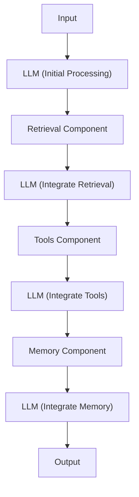
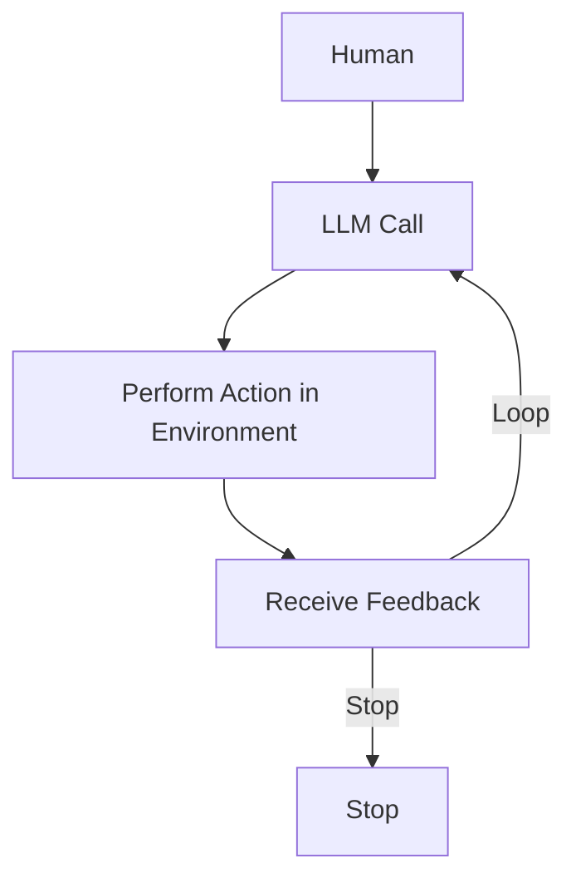
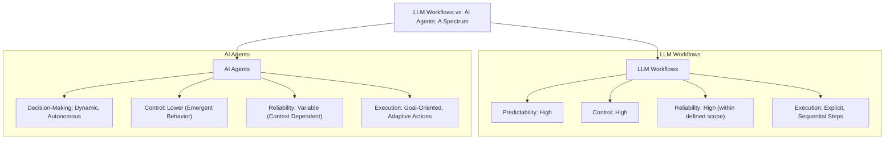
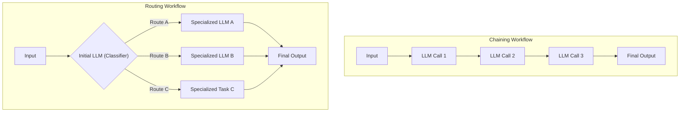
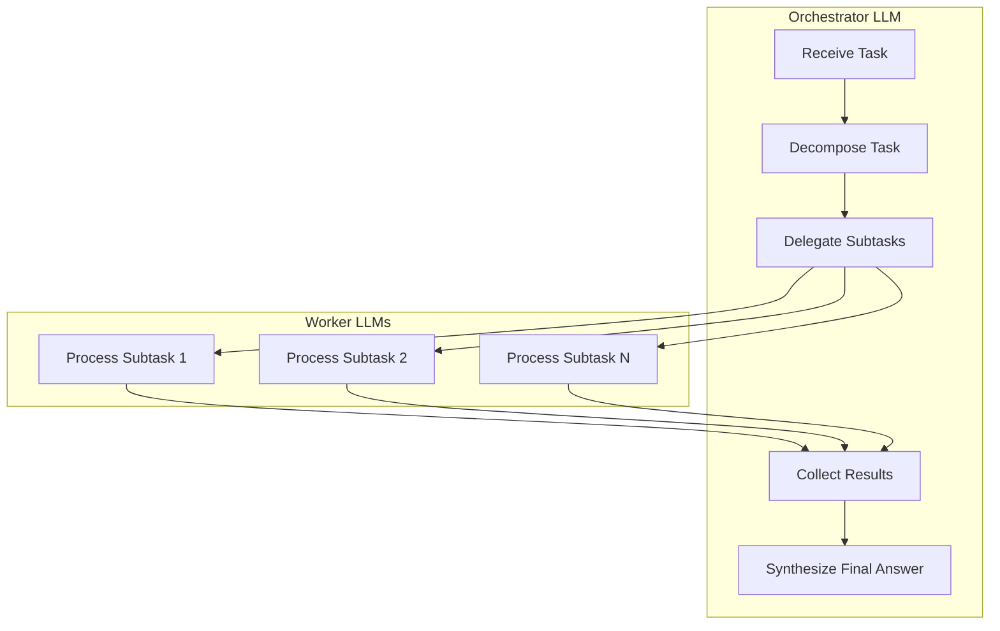
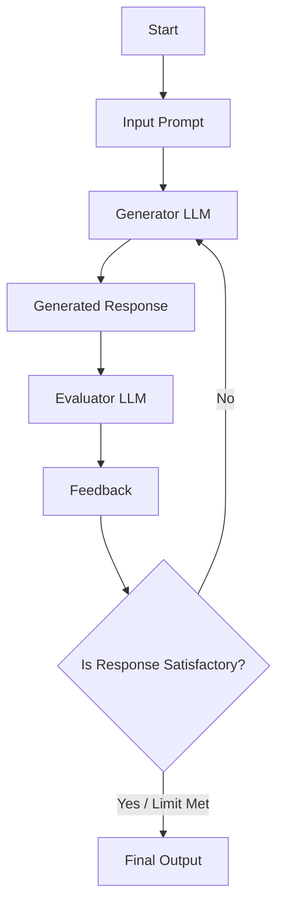
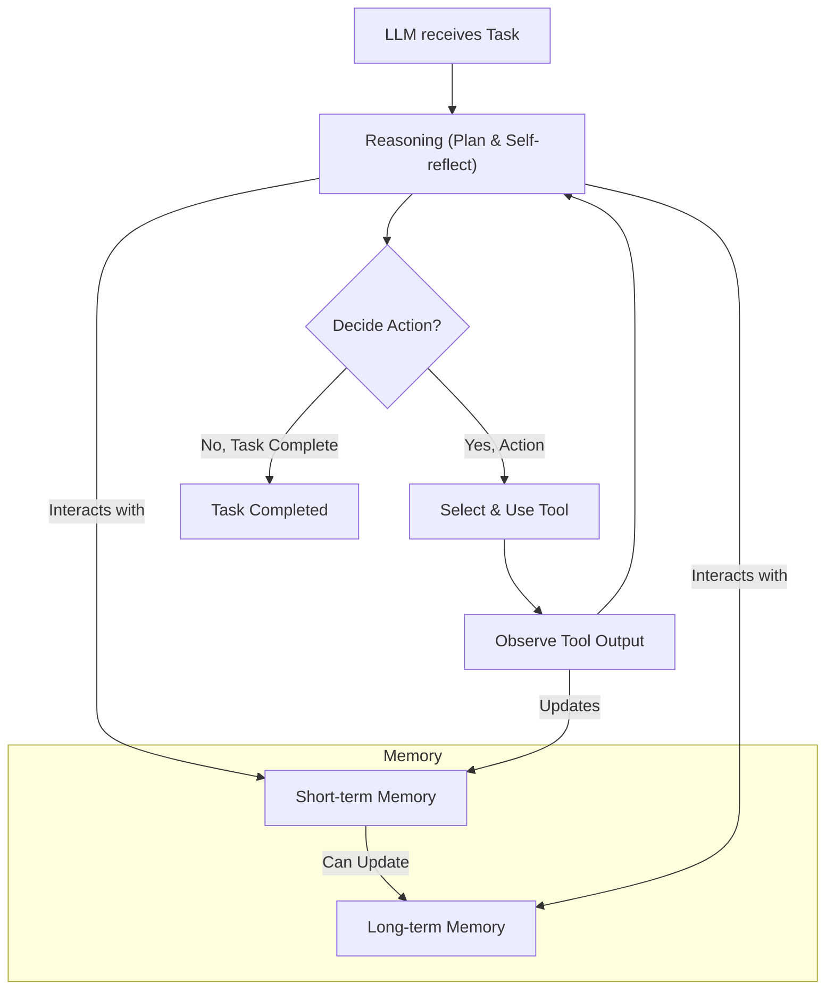
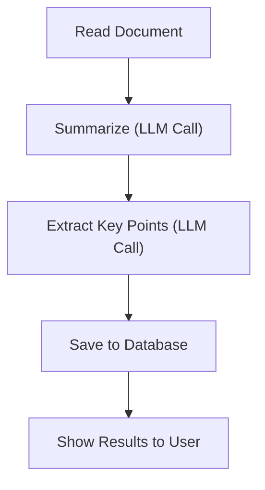
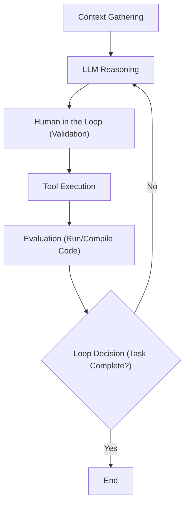
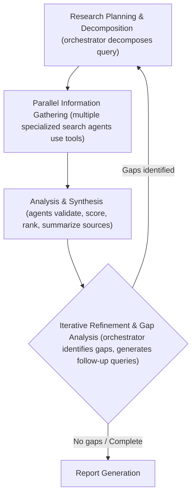

# Workflows, Agents and The Autonomy Slider
### What only the top 10% AI engineers who ship think about

As an AI engineer preparing to build your first real AI application, after narrowing down the problem you want to solve, one key decision is how to design your AI solution. Should it follow a predictable, step-by-step workflow, or does it demand a more autonomous approach, where the LLM makes self-directed decisions along the way? Thus, one of the fundamental questions that will determine the success or failure of your project is: How should you architect your AI system?

This architectural fork in the road is deceptive. It looks like a simple technical choice, but it is actually a product and business decision that impacts everything from development costs to user trust.

Choose the wrong approach, and you might end up with an overly rigid system that breaks when users deviate from expected patterns or developers try to add new features. Conversely, you might build an unpredictable agent that works brilliantly 80% of the time but fails catastrophically when it matters most, burning through your API budget in infinite loops. In the worst case, you could waste months of development time rebuilding the entire architecture because the chosen path could not scale with the complexity of the real world.

In the 2024-2025 landscape, we have seen billion-dollar AI startups succeed or fail based primarily on this architectural decision [[1]](https://techcrunch.com/2025/06/18/here-are-the-24-us-ai-startups-that-have-raised-100m-or-more-in-2025/). The successful companies, teams, and AI engineers know when to use workflows versus agents, and more importantly, how to combine both approaches effectively.

By the end of this lesson, we will provide you with a framework to make these critical decisions confidently. You will understand the fundamental trade-offs, see real-world examples from leading AI companies like Google and Perplexity, and learn how to design systems that leverage the best of both approaches.

## Understanding the Spectrum: From Workflows to Agents

To choose between workflows and agents, you need a clear understanding of what they are. At this point, we do not focus on the technical specifics of each, but rather on their properties and how they are used.

**LLM workflows** are sequences of tasks involving LLM calls or other operations such as reading and writing data to a database or file system. They are largely predefined and orchestrated by developer-written code. The defining characteristic here is that the steps are defined in advance, resulting in deterministic or rule-based paths with predictable execution and explicit control flow [[2]](https://blog.gopenai.com/agentic-workflows-vs-autonomous-ai-agents-do-you-know-the-difference-c21c9bfb20ac), [[3]](https://www.louisbouchard.ai/agents-vs-workflows/).

Think of a workflow as a factory assembly line. The raw material (input) moves through specific stations (LLM calls/functions), getting processed in a specific order to produce the final product (output).


Image 1: A flowchart illustrating a simple LLM workflow with sequential interactions with Retrieval, Tools, and Memory components.

**AI agents**, on the other hand, are systems where an LLM plays a central role in dynamically deciding the sequence of steps, reasoning, and actions to achieve a goal. Here, the steps are not defined in advance. They are dynamically planned based on the task and the current state of the environment [[4]](https://cloud.google.com/discover/what-are-ai-agents).

If workflows are assembly lines, an agent is a skilled human expert tackling an unfamiliar problem. They have a goal, access to actions (tools), and they adapt their strategy in the moment after each "Eureka" or "Oops" moment.


Image 2: A flowchart illustrating a simple AI agent system.

Both workflows and agents require an **orchestration layer**, but their nature differs. In workflows, the orchestration executes a defined plan—it is the conductor following a score. In agents, the orchestration facilitates the LLM's dynamic planning and execution—it is the improv jazz band leader responding to what just happened [[5]](https://www.anthropic.com/engineering/building-effective-agents).

## Choosing Your Path

Now that we have defined them, let's explore their core differences: Developer-defined logic versus LLM-driven autonomy.

In reality, this is not a binary choice. The decision between workflows and agents exists on a spectrum, which we call the "autonomy slider." At one end, you have fully controlled workflows; at the other, fully autonomous agents.


Image 3: A diagram illustrating the spectrum between LLM workflows and AI agents, highlighting their core differences in predictability, control, reliability, and execution.

### When to use LLM workflows

Workflows are best for structured, repeatable tasks where the path to the solution is known. Examples include pipelines for data extraction and transformation from sources like the web or Slack, automated report generation, or document summarization followed by translation. They shine in content repurposing, such as taking an article and transforming it into a LinkedIn post [[6]](https://towardsdatascience.com/a-developer-s-guide-to-building-scalable-ai-workflows-vs-agents/).

The primary strength of workflows is **predictability**. Because the execution path is fixed, costs and latency are consistent, and debugging is straightforward. You can often leverage simpler, smaller models specialized in specific sub-tasks, which lowers operational costs and infrastructure overhead.

However, they can be rigid. Developing a workflow often requires more time upfront to engineer each step manually. The user experience can feel constrained because the system cannot handle unexpected scenarios outside its code path.

Workflows are usually preferred in enterprise or regulated fields like finance or healthcare. When a financial advisor asks for a report, it must contain the correct information every time. In healthcare, AI tools must work with high accuracy as they impact lives. In these high-stakes environments, consistency trumps creativity [[7]](https://www.deloitte.com/us/en/insights/industry/technology/technology-media-and-telecom-predictions/2025/autonomous-generative-ai-agents-still-under-development.html). They are also ideal for MVPs requiring rapid deployment and scenarios where high throughput (thousands of requests per minute) is more important than complex reasoning.

### When to use AI agents

Agents excel at open-ended, dynamic problems. Use them for research synthesis (e.g., "Find everything about the history of transistors"), dynamic problem-solving like debugging code, or completing tasks in unfamiliar environments, such as booking a flight without a specific API [[4]](https://cloud.google.com/discover/what-are-ai-agents).

Their strength is **adaptability**. They can handle ambiguity and novelty because the steps are dynamically decided.

The weakness is that the system becomes prone to errors. As the agent is non-deterministic, performance, latency, and costs can vary with each run. Agents often require larger, more capable LLMs to reason effectively, making them more expensive. They also require more LLM calls to understand intent and take actions, compounding the cost. If not designed well, there are significant security concerns—an autonomous agent with write permissions could delete data or send inappropriate emails.

There is a running joke in the developer community about the current state of coding agents: "The agent deleted my entire codebase, but that's okay, I wanted to start a new project anyway."

### The Autonomy Slider and Hybrid Approaches

Most real-world systems are not pure workflows or pure agents. They are hybrid systems that adopt the best of both worlds.

When building an application, you decide where to set the "autonomy slider." A manual process involves a workflow with a human verifying intermediate steps. A more automated one gives the agent greater control with fewer checkpoints. Successful applications like Cursor and Perplexity let the user control this slider. In Cursor, you can tab to complete code (low autonomy), use CMD+K to generate a block (medium), or use Composer to refactor a whole feature (high autonomy) [[8]](https://www.youtube.com/watch?v=LCEmiRjPEtQ).

The ultimate goal is to speed up the loop between AI generation and human verification.

```mermaid
graph TD
    A["AI Generates Content"]
    B{"Human Reviews/Verifies"}
    C["Content Accepted"]
    D["Refinement Needed"]

    A --> B
    B -->| "Verified" | C
    B -->| "Needs Refinement" | D
    D --> A
```
Image 4: A flowchart illustrating the AI generation and human verification loop.

## Exploring Common Patterns

To navigate the AI Engineering world, you need to understand the common patterns used to build these systems. We will introduce them here to build your intuition, and we will dig into the technical implementation in future lessons.

### LLM Workflow Patterns

**Chaining and Routing:** These are the foundational blocks. Chaining connects multiple LLM calls sequentially—output A becomes input B. Routing acts as a traffic controller, using an LLM to classify an input and directing it to the appropriate downstream path.


Image 5: A flowchart illustrating LLM workflow patterns of chaining and routing.

**Orchestrator-Worker:** This pattern bridges the gap between workflows and agents. A central LLM (the orchestrator) understands the user intent, dynamically plans the necessary sub-tasks, and delegates them to specialized workers. The workers execute the tasks—often in parallel—and the orchestrator synthesizes the results [[5]](https://www.anthropic.com/engineering/building-effective-agents).


Image 6: A flowchart illustrating the orchestrator-worker LLM workflow pattern.

**Evaluator-Optimizer Loop:** This pattern is used to auto-correct LLM outputs. An "LLM reviewer" analyzes the initial output, creates a feedback report (reflection), and passes it back to the generator to improve the answer. It mimics a human writer refining a draft based on an editor's notes.


Image 7: A loop diagram illustrating the evaluator-optimizer LLM workflow pattern.

### Core Components of a ReAct AI Agent

The industry standard for building agents is the **ReAct** (Reason and Act) pattern. At a high level, it loops through a cycle of reasoning about what to do, acting on that decision, and observing the result.

The core components include:
*   **LLM:** The brain that plans actions and interprets outputs.
*   **Actions:** The capability to interact with the external environment (e.g., search the web, run code). We will explore this concept, often called "tools," in Lesson 6.
*   **Short-term Memory:** The working context of the agent, similar to RAM in a computer.
*   **Long-term Memory:** Used to access factual data (like company databases) and remember user preferences. We will cover this in Lesson 9.


Image 8: A flowchart illustrating the high-level dynamics of a ReAct AI agent.

## Zooming In on Our Favorite Examples

To anchor these concepts in reality, let's look at three examples ranging from a simple workflow to a complex hybrid system.

### Document Summarization Workflow

When working in teams, finding the right document is time-consuming. Large documents are hard to scan, so embedded summarization features are essential.

This is a perfect example of a pure workflow. It must be fast, cheap, and consistent.


Image 9: A flowchart illustrating the document summarization and analysis workflow by Gemini in Google Workspace.

The system reads the document, chains an LLM call to generate a summary, chains another call to extract metadata like tags, saves the results, and displays them. There is no complex decision-making; it is a straight line from input to output [[9]](https://workspaceupdates.googleblog.com/2025/06/summarize-responses-with-gemini-google-forms.html), [[10]](https://workspace.google.com/blog/product-announcements/may-workspace-feature-drop-new-ai-features).

### Coding Agents: Gemini CLI

Writing code requires reading documentation, understanding existing codebases, and knowing syntax. A coding assistant helps speed this up. The Gemini CLI tool leverages the ReAct architecture to implement a single-agent system for coding [[11]](https://blog.google/technology/developers/introducing-gemini-cli-open-source-ai-agent/), [[12]](https://cloud.google.com/gemini/docs/codeassist/gemini-cli).

Based on our research from August 2025, here is how it works at a high level:

1.  **Context Gathering:** The system loads the directory structure and conversation history into its working memory.
2.  **LLM Reasoning:** The model analyzes the request against the current context to plan necessary actions.
3.  **Human in the Loop:** Before executing potentially destructive actions, it validates the plan with the user.
4.  **Tool Execution:** It executes actions—like reading files, searching the web for docs, or generating code diffs. It then observes the output.
5.  **Evaluation:** It dynamically evaluates the generated code, perhaps by running a compiler or linter.
6.  **Loop Decision:** The agent decides if the task is done or if it needs to repeat the cycle to fix errors.


Image 10: A flowchart illustrating the operational loop of the Gemini CLI coding assistant.

### Deep Research Hybrid Agents

Researching a new topic is daunting. You don't know where to start or which sources to trust. Perplexity's Deep Research agent solves this using a hybrid system that combines ReAct reasoning with workflow patterns [[13]](https://www.perplexity.ai/hub/blog/introducing-perplexity-deep-research).

Unlike the single-agent Gemini CLI, this system likely uses multiple specialized agents orchestrated in parallel. While the code is closed-source, we can infer the architecture:

1.  **Research Planning & Decomposition:** The orchestrator analyzes the query and breaks it down into targeted sub-questions using the orchestrator-worker pattern.
2.  **Parallel Information Gathering:** Specialized search agents run in parallel for each sub-question. They use web search actions to gather information in isolation, keeping input tokens manageable.
3.  **Analysis & Synthesis:** Each agent validates and scores its sources based on credibility and relevance, ranking the top results.
4.  **Iterative Refinement:** The orchestrator reviews the aggregated findings to identify knowledge gaps. If gaps exist, it generates follow-up queries and repeats the cycle.
5.  **Report Generation:** Finally, it compiles everything into a report with inline citations.


Image 11: Flowchart illustrating the iterative multi-step process of Perplexity's Deep Research agent.

This hybrid approach combines the structured planning of workflows with the dynamic adaptation of agents.

## Conclusion: The Challenges of Every AI Engineer

Now that you understand the spectrum from LLM workflows to AI agents, it is important to recognize that every AI Engineer—whether at a startup or a Fortune 500 company—faces these same fundamental challenges.

You will constantly battle a reliability crisis where your agent works perfectly in demos but becomes unpredictable with real users. You will face context limits where systems lose coherence across long conversations. You will struggle with data integration, ensuring garbage-in doesn't lead to garbage-out. You will face the cost-performance trap, where sophisticated agents are technically impressive but economically unviable. And you will always have to mitigate security concerns regarding autonomous write permissions.

The good news is that these challenges are solvable. In upcoming lessons, we will cover patterns for building reliable products through specialized evaluation pipelines, strategies for building hybrid systems, and ways to keep costs under control.

By the end of this course, you will have the knowledge to architect AI systems that are not only powerful but also robust and safe. You will know when to use workflows versus agents and how to build effective hybrid systems that work in the real world.

In the next lesson, **Lesson 3**, we will dive deep into the specific **Workflow Patterns** we introduced today. We will explore how to implement chaining, routing, and the orchestrator-worker pattern in code, laying the groundwork for the more complex agentic concepts like **tools** and **ReAct** coming later in the course.

## References

1. Butcher, M. (2025, June 18). Here are the 24 U.S. AI startups that have raised $100M or more in 2025. TechCrunch. https://techcrunch.com/2025/06/18/here-are-the-24-us-ai-startups-that-have-raised-100m-or-more-in-2025/
2. (n.d.). Agentic workflows vs autonomous AI agents — Do you know the difference?. GOpenAI. https://blog.gopenai.com/agentic-workflows-vs-autonomous-ai-agents-do-you-know-the-difference-c21c9bfb20ac
3. Bouchard, L. (n.d.). Real agents vs. workflows: The truth behind AI 'agents'. Louis Bouchard. https://www.louisbouchard.ai/agents-vs-workflows/
4. (n.d.). What is an AI agent?. Google Cloud. https://cloud.google.com/discover/what-are-ai-agents
5. Schluntz, E., & Zhang, B. (n.d.). Building effective agents. Anthropic. https://www.anthropic.com/engineering/building-effective-agents
6. (n.d.). A Developer’s Guide to Building Scalable AI: Workflows vs Agents. Towards Data Science. https://towardsdatascience.com/a-developer-s-guide-to-building-scalable-ai-workflows-vs-agents/
7. (n.d.). Autonomous generative AI agents are still under development. Deloitte. https://www.deloitte.com/us/en/insights/industry/technology/technology-media-and-telecom-predictions/2025/autonomous-generative-ai-agents-still-under-development.html
8. Karpathy, A. (n.d.). Software in the era of AI. Y Combinator. https://www.youtube.com/watch?v=LCEmiRjPEtQ
9. (2025, June). Summarize responses with Gemini in Google Forms. Google Workspace Updates. https://workspaceupdates.googleblog.com/2025/06/summarize-responses-with-gemini-google-forms.html
10. (2025, May). New AI features to help you work smarter in Google Workspace. Google Workspace Blog. https://workspace.google.com/blog/product-announcements/may-workspace-feature-drop-new-ai-features
11. (n.d.). Introducing Gemini CLI: your open-source AI agent. Google Blog. https://blog.google/technology/developers/introducing-gemini-cli-open-source-ai-agent/
12. (n.d.). Gemini CLI. Google Cloud. https://cloud.google.com/gemini/docs/codeassist/gemini-cli
13. (n.d.). Introducing Perplexity Deep Research. Perplexity Blog. https://www.perplexity.ai/hub/blog/introducing-perplexity-deep-research