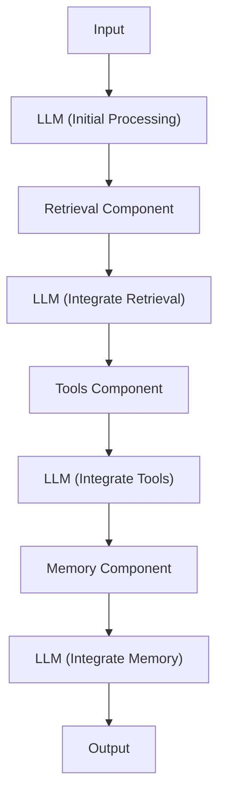
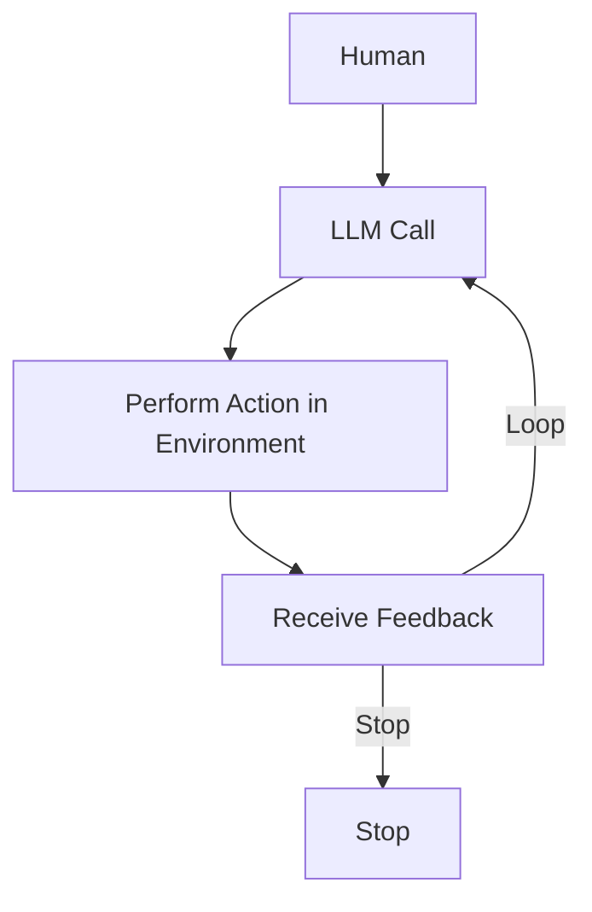
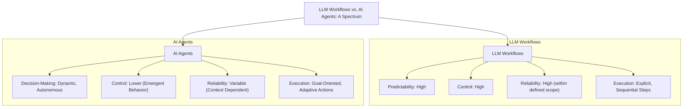
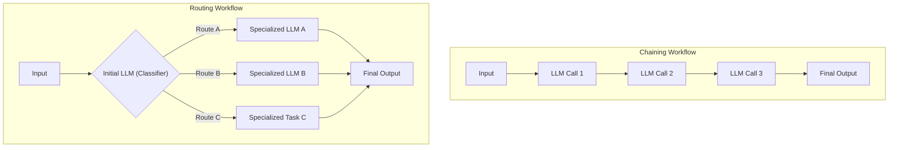
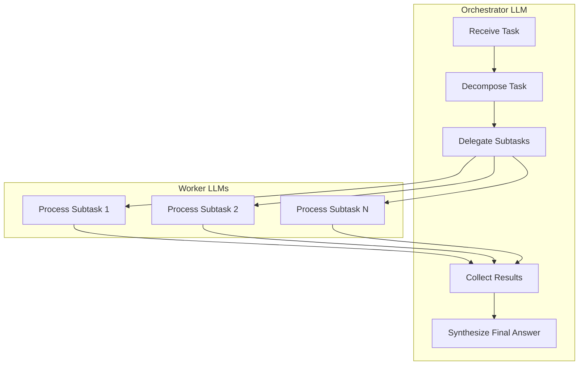
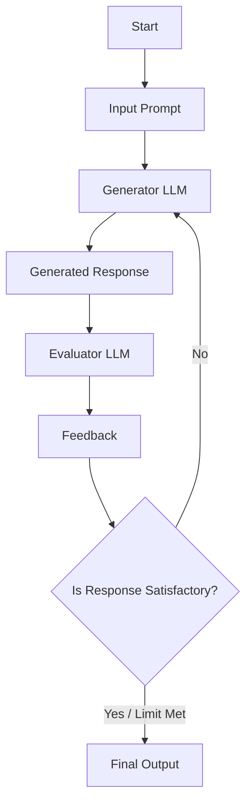
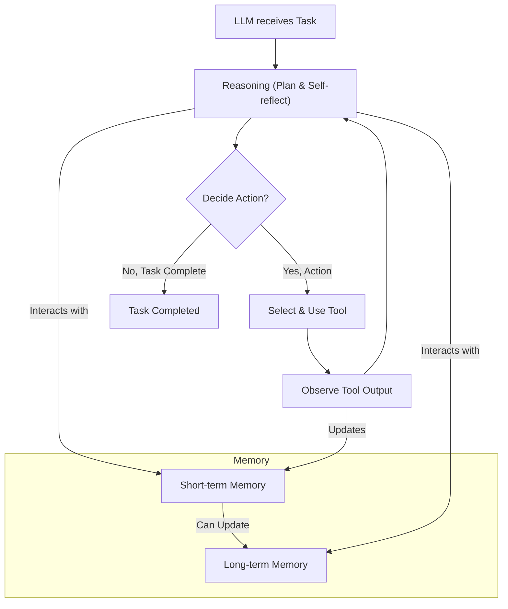
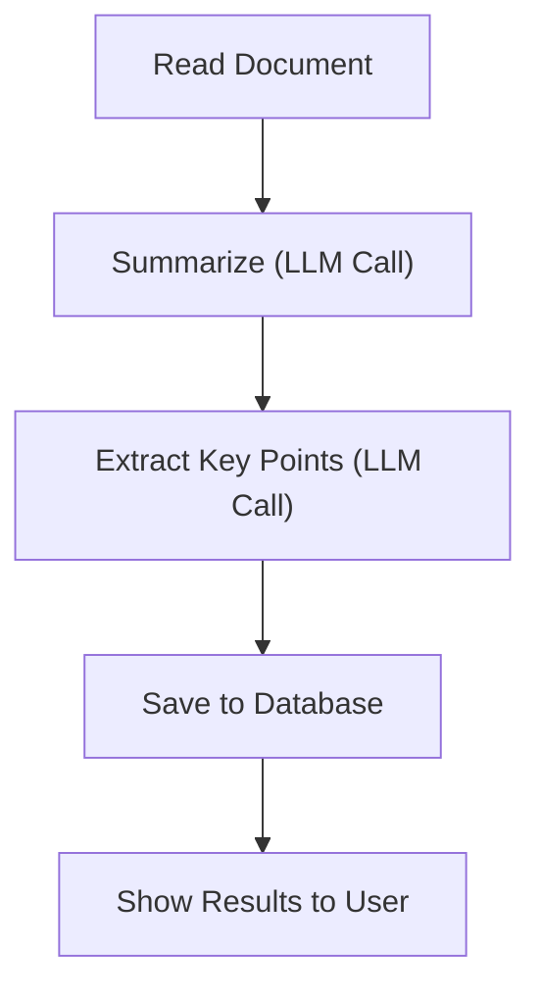
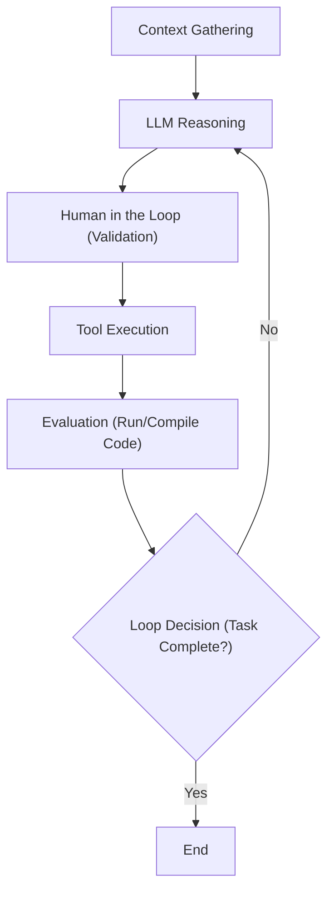
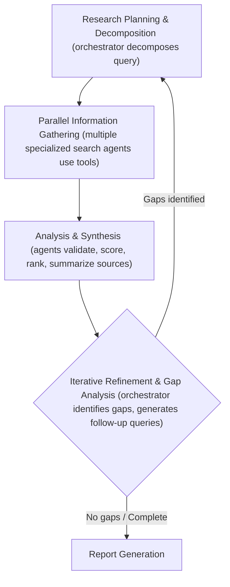

# Workflows, Agents and The Autonomy Slider
### What only the top 10% AI engineers who ship think about

## Introduction: The Critical Decision Every AI Engineer Faces

As an AI engineer preparing to build your first real AI application, after narrowing down the problem you want to solve, one key decision is how to design your AI solution. Should it follow a predictable, step-by-step workflow, or does it demand a more autonomous approach, where the LLM makes self-directed decisions along the way? Thus, one of the fundamental questions that will determine the success or failure of your project is: How should you architect your AI system?

This architectural fork in the road is deceptive. It looks like a simple technical choice, but it is actually a product and business decision that impacts everything from development costs to user trust. When building AI applications, engineers face this critical architectural decision early in their development process. Should they create a predictable, step-by-step workflow where they control every action, or should they build an autonomous agent that can think and decide for itself? This is one of the key decisions that will impact everything from the product, such as development time and costs, to reliability and user experience.

Choose the wrong approach, and you might end up with an overly rigid system that breaks when users deviate from expected patterns or when developers try to add new features. Conversely, you might build an unpredictable agent that works brilliantly 80% of the time but fails catastrophically when it matters most. It might burn through your API budget in infinite loops or hallucinate actions that damage user data. In the worst case, you could waste months of development time rebuilding the entire architecture because the chosen path could not scale with the complexity of the real world. You might face frustrated users who cannot rely on the AI application, or frustrated executives who cannot afford to keep the AI agent running as the costs are too high relative to the profits.

In the 2024-2025 landscape, we have seen billion-dollar AI startups succeed or fail based primarily on this architectural decision [[1]](https://techcrunch.com/2025/06/18/here-are-the-24-us-ai-startups-that-have-raised-100m-or-more-in-2025/). The successful companies, teams, and AI engineers know when to use workflows versus agents, and more importantly, how to combine both approaches effectively.

By the end of this lesson, we will provide you with a framework to make these critical decisions confidently. You will understand the fundamental trade-offs between the two methodologies. You will see real-world examples from leading AI companies like Google and Perplexity to understand how they apply these concepts in production. Finally, you will learn how to design systems that use the best of both approaches, creating hybrid architectures that are both robust and flexible.

## Understanding the Spectrum: From Workflows to Agents

To choose between workflows and agents, you need a clear understanding of what they are. At this point, we do not focus on the technical specifics of each, but rather on their properties and how they are used.

**LLM workflows** are sequences of tasks involving LLM calls or other operations. These operations include reading and writing data to a database or file system. They are largely predefined and orchestrated by developer-written code. The defining characteristic here is that the steps are defined in advance. This results in deterministic or rule-based paths with predictable execution and explicit control flow. You define the logic, and the LLM acts as a processor within that logic [[2]](https://blog.gopenai.com/agentic-workflows-vs-autonomous-ai-agents-do-you-know-the-difference-c21c9bfb20ac), [[3]](https://www.louisbouchard.ai/agents-vs-workflows/).

Think of a workflow as a factory assembly line. The raw material (input) moves through specific stations (LLM calls/functions). It gets processed in a specific order to produce the final product (output). Every step is accounted for. Every outcome is anticipated. If station A fails, we know exactly why, and we know exactly where to look. In future lessons, we will explore specific workflow patterns like chaining, routing, and the orchestrator-worker pattern that help structure these assembly lines.


Image 1: A flowchart illustrating a simple LLM workflow with sequential interactions with Retrieval, Tools, and Memory components. (Source [Anthropic [5]](https://www.anthropic.com/engineering/building-effective-agents))

**AI agents**, on the other hand, are systems where an LLM plays a central role in dynamically deciding the sequence of steps. It decides the reasoning and actions to achieve a goal. Here, the steps are not defined in advance. They are dynamically planned based on the task and the current state of the environment. The agent perceives its context, reasons about what to do next, and acts upon it [[4]](https://cloud.google.com/discover/what-are-ai-agents).

If workflows are assembly lines, an agent is a skilled human expert tackling an unfamiliar problem. They have a goal. They have access to actions (tools). They adapt their strategy in the moment after each "Eureka" or "Oops" moment. They might try one path, hit a dead end, and backtrack. They might realize they need more information and perform a search. This autonomy is powerful because it allows the system to handle novelty, but it is also dangerous because it introduces unpredictability. In future lessons, we will dive deep into the concepts that make this possible, such as tools, memory, and the ReAct pattern.


Image 2: A flowchart illustrating a simple AI agent system. (Source [Google Cloud [4]](https://cloud.google.com/discover/what-are-ai-agents))

Both workflows and agents require an **orchestration layer**, but their nature differs. In workflows, the orchestration executes a defined plan. It is the conductor following a score. In agents, the orchestration facilitates the LLM's dynamic planning and execution. It is the improv jazz band leader responding to what just happened [[5]](https://www.anthropic.com/engineering/building-effective-agents).

## Choosing Your Path

Now that we have defined them, let's explore their core differences: Developer-defined logic versus LLM-driven autonomy.

In reality, this is not a binary choice. The decision between workflows and agents exists on a spectrum. We call this the "autonomy slider." At one end, you have fully controlled workflows. At the other, fully autonomous agents.


Image 3: A diagram illustrating the spectrum between LLM workflows and AI agents, highlighting their core differences in predictability, control, reliability, and execution. (Source [Towards Data Science [6]](https://towardsdatascience.com/a-developer-s-guide-to-building-scalable-ai-workflows-vs-agents/))

### When to use LLM workflows

Workflows are best for structured, repeatable tasks where the path to the solution is known. Examples include pipelines for data extraction and transformation from sources like the web, messaging tools like Slack, video calls from Zoom, project management tools like Notion, and cloud storage tools like Google Drive. They are great for automated report or email generation from multiple data sources. They work well for document summarization followed by translation. They shine in content repurposing, such as taking an article and transforming it into a LinkedIn post [[6]](https://towardsdatascience.com/a-developer-s-guide-to-building-scalable-ai-workflows-vs-agents/).

The primary strength of workflows is **predictability**. Because the execution path is fixed, costs and latency are consistent. Debugging is straightforward because you can trace the exact path the data took. You can often use simpler, smaller models specialized in specific sub-tasks. This lowers operational costs and infrastructure overhead. You don't need a massive reasoning model to just extract a date from an email. A smaller, cheaper model will do just fine in a workflow.

However, they can be rigid. Developing a workflow often requires more time upfront to engineer each step manually. The user experience can feel constrained because the system cannot handle unexpected scenarios outside its code path. If the input format changes slightly, the whole pipeline might break. Adding new features can get complex when the application grows, similar to developing standard software tools.

Workflows are usually preferred in enterprise or regulated fields like finance or healthcare. When a financial advisor asks for a report, it must contain the correct information every time, as it has a direct impact on people's money and life. In healthcare, AI tools must work with high accuracy as they impact lives. In these high-stakes environments, consistency trumps creativity [[7]](https://www.deloitte.com/us/en/insights/industry/technology/technology-media-and-telecom-predictions/2025/autonomous-generative-ai-agents-still-under-development.html). They are also ideal for MVPs requiring rapid deployment by hardcoding features. They are best for scenarios where cost per request matters more than sophisticated reasoning (thousands of requests per minute).

Let's be real for a second. Most "AI Agents" you see on Twitter demos are actually just well-crafted workflows. And that is fine. In fact, that is usually better. You want your software to work. You don't want it to "think" about whether it wants to work today.

### When to use AI agents

Agents excel at open-ended, dynamic problems. Use them for open-ended research and synthesis (e.g., researching about WW2). Use them for dynamic problem-solving like debugging code or complex customer support. Use them for interactive task completion in unfamiliar environments, such as booking a flight where we don't specify the exact sites to use [[4]](https://cloud.google.com/discover/what-are-ai-agents).

Their strength is **adaptability**. They can handle ambiguity and novelty because the steps are dynamically decided. They can recover from errors. They can try alternative paths. They can adapt to new situations without requiring a code rewrite.

The weakness is that the system becomes prone to errors. As the agent is non-deterministic, performance, latency, and costs can vary with each run, making agents often unreliable. Agents often require larger, more capable LLMs to reason effectively. This makes them more expensive. They also require more LLM calls to understand intent and take actions. This compounds the cost.

If not designed well, there are significant security concerns. An autonomous agent with write permissions could delete data. It could send inappropriate emails. It could hallucinate a command that wipes your database. A huge disadvantage of AI agents is that they are hard to debug and evaluate.

There is a running joke in the developer community about the current state of coding agents. "The agent deleted my entire codebase. But that's okay. I wanted to start a new project anyway." This is funny because it is true. We are still in the early days where reliability is the biggest bottleneck.

### The Autonomy Slider and Hybrid Approaches

Most real-world systems are not pure workflows or pure agents. They are hybrid systems that adopt the best of both worlds. Thus, in reality, we have a spectrum, a gradient between LLM workflows and AI agents, where a system adopts what's best from both worlds depending on its use cases.

When building an application, you decide where to set the "autonomy slider." A manual process involves a workflow with a human verifying intermediate steps. A more automated one gives the agent greater control with fewer human-in-the-loop checkpoints. Successful applications like Cursor and Perplexity let the user control this slider. In Cursor, you can tab to complete code (low autonomy). You can use CMD+K to generate a block (medium). Or you can use Composer to refactor a whole feature (high autonomy) [[8]](https://www.youtube.com/watch?v=LCEmiRjPEtQ).

The ultimate goal is to speed up the loop between AI generation and human verification, which is often achieved through good workflows/agentic architecture and well-designed UI/UX platforms.

```mermaid
graph TD
    A["AI Generates Content"]
    B{"Human Reviews/Verifies"}
    C["Content Accepted"]
    D["Refinement Needed"]

    A --> B
    B -->| "Verified" | C
    B -->| "Needs Refinement" | D
    D --> A
```
Image 4: A flowchart illustrating the AI generation and human verification loop. (Source [Andrej Karpathy [8]](https://www.youtube.com/watch?v=LCEmiRjPEtQ))

## Exploring Common Patterns

To navigate the AI Engineering world, you need to understand the most common patterns used to build these systems. We will introduce them here to build your intuition. We will dig into the technical implementation in future lessons.

### LLM Workflow Patterns

**Chaining and Routing:** These are the foundational blocks. Chaining connects multiple LLM calls sequentially. Output A becomes input B. This allows you to break down complex tasks into manageable chunks. Routing acts as a traffic controller. It uses an LLM to classify an input. It directs it to the appropriate downstream path. This ensures that specialized prompts handle specific types of requests. As a first automation step, it helps gluing together multiple LLM calls and deciding between multiple appropriate options.


Image 5: A flowchart illustrating LLM workflow patterns of chaining and routing. (Source [Anthropic [5]](https://www.anthropic.com/engineering/building-effective-agents))

**Orchestrator-Worker:** This pattern bridges the gap between workflows and agents. A central LLM (the orchestrator) understands the user intent. It dynamically plans the necessary sub-tasks. It delegates them to specialized workers. The workers execute the tasks. This often happens in parallel. The orchestrator then synthesizes the results. This is powerful because it allows for dynamic decomposition of problems while keeping the execution of sub-tasks relatively deterministic [[5]](https://www.anthropic.com/engineering/building-effective-agents).


Image 6: A flowchart illustrating the orchestrator-worker LLM workflow pattern. (Source [Anthropic [5]](https://www.anthropic.com/engineering/building-effective-agents))

**Evaluator-Optimizer Loop:** This pattern is used to auto-correct LLM outputs based on automated feedback. An "LLM reviewer" analyzes the initial output. It creates a feedback report (reflection). It passes it back to the generator to improve the answer. It mimics a human writer refining a draft based on an editor's notes. This loop can significantly improve quality without requiring a smarter model. It just requires a model that is good at critiquing.


Image 7: A loop diagram illustrating the evaluator-optimizer LLM workflow pattern. (Source [Anthropic [5]](https://www.anthropic.com/engineering/building-effective-agents))

### Core Components of a ReAct AI Agent

The industry standard for building agents is the **ReAct** (Reason and Act) pattern. At a high level, it loops through a cycle of reasoning about what to do, acting on that decision, and observing the result. This repeats until the given task is completed.

The core components include:
*   **LLM:** The brain that plans actions and interprets outputs from tools.
*   **Tools:** The capability to interact with the external environment (e.g., search the web, run code). We will explore this concept in Lesson 6.
*   **Short-term Memory:** The working context of the agent. It is similar to RAM in a computer.
*   **Long-term Memory:** Used to access factual data (like public websites or company databases) and remember user preferences. We will cover this in Lesson 9.

Almost all modern agents from the industry use the ReAct pattern as it has shown the most potential.


Image 8: A flowchart illustrating the high-level dynamics of a ReAct AI agent. (Source [Google Blog [11]](https://blog.google/technology/developers/introducing-gemini-cli-open-source-ai-agent/))

## Zooming In on Our Favorite Examples

To better anchor you in the world of LLM workflows and AI agents, we want to introduce some concrete examples. We will progress from a simple workflow to a single-agent system, and finally to a more advanced hybrid solution.

### Document Summarization Workflow

**The Problem:** When working in teams, finding the right document is often a time-consuming process. Many documents are large, making it hard for us to understand which one contains the right information without reading them all. Thus, a quick, embedded summarization feature can guide our search strategies and save hours of manual review.

This is a perfect example of a pure workflow. It must be fast. It must be cheap. It must be consistent.


Image 9: A flowchart illustrating the document summarization and analysis workflow by Gemini in Google Workspace. (Source [Google Workspace Updates [9]](https://workspaceupdates.googleblog.com/2025/06/summarize-responses-with-gemini-google-forms.html))

The system reads the document content. It chains an LLM call to generate a summary. It chains another call to extract metadata like tags or key points. It saves the results to a database. Finally, it displays them to the user. There is no complex decision-making or autonomy here. It is a straight line from input to output, ensuring reliability and speed [[9]](https://workspaceupdates.googleblog.com/2025/06/summarize-responses-with-gemini-google-forms.html), [[10]](https://workspace.google.com/blog/product-announcements/may-workspace-feature-drop-new-ai-features).

### Coding Agents: Gemini CLI

**The Problem:** Writing code is a time-consuming process. You have to read boring documentation or outdated blogs. When working on new codebases, understanding the existing structure is slow. When working with a new programming language, you often need a bootcamp before writing any industry-level code. That's where a coding assistant can help you speed up writing code on existing and new codebases.

To build up the intuition on agents, we present at a very high and intuitive level how the Gemini CLI tool uses the ReAct (Reason and Act) agent architecture to implement a single-agent system for coding. This is how Gemini CLI works based on our latest research from August 2025. It is open-sourced on GitHub, implemented in TypeScript, and shares similarities with tools like Cursor, Windsurf, Claude Code, and Warp.

Its use cases include writing code from scratch (vibe coding), assisting engineers by writing specific functions, supporting documentation writing, and helping developers quickly understand new codebases.

Here is how the ReAct pattern drives this agent:

1.  **Context Gathering:** The system loads the directory structure, available tools (actions), and the conversation history (context) into its working memory (state).
2.  **LLM Reasoning:** The Gemini model analyzes the user input against the current context to understand what actions it requires to take to adapt the code as requested by the user. It proposes a plan.
3.  **Human in the Loop:** Before taking any actions, especially potentially destructive ones, it validates the execution plan with the user.
4.  **Tool Execution:** The selected actions, known as tools, are executed. These tools include file system access (like `grep` to read specific functions or listing directory structures), coding tools (like code interpreting or generating diffs), web search (for documentation and solutions), and version control (like `git` to commit changes). The agent then processes the tool outputs and adds the results into the conversation context to reference them in future iterations.
5.  **Evaluation:** The agent dynamically evaluates whether the generated code is correct or not by running or compiling the code.
6.  **Loop Decision:** The agent determines if the task is completed. If not, it repeats steps 2 to 5 by planning and executing more tools to fix errors or continue the task.


Image 10: A flowchart illustrating the operational loop of the Gemini CLI coding assistant. (Source [Google Blog [11]](https://blog.google/technology/developers/introducing-gemini-cli-open-source-ai-agent/))

### Deep Research Hybrid Agents

**The Problem:** Researching a brand new topic is a scary thing to do. Most of the time we don't know where to start. What is the right blog, paper, YouTube video, or course to start reading? Also, for more trivial questions, most of the time, we don't have the time to dig into too many resources. That's why having a research assistant that quickly scans the internet into a report can provide a huge boost in your learning process on scientific, financial, or social topics.

Perplexity's Deep Research agent is a hybrid system that combines ReAct reasoning with LLM workflow patterns to do autonomous research at an expert level. Unlike single-agent approaches, like the Gemini CLI one, this system uses multiple specialized agents that are orchestrated in parallel by workflows. They perform dozens of searches across hundreds of sources to synthesize comprehensive research reports within 2-4 minutes.

While the solution is closed-source, based on our research from August 2025, here is an oversimplified version of how it works:

1.  **Research Planning & Decomposition:** The orchestrator analyzes the research question and decomposes it into a set of targeted sub-questions. It uses the orchestrator-worker pattern to deploy multiple research agents with different sub-questions.
2.  **Parallel Information Gathering:** For each sub-question, to optimize and move faster in the search space, the system runs specialized search agents in parallel. These agents use tools such as web searches and document retrieval to gather as much information as possible for that specific question. As the research agents are isolated from each other, the input tokens are smaller, helping the LLM to stay focused.
3.  **Analysis & Synthesis:** After gathering bulks of sources, each agent validates and scores each source using strategies such as domain credibility or relevance scoring relative to the query. Then, each source is ranked based on its importance. Ultimately, the top K sources are summarized into a final report.
4.  **Iterative Refinement & Gap Analysis:** The orchestrator gathers the information from all the agents which ran in parallel and tries to identify knowledge gaps relative to the research requested by the user. Based on any potential knowledge gaps, it generates follow-up queries by repeating steps 1 and 3 until all the knowledge gaps are filled or, to avoid infinite loops, a max number of steps is reached.
5.  **Report Generation:** The orchestrator takes the results from all the AI agents and generates a final report with inline citations.


Image 11: Flowchart illustrating the iterative multi-step process of Perplexity's Deep Research agent. (Source [Perplexity Blog [13]](https://www.perplexity.ai/hub/blog/introducing-perplexity-deep-research))

This hybrid approach combines the structured planning of workflows with the dynamic adaptation of agents. The workflow uses the orchestrator-worker pattern to dynamically reason, supervise, and call in parallel multiple agents specialized in researching only a targeted sub-query until all the user-requested research topics are fulfilled.

## Conclusion: The Challenges of Every AI Engineer

Now that you understand the spectrum from LLM workflows to AI agents, it is important to recognize that every AI Engineer—whether working at a startup or a Fortune 500 company—faces these same fundamental challenges whenever they have to design a new AI application. These are the core decisions that determine whether your AI application succeeds in production or fails spectacularly.

You will constantly battle a **reliability crisis**. Your agent might work perfectly in demos but become unpredictable with real users. LLM reasoning failures can compound through multi-step processes, leading to unexpected and costly outcomes. You will face **context limits**, where systems struggle to maintain coherence across long conversations, gradually losing track of their purpose. Ensuring consistent output quality across different agent specializations presents a continuous challenge.

You will struggle with **data integration**, building pipelines to pull information from Slack, web APIs, SQL databases, and data lakes while ensuring only high-quality data is passed to your AI system (garbage-in, garbage-out principle). You will face the **cost-performance trap**, where sophisticated agents deliver impressive results but cost a fortune per user interaction, making them economically unfeasible for many applications. And you will always have to mitigate **security concerns**, as autonomous agents with powerful write permissions could send wrong emails, delete critical files, or expose sensitive data.

The good news is that these challenges are solvable. In upcoming lessons, we will cover patterns for building reliable products through specialized evaluation and monitoring pipelines. We will cover strategies for building hybrid systems and ways to keep costs and latency under control.

By the end of this course, you will have the knowledge to architect AI systems that are not only powerful but also robust, efficient, and safe. You will know when to use workflows versus agents and how to build effective hybrid systems that work in the real world.

In the next lesson, **Lesson 3**, we will explore the specific **Workflow Patterns** we introduced today. We will examine how to implement chaining, routing, and the orchestrator-worker pattern in code. This lays the groundwork for the more complex agentic concepts like **tools** and **ReAct** coming later in the course.

## References

1. Butcher, M. (2025, June 18). Here are the 24 U.S. AI startups that have raised $100M or more in 2025. TechCrunch. https://techcrunch.com/2025/06/18/here-are-the-24-us-ai-startups-that-have-raised-100m-or-more-in-2025/
2. (n.d.). Agentic workflows vs autonomous AI agents — Do you know the difference?. GOpenAI. https://blog.gopenai.com/agentic-workflows-vs-autonomous-ai-agents-do-you-know-the-difference-c21c9bfb20ac
3. Bouchard, L. (n.d.). Real agents vs. workflows: The truth behind AI 'agents'. Louis Bouchard. https://www.louisbouchard.ai/agents-vs-workflows/
4. (n.d.). What is an AI agent?. Google Cloud. https://cloud.google.com/discover/what-are-ai-agents
5. Schluntz, E., & Zhang, B. (n.d.). Building effective agents. Anthropic. https://www.anthropic.com/engineering/building-effective-agents
6. (n.d.). A Developer’s Guide to Building Scalable AI: Workflows vs Agents. Towards Data Science. https://towardsdatascience.com/a-developer-s-guide-to-building-scalable-ai-workflows-vs-agents/
7. (n.d.). Autonomous generative AI agents are still under development. Deloitte. https://www.deloitte.com/us/en/insights/industry/technology/technology-media-and-telecom-predictions/2025/autonomous-generative-ai-agents-still-under-development.html
8. Karpathy, A. (n.d.). Software in the era of AI. Y Combinator. https://www.youtube.com/watch?v=LCEmiRjPEtQ
9. (2025, June). Summarize responses with Gemini in Google Forms. Google Workspace Updates. https://workspaceupdates.googleblog.com/2025/06/summarize-responses-with-gemini-google-forms.html
10. (2025, May). New AI features to help you work smarter in Google Workspace. Google Workspace Blog. https://workspace.google.com/blog/product-announcements/may-workspace-feature-drop-new-ai-features
11. (n.d.). Introducing Gemini CLI: your open-source AI agent. Google Blog. https://blog.google/technology/developers/introducing-gemini-cli-open-source-ai-agent/
12. (n.d.). Gemini CLI. Google Cloud. https://cloud.google.com/gemini/docs/codeassist/gemini-cli
13. (n.d.). Introducing Perplexity Deep Research. Perplexity Blog. https://www.perplexity.ai/hub/blog/introducing-perplexity-deep-research