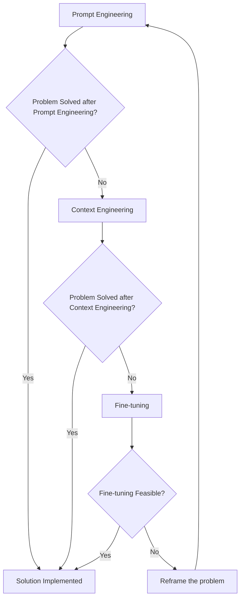
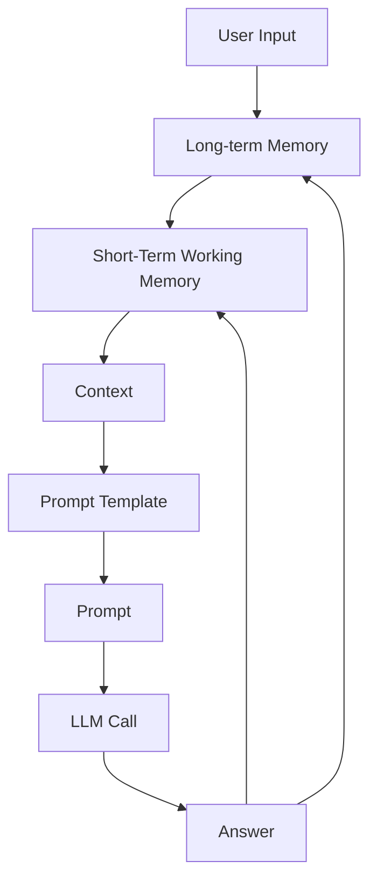
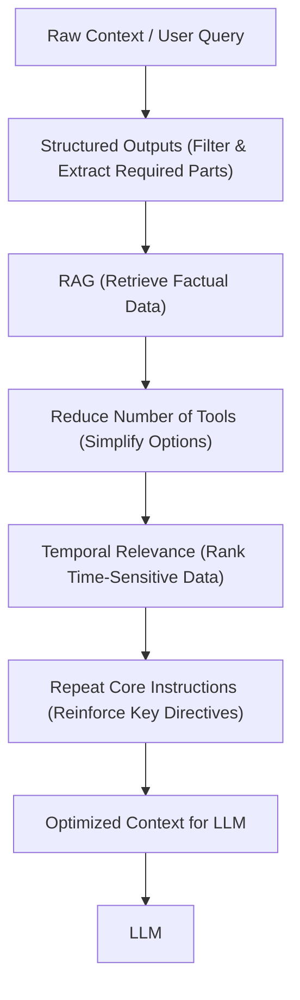
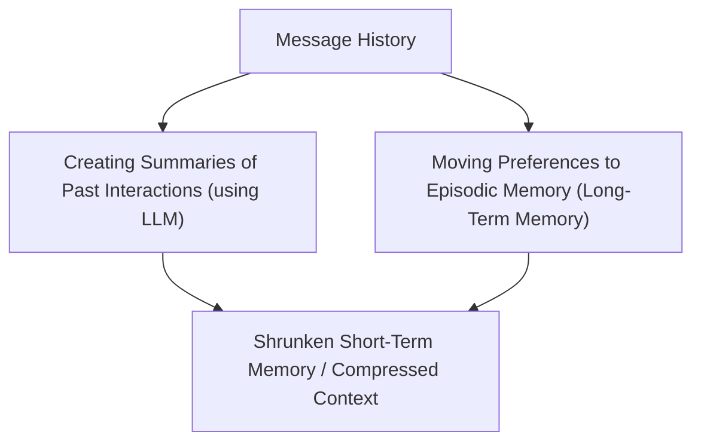
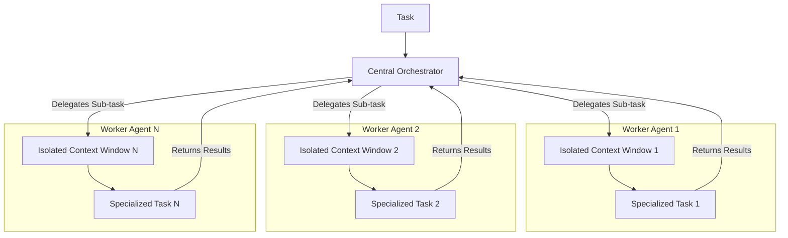

# Context Engineering: The New Fine-Tuning
### Why prompt engineering is no longer enough for production AI

We started with chatbots in 2022. They were simple question-and-answer interfaces that impressed the world. Then came 2023, and we realized these bots hallucinated. So we built Retrieval-Augmented Generation (RAG) systems to ground them in domain-specific knowledge.

By 2024, static answers weren't enough. We needed action. We gave Large Language Models (LLMs) function-calling capabilities, creating tool-using agents. Now, in 2025, we are building memory-enabled agents. These are stateful systems that build relationships and remember context over time.

In the previous lesson, we explored the high-level landscape of AI agents and LLM workflows. We learned that an agent is a system that uses an LLM to reason and decide its next steps. A workflow, on the other hand, is a predefined path of execution. We also discussed how to choose between them based on the complexity and predictability of your problem.

However, knowing *what* to build is only half the battle. The real challenge lies in *how* you feed information to these systems. Unlike prompt engineering, which focuses on optimizing a single interaction, context engineering orchestrates the entire end-to-end ecosystem. It ensures the LLM gets exactly the right information at the right time.

As AI applications scale, the data we manage grows exponentially. This directly impacts the size and quality of the input passed to the LLM, which we call the context. In this lesson, we will explore why prompt engineering breaks at scale. We will also see how context engineering solves the reliability crisis in production AI.

## When prompt engineering breaks

Prompt engineering is a valuable skill. But relying on it exclusively is like trying to build a skyscraper using only a hammer. It works for small tasks. But it fails when you need structural integrity at scale.

The first major issue is its single-interaction focus. Prompt engineering optimizes for individual questions and answers. But modern AI applications involve sustained, multi-turn conversations. The context in these scenarios is not static. It evolves.

This leads to context decay. As the conversation grows, the input passed to the LLM explodes in size. This also happens as we retrieve more documents from our database. The model becomes confused. It struggles to prioritize instructions against data. This leads to hallucinations or misguided answers.

Even if the LLM knows how to pick the right information, we face the context window challenge. The context window is the "RAM" of the LLM. It is strictly limited. You cannot fit your entire company wiki, user history, and code base into a single prompt.

Finally, there are costs and latency. Every token you feed the model costs money and takes time to process. The naive approach of "stuffing everything into the context" quickly becomes a bottleneck.

In one of our previous projects, we fell into this trap. We had access to a model with a 2-million token window. We thought, "Great, let's just dump everything in there."

We added our research notes and user intent guidelines. We also included few-shot examples and historical reviews. The result was a disaster. The workflow took 30 minutes to run. It cost a fortune. Worst of all, the outputs were generic and low-quality because the model got lost in the noise.

Context engineering addresses these limitations. It treats AI applications not as a series of isolated prompts, but as systems. These systems operate through dynamic context gathered from past conversations, databases, tools, and other types of memory. As AI Engineers, our job is to filter the noise. We keep only what is essential in the context. This makes our applications accurate, fast, and cost-effective.

## From prompt to context engineering

We have established that prompt engineering is insufficient for complex systems. Now, we need to understand what context engineering actually is. We also need to see how it fits into the broader AI stack.

Context engineering is the discipline of curating the information passed to an LLM to maximize its performance for a specific task. It is a solution to an optimization problem. You have a vast amount of available data. This includes short-term conversation history, long-term user preferences, and external knowledge. Your goal is to retrieve and arrange the minimal necessary subset of that data. You must solve the task without overwhelming the model.

Suppose we are building a cooking agent. A user asks for a pasta recipe. A prompt engineering approach might just ask the model to "Generate a pasta recipe."

A context engineering approach does more. It retrieves the specific recipe from a database. It checks the user's profile for salt preferences or gluten allergies. It then combines these specific facts into a precise prompt. We do not pass the whole cookbook. We pass only what matters.

Andrej Karpathy provides the best analogy for this shift [[1]](https://x.com/karpathy/status/1937902205765607626):

> "LLMs are like a new kind of operating system where the model is the CPU and its context window is the RAM. Just as an operating system curates what fits into RAM, context engineering manages what information occupies the model's limited context window."

This does not mean prompt engineering is dead. It is a subset of context engineering. You still need to write effective instructions. But you must also learn how to incorporate dynamic context into those instructions.

Table 1 highlights the fundamental differences between these two disciplines.

<table_caption>
Table 1: The difference between Prompt Engineering and Context Engineering.
</table_caption>

| Dimension | Prompt Engineering | Context Engineering |
| :--- | :--- | :--- |
| Scope | Single interaction optimization | Entire information ecosystem |
| State Management | Stateless function | Stateful due to memory |
| Focus | How to phrase tasks | What information to provide |

Another important distinction is the relationship between context engineering and fine-tuning. For a long time, developers believed that to make an LLM understand their data, they had to fine-tune it. That is rarely true today.

Context engineering is the new fine-tuning. Modern LLMs generalize extremely well. Fine-tuning is expensive and slow. It creates a static snapshot of knowledge. If your data changes, you have to retrain. Context engineering allows you to inject real-time data dynamically.

When you start a new AI project, use the following decision framework:


<diagram_caption>
Image 1: Flowchart illustrating the decision-making process for choosing AI strategies.
</diagram_caption>

This is illustrated in Image 1. Start with prompt engineering. If that fails, move to context engineering. Only consider fine-tuning if context engineering cannot solve the problem and you can curate a high-quality dataset.

For example, when processing Slack messages to create action items, you do not need to fine-tune a model on your company's email style. You can simply retrieve the relevant Slack messages. Then, use a reasoning model to extract the tasks. Fine-tuning here would be a waste of resources.

In this course, we will focus on solving industry use cases using the power of context engineering.

## Understanding context engineering

To master context engineering, we must look under the hood. We need to understand the components that make up the context passed to an LLM during a single turn of execution.

The process is a cycle. It starts with user input. It flows through memory systems to build context. It passes through the LLM. Finally, the output feeds back into memory.


<diagram_caption>
Image 2: A flowchart depicting the high-level workflow of how context is processed and passed to an LLM.
</diagram_caption>

As we can see in Image 2, the context is not a static block of text. It is dynamically assembled from several sources. Let's break down these components. Note that while we introduce these terms here, we will cover them in depth in future lessons (Memory in Lesson 9, RAG in Lesson 10, Multimodal data in Lesson 11).

First, we have **Short-term Working Memory**. This represents the current state of the agent or workflow. It includes the immediate user input. It also includes the message history of the current session. It contains the agent's internal thoughts—its reasoning process. Finally, it holds the outputs from any actions (tools) it has taken. This is what you are holding in your head right now to understand this sentence.

Second, we have **Long-term Memory**. This is information stored persistently. We divide it into three categories:

1.  **Procedural Long-term Memory:** These are the "instincts" or hard-coded rules of the system. It includes the system prompt (your core instructions). It includes the definitions of available actions (tools). It also includes the schemas for structured outputs. It tells the agent *how* to behave.
2.  **Episodic Long-term Memory:** This stores past experiences. It remembers user preferences. It remembers past conversations or specific events. For example, remembering that a user prefers Python over JavaScript. This is usually stored in vector or graph databases.
3.  **Semantic Long-term Memory:** This is your knowledge base. It includes facts retrieved from internal documents (via databases). It also includes facts from the external world (via web search).

Even though we are talking about a single prompt passed to the LLM, these elements persist across turns. However, they are re-computed every time. For each new user request, the system must decide which memories to pull into the context.

A big part of context engineering is knowing what to leave out. If you include too much from the message history or semantic memory, you dilute the procedural instructions. The model might forget *how* to act because it is overwhelmed by *what* it knows.

## Production implementation challenges

Now that we know what makes up the context, we must address the friction points. Implementing this in production is difficult because you are constantly fighting against constraints.

The primary challenge is the **context window limit**. Every model has a hard limit on how much information it can process at once. The context window is the RAM on your laptop. If you have 32GB of RAM, you cannot load a 100GB dataset into memory. You have to be selective.

This leads to **information overload**, often called the "lost-in-the-middle" problem. LLMs are notorious for paying attention to the beginning and end of a prompt while ignoring the middle [[2]](https://arxiv.org/pdf/2507.13334). If you stuff 50 documents into the context, the model will likely miss the important detail hidden in document 25. Processing the middle is a lottery.

Then we have **context drift**. This occurs when your memory contains conflicting views of the truth. Over time, a user might change their mind. Data sources might update. You might have one memory saying "The project deadline is Friday" and a newer one saying "The deadline is Monday." This confuses the LLM. It does not know which fact is current.

Finally, there is **tool confusion**. This happens in two scenarios. First, if you give an agent too many actions to choose from—usually over 100—it gets paralyzed. It cannot decide which tool is best.

Second, if the descriptions of your actions are unclear or overlap, the model will fail. If you have a "Search Web" tool and a "Find Info" tool with similar descriptions, the model will flip a coin. That is not engineering. That is gambling.

## Key strategies for context optimization

In the early days, AI apps were simple chatbots over a single document. Today, we build systems that access multiple knowledge bases and execute complex actions. We must manage this complexity while keeping costs down and performance up.

Here are four proven strategies to optimize your context.

### 1. Selecting the right context

The most effective way to improve performance is to filter what goes in. Do not dump everything into the prompt. You must be ruthless with your selection process.

Use **Structured Outputs** (which we will cover in Lesson 4) to force the model to return specific data formats. This allows you to extract only what is needed for the next step. Instead of passing a wall of text to the next agent, you pass a clean JSON object. This reduces noise and keeps the downstream context clean.

Use **Retrieval-Augmented Generation (RAG)** (Lesson 10) to fetch only the factual data relevant to the specific user question. RAG is not just about adding knowledge. It is about context reduction. By retrieving only the top 3 most relevant chunks, you avoid polluting the context with irrelevant pages of documentation.

Reduce the number of available actions. If an agent does not need a specific tool for a task, do not provide it. This reduces noise. If your agent is summarizing text, it does not need access to the calculator tool. Removing it simplifies the decision space for the model.

Apply **Temporal Relevance**. Rank data by time and cut off old, irrelevant points. If you are analyzing stock prices, data from 2020 is likely noise. Prioritize the most recent information to ensure the model acts on the current state of the world.

Finally, **repeat core instructions**. It sounds counterintuitive to add more tokens. However, repeating critical rules at the end of the prompt reinforces them. This combats the "lost-in-the-middle" effect by ensuring the most important instructions are fresh in the model's "mind" right before it generates an answer.


<diagram_caption>
Image 3: A diagram illustrating how various context selection techniques are combined to optimize context for an LLM.
</diagram_caption>

This flow is visualized in Image 3.

### 2. Context compression

As a conversation progresses, the message history grows. You cannot simply delete past turns, or the model loses the thread. You must compress.

One method is to use an LLM to summarize past interactions. You replace ten messages with a single paragraph summary. This retains the core meaning but drastically reduces the token count. It is a lossy process, but it is often a necessary trade-off to keep long-running sessions viable.

Another method is moving data to **Episodic Memory**. If a user mentions a preference, extract it and store it in a long-term database. Then, remove it from the immediate conversation history. For example, if a user says "I am vegan," store that fact. You do not need to keep the exact sentence "I am vegan" in the chat history forever. You just need the system to know that constraint for future food recommendations.


<diagram_caption>
Image 4: Diagram illustrating context compression techniques.
</diagram_caption>

Image 4 shows how we shrink the working memory while retaining value.

### 3. Isolating Context

Sometimes the best way to handle context is to split it up. Instead of one giant agent doing everything, use the **Orchestrator-Worker** pattern (Lesson 5).

The orchestrator breaks the plan into sub-tasks. It delegates each task to a worker agent. Each worker has its own isolated context window containing only the information needed for that specific sub-task.

For instance, if you are writing a software feature, one worker might focus on writing the code. Another worker might focus on writing the documentation. The "code writer" does not need to see the marketing requirements. The "documentation writer" does not need to see the unit tests. By isolating their contexts, you prevent cross-contamination of instructions and keep each model focused.


<diagram_caption>
Image 5: A diagram illustrating the orchestrator-worker pattern for isolating context.
</diagram_caption>

As shown in Image 5, this keeps each model focused.

### 4. Format optimization

How you structure the text matters. Use XML tags to clearly separate different parts of the prompt (e.g., `<context>`, `<instructions>`, `<history>`). This helps the model distinguish between your instructions and the data it is processing. It prevents the model from confusing a user's question with a system instruction.

Also, consider using YAML instead of JSON when inputting structured data. YAML is often more token-efficient. It uses fewer brackets and quotes. It is also easier for models to read, saving you cost and window space.

The key takeaway is visibility. You must always know exactly what occupies your context window. Monitor your traces. If you do not measure it, you cannot optimize it.

## Here is an example

Let's connect the theory to reality. Real-world use cases often require maintaining context across multiple sessions.

In **Financial Services**, agents need access to Customer Relationship Management (CRM) data and enterprise infrastructure. An agent might need to review a client's risk profile from the CRM before recommending an investment product. It needs to pull the latest market data. It must then synthesize this information to make a compliant recommendation. The context here is a mix of static client data, real-time market data, and strict regulatory rules.

In **Project Management**, agents act as intelligent assistants. A Project Task Manager agent needs to access Slack conversations, Zoom transcripts, and Jira boards. It must understand the context of a "blocker" mentioned in a Slack thread. It then needs to update the corresponding Jira ticket. The challenge is linking the unstructured conversation in Slack to the structured data in Jira without losing context.

Suppose we are building a healthcare assistant. A user asks: *"I have a headache. What can I do to stop it? I would prefer not to take any medicine."*

Before the AI answers, the system performs several steps:

1.  It retrieves the patient's history from episodic memory. It finds that the user has a history of migraines and dehydration.
2.  It reviews medical literature from semantic memory. It filters for non-medicinal treatments like hydration or dark room rest.
3.  It extracts these key units of information.
4.  It formats them into a structured prompt.

Here is how we might construct that system prompt in Python.

1.  We define the retrieved information strings.
    ```python
    # Simulated retrieved data
    patient_history = "Patient ID: 123. Condition: Frequent migraines. Triggers: Dehydration, bright lights."
    medical_docs = "Guideline 42: For tension headaches, hydration and rest are recommended. Avoid caffeine."
    user_query = "I have a headache. What can I do to stop it? I would prefer not to take any medicine."
    ```

2.  We construct the prompt using XML tags. Notice the order: Role, Context, Constraints, and finally the User Input. This structure ensures the model prioritizes the constraints (no medicine) while using the context (history/docs) to answer. We use XML tags because they provide clear boundaries. The model knows exactly where the patient history ends and the medical knowledge begins. This reduces the chance of the model mixing up facts.
    ```python
    system_prompt = f"""
    You are a helpful medical assistant. Use the following context to answer the user's question.

    <patient_history>
    {patient_history}
    </patient_history>

    <medical_knowledge>
    {medical_docs}
    </medical_knowledge>

    <constraints>
    - Do not recommend pharmaceutical drugs.
    - Focus on natural remedies found in the medical knowledge.
    </constraints>

    <user_query>
    {user_query}
    </user_query>
    """
    
    # In a real app, you would pass this to your LLM client
    print(system_prompt)
    ```

To build this stack, we recommend using Gemini for its multimodal reasoning capabilities and low cost. Use LangGraph as the orchestrator to manage the memory layer. For databases, keep it simple—PostgreSQL often works perfectly for both vector and relational data. Finally, use Opik or LangSmith for observability to see exactly what is going into your context window.

## Connecting context engineering to AI engineering

Context engineering is more of a discipline than a science. It is about developing the intuition to craft effective prompts. You must learn to select the right information from memory. You must arrange that context for optimal results. This discipline helps you determine the minimal yet essential information an LLM needs to perform at its best.

However, context engineering cannot be learned in isolation. It is a complex field that combines several disciplines. You need **AI Engineering** to implement workflows, RAG, and Agents. You need **Software Engineering** to build scalable, maintainable code.

You need **Data Engineering** to build pipelines that feed curated data into your memory layer. And you need **Operations** to deploy these agents and ensure they are reproducible and observable.

Our goal with this course is to teach you how to combine these skills to build production-ready AI products. We must shift our mindset from being developers of components to architects of systems.

In the next lesson, we will explore **Structured Outputs**. We will learn how to force LLMs to speak the language of our code—JSON and schemas—rather than just text. This is the first step in taming the probabilistic nature of AI. We will also touch on concepts like chaining and routing in Lesson 5, which are essential for isolating context effectively.

## References

1. Karpathy, A. (n.d.). X.  https://x.com/karpathy/status/1937902205765607626 

2. Zhu, Y., et al. (2024). A Survey of Context Engineering for Large Language Models. arXiv.  https://arxiv.org/pdf/2507.13334 

3. LangChain. (n.d.). Context Engineering for Agents. LangChain Blog.  https://blog.langchain.com/context-engineering-for-agents/ 

4. LlamaIndex. (n.d.). Context Engineering - What it is, and techniques to consider. LlamaIndex Blog.  https://www.llamaindex.ai/blog/context-engineering-what-it-is-and-techniques-to-consider 

5. LangChain. (n.d.). The rise of "context engineering". LangChain Blog.  https://blog.langchain.com/the-rise-of-context-engineering/ 

6. DataCamp. (n.d.). Context Engineering: A Guide With Examples. DataCamp Blog.  https://www.datacamp.com/blog/context-engineering 

7. Lenadroid. (n.d.). Context Engineering 101 cheat sheet. X.  https://x.com/lenadroid/status/1943685060785524824 

8. HumanLayer. (n.d.). Own your context window. GitHub.  https://github.com/humanlayer/12-factor-agents/blob/main/content/factor-03-own-your-context-window.md 

9. Saravia, E. (n.d.). Context Engineering Guide. Elvis Saravia Blog.  https://nlp.elvissaravia.com/p/context-engineering-guide 

10. Pinecone. (n.d.). What is Context Engineering?. Pinecone Learn.  https://www.pinecone.io/learn/context-engineering/
</article>