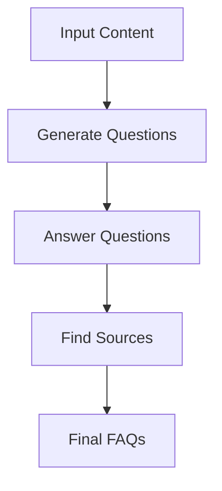
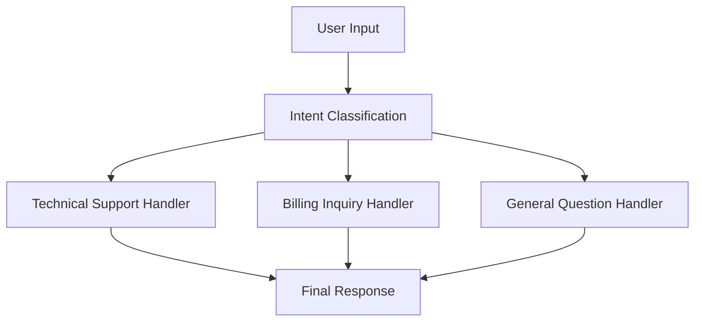
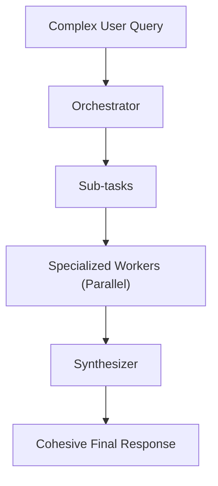

# Basic Workflow Ingredients
### Chaining, Routing, Parallelization, and Orchestrator-Workers

When I first started building AI applications, I fell into the "God Prompt" trap. I thought that if I just engineered the perfect, massive prompt, the LLM would magically handle everything: reasoning, formatting, fact-checking, and tone adjustment. I spent days tweaking adjectives, adding "IMPORTANT" in all caps, and pleading with the model to behave.

I was wrong. My system was brittle, impossible to debug, and hallucinated constantly. It was a black box where I fed in hope and got back chaos.

If you have been following our **AI Agents Foundations** course, you know we have already covered the landscape of AI engineering, the difference between workflows and agents, how to engineer context, and how to force reliable structured outputs. Now, we are moving into the engineering reality of building systems that actually work.

In this lesson, we will explore the fundamental components for building robust LLM workflows: chaining, parallelization, routing, and the orchestrator-worker pattern. These are the LEGO blocks of AI engineering. Before you try to build an autonomous agent that conquers the world (or at least your calendar), you need to master these deterministic patterns. They provide the control, modularity, and reliability that a single prompt simply cannot achieve.

Here is what we will cover:
1.  **The Challenge with Complex Single LLM Calls:** Why the "God Prompt" fails.
2.  **The Power of Modularity:** The theory behind chaining.
3.  **Building a Sequential Workflow:** A hands-on FAQ generation pipeline.
4.  **Optimizing with Parallelization:** Making it fast.
5.  **Dynamic Behavior:** The theory of routing.
6.  **Building a Routing Workflow:** A customer service classifier.
7.  **The Orchestrator-Worker Pattern:** Handling complex, dynamic tasks.

Let's start by looking at why doing everything at once is a bad idea.

## The Challenge with Complex Single LLM Calls

We often see developers trying to stuff complex logic into a single LLM call. It seems efficient at first—one request, one response. It feels like good engineering to minimize network calls. But as your application grows, this approach becomes a nightmare.

When a prompt tries to do too much, you face several critical engineering issues.

First, **debugging is nearly impossible**. If the model fails, is it because it misunderstood the context? Did it fail the formatting instruction? Did it hallucinate a fact? Or did it simply prioritize one instruction over another? In a massive prompt, you have no isolation of concerns. You cannot unit test a specific part of the reasoning process because it is all mashed together in one probabilistic blob.

Second, you run into **"lost in the middle" phenomena**. Research has shown that LLMs tend to ignore instructions or information buried in the middle of long contexts, prioritizing the beginning and the end [[1]](https://arxiv.org/abs/2307.03172). If your "God Prompt" has 50 different instructions, the model will likely drop the ones in the middle.

Third, you lose **modularity**. You cannot optimize specific parts of the task without rewriting the entire prompt. If you want to change how citations are formatted, you might accidentally break how the tone is generated.

Finally, **steerability decreases**. As the complexity of the task increases, the model's ability to follow strict instructions degrades. It reverts to its training data priors rather than your specific constraints.

Let's look at a practical example. We want to generate Frequently Asked Questions (FAQs) based on three documents about renewable energy. We want the questions, the answers, and the specific source citations for each answer.

### The "God Prompt" Approach

First, let's set up our environment. We will use the Google Gemini SDK for this lesson, as it provides excellent native support for structured outputs.

1.  We initialize our client and define our model. We also load our environment variables to ensure we have access to the API key.
    ```python
    import asyncio
    from enum import Enum
    import random
    import time
    
    from pydantic import BaseModel, Field
    from google import genai
    from google.genai import types
    
    # Load environment variables (ensure GOOGLE_API_KEY is set)
    from lessons.utils import env
    env.load(required_env_vars=["GOOGLE_API_KEY"])
    
    client = genai.Client()
    MODEL_ID = "gemini-2.5-flash"
    ```

2.  Next, we define our source material. In a real app, this would come from a vector database or an API, but for this example, we will mock it with three distinct dictionaries representing webpages.
    ```python
    webpage_1 = {
        "title": "The Benefits of Solar Energy",
        "content": """
        Solar energy is a renewable powerhouse, offering numerous environmental and economic benefits.
        By converting sunlight into electricity through photovoltaic (PV) panels, it reduces reliance on fossil fuels,
        thereby cutting down greenhouse gas emissions. Homeowners who install solar panels can significantly
        lower their monthly electricity bills, and in some cases, sell excess power back to the grid.
        While the initial installation cost can be high, government incentives and long-term savings make
        it a financially viable option for many. Solar power is also a key component in achieving energy
        independence for nations worldwide.
        """,
    }
    
    webpage_2 = {
        "title": "Understanding Wind Turbines",
        "content": """
        Wind turbines are towering structures that capture kinetic energy from the wind and convert it into
        electrical power. They are a critical part of the global shift towards sustainable energy.
        Turbines can be installed both onshore and offshore, with offshore wind farms generally producing more
        consistent power due to stronger, more reliable winds. The main challenge for wind energy is its
        intermittency—it only generates power when the wind blows. This necessitates the use of energy
        storage solutions, like large-scale batteries, to ensure a steady supply of electricity.
        """,
    }
    
    webpage_3 = {
        "title": "Energy Storage Solutions",
        "content": """
        Effective energy storage is the key to unlocking the full potential of renewable sources like solar
        and wind. Because these sources are intermittent, storing excess energy when it's plentiful and
        releasing it when it's needed is crucial for a stable power grid. The most common form of
        large-scale storage is pumped-hydro storage, but battery technologies, particularly lithium-ion,
        are rapidly becoming more affordable and widespread. These batteries can be used in homes, businesses,
        and at the utility scale to balance energy supply and demand, making our energy system more
        resilient and reliable.
        """,
    }
    
    all_sources = [webpage_1, webpage_2, webpage_3]
    ```

3.  We combine these sources into a single string context that we can feed into the LLM.
    ```python
    # Combine content for the LLM
    combined_content = "\n\n".join(
        [f"Source Title: {source['title']}\nContent: {source['content']}" for source in all_sources]
    )
    ```

4.  Now, we define the Pydantic schemas that will enforce the structure of our output. We want a list of FAQs, where each FAQ contains a question, an answer, and a list of sources.
    ```python
    # Pydantic classes for structured outputs
    class FAQ(BaseModel):
        question: str = Field(description="The question to be answered")
        answer: str = Field(description="The answer to the question")
        sources: list[str] = Field(description="The sources used to answer the question")
    
    class FAQList(BaseModel):
        faqs: list[FAQ] = Field(description="A list of FAQs")
    ```

5.  Finally, we attempt to do everything in one go. We ask for 10 FAQs, concise answers, and citations. We configure the client to use the `FAQList` schema.
    ```python
    n_questions = 10
    prompt_complex = f"""
    Based on the provided content from three webpages, generate a list of exactly {n_questions} frequently asked questions (FAQs).
    For each question, provide a concise answer derived ONLY from the text.
    After each answer, you MUST include a list of the 'Source Title's that were used to formulate that answer.
    
    <provided_content>
    {combined_content}
    </provided_content>
    """.strip()
    
    config = types.GenerateContentConfig(
        response_mime_type="application/json",
        response_schema=FAQList
    )
    
    response_complex = client.models.generate_content(
        model=MODEL_ID,
        contents=prompt_complex,
        config=config
    )
    ```
    It outputs:
    ```json
    {
      "question": "What is solar energy and how does it work?",
      "answer": "Solar energy is a renewable powerhouse that converts sunlight into electricity through photovoltaic (PV) panels.",
      "sources": [
        "The Benefits of Solar Energy"
      ]
    }
    ...
    ```

The output looks acceptable at first glance. However, if you run this at scale, you will notice inconsistencies. Sometimes it generates 8 questions instead of 10. Sometimes the citations are hallucinated. Sometimes the answer creates information not found in the source text because the model is focusing too much on generating the list format rather than checking the facts.

This unreliability stems from the model trying to juggle generation, formatting, and fact-checking simultaneously. To fix this, we need to break the problem down.

## The Power of Modularity: Why Chain LLM Calls?

The solution to the "God Prompt" is **Prompt Chaining**. This pattern involves decomposing a complex task into a sequence of smaller steps, where the output of one step becomes the input for the next.

Think of it like a factory assembly line. You don't have one person build the entire car from scratch. You have one station for the chassis, one for the engine, and one for the wheels. Each station is specialized, efficient, and easy to inspect.

Chaining offers massive benefits for AI Engineering:

1.  **Modularity:** Each step focuses on one thing. You can tune the prompt for "Question Generation" without breaking the "Source Citation" logic. If the tone of the answers is off, you only edit the Answer prompt.
2.  **Accuracy:** Simpler prompts are easier for LLMs to follow. The cognitive load on the model is lower. As noted in Anthropic's best practices, complex tasks should be broken down into subtasks to ensure the model doesn't "drop" instructions [[2]](https://docs.anthropic.com/en/docs/build-with-claude/prompt-engineering/claude-4-best-practices).
3.  **Debuggability:** If the answers are wrong, you check the Answer step. If the citations are wrong, you check the Source step. You know exactly where the failure occurred [[3]](https://www.vellum.ai/blog/what-is-prompt-chaining).
4.  **Model Selection:** You can use a cheap, fast model (like Gemini Flash) for simple tasks and a reasoning model (like Gemini Pro or GPT-4) for complex analysis [[4]](https://aws.amazon.com/blogs/machine-learning/multi-llm-routing-strategies-for-generative-ai-applications-on-aws/).

This approach aligns with the "Chain of Verification" research, which suggests that generating a plan or a set of verification questions before generating the final answer significantly reduces hallucinations [[5]](https://arxiv.org/pdf/2309.08181). By forcing the model to stop, output a result, and then use that result in a new context, we are effectively giving it a "short-term memory" refresh at each step.

The downsides? It is slower because latency adds up with each sequential call. It is also potentially more expensive because you are processing the context multiple times. But for production systems, reliability usually trumps raw speed. A fast, wrong answer is worse than a slow, correct one.

## Building a Sequential Workflow: FAQ Generation Pipeline

Let's refactor our FAQ generator into a sequential chain. We will split it into three distinct steps:
1.  **Generate Questions:** Read the text and just ask good questions.
2.  **Answer Questions:** Take a question and the text, and answer it.
3.  **Find Sources:** Take the question, answer, and text, and identify the source.

This is illustrated in the flowchart below.


Image 1: A flowchart illustrating a sequential FAQ generation pipeline.

### Step 1: Generate Questions

We create a specific function just for generating questions. This allows us to focus purely on the *quality* and *relevance* of the questions without worrying about the answers yet.

1.  We define a `QuestionList` schema. This ensures we get a clean list of strings back.
    ```python
    class QuestionList(BaseModel):
        questions: list[str] = Field(description="A list of questions")
    ```

2.  We define a focused prompt. Notice how simple it is compared to the "God Prompt".
    ```python
    prompt_generate_questions = """
    Based on the content below, generate a list of {n_questions} relevant and distinct questions that a user might have.
    
    <provided_content>
    {combined_content}
    </provided_content>
    """.strip()
    ```

3.  We implement the function to call the model.
    ```python
    def generate_questions(content: str, n_questions: int = 10) -> list[str]:
        config = types.GenerateContentConfig(
            response_mime_type="application/json",
            response_schema=QuestionList
        )
        response = client.models.generate_content(
            model=MODEL_ID,
            contents=prompt_generate_questions.format(n_questions=n_questions, combined_content=content),
            config=config
        )
        return response.parsed.questions
    ```

### Step 2: Answer Questions

Now we need a function that answers a single question. Notice we are not asking for citations here. We just want a good answer. By isolating this step, we can enforce strict grounding rules (e.g., "Using ONLY the provided content").

1.  We define the prompt. We emphasize conciseness and strict adherence to the source text.
    ```python
    prompt_answer_question = """
    Using ONLY the provided content below, answer the following question.
    The answer should be concise and directly address the question.
    
    <question>
    {question}
    </question>
    
    <provided_content>
    {combined_content}
    </provided_content>
    """.strip()
    ```

2.  We implement the function. Note that we return a simple string here, not a JSON object, because the output is unstructured text.
    ```python
    def answer_question(question: str, content: str) -> str:
        response = client.models.generate_content(
            model=MODEL_ID,
            contents=prompt_answer_question.format(question=question, combined_content=content),
        )
        return response.text
    ```

### Step 3: Find Sources

Finally, we ask the LLM to act as a librarian. Given the Q&A pair, which document did this come from? This is a classification task, which LLMs are generally very good at when isolated.

1.  We define a `SourceList` schema.
    ```python
    class SourceList(BaseModel):
        sources: list[str] = Field(description="A list of source titles that were used to answer the question")
    ```

2.  We define the prompt. We provide the question and the answer as context, asking the model to map them back to the original documents.
    ```python
    prompt_find_sources = """
    You will be given a question and an answer that was generated from a set of documents.
    Your task is to identify which of the original documents were used to create the answer.
    
    <question>
    {question}
    </question>
    
    <answer>
    {answer}
    </answer>
    
    <provided_content>
    {combined_content}
    </provided_content>
    """.strip()
    ```

3.  We implement the function.
    ```python
    def find_sources(question: str, answer: str, content: str) -> list[str]:
        config = types.GenerateContentConfig(
            response_mime_type="application/json",
            response_schema=SourceList
        )
        response = client.models.generate_content(
            model=MODEL_ID,
            contents=prompt_find_sources.format(question=question, answer=answer, combined_content=content),
            config=config
        )
        return response.parsed.sources
    ```

### Executing the Workflow

Now we stitch it all together. We loop through the questions generated in step 1, and for each one, we call step 2 and step 3 sequentially.

1.  We define the workflow function.
    ```python
    def sequential_workflow(content, n_questions=10) -> list[FAQ]:
        # Step 1: Generate questions
        questions = generate_questions(content, n_questions)
    
        final_faqs = []
        for question in questions:
            # Step 2: Answer
            answer = answer_question(question, content)
    
            # Step 3: Source
            sources = find_sources(question, answer, content)
    
            faq = FAQ(question=question, answer=answer, sources=sources)
            final_faqs.append(faq)
    
        return final_faqs
    ```

2.  We run the workflow and measure the time.
    ```python
    # Run and time it
    start_time = time.monotonic()
    sequential_faqs = sequential_workflow(combined_content, n_questions=4)
    end_time = time.monotonic()
    print(f"Sequential processing completed in {end_time - start_time:.2f} seconds")
    ```
    It outputs:
    ```text
    Sequential processing completed in 22.20 seconds
    ```

The result is robust and accurate. Each step is verifiable. But wait—22 seconds for 4 questions? That is painfully slow. In a sequential chain, we are waiting for the LLM to finish thinking about Question 1 before it even looks at Question 2. This brings us to our next pattern.

## Optimizing Sequential Workflows With Parallel Processing

Parallelization allows us to run independent tasks simultaneously. In our FAQ example, answering "What is solar energy?" does not depend on answering "How do wind turbines work?". Therefore, we can process all questions at the same time.

This pattern is crucial for high-performance AI apps. It reduces the total latency from `sum(all_tasks)` to `max(slowest_task)`. If you have 10 tasks that take 2 seconds each, sequential processing takes 20 seconds. Parallel processing takes roughly 2 seconds (plus some overhead).

### Implementing Asyncio

We will use Python's `asyncio` library to make concurrent calls to the Gemini API. This allows our program to initiate a request and, instead of sitting idle waiting for the response, move on to initiate the next request.

1.  We create async versions of our functions. Note the usage of `client.aio` for async calls.
    ```python
    async def answer_question_async(question: str, content: str) -> str:
        prompt = prompt_answer_question.format(question=question, combined_content=content)
        # Note the usage of client.aio for async calls
        response = await client.aio.models.generate_content(
            model=MODEL_ID,
            contents=prompt
        )
        return response.text
    
    async def find_sources_async(question: str, answer: str, content: str) -> list[str]:
        prompt = prompt_find_sources.format(question=question, answer=answer, combined_content=content)
        config = types.GenerateContentConfig(
            response_mime_type="application/json",
            response_schema=SourceList
        )
        response = await client.aio.models.generate_content(
            model=MODEL_ID,
            contents=prompt,
            config=config
        )
        return response.parsed.sources
    ```

2.  We create a processor function that handles the chain for a *single* question. This function runs sequentially for one question (Answer -> Source), but we will run multiple instances of this function in parallel.
    ```python
    async def process_question_parallel(question: str, content: str) -> FAQ:
        # We sequentially answer then source for ONE question, 
        # but we will run THIS function in parallel for ALL questions.
        answer = await answer_question_async(question, content)
        sources = await find_sources_async(question, answer, content)
        return FAQ(question=question, answer=answer, sources=sources)
    ```

3.  Finally, we create the workflow runner that gathers all the tasks.
    ```python
    async def parallel_workflow(content: str, n_questions: int = 10) -> list[FAQ]:
        questions = generate_questions(content, n_questions)
        
        # Create a list of tasks
        tasks = [process_question_parallel(question, content) for question in questions]
        
        # Run them all at once
        parallel_faqs = await asyncio.gather(*tasks)
        return parallel_faqs
    ```

4.  Let's check the performance improvement.
    ```python
    start_time = time.monotonic()
    parallel_faqs = await parallel_workflow(combined_content, n_questions=4)
    end_time = time.monotonic()
    print(f"Parallel processing completed in {end_time - start_time:.2f} seconds")
    ```
    It outputs:
    ```text
    Parallel processing completed in 8.98 seconds
    ```

We dropped from 22 seconds to ~9 seconds. That is a significant reduction in latency. The time taken is now dominated by the longest single chain (Question Generation + Slowest Answer + Slowest Source) rather than the sum of all chains.

<aside>
💡 <b>Rate Limits Warning:</b> Parallelization is powerful, but dangerous. Most LLM providers (OpenAI, Google, Anthropic) enforce Rate Limits (Requests Per Minute or Tokens Per Minute). If you launch 100 async tasks at once, you will likely get a 429 Error. In production, always use a semaphore or a library like `tenacity` to handle retries with exponential backoff [[6]](https://platform.openai.com/docs/guides/rate-limits), [[7]](https://cloud.google.com/vertex-ai/generative-ai/docs/quotas).
</aside>

## Introducing Dynamic Behavior: Routing and Conditional Logic

So far, our workflows have been linear: A -> B -> C. But real-world inputs vary. You wouldn't treat a customer asking "How do I return this?" the same way as one asking "Why is the server down?".

**Routing** allows your workflow to branch. You use an LLM to classify the input intent, and based on that classification, you direct the flow to a specialized handler [[8]](https://www.anthropic.com/research/building-effective-agents).

This enforces the "separation of concerns" principle. Instead of one massive prompt that tries to handle billing, tech support, and sales, you build three small, expert prompts. The Router simply decides which expert to call.

This is different from traditional if/else logic because the condition is semantic. You aren't checking `if input == "billing"`. You are checking `if intent(input) is BILLING`. This allows the system to handle messy, natural language inputs like "I was charged twice" or "Where is my money?" and correctly route them to the Billing handler.

## Building a Basic Routing Workflow

Let's build a customer service router. It will take a user query, classify it, and generate a response using a specialized persona.


Image 2: A flowchart illustrating a routing workflow for customer service intent classification.

### Step 1: Define Intents and Classifier

We use `Enum` to define strict categories. This prevents the LLM from inventing new categories like "Maybe Support".

1.  We define the `IntentEnum` and the `UserIntent` schema.
    ```python
    class IntentEnum(str, Enum):
        TECHNICAL_SUPPORT = "Technical Support"
        BILLING_INQUIRY = "Billing Inquiry"
        GENERAL_QUESTION = "General Question"
    
    class UserIntent(BaseModel):
        intent: IntentEnum = Field(description="The intent of the user's query")
    ```

2.  We define the classification prompt. We give it the list of valid categories dynamically.
    ```python
    prompt_classification = """
    Classify the user's query into one of the following categories.
    
    <categories>
    {categories}
    </categories>
    
    <user_query>
    {user_query}
    </user_query>
    """.strip()
    ```

3.  We implement the classification function.
    ```python
    def classify_intent(user_query: str) -> IntentEnum:
        prompt = prompt_classification.format(
            user_query=user_query,
            categories=[intent.value for intent in IntentEnum]
        )
        config = types.GenerateContentConfig(
            response_mime_type="application/json",
            response_schema=UserIntent
        )
        response = client.models.generate_content(
            model=MODEL_ID,
            contents=prompt,
            config=config
        )
        return response.parsed.intent
    ```

### Step 2: Specialized Handlers

Now we define the logic for each branch. In a real app, these might be knowledge retrieval systems or database lookups. Here, we will use specialized prompts.

1.  We define prompts for Tech Support, Billing, and General questions.
    ```python
    prompt_technical_support = """
    You are a helpful technical support agent.
    Here's the user's query:
    <user_query>
    {user_query}
    </user_query>
    Provide a helpful first response, asking for more details like what troubleshooting steps they have already tried.
    """.strip()
    
    prompt_billing_inquiry = """
    You are a helpful billing support agent.
    Here's the user's query:
    <user_query>
    {user_query}
    </user_query>
    Acknowledge their concern and inform them that you will need to look up their account, asking for their account number.
    """.strip()
    
    prompt_general_question = """
    You are a general assistant.
    Here's the user's query:
    <user_query>
    {user_query}
    </user_query>
    Apologize that you are not sure how to help.
    """.strip()
    ```

2.  We implement the routing logic. This is a simple Python conditional block that dispatches the query based on the intent.
    ```python
    def handle_query(user_query: str, intent: str) -> str:
        if intent == IntentEnum.TECHNICAL_SUPPORT:
            prompt = prompt_technical_support.format(user_query=user_query)
        elif intent == IntentEnum.BILLING_INQUIRY:
            prompt = prompt_billing_inquiry.format(user_query=user_query)
        else:
            prompt = prompt_general_question.format(user_query=user_query)
            
        response = client.models.generate_content(model=MODEL_ID, contents=prompt)
        return response.text
    ```

3.  Let's test it with a billing question.
    ```python
    query = "I think there is a mistake on my last invoice."
    intent = classify_intent(query)
    response = handle_query(query, intent)
    
    print(f"Intent: {intent}")
    print(f"Response: {response}")
    ```
    It outputs:
    ```text
    Intent: IntentEnum.BILLING_INQUIRY
    Response: I'm sorry to hear you think there might be a mistake... could you please provide your account number?
    ```

This architecture scales effectively. If you need to add a "Sales" flow, you just add an Enum value and a new `elif` branch. You don't risk breaking the Technical Support logic because the code paths are completely separate.

## Orchestrator-Worker Pattern: Dynamic Task Decomposition

Parallelization is great when you know the tasks in advance. Routing is great when you have one clear path. But what if the task is complex and dynamic? What if a user says: *"Check my invoice #123, and also I want to return the widget I bought, and where is my other order #999?"*

This requires the **Orchestrator-Worker** pattern.

In this pattern, a central LLM (the Orchestrator) analyzes the request and breaks it down into a list of sub-tasks. It then delegates these tasks to specialized Workers (which can run in parallel). Finally, a Synthesizer combines the results [[8]](https://www.anthropic.com/research/building-effective-agents), [[9]](https://langchain-ai.github.io/langgraphjs/tutorials/workflows/).

This is different from simple parallelization because the *number* and *type* of tasks are determined at runtime by the LLM, not hardcoded by the developer. It is different from routing because it can handle multiple intents simultaneously.


Image 3: A flowchart illustrating the Orchestrator-Worker pattern.

### Step 1: The Orchestrator

The Orchestrator's job is to produce a plan. We use Pydantic to strictly define what a "Task" looks like. This ensures that the output from the Orchestrator is machine-readable and can be programmatically routed to the correct worker.

1.  We define the `QueryTypeEnum` and the `Task` schema. The `Task` schema includes optional fields for parameters that might be needed for specific tasks (like `invoice_number` or `order_id`).
    ```python
    class QueryTypeEnum(str, Enum):
        BILLING_INQUIRY = "BillingInquiry"
        PRODUCT_RETURN = "ProductReturn"
        STATUS_UPDATE = "StatusUpdate"
    
    class Task(BaseModel):
        query_type: QueryTypeEnum
        invoice_number: str | None = None
        product_name: str | None = None
        reason_for_return: str | None = None
        order_id: str | None = None
    
    class TaskList(BaseModel):
        tasks: list[Task]
    ```

2.  We define the Orchestrator prompt. We instruct it to break down the query and map it to our supported query types.
    ```python
    prompt_orchestrator = f"""
    You are a master orchestrator. Your job is to break down a complex user query into a list of sub-tasks.
    Each sub-task must have a "query_type" and its necessary parameters.
    
    The possible "query_type" values and their required parameters are:
    1. "{QueryTypeEnum.BILLING_INQUIRY.value}": Requires "invoice_number".
    2. "{QueryTypeEnum.PRODUCT_RETURN.value}": Requires "product_name" and "reason_for_return".
    3. "{QueryTypeEnum.STATUS_UPDATE.value}": Requires "order_id".
    
    Here's the user's query.
    <user_query>
    {{query}}
    </user_query>
    """.strip()
    ```

3.  We implement the Orchestrator function.
    ```python
    def orchestrator(query: str) -> list[Task]:
        prompt = prompt_orchestrator.format(query=query)
        config = types.GenerateContentConfig(
            response_mime_type="application/json",
            response_schema=TaskList
        )
        response = client.models.generate_content(
            model=MODEL_ID,
            contents=prompt,
            config=config
        )
        return response.parsed.tasks
    ```

### Step 2: The Workers

Each worker is a function that takes specific parameters and returns a result. In a real system, these would call APIs or query databases. Here, we simulate the work with simple functions that return structured objects.

1.  We implement the `handle_billing_worker`.
    ```python
    class BillingTask(BaseModel):
        invoice_number: str
        action_taken: str
        resolution_eta: str

    def handle_billing_worker(invoice_number: str, original_user_query: str) -> BillingTask:
        # In a real app, we might use an LLM here to extract specific details 
        # or call a database. We simulate an investigation.
        return BillingTask(
            invoice_number=invoice_number,
            action_taken="Investigation opened",
            resolution_eta="2 business days"
        )
    ```

2.  We implement the `handle_return_worker`.
    ```python
    class ReturnTask(BaseModel):
        product_name: str
        rma_number: str

    def handle_return_worker(product_name: str, reason_for_return: str) -> ReturnTask:
        return ReturnTask(
            product_name=product_name,
            rma_number=f"RMA-{random.randint(1000,9999)}"
        )
    ```

3.  We implement the `handle_status_worker`.
    ```python
    class StatusTask(BaseModel):
        order_id: str
        status: str

    def handle_status_worker(order_id: str) -> StatusTask:
        return StatusTask(
            order_id=order_id,
            status="Shipped"
        )
    ```

### Step 3: The Synthesizer

Once the workers finish, we have a pile of disconnected data objects. We need to turn that into a polite, cohesive email for the user. This is the job of the Synthesizer.

1.  We define a `synthesizer` function that takes the list of results and formats them using an LLM.
    ```python
    def synthesizer(results: list) -> str:
        # Format results into a string representation
        formatted_results = "\n".join([str(r) for r in results])
        
        prompt = f"""
        You are a helpful assistant. Combine these points into one cohesive response:
        {formatted_results}
        """
        response = client.models.generate_content(model=MODEL_ID, contents=prompt)
        return response.text
    ```

### Step 4: The Main Pipeline

Finally, we create the main function that ties it all together. It calls the Orchestrator, iterates through the tasks to call the correct workers, and then passes the results to the Synthesizer.

1.  We run the complex query through the pipeline.
    ```python
    complex_customer_query = """
    Hi, I have a question about invoice #INV-7890. It seems high.
    Also, I want to return the 'SuperWidget 5000' because it's incompatible.
    Finally, update on order #A-12345?
    """
    
    # 1. Orchestrate
    tasks = orchestrator(complex_customer_query)
    
    # 2. Run Workers (Sequentially for simplicity here, but can be parallel)
    results = []
    for task in tasks:
        if task.query_type == QueryTypeEnum.BILLING_INQUIRY:
            results.append(handle_billing_worker(task.invoice_number, complex_customer_query))
        elif task.query_type == QueryTypeEnum.PRODUCT_RETURN:
            results.append(handle_return_worker(task.product_name, task.reason_for_return))
        elif task.query_type == QueryTypeEnum.STATUS_UPDATE:
            results.append(handle_status_worker(task.order_id))
            
    # 3. Synthesize
    final_response = synthesizer(results)
    print(final_response)
    ```

The system successfully breaks the confusing paragraph into three distinct database actions and reassembles the results into a coherent response. This is the architecture used by advanced assistants like Perplexity's deep research mode (on a larger scale).

## Conclusion

We have moved far beyond the "God Prompt." By using **Chaining**, we modularized our logic. With **Parallelization**, we optimized for speed. **Routing** gave us conditional logic, and the **Orchestrator-Worker** pattern gave us dynamic planning capabilities.

These patterns are the foundation of AI Engineering. They allow you to build systems that are reliable, debuggable, and scalable.

However, there is still a missing piece. Our workflows are currently limited to passive text processing. They can answer questions, but they can't *do* anything. They can't search the web, query a real database, or send an email.

In the next lesson, we will give our LLMs hands. We will explore **Agent Tools and Function Calling**, unlocking the ability for your AI to interact with the real world.

See you in the next lesson.

## References

1. Liu, N. F., Lin, K., Hewitt, J., Paranjape, A., Bevilacqua, M., Petroni, F., & Liang, P. (2023). Lost in the Middle: How Language Models Use Long Contexts. *arXiv preprint arXiv:2307.03172*. https://arxiv.org/abs/2307.03172

2. (n.d.). *Claude 4 Best Practices*. Anthropic. https://docs.anthropic.com/en/docs/build-with-claude/prompt-engineering/claude-4-best-practices

3. (n.d.). *What is Prompt Chaining?*. Vellum. https://www.vellum.ai/blog/what-is-prompt-chaining

4. (n.d.). *Multi-LLM routing strategies for generative AI applications on AWS*. Amazon Web Services. https://aws.amazon.com/blogs/machine-learning/multi-llm-routing-strategies-for-generative-ai-applications-on-aws/

5. Pai, D., et al. (2023). Chain-of-Verification Natural Language Generation. *arXiv preprint arXiv:2309.08181*. https://arxiv.org/pdf/2309.08181

6. (n.d.). *Rate Limits*. OpenAI Platform. https://platform.openai.com/docs/guides/rate-limits

7. (n.d.). *Quotas and limits*. Google Cloud Vertex AI. https://cloud.google.com/vertex-ai/generative-ai/docs/quotas

8. (n.d.). *Building effective agents*. Anthropic. https://www.anthropic.com/research/building-effective-agents

9. (n.d.). *LangGraph Workflows*. LangChain. https://langchain-ai.github.io/langgraphjs/tutorials/workflows/

10. (n.d.). *Basic Multi-LLM Workflows*. GitHub. https://github.com/hugobowne/building-with-ai/blob/main/notebooks/01-agentic-continuum.ipynb

11. (n.d.). *Notebook code for the lesson*. GitHub. https://github.com/towardsai/course-ai-agents/blob/dev/lessons/05_workflow_patterns/notebook.ipynb