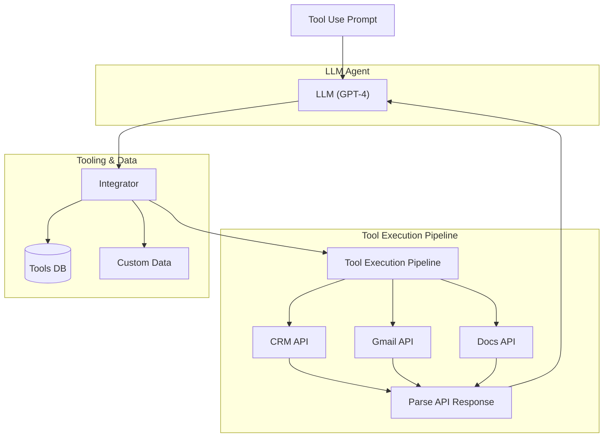
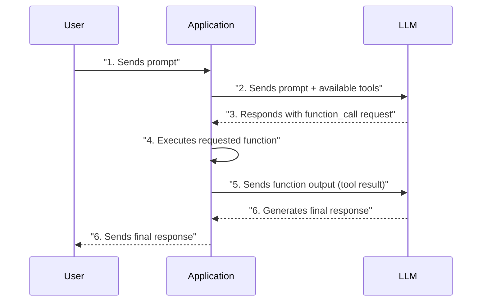
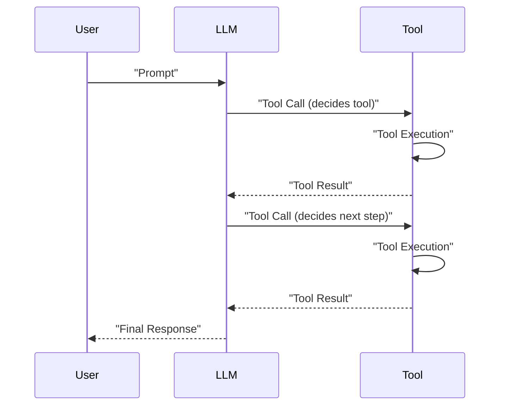

# Agent Tools & Function Calling: Giving Your LLM the Ability to Take Action

### Lesson 6 of the AI Agents Foundations

In the previous lessons, we established the groundwork for building AI systems. We explored the architectural differences between rigid workflows and autonomous agents, mastered the art of context engineering to manage information flow, and learned how to tame probabilistic models to produce reliable structured outputs.

However, up until now, our LLMs have been trapped in a text box. They can reason, summarize, and format data, but they cannot *do* anything. They cannot search the web for the latest stock prices, query your production database, or send a message to your team on Discord.

This lesson changes that. We are going to give your LLM "hands."

We will explore tool usage, the mechanism that transforms a passive text generator into an active agent capable of interacting with the external world. We will start by implementing a tool-calling framework from scratch to demystify the underlying mechanics. Then, we will switch to production-grade implementation using the Gemini API and Pydantic. Finally, we will look at how to chain these tools in loops and why that eventually leads us to more advanced reasoning patterns like ReAct.

## Understanding Why Agents Need Tools

Before we write code, we need to understand the fundamental limitation we are solving. Large Language Models (LLMs) are, at their core, statistical pattern matchers. They predict the next token based on the training data they have seen. They do not have a built-in concept of "current time," they cannot inherently perform complex mathematical calculations, and they certainly cannot access private data stored in your company's Notion or Jira [[1]](https://www.projectpro.io/article/llm-limitations/1045), [[2]](https://blog.gdeltproject.org/large-language-models-llms-planetary-scale-realtime-data-current-limitations/).

If the LLM is the **brain**—capable of planning, reasoning, and understanding intent—then tools are its **hands and senses**.

Tools act as the bridge between the model's internal reasoning and the external environment. By providing tools, we enable the model to offload tasks it is bad at (like arithmetic) or tasks it physically cannot do (like fetching live data) to external functions that are deterministic and reliable [[3]](https://www.weka.io/learn/guide/ai-ml/retrieval-augmented-generation/), [[4]](https://www.mercity.ai/blog-post/guide-to-integrating-tools-and-apis-with-language-models).

Examples of popular tools that power modern AI agents include:
*   **APIs:** Accessing real-time information (e.g., weather, stock prices).
*   **Databases:** Interacting with SQL, vector stores, or knowledge graphs.
*   **Code Execution:** Running Python or JavaScript in a sandbox to perform data analysis or generate visualizations.
*   **Memory Access:** Retrieving information from long-term storage to maintain context across sessions.

This architecture fundamentally changes the system design. Instead of a linear input-output flow, we create a loop where the model decides to call a function, the system executes it, and the result is fed back to the model.


Image 1: High-level architecture of an LLM acting as an agent with tool use. (Image by Paul Iusztin from [the Decoding AI Magazine [5]](https://decodingml.substack.com/p/building-ai-agents-from-scratch-part))

## Implementing Tool Calls From Scratch

The best way to understand how LLMs use tools is to build the mechanism yourself. While modern SDKs abstract this away, knowing what happens under the hood is critical for debugging when your agent inevitably tries to call a tool that doesn't exist or hallucinates arguments.

In this section, we will learn how to define a tool schema, how to pass it to an LLM, and how to parse the model's request to execute a function.

At a high level, the process of calling a tool involves five distinct steps:
1.  **App:** We provide the LLM with a system prompt containing a list of available tools and their schemas.
2.  **LLM:** The model analyzes the user query. If it needs external data, it responds with a structured `function_call` request (usually JSON), specifying the tool name and arguments.
3.  **App:** We parse this response and execute the corresponding Python function in our code.
4.  **App:** We send the function's output (the tool result) back to the LLM as a new message.
5.  **LLM:** The model incorporates the tool result to generate the final user-facing response.


Image 2: A sequence diagram illustrating the 5 steps of a tool calling process.

Let's implement this. We will create a simple agent that can "search" Google Drive for a financial report and "send" a summary to Discord. To keep the focus on the tool logic, we will mock the actual API calls.

1.  First, we setup our environment. We will use the `google-genai` library and define a mock document that our tools will retrieve.
    ```python
    import json
    from typing import Any
    from google import genai
    from google.genai import types
    
    client = genai.Client()
    MODEL_ID = "gemini-2.5-flash"
    
    DOCUMENT = """
    # Q3 2023 Financial Performance Analysis
    The Q3 earnings report shows a 20% increase in revenue...
    """
    ```

2.  We define our three mock tools as standard Python functions. Notice we include type hints and docstrings; these will be important later.
    ```python
    def search_google_drive(query: str) -> dict:
        """Searches for a file on Google Drive."""
        return {
            "files": [{"name": "Q3_Earnings_Report_2024.pdf", "content": DOCUMENT}]
        }
    
    def send_discord_message(channel_id: str, message: str) -> dict:
        """Sends a message to a specific Discord channel."""
        return {"status": "success", "channel": channel_id, "message_preview": message[:50]}
    
    def summarize_financial_report(text: str) -> str:
        """Summarizes a financial report."""
        return "The Q3 2023 earnings report shows strong performance..."
    ```

3.  To let the LLM know these tools exist, we must define their **schemas**. This JSON structure tells the model the tool's name, what it does (description), and exactly what arguments it expects. This format is the industry standard for function calling across OpenAI, Anthropic, and Google [[6]](https://platform.openai.com/docs/guides/function-calling), [[7]](https://ai.google.dev/gemini-api/docs/function-calling).
    ```python
    search_google_drive_schema = {
        "name": "search_google_drive",
        "description": "Searches for a file on Google Drive.",
        "parameters": {
            "type": "object",
            "properties": {
                "query": {"type": "string", "description": "The search query."}
            },
            "required": ["query"],
        },
    }
    
    send_discord_message_schema = {
        "name": "send_discord_message",
        "description": "Sends a message to a specific Discord channel.",
        "parameters": {
            "type": "object",
            "properties": {
                "channel_id": {"type": "string", "description": "The channel ID."},
                "message": {"type": "string", "description": "The message content."},
            },
            "required": ["channel_id", "message"],
        },
    }
    # ... summarize_financial_report_schema omitted for brevity
    ```

4.  We create a registry to map tool names to their actual Python functions and schemas. This allows us to dynamically look up and execute the code when the LLM requests it.
    ```python
    TOOLS = {
        "search_google_drive": {
            "handler": search_google_drive,
            "declaration": search_google_drive_schema,
        },
        "send_discord_message": {
            "handler": send_discord_message,
            "declaration": send_discord_message_schema,
        },
        # ... summarize tool
    }
    
    TOOLS_BY_NAME = {name: tool["handler"] for name, tool in TOOLS.items()}
    TOOLS_SCHEMA = [tool["declaration"] for tool in TOOLS.values()]
    ```

5.  Now we need a system prompt. This prompt instructs the LLM on *how* to use the tools. We explicitly define the output format (a specific JSON structure) and provide the tool definitions we created above.
    ```python
    TOOL_CALLING_SYSTEM_PROMPT = """
    You are a helpful AI assistant with access to tools.
    
    ## Tool Call Format
    When you need to use a tool, output ONLY the tool call in this exact format:
    ```tool_call
    {{"name": "tool_name", "args": {{"param1": "value1"}}}}
    ```
    
    ## Available Tools
    <tool_definitions>
    {tools}
    </tool_definitions>
    """
    ```

    **A critical note on descriptions:** The LLM relies entirely on the `description` field in the schema to decide *if* and *when* to call a tool. Ambiguous descriptions are the root cause of many agent failures. If you have two tools, one for "searching files" and one for "searching documents," the model will be confused. You must be explicit: "Tool used to search PDF documents on Google Drive" vs. "Tool used to search local text files." Disambiguation via verbose descriptions is key to scaling agents to 50+ tools [[8]](https://www.mercity.ai/blog-post/guide-to-integrating-tools-and-apis-with-language-models).

6.  Let's test it. We send a user prompt along with our system prompt to the model.
    ```python
    USER_PROMPT = "Please find the Q3 earnings report on Google Drive."
    
    messages = [TOOL_CALLING_SYSTEM_PROMPT.format(tools=str(TOOLS_SCHEMA)), USER_PROMPT]
    
    response = client.models.generate_content(
        model=MODEL_ID,
        contents=messages,
    )
    ```
    The LLM correctly identifies the need for a tool and generates the specific call:
    ```text
    ```tool_call
    {"name": "search_google_drive", "args": {"query": "Q3 earnings report"}}
    ```
    ```

7.  To execute this, we need to parse the string output. We extract the JSON, convert it to a dictionary, look up the function in our `TOOLS_BY_NAME` registry, and call it.
    ```python
    def extract_tool_call(response_text: str) -> str:
        return response_text.split("```tool_call")[1].split("```")[0].strip()
    
    tool_call_str = extract_tool_call(response.text)
    tool_call = json.loads(tool_call_str)
    
    # Retrieve the function and execute it
    tool_handler = TOOLS_BY_NAME[tool_call["name"]]
    tool_result = tool_handler(**tool_call["args"])
    ```
    The `tool_result` now contains our mocked file data:
    ```json
    {
      "files": [
        {
          "name": "Q3_Earnings_Report_2024.pdf",
          "content": "# Q3 2023 Financial Performance Analysis..."
        }
      ]
    }
    ```

8.  Finally, we close the loop. We take this raw data and send it back to the LLM so it can interpret the result for the user.
    ```python
    response = client.models.generate_content(
        model=MODEL_ID,
        contents=f"Interpret the tool result: {json.dumps(tool_result)}",
    )
    ```
    It outputs:
    ```text
    The tool result provides the content of a file named `Q3_Earnings_Report_2024.pdf`.
    This document is a Q3 2023 Financial Performance Analysis...
    ```

This is the fundamental loop of any agent. Request, Decide, Execute, Observe.

## Implementing a Tool Calling Framework From Scratch

Manually writing those JSON schemas for every single function is tedious and violates the "Don't Repeat Yourself" (DRY) principle. If you change a function's argument, you have to remember to update the schema dictionary, or your agent will break.

Modern frameworks like LangGraph or protocols like the Model Context Protocol (MCP) solve this using Python decorators [[9]](https://python.langchain.com/docs/concepts/tools/), [[10]](https://itnext.io/the-mcp-revolution-transforming-agents-with-mcp-2f053da01e8c). We can build a similar mini-framework to automate schema generation.

We will create a `@tool` decorator that inspects a function's signature and docstring to automatically generate the JSON schema we manually wrote in the previous section.

1.  We define a `ToolFunction` class to wrap our functions and hold their schemas. Then, we define the `@tool` decorator. It uses Python's `inspect` module to read the function's arguments and types.
    ```python
    from inspect import Parameter, signature
    from typing import Callable, Any
    
    class ToolFunction:
        def __init__(self, func: Callable, schema: dict):
            self.func = func
            self.schema = schema
    
    def tool(description: str = None):
        def decorator(func: Callable) -> ToolFunction:
            sig = signature(func)
            properties = {}
            required = []
            
            for param_name, param in sig.parameters.items():
                properties[param_name] = {"type": "string", "description": f"The {param_name}"}
                if param.default == Parameter.empty:
                    required.append(param_name)
            
            schema = {
                "name": func.__name__,
                "description": description or func.__doc__,
                "parameters": {"type": "object", "properties": properties, "required": required}
            }
            return ToolFunction(func, schema)
        return decorator
    ```

2.  Now we can define our tools with a simple decorator. The framework handles the rest.
    ```python
    @tool()
    def search_google_drive_example(query: str) -> dict:
        """Search for files in Google Drive."""
        return {"files": ["Q3 earnings report"]}
    
    # ... other tools
    
    tools = [search_google_drive_example]
    tools_schema = [t.schema for t in tools]
    tools_by_name = {t.schema["name"]: t.func for t in tools}
    ```

3.  When we inspect `tools_schema`, we see it has automatically generated the correct JSON structure. We can now pass this directly to our `TOOL_CALLING_SYSTEM_PROMPT` just as before.
    ```python
    response = client.models.generate_content(
        model=MODEL_ID,
        contents=[TOOL_CALLING_SYSTEM_PROMPT.format(tools=str(tools_schema)), USER_PROMPT],
    )
    ```

This simple abstraction makes our code cleaner, easier to maintain, and scalable. This is essentially what happens inside libraries like LangChain or Semantic Kernel.

## Implementing Production-Level Tool Calls with Gemini

While building from scratch is excellent for learning, in production, we want robustness. Modern LLM APIs like Gemini, OpenAI, and Anthropic have native support for function calling. They have fine-tuned their models to detect tools and output structured calls without us needing to engineer complex system prompts [[11]](https://ai.google.dev/gemini-api/docs/function-calling), [[12]](https://platform.openai.com/docs/guides/function-calling).

Let's refactor our code to use Gemini's native tooling capabilities.

1.  We define a `GenerateContentConfig` object. Instead of injecting schemas into a text prompt, we pass them to the `tools` parameter.
    ```python
    tools = [
        types.Tool(
            function_declarations=[
                types.FunctionDeclaration(**search_google_drive_schema),
                types.FunctionDeclaration(**send_discord_message_schema),
            ]
        )
    ]
    config = types.GenerateContentConfig(
        tools=tools,
        tool_config=types.ToolConfig(function_calling_config=types.FunctionCallingConfig(mode="ANY")),
    )
    ```

2.  We call the model. Notice we no longer need the `TOOL_CALLING_SYSTEM_PROMPT`. We just send the user query. The API handles the instruction tuning under the hood.
    ```python
    response = client.models.generate_content(
        model=MODEL_ID,
        contents=USER_PROMPT,
        config=config,
    )
    ```

3.  The Google GenAI SDK goes a step further. It allows us to pass raw Python functions directly. It will perform the schema generation for us, similar to our custom `@tool` decorator, but handled entirely by the library.
    ```python
    # Pass functions directly!
    tools = [search_google_drive, send_discord_message]
    
    config = types.GenerateContentConfig(tools=tools)
    
    response = client.models.generate_content(
        model=MODEL_ID,
        contents=USER_PROMPT,
        config=config,
    )
    ```

4.  The response object now contains a dedicated `function_call` attribute, not just a text string we have to regex parsing.
    ```python
    function_call = response.candidates[0].content.parts[0].function_call
    print(function_call)
    ```
    It outputs:
    ```text
    FunctionCall(name='search_google_drive', args={'query': 'Q3 earnings report'})
    ```

5.  We can execute this easily using our registry.
    ```python
    tool_handler = TOOLS_BY_NAME[function_call.name]
    result = tool_handler(**function_call.args)
    ```

By leveraging the native SDK, we reduced our implementation from dozens of lines of prompt engineering and parsing logic to a simple configuration. This approach is more robust, as the model provider handles the complexities of schema adherence.

## Using Pydantic Models as Tools for On-Demand Structured Outputs

In Lesson 4, we learned about structured outputs. We can combine that concept with tool calling to create powerful, dynamic workflows. Sometimes, you don't want to perform an action (like searching a DB); you just want the agent to give you a final answer in a specific format.

We can treat a Pydantic model as a tool. This allows an agent to reason freely, call various search tools, and then—only when it's ready—call the "final answer tool" to produce a structured output [[13]](https://pydantic.dev/articles/llm-intro), [[14]](https://xebia.com/blog/enforce-and-validate-llm-output-with-pydantic/).

```mermaid
graph TD
    User_Input["User Input"] --> AI_Agent["AI Agent (LLM)"]

    AI_Agent --> Decide_Tool{"Decide Tool?"}

    Decide_Tool -->|Yes| Call_Tool["Call Tool"]
    Call_Tool --> Get_Result["Get Tool Result"]
    Get_Result --> Feed_Result["Feed Result back to AI Agent"]
    Feed_Result --> AI_Agent  %% Loop back to AI Agent

    Decide_Tool -->|No, no more tools| Structured_Output_Needed{"If structured output needed?"}

    Structured_Output_Needed -->|Yes| Call_Pydantic["Call Pydantic Tool (e.g., extract_metadata)"]
    Call_Pydantic --> Get_Structured_Output["Get Structured Output (Pydantic Model)"]
    Get_Structured_Output --> Final_Response["Final Structured Response"]

    Structured_Output_Needed -->|No| Final_Response
```
Image 3: A flowchart illustrating an AI agent's workflow with a tool-calling loop and conditional Pydantic tool for structured output.

Let's implement a tool that extracts metadata from our financial document.

1.  We define our schema using Pydantic.
    ```python
    from pydantic import BaseModel, Field
    
    class DocumentMetadata(BaseModel):
        summary: str = Field(description="A concise summary.")
        quarter: str = Field(description="The financial quarter.")
        growth_rate: str = Field(description="The revenue growth rate.")
    ```

2.  We wrap this Pydantic model as a tool using Gemini's `FunctionDeclaration`. Note that we pass the Pydantic model's schema directly.
    ```python
    extraction_tool = types.Tool(
        function_declarations=[
            types.FunctionDeclaration(
                name="extract_metadata",
                description="Extracts structured metadata.",
                parameters=DocumentMetadata.model_json_schema(),
            )
        ]
    )
    ```

3.  When we call the model, it will "call" this tool to provide the answer.
    ```python
    response = client.models.generate_content(
        model=MODEL_ID,
        contents=f"Analyze this document: {DOCUMENT}",
        config=types.GenerateContentConfig(tools=[extraction_tool]),
    )
    
    function_call = response.candidates[0].content.parts[0].function_call
    
    # Validate directly into Pydantic
    metadata = DocumentMetadata(**function_call.args)
    print("Validation successful!")
    ```

This pattern is ubiquitous in production agents. It allows the agent to "exit" the reasoning loop by producing a strictly validated object that your downstream code can trust.

## The Downsides of Running Tools in a Loop

So far, we have executed a single tool call. But real agents need to perform multi-step tasks: "Search for the report, *then* summarize it, *then* send it to Discord."

To achieve this, we place the LLM in a `while` loop. We append the tool result to the conversation history and ask the LLM "What's next?" until it decides it's finished.


Image 4: A sequence diagram illustrating a tool calling loop.

Here is how a basic loop looks in code:

1.  We initialize the chat with our tools.
    ```python
    messages = [USER_PROMPT]
    response = client.models.generate_content(model=MODEL_ID, contents=messages, config=config)
    ```

2.  We enter a loop. If the model wants to call a function, we execute it, append the result, and call the model again.
    ```python
    max_iterations = 3
    while hasattr(response.candidates[0].content.parts[0], "function_call") and max_iterations > 0:
        # 1. Execute tool
        tool_call = response.candidates[0].content.parts[0].function_call
        tool_result = call_tool(tool_call)
        
        # 2. Append result to history
        messages.append(response.candidates[0].content)
        messages.append(types.Part.from_function_response(
            name=tool_call.name, response={"result": tool_result}
        ))
        
        # 3. Ask LLM what to do next
        response = client.models.generate_content(
            model=MODEL_ID, contents=messages, config=config
        )
        max_iterations -= 1
    ```

While this works, naive loops have significant downsides [[15]](https://arxiv.org/pdf/2503.13657), [[16]](https://arxiv.org/html/2412.01130v2):
*   **No Reasoning:** The agent immediately calls the next tool without "thinking." It doesn't pause to evaluate if the previous tool gave a good result or if it needs to change strategy.
*   **Loops:** It's easy for an agent to get stuck calling `search_google_drive` endlessly if it doesn't find the file.
*   **Inefficiency:** It calls tools sequentially. If you need to search for "Apple stock" and "Tesla stock," it will do two separate round-trips to the LLM.

**Side Note:** To optimize, modern APIs support **parallel function calling**. If the LLM determines two tools are independent (e.g., fetching weather for two different cities), it can request both calls in a single response. You execute them in parallel (using `asyncio.gather` or threads) and return both results at once, significantly reducing latency [[17]](https://ai.google.dev/gemini-api/docs/function-calling), [[18]](https://platform.openai.com/docs/guides/function-calling).

These limitations—specifically the lack of reasoning between actions—are what led to the development of the **ReAct** (Reason + Act) pattern, which explicitly forces the model to generate a "Thought" before every "Action." We will cover this extensively in the next lesson.

## Popular Tools Used Within the Industry

To wrap up, let's look at the standard toolkit you will likely use when building production agents.

**Knowledge & Memory Access**
These tools allow agents to retrieve context. The most common is a **RAG (Retrieval-Augmented Generation)** tool that queries a vector database (like Pinecone or Weaviate) to find relevant documents. More advanced agents use **Text-to-SQL** tools to query structured business data directly from Snowflake or PostgreSQL [[3]](https://www.weka.io/learn/guide/ai-ml/retrieval-augmented-generation/), [[19]](https://www.mercity.ai/blog-post/guide-to-integrating-tools-and-apis-with-language-models).

**Web Search & Browsing**
For agents that need real-time data, tools like **SerpApi** (Google Search), **Bing Search**, or **Tavily** are essential. For deeper research, agents use scraping tools (like **Firecrawl**) to visit webpages and parse their content into clean markdown [[19]](https://www.mercity.ai/blog-post/guide-to-integrating-tools-and-apis-with-language-models), [[20]](https://aman.ai/primers/ai/agents/).

**Code Execution**
This is a superpower for agents. A **Python Interpreter** tool (like E2B) gives the agent a sandboxed environment to run code. This allows it to perform complex math, generate charts, or analyze CSV files—tasks that LLMs are notoriously bad at doing with just text prediction [[21]](https://arxiv.org/html/2506.18096v1), [[22]](https://dida.do/blog/setting-up-a-secure-python-sandbox-for-llm-agents).

**Productivity & Actions**
In enterprise settings, agents are equipped with tools to interact with the OS or SaaS platforms: reading emails (Gmail API), managing calendars, creating Jira tickets, or performing file system operations (read/write files) [[23]](https://mirascope.com/blog/llm-integration).

## Conclusion

Tool calling is the mechanism that transforms an LLM from a passive observer into an active participant. By giving the model "hands," we unlock the ability to build systems that can interact with the real world, automate complex workflows, and solve problems that pure intelligence cannot.

However, giving an agent tools is not enough. You need to give it a brain to manage them. In the next lesson, we will explore **Planning and Reasoning**, focusing on the **ReAct** pattern—the industry standard for preventing your agent from flailing blindly with its new tools. We will also touch on how memory and RAG play into this, concepts we will dive deeper into in Lessons 9 and 10.

See you in the next lesson.

## References

1. (n.d.). LLM Limitations. ProjectPro. https://www.projectpro.io/article/llm-limitations/1045

2. (n.d.). Large Language Models (LLMs) Planetary Scale Realtime Data Current Limitations. GDELT Project. https://blog.gdeltproject.org/large-language-models-llms-planetary-scale-realtime-data-current-limitations/

3. (2024, October 24). Retrieval Augmented Generation: Everything You Need to Know About RAG in AI. Weka. https://www.weka.io/learn/guide/ai-ml/retrieval-augmented-generation/

4. (n.d.). Comprehensive Guide to Integrating Tools and APIs with Language Models. Mercity AI. https://www.mercity.ai/blog-post/guide-to-integrating-tools-and-apis-with-language-models

5. Iusztin, P. (n.d.). Building AI Agents from scratch - Part 1: Tool use. Decoding AI Magazine. https://decodingml.substack.com/p/building-ai-agents-from-scratch-part

6. (n.d.). Function calling. OpenAI Platform. https://platform.openai.com/docs/guides/function-calling

7. (n.d.). Function calling. Google AI for Developers. https://ai.google.dev/gemini-api/docs/function-calling

8. (n.d.). Guide to Integrating Tools and APIs with Language Models. Mercity AI. https://www.mercity.ai/blog-post/guide-to-integrating-tools-and-apis-with-language-models

9. (n.d.). Tools. LangChain. https://python.langchain.com/docs/concepts/tools/

10. (n.d.). The MCP Revolution: Transforming Agents with MCP. ITNext. https://itnext.io/the-mcp-revolution-transforming-agents-with-mcp-2f053da01e8c

11. (n.d.). Function calling. Google AI for Developers. https://ai.google.dev/gemini-api/docs/function-calling

12. (n.d.). Function calling. OpenAI Platform. https://platform.openai.com/docs/guides/function-calling

13. (n.d.). Introduction to Pydantic for LLMs. Pydantic. https://pydantic.dev/articles/llm-intro

14. (n.d.). Enforce and Validate LLM Output with Pydantic. Xebia. https://xebia.com/blog/enforce-and-validate-llm-output-with-pydantic/

15. Cemri, et al. (2025). Failure Modes in Multi-Agent Systems. arXiv. https://arxiv.org/pdf/2503.13657

16. Chen, et al. (2024). Investigating Function Calling in LLMs. arXiv. https://arxiv.org/html/2412.01130v2

17. (n.d.). Function calling. Google AI for Developers. https://ai.google.dev/gemini-api/docs/function-calling

18. (n.d.). Function calling. OpenAI Platform. https://platform.openai.com/docs/guides/function-calling

19. (n.d.). Guide to Integrating Tools and APIs with Language Models. Mercity AI. https://www.mercity.ai/blog-post/guide-to-integrating-tools-and-apis-with-language-models

20. (n.d.). AI Agents Primer. Aman.ai. https://aman.ai/primers/ai/agents/

21. (n.d.). Deep Research Agents. arXiv. https://arxiv.org/html/2506.18096v1

22. (n.d.). Setting up a Secure Python Sandbox for LLM Agents. Dida.do. https://dida.do/blog/setting-up-a-secure-python-sandbox-for-llm-agents

23. (n.d.). LLM Integration. Mirascope. https://mirascope.com/blog/llm-integration