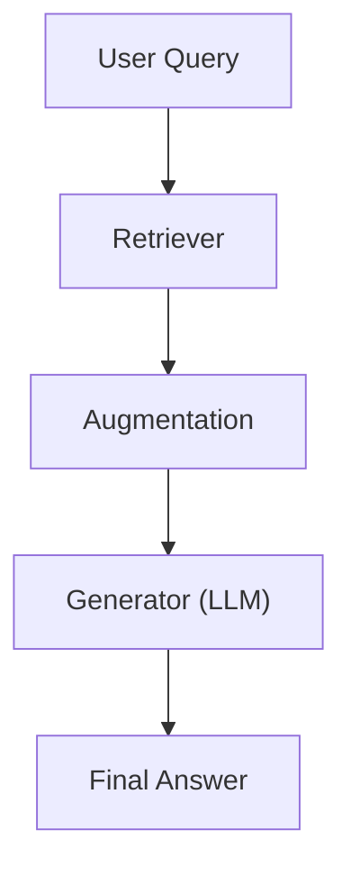
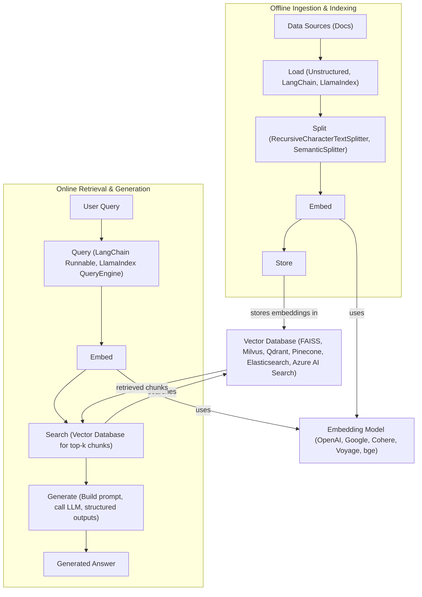
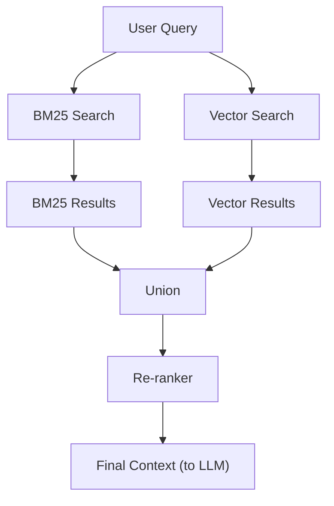
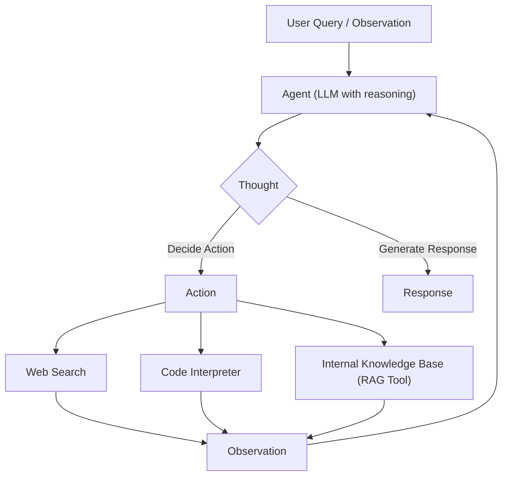

# Giving LLMs an Open-Book Exam
### From Vanilla RAG to Agentic Retrieval

In **Lesson 3**, we introduced the concept of **Context Engineering**. We established that managing the information flow to Large Language Models (LLMs) is one of the most critical skills for an AI Engineer. You learned that an LLM's output is only as good as the context you provide.

Now, we are going to double down on the most popular and effective implementation of Context Engineering: **Retrieval-Augmented Generation (RAG)**.

To understand why RAG is essential, we must look at how LLMs are trained. When a model like GPT-4 or Claude 3 is trained, it is essentially taking a **closed-book exam** on the world's information. It memorizes patterns, facts, and reasoning styles from a massive dataset. However, once that training is complete, the model is frozen in time. It doesn't know about the news that happened this morning, and it certainly doesn't know about your company's private Notion docs or SQL databases.

We currently lack efficient techniques to enable models to learn new information continuously after their initial training. We cannot simply update the model's weights with every new email or report generated in a company. While fine-tuning exists, it is often too slow, expensive, and prone to "catastrophic forgetting" to be a viable solution for real-time knowledge updates.

If you ask a standard model about your specific Q3 financial report, it will either refuse to answer or, worse, hallucinate a plausible-sounding but completely fake response.

**Retrieval-Augmented Generation (RAG)** is the solution to this problem. It changes the test from a closed-book exam to an **open-book exam**. Instead of forcing the model to rely on its internal, static weights (parametric memory), we provide it with a mechanism to look up relevant information from external sources before generating an answer [[1]](https://blogs.nvidia.com/blog/what-is-retrieval-augmented-generation/).

This lesson will take you through the RAG landscape. We will start with the core components of a standard RAG system, move through the engineering pipeline required to build one, and explore advanced techniques to improve retrieval quality. Finally, we will bridge the gap to our current focus: **Agentic RAG**. You will see how retrieval transforms from a static pipeline into a dynamic tool that autonomous agents use to reason, verify, and learn.

With the problem and motivation clear, we’ll first decompose RAG into its core components so you can see where each responsibility lives.

## The RAG System: Core Components

Designing an effective RAG system is the first major step in applying Context Engineering principles to production systems. While the implementation details can get complex, the conceptual architecture rests on three pillars: **Retrieval**, **Augmentation**, and **Generation**.

### 1. Retrieval
This is the search engine of your system. Its job is to find the most relevant needles in your data haystack based on the user's query. While traditional search engines often rely on keyword matching, modern RAG systems primarily use **vector embeddings**.

An embedding is a list of numbers (a vector) that represents the semantic meaning of a piece of text. When you turn text into numbers, you can calculate the mathematical distance between them. If the vector for "how to reset password" is mathematically close to the vector for "account recovery steps," the system knows they are related. This works even if they don't share the exact same keywords. These vectors are stored in a **Vector Database**, which is optimized to perform these similarity searches at scale [[2]](https://towardsai.net/p/l/a-complete-guide-to-rag).

The retrieval component is critical because it acts as the primary filter. If this step fails to find the correct document, the downstream LLM has no chance of answering the question correctly. It is the foundation of the entire system.

### 2. Augmentation
Once the relevant information is retrieved, it must be processed. We don't just dump raw database rows into the LLM. Augmentation is the process of formatting this data. We filter it, order it, and wrap it in a prompt structure that tells the LLM: "Here is some background information. Use this to answer the user's question."

This step often involves managing the "context window" of the LLM. Models have a limit on how much text they can process. Thus, augmentation involves selecting only the most pertinent parts of the retrieved documents. We might summarize them and arrange them to maximize the model's attention on key facts.

### 3. Generation
Finally, the augmented prompt is sent to the LLM. The model uses its reasoning capabilities to synthesize the retrieved information into a coherent answer. The "Generation" happens here. The LLM acts as the reasoning engine, while your retrieved data acts as the source of truth [[3]](https://decodingml.substack.com/p/rag-fundamentals-first?utm_source=publication-search).

This entire flow is visualized in Image 1 below.

<diagram_caption>
Image 1: The core components and data flow within a RAG (Retrieval-Augmented Generation) system.
</diagram_caption>

Now that you can name each moving part, let’s see how they line up across the two phases of a real system.

## The RAG Pipeline: Ingestion and Retrieval

A production RAG system is rarely a single script. It is usually split into two distinct phases: the **Offline Ingestion** phase (preparing the data) and the **Online Retrieval** phase (answering questions). This separation is illustrated in Image 2.

### Phase 1: Offline Ingestion & Indexing

Before you can search anything, you need to build your index. This runs asynchronously from the user requests.

**Load:** You need to extract text from your data sources. This could be scraping websites, reading PDFs, or connecting to APIs like Notion or Slack. Tools like LangChain or LlamaIndex provide loaders for almost any format. The goal here is to standardize the input into a clean text format, stripping away HTML tags or PDF artifacts that might confuse the embedding model [[2]](https://towardsai.net/p/l/a-complete-guide-to-rag).

**Split:** LLMs have context windows (limits on how much text they can process), and embedding models work best on smaller chunks of text. You cannot feed a 300-page book as one vector. You must split the document into smaller, meaningful chunks. A common strategy is `RecursiveCharacterTextSplitter`, which tries to keep paragraphs and sentences together rather than cutting a sentence in half. It uses a hierarchy of separators (like double newlines for paragraphs, then single newlines, then spaces) to ensure semantic coherence. We also often include an "overlap" between chunks to ensure that context isn't lost at the boundaries [[10]](https://learn.microsoft.com/en-us/azure/developer/ai/advanced-retrieval-augmented-generation).

**Embed:** You pass these text chunks through an **Embedding Model** (like OpenAI's `text-embedding-3` or models from Cohere and Voyage). This converts the human-readable text into those semantic vectors we discussed earlier. The quality of your embedding model directly dictates how well your system "understands" the nuance of your data.

**Store:** Finally, you save the vectors and the original text into a **Vector Database** (such as Pinecone, Qdrant, or Milvus). This database builds an index that allows for ultra-fast similarity searches. It doesn't just store the data. It organizes it using algorithms like HNSW (Hierarchical Navigable Small World) to allow finding the nearest neighbors in milliseconds, even among millions of records.

### Phase 2: Online Retrieval & Generation

This happens in real-time when a user asks a question.

**Query:** The user submits a question. Often, we normalize or rewrite this query to make it clearer. For instance, if a user asks "how much is it?", the system might need to rewrite this to "what is the pricing for the enterprise plan?" based on conversation history.

**Embed:** To compare the user's question to your database, you must convert the question into a vector using the **exact same embedding model** you used during ingestion. If you use a different model, the vectors will exist in different "latent spaces" and the comparison will be meaningless.

**Search:** The vector database compares the query vector against the millions of stored document vectors and returns the top-k (e.g., top 5 or 10) most similar chunks. This is typically done using Cosine Similarity or Euclidean Distance. The database returns the chunks that are geometrically closest to the query vector.

**Generate:** You construct a prompt containing the user's query and the text from those top-k chunks. You send this to the LLM, which generates the final answer. As we learned in **Lesson 4**, using structured outputs here is necessary if you need citations or specific formats. This ensures the model doesn't just chat, but provides a rigorous answer grounded in the provided text [[3]](https://decodingml.substack.com/p/rag-fundamentals-first?utm_source=publication-search).

<diagram_caption>
Image 2: The end-to-end RAG workflow, split into two main phases: "Offline Ingestion & Indexing" and "Online Retrieval & Generation".
</diagram_caption>

With the end-to-end path in place, the next question is quality: what are the advanced techniques to make the retrieval more accurate and useful across messy, real-world data?

## Advanced RAG Techniques

The "Vanilla RAG" pipeline described above works well for simple demos. However, in production, it often fails. It might retrieve irrelevant documents because of keyword mismatches or miss the context because a chunk was cut in the wrong place. To build robust systems, we need advanced techniques.

### Hybrid Search
Vector search is amazing at understanding concepts, but it can be fuzzy with specific terms. If a user searches for a specific error code like "ERR-505," a pure vector search might return general articles about "errors" but miss the exact document containing that code. This is known as the "lexical gap."

**Hybrid Search** combines the best of both worlds: it uses **BM25** (a modern version of keyword search) for exact matching and vector search for semantic understanding.
For example, in a customer support scenario, if a user writes "my bill keeps rolling over," keyword search finds articles with the word "rollover." Meanwhile, vector search understands the context and finds articles about "carryover balances." Combining them ensures you don't miss either. You typically combine the scores from both searches using an algorithm like Reciprocal Rank Fusion (RRF) to get a unified ranking [[10]](https://learn.microsoft.com/en-us/azure/developer/ai/advanced-retrieval-augmented-generation).

### Re-ranking
Retrieval is often a trade-off between speed and accuracy. Vector databases are fast but use compressed representations of data (embeddings). To improve accuracy, we use a **Re-ranker**.

A re-ranker is a specialized model (like a Cross-Encoder) that takes the user's query and a candidate document and outputs a precise relevance score. Unlike bi-encoder models used for fast vector search, a cross-encoder processes them together. This allows it to understand the deep interaction between the two texts.

Because this process is computationally expensive, we don't run it on the whole database. Instead, we retrieve the top 50 documents using fast vector search, and then use the re-ranker to sort them and keep only the top 5. For example, if a user asks "how to connect my account," the re-ranker pushes the step-by-step setup guide above a press release. This substantially improves the quality of the context passed to the LLM, ensuring that the limited context window is filled with only the most pertinent information [[4]](https://decodingml.substack.com/p/your-rag-is-wrong-heres-how-to-fix?utm_source=publication-search).

### Query Transformations
Users rarely ask perfect questions. They might be vague, complex, or assume you know the context. **Query Decomposition** breaks a complex question into smaller sub-questions.
If a user asks, "What is our travel policy for conferences in Europe this year?", the system might fail to find a single document matching all those criteria. Instead, we decompose it:
1. "Where is the travel policy?"
2. "What counts as a conference?"
3. "What are the rules for Europe?"
4. "What changed in the policy this year?"

We retrieve documents for each sub-question and then synthesize the answer. This ensures that we gather all the necessary puzzle pieces before trying to solve the puzzle.

Another powerful technique is **HyDE (Hypothetical Document Embeddings)**. Instead of searching for the user's question, the LLM first generates a hypothetical *answer* to the question. We then embed that hypothetical answer and search for documents that look like it. This often aligns better with the actual content in your database because you are matching "answer-to-answer" rather than "question-to-answer" [[8]](https://www.llamaindex.ai/blog/rag-is-dead-long-live-agentic-retrieval).

### Advanced Chunking Strategies
How you split your data matters. Fixed-size chunking (e.g., every 500 characters) is naive. It might cut a table in half or separate a header from its content.

**Semantic Chunking** splits text based on meaning rather than character count. It uses an embedding model to detect when the topic of the text changes and places the split there. This keeps coherent thoughts together.

**Contextual Retrieval** involves adding context to each chunk before embedding it. If a chunk says "The revenue grew by 5%," it's meaningless on its own. Contextual retrieval prepends "In the Q3 2023 financial report for Acme Corp..." to the chunk, making it retrievable even in isolation [[6]](https://www.anthropic.com/news/contextual-retrieval).

**Layout-aware chunking** is vital for complex documents like tables. For a pricing table, keeping each row together (product → price → discount) is better than slicing the page by character count. This prevents separating numbers from their labels.

### GraphRAG
Sometimes, the answer isn't in a single document but in the *connections* between them. **GraphRAG** uses Knowledge Graphs to model entities and relationships. It solves problems where understanding the "how" and "why" between data points is as important as the data itself.

Consider a retail query: "Which shoes get the most size-related returns and were featured in last month’s ads?" The system connects returns to the sizing reason, then to specific SKUs, and finally to the marketing calendar. It pulls supporting notes to form a complete answer.

Similarly, in IT operations, a user might ask: "Which incidents were caused by weekend deploys that also touched the login service?" GraphRAG links Change Record → Deploy Time → Affected Service → Incident Ticket. It traverses these relationships to retrieve the full context, solving the "multi-hop" reasoning problem that vector search often fails at [[5]](https://arxiv.org/html/2404.16130).

The flow of these advanced techniques is summarized in Image 3.

<diagram_caption>
Image 3: The hybrid retrieval flow in advanced RAG.
</diagram_caption>

These techniques increase retrieval quality. Next, we’ll see how retrieval becomes one tool that an agent can choose to use as it reasons.

## Agentic RAG

So far, we have looked at RAG as a linear pipeline: Input $\rightarrow$ Retrieve $\rightarrow$ Generate. This is powerful, but rigid. If the retrieval step fails to find the right information, the linear pipeline has no way to recover. It just generates a bad answer.

**Agentic RAG** fundamentally alters the approach by treating retrieval not as a fixed step, but as a **tool** in an agent's toolkit.

Recall **Lesson 7** and **Lesson 8**, where we built ReAct agents. An agent operates in a loop: **Thought $\rightarrow$ Action $\rightarrow$ Observation**. In Agentic RAG, the "Action" is calling the retrieval engine.

### The Shift: From Pipeline to Toolkit
In **Standard RAG**, the flow is pre-determined. Every query triggers a search.
In **Agentic RAG**, the agent is autonomous. It decides *if* it needs to retrieve information, *what* specifically to search for, and *how* to interpret the results [[7]](https://weaviate.io/blog/what-is-agentic-rag).

This enables several powerful capabilities. First, the agent can perform **Iterative Retrieval**. It can refine its search. For example, an agent searches for "Apple revenue." The results are ambiguous (Apple fruit vs. Apple Inc.). The agent observes this, refines the query to "Apple Inc. revenue 2024," and searches again. A linear pipeline would have just failed.

Second, it allows for **Selective Routing**. The agent can choose *where* to search. If you ask about a system outage, the agent can decide to search the `incident_runbooks` index. If you ask about pricing, it chooses the `marketing_pages` index. It doesn't waste time searching irrelevant data sources [[9]](https://www.ibm.com/think/topics/agentic-rag).

Finally, the agent can perform **Information Fusion**. It can combine RAG with other tools. The agent retrieves an internal policy document that references a specific EU regulation. It then uses a `web_search` tool to find the latest text of that regulation and synthesizes an answer that combines internal policy with external legal requirements.

### Concept in Action
This shift represents the difference between a database lookup and a research assistant. A database lookup gives you exactly what you asked for, even if it's wrong. A research assistant (Agentic RAG) thinks about your question, looks up information, realizes something is missing, looks up more information, and then gives you a complete answer.

In the "Thought" step of the ReAct loop, the agent reasons about its knowledge gaps.
*   **Thought:** "The user is asking about the 2024 EU data retention rules. My internal policy document is from 2023. I need to verify if there have been updates."
*   **Action:** `web_search("EU data retention directive updates 2024")`
*   **Observation:** "Found a new directive update released in Jan 2024."
*   **Thought:** "I need to compare this with our internal policy."
*   **Action:** `retrieve(internal_policy, query="data retention duration")`

This dynamic behavior transforms RAG from a static retrieval mechanism into an active reasoning engine. This loop is illustrated in Image 4.

<diagram_caption>
Image 4: An agent's main loop in an Agentic RAG system.
</diagram_caption>

You now understand both a linear RAG pipeline and how an agent can control retrieval when needed. Let’s wrap up by situating RAG in the wider AI Engineering toolkit and previewing what comes next.

## Conclusion

In this lesson, we explored how Retrieval-Augmented Generation (RAG) solves the fundamental limitation of static LLMs by giving them an "open-book" capability. We broke down the RAG system into its core components—Retrieval, Augmentation, and Generation—and walked through the engineering pipeline required to ingest and retrieve data effectively.

We also looked at how advanced techniques like Hybrid Search and GraphRAG can substantially improve the quality of retrieved information. Most importantly, we saw how RAG evolves from a linear pipeline into **Agentic RAG**, where retrieval becomes a dynamic tool that autonomous agents use to reason, verify, and learn. RAG is not just a feature. It is a foundational competency for any AI Engineer working on **Context Engineering**.

In the next lesson, **Lesson 10**, we will explore **Memory for Agents**. While RAG provides access to external knowledge, memory allows agents to retain context over time, bridging the gap between short-term interactions and long-term learning.

We will also touch on **Multimodal Processing** in Lesson 11, where we will see how agents can handle documents, images, and complex data types. Later in the course, we will cover how to evaluate these retrieval systems and monitor them in production, ensuring your agents remain accurate and reliable in the real world.

## References

1. What Is Retrieval-Augmented Generation, aka RAG? (n.d.). NVIDIA Blog.  https://blogs.nvidia.com/blog/what-is-retrieval-augmented-generation/ 

2. A Complete Guide to RAG. (n.d.). Towards AI.  https://towardsai.net/p/l/a-complete-guide-to-rag 

3. Iusztin, P. (2024, July 16). Retrieval-Augmented Generation (RAG) Fundamentals First. Decoding AI Magazine.  https://decodingml.substack.com/p/rag-fundamentals-first?utm_source=publication-search 

4. Iusztin, P. (2024, July 23). Your RAG is wrong: Here's how to fix it. Decoding AI Magazine.  https://decodingml.substack.com/p/your-rag-is-wrong-heres-how-to-fix?utm_source=publication-search 

5. Edge, D., Trinh, H., Cheng, N., Bradley, J., Zhang, C., & Rosser, E. (2024). From Local to Global: A GraphRAG Approach to Query-Focused Summarization. arXiv.  https://arxiv.org/html/2404.16130 

6. Introducing Contextual Retrieval. (n.d.). Anthropic.  https://www.anthropic.com/news/contextual-retrieval 

7. What is Agentic RAG. (n.d.). Weaviate.  https://weaviate.io/blog/what-is-agentic-rag 

8. Liu, J. (n.d.). RAG is dead, long live agentic retrieval. LlamaIndex.  https://www.llamaindex.ai/blog/rag-is-dead-long-live-agentic-retrieval 

9. What is agentic RAG? (n.d.). IBM.  https://www.ibm.com/think/topics/agentic-rag 

10. Build advanced retrieval-augmented generation systems. (n.d.). Microsoft Learn.  https://learn.microsoft.com/en-us/azure/developer/ai/advanced-retrieval-augmented-generation 

11. The Rise of RAG. (n.d.). High Learning Rate.  https://highlearningrate.substack.com/p/the-rise-of-rag