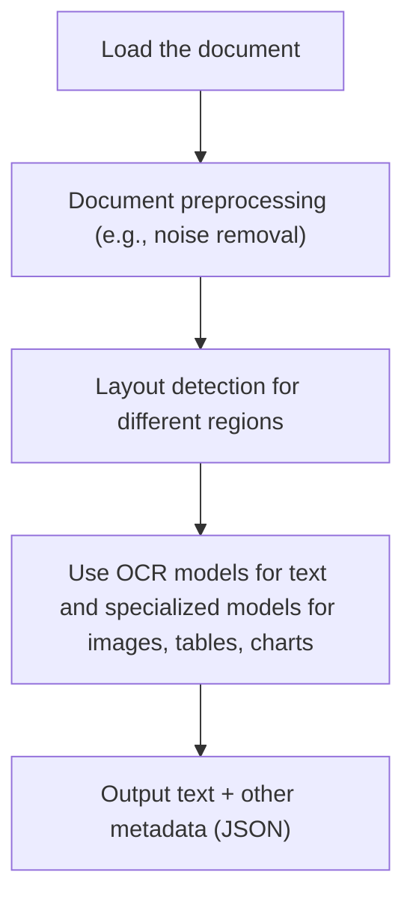
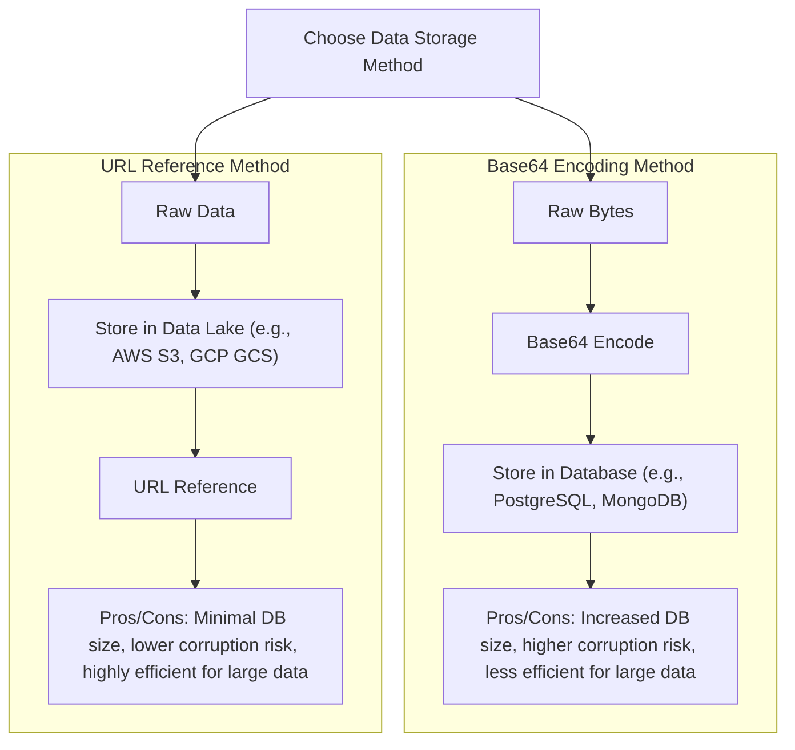
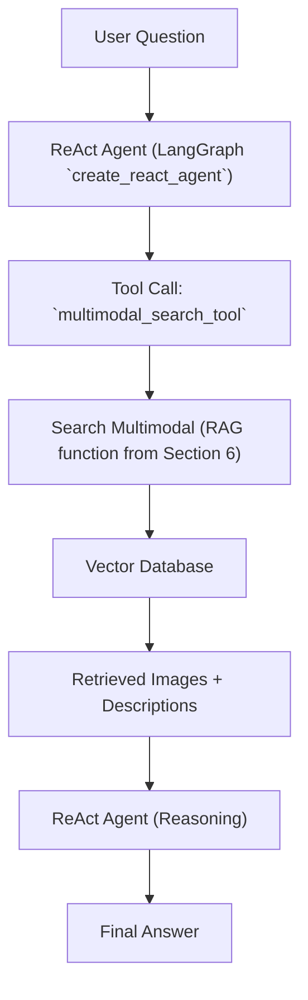

# Multimodal Data: The End of OCR
### Why top AI engineers are ditching text extraction for native vision processing

In the previous lessons of Part 1, we covered the essential building blocks of AI Engineering: from the difference between workflows and agents to context engineering, structured outputs, and RAG. We learned how to give our agents tools, memory, and the ability to reason using patterns like ReAct.

However, we have ignored a massive part of the real world. We have been operating in a text-only bubble.

In reality, enterprise data is rarely just clean text. It is messy. It comes in PDF reports full of charts, scanned invoices, technical diagrams, and images. For a long time, the standard solution was to force everything into text using Optical Character Recognition (OCR). We would spend weeks engineering pipelines to strip away the visual context, turning a rich, colorful diagram into a garbled string of text, hoping the LLM could make sense of it.

This lesson changes that. We will explore how to work with **multimodal data**—text, images, and documents—natively. We will move away from brittle OCR pipelines and learn how to feed visual data directly into LLMs.

By the end of this lesson, you will know how to:
1.  Understand the architecture of multimodal LLMs.
2.  Process images and PDFs using raw bytes, Base64, and URLs.
3.  Build a multimodal RAG system that retrieves information based on visual semantics.
4.  Integrate multimodal retrieval into a ReAct agent.

## Limitations of traditional document processing

To understand why we need multimodal AI, we must first look at how we used to solve document processing.

Suppose we want to build an AI agent that answers questions about financial reports. These documents are usually PDFs containing a mix of text, data tables, and trend charts. In a traditional text-only workflow, we cannot simply pass the PDF to the model. We have to convert it to text first.

This typically involves a complex pipeline:
1.  **Load the document.**
2.  **Preprocess** the pages (noise removal, deskewing).
3.  **Detect layouts** to distinguish between headers, paragraphs, tables, and images.
4.  **Apply specialized models**: OCR for text, table extraction models for grids, and captioning models for images.
5.  **Reconstruct** the output into a structured format like JSON or Markdown.


Image 1: The traditional document processing workflow using OCR.

This approach is fragile. It has too many moving pieces. If the layout detector fails to recognize a table, the OCR model reads it as a stream of nonsensical text. If a chart uses color coding to convey information (e.g., red for losses, green for gains), the OCR completely ignores it.

The performance challenges are significant. Advanced OCR engines still struggle with handwritten text, stylized fonts, and complex multi-column layouts. Research shows that even state-of-the-art OCR solutions fall approximately 4.5% short of ground-truth text performance on complex documents. Furthermore, multimodal retrieval systems that bypass OCR entirely have shown up to 12% higher retrieval accuracy compared to perfect text extraction [[1]](https://www.mixedbread.com/blog/the-hidden-ceiling). When an OCR error occurs early in the pipeline—such as misreading a decimal point in a financial table—it cascades downstream, causing the LLM to hallucinate or provide incorrect answers.

Image 2: Complex document recognition where OCR fails. (Source [HackerNoon [2]](https://hackernoon.com/complex-document-recognition-ocr-doesnt-work-and-heres-how-you-fix-it))

This rigidity does not scale in a world of AI agents that need to be flexible and fast. That is why modern AI solutions use multimodal LLMs, such as Gemini, GPT-4o, or Claude. These models can directly interpret text, images, and PDFs as native input, completely bypassing the OCR workflow.

## Foundations of multimodal LLMs

Before writing code, we need an intuition of how these models work. As an AI Engineer, you don't need to know the math behind backpropagation, but you do need to understand the architecture to optimize and debug your systems.

There are two common approaches to building multimodal LLMs: the **Unified Embedding Decoder** and the **Cross-modality Attention** architecture.

Image 3: The two main approaches to developing multimodal LLM architectures. (Image by Sebastian Raschka from [Understanding Multimodal LLMs [3]](https://magazine.sebastianraschka.com/p/understanding-multimodal-llms))

### Unified Embedding Decoder

In this architecture, the model treats images almost exactly like text. Just as we tokenize text into smaller chunks (tokens), we chop an image into small squares called "patches." These patches are passed through an **image encoder** (like a Vision Transformer) which converts them into embeddings.

The key step is a **projection layer**. This aligns the image embeddings with the text embeddings, ensuring they exist in the same vector space and have the same dimensions. To the LLM, the image is just a sequence of tokens, indistinguishable from text tokens. We simply concatenate them: `[Image Tokens] + [Text Tokens]`.

Image 4: The unified embedding decoder architecture. (Image by Sebastian Raschka from [Understanding Multimodal LLMs [3]](https://magazine.sebastianraschka.com/p/understanding-multimodal-llms))

This method is simpler to implement and generally offers higher accuracy for OCR-related tasks because the model "reads" the image tokens sequentially, similar to how it reads text.

### Cross-modality Attention

The second approach keeps the image and text streams separate for longer. Instead of feeding image tokens into the input sequence, they are injected directly into the model's attention mechanism.

Image 5: The Cross-Modality Attention Architecture. (Image by Sebastian Raschka from [Understanding Multimodal LLMs [3]](https://magazine.sebastianraschka.com/p/understanding-multimodal-llms))

This is often more computationally efficient for high-resolution images because we don't clog the context window with thousands of image tokens. However, it requires more complex training procedures.

### Image Encoders

Regardless of the architecture, most systems rely on an image encoder. You can think of this as the visual equivalent of a tokenizer.

Image 6: Image tokenization and embedding (left) and text tokenization and embedding (right) side by side. (Image by Sebastian Raschka from [Understanding Multimodal LLMs [3]](https://magazine.sebastianraschka.com/p/understanding-multimodal-llms))

Models like **CLIP** (Contrastive Language-Image Pre-Training) or **SigLIP** are standard here. They are trained on massive datasets of image-text pairs to understand that a picture of a dog and the text "a dog" are semantically similar.

Image 7: A classic vision transformer (ViT) setup. (Image by Sebastian Raschka from [Understanding Multimodal LLMs [3]](https://magazine.sebastianraschka.com/p/understanding-multimodal-llms))

This shared vector space is critical not just for LLMs, but for **Multimodal RAG**. Because the text and image embeddings are aligned, we can calculate the similarity between a user's text question and a database of images.

Image 8: Text and image embeddings mapped into a common space. (Image by Shawhin Talebi from [Multimodal Embeddings: An Introduction [4]](https://towardsdatascience.com/multimodal-embeddings-an-introduction-5dc36975966f/))

In 2025, most frontier models—Llama 4, Gemma 2, GPT-5, Gemini 2.5—are natively multimodal. They support text, images, and often audio/video inputs. Innovations in this space are happening rapidly, but the core principle remains: we no longer translate visuals to text; we process visuals as visuals.

It is important to distinguish multimodal LLMs from diffusion models like Midjourney or Stable Diffusion. While multimodal LLMs focus on understanding and reasoning about visual inputs, diffusion models are specialized for generating images from text. We do not cover diffusion models in this course as they are not reasoning agents, but you can easily integrate them as tools within an agentic workflow.

## Applying multimodal LLMs to images and PDFs

Now that we understand the theory, let's look at the practical side. When working with LLM APIs like Gemini, there are three core ways to handle multimodal data: **Raw Bytes**, **Base64**, and **URLs**.

1.  **Raw Bytes**: This is the most efficient method for one-off API calls where you have the file in memory. However, raw bytes are binary data, which makes them difficult to store in standard text-based databases without corruption.
2.  **Base64**: This encodes binary data into a text string. It is the standard for storing images in NoSQL databases (like MongoDB) or sending them inside JSON payloads. The downside is that Base64 strings are approximately 33% larger than the original binary file, which increases latency and storage costs.
3.  **URLs**: This is the enterprise standard. Instead of passing the actual image data to the LLM, you pass a link to where the data is stored (e.g., an AWS S3 or Google Cloud Storage bucket). The LLM fetches the data directly. This minimizes network overhead for your application and prevents data corruption.


Image 9: A flowchart comparing Base64 encoding with databases versus URL references with data lakes for multimodal data storage.

Let's implement these concepts using the Gemini API.

1.  First, let's define a helper function to load an image as raw bytes. We use the `WEBP` format because it is highly efficient for transmission.
    ```python
    def load_image_as_bytes(
        image_path: Path, format: Literal["WEBP", "JPEG", "PNG"] = "WEBP", max_width: int = 600
    ) -> bytes:
        """Load an image from file path and convert it to bytes."""
        image = PILImage.open(image_path)
        if image.width > max_width:
            ratio = max_width / image.width
            new_size = (max_width, int(image.height * ratio))
            image = image.resize(new_size)

        byte_stream = io.BytesIO()
        image.save(byte_stream, format=format)
        return byte_stream.getvalue()
    ```

2.  We can now load an image and pass it directly to the model.
    ```python
    image_bytes = load_image_as_bytes(image_path=Path("images") / "image_1.jpeg")
    
    response = client.models.generate_content(
        model=MODEL_ID,
        contents=[
            types.Part.from_bytes(data=image_bytes, mime_type="image/webp"),
            "Tell me what is in this image in one paragraph.",
        ],
    )
    print(response.text)
    ```
    It outputs:
    ```text
    This striking image features a massive, dark metallic robot... Perched playfully on its right arm is a small, fluffy grey tabby kitten...
    ```

3.  We can scale this to multiple images. For instance, we can pass two images and ask the model to compare them.
    ```python
    response = client.models.generate_content(
        model=MODEL_ID,
        contents=[
            types.Part.from_bytes(data=image_bytes_1, mime_type="image/webp"),
            types.Part.from_bytes(data=image_bytes_2, mime_type="image/webp"),
            "What's the difference between these two images?",
        ],
    )
    ```

4.  Next, let's look at Base64. We use this when we need to serialize the image into a text format, often for database storage or JSON payloads.
    ```python
    def load_image_as_base64(image_path: Path) -> str:
        image_bytes = load_image_as_bytes(image_path, return_size=False)
        return base64.b64encode(cast(bytes, image_bytes)).decode("utf-8")

    image_base64 = load_image_as_base64(Path("images") / "image_1.jpeg")
    
    # Base64 is larger than raw bytes
    print(f"Base64 overhead: {(len(image_base64) - len(image_bytes)) / len(image_bytes) * 100:.2f}%")
    ```
    It outputs:
    ```text
    Base64 overhead: 33.34%
    ```
    We pass this to the model similarly, just ensuring we handle the decoding or use the client's helper methods if available.

5.  For public URLs, Gemini offers a `url_context` tool that can fetch and parse content from the web.
    ```python
    response = client.models.generate_content(
        model=MODEL_ID,
        contents="Based on the provided paper as a PDF, tell me how ReAct works: https://arxiv.org/pdf/2210.03629",
        config=types.GenerateContentConfig(tools=[{"url_context": {}}]),
    )
    print(response.text)
    ```
    It outputs:
    ```text
    ReAct is a novel paradigm for large language models (LLMs) that combines reasoning (Thought) and acting (Action)...
    ```

6.  For private data lakes (like Google Cloud Storage), you would pass the URI directly.
    ```python
    # Pseudocode for GCS
    response = client.models.generate_content(
        model=MODEL_ID,
        contents=[
            types.Part.from_uri(uri="gs://my-bucket/image.jpeg", mime_type="image/jpeg"),
            "Describe this image.",
        ],
    )
    ```

7.  Let's look at a complex use case: **Object Detection**. Instead of just describing an image, we want structured data about where objects are located. We use Pydantic models to define the output schema.
    ```python
    class BoundingBox(BaseModel):
        ymin: float
        xmin: float
        ymax: float
        xmax: float
        label: str

    class Detections(BaseModel):
        bounding_boxes: list[BoundingBox]

    prompt = """
    Detect all of the prominent items in the image. 
    The box_2d should be [ymin, xmin, ymax, xmax] normalized to 0-1000.
    """
    
    response = client.models.generate_content(
        model=MODEL_ID,
        contents=[types.Part.from_bytes(data=image_bytes, mime_type="image/webp"), prompt],
        config=types.GenerateContentConfig(
            response_mime_type="application/json",
            response_schema=Detections,
        ),
    )
    ```
    The model returns exact coordinates which we can then plot on the image.

8.  We can apply the exact same logic to PDFs. To the model, a PDF page is just another visual input.
    ```python
    pdf_bytes = (Path("pdfs") / "attention_is_all_you_need_paper.pdf").read_bytes()
    
    response = client.models.generate_content(
        model=MODEL_ID,
        contents=[
            types.Part.from_bytes(data=pdf_bytes, mime_type="application/pdf"),
            "What is this document about?",
        ],
    )
    ```

9.  We can also process PDFs using Base64, which is useful if you are retrieving the document from a NoSQL database.
    ```python
    def load_pdf_as_base64(pdf_path: Path) -> str:
        with open(pdf_path, "rb") as f:
            return base64.b64encode(f.read()).decode("utf-8")

    pdf_base64 = load_pdf_as_base64(Path("pdfs") / "attention_is_all_you_need_paper.pdf")

    response = client.models.generate_content(
        model=MODEL_ID,
        contents=[
            "What is this document about?",
            types.Part.from_bytes(data=pdf_base64, mime_type="application/pdf"),
        ],
    )
    ```

10. Finally, we can perform object detection directly on PDF pages. This is incredibly powerful for extracting diagrams or specific visual elements from technical papers.
    ```python
    # Load a specific page as an image
    image_bytes = load_image_as_bytes(Path("images") / "attention_is_all_you_need_1.jpeg")
    
    prompt = """
    Detect all the diagrams from the provided image as 2d bounding boxes. 
    The box_2d should be [ymin, xmin, ymax, xmax] normalized to 0-1000.
    """

    response = client.models.generate_content(
        model=MODEL_ID,
        contents=[types.Part.from_bytes(data=image_bytes, mime_type="image/webp"), prompt],
        config=types.GenerateContentConfig(
            response_mime_type="application/json",
            response_schema=Detections,
        ),
    )
    ```
    This works even for identifying diagrams within a PDF page, proving that we no longer need complex OCR pipelines to extract information from technical documents.

## Foundations of multimodal RAG

One of the most common use cases when working with multimodal data is Retrieval-Augmented Generation (RAG). In Lesson 10, we covered text RAG. But what if your knowledge base is full of images, slides, and scanned PDFs? Stuffing 1000+ PDF pages into your LLM to get a simple answer on your company's last quarter revenue is unfeasible.

A generic multimodal RAG architecture looks like this:
1.  **Ingestion:** We use a multimodal embedding model (like CLIP or Google's multimodal embeddings) to convert images into vectors. These are stored in a vector database.
2.  **Retrieval:** When a user asks a question, we embed their text query into the same vector space.
3.  **Search:** We retrieve the top-k most similar images based on cosine similarity.

```mermaid
graph TD
    subgraph "Ingestion Pipeline"
        A["Images"] --> B["Text-Image Embedding Model (Ingestion)"]
        B --> C[(Vector Database (Image Embeddings))]
    end

    subgraph "Retrieval Pipeline"
        D["User Text Query"] --> E["Text-Image Embedding Model (Retrieval)"]
        E --> F["Query Vector"]
        F --> G[(Vector Database (Similarity Search))]
        G --> H["Retrieve Top-K Similar Images"]
    end
```
Image 10: The ingestion and retrieval pipelines of a generic multimodal RAG system using images and text.

For enterprise documents, the state-of-the-art architecture in 2025 is **ColPali**.

ColPali (ColBERT + PaliGemma) solves the problem of "lossy" text extraction. Instead of OCRing a PDF, ColPali treats every page as an image. It uses a Vision-Language Model to create "multi-vector embeddings" for each page.

Unlike traditional dense retrieval which creates one vector per document, ColPali creates a "bag of embeddings" (e.g., one vector for every image patch). During retrieval, it uses a **Late Interaction** mechanism (MaxSim) to compare every token of your query against every patch of the document image.

Image 11: The ColPali architecture. (Source [arXiv [5]](https://arxiv.org/pdf/2407.01449v6))

This bypasses the OCR bottleneck entirely. It captures layout, fonts, and visual elements that text-only models miss. On benchmarks like ViDoRe, ColPali significantly outperforms traditional OCR-based pipelines [[5]](https://arxiv.org/pdf/2407.01449v6).

## Implementing multimodal RAG for images, PDFs and text

Let's build a simple multimodal RAG system. We will create an in-memory vector index containing images and PDF pages (converted to images) and query them using text.

```mermaid
graph TD
    A["Images (from `images` folder and PDF pages as images)"] --> B["Generate Image Description (using Gemini)"]
    B --> C["Embed Text (using Gemini Embedding Model)"]
    C --> D[(In-memory Vector Database (list of dicts))]

    E["User Query"] --> F["Embed Text (using Gemini Embedding Model)"]
    F --> G["Search In-memory Vector Database (Cosine Similarity)"]
    G --> D
    G --> H["Retrieve Top-K Results (Image + Description)"]
```
Image 12: The multimodal RAG example implementation, showing data ingestion and retrieval processes.

1.  First, we need to create our vector index.
    <aside>
    💡 Note: The Gemini Developer API does not currently support direct image embeddings. To work around this for our tutorial, we will first generate a text description of the image using Gemini, and then embed that text. In a production environment using Vertex AI or models like CLIP/ColPali, you would embed the image directly.
    </aside>

    ```python
    def create_vector_index(image_paths: list[Path]) -> list[dict]:
        vector_index = []
        for image_path in image_paths:
            # Load image
            image_bytes = load_image_as_bytes(image_path, format="WEBP")
            
            # Generate description (Workaround for lack of direct image embedding in Dev API)
            image_description = generate_image_description(image_bytes)
            
            # Embed the description
            image_embedding = embed_text_with_gemini(image_description)
            
            # In a real scenario with a multimodal model, it would look like this:
            # image_bytes = ...
            # SKIPPED !
            # image_description = generate_image_description(image_bytes)
            # image_embeddings = embed_with_multimodal(image_bytes)

            vector_index.append({
                "filename": image_path,
                "description": image_description,
                "embedding": image_embedding,
            })
        return vector_index
    ```

2.  We define the description generation and embedding functions.
    ```python
    def generate_image_description(image_bytes: bytes) -> str:
        img = PILImage.open(io.BytesIO(image_bytes))
        response = client.models.generate_content(
            model=MODEL_ID,
            contents=["Describe this image in detail for semantic search.", img],
        )
        return response.text

    def embed_text_with_gemini(content: str) -> np.ndarray:
        result = client.models.embed_content(
            model="gemini-embedding-001",
            contents=[content],
        )
        return np.array(result.embeddings[0].values)
    ```

3.  We run the ingestion process on our dataset.
    ```python
    image_paths = list(Path("images").glob("*.jpeg"))
    vector_index = create_vector_index(image_paths)
    ```
    Each item in our `vector_index` now contains the filename, the description, and the 3072-dimensional embedding vector.

4.  Now we implement the search function using cosine similarity.
    ```python
    from sklearn.metrics.pairwise import cosine_similarity

    def search_multimodal(query_text: str, vector_index: list[dict], top_k: int = 3):
        query_embedding = embed_text_with_gemini(query_text)
        
        # Calculate similarity between query and all docs
        embeddings = [doc["embedding"] for doc in vector_index]
        similarities = cosine_similarity([query_embedding], embeddings).flatten()
        
        # Get top indices
        top_indices = np.argsort(similarities)[::-1][:top_k]
        
        return [{**vector_index[i], "similarity": similarities[i]} for i in top_indices]
    ```

5.  Let's test it.
    ```python
    query = "what is the architecture of the transformer neural network?"
    results = search_multimodal(query, vector_index, top_k=1)
    ```
    The system correctly retrieves the page from the "Attention Is All You Need" paper containing the architecture diagram.
    
    We can also search for visual concepts:
    ```python
    query = "a kitten with a robot"
    results = search_multimodal(query, vector_index, top_k=1)
    ```
    It returns the image of the kitten and robot we processed earlier. We are searching across PDFs and images simultaneously using natural language.

## Building multimodal AI agents

To consolidate our learning from Part 1, let's integrate this RAG system into a ReAct agent. This agent will be able to reason about a user's question, decide to use the retrieval tool, and then answer based on the visual data it retrieves.


Image 13: The multimodal ReAct agent with RAG functionality.

1.  First, we wrap our search function as a LangChain tool.
    ```python
    @tool
    def multimodal_search_tool(query: str) -> dict:
        """Search through images and descriptions to find relevant content."""
        results = search_multimodal(query, vector_index, top_k=1)
        if not results:
            return {"content": "No results found."}
            
        result = results[0]
        # Return both the text description and the actual image bytes 
        # so the agent can "see" it if needed.
        return {
            "content": [
                {"type": "text", "text": f"Description: {result['description']}"},
                {"type": "image_bytes", "data": result["content"]} 
            ]
        }
    ```

2.  We build the agent using LangGraph's prebuilt `create_react_agent`.
    ```python
    def build_react_agent():
        tools = [multimodal_search_tool]
        system_prompt = "You are a helpful AI assistant that can search through images."
        
        return create_react_agent(
            model=ChatGoogleGenerativeAI(model=MODEL_ID),
            tools=tools,
            state_modifier=system_prompt
        )
        
    agent = build_react_agent()
    ```

3.  Now we ask the agent a question that requires visual lookup.
    ```python
    response = agent.invoke(
        {"messages": [("user", "what color is my kitten?")]}
    )
    ```
    
    The agent executes the following thought process:
    1.  **Thought:** The user is asking about a visual attribute ("color") of a specific object ("kitten"). I need to search for an image of a kitten.
    2.  **Action:** Calls `multimodal_search_tool("kitten")`.
    3.  **Observation:** Receives the image description (and bytes) of the grey tabby kitten with the robot.
    4.  **Reasoning:** The description says it is a "grey tabby kitten".
    5.  **Final Answer:** "Your kitten is a grey tabby."

We have successfully built a multimodal agentic RAG system.

## Conclusion

In this lesson, we moved beyond the limitations of text-only AI. We learned that traditional OCR pipelines are brittle and that modern AI engineering requires native multimodal processing. We explored how to handle images and PDFs using raw bytes, Base64, and URLs, and we built a functional multimodal RAG system that powers a ReAct agent.

This concludes Part 1 of the course. You now have the foundational skills—workflows, agents, context, structured outputs, tools, memory, RAG, and multimodal data—to build robust AI applications.

In **Part 2**, we will stop playing with toy examples. We will start building our capstone project: an interconnected system of a Research Agent and a Writing Agent. You will learn to implement advanced agentic design patterns using LangGraph, equip your agents with web scraping capabilities, and orchestrate a complete multi-agent pipeline.

See you in Part 2.

## References

1. The Hidden Ceiling: Why OCR is the bottleneck for RAG. (n.d.). Mixedbread.  https://www.mixedbread.com/blog/the-hidden-ceiling 

2. Complex Document Recognition: OCR Doesn’t Work and Here’s How You Fix It. (n.d.). HackerNoon.  https://hackernoon.com/complex-document-recognition-ocr-doesnt-work-and-heres-how-you-fix-it 

3. Raschka, S. (2024, October 28). Understanding Multimodal LLMs. Ahead of AI.  https://magazine.sebastianraschka.com/p/understanding-multimodal-llms 

4. Talebi, S. (2024, November). Multimodal Embeddings: An Introduction. Towards Data Science.  https://towardsdatascience.com/multimodal-embeddings-an-introduction-5dc36975966f/ 

5. Faysse, M., et al. (2024). ColPali: Efficient Document Retrieval with Vision Language Models. arXiv.  https://arxiv.org/pdf/2407.01449v6